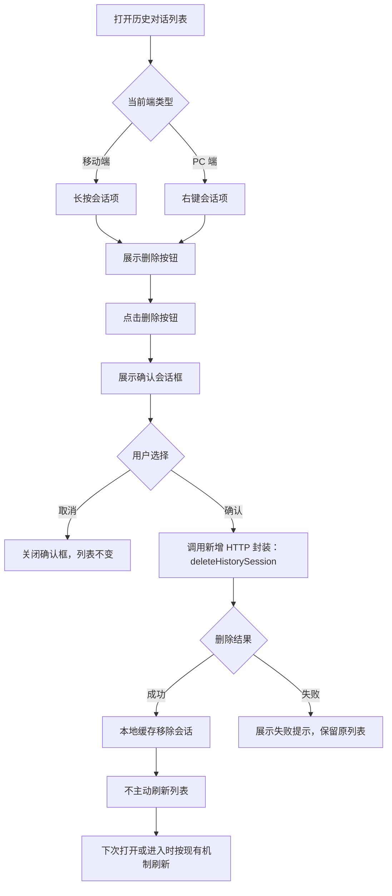
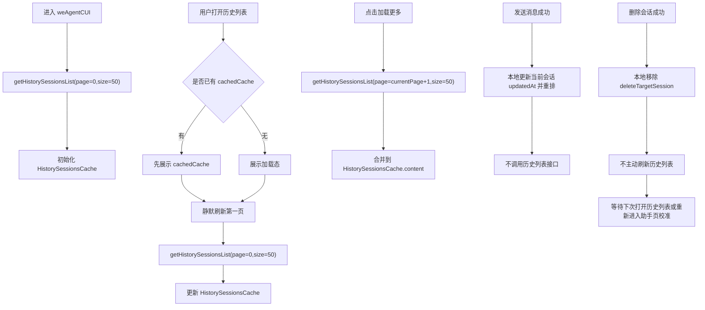
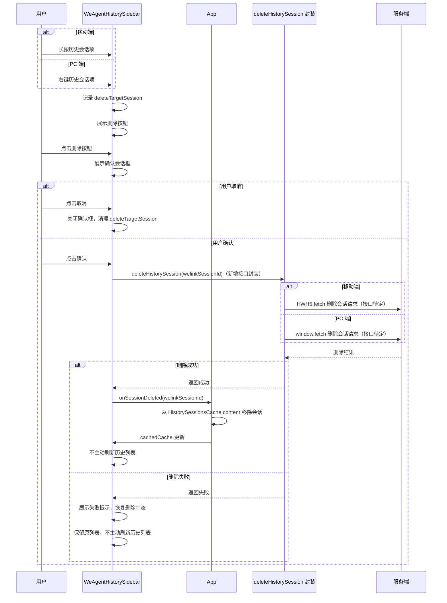
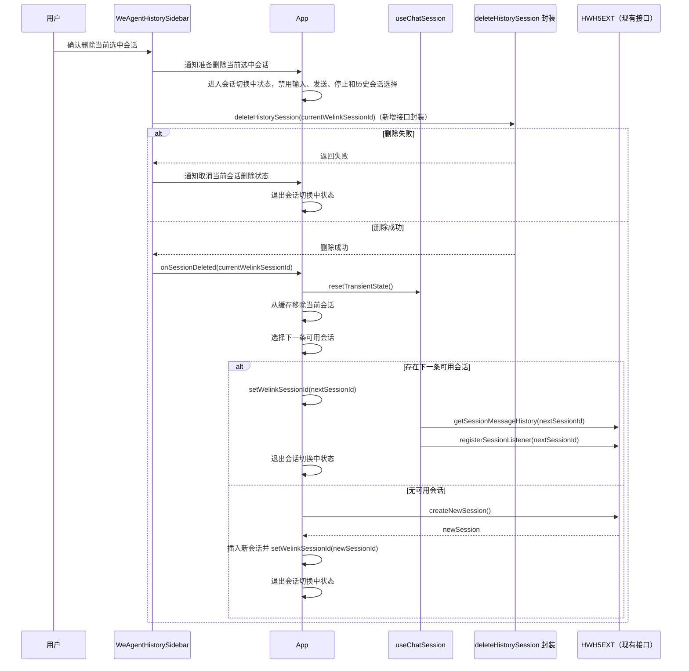
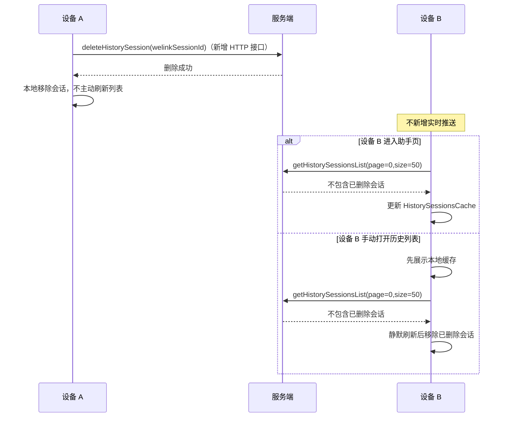

# `WeAgent 历史会话删除方案`

- 方案日期：`2026-06-04`
- 目标工程：`ai-chat-viewer`
- 参考文档：`integration/skillSDK/ai-chat-viewer/docs/plans/技术方案模板.md`、`integration/skillSDK/ai-chat-viewer/docs/we-agent-history-sidebar-default-open.md`
- 方案类型：`功能方案`

## 1. 背景

### 1.1 场景说明

`weAgentCUI` 已支持历史会话列表、默认选中最近会话、新建会话、分页加载、标题更新和发送消息后的排序更新。当前历史列表只支持选择会话，不支持删除会话。移动端用户需要在历史对话列表内通过长按会话项触发删除入口，PC 用户需要通过右键会话项展示删除按钮，并在确认后删除指定会话。

现有历史列表由 `App` 维护 `HistorySessionsCache`，`WeAgentHistorySidebar` 消费缓存并在手动打开时静默刷新第一页。删除能力应继续复用这套缓存模型，避免侧边栏和主页面出现两份不一致状态。

### 1.2 需求目标

1. 移动端 iOS、Android、鸿蒙移动端在历史对话列表长按会话项后，弹出删除按钮。
2. PC 端在历史对话列表右键会话项后，展示删除按钮。
3. 用户点击删除按钮后，弹出确认会话框，提示用户「删除对话后不可回复」。
4. 用户点击「确认」后删除会话；点击「取消」后关闭确认框，不改变会话列表。
5. 删除成功后当前端立即移除本地缓存；不主动刷新历史列表，后续沿用现有刷新机制在下次打开历史列表或进入助手页时校准。
6. 删除流程需要明确历史会话列表刷新时机、用户交互时序、多端同步时序和服务端接口对接位置。

### 1.3 非目标

1. 不新增跨设备实时推送能力；多端同步依赖其他设备后续刷新历史列表。
2. 不实现服务端接口协议细节；接口字段、错误码和鉴权要求暂时留空，等待服务端确认。
3. 不改变现有历史消息分页、流式消息监听和发送消息排序更新规则。
4. 不新增 PC 端键盘快捷键或批量删除能力。

## 2. 方案图

### 2.1 整体方案图

### 2.2 方案核心

删除成功后以 `HistorySessionsCache` 为唯一前端数据源：前端在删除接口成功后立即移除被删除会话，不主动刷新历史列表；后续在用户下次打开历史列表或重新进入助手页时，沿用现有历史刷新机制从服务端校准分页、排序和总数。

### 2.3 历史会话刷新时机

历史会话列表只有进入助手页、打开历史列表和加载更多会触发 `getHistorySessionsList`。发送消息成功和删除会话成功都只更新本地缓存，不新增历史列表接口刷新时机。

## 3. 时序图

### 3.1 用户删除历史会话

### 3.2 删除当前选中会话后的前端状态切换

### 3.3 多端同步

## 4. 技术细节

### 4.1 实现清单

1. `WeAgentHistorySidebar`：新增移动端长按入口、PC 右键入口、删除按钮、确认弹窗和删除中态。
2. `App`：新增 `onSessionDeleted` 处理，统一维护 `HistorySessionsCache`、当前会话切换和无可用会话兜底创建。
3. `deleteHistorySession`：新增统一 HTTP 封装，移动端底层走 `HWH5.fetch`，PC 端底层走 `window.fetch`。
4. i18n：新增删除按钮、确认弹窗、删除成功和删除失败文案。

### 4.2 状态设计

1. `deleteTargetSession`：归属 `WeAgentHistorySidebar`，记录当前待删除会话，至少包含 `welinkSessionId` 和标题；取消、切换目标、关闭侧边栏或删除结束后清理。
2. `isDeletingSession`：归属 `WeAgentHistorySidebar`，删除请求进行中置为 `true`，用于禁用删除按钮和确认按钮，防止重复提交。
3. `isSwitchingSessionAfterDelete`：归属 `App`，用户确认删除当前正在使用的会话后、发起删除请求前置为 `true`，用于禁用输入、发送、停止和历史会话选择；删除失败或下一会话、新会话就绪后清理。

### 4.3 数据与缓存处理

1. 删除成功后只从 `HistorySessionsCache.content` 移除目标会话，并同步递减 `total`。
2. 删除成功后不主动调用 `getHistorySessionsList`；下次打开历史列表或重新进入助手页时，沿用现有刷新机制校准服务端状态。
3. 删除非当前会话时不影响 `useChatSession`；删除当前会话时先清空旧会话 transient state，再切到最近可用会话。
4. 删除当前会话且无剩余可用会话时，复用 `createNewSession` 创建新会话，并插入缓存头部。
5. 删除失败时不修改本地缓存，不切换当前会话。
6. 分页缓存只更新已加载内容：删除后按新的 `total` 和 `pageSize` 重新计算 `totalPages`、`hasMore`，不主动补拉下一页。

### 4.4 接口接入

1. `deleteHistorySession`
   - 状态：新增 HTTP 接口封装，待服务端确认。
   - 调用方式：移动端通过 `HWH5.fetch` 发起请求，PC 端通过 `window.fetch` 发起请求；业务层只调用统一的 `deleteHistorySession(params)`。
   - 待确认项：URL、HTTP 方法、入参、出参和错误码。
2. `getHistorySessionsList`
   - 复用现有接口。
   - 删除成功后不主动调用，只在进入助手页、打开历史列表和加载更多时沿用现有刷新机制。
3. `createNewSession`
   - 复用现有接口。
   - 仅在删除当前会话且无剩余可用会话时调用。

### 4.5 边界约束

1. 移动端长按只展示删除入口，普通点击仍切换会话。
2. PC 端右键只展示删除入口，不触发 `onSessionSelect`。
3. 删除按钮出现后，点击其他会话、关闭侧边栏或点击遮罩应清理 `deleteTargetSession`。
4. 删除当前正在生成的会话前，前端不额外调用 `stopSkill`；服务端删除接口是否影响生成流程不在本方案中定义。
5. 文案「删除对话后不可回复」按当前需求暂定；测试断言不锁定最终中文文案，如果评审确认应为「不可恢复」，再同步修改 i18n。

### 4.6 未确认项

1. UI 样式设计：删除按钮展示位置、右键操作态、暗黑模式样式、确认弹窗视觉细节待设计确认。
2. 服务端接口：`deleteHistorySession` 的 URL、HTTP 方法、入参、出参、错误码待服务端确认。
3. 国际化文本：删除按钮、确认弹窗标题、确认描述、成功/失败 toast 的中英文最终文案待产品/设计确认。

## 5. 性能

删除能力新增 1 次删除请求。删除成功后不额外触发历史列表刷新，不增加首屏初始化请求。移动端长按态、PC 右键操作态和确认框只影响当前侧边栏局部状态，不引入大规模计算。

如果用户连续删除多条会话，应串行处理删除请求，避免并发删除导致缓存状态覆盖。

## 6. 功耗

不新增轮询、长连接、后台任务或持续动画。多端同步不增加实时推送通道，依赖现有历史列表刷新时机完成同步，因此功耗影响较低。

## 7. 埋码

1. `openplatform_mobile_weagent_deletetopic`
   - 触发时机：移动端用户在确认弹窗点击确认，且发起删除会话请求时上报。
   - 适用端：iOS、Android、Harmony 移动端。
   - 字段：`entry`、`clientType`、`robot_id`、`bizRobotId`、`topicid`。
2. `opecodeplatform_pc_weagent_deletopic`
   - 触发时机：PC 端用户在确认弹窗点击确认，且发起删除会话请求时上报。
   - 适用端：PC。
   - 字段：`entry`、`clientType`、`robot_id`、`bizRobotId`、`topicid`。

字段口径：

1. `entry`：沿用现有埋码基础字段，建议固定为 `WeAgent`。
2. `clientType`：端类型，移动端取设备/宿主端类型，PC 端按现有 PC 口径填充。
3. `robot_id`：机器人/助理标识，取当前助手详情中的机器人主标识。
4. `bizRobotId`：业务机器人标识，取当前助手详情中的 `bizRobotId`。
5. `topicid`：被删除的会话 ID，对应当前方案中的 `welinkSessionId`。

触发规则：

1. 只在用户点击确认删除并准备发起 `deleteHistorySession` 时上报。
2. 取消删除、展示删除按钮、打开确认框不再上报。
3. 删除接口成功或失败不拆分额外事件；结果维度不在本次埋码章节中扩展。
4. 上报方式沿用现有 `uemUtil` fire-and-forget 原则，不阻塞删除交互和接口调用。

## 8. 影响范围

### 8.1 直接影响

1. `WeAgentHistorySidebar` 的移动端会话项交互、PC 会话项交互、长按态、右键操作态和弹窗展示。
2. `App` 内 `HistorySessionsCache` 的删除、刷新和当前会话兜底切换逻辑。
3. `deleteHistorySession` 统一 HTTP 封装、移动端 `HWH5.fetch` 适配和 PC 端 `window.fetch` 适配。
4. 暗黑模式样式、i18n 文案和相关单元测试。

### 8.2 间接影响

1. 当前正在使用的会话被删除后，`useChatSession` 的监听清理、历史消息加载、会话切换中状态和输入区禁用状态。
2. 历史列表分页状态，尤其是删除后 `total`、`totalPages` 和「加载更多」按钮展示。
3. 多端场景下，其他设备在刷新前可能短暂展示已删除会话。

### 8.3 不影响

1. 历史消息内容渲染、Markdown 渲染、代码块渲染。
2. 发送消息、停止生成、权限回复和重新生成答案的协议。
3. PC 端默认展开历史侧边栏的初始打开逻辑。
4. 新建会话、标题更新和发送消息后的排序更新逻辑。

## 9. 测试范围

### 9.1 功能测试

1. 移动端长按历史会话项后展示删除按钮。
2. PC 端右键历史会话项后展示删除按钮。
3. 点击删除按钮后展示确认会话框，展示删除不可恢复类提示，最终文案以 i18n 确认结果为准。
4. 点击取消后关闭确认框，历史列表和当前会话不变。
5. 点击确认且删除成功后，被删除会话从本地列表移除，不主动刷新历史列表。
6. 删除接口失败时展示失败提示，列表不变。
7. 删除非当前会话时，当前聊天内容和 `welinkSessionId` 不变。
8. 删除当前正在使用的会话时，立即进入会话切换中状态，输入框、发送按钮、停止按钮和历史会话选择暂时禁用。
9. 删除当前正在使用的会话且存在其他可用会话时，切换到最近更新的可用会话。
10. 删除当前正在使用的会话且无其他可用会话时，自动创建新会话并选中。
11. 当前会话正在生成中时，删除前端不额外调用 `stopSkill`。
12. 移动端普通点击会话项仍能切换会话，不触发删除入口。
13. PC 端右键会话项不触发会话切换。

### 9.2 兼容测试

1. iOS、Android、Harmony 移动端长按行为一致。
2. PC 端不响应移动端长按入口，但右键会话项可展示删除按钮。
3. 移动端侧边栏关闭、点击遮罩、切换会话时能清理长按态。
4. PC 端点击其他会话、关闭侧边栏时能清理旧会话项的右键操作态。
5. 历史列表分页加载后，移动端长按或 PC 右键第二页会话仍能正确更新本地缓存，不因主动刷新第一页丢失已加载页。
6. 多端场景中，设备 A 删除后，设备 B 重新进入助手页或手动打开历史列表，并完成现有刷新流程后不再展示已删除会话。
7. 亮色和暗黑模式下，删除按钮、确认弹窗、遮罩和选中项均可读、可点击，文本和图标不重叠。
8. 中文和英文环境下，删除按钮、确认弹窗标题、描述和 toast 文案均来自 i18n 资源，长英文不撑破容器。
9. 删除成功后，下次打开历史列表或重新进入助手页时，现有刷新机制能从服务端校准已删除会话。

### 9.3 文档一致性检查

1. 检查 `deleteHistorySession` HTTP 封装、移动端 `HWH5.fetch`、PC 端 `window.fetch` 与服务端接口文档命名一致。
2. 检查 i18n key 与 `src/i18n/resources/zh.ts`、`src/i18n/resources/en.ts` 命名一致。
3. 检查确认框文案、toast 文案和测试断言一致。
4. 检查暗黑模式样式是否沿用 `theme.less` 变量和现有 `@media (prefers-color-scheme: dark)` 规则。
5. 检查历史列表刷新时机与 `we-agent-history-sidebar-default-open.md` 保持一致。
6. 检查本方案不再描述删除接口走 `HWH5EXT` 或 `Pedestal.callMethod`。

## 10. 最终建议

推荐采用「移动端长按入口 + PC 右键入口 + 确认框 + 删除成功本地移除 + 下次打开按现有机制刷新」方案。该方案复用现有 `HistorySessionsCache` 和历史列表刷新机制，不引入实时多端同步通道，也不在删除后主动刷新列表，避免丢失已加载分页。改动范围集中在侧边栏交互、`App` 缓存维护、当前会话删除兜底和 `deleteHistorySession` HTTP 封装。后续动作是等待服务端确认删除接口名称、URL、HTTP 方法、入参、出参和错误码，再进入实现阶段。
