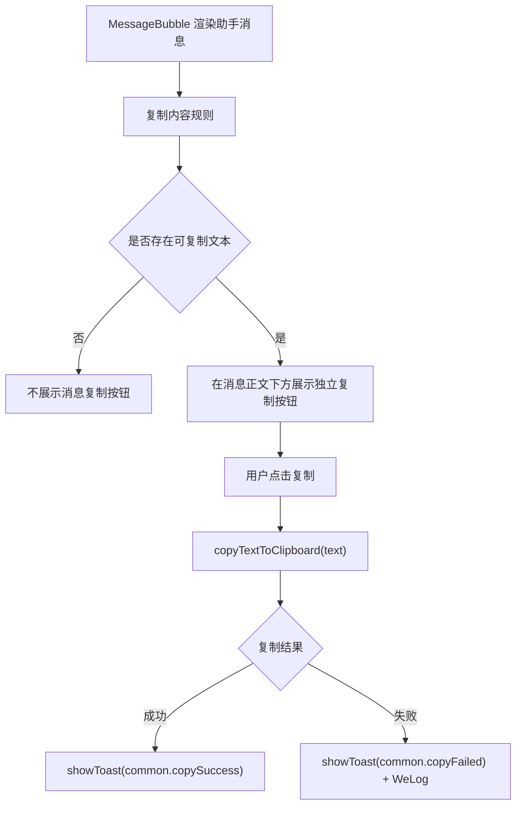
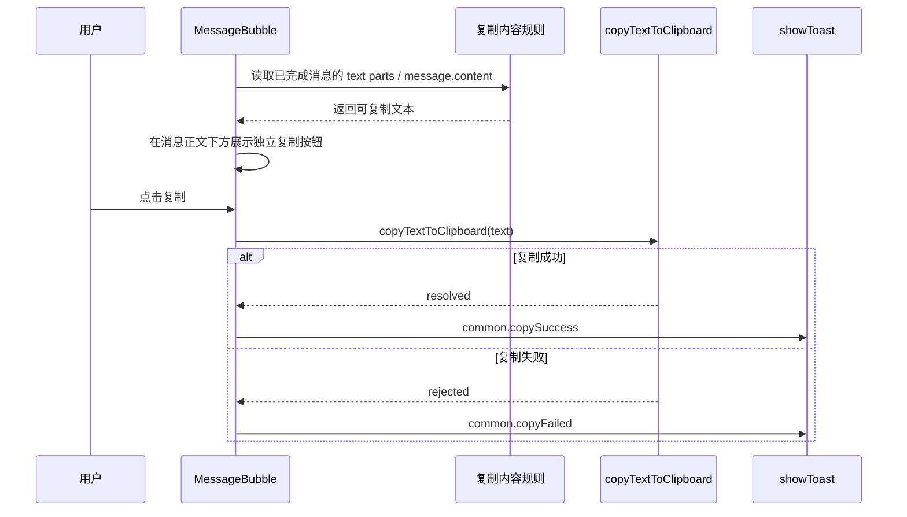
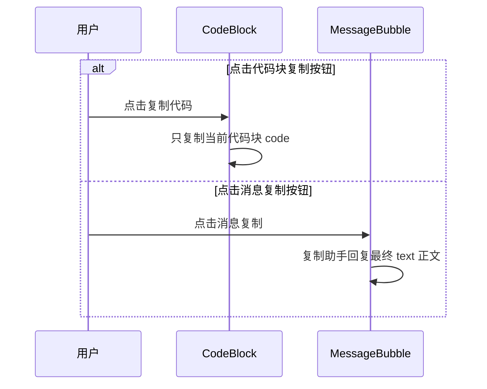

# `ai-chat-viewer 消息复制功能方案`

- 方案日期：`2026-06-05`
- 目标工程：`ai-chat-viewer`
- 参考文档：`integration/skillSDK/ai-chat-viewer/docs/plans/技术方案模板.md`
- 方案类型：`功能方案`

## 1. 背景

### 1.1 场景说明

用户在 `weAgentCUI` 或 `skillCUI` 中查看助手回复后，经常需要把回复内容带到其他工作流中继续使用，例如粘贴到 IM 对话、文档、工单、邮件或外部编辑器。当前页面可以阅读助手回复，也可以复制代码块中的代码，但用户无法稳定地一键复制整条助手回复的最终文本。

消息复制能力需要面向“复用助手最终回答”这一业务动作：用户只复制助手已完成输出的正文，不复制自己的提问、不复制思考过程、不复制工具调用细节，也不复制授权、问题卡片、文件卡片等交互内容。

### 1.2 需求目标

1. 用户可以复制助手回复消息的完整文本内容。
2. `skillCUI` 和 `weAgentCUI` 复用同一套消息复制能力。
3. 复制内容仅包含已完成助手消息的最终 text 正文。
4. 复制不依赖服务端接口，不改变现有消息发送、历史分页和流式渲染链路。
5. 复制成功或失败时给出 toast 提示。

### 1.3 非目标

1. 不支持用户消息复制，仅支持助手回复复制。
2. 不实现多选、多条批量复制或长按选择部分文本。
3. 不改变代码块内已有“复制代码”能力；消息复制与代码块复制保持独立。
4. 不新增服务端接口、SDK 接口或历史消息协议字段。

## 2. 方案图

### 2.1 整体方案图

### 2.2 方案核心

在 `MessageBubble` 内基于统一规则生成“消息级可复制文本”，且该文本只来自已完成助手消息的最终 text 正文；复制按钮作为独立按钮展示在消息正文下方，只依赖可复制文本是否存在，`Content` 继续负责透传入口开关和回调。

## 3. 时序图

### 3.1 用户复制助手消息

### 3.2 代码块复制与消息复制共存

## 4. 技术细节

### 4.1 实现范围

1. 在消息渲染层增加“复制助手回复”入口，按钮固定展示在消息正文下方。
2. 复用现有剪贴板工具完成复制，不新增服务端或 SDK 接口。
3. `skillCUI` 和 `weAgentCUI` 复用同一套复制能力，避免两套展示和复制规则。
4. 补齐复制成功、失败文案的 i18n 口径。

### 4.2 复制内容规则

1. 仅复制已完成助手消息的最终 text 正文。
2. 不复制用户消息、流式未完成文本、思考过程、工具调用摘要、引用来源、文件名和交互卡片内容。
3. 对历史消息、流式快照和多 `parts` 消息，优先复制已完成消息中的 `text` parts；没有可用 parts 时，再兜底复制已完成助手消息的 `message.content`。

### 4.3 展示与交互规则

1. 只有存在可复制最终文本时才展示复制按钮。
2. 复制按钮作为独立按钮展示在消息正文下方，不放入头像元信息区域，也不使用 PC hover 浮层。
3. 流式输出中的助手消息不展示消息级复制按钮，输出完成后再展示。
4. 代码块内“复制代码”保留现状，与消息级复制互不影响。

### 4.4 当前实现差距

1. `weAgentCUI` 尚未稳定透出消息级复制入口。
2. `weAgent` 消息变体当前未在正文下方渲染消息动作区。
3. 现有消息复制内容只取 `message.content`。当页面实际正文来自 `message.parts` 时，复制结果可能与用户看到的助手回复不一致，甚至为空。
4. 复制成功、失败文案仍有硬编码，未完全走 i18n。

### 4.5 未确认项

无。

## 5. 性能

不新增请求。复制文本提取只在消息渲染时对当前消息 `parts` 做线性遍历，复杂度为 `O(parts)`；单条消息 part 数量有限，对首屏和历史分页影响很小。建议通过 `useMemo` 避免每次点击重复递归拼接。

## 6. 功耗

不新增轮询、长连接、后台任务或动画。仅用户点击复制时调用剪贴板 API，对功耗无持续影响。

## 7. 埋码

不涉及埋码。复制失败时仅保留现有 `WeLog` 错误日志，便于排查剪贴板 API 或降级复制异常。

## 8. 影响范围

### 8.1 直接影响

1. `skillCUI` 消息动作区复制行为。
2. `weAgentCUI` 助手消息正文下方复制按钮展示。
3. Markdown、代码块、子任务文本消息中最终 text 正文的复制内容提取。
4. 复制成功、失败 toast 文案。

### 8.2 间接影响

1. 消息正文下方新增按钮后，气泡底部布局高度可能变化，需关注滚动到底部和历史分页锚点保持。
2. PC 和移动端的按钮点击态、触控态需要分别验证。
3. 暗黑模式下按钮颜色、toast 和图标可见性需要回归。

### 8.3 不影响

1. 不影响 `sendMessage`、`stopSkill`、`registerSessionListener` 等 SDK 调用。
2. 不影响历史会话列表、新建会话、删除会话和分页加载。
3. 不影响代码块已有复制逻辑。

## 9. 测试范围

### 9.1 功能测试

1. `skillCUI` 中助手普通文本消息点击复制后，剪贴板内容等于消息文本，展示复制成功 toast。
2. `weAgentCUI` 中助手普通文本消息点击复制后，剪贴板内容等于消息文本。
3. 历史消息存在 `parts` 且 `message.content` 为空时，仍可复制 `text` part 的最终文本。
4. 含 `subtask` 的消息复制时，只拼接子任务内 `text` part 的最终文本。
5. 流式输出中的助手消息不展示消息级复制按钮；输出完成后展示。
6. 用户消息不展示复制按钮。
7. 空消息、仅问题卡片、仅权限卡片、仅文件卡片、仅 thinking 或仅 tool 的助手消息不展示复制按钮。
8. 剪贴板 API 失败时走降级；降级仍失败时展示复制失败 toast 并记录日志。

### 9.2 兼容测试

1. PC、iOS、Android、Harmony 容器内复制成功路径。
2. 亮色和暗黑模式下，消息正文下方复制按钮、toast、图标可见。
3. 中文、英文、长文本、Markdown 表格、列表、代码块混排内容复制后格式可读。
4. 历史分页加载后复制老消息，不影响滚动锚点。
5. 不同入口 `skillCUI`、`weAgentCUI` 行为一致；如某入口不开启动作区，应确认按钮不展示。

### 9.3 文档一致性检查

1. i18n key 与 `zh.ts`、`en.ts` 命名一致。
2. 暗黑样式与 `theme.less` token 命名一致。
3. 测试用例覆盖 `message.content` 和 `message.parts` 两类数据来源，并确认非最终 text 正文不会进入复制文本。

## 10. 最终建议

推荐按“小步复用”实现：先统一复制内容口径，再复用消息气泡的复制入口，最后在 `weAgentCUI` 打开同一套能力。该方案不引入新接口，风险集中在气泡布局和复制内容规则，适合通过组件测试和端侧手测快速验证。
