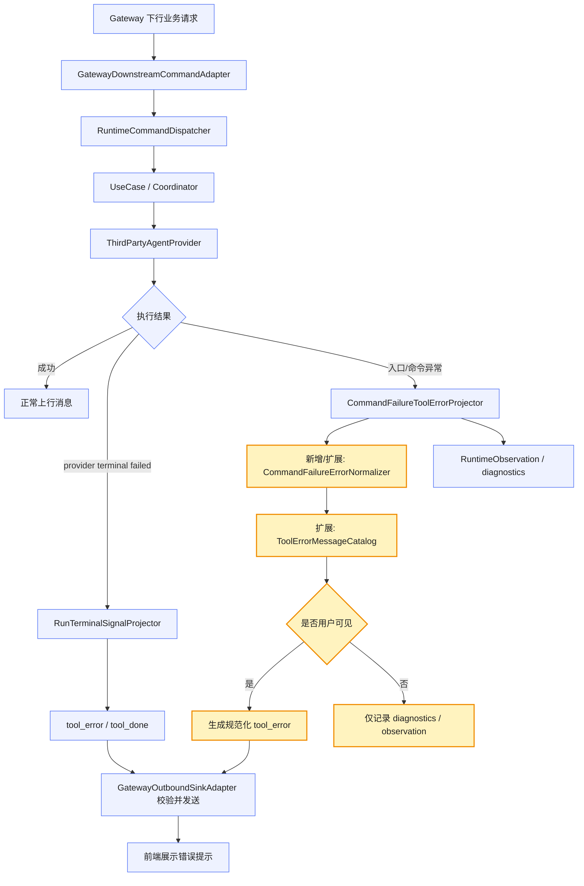
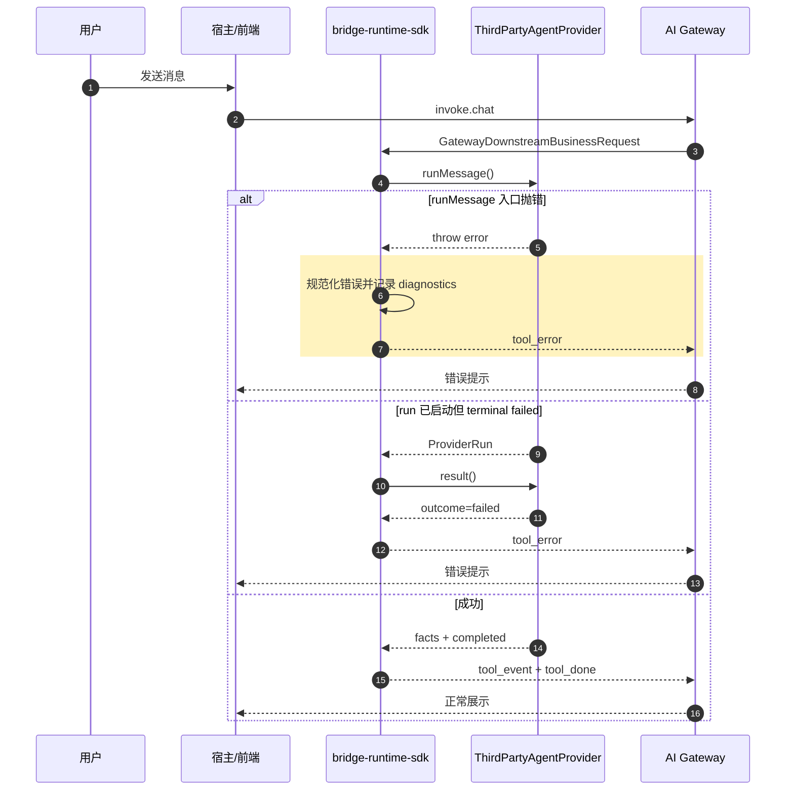
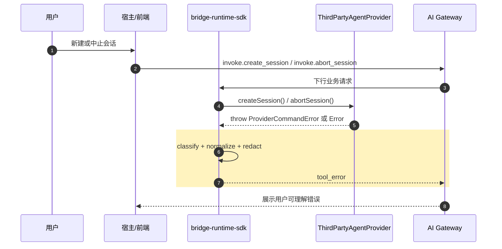
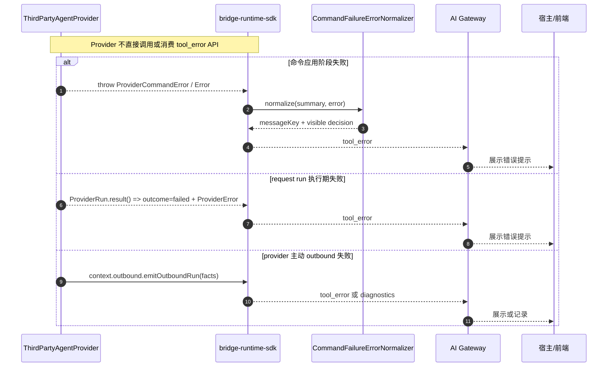

# `bridge-runtime-sdk 异常捕获与 tool_error 回显方案`

- 方案日期：`2026-07-08`
- 目标工程：`agent-plugin / packages/bridge-runtime-sdk`
- 参考文档：`docs/architecture/bridge-runtime-sdk-architecture.md`、`packages/bridge-runtime-sdk/docs/bridge-runtime-sdk-architecture.md`、`packages/bridge-runtime-sdk/src/application/runtime-assembly/downstream.ts`、`packages/bridge-runtime-sdk/src/application/projectors/CommandFailureToolErrorProjector.ts`、`packages/bridge-runtime-sdk/src/application/projectors/DefaultRunTerminalSignalProjector.ts`
- 方案类型：`SDK/API 异常处理优化方案`

## 1. 背景

### 1.1 场景说明

当前 `bridge-runtime-sdk` 负责接收 `GatewayDownstreamBusinessRequest`，收敛为 `RuntimeCommand` 后调用宿主 `ThirdPartyAgentProvider`，再把 provider facts 和命令结果投影为 gateway 上行业务消息。现有实现已在 `attachRuntimeDriverHandlers()` 外层捕获下行命令异常，并通过 `CommandFailureToolErrorProjector` 对部分 `invoke.*` 失败投影 `tool_error`；request run 的 provider terminal failed 也会通过 `DefaultRunTerminalSignalProjector` 投影 `tool_error`。

问题在于异常回显边界还不完整：部分 provider 调用异常只记录 observation/diagnostics 后继续抛出，依赖外层投影；部分 runtime contract 错误会被 projector 静默；`status_query` 这类查询命令无 `tool_error` envelope；错误文案也缺少统一的“用户可见 / 仅诊断”分级。结果是 agent 报错时，前端可能只看到会话无响应，用户无法感知失败原因或重试建议。

### 1.2 需求目标

1. 梳理 `bridge-runtime-sdk` 对外命令入口的异常处理，明确哪些异常必须前端可感知，哪些只进入日志与 diagnostics。
2. 对 `chat`、`create_session`、`abort_session`、`close_session`、`question_reply`、`permission_reply` 等重要 `invoke.*` 场景做统一异常捕获与 `tool_error` 回显，并明确 `query_slash_commands` 继续采用空列表降级。
3. 将异常信息规范化为稳定、脱敏、可本地化的用户提示，避免直接把敏感或内部堆栈信息透传给前端。
4. 保持 request run 终态唯一性：已经进入 provider run 的场景仍以 terminal `tool_done` / `tool_error` 为最终收口，避免重复发送终态。
5. 明确 `ThirdPartyAgentProvider` 如何暴露错误给 SDK，以及 Provider 不直接消费 `tool_error` 的接口边界。

### 1.3 非目标

1. 不调整 gateway 协议字段真源；`tool_error` 结构仍以 `@agent-plugin/gateway-schema` 为准。
2. 不在 SDK 内实现 OpenCode/OpenClaw 宿主专用异常语义，宿主差异继续留在 provider/plugin 侧。
3. 不改变 `BridgeRuntime` facade 对宿主暴露的方法集合。
4. 不把 `status_query` 强行改造成 `tool_error`，除非协议层新增对应错误响应 envelope。
5. 不新增 `ThirdPartyAgentProvider.sendToolError()`、`onToolError()` 或其他 Provider 侧消费 `tool_error` 的 API。

## 2. 方案图

### 2.1 整体方案图



图例：黄色节点为本次需要新增或扩展的实现；蓝色节点为复用现有链路。

### 2.2 方案核心

在 runtime 下行入口统一捕获命令异常，按“用户可感知错误”和“仅诊断错误”分级，经 `ToolErrorMessageCatalog` 规范化后投影 `tool_error`，同时保留 observation/diagnostics 供排障。

## 3. 时序图

### 3.1 `chat provider 调用或执行失败`



黄色区域为本次改动重点：`runMessage()` 尚未返回 `ProviderRun` 时，统一由 command failure normalizer 和 projector 生成用户可见 `tool_error`。run 已启动后的 terminal failed 继续走现有 request run terminal 收口，避免重复终态。

### 3.2 `create_session / abort_session 命令失败`



黄色区域为本次改动重点：非 request run 命令失败不再只停留在日志和 diagnostics，而是按 action 和错误码投影为 `tool_error`。`create_session` 失败可返回不携带 `toolSessionId` 的 `tool_error`；该结构已被 `gateway-schema` 的 `toolErrorMessageSchema` 接受。

### 3.3 `ThirdPartyAgentProvider 错误暴露方式`



该图强调 Provider 的使用方式：SDK 新增的是内部 `tool_error` 投影能力，不新增 Provider 侧 `sendToolError()` 之类接口。Provider 只需要按 `ThirdPartyAgentProvider` contract 抛出错误或返回结构化 terminal result。

## 4. 技术细节

### 4.1 调整点

1. 新增 `CommandFailureErrorNormalizer`，承接 `CommandFailureToolErrorProjector` 内当前散落的 `normalizeErrorMessage()` 和 `RuntimeContractError` switch。
2. 扩展 `CommandFailureToolErrorProjector` 的 action 覆盖与 suppression 原因，明确 `chat`、`create_session`、`abort_session`、`close_session`、`question_reply`、`permission_reply` 的用户可见回包策略。
3. 对 `query_slash_commands` 保留当前降级策略：`ListSlashCommandsUseCase` 捕获 provider 失败后返回空列表，不默认改为 `tool_error`；如产品要求 toast，再单独切换该 use case 的失败策略。
4. 扩展 `ToolErrorMessageCatalog`，按错误来源与错误码维护前端可见文案，例如 provider unavailable、timeout、rate limited、session not found、invalid input、internal error。
5. 在 `attachRuntimeDriverHandlers()` 保持单一兜底捕获边界，确保 use case 内部只记录并抛出，避免多层重复发送 `tool_error`。
6. 对 request run 已启动后的 facts lifecycle 失败，继续由 `RequestRunFailureToolErrorProjector` 发通用 `tool_error`；对 terminal failed，继续由 `DefaultRunTerminalSignalProjector` 使用 provider terminal error 收口。
7. 补齐 `command-failure-tool-error-projector.test.ts` 和 `runtime-sdk.test.ts`，覆盖 provider 抛错时前端可收到规范化 `tool_error`。

### 4.2 核心实现方式

推荐保留现有分层：`UseCase` 捕获异常只做 observation 并重新抛出，`RuntimeCommandDispatcher` 只做分发和命令级 observation，`attachRuntimeDriverHandlers()` 作为下行业务命令统一边界负责最终 fail-closed。

代码实现按以下文件落地：

1. 新增 `packages/bridge-runtime-sdk/src/application/projectors/CommandFailureErrorNormalizer.ts`
   - 职责：把 `unknown error` 归一成 projector 可消费的决策结果。
   - 不负责构造 `ToolErrorMessage`，避免 normalizer 反向知道 gateway message envelope。
   - 类型草案：

```ts
export type CommandFailureVisibility =
  | {
      visible: true;
      messageKey: ToolErrorMessageKey;
      code?: string;
      reason?: 'session_not_found';
    }
  | {
      visible: false;
      suppressReason:
        | 'request_run_lifecycle_owned'
        | 'unsupported_action'
        | 'non_invoke'
        | 'missing_reply_envelope';
      code?: string;
    };

export class CommandFailureErrorNormalizer {
  normalize(input: {
    summary: CommandFailureSummary;
    error: unknown;
  }): CommandFailureVisibility;
}
```

2. 修改 `packages/bridge-runtime-sdk/src/application/projectors/ToolErrorMessageCatalog.ts`
   - 将 `get()` 入参从当前联合类型扩展为导出的 `ToolErrorMessageKey`。
   - 建议 key 集合：

```ts
export type ToolErrorMessageKey =
  | 'run_already_active'
  | 'pending_interaction_not_found'
  | 'request_run_failed'
  | 'provider_unavailable'
  | 'provider_timeout'
  | 'provider_rate_limited'
  | 'provider_invalid_input'
  | 'provider_not_supported'
  | 'session_not_found'
  | 'command_failed';
```

3. 修改 `packages/bridge-runtime-sdk/src/application/projectors/CommandFailureToolErrorProjector.ts`
   - 删除文件内私有 `normalizeErrorMessage()`。
   - 构造函数调整为接收 `ToolErrorMessageCatalog` 和可选 `CommandFailureErrorNormalizer`，默认 new normalizer。
   - `project()` 流程改为：先校验 `summary.messageType/action`，再调用 normalizer；`visible=false` 返回 `null`；`visible=true` 组装 `ToolErrorMessage`。
   - 组装 envelope 时沿用现状：有 `toolSessionId` 就带 `toolSessionId`；没有也允许返回 `{ type: 'tool_error', error }`，用于 `create_session` 失败。当前 `toolErrorMessageSchema` 中 `toolSessionId` 和 `welinkSessionId` 均为 optional。

4. 保持 `packages/bridge-runtime-sdk/src/application/runtime-assembly/downstream.ts` 的边界位置
   - `catch` 中仍然调用 `observation.downstreamFailed()`、`lifecycle.recordFailure()`、`commandFailureToolErrorProjector.project()`、`sink.send()`。
   - 不把 `tool_error` 发送逻辑下沉到各 use case，避免 `CreateSessionUseCase`、`AbortExecutionUseCase`、`CloseSessionUseCase` 重复处理。

5. 保持 `packages/bridge-runtime-sdk/src/application/usecases/ListSlashCommandsUseCase.ts` 当前降级语义
   - 该 use case 已在 catch 中记录失败，并继续投影空 `slash_commands_result`。
   - 本次不改为 `tool_error`，除非产品明确要求“查询命令失败也 toast”。若要切换，应先调整该 use case 为抛错，再纳入 projector action 白名单。

6. 可选后续：修改 `packages/bridge-runtime-sdk/src/application/projectors/DefaultRunTerminalSignalProjector.ts`
   - 将 provider terminal failed 的 `input.result.error?.message` 也接入 catalog/normalizer。
   - 为降低首轮改动风险，本方案建议先不改 terminal 路径，只在文档中标注后续统一。

Provider 侧推荐用法如下：

1. 命令应用阶段失败：在 `createSession()`、`runMessage()` 尚未返回 `ProviderRun`、`abortSession()`、`closeSession()`、`replyQuestion()`、`replyPermission()` 中抛出结构化 `ProviderCommandError` 形态对象或普通 `Error`。
2. request run 执行期失败：`runMessage()` 已返回 `ProviderRun` 后，不再通过 throw 表达终态失败，而是在 `ProviderRun.result()` 中返回 `{ outcome: 'failed', error: ProviderError }`。
3. 用户中止：如果 provider 确认中止成功，`ProviderRun.result()` 返回 `{ outcome: 'aborted' }`，SDK 会投影为 `tool_done`；如果中止命令本身失败，`abortSession()` 抛错，由 SDK 转成 command failure `tool_error`。
4. 可重试失败：provider 可设置 `retryable: true` 供 diagnostics/埋码使用；前端展示文案仍由 SDK catalog 决定，避免 provider 文案直出。
5. 敏感信息：provider 不应把 token、authorization、cookie、用户输入正文、answers 等敏感内容放入 `message` 或 `details`；SDK 也不会把普通 `Error.message` 默认透传给前端。

结构化错误示例：

```ts
const error: ProviderCommandError = {
  code: 'provider_unavailable',
  message: 'openclaw runtime websocket disconnected',
  retryable: true,
};
throw error;
```

```ts
return {
  outcome: 'failed',
  error: {
    code: 'timeout',
    message: 'agent run exceeded timeout',
    retryable: true,
  },
};
```

错误映射建议如下：

| 错误来源 | code / 条件 | 用户可见 | tool_error 文案 |
|---|---|---|---|
| `RuntimeContractError` | `run_already_active` | 是 | `当前会话正在处理中，请稍后再试` |
| `RuntimeContractError` | `pending_interaction_not_found` | 是 | `当前交互已失效，请刷新后重试` |
| `RuntimeContractError` | `session_not_found` | 是 | `当前会话已失效，请新建会话后重试` |
| `RuntimeContractError` | `fact_sequence_invalid` / `pending_interaction_conflict` | 否 | 已由 request run lifecycle 失败路径收口 |
| provider 结构化错误 | `provider_unavailable` | 是 | `服务暂不可用，请稍后重试` |
| provider 结构化错误 | `timeout` | 是 | `请求处理超时，请重试` |
| provider 结构化错误 | `rate_limited` | 是 | `请求过于频繁，请稍后重试` |
| provider 结构化错误 | `invalid_input` | 是 | `请求参数无效，请刷新后重试` |
| provider 结构化错误 | `not_supported` | 是 | `当前操作暂不支持` |
| provider 结构化错误 | `internal_error` 或未知 code | 是 | `当前请求处理失败，请重试` |
| 普通 `Error` / 字符串异常 | 默认 | 是 | `当前请求处理失败，请重试` |

其中原始 `error.message` 只进入 observation/diagnostics，不默认进入前端文案；现有测试中直接回显 `create_session_failed` 的行为需要随本次改动更新为 catalog 通用文案或结构化文案。

### 4.3 兼容与边界

1. 已有 `tool_done` / `tool_error` 终态语义保持不变，不新增第二条 request run terminal。
2. `status_query` 当前成功响应为 `status_response`，失败只记录 observation/diagnostics；若前端要求感知健康查询失败，需在 gateway-schema 增加状态错误响应，不建议复用 `tool_error`。
3. `CommandFailureToolErrorProjector` 只处理 `GatewayDownstreamBusinessRequest.type === "invoke"`，避免把非 invoke 查询错误错误包装为工具执行失败。
4. `GatewayOutboundSinkAdapter` 继续对生成的 `tool_error` 做 schema 校验；校验失败只记录 outbound validation failure，不二次补发错误，避免递归失败。
5. 对未知异常使用通用文案，例如“当前请求处理失败，请重试”，原始 message 只进入 diagnostics 和脱敏日志。
6. provider terminal `ProviderTerminalResult.error.message` 当前会进入 `DefaultRunTerminalSignalProjector` 的 `tool_error.error`；建议后续也纳入同一 catalog/normalizer，避免 terminal 路径和入口异常路径文案策略不一致。

### 4.4 相关接口联动

1. `ThirdPartyAgentProvider` 不消费 `tool_error`：`tool_error` 是 SDK 到 gateway/前端的上行业务消息，Provider 侧没有新增调用接口，也不需要知道 gateway envelope。
2. `ThirdPartyAgentProvider.runMessage()`：入口抛错由 SDK 消费并转为 `tool_error`；run 已返回后以 `ProviderRun.result()` 作为终态真源。
3. `ThirdPartyAgentProvider.createSession()`：失败时抛出 `ProviderCommandError` 或普通 `Error`；SDK 可返回不携带 `toolSessionId` 的 `tool_error`。
4. `ThirdPartyAgentProvider.abortSession()`：失败时抛错；SDK 消费错误并优先携带原请求 `toolSessionId` 投影 `tool_error`。
5. `ThirdPartyAgentProvider.closeSession()`：失败时抛错；SDK 消费错误并优先携带原请求 `toolSessionId` 投影 `tool_error`。
6. `ThirdPartyAgentProvider.replyQuestion()` / `replyPermission()`：pending 失效由 SDK runtime contract 先拦截；provider 拒绝或执行失败时抛错，由 SDK 转为用户可见 `tool_error`。
7. `ThirdPartyAgentProvider.listSlashCommands()`：当前失败由 `ListSlashCommandsUseCase` 消费并降级为空列表；是否改成 `tool_error` 属于产品展示策略，不纳入本轮默认改动。
8. `ProviderRuntimeContext.outbound.emitOutboundRun()`：Provider 主动 outbound 时仍只提交 facts；facts 校验或发送失败由 SDK 决定是否投影 `tool_error` 或仅记录 diagnostics。
9. `BridgeRuntime.getDiagnostics()`：继续保留原始分类、phase、message、code，供排障使用，不直接作为前端展示文案真源。

### 4.5 文档需要同步修改的内容

1. `packages/bridge-runtime-sdk/docs/bridge-runtime-sdk-architecture.md`：补充 `tool_error` 异常回显边界与用户可见错误分级。
2. `docs/architecture/bridge-runtime-sdk-architecture.md`：补充 command failure projector 和 request terminal projector 的职责差异。
3. `docs/design/interfaces/bridge-runtime-sdk-integration.md`：补充 provider 抛错建议、错误码约定、Provider 不直接消费 `tool_error` 的边界和前端展示预期。
4. `packages/bridge-runtime-sdk/CHANGELOG.md`：实现后记录 SDK 行为变更。

## 5. 性能

不新增网络请求；新增开销主要是异常路径上的错误分类、文案映射和 schema 校验，属于低频失败路径，对首屏、正常消息流和列表渲染无明显影响。

## 6. 功耗

不增加轮询、长连接、后台任务、动画或频繁刷新；只在已有下行命令失败时多发送一条 `tool_error` 上行业务消息。

## 7. 埋码

1. `runtime_sdk.command_failure.tool_error_projected`
   - 说明：记录命令失败已投影为 `tool_error`，字段包含 `action`、`toolSessionId` 是否存在、规范化错误码、是否使用通用文案。
2. `runtime_sdk.command_failure.tool_error_suppressed`
   - 说明：记录命令失败未对前端可见的原因，例如非 invoke、缺少可回包 envelope、生命周期错误已由 request run projector 收口。
3. `runtime_sdk.command_failure.visible_error_code`
   - 说明：可选埋码，用于统计用户可见错误类型分布，不记录原始 message、用户输入、answers、content、token 等敏感信息。

## 8. 影响范围

### 8.1 直接影响

1. `packages/bridge-runtime-sdk/src/application/projectors/CommandFailureErrorNormalizer.ts` 新增错误归一化策略。
2. `packages/bridge-runtime-sdk/src/application/projectors/CommandFailureToolErrorProjector.ts` 的 action 覆盖范围、suppression 策略和错误映射。
3. `packages/bridge-runtime-sdk/src/application/projectors/ToolErrorMessageCatalog.ts` 的用户可见文案集合。
4. `packages/bridge-runtime-sdk/src/application/runtime-assembly/downstream.ts` 保持兜底发送边界，但需要适配 projector 返回的规范化结果。
5. `packages/bridge-runtime-sdk/tests/command-failure-tool-error-projector.test.ts` 与 `packages/bridge-runtime-sdk/tests/runtime-sdk.test.ts`。

### 8.2 间接影响

1. 前端会从“无响应”变为收到 `tool_error`，需要确认展示层不会把同一失败重复 toast。
2. OpenClaw/OpenCode provider 抛出的错误如果未结构化，默认只展示通用文案，可能需要插件侧补充 provider 错误码。
3. diagnostics 中失败记录会更容易与前端错误提示关联，日志字段需要继续遵守脱敏规则。
4. Provider 侧实现需要从“抛任意 Error message 给用户看”的心智切换为“抛结构化错误给 SDK 分类”，普通 message 主要用于 diagnostics。

### 8.3 不影响

1. 不影响 gateway-client 连接状态机和重连策略。
2. 不影响 provider facts 到 `tool_event` 的正常投影链路。
3. 不影响 `BridgeRuntime.start()`、`stop()`、`probe()`、`getStatus()`、`getDiagnostics()` facade 方法签名。
4. 不影响 integration/opencode-cui submodule。
5. 不新增 `ThirdPartyAgentProvider.sendToolError()`、`onToolError()` 或类似 Provider 侧消费接口。

## 9. 测试范围

### 9.1 功能测试

1. `chat` 在 `runMessage()` 抛错时返回 `tool_error`，错误文案来自 catalog，且记录 diagnostics；普通 `Error('run_failed')` 不应直接透传 `run_failed`。
2. `chat` 在 run 已启动后 terminal failed 时只返回一次 terminal `tool_error`。
3. `create_session` 抛错时返回不携带 `toolSessionId` 的 `tool_error`，错误文案来自 catalog。
4. `abort_session`、`close_session` 抛错时携带原 `toolSessionId` 返回 `tool_error`。
5. `question_reply` / `permission_reply` pending 不存在时返回“当前交互已失效，请刷新后重试”。
6. `query_slash_commands` 抛错时保持当前空列表降级，不返回 `tool_error`。
7. unsupported action 不返回 `tool_error`，只记录 inbound validation/runtime failure。

### 9.2 兼容测试

1. 现有 `tool_done`、provider terminal `tool_error`、`session_created`、`status_response` snapshot 不回归。
2. OpenCode compatibility family 与 skill family 的 `tool_event.event` payload 不受异常回显改动影响。
3. `GatewayOutboundSinkAdapter` 对 `tool_error` 校验失败时不递归发送新错误。
4. 普通 `Error`、字符串异常、结构化 provider error 都能被 normalizer 稳定处理，且不会把原始 message 直接作为用户可见文案。
5. Provider 抛出的 `ProviderCommandError` 可被 SDK 消费并映射为 catalog 文案；Provider 不需要也不能直接构造 `tool_error`。

### 9.3 文档一致性检查

1. 核对 `docs/architecture/bridge-runtime-sdk-architecture.md` 中 `GatewayDownstreamBusinessRequest -> RuntimeCommand` 映射与实际 `runtime-command.ts` 保持一致。
2. 核对 `packages/bridge-runtime-sdk/docs/bridge-runtime-sdk-architecture.md` 中 fail-closed 说明与 `CommandFailureToolErrorProjector` 行为一致。
3. 核对 `docs/design/interfaces/bridge-runtime-sdk-integration.md` 中 provider 错误码建议与 `ProviderError` / `ProviderCommandError` 类型一致，并说明 Provider 不直接消费 `tool_error`。

## 10. 最终建议

最终结论：推荐采用“入口统一捕获 + `CommandFailureErrorNormalizer` + catalog 文案 + request run 终态保持唯一”的方案。这样可以在不改变 `BridgeRuntime` facade 和 gateway 协议真源的前提下，快速解决 agent 报错导致前端无感知的问题；代价是普通 `Error.message` 不再默认透传给前端，部分现有测试需要更新为稳定用户文案。后续动作建议先补 normalizer/projector 单测，再实现 `CommandFailureToolErrorProjector` 扩展，随后补 `runtime-sdk.test.ts` 端到端覆盖，最后同步架构文档和 provider 集成说明。
