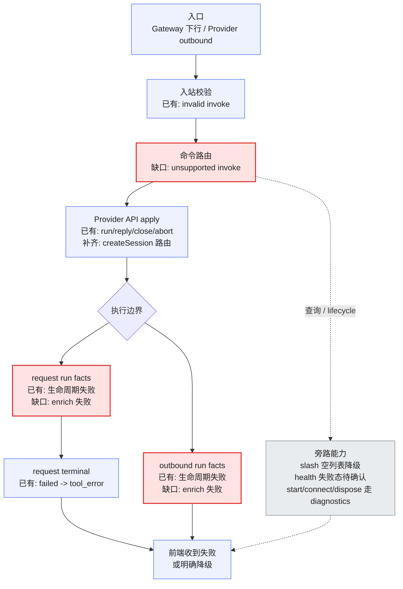
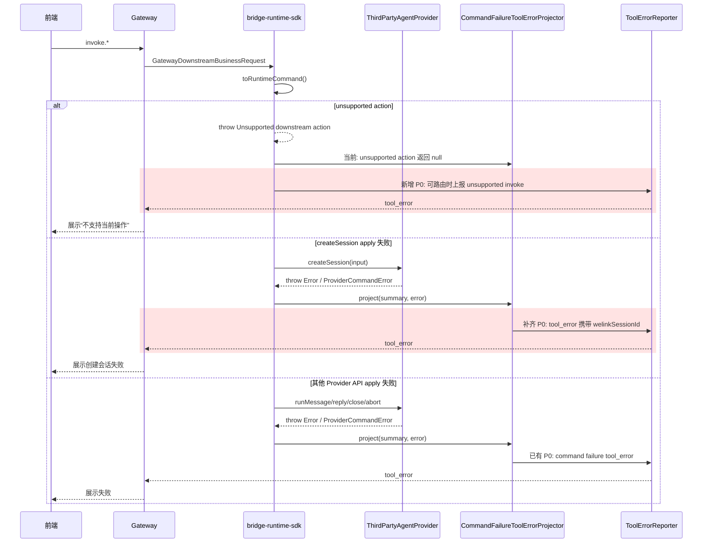
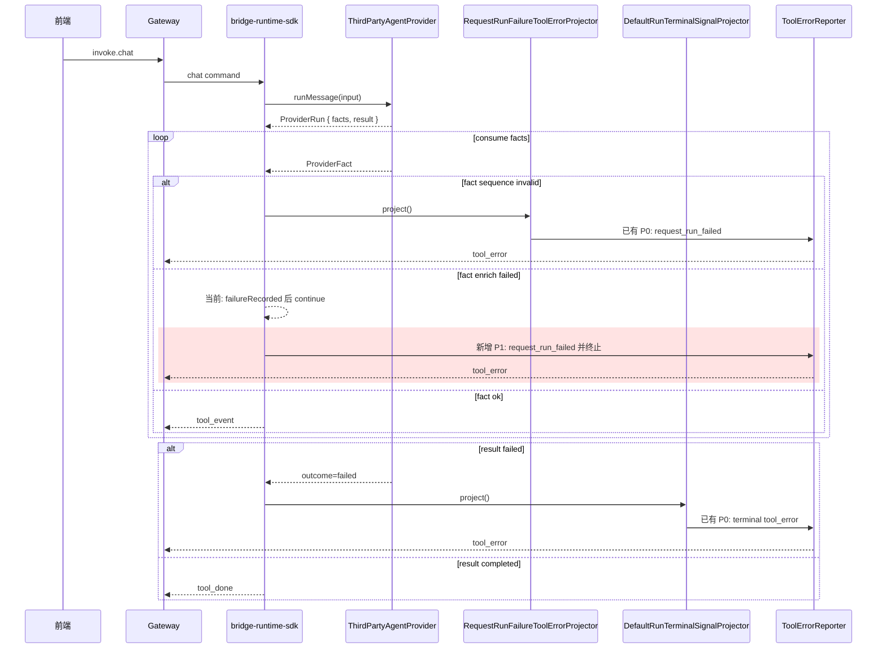
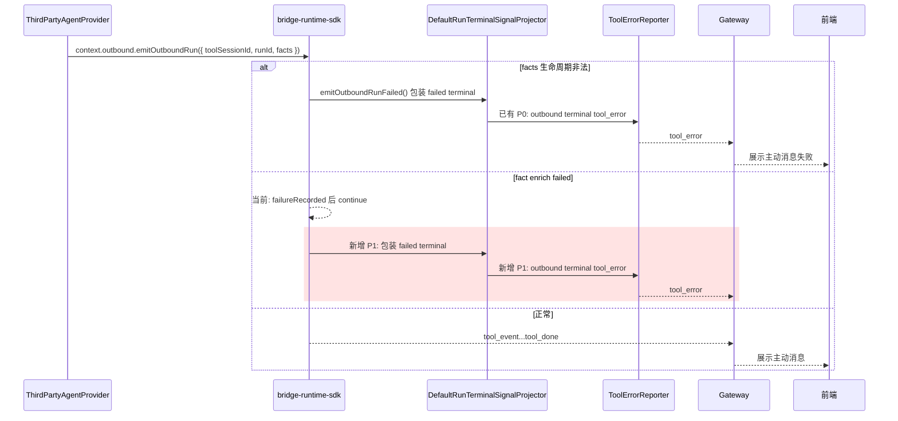

# `bridge-runtime-sdk Provider API tool_error 异常感知缺口评审方案`

- 方案日期：`2026-07-21`
- 目标工程：`agent-plugin / packages/bridge-runtime-sdk`
- 参考文档：`docs/design/interfaces/bridge-runtime-sdk-integration.md`、`docs/design/interfaces/third-party-agent-provider-v1.md`、`packages/bridge-runtime-sdk/src/application/runtime-assembly/downstream.ts`、`packages/bridge-runtime-sdk/src/adapters/gateway/GatewayInboundPolicy.ts`、`packages/bridge-runtime-sdk/src/application/projectors/*`、`packages/bridge-runtime-sdk/src/application/coordinators/*`、`packages/bridge-runtime-sdk/src/application/usecases/*`
- 方案类型：`SDK/API 异常处理评审方案`

## 1. 背景

### 1.1 场景说明

第三方通过 `ThirdPartyAgentProvider` 接入 `bridge-runtime-sdk` 后，前端用户动作会经过 gateway 下行、SDK runtime command、Provider API 调用、Provider facts 消费、terminal 投影、gateway 上行发送等多个节点。当前 SDK 已经有多条 `tool_error` 上报链路，但仍存在部分关键节点只记录 diagnostics、只抛异常、或发送了不可路由 `tool_error` 的情况，前端可能表现为无响应、等待不结束、局部事件静默丢失，用户无法判断异常出在哪里。

本方案的重点是评审 SDK 流程中“重要节点是否缺少 `tool_error` 或失败终态”，不是优先改造已有上报文案。已有上报的文案规范化、错误 catalog、脱敏展示属于后续体验和安全优化；本轮只在它们会影响用户感知或路由时纳入 P0/P1。

### 1.2 需求目标

1. 梳理 SDK 主流程中已有 `tool_error` 上报场景，确认其覆盖阶段、路由字段和重要性。
2. 找出仍需新增或补齐 `tool_error` 的关键缺口，特别是会导致前端无响应、等待不结束、静默丢事件的节点。
3. 明确哪些异常不应使用 `tool_error`，但必须通过明确降级响应、status 或 diagnostics 让调用方可感知。
4. 给测试团队提供验证策略：哪些用 mock Provider / FakeGateway 即可，哪些需要 gateway 服务器配合，哪些适合手动破坏 agent 做端到端兜底。

### 1.3 非目标

1. 不改变 `tool_error` 协议真源；字段合法性仍以 `@agent-plugin/gateway-schema` 为准。
2. 不新增 Provider 直接发送 `tool_error` 的 public API；Provider 仍通过抛错、返回 failed terminal、或提交 facts 表达失败。
3. 不把所有错误强行收敛到一个全局 `sendToolError()`；保留 command failure、request lifecycle、terminal、inbound invalid 的阶段边界。
4. 不把 `health()`、`initialize()`、`dispose()` 这类 lifecycle / status 场景伪装成 tool session 执行失败。
5. 不要求当前轮立即完成文案 catalog、脱敏、ProviderCommandError code 映射；这些是已有上报的质量优化，不是缺口评审主线。

## 2. 方案图

### 2.1 整体方案图



### 2.2 方案核心

以“用户动作是否已经进入可感知执行边界”为判断标准：进入 `invoke.chat`、`create_session`、`reply*`、`abort/close` 或 `emitOutboundRun` 后，失败必须有 `tool_error` 或等价 terminal；查询和 lifecycle 不强行复用 `tool_error`，但必须验证有明确响应或 diagnostics。

上报形态建议统一为“阶段边界判定失败 + `ToolErrorReporter` 统一投影和发送”：各阶段仍负责判断失败是否属于 command failure、request lifecycle、terminal failed 或 inbound invalid；`ToolErrorReporter` 统一处理 `tool_error` 文案、路由字段、级别、observation 和 `sink.send()`。不建议把所有流程都改成“过程中一律抛异常到最外层统一 catch”，因为 terminal failed 和 inbound invalid 不是普通异常语义。

## 3. 时序图

### 3.1 `invoke` 命令失败收口



### 3.2 `request run facts / terminal`



### 3.3 `Provider outbound 主动发送`



## 4. 技术细节

### 4.1 调整点

1. 新增统一 `ToolErrorReporter`，收敛 `tool_error` 的构造、路由字段、级别、observation 和发送。
2. `CommandFailureToolErrorProjector` 补齐可路由失败：unsupported `invoke`、`create_session` 失败只有 `welinkSessionId` 的场景。
3. `RequestRunCoordinator` 的 `ProviderFactEnricher.enrich()` 失败本轮不改变 main 分支逻辑，继续记录 diagnostics 后 `continue`；只保留 facts 生命周期异常进入 request lifecycle `tool_error`。
4. `OutboundCoordinator.emitOutboundRun()` enrich 失败本轮不改变 main 分支逻辑，继续记录 diagnostics 后 `continue`；只保留普通 outbound run failed terminal 走 reporter。
5. `status_query` 的 Provider `health()` 失败不建议使用 `tool_error`，但需要单独确认是否补 `status_response` 失败态，避免状态查询调用方等待。
6. 保持 `ListSlashCommandsUseCase` 的空列表降级，不新增 `tool_error`。

### 4.2 核心实现方式

当前 SDK 里 `ToolErrorReporter` 上报分散在 3 类节点：

这 3 类节点不是 3 个新接口，而是统一 reporter 发生位置的阶段划分，便于判断异常应该由谁负责收口：

| 阶段 | 中文理解 | 发生时机 | 典型异常 | 理解方式 |
|---|---|---|---|---|
| `inbound_invalid` | 入站请求非法 | gateway 消息刚进入 SDK，还没转换成 runtime command | 下行 `invoke` 字段不合法、缺必要字段、协议校验失败 | 请求在门口验票失败，业务还没开始 |
| `command_failure` | 命令应用失败 | SDK 已识别出命令，正在调用 Provider API | `createSession()`、`runMessage()`、`reply*()`、`closeSession()`、`abortSession()` 抛错 | 命令接住了，但调用 Provider 失败 |
| `request_lifecycle` | chat run 事件流生命周期失败 | `runMessage()` 已返回 `ProviderRun`，SDK 正在消费 `facts` | facts 顺序非法、`permission.reply` 找不到展示上下文、pending interaction 冲突 | 消息已经开始跑，但中途事件流坏了 |

| 序号 | 上报节点 | 当前入口 | 是否已有上报 | 级别 | 是否建议统一到 `ToolErrorReporter` |
|---|---|---|---|---|---|
| 1 | 入站 invalid invoke | `GatewayInboundPolicy.handle()` | 已有 | P0 | 是。保留入站判定，统一 reporter 构造和发送 |
| 2 | command failure | `attachRuntimeDriverHandlers()` + `CommandFailureToolErrorProjector` | 已有，`create_session` 路由字段需补齐 | P0 | 是。保留 command catch，统一 reporter 处理文案、路由和发送 |
| 3 | request run lifecycle failure | `RequestRunCoordinator` + `RequestRunFailureToolErrorProjector` | 已有 | P0 | 是。保留 coordinator 判定，统一 reporter 发送 |
| 4 | request run terminal failed | `DefaultRunTerminalSignalProjector` | 已有 | P0 | 否。本轮按要求恢复 main 分支 coordinator 原发送路径 |
| 5 | outbound run terminal failed | `OutboundCoordinator.emitOutboundRunFailed()` + `DefaultRunTerminalSignalProjector` | 已有 | P0 | 否。本轮按要求恢复 main 分支 coordinator 原发送路径 |

统一处理建议：

1. 新增应用层 `ToolErrorReporter`，统一 `tool_error` 的路由字段补齐、文案选择、级别记录、`observation.uplinkEmitted()` 和 `sink.send()`。
2. 各阶段不直接 `sink.send(tool_error)`，而是调用 `ToolErrorReporter.report(input)`。
3. 各阶段仍保留失败判定边界：inbound invalid、command failure、request lifecycle 不合并成一个大 catch。
4. 可以通过抛异常传递到阶段边界的场景：Provider API apply 失败、unsupported invoke、request facts lifecycle failure、outbound facts lifecycle failure。
5. 不建议通过抛异常统一处理的场景：`ProviderRun.result()` 返回 `outcome: "failed"`，它是 terminal 真源；gateway invalid frame 也不是 runtime command 异常。

推荐的上报输入模型如下：

```ts
type ToolErrorReportInput = {
  stage:
    | 'inbound_invalid'
    | 'command_failure'
    | 'request_lifecycle';
  toolSessionId?: string;
  welinkSessionId?: string;
  reason?: 'session_not_found';
  messageKey?: string;
  fallbackError?: unknown;
};
```

本次最小实现范围如下：

1. 新增 `packages/bridge-runtime-sdk/src/application/reporters/ToolErrorReporter.ts`
   - 输入 `ToolErrorReportInput`，输出并发送合法 `ToolErrorMessage`。
   - 内部复用 `ToolErrorMessageCatalog`，并统一补充 `toolSessionId` / `welinkSessionId`。
   - 统一调用 `observation.uplinkEmitted()` 与 `sink.send()`。
2. 修改 `packages/bridge-runtime-sdk/src/application/projectors/CommandFailureToolErrorProjector.ts`
   - unsupported `invoke` 只要 `summary.toolSessionId` 或 `summary.welinkSessionId` 存在，就生成 `tool_error`。
   - `tool_error` 输出同时支持 `toolSessionId` 与 `welinkSessionId`；`create_session` 失败时至少携带 `welinkSessionId`。
   - `fact_sequence_invalid`、`pending_interaction_conflict` 仍交给 request lifecycle 路径，避免重复上报。
3. 修改 `packages/bridge-runtime-sdk/src/application/coordinators/RequestRunCoordinator.ts`
   - request terminal failed 通过 `ToolErrorReporter` 统一发送。
   - request run enrich failure 不改变 main 分支逻辑，仍记录 diagnostics 后 `continue`。
4. 修改 `packages/bridge-runtime-sdk/src/application/coordinators/OutboundCoordinator.ts`
   - outbound run 的普通 failed terminal 通过 `ToolErrorReporter` 统一发送。
   - outbound run enrich failure 不改变 main 分支逻辑，仍记录 diagnostics 后 `continue`。
   - 已废弃 `emitOutboundMessage()` 不强行补 terminal 语义，保持原 diagnostics / Promise 行为。
5. 补充 focused tests
   - `command-failure-tool-error-projector.test.ts` 覆盖 unsupported action 与 welink-only create_session。
  - `runtime-sdk.test.ts` 覆盖 request/outbound terminal failure，以及 request/outbound enrich failure 保持 main 分支行为。

### 4.3 兼容与边界

1. Provider 不直接感知 `tool_error`；Provider API apply 失败继续通过 rejected promise / throw 暴露。
2. `ProviderRun.result()` 返回 failed 是 terminal 真源，继续由 `DefaultRunTerminalSignalProjector` 生成 `tool_error`。
3. `GatewayOutboundSinkAdapter.send()` 只做 schema 校验与发送；如果 sink 本身不可用，不递归构造新的 `tool_error`。
4. `health()`、`initialize()`、`dispose()` 没有稳定 `toolSessionId` 语义，不使用 `tool_error`。
5. 文案 catalog 与普通 `Error.message` 脱敏建议后续做，但不影响本轮缺口评审结论。

### 4.4 相关接口联动

#### 4.4.1 已有 `tool_error` 上报场景

| SDK 节点 | 业务场景 | 技术触发场景 | 当前入口 | 当前形态 | 重要性 | 评审结论 |
|---|---|---|---|---|---|---|
| 入站协议校验 | 前端或 gateway 发来一条用户操作请求，但请求内容缺字段或格式不对，例如点击发送后下行消息缺少会话标识；常见兼容场景是 SDK 新版本新增或调整会话标识字段，而接入方仍使用旧版本 SDK，导致下行请求无法通过新协议校验 | gateway-client 判定 invalid `invoke`，且 frame 有 `toolSessionId` 或 `welinkSessionId` | `GatewayInboundPolicy.handle()` | `tool_error.error = gateway_invalid_invoke:${code}`，携带可用 session 标识 | P0 | 已有上报，保留 |
| Provider API apply | 用户发送一条消息，SDK 已准备调用第三方 Agent，但 Agent 入口启动失败，例如底层服务不可用、认证失效、参数被 Provider 拒绝 | `runMessage()` 返回 `ProviderRun` 前抛错 | `attachRuntimeDriverHandlers()` + `CommandFailureToolErrorProjector` | 携带 `toolSessionId`，error 当前可能直出异常 message | P0 | 已有上报；后续优化文案 |
| Provider API apply | 第三方 Agent 返回了不符合 SDK 契约的执行句柄或创建结果，例如 `runMessage()` 没有返回可消费的 `facts/result()`，或 `createSession()` 没有返回有效会话标识 | Provider 返回非法 `ProviderRun` / `ProviderCreateSessionResult`，后续读取 `facts`、`result()` 或 `toolSessionId` 时异常 | use case / coordinator 抛错后进入 command failure catch | 当前通常走 command failure `tool_error`，但文案可能是技术异常 | P0 | 已有兜底；建议在 Provider 结果边界补显式校验和 catalog 文案 |
| Provider API apply | 用户在前端回答问题或审批权限，但这条待回复卡片已过期、已被消费或本地状态丢失 | `replyQuestion()` / `replyPermission()` 找不到 pending interaction | `InteractionCoordinator` 抛 `RuntimeContractError` 后进入 command failure projector | `pending_interaction_not_found` catalog 文案 | P0 | 已有上报，保留 |
| Runtime 前置约束 | 用户连续快速发送消息，或前端重复提交同一会话消息；上一轮还没结束，新一轮又进入同一 `toolSessionId` | 同一 `toolSessionId` 重复 `chat` | `StartRequestRunUseCase` 抛 `run_already_active` 后进入 command failure projector | `run_already_active` catalog 文案 | P0 | 已有上报，保留 |
| request run facts | Agent 已开始回复，但事件顺序异常，例如还没创建消息就开始输出文本，前端无法正确拼出一条回答 | facts 生命周期非法，例如未 `message.start` 就 `text.delta` | `RequestRunCoordinator` + `RequestRunFailureToolErrorProjector` | `request_run_failed` | P0 | 已有上报，保留 |
| request run terminal | Agent 正常结束本轮执行流程，但明确告诉 SDK 本轮失败，例如会话不存在、模型服务失败、工具执行失败 | `ProviderRun.result()` 返回 `outcome: "failed"` | `DefaultRunTerminalSignalProjector` | `tool_error`，`session_not_found` 时带 `reason` | P0 | 已有上报，保留 |
| request run terminal | Agent 运行过程中终态 Promise 异常退出，SDK 没拿到规范的成功/失败结果 | `ProviderRun.result()` reject | `RequestRunCoordinator` 抛出后被 command failure 捕获 | command failure `tool_error` | P0 | 已有兜底；建议补测试锁定 |
| outbound run facts | Agent 主动推送一轮消息给前端，例如后台任务、异步回调、主动通知，但这轮主动消息的事件流顺序错误 | `emitOutboundRun()` facts 生命周期非法 | `OutboundCoordinator.emitOutboundRunFailed()` + terminal projector | failed terminal `tool_error` | P0 | 已有上报，保留 |

已有场景的上行数据示例：

| 场景 | 上行 `tool_error` 示例 | 字段说明 |
|---|---|---|
| 入站协议校验失败 | `{"type":"tool_error","toolSessionId":"tool-123","welinkSessionId":"welink-123","error":"gateway_invalid_invoke:missing_required_field"}` | `toolSessionId` / `welinkSessionId` 按 invalid frame 中可取得的路由字段携带；`error` 当前包含 gateway 校验错误码 |
| `runMessage()` 返回前失败 | `{"type":"tool_error","toolSessionId":"tool-123","error":"Provider service unavailable"}` | 当前已有路径主要携带 `toolSessionId`；`error` 可能直出 Provider 异常信息，后续建议 catalog 化 |
| Provider 返回非法结果 | `{"type":"tool_error","toolSessionId":"tool-123","error":"当前操作失败，请稍后重试"}` | 建议后续不要直出 `Cannot read properties...` 这类技术异常；原始错误保留在 diagnostics |
| 回复 question / permission 失败 | `{"type":"tool_error","toolSessionId":"tool-123","error":"当前交互已失效，请刷新后重试"}` | 用于前端提示用户原卡片已失效，需要重新触发或刷新 |
| 同会话重复发送 | `{"type":"tool_error","toolSessionId":"tool-123","error":"当前会话正在处理中，请稍后再试"}` | 用于前端提示上一轮还在处理中，避免用户继续等待无结果 |
| request facts 生命周期失败 | `{"type":"tool_error","toolSessionId":"tool-123","error":"当前请求处理失败，请重试"}` | 当前统一为 `request_run_failed` 文案，不暴露内部 fact 顺序细节 |
| request terminal failed | `{"type":"tool_error","toolSessionId":"tool-123","error":"会话不存在","reason":"session_not_found"}` | `reason` 仅在 `ProviderError.code === "session_not_found"` 时携带，便于前端做会话恢复或重建 |
| outbound run 失败 | `{"type":"tool_error","toolSessionId":"tool-123","error":"text.delta requires an open message"}` | 当前 outbound failed terminal 可能使用包装后的异常 message；后续建议统一为 catalog 文案 |

#### 4.4.2 需要新增或补齐 `tool_error` 的场景

| SDK 节点 | 业务场景 | 技术缺口场景 | 现状 | 用户影响 | 重要性 | 建议动作 |
|---|---|---|---|---|---|---|
| Runtime command 路由 | 前端发起了一个 SDK 暂不支持的操作，例如新增按钮、灰度功能或 gateway 新 action 先上线，但 SDK 还没适配 | `invoke` action 不支持，但消息里有 `toolSessionId` 或 `welinkSessionId` | `toRuntimeCommand()` 抛错；`CommandFailureToolErrorProjector.isSupportedAction()` 返回 `null` | 前端可能没有失败回包，点击后无响应 | P0 | 新增 unsupported invoke `tool_error` |
| `createSession()` | 用户点击“新建会话”或首次进入助手会话，第三方 Agent 创建底层会话失败，例如账号无权限、服务不可用、创建参数不合法 | Provider 抛错且会话尚未生成 `toolSessionId` | 当前 projector 允许进入，但输出不带 `welinkSessionId`；已有测试名也锁定“不回显 welinkSessionId” | 前端难以把失败挂到发起的新建会话请求 | P0 | `tool_error` 补带 `welinkSessionId` |
| command failure 文案 | 用户已经能看到失败提示，但提示内容像 `ECONNRESET`、`socket hang up`、堆栈摘要或第三方内部错误码，产品和用户都难以理解 | Provider API 抛普通 `Error` 或结构化 `ProviderCommandError` | 已会上报，但普通 message 可能直出 | 用户能感知失败，但可能看到技术错误或敏感信息 | P1 | 后续加 normalizer/catalog；不作为“缺上报”处理 |

新增/补齐后的上行数据示例：

| 场景 | 预期上行 `tool_error` 示例 | 字段说明 |
|---|---|---|
| unsupported `invoke` | `{"type":"tool_error","toolSessionId":"tool-123","welinkSessionId":"welink-123","error":"当前操作暂不支持，请升级 SDK 或稍后重试"}` | 有 `toolSessionId` / `welinkSessionId` 时都应尽量携带，方便前端把错误挂到正确会话或请求 |
| `createSession()` 失败 | `{"type":"tool_error","welinkSessionId":"welink-123","error":"会话创建失败，请稍后重试"}` | 新建会话失败时通常还没有 `toolSessionId`，必须携带 `welinkSessionId` 才能让前端关联发起请求 |
| command failure 文案规范化 | `{"type":"tool_error","toolSessionId":"tool-123","error":"服务暂时不可用，请稍后重试"}` | 协议字段不变，主要把 `error` 从技术异常改成稳定用户文案 |

#### 4.4.3 不建议新增 `tool_error`，但要验证不无响应的场景

| SDK 节点 | 业务场景 | 技术场景 | 当前行为 | 重要性 | 结论 |
|---|---|---|---|---|---|
| slash command 查询 | 用户打开输入框或输入 `/`，前端查询可用快捷命令；查询失败时可以展示空列表，不影响继续手动输入消息 | `listSlashCommands()` 抛错 | 捕获后返回 `slash_commands_result([])` | P2 | 不新增 `tool_error`；空列表是明确降级响应 |
| status 查询 | 前端或运维面板查询 Agent 是否在线；这不是某个用户消息执行失败，而是健康状态读取失败 | `health()` 抛错 | `QueryStatusUseCase` 抛错，外层不会生成 `tool_error` | P2/P3 | 不使用 `tool_error`；待确认是否需要 `status_response` 失败态 |
| runtime 启动 | 插件启动或 SDK runtime 初始化时，Provider 初始化失败，例如配置错误、认证失败、依赖服务不可用 | `initialize(context)` 抛错 | `runtime.start()` reject，status/diagnostics 记录失败 | P3 | 不使用 `tool_error` |
| runtime 连接 | 用户或宿主调用 `runtime.start()` 后，SDK 无法连上 gateway，例如鉴权失败、握手超时、gateway 地址错误 | `GatewayRuntimeDriver.connect()` 抛错，被 `RuntimeLifecycleService.connectGatewayOrFail()` 包装为 `BridgeRuntimeError` | `runtime.start()` reject，`getStatus()` 进入 `failed`，`getDiagnostics().failures` 记录 `startup_failure`，日志 `runtime_sdk.start.failed` 为 error | P3 | 不使用 `tool_error`；宿主/前端应通过 start reject、status、diagnostics 展示连接失败 |
| runtime 运行中断线 | runtime 已启动，gateway 后续进入非重试关闭或运行期失败，例如鉴权被撤销、连接被服务端拒绝 | gateway status 进入 failure closed，被 `RuntimeLifecycleService.handleGatewayStatusChanged()` 标记 failed | `getStatus()` 进入 `failed`，diagnostics/log 记录 gateway runtime failure；已生成但未发送的上行消息无法再补 `tool_error` | P1/P3 | 不递归发送 `tool_error`；前端应监听 runtime/gateway 状态并提示连接不可用 |
| runtime 停止 | 插件关闭、重启或账号切换时，Provider 释放资源失败 | `dispose()` 抛错 | `runtime.stop()` reject 或 lifecycle failure | P3 | 不使用 `tool_error` |
| 已废弃 outbound message | 老 Provider 仍使用旧的主动消息接口发送单批 facts；这条接口没有 run 终态概念 | `emitOutboundMessage()` facts 失败 | Promise reject 给 Provider，缺少 run terminal 语义 | P2 | 不新增前端协议行为；新接入迁移到 `emitOutboundRun()` |
| request run facts enrich | Agent 回复权限结果，但 SDK 找不到对应权限展示上下文 | `ProviderFactEnricher.enrich()` 返回 `ok:false` | 记录 diagnostics 后继续，当前最终仍可能 `tool_done` | P1 | 本轮按要求不改变 main 分支逻辑，不新增 `tool_error` |
| 上行发送口 | SDK 已经生成上行消息，但 gateway 连接断开、未 READY、或消息不符合 schema，前端可能收不到任何回包 | `GatewayOutboundSinkAdapter.send()` 校验失败或 driver 不可用 | 记录 outbound validation failure；不能保证再发 `tool_error` | P1 | 不递归发送；依赖 diagnostics / reconnect / gateway 状态 |

### 4.5 对现有业务逻辑的影响

本方案会新增部分 `tool_error` 上报，并引入统一上报输入 `ToolErrorReportInput`。整体目标是让异常从“静默、等待或仅 diagnostics 可见”变成“前端可感知失败”，但不改变 Provider public API、gateway schema 和正常成功路径。

#### 4.5.1 新增 `tool_error` 的业务影响

| 新增/补齐场景 | 现有业务表现 | 改造后业务表现 | 可能影响范围 | 风险级别 | 处理建议 |
|---|---|---|---|---|---|
| unsupported `invoke` 上报 `tool_error` | 前端发起 SDK 不支持的 action 时，可能没有失败回包，用户看到按钮无响应或一直等待 | 前端收到 `tool_error`，可展示“不支持当前操作/请升级 SDK” | 前端错误提示、gateway 新旧 action 灰度、测试用例断言 | 中 | 前端需确认收到该 `tool_error` 后不再继续 loading；测试补 unknown action 场景 |
| `createSession()` 失败补 `welinkSessionId` | 新建会话失败时可能没有 `toolSessionId`，前端难以把错误挂回创建请求 | 前端可用 `welinkSessionId` 定位创建失败，展示明确错误 | 新建会话 UI、首次进入会话、会话映射缓存、前端错误路由逻辑 | 中 | 前端需确认 `welinkSessionId` 可作为 create failure 的路由键；测试补无 `toolSessionId` 场景 |
| request run facts enrich 失败 | permission 展示上下文丢失时可能只记录 diagnostics，后续仍可能 `tool_done`，用户误以为成功 | 本轮不改变 main 分支逻辑：记录 diagnostics 后继续，不新增 `tool_error` | 权限卡片、问题卡片、run 终态、前端消息气泡状态 | 低 | 测试锁定 main 行为；如后续产品确认需要前端失败态，再单独设计兼容方案 |
| outbound run facts enrich 失败 | Provider 主动消息缺上下文时可能局部事件丢失，最终仍可能成功结束 | 本轮不改变 main 分支逻辑：记录 diagnostics 后继续，不新增 `tool_error` | 主动通知、后台任务结果、异步回调消息、会话消息列表 | 低 | 测试锁定 main 行为；如后续产品确认需要前端失败态，再单独设计兼容方案 |
| command failure 文案规范化 | 用户可能看到 `ECONNRESET`、`socket hang up` 等技术错误 | 用户看到稳定业务文案，原始错误留在 diagnostics | 前端 toast 文案、测试 snapshot、问题排查链路 | 低 | UI 自动化和单测不要断言原始异常字符串；diagnostics 保留原始错误摘要 |

#### 4.5.2 `ToolErrorReportInput` / 统一 reporter 的影响

| 影响点 | 是否改变现有业务语义 | 说明 | 可能影响范围 |
|---|---|---|---|
| `tool_error` 协议字段 | 否 | 仍使用 `type`、`toolSessionId?`、`welinkSessionId?`、`error`、`reason?`，不新增 gateway schema 字段 | gateway-schema、前端协议解析不需要改 schema |
| Provider public API | 否 | `ThirdPartyAgentProvider` 方法签名不变；Provider 仍通过 throw、failed terminal 或 facts 表达失败 | 第三方接入方无需改接口，但建议按文档补异常测试 |
| 正常成功路径 | 否 | `tool_event`、`tool_done`、`session_created`、`slash_commands_result` 成功路径不变 | 正常聊天、新建会话、slash 命令列表不应回归 |
| 异常路径发送出口 | 是 | 原来多个位置直接构造/发送 `tool_error`，改为调用 `ToolErrorReporter.report(input)` | `GatewayInboundPolicy`、`downstream.ts`、`RequestRunCoordinator`、`OutboundCoordinator`、terminal projector 装配 |
| 路由字段补齐 | 是 | `createSession()` 失败等场景会开始携带 `welinkSessionId`；request lifecycle 可在可取得时补带 `welinkSessionId` | 前端错误归属、会话创建失败展示、测试断言 |
| observation / 埋码口径 | 是 | `ToolErrorReportInput` 保留 `stage`、`level`、`messageKey` 作为统一上报边界；当前 diagnostics 仍通过既有 `failureRecorded` 记录原始异常，后续可继续接入监控看板 | 日志、diagnostics、监控看板、问题排查 |
| 重复上报控制 | 是 | 统一 reporter 需要明确同一 run 只能有一个 terminal `tool_error`，避免 command failure 与 lifecycle failure 重复发送 | request run、outbound run、terminal projector |
| 错误文案来源 | 部分改变 | 新增/规范化场景会从原始异常 message 转向 catalog 文案，但 diagnostics 保留原始错误 | 前端显示文案、自动化测试 snapshot、客服排障话术 |

#### 4.5.3 需要重点回归的业务范围

1. 会话创建：首次进入助手、点击新建会话、创建失败时前端是否能基于 `welinkSessionId` 结束 loading 并展示错误。
2. 消息发送：用户发送消息时 Provider 启动失败、重复发送、run terminal failed 是否都能以单一失败态收口。
3. 权限/问题交互：权限卡片过期、重复回复时，前端是否展示失败而不是继续等待；上下文丢失类 enrich failure 本轮保持 diagnostics + continue 行为。
4. 主动 outbound：后台任务或 Agent 主动消息失败时，前端是否能定位到会话并展示失败状态。
5. 灰度兼容：gateway 或前端先发新 action、接入方仍用旧 SDK、会话标识字段不匹配时，用户是否看到明确升级/不支持提示。
6. 启动/连接状态：`runtime.start()` Provider 初始化失败、gateway 连接失败、运行中 gateway 非重试关闭时，宿主是否能通过 status/diagnostics/error 日志展示连接不可用。
7. 监控排障：统一 reporter 后日志字段是否足够定位 `stage`、`level`、`toolSessionId`、`welinkSessionId` 和原始错误摘要。

#### 4.5.4 文档需要同步修改的内容

1. `docs/design/interfaces/bridge-runtime-sdk-integration.md`：补充异常感知矩阵，说明 Provider API apply failure、terminal failure、facts contract failure 的区别。
2. `docs/design/interfaces/third-party-agent-provider-v1.md`：补充第三方 Provider 测试建议，明确哪些失败应 throw，哪些应返回 failed terminal。
3. `packages/bridge-runtime-sdk/docs/bridge-runtime-sdk-architecture.md`：补充 `ToolErrorReporter` 与 `ToolErrorReportInput` 的职责边界。
4. `packages/bridge-runtime-sdk/CHANGELOG.md`：实现后记录新增/补齐的前端可见失败终态。

## 5. 性能

不新增常态请求；只在已补齐的异常路径上多发送 `tool_error`。`ProviderFactEnricher` 失败本轮保持 main 分支 `failureRecorded` 后 `continue` 行为，不新增前端上行消息，也不提前终止 facts 流。

## 6. 功耗

不增加轮询、长连接、后台任务、动画或频繁刷新；异常路径额外发送一条失败终态消息，功耗影响可忽略。

## 7. 埋码

1. `runtime_sdk.tool_error.projected`
   - 说明：记录 `tool_error` 已投影，字段建议包含 `stage`、`action`、`hasToolSessionId`、`hasWelinkSessionId`、`runtimeCode`。
2. `runtime_sdk.tool_error.suppressed`
   - 说明：记录未投影原因，例如 `no_route_key`、`diagnostics_only`、`sink_unavailable`、`deprecated_outbound_message`。
3. `runtime_sdk.fact_enrich.failed`
   - 说明：记录 request/outbound fact enrich 失败，字段包含 `flowKind`、`reason`、`toolSessionId`、`runId`，不记录敏感 payload。

## 8. 影响范围

### 8.1 直接影响

1. `packages/bridge-runtime-sdk/src/application/reporters/ToolErrorReporter.ts`
2. `packages/bridge-runtime-sdk/src/application/projectors/CommandFailureToolErrorProjector.ts`
3. `packages/bridge-runtime-sdk/src/application/coordinators/RequestRunCoordinator.ts`
4. `packages/bridge-runtime-sdk/src/application/coordinators/OutboundCoordinator.ts`
5. `packages/bridge-runtime-sdk/src/adapters/gateway/GatewayInboundPolicy.ts`
6. `packages/bridge-runtime-sdk/src/application/runtime-assembly/*`
7. `packages/bridge-runtime-sdk/tests/command-failure-tool-error-projector.test.ts`
8. `packages/bridge-runtime-sdk/tests/runtime-sdk.test.ts`

### 8.2 间接影响

1. 前端对 `create_session` 失败的路由可见性提升，需要确认前端是否消费 `welinkSessionId`。
2. 第三方 Provider 的 permission facts 顺序问题会更早暴露为用户可见失败，而不是仅在 diagnostics 中出现。
3. 手动联调时，错误从“等待/无响应”变为明确失败提示，测试预期需要更新。

### 8.3 不影响

1. `tool_error` schema 字段定义。
2. Provider public API 方法签名。
3. `listSlashCommands()` 的空列表降级策略。
4. runtime lifecycle 的 status/diagnostics 语义。

## 9. 测试范围

### 9.1 功能测试

| 异常场景 | 推荐验证方式 | 是否需要 mock 数据 | 是否需要 gateway 服务器 | 是否需要手动破坏 agent |
|---|---|---|---|---|
| invalid `invoke` 有 `toolSessionId` | 单测 `GatewayInboundPolicy` 或 runtime fake driver | 需要构造 invalid frame | 否 | 否 |
| unsupported `invoke` action | runtime-sdk fake gateway driver 注入 unknown action | 需要构造 downstream message | 否 | 否 |
| `createSession()` throw | mock Provider `createSession` 抛错 | 需要 mock Provider | 否 | 否 |
| `runMessage()` 返回前 throw | mock Provider `runMessage` 抛错 | 需要 mock Provider | 否 | 否 |
| Provider 返回非法 `ProviderRun` / create result | mock Provider 返回缺 `facts/result()` 的 run，或 `createSession()` 返回缺 `toolSessionId` 的结果 | 需要 mock Provider | 否 | 否 |
| `ProviderRun.result()` failed | mock ProviderRun.result 返回 failed | 需要 mock ProviderRun | 否 | 否 |
| `ProviderRun.result()` reject | mock ProviderRun.result reject | 需要 mock ProviderRun | 否 | 否 |
| facts 生命周期非法 | mock facts async iterable 输出非法顺序 | 需要 mock facts | 否 | 否 |
| request run enrich failure | mock facts 输出缺上下文 `permission.reply`，验证继续 main 行为 | 需要 mock facts | 否 | 否 |
| `emitOutboundRun()` 生命周期非法 | 在 `initialize()` 保存 outbound 后调用非法 facts | 需要 mock outbound facts | 否 | 否 |
| `emitOutboundRun()` enrich failure | outbound facts 输出缺上下文 `permission.reply`，验证继续 main 行为 | 需要 mock outbound facts | 否 | 否 |
| slash command 查询失败 | mock `listSlashCommands()` throw | 需要 mock Provider | 否 | 否 |
| health 查询失败 | mock `health()` throw | 需要 mock Provider | 否；如验证前端状态页可用 gateway | 否 |
| runtime.start Provider 初始化失败 | mock `initialize()` throw | 需要 mock Provider | 否 | 否 |
| runtime.start gateway 连接失败 | fake gateway driver / FakeGatewayClient `connect()` throw | 需要 fake driver | 可选；端到端时需要 | 否 |
| runtime 运行中 gateway 非重试关闭 | fake gateway driver 发出 failure closed 状态 | 需要 fake driver | 可选；端到端时需要 | 否 |
| gateway 断连 / sink 不可用 | fake driver 模拟 closed 或 send 失败 | 需要 fake driver | 可选；端到端时需要 | 可选 |
| 真实第三方 agent 接入异常 | 端到端联调 | 使用测试账号和测试 gateway 数据 | 是 | 是，适合最终验收兜底 |

建议测试分层：

1. 单元测试优先覆盖 projector、coordinator、usecase 的异常矩阵，mock Provider / mock facts 足够。
2. runtime-sdk 集成测试使用现有 fake gateway driver 验证最终 outbound 消息，不依赖真实 gateway。
3. gateway 服务器配合只用于验证前端实际展示、路由字段是否被消费、断连重连时用户状态是否正确。
4. 手动破坏 agent 只作为最后验收：例如让 Provider 抛错、返回非法 facts、返回 failed terminal、断开底层 agent 连接，确认前端不再无响应。

### 9.2 兼容测试

1. 旧 Provider 抛普通 `Error` 时仍有 `tool_error`，只是后续文案可能被 catalog 替换。
2. 旧前端只看 `toolSessionId` 的路径不受影响；`create_session` 失败新增 `welinkSessionId` 是补充字段。
3. `emitOutboundMessage()` 兼容 API 行为不改变。
4. `listSlashCommands()` 查询失败仍返回空列表。

### 9.3 文档一致性检查

1. 对照 `docs/design/interfaces/bridge-runtime-sdk-integration.md` 的 Provider API 列表，确认每个接口的失败感知方式都有说明。
2. 对照 `packages/bridge-runtime-sdk/src/domain/errors.ts`，确认 `ProviderCommandError`、`ProviderError`、`RuntimeContractError` 三类错误没有被混写。
3. 对照 `@agent-plugin/gateway-schema`，确认新增/补齐的 `tool_error` 字段仍合法。

## 10. 最终建议

最终结论：推荐先做 P0/P1 缺口补齐，而不是先重写已有 `tool_error` 文案体系。优先级为：unsupported `invoke` 补 `tool_error`、`create_session` 失败补 `welinkSessionId`、request/outbound terminal failed 统一 reporter。request/outbound run enrich failure 本轮保持 main 分支 `continue` 行为，不新增 `tool_error`；如后续产品确认需要前端失败态，再单独设计兼容方案。随后再做 Provider 错误 normalizer/catalog，解决已有上报直出技术异常的问题。

测试上以 mock Provider、mock facts、FakeGateway driver 为主即可覆盖绝大多数异常；gateway 服务器和手动破坏 agent 只用于最终端到端验收，重点确认前端是否能用 `toolSessionId` / `welinkSessionId` 正确展示失败，不再出现无响应或长时间等待。
