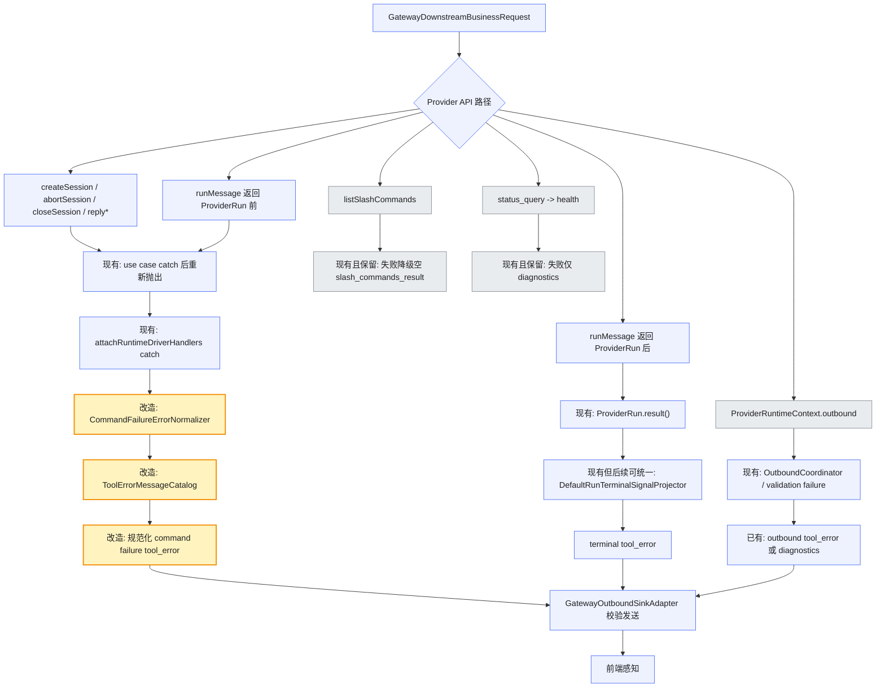
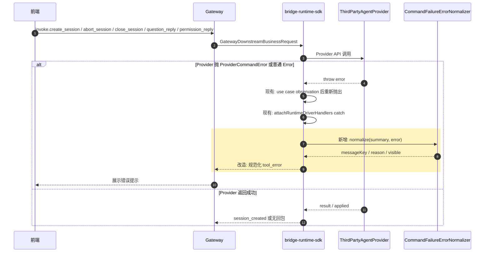
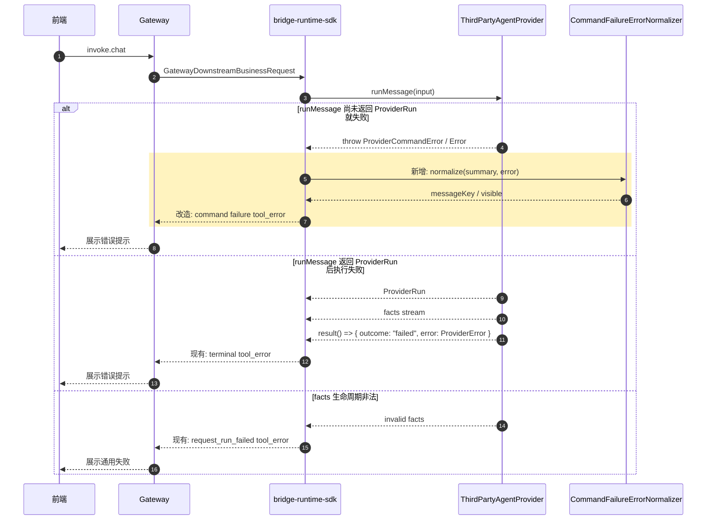
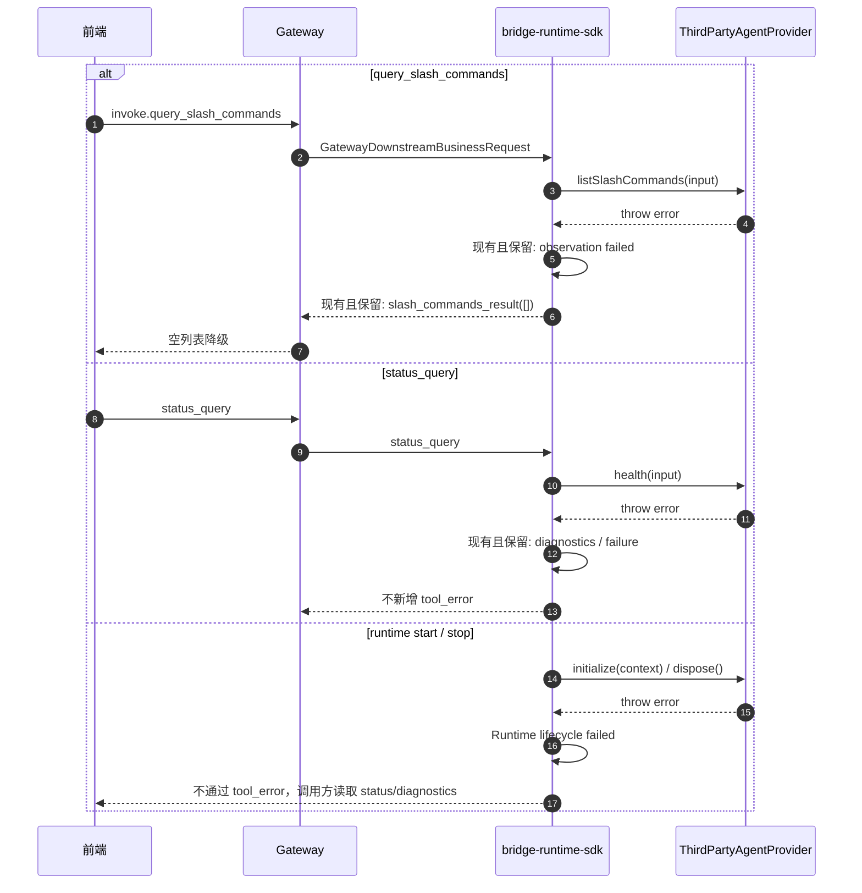
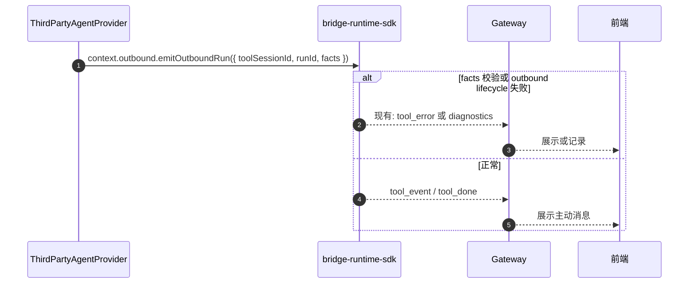

# `bridge-runtime-sdk Provider API 异常 tool_error 回显方案`

- 方案日期：`2026-07-08`
- 目标工程：`agent-plugin / packages/bridge-runtime-sdk`
- 参考文档：`docs/design/interfaces/bridge-runtime-sdk-integration.md`、`packages/bridge-runtime-sdk/src/domain/provider-contract.ts`、`packages/bridge-runtime-sdk/src/domain/errors.ts`、`packages/bridge-runtime-sdk/src/application/runtime-assembly/downstream.ts`、`packages/bridge-runtime-sdk/src/application/projectors/CommandFailureToolErrorProjector.ts`、`packages/bridge-runtime-sdk/src/application/projectors/DefaultRunTerminalSignalProjector.ts`、`packages/bridge-runtime-sdk/src/application/usecases/*`
- 方案类型：`SDK/API 异常处理优化方案`

## 1. 背景

### 1.1 场景说明

`docs/design/interfaces/bridge-runtime-sdk-integration.md` 对外暴露的 Provider API 包括 `initialize()`、`health()`、`createSession()`、`listSlashCommands()`、`runMessage()`、`replyQuestion()`、`replyPermission()`、`closeSession()`、`abortSession()`、`dispose()`，以及通过 `ProviderRuntimeContext.outbound` 注入给 Provider 的 `emitOutboundMessage()` / `emitOutboundRun()`。

当前 SDK 已经具备部分 `tool_error` 回显能力：

1. `CommandFailureToolErrorProjector` 会在 `attachRuntimeDriverHandlers()` 捕获 `invoke.*` 异常后，对部分命令失败投影 `tool_error`。
2. `DefaultRunTerminalSignalProjector` 会把 `ProviderRun.result()` 的 `outcome: 'failed'` 投影为 terminal `tool_error`。
3. `RequestRunFailureToolErrorProjector` 会把 request run facts 生命周期错误投影为通用 `tool_error`。
4. outbound facts 校验失败已有 `tool_error` 收口路径。

但现状仍有问题：`CommandFailureToolErrorProjector` 会把普通 `Error.message` 直接回显给前端；`ProviderCommandError` / `ProviderError` 虽已存在为结构化错误接口，但没有统一 type guard 和 normalizer；`createSession()`、`abortSession()`、`closeSession()`、`replyQuestion()`、`replyPermission()` 等 Provider API 的异常是否应回显、如何回显、是否已有能力，缺少接口级说明。

### 1.2 需求目标

1. 以 `bridge-runtime-sdk-integration.md` 暴露的 Provider API 为索引，梳理每个接口异常是否需要以 `tool_error` 回显到前端。
2. 明确每个接口当前 `tool_error` 现状是否合理，区分“已有且保留”“已有但需改造”“需要新增”“不应新增”。
3. 在时序图中展示已有和新增/改造的 `tool_error` 路径，说明各接口在什么失败场景下触发。
4. 给出具体实现方式，说明复用现有 `ProviderCommandError` / `ProviderError` 结构化错误接口，并新增 type guard / normalizer，而不是新增 Provider 侧 `tool_error` API。

### 1.3 非目标

1. 不调整 gateway 协议字段真源；`tool_error` 结构仍以 `@agent-plugin/gateway-schema` 为准。
2. 不新增 `ThirdPartyAgentProvider.sendToolError()`、`onToolError()` 或其他 Provider 侧消费 `tool_error` 的 API。
3. 不改变 `BridgeRuntime` facade 方法签名。
4. 不把 `status_query` / `health()` 强行改造成 `tool_error`；如需前端感知健康查询失败，应新增状态错误响应协议，而不是复用工具执行错误。
5. 不把 `listSlashCommands()` 默认改为 `tool_error`；当前设计保留空列表降级，除非产品明确要求 slash 命令查询失败 toast。

## 2. 方案图

### 2.1 整体方案图



图例：黄色为本次改造；蓝色为已有并复用；灰色为本轮明确不新增 `tool_error` 的路径。

### 2.2 方案核心

以 Provider API 为粒度统一异常策略：命令应用阶段失败走 `CommandFailureToolErrorProjector` 改造后的规范化 `tool_error`；request run 执行期失败继续走 terminal `tool_error`；查询、生命周期、健康检查类接口默认不新增 `tool_error`。

## 3. 时序图

### 3.1 `createSession / abortSession / closeSession / reply* 命令应用阶段失败`



本图覆盖的 Provider API：`createSession()`、`abortSession()`、`closeSession()`、`replyQuestion()`、`replyPermission()`。这些接口失败会影响用户当前动作，应以 `tool_error` 回显；其中 pending interaction 不存在属于 SDK runtime contract 错误，当前已回显且应保留。

### 3.2 `runMessage` 入口失败与执行期失败



本图区分两个失败阶段：`runMessage()` 入口失败属于 command failure，需要本轮改造文案规范化；`ProviderRun.result()` 失败属于已有 terminal `tool_error`，本轮不改变终态归属，只建议后续统一文案策略。

### 3.3 `listSlashCommands / health / lifecycle 不新增 tool_error`



本图强调非用户命令执行类接口不应混入 `tool_error`：`listSlashCommands()` 已有空列表降级；`health()` 对应 `status_query`，没有合适的 `toolSessionId` 语义；`initialize()` / `dispose()` 属于 SDK lifecycle。

### 3.4 `Provider outbound 主动发送失败`



`emitOutboundMessage()` / `emitOutboundRun()` 是 SDK 注入给 Provider 的发送出口。Provider 仍然只提交 facts，不直接构造 `tool_error`。

## 4. 技术细节

### 4.1 调整点

1. 以 `ThirdPartyAgentProvider` 暴露接口为维度建立异常回显矩阵，明确每个接口是否应回 `tool_error`。
2. 改造 `CommandFailureToolErrorProjector`：不再直接透传普通 `Error.message`，改为基于结构化错误和 catalog 输出用户文案。
3. 新增 `CommandFailureErrorNormalizer` 和 provider error type guard，复用现有 `ProviderCommandError` / `ProviderError` 接口。
4. 扩展 `ToolErrorMessageCatalog`，补充 provider unavailable、invalid input、not supported、session not found、command failed 等文案 key。
5. 保留 `listSlashCommands()` 空列表降级、`health()` diagnostics-only、lifecycle facade reject 的现有策略。
6. 保留 request run terminal `tool_error` 归属，不把 `ProviderRun.result()` 失败改造成 command failure。

### 4.2 核心实现方式

本节回答“怎么实现 4.4 的接口级矩阵”。4.4 是决策表，说明每个 Provider API 异常是否要回 `tool_error`；4.2 是实现方案，说明这些决策如何在现有代码里落地。因此 4.2 不再重复列每个接口场景，而是定义统一的错误来源识别、归一化结果和改造文件。

结构化错误现状：已有 `ProviderCommandError` 和 `ProviderError` 接口，分别位于 `packages/bridge-runtime-sdk/src/domain/errors.ts` 与 `packages/bridge-runtime-sdk/src/domain/provider-contract.ts`。它们是 TypeScript 结构化接口，不是运行时 `class`，因此不能用 `instanceof` 判断。实现上应复用这些接口，并新增共享 type guard / normalizer。

`RuntimeContractError`、`ProviderCommandError`、`ProviderError` 的语义不同，不建议合并为同一个领域错误类型；但可以在投影层归一成同一种前端展示决策。

| 类型 | 定义位置 | 产生方 | 代表含义 | 典型场景 | 是否可合并为同一错误类型 | 是否可归一到前端文案 |
|---|---|---|---|---|---|---|
| `RuntimeContractError` | `src/domain/errors.ts` | SDK runtime 内部 | SDK 自己发现运行时契约被违反，或请求与 runtime 状态冲突 | `run_already_active`、pending interaction 不存在、facts 生命周期非法 | 不建议；它是 SDK fail-closed 语义 | 可以，在 `CommandFailureErrorNormalizer` 中转为展示决策 |
| `ProviderCommandError` | `src/domain/errors.ts` / `provider-contract.ts` | Provider 实现方 | Provider API 命令应用阶段失败，方法尚未形成 request run terminal | `createSession()` 失败、`runMessage()` 返回前失败、`abortSession()` 失败 | 不建议；它是 Provider SPI 语义 | 可以，在 `CommandFailureErrorNormalizer` 中转为展示决策 |
| `ProviderError` | `src/domain/errors.ts` / `provider-contract.ts` | Provider 实现方 | request run 执行期的终态失败信息 | `ProviderRun.result()` 返回 `outcome: "failed"` | 不建议；它属于 terminal result 语义 | 可以，但本轮仅保留现有 terminal projector，后续再统一 catalog |

归一化边界建议如下：

1. 领域层不归一：保留 `RuntimeContractError`、`ProviderCommandError`、`ProviderError` 的来源差异，方便 diagnostics 判断错误责任边界。
2. 投影层归一：仅在 `CommandFailureErrorNormalizer` 中把不同错误来源归一成 `ToolErrorDisplayDecision`，供 `CommandFailureToolErrorProjector` 生成 `tool_error`。
3. terminal 路径暂不归一：`ProviderError` 主要由 `DefaultRunTerminalSignalProjector` 消费，本轮不改变 terminal 归属，避免重复终态。

建议实现文件：

1. 新增 `packages/bridge-runtime-sdk/src/application/projectors/provider-error-guards.ts`
   - 提供 `isProviderCommandError(value)`、`isProviderError(value)`。
   - 使用包内共享 type guard，遵守根规则，避免在业务文件散落 object 判断。
   - 仅判断 `code` 和 `message` 的结构，不把 `details` 作为稳定业务语义。

2. 新增 `packages/bridge-runtime-sdk/src/application/projectors/CommandFailureErrorNormalizer.ts`
   - 输入：`CommandFailureSummary`、`unknown error`。
   - 输出：`ToolErrorDisplayDecision`。
   - 负责区分 runtime contract 错误、provider command error 和普通错误；`ProviderRun.result()` 的 terminal `ProviderError` 不进入本 normalizer 的主路径。

3. 修改 `packages/bridge-runtime-sdk/src/application/projectors/ToolErrorMessageCatalog.ts`
   - 导出 `ToolErrorMessageKey`。
   - 保留现有 key：`run_already_active`、`pending_interaction_not_found`、`request_run_failed`。
   - 新增 key：`provider_unavailable`、`provider_invalid_input`、`provider_not_supported`、`provider_not_found`、`session_not_found`、`command_failed`。

4. 修改 `packages/bridge-runtime-sdk/src/application/projectors/CommandFailureToolErrorProjector.ts`
   - 删除私有 `normalizeErrorMessage()` 的前端直出行为。
   - `project()` 先根据 `summary.messageType` / `action` 做接口级判断，再调用 normalizer。
   - `visible=true` 时按 catalog 生成 `tool_error.error`；有 `toolSessionId` 则携带，`create_session` 失败可返回无 `toolSessionId` 的 `tool_error`。
   - `visible=false` 返回 `null`，由 observation/diagnostics 保留排障信息。

5. 保持 `packages/bridge-runtime-sdk/src/application/runtime-assembly/downstream.ts` 为统一捕获边界。
   - use case 内部仍只负责 observation 后重新抛出。
   - 不在 `CreateSessionUseCase`、`AbortExecutionUseCase`、`CloseSessionUseCase`、`ReplyQuestionUseCase`、`ReplyPermissionUseCase` 内直接发送 `tool_error`。

归一化输出只表达投影需要的信息，不替代原始错误：

```ts
export type ToolErrorDisplayDecision =
  | {
      visible: true;
      messageKey: ToolErrorMessageKey;
      reason?: 'session_not_found';
      diagnosticCode?: string;
      source: 'runtime_contract' | 'provider_command' | 'unknown';
    }
  | {
      visible: false;
      suppressReason:
        | 'non_invoke'
        | 'unsupported_action'
        | 'request_run_lifecycle_owned'
        | 'diagnostics_only';
      diagnosticCode?: string;
      source: 'runtime_contract' | 'provider_command' | 'unknown';
    };
```

具体“哪个接口、什么场景需要 visible=true”不在 4.2 展开，统一由 4.4 的 Provider API `tool_error` 汇总表描述。实现时 normalizer 只根据 `summary.action` 和错误来源返回展示决策，避免 use case、projector、文案目录之间重复维护场景表。

### 4.3 兼容与边界

1. `ProviderCommandError` / `ProviderError` 已经存在，不新增错误类；新增的是运行时识别 helper 和文案 normalizer。
2. Provider 不消费 `tool_error`：`tool_error` 是 SDK 到 gateway/前端的上行业务消息，Provider 侧只抛错或返回 terminal result。
3. 普通 `Error.message` 不再默认作为前端文案；原始 message 继续进入 observation/diagnostics。
4. `ProviderRun.result()` 的 terminal failed 当前仍使用 `DefaultRunTerminalSignalProjector`，本轮只记录“后续可统一 catalog”，避免改变 request run 终态语义。
5. `status_query`、`initialize()`、`dispose()` 不走 `tool_error`，因为它们不属于用户某个 tool session 的命令执行结果。
6. `listSlashCommands()` 当前失败返回空列表，属于已有产品降级策略；如要变更为 `tool_error` 需单独确认前端展示交互。

### 4.4 Provider API `tool_error` 汇总表

| Provider API / SDK 入口 | 触发来源 | 当前 tool_error 现状 | 现状分类 | 本轮动作 | 新增/改造场景 |
|---|---|---|---|---|---|
| `initialize(context)` | `BridgeRuntime.start()` | 无，启动失败通过 `start()` reject / status / diagnostics 暴露 | 不应新增 | 不新增 | 不涉及 |
| `health(input)` | `status_query` | 无，异常只记录 observation/diagnostics | 不应新增 | 不新增 | 如需前端感知，应新增 `status_error` 类响应，不复用 `tool_error` |
| `createSession(input)` | `invoke.create_session` | 已有：外层 catch 后生成无 `toolSessionId` 的 `tool_error`，但会直出 `Error.message` | 已有但需改造 | 改造 | provider 抛 `ProviderCommandError` / 普通 `Error` 时回 catalog 文案 |
| `listSlashCommands(input)` | `invoke.query_slash_commands` | 无 `tool_error`；当前 catch 后回空 `slash_commands_result` | 不应新增 | 不新增 | 不涉及；产品要求 toast 时另议 |
| `runMessage(input)` 返回前 | `invoke.chat` | 已有：外层 catch 后生成 `tool_error`，但会直出 `Error.message` | 已有但需改造 | 改造 | provider 初始化 run 失败、底层 agent 不可用、入参拒绝 |
| `ProviderRun.result()` | `runMessage` 返回后 | 已有：`outcome: failed` 投影 terminal `tool_error` | 已有且保留 | 保留，后续可统一文案 | provider 执行期失败，`error.code === session_not_found` 已携带 reason |
| `replyQuestion(input)` | `invoke.question_reply` | 已有：pending 不存在回 catalog；provider 抛错会直出 message | 已有但需改造 | 改造 | pending 已失效、provider 应用答案失败 |
| `replyPermission(input)` | `invoke.permission_reply` | 已有：pending 不存在回 catalog；provider 抛错会直出 message | 已有但需改造 | 改造 | pending 已失效、provider 应用权限失败 |
| `closeSession(input)` | `invoke.close_session` | 已有：外层 catch 后生成 `tool_error`，但会直出 `Error.message` | 已有但需改造 | 改造 | provider 关闭失败、目标 session 不存在 |
| `abortSession(input)` | `invoke.abort_session` | 已有：外层 catch 后生成 `tool_error`，但会直出 `Error.message` | 已有但需改造 | 改造 | provider 中止失败、目标 run/session 不存在 |
| `dispose()` | `BridgeRuntime.stop()` | 无，停止失败通过 `stop()` reject / diagnostics 暴露 | 不应新增 | 不新增 | 不涉及 |
| `emitOutboundMessage(input)` | Provider 主动 outbound | 已有 outbound lifecycle / validation failure `tool_error` 或 diagnostics | 已有且保留 | 保留 | facts 非法、outbound 生命周期冲突 |
| `emitOutboundRun(input)` | Provider 主动 outbound | 已有 outbound lifecycle / validation failure `tool_error` 或 diagnostics | 已有且保留 | 保留 | facts 非法、outbound 生命周期冲突 |

本轮不新增新的 Provider 侧 `tool_error` 接口；“新增”主要体现在 SDK 内部新增 `CommandFailureErrorNormalizer` 和 provider error type guard，用于改造已有 command failure `tool_error` 的文案和错误码归一化。

### 4.5 文档需要同步修改的内容

1. `docs/design/interfaces/bridge-runtime-sdk-integration.md`：补充 Provider 异常暴露方式、`ProviderCommandError` / `ProviderError` 使用建议，以及 Provider 不直接消费 `tool_error`。
2. `packages/bridge-runtime-sdk/docs/bridge-runtime-sdk-architecture.md`：补充 command failure `tool_error` 与 terminal `tool_error` 的职责差异。
3. `docs/architecture/bridge-runtime-sdk-architecture.md`：同步接口级异常回显矩阵。
4. `packages/bridge-runtime-sdk/CHANGELOG.md`：实现后记录前端可见错误文案规范化变更。

## 5. 性能

不新增网络请求；新增开销仅发生在异常路径上的结构判断、错误码映射和文案查表，对正常 fact 流、首屏和 slash command 列表无明显影响。

## 6. 功耗

不增加轮询、长连接、后台任务、动画或频繁刷新；仅在已有命令失败时发送一条规范化 `tool_error`。

## 7. 埋码

1. `runtime_sdk.command_failure.tool_error_projected`
   - 说明：记录命令失败已投影为 `tool_error`，字段包含 `providerApi`、`action`、`messageKey`、`diagnosticCode`、`hasToolSessionId`。
2. `runtime_sdk.command_failure.tool_error_suppressed`
   - 说明：记录未投影 `tool_error` 的原因，例如 `diagnostics_only`、`unsupported_action`、`request_run_lifecycle_owned`。
3. `runtime_sdk.provider_error.normalized`
   - 说明：记录 provider 结构化错误被 normalizer 识别的情况，仅记录 `code` / `retryable`，不记录敏感 `details` 原文。

## 8. 影响范围

### 8.1 直接影响

1. `packages/bridge-runtime-sdk/src/application/projectors/CommandFailureToolErrorProjector.ts`
2. `packages/bridge-runtime-sdk/src/application/projectors/ToolErrorMessageCatalog.ts`
3. `packages/bridge-runtime-sdk/src/application/projectors/CommandFailureErrorNormalizer.ts`（新增）
4. `packages/bridge-runtime-sdk/src/application/projectors/provider-error-guards.ts`（新增）
5. `packages/bridge-runtime-sdk/tests/command-failure-tool-error-projector.test.ts`
6. `packages/bridge-runtime-sdk/tests/runtime-sdk.test.ts`

### 8.2 间接影响

1. 前端收到的 `tool_error.error` 会从 provider 原始 message 变为 SDK catalog 文案。
2. OpenClaw/OpenCode provider 如需更准确文案，应抛结构化 `ProviderCommandError`，否则默认映射为通用失败。
3. diagnostics 仍保留原始错误摘要，排障路径不变。

### 8.3 不影响

1. 不影响 `ThirdPartyAgentProvider` 方法签名。
2. 不影响 `BridgeRuntime` facade 方法签名。
3. 不影响 gateway-client 连接状态机。
4. 不影响 `tool_event` family 差异投影。
5. 不影响 integration/opencode-cui submodule。

## 9. 测试范围

### 9.1 功能测试

1. `createSession()` 抛 `ProviderCommandError('provider_unavailable')` 时，SDK 返回无 `toolSessionId` 的 catalog `tool_error`。
2. `runMessage()` 返回 `ProviderRun` 前抛普通 `Error('run_failed')` 时，SDK 返回通用文案，不直出 `run_failed`。
3. `abortSession()` / `closeSession()` 抛 `ProviderCommandError('not_found')` 时，SDK 返回携带原 `toolSessionId` 的 `tool_error`。
4. `replyQuestion()` / `replyPermission()` pending 不存在时，继续返回“当前交互已失效，请刷新后重试”。
5. `replyQuestion()` / `replyPermission()` pending 存在但 provider 抛错时，SDK 返回规范化 `tool_error`。
6. `listSlashCommands()` 抛错时仍返回空 `slash_commands_result`，不新增 `tool_error`。
7. `health()` 抛错时不返回 `tool_error`，仅记录 observation/diagnostics。
8. `ProviderRun.result()` 返回 `outcome: 'failed'` 时仍只发送 terminal `tool_error`，不重复发送 command failure `tool_error`。

### 9.2 兼容测试

1. 现有 `tool_done`、terminal `tool_error`、`session_created`、`status_response` 行为不回归。
2. `ProviderCommandError` / `ProviderError` type guard 能识别结构化对象，也能安全忽略普通对象。
3. 普通 `Error`、字符串异常、未知 code 都落到通用文案。
4. `GatewayOutboundSinkAdapter` 对生成的 `tool_error` 继续做 schema 校验，校验失败不递归发送新错误。

### 9.3 文档一致性检查

1. 核对 `docs/design/interfaces/bridge-runtime-sdk-integration.md` 的 Provider API 列表与本方案矩阵一致。
2. 核对 `ProviderCommandError` / `ProviderError` code 集合与本方案错误映射一致。
3. 核对 runtime tests 中现有 `tool_error` snapshot，更新普通 `Error.message` 直出预期。

## 10. 最终建议

最终结论：推荐采用“Provider API 接口级矩阵 + 复用现有结构化错误接口 + command failure normalizer + catalog 文案”的方案。这样可以精准回答每个 Provider API 异常是否需要前端感知，保留已有 terminal/outbound 限界，同时修复普通 `Error.message` 直出前端的问题。后续动作建议先补 `ProviderCommandError` / `ProviderError` type guard 和 normalizer 单测，再改造 `CommandFailureToolErrorProjector`，最后更新 `runtime-sdk.test.ts` 中 command failure `tool_error` 断言与对外集成文档。
