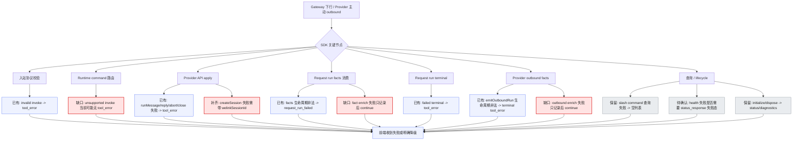
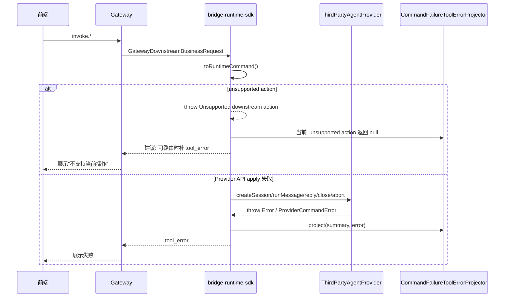
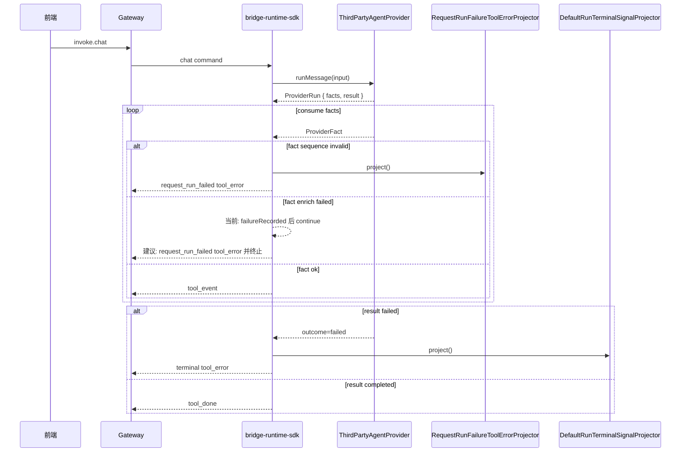
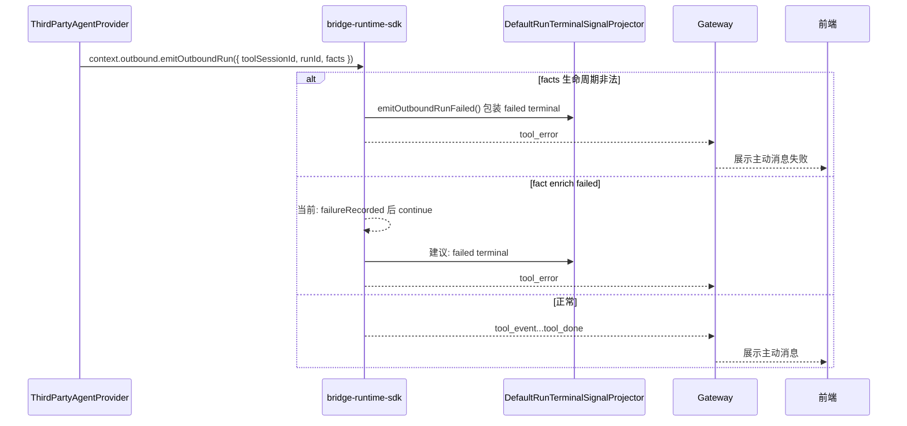

# `bridge-runtime-sdk Provider API tool_error 异常感知缺口评审方案`

- 方案日期：`2026-07-10`
- 目标工程：`agent-plugin / packages/bridge-runtime-sdk`
- 参考文档：`docs/design/interfaces/bridge-runtime-sdk-integration.md`、`docs/design/interfaces/third-party-agent-provider-v1.md`、`packages/bridge-runtime-sdk/src/application/runtime-assembly/downstream.ts`、`packages/bridge-runtime-sdk/src/adapters/gateway/GatewayInboundPolicy.ts`、`packages/bridge-runtime-sdk/src/application/projectors/*`、`packages/bridge-runtime-sdk/src/application/coordinators/*`、`packages/bridge-runtime-sdk/src/application/usecases/*`
- 方案类型：`SDK/API 异常处理评审方案`

## 1. 背景

### 1.1 场景说明

第三方通过 `ThirdPartyAgentProvider` 接入 `bridge-runtime-sdk` 后，前端用户动作会经过 gateway 下行、SDK runtime command、Provider API 调用、Provider facts 消费、terminal 投影、gateway 上行发送等多个节点。当前 SDK 已经有多条 `tool_error` 上报链路，但仍存在部分关键节点只记录 diagnostics、只抛异常、或发送了不可路由 `tool_error` 的情况，前端可能表现为无响应、等待不结束、局部事件静默丢失，用户无法判断异常出在哪里。

本方案的重点是评审 SDK 流程中“重要节点是否缺少 `tool_error` 或失败终态”，不是优先改造已有上报文案。已有上报的文案规范化、错误 catalog、脱敏展示属于后续体验和安全优化；本轮只在它们会影响用户感知或路由时纳入 P0/P1。

### 1.2 需求目标

1. 梳理 SDK 主流程中已有 `tool_error` 上报场景，确认其覆盖阶段、路由字段和重要性。
2. 找出仍需新增或补齐 `tool_error` 的关键缺口，特别是会导致前端无响应、等待不结束、静默丢事件的节点。
3. 明确哪些异常不应使用 `tool_error`，但必须通过明确降级响应、status 或 diagnostics 让调用方可感知。
4. 给测试团队提供验证策略：哪些用 mock Provider / FakeGateway 即可，哪些需要 gateway 服务器配合，哪些适合手动破坏 agent 做端到端兜底。

### 1.3 非目标

1. 不改变 `tool_error` 协议真源；字段合法性仍以 `@agent-plugin/gateway-schema` 为准。
2. 不新增 Provider 直接发送 `tool_error` 的 public API；Provider 仍通过抛错、返回 failed terminal、或提交 facts 表达失败。
3. 不把所有错误强行收敛到一个全局 `sendToolError()`；保留 command failure、request lifecycle、terminal、inbound invalid 的阶段边界。
4. 不把 `health()`、`initialize()`、`dispose()` 这类 lifecycle / status 场景伪装成 tool session 执行失败。
5. 不要求当前轮立即完成文案 catalog、脱敏、ProviderCommandError code 映射；这些是已有上报的质量优化，不是缺口评审主线。

## 2. 方案图

### 2.1 整体方案图

### 2.2 方案核心

以“用户动作是否已经进入可感知执行边界”为判断标准：进入 `invoke.chat`、`create_session`、`reply*`、`abort/close` 或 `emitOutboundRun` 后，失败必须有 `tool_error` 或等价 terminal；查询和 lifecycle 不强行复用 `tool_error`，但必须验证有明确响应或 diagnostics。

## 3. 时序图

### 3.1 `invoke` 命令失败收口

### 3.2 `request run facts / terminal`

### 3.3 `Provider outbound 主动发送`

## 4. 技术细节

### 4.1 调整点

1. `CommandFailureToolErrorProjector` 补齐可路由失败：unsupported `invoke`、`create_session` 失败只有 `welinkSessionId` 的场景。
2. `RequestRunCoordinator` 将 `ProviderFactEnricher.enrich()` 失败从“记录后继续”升级为 request run 失败终态，避免关键 permission 事件静默丢失后仍发 `tool_done`。
3. `OutboundCoordinator.emitOutboundRun()` 将 enrich 失败走 failed terminal，避免主动消息部分事件丢失。
4. `status_query` 的 Provider `health()` 失败不建议使用 `tool_error`，但需要单独确认是否补 `status_response` 失败态，避免状态查询调用方等待。
5. 保持 `ListSlashCommandsUseCase` 的空列表降级，不新增 `tool_error`。

### 4.2 核心实现方式

建议最小实现范围如下：

1. 修改 `packages/bridge-runtime-sdk/src/application/projectors/CommandFailureToolErrorProjector.ts`
   - unsupported `invoke` 只要 `summary.toolSessionId` 或 `summary.welinkSessionId` 存在，就生成 `tool_error`。
   - `tool_error` 输出同时支持 `toolSessionId` 与 `welinkSessionId`；`create_session` 失败时至少携带 `welinkSessionId`。
   - `fact_sequence_invalid`、`pending_interaction_conflict` 仍交给 request lifecycle 路径，避免重复上报。
2. 修改 `packages/bridge-runtime-sdk/src/application/coordinators/RequestRunCoordinator.ts`
   - `enriched.ok === false` 时记录 observation 后抛出 `RuntimeContractError('fact_sequence_invalid', ...)` 或引入更精确的 runtime code。
   - 复用现有 `RequestRunFailureToolErrorProjector` 发送 `request_run_failed`。
3. 修改 `packages/bridge-runtime-sdk/src/application/coordinators/OutboundCoordinator.ts`
   - outbound run 的 enrich failure 抛出后由既有 `emitOutboundRunFailed()` 包装 failed terminal。
   - 已废弃 `emitOutboundMessage()` 不强行补 terminal 语义，保持 Promise reject / diagnostics。
4. 补充 focused tests
   - `command-failure-tool-error-projector.test.ts` 覆盖 unsupported action 与 welink-only create_session。
   - `runtime-sdk.test.ts` 覆盖 request run enrich failure、outbound run enrich failure。

### 4.3 兼容与边界

1. Provider 不直接感知 `tool_error`；Provider API apply 失败继续通过 rejected promise / throw 暴露。
2. `ProviderRun.result()` 返回 failed 是 terminal 真源，继续由 `DefaultRunTerminalSignalProjector` 生成 `tool_error`。
3. `GatewayOutboundSinkAdapter.send()` 只做 schema 校验与发送；如果 sink 本身不可用，不递归构造新的 `tool_error`。
4. `health()`、`initialize()`、`dispose()` 没有稳定 `toolSessionId` 语义，不使用 `tool_error`。
5. 文案 catalog 与普通 `Error.message` 脱敏建议后续做，但不影响本轮缺口评审结论。

### 4.4 相关接口联动

#### 4.4.1 已有 `tool_error` 上报场景

| SDK 节点 | 触发场景 | 当前入口 | 当前形态 | 重要性 | 评审结论 |
|---|---|---|---|---|---|
| 入站协议校验 | gateway-client 判定 invalid `invoke`，且 frame 有 `toolSessionId` 或 `welinkSessionId` | `GatewayInboundPolicy.handle()` | `tool_error.error = gateway_invalid_invoke:${code}`，携带可用 session 标识 | P0 | 已有上报，保留 |
| Provider API apply | `runMessage()` 返回 `ProviderRun` 前抛错 | `attachRuntimeDriverHandlers()` + `CommandFailureToolErrorProjector` | 携带 `toolSessionId`，error 当前可能直出异常 message | P0 | 已有上报；后续优化文案 |
| Provider API apply | `replyQuestion()` / `replyPermission()` 找不到 pending interaction | `InteractionCoordinator` 抛 `RuntimeContractError` 后进入 command failure projector | `pending_interaction_not_found` catalog 文案 | P0 | 已有上报，保留 |
| Runtime 前置约束 | 同一 `toolSessionId` 重复 `chat` | `StartRequestRunUseCase` 抛 `run_already_active` 后进入 command failure projector | `run_already_active` catalog 文案 | P0 | 已有上报，保留 |
| request run facts | facts 生命周期非法，例如未 `message.start` 就 `text.delta` | `RequestRunCoordinator` + `RequestRunFailureToolErrorProjector` | `request_run_failed` | P0 | 已有上报，保留 |
| request run terminal | `ProviderRun.result()` 返回 `outcome: "failed"` | `DefaultRunTerminalSignalProjector` | `tool_error`，`session_not_found` 时带 `reason` | P0 | 已有上报，保留 |
| request run terminal | `ProviderRun.result()` reject | `RequestRunCoordinator` 抛出后被 command failure 捕获 | command failure `tool_error` | P0 | 已有兜底；建议补测试锁定 |
| outbound run facts | `emitOutboundRun()` facts 生命周期非法 | `OutboundCoordinator.emitOutboundRunFailed()` + terminal projector | failed terminal `tool_error` | P0 | 已有上报，保留 |

#### 4.4.2 需要新增或补齐 `tool_error` 的场景

| SDK 节点 | 缺口场景 | 现状 | 用户影响 | 重要性 | 建议动作 |
|---|---|---|---|---|---|
| Runtime command 路由 | `invoke` action 不支持，但消息里有 `toolSessionId` 或 `welinkSessionId` | `toRuntimeCommand()` 抛错；`CommandFailureToolErrorProjector.isSupportedAction()` 返回 `null` | 前端可能没有失败回包，点击后无响应 | P0 | 新增 unsupported invoke `tool_error` |
| `createSession()` | Provider 抛错且会话尚未生成 `toolSessionId` | 当前 projector 允许进入，但输出不带 `welinkSessionId`；已有测试名也锁定“不回显 welinkSessionId” | 前端难以把失败挂到发起的新建会话请求 | P0 | `tool_error` 补带 `welinkSessionId` |
| request run facts enrich | `permission.reply` 找不到展示上下文、`permission.ask` 展示冲突 | `ProviderFactEnricher.enrich()` 返回 `ok:false` 后只 `failureRecorded` 并 `continue` | 关键交互状态静默丢失，后续可能仍 `tool_done` | P1 | 作为 request lifecycle failure 发送 `request_run_failed` 并终止 run |
| outbound run facts enrich | Provider 主动 `emitOutboundRun()` 中 permission enrich 失败 | 当前只记录后继续，最终可能 `tool_done` | 主动消息局部丢事件，用户误以为成功 | P1 | 走 `emitOutboundRunFailed()` 生成 terminal `tool_error` |
| command failure 文案 | Provider API 抛普通 `Error` 或结构化 `ProviderCommandError` | 已会上报，但普通 message 可能直出 | 用户能感知失败，但可能看到技术错误或敏感信息 | P1 | 后续加 normalizer/catalog；不作为“缺上报”处理 |

#### 4.4.3 不建议新增 `tool_error`，但要验证不无响应的场景

| SDK 节点 | 场景 | 当前行为 | 重要性 | 结论 |
|---|---|---|---|---|
| slash command 查询 | `listSlashCommands()` 抛错 | 捕获后返回 `slash_commands_result([])` | P2 | 不新增 `tool_error`；空列表是明确降级响应 |
| status 查询 | `health()` 抛错 | `QueryStatusUseCase` 抛错，外层不会生成 `tool_error` | P2/P3 | 不使用 `tool_error`；待确认是否需要 `status_response` 失败态 |
| runtime 启动 | `initialize(context)` 抛错 | `runtime.start()` reject，status/diagnostics 记录失败 | P3 | 不使用 `tool_error` |
| runtime 停止 | `dispose()` 抛错 | `runtime.stop()` reject 或 lifecycle failure | P3 | 不使用 `tool_error` |
| 已废弃 outbound message | `emitOutboundMessage()` facts 失败 | Promise reject 给 Provider，缺少 run terminal 语义 | P2 | 不新增前端协议行为；新接入迁移到 `emitOutboundRun()` |
| 上行发送口 | `GatewayOutboundSinkAdapter.send()` 校验失败或 driver 不可用 | 记录 outbound validation failure；不能保证再发 `tool_error` | P1 | 不递归发送；依赖 diagnostics / reconnect / gateway 状态 |

### 4.5 文档需要同步修改的内容

1. `docs/design/interfaces/bridge-runtime-sdk-integration.md`：补充异常感知矩阵，说明 Provider API apply failure、terminal failure、facts contract failure 的区别。
2. `docs/design/interfaces/third-party-agent-provider-v1.md`：补充第三方 Provider 测试建议，明确哪些失败应 throw，哪些应返回 failed terminal。
3. `packages/bridge-runtime-sdk/docs/bridge-runtime-sdk-architecture.md`：补充 `tool_error` 投影边界说明。
4. `packages/bridge-runtime-sdk/CHANGELOG.md`：实现后记录新增/补齐的前端可见失败终态。

## 5. 性能

不新增常态请求；只在异常路径上多发送 `tool_error` 或更早终止异常 facts 流。`ProviderFactEnricher` 失败从 continue 改为终止后，异常场景下反而减少后续无效投影。

## 6. 功耗

不增加轮询、长连接、后台任务、动画或频繁刷新；异常路径额外发送一条失败终态消息，功耗影响可忽略。

## 7. 埋码

1. `runtime_sdk.tool_error.projected`
   - 说明：记录 `tool_error` 已投影，字段建议包含 `stage`、`action`、`hasToolSessionId`、`hasWelinkSessionId`、`runtimeCode`。
2. `runtime_sdk.tool_error.suppressed`
   - 说明：记录未投影原因，例如 `no_route_key`、`diagnostics_only`、`sink_unavailable`、`deprecated_outbound_message`。
3. `runtime_sdk.fact_enrich.failed`
   - 说明：记录 request/outbound fact enrich 失败，字段包含 `flowKind`、`reason`、`toolSessionId`、`runId`，不记录敏感 payload。

## 8. 影响范围

### 8.1 直接影响

1. `packages/bridge-runtime-sdk/src/application/projectors/CommandFailureToolErrorProjector.ts`
2. `packages/bridge-runtime-sdk/src/application/coordinators/RequestRunCoordinator.ts`
3. `packages/bridge-runtime-sdk/src/application/coordinators/OutboundCoordinator.ts`
4. `packages/bridge-runtime-sdk/tests/command-failure-tool-error-projector.test.ts`
5. `packages/bridge-runtime-sdk/tests/runtime-sdk.test.ts`

### 8.2 间接影响

1. 前端对 `create_session` 失败的路由可见性提升，需要确认前端是否消费 `welinkSessionId`。
2. 第三方 Provider 的 permission facts 顺序问题会更早暴露为用户可见失败，而不是仅在 diagnostics 中出现。
3. 手动联调时，错误从“等待/无响应”变为明确失败提示，测试预期需要更新。

### 8.3 不影响

1. `tool_error` schema 字段定义。
2. Provider public API 方法签名。
3. `listSlashCommands()` 的空列表降级策略。
4. runtime lifecycle 的 status/diagnostics 语义。

## 9. 测试范围

### 9.1 功能测试

| 异常场景 | 推荐验证方式 | 是否需要 mock 数据 | 是否需要 gateway 服务器 | 是否需要手动破坏 agent |
|---|---|---|---|---|
| invalid `invoke` 有 `toolSessionId` | 单测 `GatewayInboundPolicy` 或 runtime fake driver | 需要构造 invalid frame | 否 | 否 |
| unsupported `invoke` action | runtime-sdk fake gateway driver 注入 unknown action | 需要构造 downstream message | 否 | 否 |
| `createSession()` throw | mock Provider `createSession` 抛错 | 需要 mock Provider | 否 | 否 |
| `runMessage()` 返回前 throw | mock Provider `runMessage` 抛错 | 需要 mock Provider | 否 | 否 |
| `ProviderRun.result()` failed | mock ProviderRun.result 返回 failed | 需要 mock ProviderRun | 否 | 否 |
| `ProviderRun.result()` reject | mock ProviderRun.result reject | 需要 mock ProviderRun | 否 | 否 |
| facts 生命周期非法 | mock facts async iterable 输出非法顺序 | 需要 mock facts | 否 | 否 |
| request run enrich failure | mock facts 输出缺上下文 `permission.reply` | 需要 mock facts | 否 | 否 |
| `emitOutboundRun()` 生命周期非法 | 在 `initialize()` 保存 outbound 后调用非法 facts | 需要 mock outbound facts | 否 | 否 |
| `emitOutboundRun()` enrich failure | outbound facts 输出缺上下文 `permission.reply` | 需要 mock outbound facts | 否 | 否 |
| slash command 查询失败 | mock `listSlashCommands()` throw | 需要 mock Provider | 否 | 否 |
| health 查询失败 | mock `health()` throw | 需要 mock Provider | 否；如验证前端状态页可用 gateway | 否 |
| gateway 断连 / sink 不可用 | fake driver 模拟 closed 或 send 失败 | 需要 fake driver | 可选；端到端时需要 | 可选 |
| 真实第三方 agent 接入异常 | 端到端联调 | 使用测试账号和测试 gateway 数据 | 是 | 是，适合最终验收兜底 |

建议测试分层：

1. 单元测试优先覆盖 projector、coordinator、usecase 的异常矩阵，mock Provider / mock facts 足够。
2. runtime-sdk 集成测试使用现有 fake gateway driver 验证最终 outbound 消息，不依赖真实 gateway。
3. gateway 服务器配合只用于验证前端实际展示、路由字段是否被消费、断连重连时用户状态是否正确。
4. 手动破坏 agent 只作为最后验收：例如让 Provider 抛错、返回非法 facts、返回 failed terminal、断开底层 agent 连接，确认前端不再无响应。

### 9.2 兼容测试

1. 旧 Provider 抛普通 `Error` 时仍有 `tool_error`，只是后续文案可能被 catalog 替换。
2. 旧前端只看 `toolSessionId` 的路径不受影响；`create_session` 失败新增 `welinkSessionId` 是补充字段。
3. `emitOutboundMessage()` 兼容 API 行为不改变。
4. `listSlashCommands()` 查询失败仍返回空列表。

### 9.3 文档一致性检查

1. 对照 `docs/design/interfaces/bridge-runtime-sdk-integration.md` 的 Provider API 列表，确认每个接口的失败感知方式都有说明。
2. 对照 `packages/bridge-runtime-sdk/src/domain/errors.ts`，确认 `ProviderCommandError`、`ProviderError`、`RuntimeContractError` 三类错误没有被混写。
3. 对照 `@agent-plugin/gateway-schema`，确认新增/补齐的 `tool_error` 字段仍合法。

## 10. 最终建议

最终结论：推荐先做 P0/P1 缺口补齐，而不是先重写已有 `tool_error` 文案体系。优先级为：unsupported `invoke` 补 `tool_error`、`create_session` 失败补 `welinkSessionId`、request run enrich failure 改失败终态、outbound run enrich failure 改 failed terminal。随后再做 Provider 错误 normalizer/catalog，解决已有上报直出技术异常的问题。

测试上以 mock Provider、mock facts、FakeGateway driver 为主即可覆盖绝大多数异常；gateway 服务器和手动破坏 agent 只用于最终端到端验收，重点确认前端是否能用 `toolSessionId` / `welinkSessionId` 正确展示失败，不再出现无响应或长时间等待。
