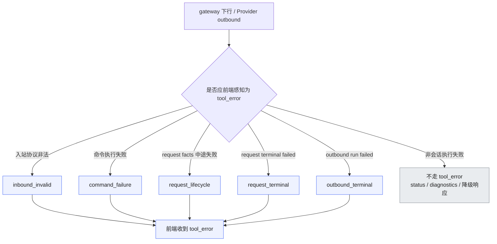
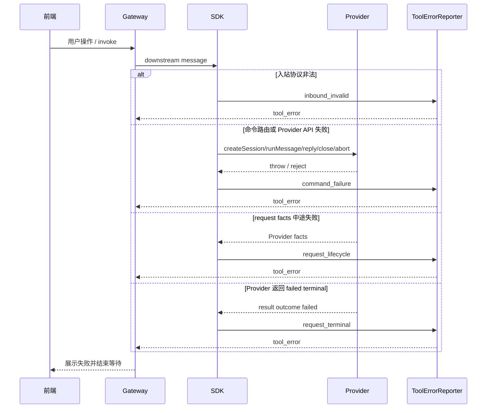
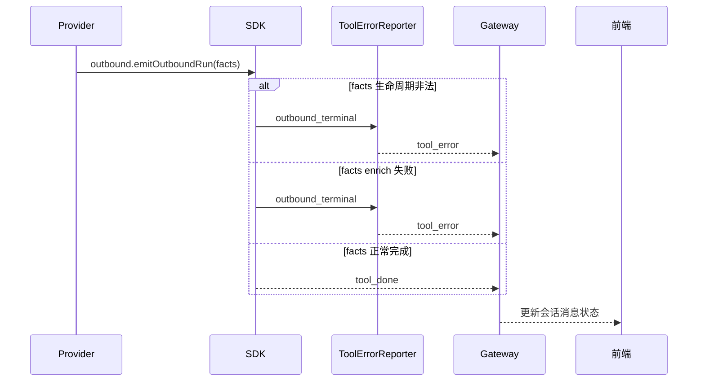

# `bridge-runtime-sdk tool_error stage 场景矩阵`

- 方案日期：`2026-07-22`
- 目标工程：`agent-plugin / packages/bridge-runtime-sdk`
- 参考文档：`docs/design/bridge-runtime-sdk-tool-error-exception-solution.md`、`packages/bridge-runtime-sdk/src/application/reporters/ToolErrorReporter.ts`、`packages/bridge-runtime-sdk/src/adapters/gateway/GatewayInboundPolicy.ts`、`packages/bridge-runtime-sdk/src/application/runtime-assembly/downstream.ts`、`packages/bridge-runtime-sdk/src/application/coordinators/RequestRunCoordinator.ts`、`packages/bridge-runtime-sdk/src/application/coordinators/OutboundCoordinator.ts`、`packages/bridge-runtime-sdk/src/application/projectors/*`
- 方案类型：`SDK 异常上报场景说明`

## 1. 背景

### 1.1 场景说明

`ToolErrorReporter` 当前用 `stage` 标识 `tool_error` 是在哪个 SDK 阶段被收口上报的，阶段类型包括：

```ts
type ToolErrorReportStage =
  | 'inbound_invalid'
  | 'command_failure'
  | 'request_lifecycle'
  | 'request_terminal'
  | 'outbound_terminal';
```

这 5 个 stage 不是前端新协议字段，也不是 Provider public API；它们是 SDK 内部对 `tool_error` 上报位置的归类，方便产品、测试和研发判断“异常发生在哪一段流程、用户会看到什么失败、应该怎么验证”。

### 1.2 需求目标

1. 罗列所有会通过 5 类 stage 上报的 `tool_error` 异常场景。
2. 罗列不走这 5 类 `tool_error` 的异常场景，说明它们为什么不应该发 `tool_error`。
3. 帮助测试人员按业务场景构造 mock Provider、FakeGateway 或端到端联调用例。

### 1.3 非目标

1. 不改变 gateway `tool_error` 协议字段。
2. 不新增 Provider 直接发送 `tool_error` 的能力。
3. 不把 runtime lifecycle、status 查询、slash 命令查询强行包装成会话级 `tool_error`。
4. 不在本文展开文案 catalog、脱敏和监控字段设计。

## 2. 方案图

### 2.1 整体方案图



### 2.2 方案核心

只有“已经进入某个用户会话或一轮 outbound run，且前端需要结束等待或展示失败”的异常，才归入 5 类 `tool_error` stage；没有稳定会话路由、属于启动/连接/status/查询降级的问题，不走 `tool_error`，而是通过 Promise reject、runtime status、diagnostics、日志或明确降级响应让调用方感知。

## 3. 时序图

### 3.1 `下行 invoke 到 request run`



### 3.2 `Provider 主动 outbound run`



## 4. 技术细节

### 4.1 调整点

1. `inbound_invalid`：由 `GatewayInboundPolicy` 在 invalid `invoke` 场景调用 `ToolErrorReporter`。
2. `command_failure`：由 `downstream.ts` 的 command catch 统一调用 `ToolErrorReporter`。
3. `request_lifecycle`：由 `RequestRunCoordinator` 在 request facts 生命周期或 enrich 失败时调用 `ToolErrorReporter`。
4. `request_terminal`：由 `RequestRunCoordinator` 在 terminal projector 产出 `tool_error` 时调用 `ToolErrorReporter`。
5. `outbound_terminal`：由 `OutboundCoordinator` 在 outbound run failed terminal 或 enrich failure 时调用 `ToolErrorReporter`。

### 4.2 核心实现方式

#### 4.2.1 通过 5 类 stage 上报的 `tool_error` 场景

| stage | 异常场景 | 业务触发例子 | 技术触发点 | `tool_error.error` | 重要性 | 验证建议 |
|---|---|---|---|---|---|---|
| `inbound_invalid` | 入站 `invoke` 协议校验失败 | 前端点击发送后，下行请求缺字段；或 SDK 新版本要求会话标识，旧版本调用方未传 | gateway-client 输出 invalid `invoke` frame，且 frame 有 `toolSessionId` 或 `welinkSessionId` | `gateway_invalid_invoke:${code}` | P0 | 构造 invalid inbound frame，不需要真实 gateway |
| `command_failure` | unsupported invoke action | 前端或 gateway 灰度了新按钮、新 action，例如 `rename_session`，但 SDK 还没支持 | `toRuntimeCommand()` 抛 `Unsupported downstream action` | `当前操作暂不支持，请升级 SDK 或稍后重试` | P0 | FakeGateway 注入 unknown action |
| `command_failure` | 新建会话失败 | 用户点击新建会话，第三方 Agent 创建底层会话失败 | `createSession()` 抛错；通常还没有 `toolSessionId` | Provider 异常 message；携带 `welinkSessionId` | P0 | mock Provider `createSession()` throw |
| `command_failure` | 发送消息启动失败 | 用户发送消息，SDK 准备调用 Agent，但 Agent 服务不可用或参数被拒绝 | `runMessage()` 返回 `ProviderRun` 前抛错 | Provider 异常 message | P0 | mock Provider `runMessage()` throw |
| `command_failure` | 同会话重复发送 | 用户连续快速发送，上一轮还没结束又发下一轮 | `StartRequestRunUseCase` 抛 `run_already_active` | `当前会话正在处理中，请稍后再试` | P0 | 构造同一 `toolSessionId` 两次 chat |
| `command_failure` | question 回复失败 | 用户回复问题卡片，但卡片已过期、重复点击或本地 pending 状态丢失 | `InteractionCoordinator` 抛 `pending_interaction_not_found`，或 `replyQuestion()` 抛错 | pending 丢失时为 `当前交互已失效，请刷新后重试`；Provider 抛错时为异常 message | P0 | 构造不存在的 `questionId`，或 mock `replyQuestion()` throw |
| `command_failure` | permission 回复失败 | 用户点击授权/拒绝，但权限卡片已过期、重复点击或本地 pending 状态丢失 | `InteractionCoordinator` 抛 `pending_interaction_not_found`，或 `replyPermission()` 抛错 | pending 丢失时为 `当前交互已失效，请刷新后重试`；Provider 抛错时为异常 message | P0 | 构造不存在的 `permissionId`，或 mock `replyPermission()` throw |
| `command_failure` | 关闭会话失败 | 用户关闭会话，Provider 清理失败或远端返回错误 | `closeSession()` 抛错 | Provider 异常 message | P1 | mock Provider `closeSession()` throw |
| `command_failure` | 中止执行失败 | 用户点击停止，Provider 中止任务失败 | `abortSession()` 抛错 | Provider 异常 message | P1 | mock Provider `abortSession()` throw |
| `command_failure` | request terminal Promise reject | Provider 已返回 `ProviderRun`，但 `result()` 没返回规范 terminal，而是直接 reject | `ProviderRun.result()` reject 后向外抛出，被 command failure catch 收口 | reject 异常 message | P0 | mock `ProviderRun.result()` reject |
| `request_lifecycle` | request facts 生命周期非法 | Agent 开始回复后，事件顺序错误，前端无法拼出正常消息 | 未 `message.start` 就 `text.delta`、`message.done` 顺序错误、`tool.update` 内容非法等 | `当前请求处理失败，请重试` | P0 | mock facts 输出非法顺序 |
| `request_lifecycle` | request facts enrich 失败 | 权限回复找不到对应权限展示上下文，或权限展示上下文冲突 | `ProviderFactEnricher.enrich()` 返回 `ok:false` | `当前请求处理失败，请重试` | P1 | mock facts 输出孤立 `permission.reply` |
| `request_lifecycle` | request pending interaction 冲突 | 不同会话或不同上下文复用了同一个 question / permission id，SDK 无法安全路由回复 | validator / interaction registry 抛 `pending_interaction_conflict` | `当前请求处理失败，请重试` | P1 | mock 重复 questionId / permissionId |
| `request_terminal` | Provider 明确返回 failed terminal | Agent 正常跑到终态，但明确告诉 SDK 本轮失败，例如模型失败、工具失败、远端服务失败 | `ProviderRun.result()` 返回 `{ outcome: "failed", error }` | `error.message`；缺失时用默认失败文案 | P0 | mock `result()` 返回 failed |
| `request_terminal` | 会话不存在 failed terminal | Agent 返回底层会话不存在，前端可能需要重建会话 | `ProviderRun.result()` failed 且 `error.code === "session_not_found"` | `error.message`，并带 `reason: "session_not_found"` | P0 | mock failed terminal code 为 `session_not_found` |
| `outbound_terminal` | outbound run facts 生命周期非法 | Provider 主动推送后台任务结果，但 facts 顺序错误 | `emitOutboundRun()` facts 校验失败 | 内部校验错误 message，例如 `text.delta requires an open message` | P0 | 在 `initialize()` 保存 outbound 后调用非法 facts |
| `outbound_terminal` | outbound run facts enrich 失败 | Provider 主动推送权限相关结果，但缺少前端展示上下文 | `emitOutboundRun()` 中 `ProviderFactEnricher.enrich()` 返回 `ok:false` | `主动消息处理失败，请重试` | P1 | outbound facts 输出孤立 `permission.reply` |
| `outbound_terminal` | outbound run facts 流其它异常 | Provider 主动消息的 async iterable 中途抛错 | `emitOutboundRun()` consume facts 抛出非 enrich 异常 | 异常 message | P1 | mock outbound facts async iterator throw |

#### 4.2.2 不走这 5 类 `tool_error` 的异常场景

| 场景 | 业务触发例子 | 当前感知方式 | 不走 `tool_error` 的原因 | 重要性 | 验证建议 |
|---|---|---|---|---|---|
| `runtime.start()` Provider 初始化失败 | 插件启动时 Provider 配置错误、认证失败、依赖服务不可用 | `runtime.start()` reject；`getStatus()` 进入 failed；diagnostics/log 记录错误 | 没有用户会话和 `toolSessionId`，属于 runtime lifecycle | P3 | mock `initialize()` throw |
| `runtime.start()` gateway 连接失败 | gateway 地址错误、鉴权失败、握手失败、网络不可达 | `runtime.start()` reject；status/diagnostics/log 记录 gateway 失败 | 启动连接阶段没有稳定会话路由；gateway 不可用时也不能保证再发上行消息 | P3 | FakeGateway `connect()` throw |
| runtime 运行中 gateway 非重试关闭 | gateway 鉴权被撤销、服务端拒绝、连接进入失败态 | `getStatus()` 进入 failed；diagnostics/log 记录 runtime failure | gateway 已不可用，递归发送 `tool_error` 不可靠 | P1/P3 | fake driver 发出 failure closed 状态 |
| `runtime.stop()` Provider dispose 失败 | 插件关闭或账号切换时 Provider 释放资源失败 | `runtime.stop()` reject；diagnostics/log 记录失败 | 停止阶段不是某个用户会话执行失败 | P3 | mock `dispose()` throw |
| `health()` 查询失败 | 前端或宿主查询 Agent 是否在线，Provider 健康检查失败 | status 查询失败或 diagnostics/log；是否需要失败态响应待业务确认 | 状态查询不是会话执行，不应伪装为消息失败 | P2/P3 | mock `health()` throw |
| `listSlashCommands()` 查询失败 | 用户输入 `/` 查询快捷命令，Provider 查询失败 | 返回空 `slash_commands_result` 降级 | 已有明确降级响应，用户仍可继续输入普通消息 | P2 | mock `listSlashCommands()` throw |
| `emitOutboundMessage()` 老接口 facts 失败 | 旧 Provider 使用单批主动消息接口推送异常 facts | Promise reject 给 Provider；diagnostics/log | 老接口没有 run terminal 语义；新接入应迁移 `emitOutboundRun()` | P2 | mock `emitOutboundMessage()` 非法 facts |
| `GatewayOutboundSinkAdapter.send()` 上行 schema 校验失败 | SDK 生成的上行消息不符合 gateway schema | diagnostics 记录 outbound validation failure | 如果连 `tool_error` 自身都可能非法，不能再递归构造另一个 `tool_error` | P1 | 构造非法 uplink 投影或 schema 校验失败 |
| gateway sink/driver 发送失败 | 发送时 gateway 不可用、连接断开或 driver 抛错 | diagnostics/log 或 gateway status | 发送通道本身失败，不能可靠补发 `tool_error` | P1 | fake driver closed/send throw |
| `query_status` 下行命令失败 | 宿主查询 runtime/provider 状态，Provider health 抛错 | command failure diagnostics；是否返回失败响应待确认 | 状态查询不是用户消息执行失败，是否使用 `tool_error` 需要产品确认 | P2/P3 | mock `health()` throw 后发 status query |

### 4.3 兼容与边界

1. `tool_error` 协议字段不变，仍是 `type`、`toolSessionId?`、`welinkSessionId?`、`error`、`reason?`。
2. `stage` 只在 SDK 内部使用，不要求前端或 gateway 解析。
3. `request_terminal` 与 `outbound_terminal` 只在 terminal projector 结果为 `tool_error` 时走 reporter；`tool_done` 仍按原路径发送。
4. `command_failure` 不接管 `fact_sequence_invalid`、`pending_interaction_conflict` 这类 request lifecycle 错误，避免同一 run 重复上报。
5. 没有稳定会话路由或发送通道不可用的异常，不通过 `tool_error` 伪造用户消息失败。

### 4.4 相关接口联动

1. `GatewayInboundPolicy.handle()`：负责 invalid `invoke` 的 `inbound_invalid`。
2. `attachRuntimeDriverHandlers()`：负责 command catch 后的 `command_failure`。
3. `RequestRunCoordinator.executeRun()`：负责 `request_lifecycle` 与 `request_terminal`。
4. `OutboundCoordinator.emitOutboundRun()`：负责 `outbound_terminal`。
5. `DefaultRunTerminalSignalProjector`：只负责 terminal 语义投影，最终发送由 reporter 或原 `tool_done` 路径处理。

### 4.5 文档需要同步修改的内容

1. `docs/design/bridge-runtime-sdk-tool-error-exception-solution.md` 可引用本文作为 stage 场景矩阵。
2. `docs/design/interfaces/third-party-agent-provider-v1.md` 后续可补 Provider 异常测试建议。
3. `packages/bridge-runtime-sdk/docs/bridge-runtime-sdk-architecture.md` 后续可补 `ToolErrorReporter` 职责说明。

## 5. 性能

不新增常态请求。只有异常路径会经 `ToolErrorReporter` 统一发送原本就应该发送的 `tool_error`，对正常聊天、会话创建、status 查询和 slash 查询没有性能影响。

## 6. 功耗

不涉及轮询、长连接、后台任务、动画或频繁刷新。异常路径额外处理只发生在失败场景，功耗影响可忽略。

## 7. 埋码

1. 现有 diagnostics
   - 说明：继续通过 `failureRecorded`、`uplinkEmitted`、gateway status 等现有 observation 记录失败和上行消息。
2. 可选 `runtime_sdk.tool_error.projected`
   - 说明：后续如需监控看板，可按 `stage`、`level`、`hasToolSessionId`、`hasWelinkSessionId` 汇总。
3. 可选 `runtime_sdk.tool_error.suppressed`
   - 说明：后续如需排查“为什么没发 tool_error”，可记录 `diagnostics_only`、`gateway_unavailable`、`deprecated_outbound_message` 等原因。

## 8. 影响范围

### 8.1 直接影响

1. `packages/bridge-runtime-sdk/src/application/reporters/ToolErrorReporter.ts`
2. `packages/bridge-runtime-sdk/src/adapters/gateway/GatewayInboundPolicy.ts`
3. `packages/bridge-runtime-sdk/src/application/runtime-assembly/downstream.ts`
4. `packages/bridge-runtime-sdk/src/application/coordinators/RequestRunCoordinator.ts`
5. `packages/bridge-runtime-sdk/src/application/coordinators/OutboundCoordinator.ts`

### 8.2 间接影响

1. 前端对失败态的展示和 loading 收口。
2. 测试用例对 `tool_error` 路由字段和文案的断言。
3. 第三方 Provider 接入测试对 facts 顺序、terminal failed、Promise reject 的覆盖。

### 8.3 不影响

1. gateway schema。
2. Provider public API。
3. `tool_done` 成功终态。
4. `session_created`、`slash_commands_result`、status 查询响应。

## 9. 测试范围

### 9.1 功能测试

1. 构造 invalid `invoke`，验证 `inbound_invalid` 的 `tool_error`。
2. 构造 unsupported action、`createSession()` throw、`runMessage()` throw、pending interaction missing，验证 `command_failure`。
3. 构造 request facts 顺序非法、孤立 `permission.reply`、重复 permission/question id，验证 `request_lifecycle`。
4. 构造 `ProviderRun.result()` failed 与 `session_not_found`，验证 `request_terminal`。
5. 构造 `emitOutboundRun()` 非法 facts、孤立 `permission.reply`、async iterator throw，验证 `outbound_terminal`。

### 9.2 兼容测试

1. `tool_done` 不应因为 reporter 改造产生延迟或重复发送变化。
2. 老 Provider 抛普通 `Error` 时仍能收到 `tool_error`。
3. `create_session` 失败新增 `welinkSessionId` 不影响旧前端只消费 `error` 的路径。
4. `listSlashCommands()` 失败仍返回空列表，不变成 `tool_error`。

### 9.3 文档一致性检查

1. 对照本文 4.2.1，确认每个 `tool_error` 生成点都能归入 5 类 stage。
2. 对照本文 4.2.2，确认不走 `tool_error` 的异常都有替代感知方式。
3. 对照 `ToolErrorReporter.ts`，确认新增 stage 时同步更新本文。

## 10. 最终建议

最终结论：推荐用本文作为 `bridge-runtime-sdk` 的 `tool_error stage` 阅读矩阵。测试和产品评审时先按 5 类 stage 判断异常是否应前端可见，再按“不走 `tool_error` 的异常场景”确认是否已有 status、diagnostics、Promise reject 或降级响应。后续如新增 `tool_error` 场景，应先归入现有 5 类；只有出现全新的流程边界时，再考虑扩展 stage 类型。
