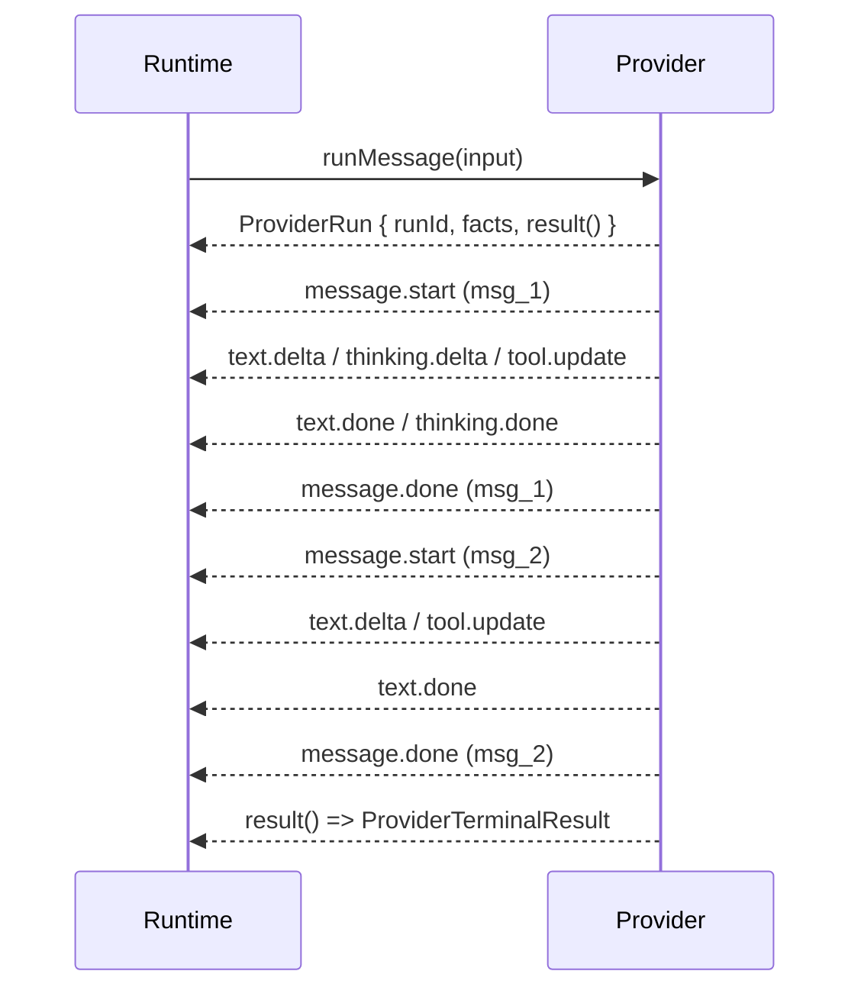
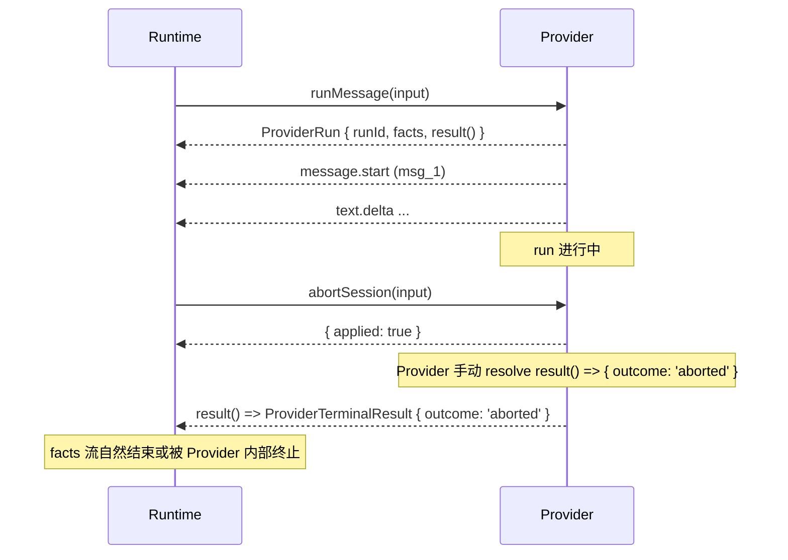
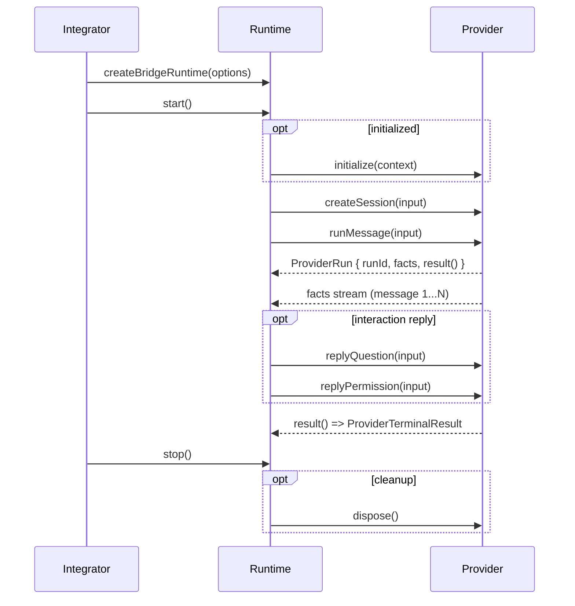

# bridge-runtime-sdk 对外集成文档

**Version:** 1.2
**Date:** 2026-06-15
**Status:** Active  
**Owner:** agent-plugin maintainers  
**Related:** `@wecode/bridge-runtime-sdk` stable public contract

## 1. 安装

### 1.1 配置 npm 二方仓

```bash
npm config set @wecode:registry https://cmc.centralrepo.rnd.huawei.com/artifactory/api/npm/product_npm/
```

### 1.2 安装 SDK

```bash
npm install @wecode/bridge-runtime-sdk
```

## 2. 文档定位

本文面向三方 agent 开发者，说明如何通过 `@wecode/bridge-runtime-sdk` 实现 `ThirdPartyAgentProvider`，将三方 agent 接入 welink 助理。

本文只描述以下稳定契约：

- 根入口导出能力
- Runtime 与 Provider 的接口调用方式
- 主要入参、出参和字段语义
- 文本流、事实流、错误语义
- 最小合法接入方式

本文不覆盖以下内容：

- SDK 内部实现、内部组件或内部状态流转
- 消费侧展示逻辑或事件映射逻辑
- 仓库内部代码组织、测试缝或源码定位方式

## 2.1 Changelog

### 2026-06-16

- 所有 Provider fact 类型移除 `toolSessionId` 字段；该字段由 runtime 从 run 上下文注入，不属于 Provider 构造 fact 时的输入。
- 所有 Provider fact 类型新增 `subagentSessionId?` 和 `subagentName?` 可选字段（继承自 `ProviderFactBase`）。
- `BridgeRuntimeStatusSnapshot` 新增 `error?: BridgeRuntimeError` 字段。
- 新增 `BridgeRuntimeError` 和 `BridgeRuntimeErrorCode` 类型说明。
- `ProviderRunMessageInput.context` 移除 `imGroupId` 字段；SDK 不向 Provider 透传该字段。
- 修正所有 `toolSessionId` 字段说明：明确其代表 welink 会话标识，不代表宿主 agent session ID。
- 新增 8.10 小节：`toolSessionId` 与 agent session 映射约束说明。
- 8.5 标识符约束：补充 `toolSessionId`、`messageId`、`partId` 格式建议（`ses_`、`msg_`、`prt_` 前缀 + UUID）。
- 5.4 和第 7 节时序图：体现一轮 run 可返回多个 message，每个 message 拥有独立 `messageId`。
- 修正 8.4、9.1、9.2、9.3 示例代码：移除 fact 中多余的 `toolSessionId` 字段，示例 ID 改用前缀 + UUID 格式。
- 5.4 时序图补充契约约束：`result()` 必须在 facts 流结束后 resolve。
- 5.8 新增中断时序图：体现 `abortSession` 后 Provider 必须手动 resolve `result()` 为 `aborted`。
- 重写 9.1 最小 Provider 示例：使用 deferred Promise 模式，体现 `result()` 收口和中止时手动 resolve。
- 9.4 常见错误用法：补充 `result()` 提前 resolve 和中断后未 resolve 两条。
- 8.5 标识符语义：补充 `messageId` 与 `partId` 的层级关系和区别说明。
- 5.3 `createSession`：补充触发时机和映射说明。

### 2026-06-15

- `RuntimeOutboundEmitter` 新增方法 `emitOutboundRun(input)`，用于发送带 run 标识的主动 facts 流。
- 新增 `EmitOutboundRunInput` 入参类型，字段包含 `toolSessionId`、`runId`、`trigger`、`facts`。
- `RuntimeOutboundEmitter.emitOutboundMessage(input)` 标记为废弃；新接入应使用 `emitOutboundRun(input)`。
- Breaking change: `ToolUpdateFact.input` 从 `string` 改为 `Record<string, unknown>`；集成方必须传入 JSON 对象，不能传字符串、数组、`null`、数字或布尔值。

### 2026-06-02

- Breaking change: `BridgeGatewayHostConfig.register.toolType` 改为 `BridgeGatewayHostConfig.register.channel`，表示接入方声明的业务渠道标识。
- 不保留 `register.toolType` 兼容入口；集成方必须改用 `register.channel`。

### 2026-06-01

- `PermissionAskFact`: `permissionType?: string` -> `permType: string`
- `PermissionReplyFact`: `permissionType?: string` -> `permType?: string`
- `PermissionReplyFact`: `messageId, partId` 移除

## 3. 稳定导出概览

`@wecode/bridge-runtime-sdk` 根入口稳定导出 3 类能力：

- Runtime API：`createBridgeRuntime`、`BridgeRuntime`
- Provider 集成契约：`ThirdPartyAgentProvider` 及相关类型
- 二维码授权能力：`qrcodeAuth`

接入方统一从 `@wecode/bridge-runtime-sdk` 导入运行时 API、Provider 契约和二维码授权能力即可。

## 4. Runtime API

### 4.1 `createBridgeRuntime(options)`

用于创建 Runtime 实例。

| 项目 | 说明 |
|---|---|
| 接口名 | `createBridgeRuntime` |
| 入参 | `BridgeRuntimeOptions` |
| 出参 | `Promise<BridgeRuntime>` |
| 说明 | 创建 Runtime facade。 |

#### 入参类型：`BridgeRuntimeOptions`

| 字段 | 类型 | 是否必填 | 说明 |
|---|---|---|---|
| `provider` | `ThirdPartyAgentProvider` | 是 | 集成方实现的 Provider SPI。 |
| `gatewayHost` | `BridgeGatewayHostConfig` | 是 | Gateway 连接与注册配置。 |
| `logger` | `BridgeGatewayLogger` | 否 | 可选日志接口。 |
| `debug` | `boolean` | 否 | 是否打开调试日志。 |
| `traceIdFactory` | `() => string` | 否 | 自定义 traceId 生成器。未提供时由 SDK 生成。 |
| `onTelemetryUpdated` | `() => void` | 否 | 运行时观测信息变更时触发。 |

#### 嵌套类型：`BridgeGatewayHostConfig`

| 字段 | 类型 | 是否必填 | 说明 |
|---|---|---|---|
| `url` | `string` | 否 | Gateway 地址。未提供时使用 SDK 默认连接配置。 |
| `auth.ak` | `string` | 是 | Gateway 鉴权 AK。 |
| `auth.sk` | `string` | 是 | Gateway 鉴权 SK。 |
| `register.channel` | `BridgeGatewayChannel` | 是 | 业务渠道标识名称。 |
| `register.toolVersion` | `string` | 是 | 当前宿主 agent 版本。 |
| `register.pluginVersion` | `string` | 否 | 上层插件版本。宿主无插件封装层时可省略。 |

#### 嵌套类型：`BridgeGatewayLogger`

| 字段 | 类型 | 是否必填 | 说明 |
|---|---|---|---|
| `debug` | `(message: string, meta?: Record<string, unknown>) => void` | 否 | 调试日志输出。 |
| `info` | `(message: string, meta?: Record<string, unknown>) => void` | 否 | 信息日志输出。 |
| `warn` | `(message: string, meta?: Record<string, unknown>) => void` | 否 | 警告日志输出。 |
| `error` | `(message: string, meta?: Record<string, unknown>) => void` | 否 | 错误日志输出。 |
| `child` | `(meta: Record<string, unknown>) => BridgeGatewayLogger` | 否 | 基于上下文派生子 logger。 |
| `getTraceId` | `() => string` | 否 | 为日志补充 traceId。 |

- 该调用只创建实例，不表示已建立可用连接。
- 集成方应在 `await runtime.start()` 成功后，再将 Runtime 视为可处理请求。

```ts
import { createBridgeRuntime } from '@wecode/bridge-runtime-sdk';

const runtime = await createBridgeRuntime({
  provider,
  gatewayHost,
});
```

### 4.2 `runtime.start()`

用于启动 Runtime。

| 项目 | 说明 |
|---|---|
| 接口名 | `BridgeRuntime.start` |
| 入参 | 无 |
| 出参 | `Promise<void>` |
| 说明 | 启动 Runtime 并进入可处理请求状态。 |

- `start()` 成功前，集成方不应将 Runtime 视为已就绪。
- `start()` resolve 表示 Runtime 已完成启动并进入可处理请求状态，而不是仅完成底层建链。
- 并发 `start()` 调用会得到同一轮启动结果；若调用时存在进行中的 `stop()`，会等停止完成后再进入启动流程。
- 启动阶段如发生异常，`start()` 会 reject；调用方应按启动失败处理。

```ts
await runtime.start();
```

### 4.3 `runtime.stop()`

用于停止 Runtime。

| 项目 | 说明 |
|---|---|
| 接口名 | `BridgeRuntime.stop` |
| 入参 | 无 |
| 出参 | `Promise<void>` |
| 说明 | 停止 Runtime。 |

- `stop()` 之后，集成方不得继续使用旧的 `ProviderRuntimeContext`、旧的 `ProviderRun` 或旧的 outbound 发送器。
- `stop()` resolve 表示 Runtime 已完成停止；若停止过程中发生异常，`stop()` 会 reject，调用方应按停止失败处理。
- 并发 `stop()` 调用会得到同一轮停止结果；若停止发生在启动过程中，最终状态以停止结果为准。

```ts
await runtime.stop();
```

### 4.4 `runtime.probe(input)`

用于主动探测当前配置。

| 项目 | 说明 |
|---|---|
| 接口名 | `BridgeRuntime.probe` |
| 入参 | `{ timeoutMs: number }` |
| 出参 | `Promise<BridgeGatewayProbeResult>` |
| 说明 | 返回当前网关探测结果。 |

#### 出参类型：`BridgeGatewayProbeResult`

| 字段 | 类型 | 是否必填 | 说明 |
|---|---|---|---|
| `state` | `'ready' \| 'rejected' \| 'connect_error' \| 'timeout' \| 'connecting' \| 'cancelled'` | 是 | 探测结果状态。 |
| `latencyMs` | `number` | 是 | 本次探测耗时，单位毫秒。 |
| `reason` | `string` | 否 | 探测失败或未完成时的附加说明。 |

```ts
const probe = await runtime.probe({ timeoutMs: 3000 });
```

### 4.5 `runtime.getStatus()`

用于读取当前生命周期状态。

| 项目 | 说明 |
|---|---|
| 接口名 | `BridgeRuntime.getStatus` |
| 入参 | 无 |
| 出参 | `BridgeRuntimeStatusSnapshot` |
| 说明 | 返回当前 Runtime 状态快照。 |

#### 出参类型：`BridgeRuntimeStatusSnapshot`

| 字段 | 类型 | 是否必填 | 说明 |
|---|---|---|---|
| `state` | `'idle' \| 'starting' \| 'ready' \| 'reconnecting' \| 'stopping' \| 'failed'` | 是 | Runtime 当前状态。 |
| `failureReason` | `string \| null` | 是 | 当前失败摘要文本；无失败时为 `null`。该字段来自触发 failed 的错误 `message`，不是稳定错误码。 |
| `error` | `BridgeRuntimeError` | 否 | 触发 failed 状态时的原始错误对象；非 failed 状态时为 `undefined`。 |

```ts
const status = runtime.getStatus();
```

#### `BridgeRuntimeStatus` 语义

| 状态 | 说明 |
|---|---|
| `idle` | Runtime 未启动或已停止。 |
| `starting` | Runtime 正在启动。 |
| `ready` | Runtime 已启动且 gateway 可用，可以处理下行请求和上行发送。 |
| `reconnecting` | Runtime 已启动，但当前连接正在恢复中。 |
| `stopping` | Runtime 正在停止。 |
| `failed` | Runtime 生命周期失败，需要调用方按失败状态处理。 |

`failureReason` 只用于展示和快速排障。例如底层连接失败的错误消息为 `gateway transport closed`，则 `runtime.getStatus()` 返回的失败摘要是：

```ts
{
  state: 'failed',
  failureReason: 'gateway transport closed',
}
```

若调用方需要稳定分类、错误码或失败阶段，应读取 `runtime.getDiagnostics().failures.at(-1)`，不要基于 `failureReason` 做业务分支。

### 4.6 `runtime.getDiagnostics()`

用于读取当前诊断快照。

| 项目 | 说明 |
|---|---|
| 接口名 | `BridgeRuntime.getDiagnostics` |
| 入参 | 无 |
| 出参 | `RuntimeDiagnostics` |
| 说明 | 返回运行时诊断信息。 |

#### 出参类型：`RuntimeDiagnostics`

| 字段 | 类型 | 是否必填 | 说明 |
|---|---|---|---|
| `gatewayState` | `string` | 否 | 当前网关诊断状态标识；当前由 SDK 记录为 `ready`、`reconnecting`、`connecting`、`closed`。 |
| `lastReadyAt` | `number \| null` | 是 | 最近一次进入可用状态的时间戳。 |
| `lastInboundAt` | `number \| null` | 是 | 最近一次接收入站事件的时间戳。 |
| `lastOutboundAt` | `number \| null` | 是 | 最近一次发送出站事件的时间戳。 |
| `lastHeartbeatAt` | `number \| null` | 是 | 最近一次心跳时间戳。 |
| `providerCalls` | `RuntimeTraceProviderCall[]` | 是 | 已记录的 Provider 调用轨迹。 |
| `facts` | `RuntimeTraceFact[]` | 是 | 已记录的 fact 轨迹。 |
| `uplinks` | `Array<{ type: string; toolSessionId?: string }>` | 是 | 已记录的上行事件轨迹。 |
| `terminals` | `RuntimeTraceTerminal[]` | 是 | 已记录的 run 终态轨迹。 |
| `interactions` | `RuntimeTraceInteraction[]` | 是 | 已记录的交互轨迹。 |
| `derivedEvents` | `Array<{ type: string; toolSessionId: string }>` | 是 | 已记录的派生事件轨迹。 |
| `failures` | `RuntimeTraceFailure[]` | 是 | 已记录的失败轨迹。 |

```ts
const diagnostics = runtime.getDiagnostics();
```

#### `RuntimeTraceFailure`

| 字段 | 类型 | 是否必填 | 说明 |
|---|---|---|---|
| `kind` | `string` | 是 | 失败归类，例如 startup、gateway runtime、command execution 等。 |
| `phase` | `string` | 是 | 失败发生阶段，例如 `start`、`runtime`、`stop`。 |
| `message` | `string` | 是 | 原始错误消息摘要。 |
| `code` | `string` | 否 | 可用时保留原始稳定错误码，例如连接错误码或 BridgeRuntimeError code。 |

## 5. Provider API

### 5.1 `initialize(context)`

用于接收 Runtime 注入的运行时上下文。

| 项目 | 说明 |
|---|---|
| 接口名 | `ThirdPartyAgentProvider.initialize` |
| 入参 | `ProviderRuntimeContext` |
| 出参 | `Promise<void>` |
| 说明 | Runtime 启动时注入上下文。 |

#### 入参类型：`ProviderRuntimeContext`

| 字段 | 类型 | 是否必填 | 说明 |
|---|---|---|---|
| `outbound` | `RuntimeOutboundEmitter` | 是 | request run 之外主动发送消息的统一出口。 |

- 该接口为可选实现。
- 若实现，应保证调用安全。

### 5.2 `health(input)`

用于查询 Provider 当前是否在线可用。

| 项目 | 说明 |
|---|---|
| 接口名 | `ThirdPartyAgentProvider.health` |
| 入参 | `ProviderHealthInput` |
| 出参 | `Promise<ProviderHealthResult>` |
| 说明 | 返回当前 Provider 可用性。 |

#### 入参类型：`ProviderHealthInput`

| 字段 | 类型 | 是否必填 | 说明 |
|---|---|---|---|
| `traceId` | `string` | 是 | 本次调用 traceId。 |

#### 出参类型：`ProviderHealthResult`

| 字段 | 类型 | 是否必填 | 说明 |
|---|---|---|---|
| `online` | `boolean` | 是 | 当前 Provider 是否在线可用。 |

```ts
async health() {
  return { online: true };
}
```

### 5.3 `createSession(input)`

仅在创建 welink session 时触发，用于建立 `toolSessionId` 与 `welinkSessionId` 的一一映射。

| 项目 | 说明 |
|---|---|
| 接口名 | `ThirdPartyAgentProvider.createSession` |
| 入参 | `ProviderCreateSessionInput` |
| 出参 | `Promise<ProviderCreateSessionResult>` |
| 说明 | 返回会话标识。 |

#### 入参类型：`ProviderCreateSessionInput`

| 字段 | 类型 | 是否必填 | 说明 |
|---|---|---|---|
| `traceId` | `string` | 是 | 本次调用 traceId。 |
| `title` | `string` | 否 | 可选会话标题。 |
| `assistantId` | `string` | 否 | 可选 assistant 标识。 |
| `extParameters` | `ExtParameters` | 否 | 扩展参数；与 `runMessage` 复用同一扩展参数契约。SDK 仅透传，不解释业务语义。 |

#### 出参类型：`ProviderCreateSessionResult`

| 字段 | 类型 | 是否必填 | 说明 |
|---|---|---|---|
| `toolSessionId` | `string` | 是 | welink 会话标识；不代表宿主 agent session ID，集成方需自行维护与 agent session 的映射。 |
| `title` | `string` | 否 | 宿主确认后的会话标题。 |

```ts
async createSession() {
  return { toolSessionId: 'ses_550e8400-e29b-41d4-a716-446655440000' };
}
```

- `toolSessionId` 不等同于 agent session ID，Provider 需自行维护映射（见 8.10）。

### 5.4 `runMessage(input)`

用于启动一次 request run。

| 项目 | 说明 |
|---|---|
| 接口名 | `ThirdPartyAgentProvider.runMessage` |
| 入参 | `ProviderRunMessageInput` |
| 出参 | `Promise<ProviderRun>` |
| 说明 | 返回本次运行句柄。 |

#### 入参类型：`ProviderRunMessageInput`

| 字段 | 类型 | 是否必填 | 说明 |
|---|---|---|---|
| `traceId` | `string` | 是 | 本次调用 traceId。 |
| `runId` | `string` | 是 | 当前 request run 标识。 |
| `toolSessionId` | `string` | 是 | 目标 welink 会话标识；不代表宿主 agent session ID。 |
| `text` | `string` | 是 | 本次用户输入文本。 |
| `assistantId` | `string` | 否 | 可选 assistant 标识。 |
| `extParameters` | `ExtParameters` | 否 | 平台/业务扩展参数；当前正式协议字段见下表。SDK 仅透传，不解释业务语义。 |
| `context.assistantAccount` | `string` | 否 | 可选 assistant 账号信息。 |
| `context.sendUserAccount` | `string` | 否 | 可选发送用户账号信息。 |
| `context.suppressReply` | `boolean` | 否 | 可选回复抑制标记。 |

#### 扩展类型：`ExtParameters`

| 字段 | 类型 | 是否必填 | 说明 |
|---|---|---|---|
| `businessExtParam` | `JsonValue` | 否 | 业务扩展参数透传字段。 |
| `platformExtParam` | `PlatformExtParam` | 否 | 平台扩展参数透传字段。 |

#### 扩展类型：`PlatformExtParam`

| 字段 | 类型 | 是否必填 | 说明 |
|---|---|---|---|
| `businessSessionDomain` | `string` | 否 | 业务入口所属域。 |
| `businessSessionType` | `string` | 否 | 业务入口类型。 |
| `businessSessionId` | `string` | 否 | 业务入口唯一标识。 |
| `allowedSlashCommands` | `string[]` | 否 | 请求级平台扩展命令集合。 |

#### 业务入口字段当前正式支持值

| `businessSessionDomain` | `businessSessionType` | `businessSessionId` | 说明 |
|---|---|---|---|
| `im` | `direct` | 例如：`user-a#bot-a` | IM 单聊业务入口。 |
| `im` | `group` | 例如：`group-a` | IM 群会话业务入口。 |
| `miniapp` | `direct` | 例如：`miniapp-user-1` | MiniApp direct 业务入口。 |

- 业务入口字段由 `businessSessionDomain`、`businessSessionType`、`businessSessionId` 三者共同组成。
- `businessSessionId` 示例仅用于说明当前协议形态，不展开生成、补全或推导规则。
- `bridge-runtime-sdk` 对 `extParameters` 仅做透传，不在 SDK 内解释业务路由语义。
- `allowedSlashCommands` 仅作为当前已定义扩展字段说明，不在本节展开链路差异。

#### 出参类型：`ProviderRun`

| 字段 | 类型 | 是否必填 | 说明 |
|---|---|---|---|
| `runId` | `string` | 是 | 当前 run 的唯一标识，必须与 `ProviderRunMessageInput.runId` 一致。 |
| `facts` | `AsyncIterable<ProviderFact>` | 是 | 当前 run 产生的事实流。 |
| `result` | `() => Promise<ProviderTerminalResult>` | 是 | 返回当前 run 的最终结果。 |

#### 紧邻出参类型：`ProviderTerminalResult`

| 字段 | 类型 | 是否必填 | 说明 |
|---|---|---|---|
| `outcome` | `'completed' \| 'failed' \| 'aborted'` | 是 | 当前 run 的最终结局。 |
| `usage` | `unknown` | 否 | 可选用量信息。 |
| `error` | `ProviderError` | 否 | 失败或中止时的补充错误信息。 |

#### 关键时序图



- 返回的 `ProviderRun.runId` 必须与输入 `input.runId` 一致。
- `facts` 按产生顺序消费，不是无序事件集合。
- `message.start` 必须先于所属消息的内容事件，`message.done` 用于消息流收口。
- `message.done` 不等于 run 终态；run 最终结局以 `ProviderRun.result()` 为准。
- `ProviderRun.result()` 是该次 run 的终态真源。
- `completed` 表示正常完成，`failed` 表示执行失败，`aborted` 表示中止。
- 一轮 run 可以产出多个 message，每个 message 拥有独立的 `messageId`，必须分别通过 `message.start` 打开和 `message.done` 关闭。
- Provider 必须确保 `result()` 在 facts 流结束后才 resolve，不得提前 resolve。

```ts
async runMessage(input: ProviderRunMessageInput) {
  return {
    runId: input.runId,
    facts: (async function* () {})(),
    async result() {
      return { outcome: 'completed' } as const;
    },
  };
}
```

### 5.5 `replyQuestion(input)`

用于应用一次问题回复。

| 项目 | 说明 |
|---|---|
| 接口名 | `ThirdPartyAgentProvider.replyQuestion` |
| 入参 | `ProviderQuestionReplyInput` |
| 出参 | `Promise<{ applied: true }>` |
| 说明 | 应用待回复问题的答案。 |

#### 入参类型：`ProviderQuestionReplyInput`

| 字段 | 类型 | 是否必填 | 说明 |
|---|---|---|---|
| `traceId` | `string` | 是 | 本次调用 traceId。 |
| `questionId` | `string` | 是 | 目标问题标识。 |
| `answers` | `QuestionAnswer[]` | 是 | 问题答案集合。每一项是一个字符串数组。 |

- 返回 `{ applied: true }` 时，表示回复已真实应用到底层宿主。

### 5.6 `replyPermission(input)`

用于应用一次权限回复。

| 项目 | 说明 |
|---|---|
| 接口名 | `ThirdPartyAgentProvider.replyPermission` |
| 入参 | `ProviderPermissionReplyInput` |
| 出参 | `Promise<{ applied: true }>` |
| 说明 | 应用待确认权限的回复。 |

#### 入参类型：`ProviderPermissionReplyInput`

| 字段 | 类型 | 是否必填 | 说明 |
|---|---|---|---|
| `traceId` | `string` | 是 | 本次调用 traceId。 |
| `permissionId` | `string` | 是 | 目标权限标识。 |
| `reply` | `'once' \| 'always' \| 'reject'` | 是 | 权限回复结果。 |

- 返回 `{ applied: true }` 时，表示回复已真实应用到底层宿主。

### 5.7 `closeSession(input)`

用于关闭指定会话。

| 项目 | 说明 |
|---|---|
| 接口名 | `ThirdPartyAgentProvider.closeSession` |
| 入参 | `ProviderCloseSessionInput` |
| 出参 | `Promise<{ applied: true }>` |
| 说明 | 关闭目标会话。 |

#### 入参类型：`ProviderCloseSessionInput`

| 字段 | 类型 | 是否必填 | 说明 |
|---|---|---|---|
| `traceId` | `string` | 是 | 本次调用 traceId。 |
| `toolSessionId` | `string` | 是 | 目标 welink 会话标识；不代表宿主 agent session ID。 |

- 返回 `{ applied: true }` 时，表示关闭操作已真实应用到底层宿主。

### 5.8 `abortSession(input)`

用于中止指定执行或会话。

| 项目 | 说明 |
|---|---|
| 接口名 | `ThirdPartyAgentProvider.abortSession` |
| 入参 | `ProviderAbortSessionInput` |
| 出参 | `Promise<{ applied: true }>` |
| 说明 | 中止目标执行或会话。 |

#### 入参类型：`ProviderAbortSessionInput`

| 字段 | 类型 | 是否必填 | 说明 |
|---|---|---|---|
| `traceId` | `string` | 是 | 本次调用 traceId。 |
| `toolSessionId` | `string` | 是 | 目标 welink 会话标识；不代表宿主 agent session ID。 |
| `runId` | `string` | 否 | 需要中止的具体 run 标识；未提供时由宿主自行决定中止范围。 |

- 返回 `{ applied: true }` 时，表示中止操作已真实应用到底层宿主。

#### 中断时序图



- 中断时 SDK 不会自动取消 facts 流或强制 resolve `result()`。
- Provider 收到 `abortSession()` 后，必须手动 resolve 活跃 run 的 `result()` 为 `{ outcome: 'aborted' }`。
- `abortSession()` 返回 `{ applied: true }` 只表示中断请求已接收，不代表 `result()` 已 resolve；终态仍以 `result()` 为准。

### 5.9 `dispose()`

用于在 Runtime 停止时执行清理。

| 项目 | 说明 |
|---|---|
| 接口名 | `ThirdPartyAgentProvider.dispose` |
| 入参 | 无 |
| 出参 | `Promise<void>` |
| 说明 | 执行 Provider 清理逻辑。 |

- 该接口为可选实现。

### 5.10 `RuntimeOutboundEmitter`

Runtime 注入到 Provider 的主动发送出口。

```ts
export interface RuntimeOutboundEmitter {
  /**
   * @deprecated 请改用 emitOutboundRun(input)。
   */
  emitOutboundMessage(input: EmitOutboundMessageInput): Promise<{ applied: true }>;
  emitOutboundRun(input: EmitOutboundRunInput): Promise<{ applied: true }>;
}
```

| 方法 | 是否必填 | 说明 |
|---|---|---|
| `emitOutboundMessage(input)` | 是 | 已废弃。发送一批 outbound facts。 |
| `emitOutboundRun(input)` | 是 | 发送一轮带 run 标识的主动 facts 流。 |

- `RuntimeOutboundEmitter` 通过 `ProviderRuntimeContext.outbound` 注入。
- outbound 只用于 request run 之外的主动消息。
- 集成方不得用 outbound 代替 `runMessage()` 的正常回复路径。

### 5.11 `emitOutboundMessage(input)`

用于发送 outbound 事实流。

> Deprecated: 新接入应使用 `emitOutboundRun(input)`，用 `runId` 表达主动发送的执行边界。

| 项目 | 说明 |
|---|---|
| 接口名 | `RuntimeOutboundEmitter.emitOutboundMessage` |
| 入参 | `EmitOutboundMessageInput` |
| 出参 | `Promise<{ applied: true }>` |
| 说明 | 发送一批 outbound facts。 |

#### 入参类型：`EmitOutboundMessageInput`

| 字段 | 类型 | 是否必填 | 说明 |
|---|---|---|---|
| `toolSessionId` | `string` | 是 | 目标 welink 会话标识；不代表宿主 agent session ID。 |
| `messageId` | `string` | 是 | 本批 outbound 所属消息 ID。 |
| `trigger` | `'scheduled' \| 'webhook' \| 'system' \| string` | 是 | 主动消息触发来源。 |
| `facts` | `AsyncIterable<OutboundFact>` | 是 | 本批 outbound 事实流。 |
| `assistantId` | `string` | 否 | 可选 assistant 标识。 |

- outbound 只用于 request run 之外的主动消息。
- 集成方不得用 outbound 代替 `runMessage()` 的正常回复路径。
- 同一批 outbound facts 的 `messageId` 必须与 `EmitOutboundMessageInput.messageId` 一致。

```ts
await context.outbound.emitOutboundMessage({
  toolSessionId: 'ses_550e8400-e29b-41d4-a716-446655440000',
  messageId: 'msg_6ba7b810-9dad-11d1-80b4-00c04fd430c8',
  trigger: 'webhook',
  facts,
});
```

### 5.12 `emitOutboundRun(input)`

用于发送一轮带 run 标识的主动 facts 流。

| 项目 | 说明 |
|---|---|
| 接口名 | `RuntimeOutboundEmitter.emitOutboundRun` |
| 入参 | `EmitOutboundRunInput` |
| 出参 | `Promise<{ applied: true }>` |
| 说明 | 发送一轮 outbound run facts。 |

#### 入参类型：`EmitOutboundRunInput`

| 字段 | 类型 | 是否必填 | 说明 |
|---|---|---|---|
| `toolSessionId` | `string` | 是 | 目标 welink 会话标识；不代表宿主 agent session ID。 |
| `runId` | `string` | 是 | 本轮 outbound run 标识。 |
| `trigger` | `'scheduled' \| 'webhook' \| 'system' \| string` | 是 | 主动消息触发来源。 |
| `facts` | `AsyncIterable<OutboundFact>` | 是 | 本轮 outbound run 事实流。 |

- `emitOutboundRun` 与 `emitOutboundMessage` 表达不同主动发送模型：前者带 `runId`，后者按单批消息发送。
- Provider 可直接调用该方法：

```ts
await context.outbound.emitOutboundRun({
  toolSessionId: 'ses_550e8400-e29b-41d4-a716-446655440000',
  runId: 'run_7c9e6b3a-2f4d-4e8a-b615-3d2a1c0f8e7b',
  trigger: 'scheduled',
  facts,
});
```

## 6. 二维码授权 API

### 6.1 `qrcodeAuth.run(input)`

用于启动二维码授权流程。

| 项目 | 说明 |
|---|---|
| 接口名 | `qrcodeAuth.run` |
| 入参 | `QrCodeAuthRunInput` |
| 出参 | `Promise<void>` |
| 说明 | 启动二维码授权并通过快照回调返回进度。 |

#### 入参类型：`QrCodeAuthRunInput`

| 字段 | 类型 | 是否必填 | 说明 |
|---|---|---|---|
| `environment` | `'uat' \| 'prod'` | 否 | 授权环境。未提供时默认 `prod`。 |
| `channel` | `string` | 是 | 授权业务渠道标识。|
| `mac` | `string` | 是 | 设备标识。 |
| `policy.refreshOnExpired` | `boolean` | 否 | 二维码过期后是否自动刷新。 |
| `policy.maxRefreshCount` | `number` | 否 | 最大自动刷新次数。 |
| `policy.pollIntervalMs` | `number` | 否 | 轮询间隔，单位毫秒。 |
| `onSnapshot` | `(snapshot: QrCodeAuthSnapshot) => void` | 是 | 快照回调。 |

#### 关联类型：`QrCodeAuthSnapshot`

| 字段 | 类型 | 是否必填 | 说明 |
|---|---|---|---|
| `type` | `'qrcode_generated' \| 'scanned' \| 'expired' \| 'cancelled' \| 'confirmed' \| 'failed'` | 是 | 当前授权事件类型。 |
| `qrcode` | `string` | 否 | 当前二维码内容。不同事件是否携带取决于具体快照。 |
| `display` | `{ qrcode: string; weUrl: string; pcUrl: string }` | 否 | 仅二维码生成事件携带的展示数据。 |
| `expiresAt` | `string` | 否 | 仅二维码生成事件携带的过期时间。 |
| `credentials.ak` | `string` | 否 | 仅确认成功事件携带的 AK。 |
| `credentials.sk` | `string` | 否 | 仅确认成功事件携带的 SK。 |
| `reasonCode` | `'timeout' \| 'network_error' \| 'auth_service_error'` | 否 | 仅失败事件携带的失败原因。 |
| `serviceError` | `QrCodeAuthServiceError` | 否 | 仅失败事件携带的服务错误信息。 |

#### `QrCodeAuthSnapshot.type` 语义

| `type` | 语义 |
|---|---|
| `qrcode_generated` | 已成功创建新的二维码授权会话；携带 `qrcode`、`display`、`expiresAt`，调用方应展示二维码。 |
| `scanned` | 当前二维码已被扫码，但用户尚未确认授权；流程继续轮询，不是终态。 |
| `expired` | 当前二维码已过期；如果 `policy.refreshOnExpired` 允许且未超过 `policy.maxRefreshCount`，SDK 会创建新二维码并再次发出 `qrcode_generated`。 |
| `cancelled` | 用户取消授权；这是终态，`qrcodeAuth.run()` 会在该快照发出后结束。 |
| `confirmed` | 用户确认授权成功；携带 `credentials.ak`、`credentials.sk`，这是成功终态，`qrcodeAuth.run()` 会在该快照发出后结束。 |
| `failed` | 授权流程失败；携带 `reasonCode`，可能携带 `serviceError`，这是失败终态。 |

- 内部等待轮询态不会作为 `QrCodeAuthSnapshot` 暴露给调用方。
- `qrcodeAuth.run()` 会先发出终态快照，再 resolve。
- 同一个二维码、同一种状态的重复轮询结果会去重；不同二维码的同类事件仍会继续发出。
- `expired` 本身不是最终失败；只有刷新关闭或刷新次数耗尽时，才会再发出 `failed`，且 `reasonCode` 为 `timeout`。
- `failed.reasonCode` 取值含义：
  - `timeout`：二维码过期且无法继续刷新。
  - `network_error`：请求授权服务失败。
  - `auth_service_error`：授权服务返回异常、缺字段或不可识别状态。

- `qrcodeAuth.run()` 由调用方直接调用，不通过 `createBridgeRuntime()` 获取。
- 调用方必须自行提供 `channel`、`mac` 和 `onSnapshot`。
- 调用方应按 `snapshot.type` 分支处理快照，而不是假设所有字段始终存在。

```ts
import { qrcodeAuth } from '@wecode/bridge-runtime-sdk';

await qrcodeAuth.run({
  channel: 'openx',
  mac: 'device-mac',
  onSnapshot(snapshot) {
    console.log(snapshot.type);
  },
});
```

## 7. 整体主流程时序图



- `createBridgeRuntime()` 只创建实例，`start()` 成功后 Runtime 才进入可处理请求状态。
- `createSession()`、`runMessage()`、`replyQuestion()`、`replyPermission()` 都属于 Runtime 对 Provider 的调用路径。
- `runMessage()` 返回的是 `ProviderRun` 句柄，不是最终结果；run 的终态以 `result()` 为准。
- 一轮 `runMessage()` 可产出多个 message，每个 message 拥有独立的 `messageId`。
- `stop()` 后 Runtime 不再继续使用旧上下文；若实现了 `dispose()`，会进入清理阶段。

## 8. 公共类型与通用约束

### 8.1 `ProviderFact` 与 `OutboundFact`

`ProviderFact` 是 request run 使用的事实集合，`OutboundFact` 与其共用同一套事实类型。两者差别只在生命周期来源：

- request run 通过 `ProviderRun.facts` 产出，并由 `result()` 收口
- outbound 通过 `emitOutboundMessage()` 或 `emitOutboundRun()` 主动发送；`emitOutboundRun()` 带 `runId`，`emitOutboundMessage()` 按单批消息发送

### 8.2 事实类型分组

- 消息生命周期：`message.start`、`message.done`
- 文本输出：`text.delta`、`text.done`
- 思考输出：`thinking.delta`、`thinking.done`
- 工具状态：`tool.update`
- 交互请求与回复：`question.ask`、`permission.ask`、`permission.reply`
- 会话信息：`session.title`
- 会话错误：`session.error`

### 8.3 主要 fact 字段

`type` 是 `ProviderFact` 的语义标签，用于声明当前事实在运行时中的生命周期含义，而不是仅表示“事实类型”。Runtime 会按该字段判断消息作用域、内容流收口、交互回复目标和会话级事件边界。

所有 Provider fact 类型共享 `ProviderFactBase` 基类字段，`toolSessionId` 由 runtime 从 run 上下文注入，不属于 Provider 构造 fact 时的输入。

#### `ProviderFactBase`

所有 Provider fact 类型共享以下可选基类字段：

| 字段 | 类型 | 是否必填 | 说明 |
|---|---|---|---|
| `subagentSessionId` | `string` | 否 | 子代理 envelope 提示，不参与 runtime session ownership、校验或回复路由。 |
| `subagentName` | `string` | 否 | 子代理名称提示，不参与 runtime session ownership、校验或回复路由。 |

#### `MessageStartFact`

| 字段 | 类型 | 是否必填 | 说明 |
|---|---|---|---|
| `type` | `'message.start'` | 是 | 打开一条 provider message；后续消息内容事实必须归属到这个 `messageId`，同一 `messageId` 不可重复打开或关闭后重开。 |
| `messageId` | `string` | 是 | 所属消息标识。 |
| `raw` | `unknown` | 否 | 宿主原始上下文。 |

#### `TextDeltaFact`

| 字段 | 类型 | 是否必填 | 说明 |
|---|---|---|---|
| `type` | `'text.delta'` | 是 | 发送文本片段的流式增量；必须归属到已打开的 message，`content` 是本次新增文本，不代表最终全文。 |
| `messageId` | `string` | 是 | 所属消息标识。 |
| `partId` | `string` | 是 | 文本片段标识。 |
| `content` | `string` | 是 | 当前文本增量。 |
| `raw` | `unknown` | 否 | 宿主原始上下文。 |

#### `TextDoneFact`

| 字段 | 类型 | 是否必填 | 说明 |
|---|---|---|---|
| `type` | `'text.done'` | 是 | 收口文本片段；必须归属到已打开的 message，`content` 是该 `partId` 的最终文本内容。 |
| `messageId` | `string` | 是 | 所属消息标识。 |
| `partId` | `string` | 是 | 文本片段标识。 |
| `content` | `string` | 是 | 当前片段最终内容。 |
| `raw` | `unknown` | 否 | 宿主原始上下文。 |

#### `ThinkingDeltaFact`

| 字段 | 类型 | 是否必填 | 说明 |
|---|---|---|---|
| `type` | `'thinking.delta'` | 是 | 发送思考或 reasoning 片段的流式增量；必须归属到已打开的 message，`content` 是本次新增思考内容。 |
| `messageId` | `string` | 是 | 所属消息标识。 |
| `partId` | `string` | 是 | 思考片段标识。 |
| `content` | `string` | 是 | 当前思考增量。 |
| `raw` | `unknown` | 否 | 宿主原始上下文。 |

#### `ThinkingDoneFact`

| 字段 | 类型 | 是否必填 | 说明 |
|---|---|---|---|
| `type` | `'thinking.done'` | 是 | 收口思考或 reasoning 片段；必须归属到已打开的 message，`content` 是该 `partId` 的最终思考内容。 |
| `messageId` | `string` | 是 | 所属消息标识。 |
| `partId` | `string` | 是 | 思考片段标识。 |
| `content` | `string` | 是 | 当前片段最终内容。 |
| `raw` | `unknown` | 否 | 宿主原始上下文。 |

#### `ToolUpdateFact`

| 字段 | 类型 | 是否必填 | 说明 |
|---|---|---|---|
| `type` | `'tool.update'` | 是 | 更新一次工具调用的展示状态；必须归属到已打开的 message，同一 `toolCallId` 可通过多次更新表达 pending、running、completed 或 error。 |
| `messageId` | `string` | 是 | 所属消息标识。 |
| `partId` | `string` | 是 | 工具片段标识。 |
| `toolCallId` | `string` | 是 | 工具调用标识。 |
| `toolName` | `string` | 是 | 工具名称。 |
| `status` | `'pending' \| 'running' \| 'completed' \| 'error'` | 是 | 当前工具状态。 |
| `title` | `string` | 否 | 可选标题。 |
| `input` | `Record<string, unknown>` | 否 | 可选工具输入参数，必须是 JSON 对象；SDK 会拒绝字符串、数组、`null`、数字和布尔值。 |
| `output` | `string` | 否 | 可选输出内容。 |
| `error` | `string` | 否 | 工具错误说明。 |
| `raw` | `unknown` | 否 | 宿主原始上下文。 |

#### `QuestionAskFact`

| 字段 | 类型 | 是否必填 | 说明 |
|---|---|---|---|
| `type` | `'question.ask'` | 是 | 发起需要外部回复的问题交互；必须归属到已打开的 message，并通过全局唯一的 `questionId` 等待后续 `question_reply`。 |
| `messageId` | `string` | 是 | 所属消息标识。 |
| `partId` | `string` | 是 | 问题所在消息片段标识。 |
| `questionId` | `string` | 是 | 直接回复目标，必须唯一。 |
| `questions` | `QuestionItem[]` | 是 | 问题定义集合。 |
| `toolCallId` | `string` | 否 | 可选工具调用关联标识。 |
| `status` | `string` | 否 | 可选状态说明。 |
| `extParam` | `unknown` | 否 | 可选扩展信息。 |
| `context` | `Record<string, unknown>` | 否 | 可选上下文。 |
| `raw` | `unknown` | 否 | 宿主原始上下文。 |

#### `QuestionItem`

| 字段 | 类型 | 是否必填 | 说明 |
|---|---|---|---|
| `question` | `string` | 是 | 问题正文。 |
| `header` | `string` | 否 | 可选问题标题。 |
| `options` | `QuestionOption[]` | 否 | 可选答案选项。 |
| `multiSelect` | `boolean` | 否 | 是否允许多选。 |

#### `QuestionOption`

| 字段 | 类型 | 是否必填 | 说明 |
|---|---|---|---|
| `label` | `string` | 是 | 选项显示文本，也是 `question_reply.answers` 回传的答案值。 |
| `description` | `string` | 否 | 选项展示说明，仅用于上行展示；缺失时省略，不参与回复目标、路由或答案结构。 |

#### `PermissionAskFact`

| 字段 | 类型 | 是否必填 | 说明 |
|---|---|---|---|
| `type` | `'permission.ask'` | 是 | 发起需要外部确认的权限交互；不强制要求 message 作用域，`permissionId` 是全局唯一的权限回复目标。 |
| `messageId` | `string` | 否 | 可选消息归属上下文。 |
| `partId` | `string` | 是 | 权限所在消息片段标识。 |
| `permissionId` | `string` | 是 | 直接回复目标，必须唯一。 |
| `permType` | `string` | 是 | 权限类型|
| `title` | `string` | 否 | 可选权限标题。 |
| `metadata` | `Record<string, unknown>` | 否 | 可选权限上下文。 |
| `raw` | `unknown` | 否 | 宿主原始上下文。 |

#### `PermissionReplyFact`

| 字段 | 类型 | 是否必填 | 说明 |
|---|---|---|---|
| `type` | `'permission.reply'` | 是 | 记录某个权限请求已经得到回复；通过 `permissionId` 关联此前的 `permission.ask`。 |
| `permissionId` | `string` | 是 | 已回复的权限标识。 |
| `response` | `'once' \| 'always' \| 'reject'` | 是 | 权限回复结果。 |
| `permType` | `string` | 否 | 权限类型|
| `raw` | `unknown` | 否 | 宿主原始上下文。 |

#### `MessageDoneFact`

| 字段 | 类型 | 是否必填 | 说明 |
|---|---|---|---|
| `type` | `'message.done'` | 是 | 关闭一条 provider message；表示该 `messageId` 的消息事实流结束，但不代表整个 request run 终态。 |
| `messageId` | `string` | 是 | 所属消息标识。 |
| `reason` | `string` | 否 | 可选结束原因。 |
| `tokens` | `unknown` | 否 | 可选令牌统计。 |
| `cost` | `number` | 否 | 可选成本信息。 |
| `raw` | `unknown` | 否 | 宿主原始上下文。 |

#### `SessionTitleFact`

| 字段 | 类型 | 是否必填 | 说明 |
|---|---|---|---|
| `type` | `'session.title'` | 是 | 更新会话标题；不要求归属到某条已打开的 message。 |
| `title` | `string` | 是 | 新的会话标题。 |
| `raw` | `unknown` | 否 | 宿主原始上下文。 |

#### `SessionErrorFact`

| 字段 | 类型 | 是否必填 | 说明 |
|---|---|---|---|
| `type` | `'session.error'` | 是 | 发送会话级或 provider 级错误事件；不要求归属到某条已打开的 message，也不等同于 request run 终态。 |
| `error` | `ProviderError` | 是 | 会话级错误信息。 |
| `raw` | `unknown` | 否 | 宿主原始上下文。 |

### 8.4 文本流规则

- `message.start` 表示一条消息开始。
- `text.delta` 用于发送尚未收口的文本增量。
- `text.done` 表示对应 `partId` 的文本片段已经收口。
- `message.done` 表示该消息的 fact 流结束，但不代表 request run 终态。
- 若某个片段一开始就是完整内容，可以只发送 `text.done`，不发送 `text.delta`。

最小合法文本序列如下：

```ts
yield { type: 'message.start', messageId: 'msg_6ba7b810-9dad-11d1-80b4-00c04fd430c8' };
yield { type: 'text.done', messageId: 'msg_6ba7b810-9dad-11d1-80b4-00c04fd430c8', partId: 'prt_f47ac10b-58cc-4372-a567-0e02b2c3d479', content: 'hello' };
yield { type: 'message.done', messageId: 'msg_6ba7b810-9dad-11d1-80b4-00c04fd430c8' };
```

### 8.5 标识符约束

#### 标识符语义

- `toolSessionId` 标识 welink 会话作用域；不代表宿主 agent session ID，映射由集成方处理（见 8.10）。
- `messageId` 标识一条 provider message，由 `message.start` 打开、`message.done` 关闭；必须在所属 `toolSessionId` 内唯一。一轮 run 可产出多个 message，每个 message 拥有独立的 `messageId`。
- `partId` 标识 message 内的一个内容片段（文本、思考或工具），必须稳定标识同一片段。`partId` 隶属于 `messageId`，同一 `messageId` 下不同片段必须使用不同 `partId`；同一 `partId` 不可同时用于文本片段和思考片段。
- `messageId` 与 `partId` 是父子层级关系：`messageId` 定义消息边界，`partId` 定义消息内的内容片段边界。内容事实（`text.delta`、`text.done`、`thinking.delta`、`thinking.done`、`tool.update`、`question.ask`）必须同时携带 `messageId` 和 `partId`，且 `messageId` 必须已通过 `message.start` 打开。
- `runId` 绑定一次 request run，不得由 Provider 改写。
- `questionId` 与 `permissionId` 是直接回复目标，必须可唯一定位到底层宿主对象。

#### 标识符格式约束

- `toolSessionId`、`messageId`、`partId` 必须为非空字符串，前后不得包含空白字符；SDK 会对上述标识符执行 trim 校验。
- 标识符不强制要求特定编码格式，但建议使用前缀 + UUID 以提高可读性和排障效率：
  - `toolSessionId` 建议以 `ses_` 开头，例如 `ses_550e8400-e29b-41d4-a716-446655440000`
  - `messageId` 建议以 `msg_` 开头，例如 `msg_6ba7b810-9dad-11d1-80b4-00c04fd430c8`
  - `partId` 建议以 `prt_` 开头，例如 `prt_f47ac10b-58cc-4372-a567-0e02b2c3d479`
- `messageId` 在同一 `toolSessionId` 内跨多轮 run 不可重复打开或关闭后重开。
- `partId` 在同一 `messageId` 内标识唯一片段；同一 `partId` 不可同时用于文本片段和思考片段。

### 8.6 `ProviderError`

用于表达执行期错误或 run 失败原因。

| 字段 | 类型 | 是否必填 | 说明 |
|---|---|---|---|
| `code` | `'not_found' \| 'session_not_found' \| 'invalid_input' \| 'not_supported' \| 'timeout' \| 'rate_limited' \| 'provider_unavailable' \| 'internal_error'` | 是 | 错误码。 |
| `message` | `string` | 是 | 错误说明。 |
| `retryable` | `boolean` | 否 | 是否建议重试。 |
| `details` | `Record<string, unknown>` | 否 | 可选补充上下文。 |

### 8.7 `ProviderCommandError`

用于表达命令应用阶段失败。

| 字段 | 类型 | 是否必填 | 说明 |
|---|---|---|---|
| `code` | `'invalid_input' \| 'not_found' \| 'not_supported' \| 'provider_unavailable' \| 'internal_error'` | 是 | 错误码。 |
| `message` | `string` | 是 | 错误说明。 |
| `retryable` | `boolean` | 否 | 是否建议重试。 |
| `details` | `Record<string, unknown>` | 否 | 可选补充上下文。 |

### 8.8 失败表达边界

- Provider 方法在命令应用阶段失败时，应抛出 `ProviderCommandError`。
- 宿主需要在事实流中表达会话级错误时，应发送 `SessionErrorFact`。
- request run 的最终结局必须通过 `ProviderRun.result()` 返回。
- 集成方不得把命令应用失败伪装成 `ProviderTerminalResult.error`。
- 集成方不得用 `SessionErrorFact` 代替 `ProviderRun.result()` 收口。

### 8.9 `BridgeRuntimeError`

SDK 在生命周期和连接阶段抛出的稳定错误类型。

| 字段 | 类型 | 说明 |
|---|---|---|
| `name` | `'BridgeRuntimeError'` | 错误类名。 |
| `code` | `BridgeRuntimeErrorCode` | 稳定错误码。 |
| `message` | `string` | 错误说明。 |

#### `BridgeRuntimeErrorCode`

| 错误码 | 说明 |
|---|---|
| `gateway_connect_parameter_invalid` | 连接参数不合法。 |
| `gateway_auth_rejected` | 鉴权被拒绝。 |
| `gateway_handshake_timeout` | 握手超时。 |
| `gateway_handshake_rejected` | 握手被拒绝。 |
| `gateway_handshake_invalid` | 握手返回不合法。 |
| `gateway_transport_error` | 传输层错误。 |
| `gateway_reconnect_exhausted` | 重连次数耗尽。 |
| `gateway_unknown_error` | 网关未知错误。 |
| `provider_unavailable` | Provider 不可用。 |
| `runtime_internal_error` | Runtime 内部错误。 |
| `runtime_unknown_error` | Runtime 未知错误。 |
| `probe_unknown_error` | 探测未知错误。 |

- `BridgeRuntimeStatusSnapshot.error` 仅在 `state` 为 `failed` 时可能携带 `BridgeRuntimeError`。
- 集成方可基于 `error.code` 做稳定分类，不应基于 `message` 做业务分支。

### 8.10 `toolSessionId` 与 agent session 映射

`toolSessionId` 是 bridge runtime 协议层的 welink 会话标识，由网关下行请求带入，不代表宿主 agent 自身的 session ID。

- `toolSessionId` 由 runtime 从下行请求中获取并透传给 Provider，Provider 不生成该值。
- `toolSessionId` 与 agent session ID 是两个独立概念，映射关系由集成方在 Provider 实现中自行维护。
- Provider 在 `createSession()`、`runMessage()`、`closeSession()`、`abortSession()` 等方法中收到 `toolSessionId` 时，需自行映射到底层 agent session。
- SDK 不感知、不缓存、不代理 agent session ID；映射失败或找不到对应 session 时，Provider 应抛出 `ProviderError`（`code: 'session_not_found'`）。

## 9. 最小接入示例

### 9.1 最小 Provider 示例

```ts
import type {
  ProviderAbortSessionInput,
  ProviderFact,
  ProviderRun,
  ProviderRunMessageInput,
  ProviderRuntimeContext,
  ProviderTerminalResult,
  ThirdPartyAgentProvider,
} from '@wecode/bridge-runtime-sdk';

export class DemoProvider implements ThirdPartyAgentProvider {
  private outbound = null as ProviderRuntimeContext['outbound'] | null;
  private activeRuns = new Map<string, (result: ProviderTerminalResult) => void>();

  async initialize(context: ProviderRuntimeContext): Promise<void> {
    this.outbound = context.outbound;
  }

  async health() {
    return { online: true };
  }

  async createSession() {
    return { toolSessionId: 'ses_550e8400-e29b-41d4-a716-446655440000' };
  }

  async runMessage(input: ProviderRunMessageInput): Promise<ProviderRun> {
    const messageId = 'msg_6ba7b810-9dad-11d1-80b4-00c04fd430c8';
    const partId = 'prt_f47ac10b-58cc-4372-a567-0e02b2c3d479';

    let resolveTerminal!: (result: ProviderTerminalResult) => void;
    const terminalPromise = new Promise<ProviderTerminalResult>((resolve) => {
      resolveTerminal = resolve;
    });
    this.activeRuns.set(input.runId, resolveTerminal);
    const self = this;

    const facts: AsyncIterable<ProviderFact> = (async function* () {
      try {
        yield { type: 'message.start', messageId };
        yield { type: 'text.done', messageId, partId, content: `echo: ${input.text}` };
        yield { type: 'message.done', messageId };
        // facts 流正常结束后，resolve 终态
        resolveTerminal({ outcome: 'completed' });
      } catch (error) {
        // facts 流异常时，resolve failed
        resolveTerminal({
          outcome: 'failed',
          error: {
            code: 'internal_error',
            message: error instanceof Error ? error.message : String(error),
          },
        });
      } finally {
        self.activeRuns.delete(input.runId);
      }
    })();

    return {
      runId: input.runId,
      facts,
      result: () => terminalPromise,
    };
  }

  async replyQuestion() {
    return { applied: true };
  }

  async replyPermission() {
    return { applied: true };
  }

  async closeSession() {
    return { applied: true };
  }

  async abortSession(input: ProviderAbortSessionInput) {
    const resolve = input.runId ? this.activeRuns.get(input.runId) : undefined;
    if (resolve) {
      // 中断时手动 resolve result() 为 aborted
      resolve({ outcome: 'aborted' });
      this.activeRuns.delete(input.runId!);
    }
    return { applied: true };
  }
}
```

- `result()` 必须在 facts 流结束后才 resolve，不得提前 resolve。
- facts 流异常时，Provider 必须手动 resolve `result()` 为 `{ outcome: 'failed', error: ... }`。
- 中断时（`abortSession` 被调用），Provider 必须手动 resolve 活跃 run 的 `result()` 为 `{ outcome: 'aborted' }`。
- SDK 不会自动取消 facts 流或强制 resolve `result()`；终态收口是 Provider 的职责。

### 9.2 最小文本输出示例

> 以下示例聚焦文本流展示，省略 `result()` 收口逻辑；实际实现应参考 9.1 的 deferred Promise 模式。

```ts
async runMessage(input: ProviderRunMessageInput): Promise<ProviderRun> {
  const messageId = `msg_${input.runId}`;

  return {
    runId: input.runId,
    facts: (async function* () {
      yield { type: 'message.start', messageId };
      yield {
        type: 'text.delta',
        messageId,
        partId: 'prt_f47ac10b-58cc-4372-a567-0e02b2c3d479',
        content: 'hel',
      };
      yield {
        type: 'text.done',
        messageId,
        partId: 'prt_f47ac10b-58cc-4372-a567-0e02b2c3d479',
        content: 'hello',
      };
      yield { type: 'message.done', messageId };
    })(),
    async result() {
      return { outcome: 'completed' };
    },
  };
}
```

### 9.3 挂起交互与回复示例

> 以下示例聚焦交互流展示，省略 `result()` 收口逻辑；实际实现应参考 9.1 的 deferred Promise 模式。

```ts
async runMessage(input: ProviderRunMessageInput): Promise<ProviderRun> {
  return {
    runId: input.runId,
    facts: (async function* () {
      yield { type: 'message.start', messageId: 'msg_a1b2c3d4-e5f6-7890-abcd-ef1234567890' };
      yield {
        type: 'question.ask',
        messageId: 'msg_a1b2c3d4-e5f6-7890-abcd-ef1234567890',
        partId: 'prt_b2c3d4e5-f6a7-8901-bcde-f12345678901',
        questionId: 'q_550e8400-e29b-41d4-a716-446655440000',
        questions: [
          {
            question: '请选择部署环境',
            options: [
              { label: 'staging', description: '部署到预发环境' },
              { label: 'production', description: '部署到生产环境' },
            ],
          },
        ],
      };
    })(),
    async result() {
      return { outcome: 'aborted' };
    },
  };
}

async replyQuestion(input: ProviderQuestionReplyInput) {
  console.log(input.questionId, input.answers);
  return { applied: true };
}
```

### 9.4 常见错误用法

- 用 `message.done` 代替 `result()` 收口。
- 返回的 `ProviderRun.runId` 与输入 `runId` 不一致。
- 在 Runtime 已停止后继续使用旧的 outbound 发送器。
- 在同一消息中复用同一个 `partId` 表示不同文本片段。
- `result()` 在 facts 流结束前提前 resolve。
- 中断后未手动 resolve `result()`，导致 run 永久挂起。
