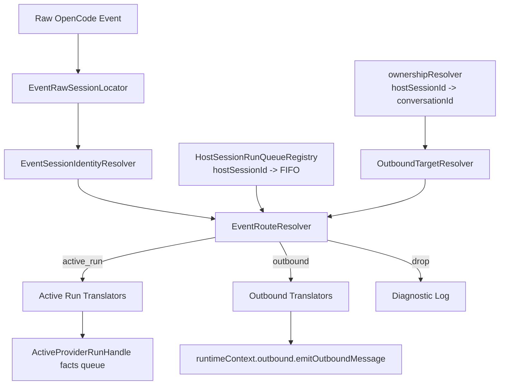
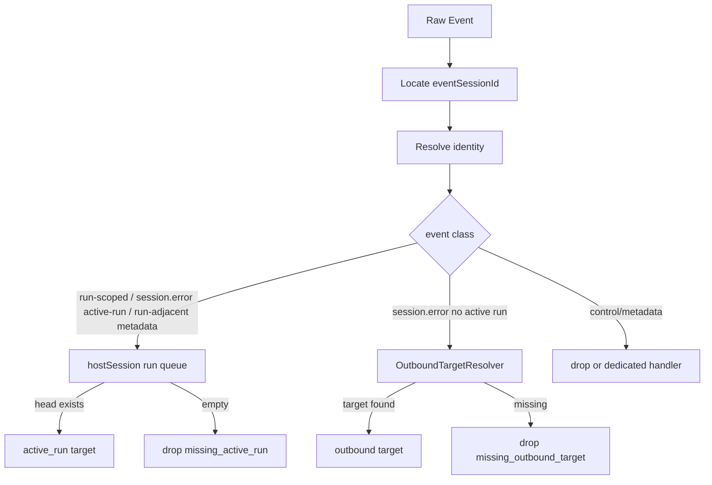
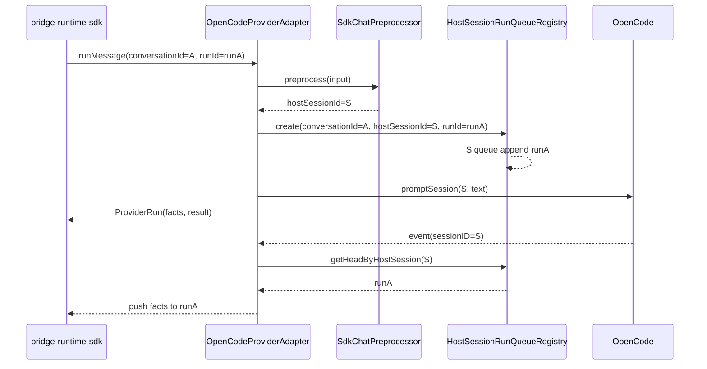
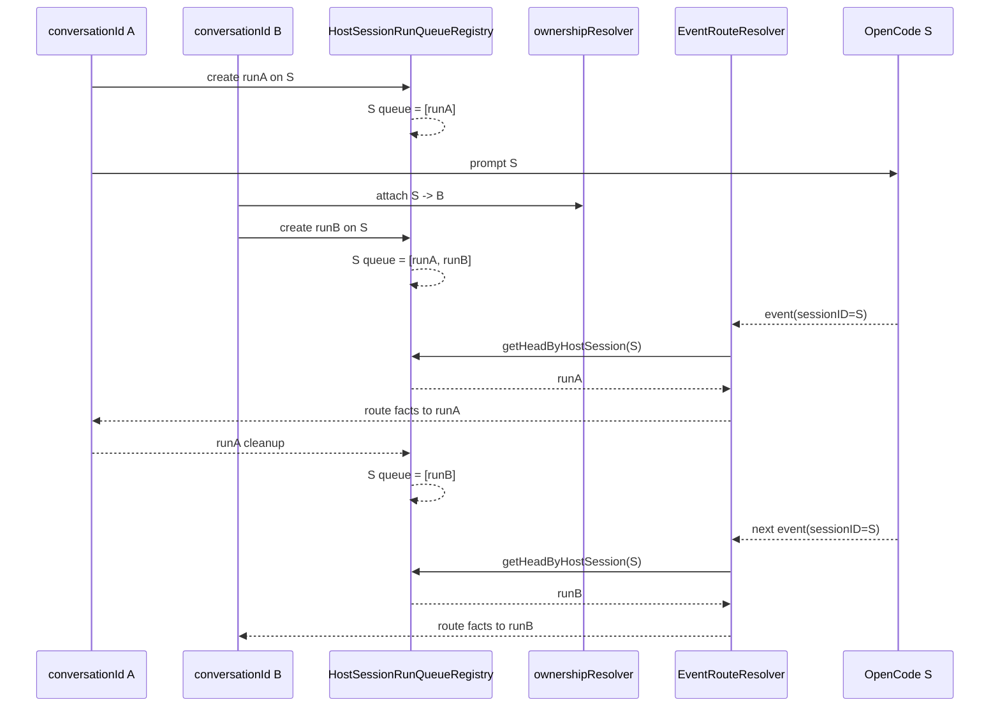
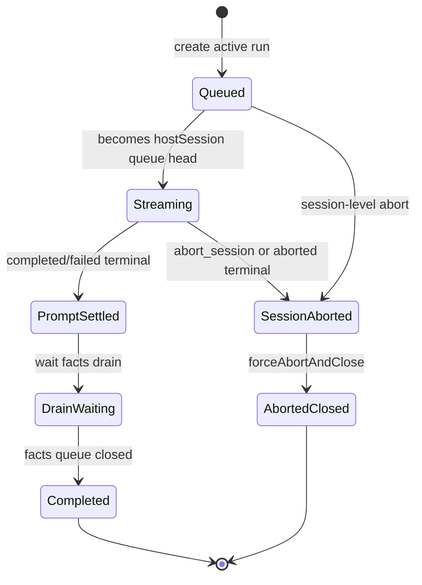
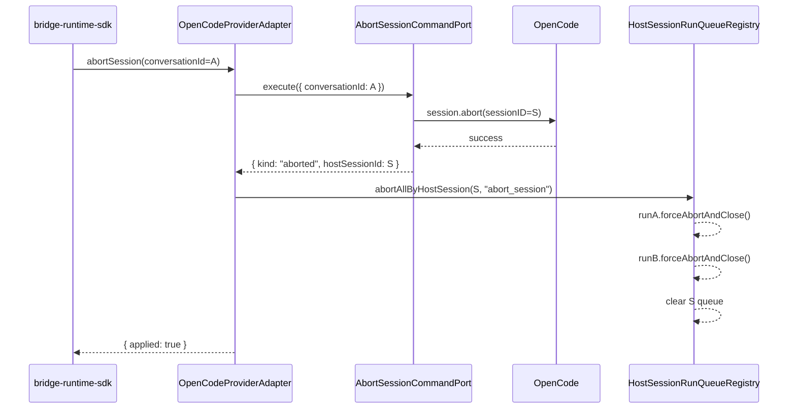
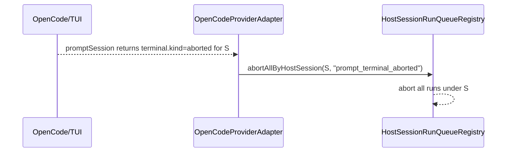

# OpenCode 事件路由分层、Run FIFO 与 Session 级 Abort 收口设计

## 背景与目标

当前 `message-bridge` 的上行事件路由先通过 `hostSessionId -> ownershipResolver -> conversationId` 找到当前 attached 对话，再把事件推给该对话的 active run。

当同一个 OpenCode session 被多个 `toolSessionId` 复用时，最后一次 attach 会覆盖归属，导致旧 run 的回复事件串到新对话。

本方案将运行中回复流的归属改为：

```text
hostSessionId -> active run FIFO 队首
```

同时保留 `ownershipResolver` 的当前绑定语义，用于控制面和无 active run 的 system/outbound 事件。

## 设计结论

v1 的确定结论如下：

- 运行中事件按 `hostSessionId` 查 active run FIFO 队首，不再依赖当前 attached owner。
- `ownershipResolver` 继续服务控制面和无 active run 的 outbound fallback。
- `session.error` active run 优先；没有 active run 时才走 outbound fallback。
- `permission.replied`、`session.updated` 属于 run-adjacent metadata，有 active run 时继续进入 active run。
- `abort_session` 成功后使用实际被 abort 的 `hostSessionId` 收口同 host queue 下所有 run。
- stale invalidation 必须携带本次 prompt 的 `hostSessionId`，避免旧 run 失败误删新绑定。
- v1 暂不实现同 `hostSessionId` 的 prompt 调度互斥，暂时依赖 OpenCode 保证同 session prompt 与事件按 run 顺序产出。

## 术语

| 概念 | 含义 |
| --- | --- |
| `conversationId` | 网关侧对话 ID，回复要发回哪里；兼容字段为 `toolSessionId` / `anchorSessionId` |
| `hostSessionId` | OpenCode 宿主 session，prompt 实际跑在哪里；兼容字段为 `opencodeSessionId` / OpenCode `sessionID` |
| `eventSessionId` | raw event 里直接抽取的 session id，仅在事件解析阶段使用 |
| `trackingSessionId` | 本地 message/part 状态隔离 key；普通事件等于 `hostSessionId`，subagent 事件等于 child session |
| `subagent` | subagent 元信息；不是独立路由维度 |
| `ownershipResolver` | 当前 `hostSessionId -> conversationId` 归属 |
| `HostSessionRunQueueRegistry` | 当前 `hostSessionId -> active run FIFO` |
| `EventSessionIdentityResolver` | 只解析 raw event 的 host/tracking identity |
| `EventRouteResolver` | 根据 identity 和 event type 决定 `active_run` / `outbound` / `drop` |
| `OutboundTargetResolver` | 为 out-of-run/system event 解析 `conversationId` 目标 |

设计文档使用 `conversationId` 和 `hostSessionId` 表达领域概念。实现中可以继续保留 `toolSessionId`、`anchorSessionId`、`opencodeSessionId` 等兼容字段，但不应把它们作为新的设计概念继续扩散。

## V1 前提与边界

v1 暂时依赖 OpenCode 保证：

```text
同一 hostSessionId 下，prompt 与事件按 run 顺序产出。
后一个 run 的事件不会早于前一个 run 的收口事件对外可见。
```

本轮 `HostSessionRunQueueRegistry` 只负责事件归属 FIFO，不负责启动 `promptSession()` 的互斥调度。

插件侧 host prompt scheduler 是后续增强，不纳入 v1。

## 组件职责



职责边界：

```text
EventSessionIdentityResolver:
  raw event -> eventSessionId / hostSessionId / trackingSessionId / subagent metadata

EventRouteResolver:
  identity + event type -> active_run | outbound | drop

HostSessionRunQueueRegistry:
  维护 host session 下 run FIFO
  保证 host session 队首唯一
  维护 conversation index 和 host queue 一致性
  提供 session 级 abort 收口

OutboundTargetResolver:
  hostSessionId -> conversationId
  只服务 out-of-run/system event

Translators:
  event + route context -> facts
  不负责目标选择
```

## 事件身份解析

`EventSessionIdentityResolver` 不决定 `conversationId`。它只输出事件身份。

```ts
type EventSessionIdentity =
  | {
      kind: 'resolved';
      eventSessionId: string;
      hostSessionId: string;
      trackingSessionId: string;
      subagent?: {
        sessionId: string;
        name?: string;
      };
    }
  | {
      kind: 'resolved_fail_open';
      eventSessionId: string;
      hostSessionId: string;
      trackingSessionId: string;
      lookupFailedCause: unknown;
    }
  | {
      kind: 'missing_session';
      eventSessionId?: string;
      reason: 'missing_event_session' | 'missing_parent_session';
    };
```

active run 保存运行归属：

```ts
type ActiveRunIdentity = {
  conversationId: string;
  hostSessionId: string;
  runId: string;
};
```

facts 翻译上下文不需要知道 `eventSessionId`：

```ts
type FactSessionContext = {
  conversationId: string;
  trackingSessionId: string;
  subagent?: {
    sessionId: string;
    name?: string;
  };
};
```

解析规则：

```text
普通事件:
  eventSessionId = raw event 中的 sessionID
  hostSessionId = eventSessionId
  trackingSessionId = eventSessionId

subagent mapped:
  eventSessionId = childSessionId
  hostSessionId = parentSessionId
  trackingSessionId = childSessionId
  subagent.sessionId = childSessionId

subagent lookup failed:
  可 fail-open 到 eventSessionId
  后续必须由 EventRouteResolver 判断是否存在 active run 或 outbound owner
  如果没有目标，drop
```

## 事件分类与路由

事件分四类：

```text
Run-scoped streaming:
  message.updated
  message.part.delta
  message.part.updated
  question.asked
  permission.asked

Run-scoped with outbound fallback:
  session.error

Run-adjacent metadata:
  session.updated
  permission.replied

Control/session metadata:
  session.created
  session.deleted
```

分类规则：

- run-scoped event 必须进入 active run facts queue。
- 没有 active run 的 run-scoped event 默认 drop。
- `session.error` 在存在 active run 时进入 host session 队首 run；没有 active run 时再走 `OutboundTargetResolver`。
- run-adjacent metadata 在存在 active run 时继续按现有 translator 进入 active run；没有 active run 时 v1 不新增 outbound 能力，除非已有 dedicated handler。
- `session.created` 继续用于 subagent mapping record。
- `session.deleted` 继续走 session isolation reconcile。

路由目标模型：

```ts
type EventRouteTarget =
  | {
      kind: 'active_run';
      run: ActiveProviderRunHandle;
      identity: EventSessionIdentity;
      conversationId: string;
    }
  | {
      kind: 'outbound';
      identity: EventSessionIdentity;
      conversationId: string;
      reason: 'attached_owner';
    }
  | {
      kind: 'drop';
      reason:
        | 'missing_active_run'
        | 'missing_outbound_target'
        | 'unsupported_event'
        | 'missing_session_identity';
    };
```

路由规则：



## Run FIFO 与收口

正常 run 时序：



多 `conversationId` 复用同一 `hostSessionId` 时，后 attach 的 owner 不影响运行中事件归属：



run 状态转移：



普通 terminal 规则：

```text
completed:
  settle 当前 run
  等 facts drain
  cleanup 当前 run

failed:
  settle 当前 run
  等 facts drain
  cleanup 当前 run

aborted:
  不只 settle 当前 run
  触发 HostSessionRunQueueRegistry.abortAllByHostSession(hostSessionId)
```

`ActiveProviderRunHandle.forceAbortAndClose(reason)` 必须满足：

```text
幂等
result resolve 为 { outcome: 'aborted' }
facts queue 立即关闭，不等待 quiet period / drain timeout
已 buffered facts 保留
后续 pushFacts 必须 no-op 或被忽略
触发 cleanup，且 cleanup 只执行一次
```

## Session 级 Abort

为了避免把外部调用和本地收口耦合，设计上拆成两个用例语义：

```text
AbortHostSessionUseCase:
  解析 binding
  调 OpenCode abortSession(sessionId)
  返回 aborted(hostSessionId) / not_active

HostSessionRunsAbortUseCase:
  对本地 HostSessionRunQueueRegistry 执行 abortAllByHostSession(hostSessionId, reason)
```

当前实现可以仍放在 `OpenCodeProviderAdapter` 内编排，但测试和日志应按这两个边界组织。

abort 时序：



`AbortAnchoredRunResult` 必须返回实际被 abort 的 `hostSessionId`：

```ts
type AbortAnchoredRunResult =
  | { kind: 'aborted'; toolSessionId: string; hostSessionId: string }
  | { kind: 'not_active'; toolSessionId: string };
```

`OpenCodeProviderAdapter` 只使用该返回值调用 `abortAllByHostSession(hostSessionId, "abort_session")`。provider 不应在调用 abort 前自行解析 `hostSessionId` 作为等价替代，避免 binding 切换竞态导致外部 abort 和本地收口使用不同 session。

TUI 中断走同一收口路径：



`abort_session` 成功条件保持历史兼容：

```text
conversationId 有 attached binding
并且 OpenCode session.abort(sessionId) 调用成功
```

成功后的新增本地副作用：

```text
activeRunQueue[hostSessionId] 内所有 run 都以 { outcome: 'aborted' } 闭环
facts queue 全部关闭
host session queue 清空
```

不变行为：

```text
不 detach ownership
不 invalidate binding
不切换 session
not_active 或 host abort 失败时不清 active run 队列
```

abort 后残余 run-scoped events：

```text
因为 host session queue 已清空
后续 message.updated / message.part.* drop + diagnostic
不进入后续 run
```

## Stale Invalidation 规则

`invalidateAfterFailure()` 改为带本次 prompt 的 `hostSessionId`：

```ts
// 当前代码兼容字段仍可能叫 toolSessionId / opencodeSessionId；
// 设计语义统一映射为 conversationId / hostSessionId。
invalidateAfterFailure({
  conversationId: input.toolSessionId,
  hostSessionId: context.opencodeSessionId,
  error,
});
```

只有当前 binding 仍指向该 session 才失效：

```text
bindingStore.get(conversationId)?.activeOpencodeSessionId === hostSessionId
```

如果当前 binding 已切换到其他 `hostSessionId`，说明这是旧 run 的晚到失败，只记录 diagnostic，不 invalidate binding，也不 detach ownership。

这样旧 run 的 `session_not_found` 不会误删新绑定。

aborted terminal 不触发 stale invalidation。

## Outbound 扩展点

未来“无 active run 时 assistant message outbound”不能放进 translator 决策。

扩展路径应是：

```text
OutboundTargetResolver:
  根据 hostSessionId / business entry / explicit target 解析 conversationId

Outbound translator:
  只负责 event -> facts
```

v1 不新增该能力，只保留接口边界。当前无 active run 时，assistant streaming event 仍 drop。

## 测试重点

- 同一 `hostSessionId` 下 run FIFO 路由。
- 最后 attached owner 不影响运行中 `message.*`、`question.asked`、`permission.asked`、`session.error` 归属。
- subagent 事件按 parent host session 查队首 run，按 child session 做 tracking。
- 无 active run 的 `session.error` 保持 outbound fallback。
- `permission.replied`、`session.updated` 在 active run 存在时仍能产出既有 facts。
- `abort_session` 成功后同 host session 所有 run aborted。
- TUI/外部 aborted terminal 后同 host session 所有 run aborted。
- `completed` / `failed` terminal 只影响当前 run。
- `forceAbortAndClose()` 幂等，关闭 queue，忽略后续 facts。
- 无 active run 的 assistant event drop。
- stale invalidation 不误删新 binding。
