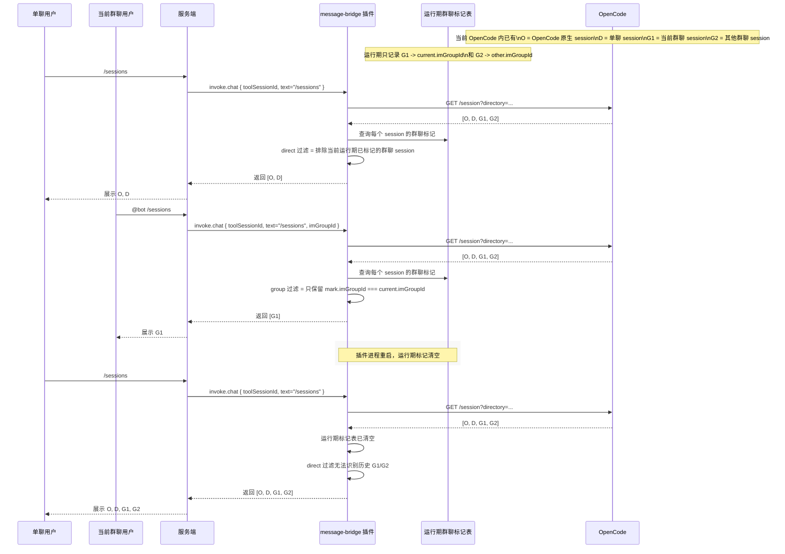
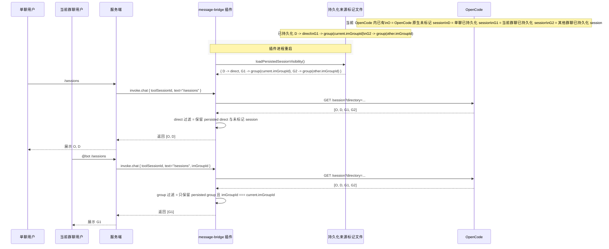
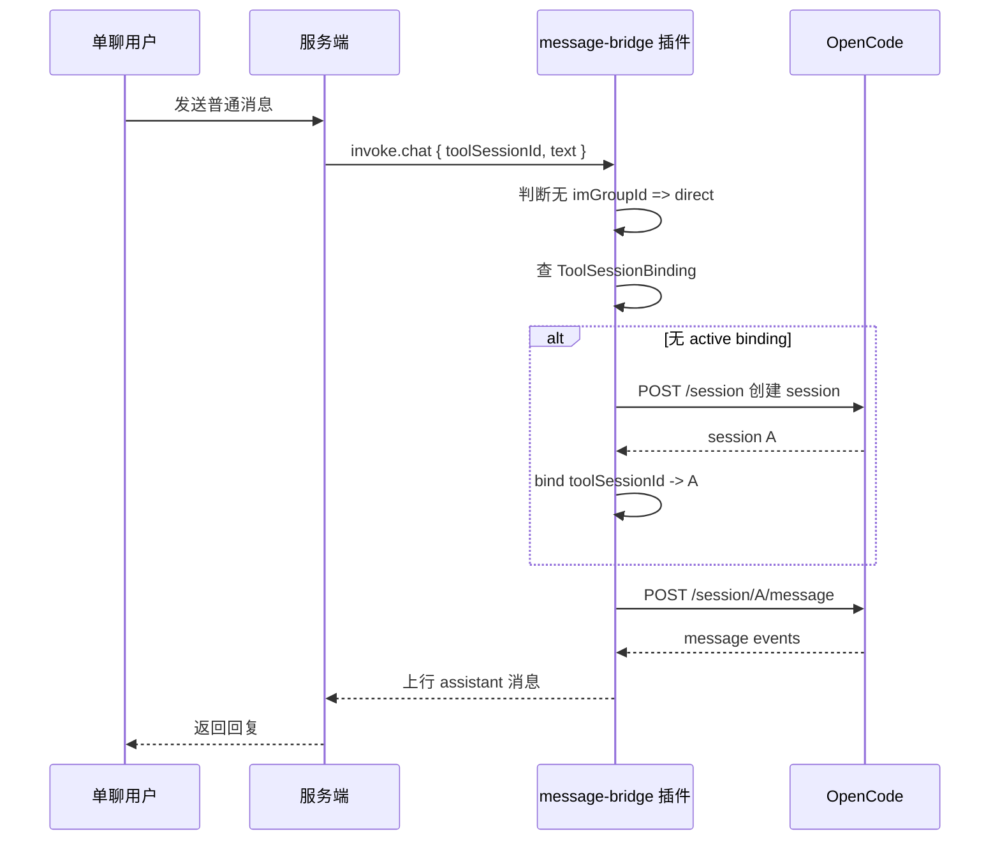
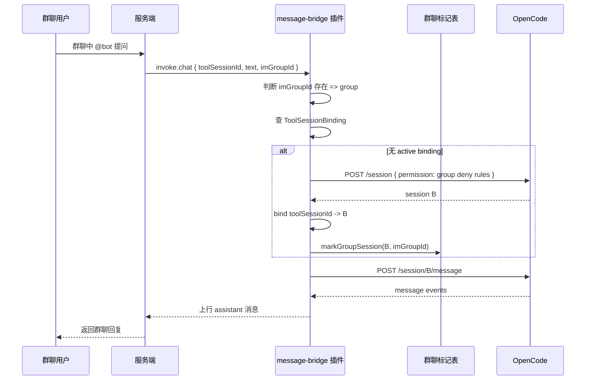
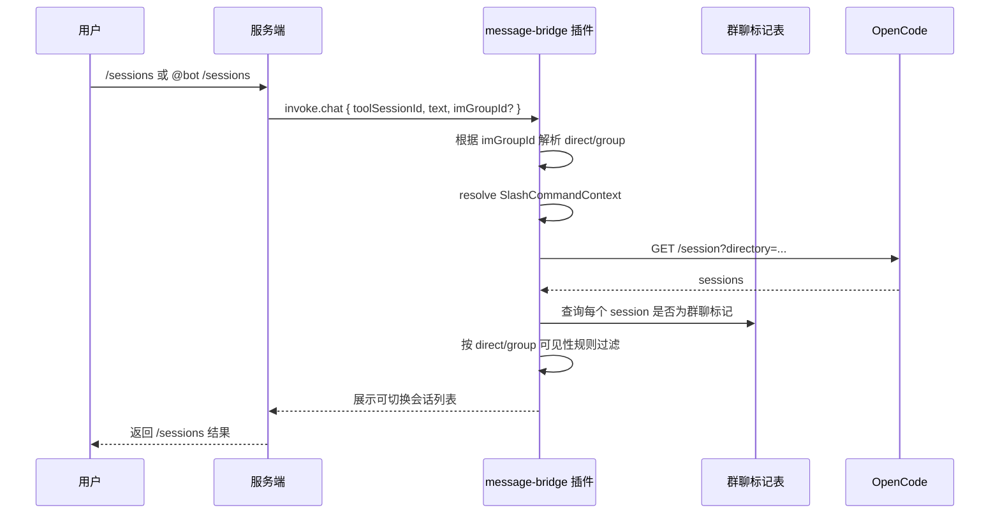
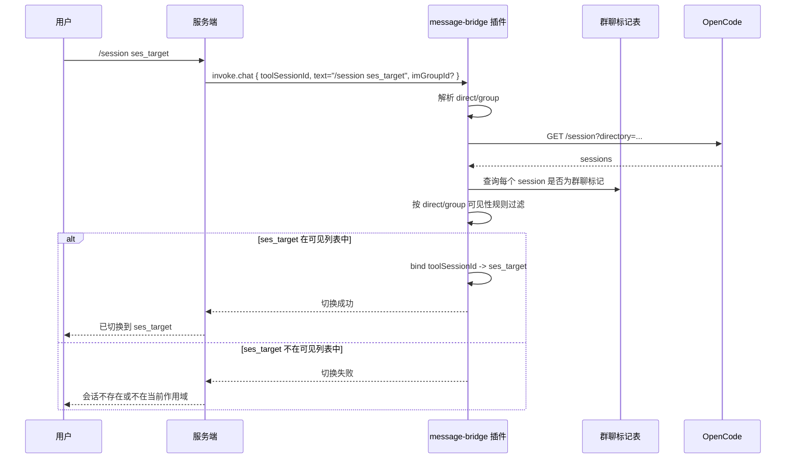
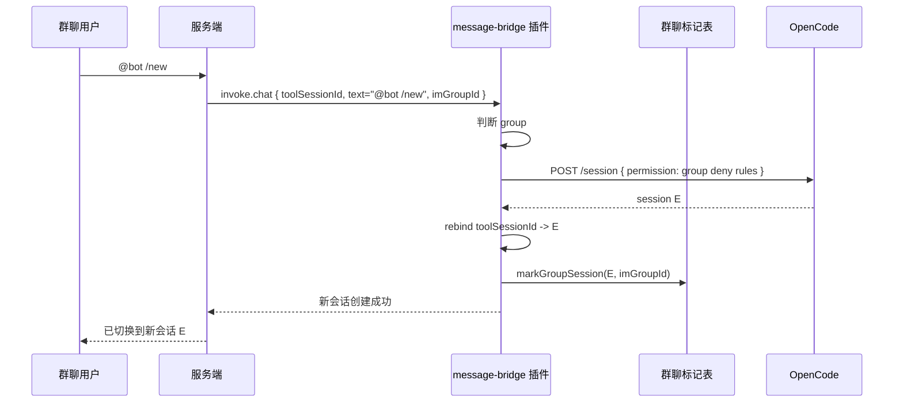
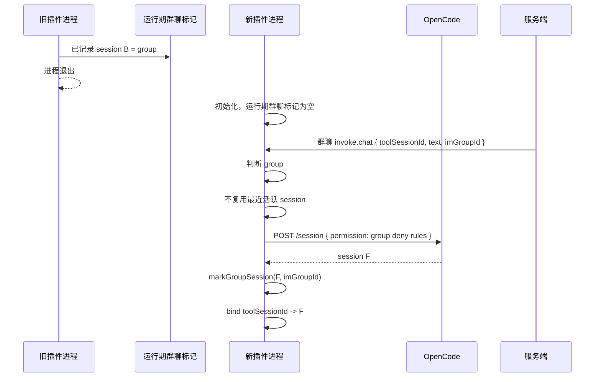
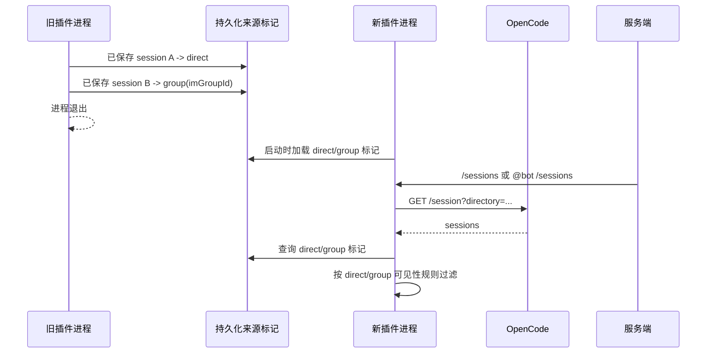

# Message Bridge OpenCode 会话隔离方案设计

**Version:** 1.0  
**Date:** 2026-05-16  
**Status:** Draft  
**Owner:** agent-plugin maintainers  
**Related:** `./message-bridge-slash-commands-temporary-solution.md`, `./message-bridge-slash-commands-solution.md`, `./toolsessionid-dependency-analysis.md`

## 1. 背景

当前 `message-bridge` 在 OpenCode 场景下由插件管理会话生命周期，服务端不管理 OpenCode session 的创建、切换和列表过滤。

插件在该链路中负责：

- 维护 `toolSessionId -> opencodeSessionId` 当前绑定。
- 提供 `/sessions` 会话列表。
- 提供 `/session <sessionId>` 会话切换。
- 在群聊触发创建 OpenCode session 时附加群聊权限管控。

现有链路是：

```text
服务端透传 toolSessionId
  -> 插件维护 toolSessionId 与 OpenCode session 的绑定
  -> 插件提供 /sessions 和 /session <sessionId>
  -> 用户通过 slash command 查看和切换 OpenCode session
```

这套机制解决了插件侧自主切换 OpenCode session 的问题，但当前会话列表和会话切换没有区分单聊与群聊。单聊创建的 session、群聊创建的 session、OpenCode 原生创建的 session 会处在同一个可切换集合里。

## 2. 当前问题

### 2.1 单聊和群聊 session 可互相切换

当前 `/sessions` 主要按 OpenCode session 的宿主作用域过滤，例如 `directory`、`projectID`、`workspaceID`。这些字段只能表达代码工程范围，不能表达 IM 会话来源。

因此会出现：

```text
单聊 /sessions 能看到群聊创建的 session
群聊 /sessions 能看到单聊创建的 session
用户可以通过 /session <sessionId> 切换过去
```

这会带来安全问题：

- 单聊用户可能看到群聊上下文中的历史任务。
- 群聊用户可能切到某个单聊上下文。
- 手输 `/session <sessionId>` 可能绕过列表展示限制。

### 2.2 群聊 session 的权限管控可能被绕过

群聊是多人可见场景，风险高于单聊。群聊 session 应默认使用更严格的 OpenCode 权限策略，例如限制文件读取、命令执行、写入、任务调用、外部访问等高风险能力。

如果群聊可以切换到单聊或 OpenCode 原生 session，则可能绕开群聊创建时附加的权限限制。

## 3. 共同设计目标

不持久化隔离和持久化隔离都必须满足以下目标：

- 当前运行期内，单聊 `/sessions` 不展示已标记的群聊 session。
- 当前运行期内，群聊 `/sessions` 只展示当前 `imGroupId` 对应的群聊 session。
- `/session <sessionId>` 必须基于与 `/sessions` 相同的可见性结果校验目标 session。
- 群聊触发的任何 OpenCode session 创建，包括普通消息 bootstrap 和 `/new`，都必须附加群聊权限并打群聊标记。
- OpenCode `session.id` 仍是唯一可切换目标 ID。
- 服务端不参与 OpenCode session 生命周期和可见性判断。

## 3.1 当前实现收敛

基于当前产品安全边界，`message-bridge` 现阶段先收敛为：

- 群聊入口不开放 `/sessions`
- 群聊入口不开放 `/session <sessionId>`
- 群聊仍允许通过普通消息 bootstrap 新建 session，且 `/new` 继续可用
- 因此当前实现优先保证“群聊无法显式枚举或切换其他 session”，而不是在 v1 内继续维持群聊 session 目录体验

这意味着本文后续关于群聊 `/sessions` 可见性和群聊 `/session <sessionId>` 校验的讨论，主要用于解释完整隔离目标与后续增强方向；当前代码路径先通过禁用显式列会话/切会话入口来 fail-closed。

## 4. 共同设计原则

- `payload.imGroupId` 是群聊唯一可靠信号；没有 `imGroupId` 的消息按单聊处理。
- `directory/projectID/workspaceID` 只表达工程作用域，不能表达 IM 来源。
- IM 来源可见性由插件管理，不依赖 OpenCode `slug`、`title` 或 session metadata。
- 未标记 session 默认按普通 session 处理；在不持久化方案里，它包括单聊创建、OpenCode 原生创建，以及重启后丢失标记的历史群聊 session；在持久化方案里，它只包括 OpenCode 原生创建的 session。
- 群聊不能切到未标记 session；单聊不能切到当前运行期已标记的群聊 session。

## 5. 方案一：不持久化隔离

不持久化隔离是当前临时态的推荐默认方案。它只在插件当前进程内记录群聊创建的 session，不引入本地状态文件。

### 5.1 方案行为

- 插件只在当前进程内记录群聊创建的 session。
- 单聊列表过滤当前进程内已标记的群聊 session。
- 群聊列表只展示当前 `imGroupId` 已标记的 session。
- 群聊无有效 binding 时不复用最近活跃 session，直接新建群聊 session。
- 插件重启后内存标记清空；群聊再次进入时新建 session 并重新打标。
- 重启前历史群聊 session 因标记丢失，按未标记普通 session 处理，单聊可见。

### 5.2 关键数据结构

不持久化方案只需要记录当前运行期的群聊 session 标记。

```ts
interface RuntimeGroupSessionMark {
  opencodeSessionId: string;
  imGroupId: string;
  createdAt: number;
}
```

字段语义：

- `opencodeSessionId`：OpenCode session 主键。
- `imGroupId`：该 session 所属的群聊 ID。
- `createdAt`：运行期标记创建时间。

### 5.3 可见性规则

```text
direct:
  visible = !runtimeGroupMark(session.id)

group:
  visible = runtimeGroupMark(session.id)?.imGroupId === current.imGroupId
```

### 5.4 关键时序图

下面的时序体现不持久化方案下 `/sessions` 的关键边界：当前运行期内，插件只能识别“本进程打过标”的群聊 session，因此 `/sessions` 返回范围会同时包含 OpenCode 原生 session 和单聊 session，但只对当前群聊暴露它自己的群聊 session。



`/sessions` 返回范围示例：

```text
不持久化，当前运行期内：
  direct /sessions -> [OpenCode 原生, 单聊]
  group  /sessions -> [当前 imGroupId 的群聊]

不持久化，插件重启后且历史标记丢失：
  direct /sessions -> [OpenCode 原生, 单聊, 历史群聊, 其他历史群聊]
  group  /sessions -> 旧群聊不可识别；后续需要新建并重新打标
```

### 5.5 重启边界

插件重启后，`RuntimeGroupSessionMark` 全部丢失。

此时规则明确为：

- 群聊收到新消息后，不复用 OpenCode 最近活跃 session。
- 群聊必须新建一个 session。
- 新建 session 重新打上群聊标记。
- 新建 session 重新附加群聊权限管控。
- 重启前的历史群聊 session 因无法识别来源，视为普通 OpenCode 历史 session。
- 单聊 `/sessions` 可以看到这些历史群聊 session。

该行为是无持久化方案的明确取舍：当前运行期安全隔离成立，跨重启不保证历史群聊标记延续。

## 6. 方案二：持久化隔离

持久化隔离用于后续增强。它将 IM 来源标记写入本地状态，使插件重启后仍能识别历史单聊 session 和历史群聊 session。

### 6.1 方案行为

- 插件将 IM 来源标记写入本地状态，同时持久化 `direct` 和 `group` 两类 session。
- 单聊触发创建的 session 写入 `direct` 标记。
- 群聊触发创建的 session 写入 `group + imGroupId` 标记。
- OpenCode 原生创建的 session 不写 IM 标记，保持为未标记普通 session。
- 插件重启后加载 direct/group 标记；单聊继续只看 direct 与 OpenCode 原生 session，群聊继续只看当前 `imGroupId` 的群聊 session。
- 如果仍要求“每次重启后群聊都新建 session”，持久化方案也可以只用于跨重启过滤历史 direct/group session，不用于恢复 active binding。

### 6.2 关键数据结构

持久化方案需要统一持久化 IM 来源标记。OpenCode 原生创建的 session 不写 IM 标记，因此仍属于未标记集合。

```ts
interface PersistedSessionVisibilityState {
  schemaVersion: 2;
  sessions: Record<string, PersistedSessionVisibilityRecord>;
}

type PersistedSessionVisibilityRecord =
  | {
      scope: 'direct';
      createdAt: number;
    }
  | {
      scope: 'group';
      imGroupId: string;
      createdAt: number;
    };
```

字段语义：

- `schemaVersion`：状态文件版本。
- `sessions`：以 `opencodeSessionId` 为 key 的 IM 来源标记表。
- `scope: 'direct'`：该 session 由单聊创建。
- `scope: 'group'`：该 session 由群聊创建。
- `imGroupId`：当 `scope = 'group'` 时，该 session 所属的群聊 ID。
- `createdAt`：持久化标记创建时间。

### 6.3 可见性规则

```text
direct:
  visible =
    persisted.sessions[session.id]?.scope === 'direct'
    || !persisted.sessions[session.id]

group:
  visible =
    persisted.sessions[session.id]?.scope === 'group'
    && persisted.sessions[session.id]?.imGroupId === current.imGroupId
```

### 6.4 关键时序图

下面的时序体现持久化方案下 `/sessions` 的关键收益：单聊和群聊创建的 session 都会同步写入来源标记，插件重启后先加载标记，再稳定地区分 OpenCode 原生、单聊、当前群聊、其他群聊。



`/sessions` 返回范围示例：

```text
持久化，插件重启前后行为一致：
  direct /sessions -> [OpenCode 原生, 单聊]
  group  /sessions -> [当前 imGroupId 的群聊]

其他群聊 session、其他单聊 session、未标记 OpenCode 原生 session
始终不会出现在非所属群聊的 /sessions 结果里
```

### 6.5 重启行为

插件启动后加载持久化来源标记：

- 单聊 `/sessions` 继续展示历史 direct session 和 OpenCode 原生 session。
- 群聊 `/sessions` 可以展示当前 `imGroupId` 的历史群聊 session。
- 其他群聊的 session 不会回落到单聊或当前群聊可见。
- 群聊可以选择继续使用历史群聊 session，而不是每次重启都新建。
- 如果 OpenCode session 已被删除，则对应 direct/group 标记可以懒清理。

该方案的代价是引入状态文件和兼容逻辑，需要处理状态文件损坏、OpenCode session 删除、版本升级等问题。

## 7. 核心流程时序图

### 7.1 单聊首次普通消息



结果：

```text
不持久化方案下，session A 是未标记普通 session
持久化方案下，session A 是 direct session
单聊 /sessions 可见
群聊 /sessions 不可见
```

### 7.2 群聊首次普通消息



结果：

```text
session B 是群聊 session
只对当前 imGroupId 可见
创建时带群聊权限管控
```

### 7.3 `/sessions` 可见性过滤



过滤谓词：

```text
direct:
  不持久化：排除群聊标记 session
  持久化：保留 direct 标记与未标记 OpenCode 原生 session

group:
  两种方案都只保留当前 imGroupId 的群聊标记 session
```

示例：

```text
O = OpenCode 原生 session
D = 单聊 session
G1 = 当前群聊 session
G2 = 其他群聊 session

不持久化当前运行期：
  direct /sessions -> [O, D]
  group /sessions  -> [G1]

持久化：
  direct /sessions -> [O, D]
  group /sessions  -> [G1]
```

### 7.4 `/session <sessionId>` 切换校验



关键点：

```text
/session 不直接信任用户输入的 sessionId
必须先走与 /sessions 相同的过滤规则
因此 direct 只能切到 [direct + OpenCode 原生]
group 只能切到 [当前 imGroupId 的 group]
```

### 7.5 群聊执行 `/new`



结果：

```text
E 是新的群聊 session
E 只对当前群聊可见
E 带群聊权限管控
```

群聊首次普通消息 bootstrap 与群聊 `/new` 共享同一条创建约束：只要由群聊触发创建 OpenCode session，就必须附加群聊权限并打群聊标记。

### 7.6 不持久化方案下插件重启



结果：

```text
历史 B 的 group 标记丢失
新群聊 session F 重新创建并标记
B 后续在单聊中按普通历史 session 处理
```

### 7.7 持久化方案下插件重启



结果：

```text
历史 A 的 direct 标记仍存在
历史 B 的 group 标记仍存在
单聊继续只看到 [direct + OpenCode 原生]
当前 imGroupId 的群聊继续只看到 [当前 group]
```

## 8. 两种方案对比

| 维度 | 不持久化隔离 | 持久化隔离 |
| --- | --- | --- |
| 当前运行期隔离 | 支持 | 支持 |
| 重启后历史 direct/group 是否继续保留来源隔离 | 不支持 | 支持 |
| 重启后群聊是否强制新建 session | 是 | 默认否；可配置为只过滤不恢复 |
| 历史群聊 session 是否会回落为单聊可见 | 会 | 不会 |
| 历史单聊 session 是否会持续保留 direct 身份 | 不保证 | 会 |
| 群聊上下文是否可恢复 | 不恢复 | 可恢复 |
| 实现复杂度 | 低 | 中 |
| 状态维护成本 | 无 | 需要处理 direct/group 标记文件、损坏、清理 |
| 与当前临时态一致性 | 高 | 中 |

## 9. 推荐结论

短期推荐不持久化隔离：

- 符合当前临时态“不承诺跨重启恢复”的边界。
- 满足“每次重启后群聊都新建 session 并重新打群聊标记”的要求。
- 接受“历史群聊 session 因标记丢失，视为单聊普通 session”的取舍。
- 不引入本地状态和迁移成本。

长期如果要求跨重启持续保留 direct/group 来源隔离，或要求群聊恢复历史上下文，则切换到持久化隔离。
