# Message Bridge OpenCode 会话隔离与持久化方案设计

**Version:** 3.2  
**Date:** 2026-05-25  
**Status:** Reviewing  
**Owner:** agent-plugin maintainers  
**Related:** `./message-bridge-slash-commands-temporary-solution.md`, `./message-bridge-slash-commands-solution.md`, `./toolsessionid-dependency-analysis.md`

## In Scope

- `message-bridge` 的 SDK 链路 OpenCode 会话隔离设计
- 业务入口三元组解析、历史字段补全与旧 `create_session` 兼容路径
- SDK 控制面的会话可见性、切换、bootstrap、新建与恢复策略
- AK scope ownership 持久化边界与运行时 binding 模型
- 受控权限画像与 slash 白名单默认模板
- SDK 事件链路内的 `session.deleted` 删除真源设计

## Out of Scope

- 旧 runtime 并行实现改造
- `message-bridge-openclaw` 插件实现改造
- 服务端入口级拦截逻辑
- 服务端业务幂等与一致性保证
- OpenCode 宿主新增原生 `dialog-only` 模式

## External Dependencies

- 服务端负责决定哪些入口允许进入插件链路
- OpenCode 提供 `session.list / session.get / session.create / session.delete / session.prompt`
- SDK 链路可稳定读取当前 runtime 连接配置中的 `auth.ak`
- 上游透传或允许插件补全业务入口三元组所需字段

## 1. 文档定位

本文将 OpenCode 会话隔离收敛为 SDK 链路专用的最终方案。

本文在当前版本达到“进入详细接口设计前的初步定稿”状态；后续接口设计与实现拆解不得再改变本文已锁定的核心模型、标识边界与生命周期语义。

本文不再保留旧稿中的并行解释路径，以下旧语义统一废弃：

- 将 `imGroupId` 作为正式隔离语义
- 将 `listSessions()[0]` 作为默认复用候选
- 将 `toolSessionId` 直接视为 durable ownership 主键
- 将 `ak` 视为消息级输入字段

全文按“核心模型 -> 生命周期 -> 接口改造 -> 运行约束 -> 场景验收”的顺序组织，目的是先定义静态事实，再定义动态流程，最后收束到实现与验收。

## 2. 核心结论总览

本版方案采用以下硬约束：

- 正式业务隔离语义以 `BusinessEntryKey` 为主键。
- `toolSessionId` 保留为 runtime conversation anchor，不承担正式业务隔离语义。
- ownership 持久化边界以 `AK scope` 为准，`AK scope` 唯一来源是当前 runtime 连接配置的 `auth.ak`。
- SDK 链路内所有新建 OpenCode session 的路径，统一走同一个 `CreateOwnedSessionUseCase`。
- `session.deleted` 是 SDK 链路内统一删除生命周期事件真源，主消费路径为 plugin `event` hook。
- `suppressReply` 是消息级硬约束，优先于 slash parse 与普通 chat bootstrap。
- 创建宿主会话成功但 ownership 落盘失败时，本次请求失败，并执行 best-effort 删除；若删除失败，仅记录高优先级错误日志。
- `create_session.payload.extParameters` 与 `chat.payload.extParameters` 使用同一 `ExtParameters` 契约；`title` 仅作为宿主 prompt/展示型入参。
- `toolSessionId` 是对话链路锚点，host `sessionId` 是宿主会话管理锚点；`session_created` 对外仍只返回 `toolSessionId`。
- 旧 `create_session` 在无法形成合法 `entryKey` 时，不创建 host session，只创建一个 `anchor-only runtime anchor` 并分配 `toolSessionId`。
- `close_session` 删除当前 `toolSessionId` 绑定到的 host `sessionId`；删除成功后按 `sessionId` 粒度立即清理 ownership、attach owner 和全部相关 binding。
- request run 的正式归属锚点是 `toolSessionId`；`abort_session` 不得跨锚点中断共享 host session 上的其他 run。
- `question_reply` / `permission_reply` 的 pending interaction 属于进程内运行时状态，插件重启后不恢复；映射缺失、当前 binding 缺失或当前 binding 已切换到其他 host `sessionId` 时统一 fail-closed。

为便于阅读，全文后续内容围绕四个核心问题展开：

1. 正式业务入口如何定义
2. ownership 与 binding 如何分层
3. 会话在何处可见、何时可复用、何时必须新建
4. 删除、重启、损坏等异常场景如何收敛

## 3. 核心模型与边界

本章只回答“系统里有哪些正式概念、它们各自负责什么”，不展开运行时序。

### 3.1 业务入口三元组

插件正式使用 `BusinessEntryKey` 作为外部业务入口锚点：

```ts
interface BusinessEntryKey {
  businessSessionDomain: string;
  businessSessionType: string;
  businessSessionId: string;
}
```

规范化后的稳定字符串键：

```text
entryKey = `${businessSessionDomain}:${businessSessionType}:${businessSessionId}`
```

当前支持的小写规范值至少包括：

```text
im:direct:<id>
im:group:<id>
im:skill:<id>
miniapp:direct:<id>
```

约束：

- `businessSessionDomain`、`businessSessionType`、`businessSessionId` 在比较与落盘前都必须规范化。
- 单聊/群聊正式语义只由 `businessSessionType` 判定。
- `toolSessionId` 保留为 runtime anchor，不承担正式业务隔离语义。

### 3.2 业务入口三元组解析与补全

显式完整三元组优先，旧字段不得覆盖。

对 `chat` 与 `create_session`，正式显式输入固定来自：

```ts
payload.extParameters.platformExtParam.businessSessionDomain
payload.extParameters.platformExtParam.businessSessionType
payload.extParameters.platformExtParam.businessSessionId
```

规则：

- `chat.payload.extParameters` 与 `create_session.payload.extParameters` 使用同一 `ExtParameters` 契约。
- 显式 `platformExtParam` 优先于 `imGroupId`、账号拼接、`title` 等历史兼容字段。
- 历史字段只在显式字段缺失时用于补全。
- `title` 保留为建会话时传给宿主的 prompt/展示型入参，不参与 `BusinessEntryKey` 解析。
- `close_session`、`abort_session`、`question_reply`、`permission_reply` 不基于 `extParameters` 做目标选择、删除判定、回复恢复或业务入口路由。
- `question_reply` / `permission_reply` 只允许使用 interaction 注册时记录的 `hostSessionId` 做一致性校验；不得在 reply 阶段基于 host `sessionId` 扫描或恢复旧 interaction。

对 `chat`，若三元组缺失，则执行补全：

1. `im`
   - `businessSessionDomain = "im"`
   - `businessSessionType = imGroupId ? "group" : "direct"`
   - `businessSessionId`
     - `group`：`imGroupId`
     - `direct`：`${sendUserAccount}#${assistantAccount}`
2. `miniapp`
   - `businessSessionDomain = "miniapp"`
   - `businessSessionType = "direct"`
   - `businessSessionId = assistantAccount`
3. `im:skill:*`
   - 不做历史补全
   - 仅接受显式完整三元组

对 `chat`，补全失败时：

- 本次请求失败
- 不进入会话解析、bootstrap 或 prompt

对 `create_session`：

- 若显式 `platformExtParam` 可形成合法 `entryKey`，则进入正式 `entry-owned` 建会话路径。
- 若无法形成合法 `entryKey`，则不再做“历史上下文补全 entry”。
- 此时走兼容路径：只创建一个 `anchor-only runtime anchor`，分配 `toolSessionId`，不创建 host session，不写 ownership，不建立 binding。

### 3.2.1 请求侧正式输入契约矩阵

| Action | 正式业务入口输入 | 兼容补全输入 | `extParameters` 语义 | 失败边界 |
| --- | --- | --- | --- | --- |
| `chat` | `payload.extParameters.platformExtParam.businessSessionDomain/type/id` | `imGroupId`、`assistantAccount`、`sendUserAccount` | 正式参与 `BusinessEntryKey` 解析 | 若显式字段缺失且补全失败，则 fail-closed |
| `create_session` | `payload.extParameters.platformExtParam.businessSessionDomain/type/id` | 无正式 entry 补全；缺合法 `entryKey` 时走 `anchor-only` 兼容路径；`title` 不参与隔离语义 | 正式参与 `BusinessEntryKey` 解析；与 `chat` 复用同一 `ExtParameters` 契约 | 有合法 `entryKey` 时按正式建会话路径处理；否则仅创建 `anchor-only` runtime anchor，不调用 `session.create` |
| `close_session` | 无 | `payload.toolSessionId` 命中 runtime binding | 即使存在也不参与目标解析 | `toolSessionId` 未绑定或已失效时按幂等失败处理 |
| `abort_session` | 无 | `payload.toolSessionId` 命中 active run | 即使存在也不参与目标解析 | 当前 `toolSessionId` 无活跃 run 时按幂等失败处理 |
| `question_reply` | 无 | `payload.questionId` 命中 pending interaction | 即使存在也不参与恢复 | 映射缺失，或映射的 `toolSessionId + hostSessionId` 与当前 binding 不一致时 fail-closed |
| `permission_reply` | 无 | `payload.permissionId` 命中 pending interaction | 即使存在也不参与恢复 | 映射缺失，或映射的 `toolSessionId + hostSessionId` 与当前 binding 不一致时 fail-closed |

### 3.3 双层锚点模型

插件正式采用双层锚点模型：

1. `toolSessionId`
   - 作为 `runtime conversation anchor`
   - 负责当前请求在 runtime 内的 run / reply / event 路由
   - 负责当前外部对话实例的 active binding
2. `entryKey`
   - 作为 `durable ownership anchor`
   - 负责业务入口隔离、会话归属、可见性判定、bootstrap 候选选择、恢复判定
   - 作为持久化 ownership 状态中的正式归属键

约束：

- `toolSessionId` 决定“本次交互怎么路由”。
- `entryKey` 决定“本次交互允许看哪些会话、允许从哪些会话中复用”。
- 同一个 `entryKey` 下允许存在多个 `toolSessionId`。
- 多个 `toolSessionId` 可以复用同一个 `entryKey` 下的同一个 OpenCode session。
- 同一个 OpenCode session 在任一时刻只能有一个当前 attach owner。
- `session_created` 对外仍只返回 `toolSessionId`。
- `/sessions` 展示 host `sessionId`，`/session <sessionId>` 接收的 `sessionId` 也固定指 host `sessionId`。
- 对已绑定真实 host session 的 runtime anchor，内部必须维护 `toolSessionId -> host sessionId` 的强制可查映射。
- 旧兼容路径下 runtime 本地生成的 `toolSessionId` 即使字符串形态与 OpenCode `sessionId` 兼容，也不得在任何内部逻辑中被视为真实 host `sessionId`。

在进入生命周期时序前，先看两张静态关系图。它们都不表达“先后顺序”：

1. 第一张只回答“状态真源与索引关系是什么”
2. 第二张只回答“`visibleSessions(entryKey)` 是如何收敛出来的”

读这两张图时，只看“归属关系”和“过滤边界”，不要按时序图去理解调用顺序。

状态与索引关系图：

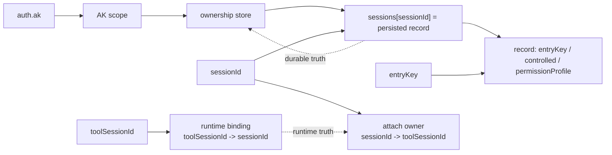
```mermaid
flowchart LR
  AK["auth.ak"] --> Scope["AK scope"]
  Scope --> Store["ownership store"]

  Store --> Persisted["sessions[sessionId] = persisted record"]
  Persisted --> PersistedFields["record: entryKey / controlled / permissionProfile"]
  Entry["entryKey"] --> PersistedFields

  Tool["toolSessionId"] --> Binding["runtime binding<br/>toolSessionId -> sessionId"]
  Session["sessionId"] --> Persisted
  Session --> Attach["attach owner<br/>sessionId -> toolSessionId"]

  Persisted -. durable truth .-> Store
  Binding -. runtime truth .-> Attach
```

`visibleSessions(entryKey)` 收敛图：

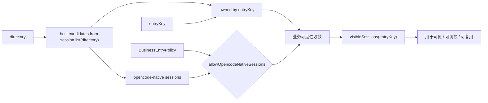
```mermaid
flowchart LR
  Dir["directory"] --> Host["host candidates from session.list(directory)"]

  Host --> OwnedFilter["owned by entryKey"]
  Entry["entryKey"] --> OwnedFilter

  Host --> Native["opencode-native sessions"]
  Policy["BusinessEntryPolicy"] --> NativeGate{"allowOpencodeNativeSessions"}
  Native --> NativeGate

  OwnedFilter --> Merge["业务可见性收敛"]
  NativeGate --> Merge
  Merge --> Visible["visibleSessions(entryKey)"]

  Visible --> UseCases["用于可见 / 可切换 / 可复用"]
```

### 3.4 AK scope 持久化边界

- ownership 持久化按 `AK scope` 隔离。
- `AK scope` 唯一来源是当前 runtime 连接配置的 `auth.ak`。
- 不从单次消息输入读取 `ak`。
- 不同 `auth.ak` 的 ownership 文件完全隔离。
- 同一 `auth.ak` 下，不同 OpenCode 启动目录实例共享同一份 ownership 真源。
- 不按 `directory` 分片 ownership 文件。
- 不使用单一全局共享 ownership 文件。

状态文件固定路径模型：

```text
<data-dir>/message-bridge/sessions/<ak-scope>/entry-session-store.json
```

其中：

- `data-dir` 按平台取值：
  - macOS: `~/Library/Application Support`
  - Linux: `$XDG_DATA_HOME`，若为空则 `~/.local/share`
  - Windows: `%LOCALAPPDATA%`
- `<ak-scope>` 固定为 `sha256(auth.ak)` 的小写十六进制字符串

### 3.5 两层状态模型

方案将状态拆成两类：

1. 持久化 ownership 状态
   - durable truth
   - 记录 `welink-entry-owned` 会话归属与权限画像
2. 运行时 binding 状态
   - process-local runtime truth
   - 记录 `toolSessionId` 当前绑定到哪个 OpenCode session，以及当前 attach owner
3. `anchor-only runtime anchor` 状态
   - process-local runtime truth
   - 记录已分配 `toolSessionId`、但尚未绑定真实 host session 的 runtime conversation identity

持久化模型：

```ts
interface PersistedEntrySessionState {
  schemaVersion: 1;
  sessions: Record<string, PersistedSessionRecord>;
}

interface PersistedSessionRecord {
  origin: 'welink-entry-owned';
  entryKey: string;
  controlled: boolean;
  permissionProfile: 'default' | 'dialog_only';
  createdAt: number;
}
```

约束：

- `sessions` 的 key 即 OpenCode `sessionId`
- 不在记录体中重复保存 `sessionId`
- 只持久化 `welink-entry-owned`
- 不持久化 `opencode-native`
- 当前版本不持久化 `updatedAt`

运行时模型：

```ts
interface RuntimeBindingState {
  bindingsByToolSessionId: Record<string, RuntimeBindingRecord>;
  attachedOwnerBySessionId: Record<string, string>;
  anchorOnlyToolSessionIds: Record<string, AnchorOnlyRuntimeAnchorRecord>;
}

interface RuntimeBindingRecord {
  entryKey: string;
  sessionId: string;
  updatedAt: number;
}

interface AnchorOnlyRuntimeAnchorRecord {
  createdAt: number;
}
```

约束：

- `bindingsByToolSessionId` 的 key 即 `toolSessionId`
- 不在记录体中重复保存 `toolSessionId`
- `attachedOwnerBySessionId[sessionId] = toolSessionId`
- `anchorOnlyToolSessionIds` 的 key 即 `toolSessionId`
- 同一 `sessionId` 在任一时刻只能有一个当前 attach owner
- `setAttachedOwner(sessionId, toolSessionId)` 表示将该 `sessionId` 的当前 attach owner 更新为新的 `toolSessionId`
- runtime binding 不持久化，插件重启后全量丢失
- `anchor-only runtime anchor` 不持久化，不携带 host `sessionId`，也不进入 `/sessions` 与 `/session <sessionId>` 的可管理集合

### 3.5.1 run 与 reply 的运行时归属模型

- request run 的正式归属锚点是 `toolSessionId`。
- host `sessionId` 不承载 request run 归属语义，只承载 ownership / visibility / deletion 语义。
- 即使多个 `toolSessionId` 复用同一 host `sessionId`，也各自维护独立 run 生命周期。
- `abort_session` 只能中断当前 `toolSessionId` 的活跃 run。
- `anchor-only runtime anchor` 也可以承载 runtime 路由语义，但在首次合法 `chat` 前不承载 host session 生命周期语义。
- pending question / permission interaction 映射属于 process-local runtime state。
- pending interaction 映射必须记录 `tokenId -> toolSessionId + hostSessionId`，其中 `tokenId` 是 `questionId` 或 `permissionId`。
- `question_reply` / `permission_reply` 执行前必须校验当前 `toolSessionId` 仍绑定到最初产生该 interaction 的同一个 host `sessionId`。
- 插件重启后不恢复 pending interaction 映射。
- `question_reply` / `permission_reply` 在映射缺失、当前 binding 缺失、当前 binding 已切换到其他 host `sessionId` 时统一 fail-closed。
- 不允许基于 `extParameters`、业务入口或 host `sessionId` 反推旧 interaction 进行恢复。
- 当前版本不为 `anchor-only runtime anchor` 引入空闲超时自动回收。
- `anchor-only runtime anchor` 仅在以下情况消失：
  - `close_session(toolSessionId)` 幂等成功删除
  - 首次合法 `chat` 成功完成 bootstrap 并转入 bound 状态
  - 进程重启导致 process-local 状态整体丢失
- 当前版本允许同一旧客户端多次 `create_session` 生成多个 `anchor-only runtime anchor`；数量治理不属于本轮正式语义。

pending interaction 的注册与回复校验时序如下：

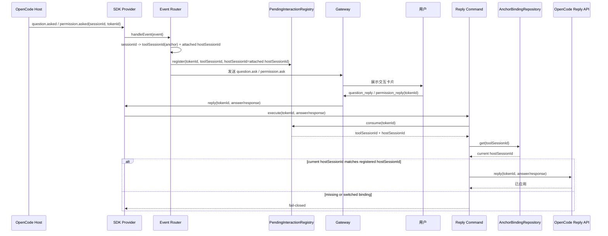
```mermaid
sequenceDiagram
  participant Host as OpenCode Host
  participant Provider as SDK Provider
  participant Router as Event Router
  participant Registry as PendingInteractionRegistry
  participant Gateway as Gateway
  participant User as 用户
  participant Reply as Reply Command
  participant Binding as AnchorBindingRepository
  participant OpenCode as OpenCode Reply API

  Host->>Provider: question.asked / permission.asked(sessionId, tokenId)
  Provider->>Router: handleEvent(event)
  Router->>Router: sessionId -> toolSessionId(anchor) + attached hostSessionId
  Router->>Registry: register(tokenId, toolSessionId, hostSessionId=attached hostSessionId)
  Router->>Gateway: 发送 question.ask / permission.ask
  Gateway->>User: 展示交互卡片

  User->>Gateway: question_reply / permission_reply(tokenId)
  Gateway->>Provider: reply(tokenId, answer/response)
  Provider->>Reply: execute(tokenId, answer/response)
  Reply->>Registry: consume(tokenId)
  Registry-->>Reply: toolSessionId + hostSessionId
  Reply->>Binding: get(toolSessionId)
  Binding-->>Reply: current hostSessionId

  alt current hostSessionId matches registered hostSessionId
    Reply->>OpenCode: reply(tokenId, answer/response)
    OpenCode-->>Reply: 已应用
  else missing or switched binding
    Reply-->>Provider: fail-closed
  end
```

该校验不改变 OpenCode reply API 的入参。host `sessionId` 只作为会话隔离安全校验，不作为 `question_reply` / `permission_reply` 的路由主键。subagent 事件的 raw `sessionId` 是 child session，注册 pending interaction 时必须记录其归属 anchor 当前绑定的 parent host `sessionId`，否则后续回复会被误判为 binding 已切换。

### 3.6 ownership 与可见性分层

- ownership 共享边界 = `AK scope`
- session 可见性边界 = 当前 OpenCode 工作目录 + 当前入口策略

同一 `auth.ak` 共享 ownership 文件，不等于可跨目录自由复用 session。

所有复用、列表与切换仍必须先通过：

1. 当前工作目录过滤
2. 当前入口 owned 过滤
3. native 暴露策略过滤

### 3.7 入口策略模型

`BusinessEntryPolicy` 固定为：

```ts
interface BusinessEntryPolicy {
  entryKey: string;
  controlled: boolean;
  allowOpencodeNativeSessions: boolean;
  allowedSlashCommands: SlashCommand['kind'][];
}
```

当前阶段策略来源为插件本地模板，未来允许服务端显式值覆盖。

当前版本中，仅 `chat.payload.extParameters.platformExtParam.allowedSlashCommands` 允许对当前请求的 slash 可用集合做请求级覆盖；`create_session` 上的同名字段不生效。

覆盖规则：

- `undefined`：不覆盖，回退本地模板。
- `null`：不覆盖，回退本地模板。
- 非数组：不覆盖，记录错误日志，回退本地模板。
- 数组项存在非法 slash kind：过滤非法项后再参与计算。
- 过滤后为空数组 `[]`：视为有效值，表示当前请求显式禁用所有 slash。
- 最终当前请求生效值 = 本地模板 `allowedSlashCommands` 与请求级有效值的交集。
- 该覆盖仅对当前请求生效，不持久化，也不修改 `BusinessEntryPolicy` 的 durable truth。

默认模板：

```ts
policyTemplate["im:direct"] = {
  controlled: false,
  allowOpencodeNativeSessions: true,
  allowedSlashCommands: ['new', 'sessions', 'session', 'models', 'model'],
};

policyTemplate["miniapp:direct"] = {
  controlled: false,
  allowOpencodeNativeSessions: true,
  allowedSlashCommands: ['new', 'sessions', 'session', 'models', 'model'],
};

policyTemplate["im:group"] = {
  controlled: true,
  allowOpencodeNativeSessions: false,
  allowedSlashCommands: ['new', 'models', 'model'],
};

policyTemplate["im:skill"] = {
  controlled: false,
  allowOpencodeNativeSessions: false,
  allowedSlashCommands: ['new', 'models', 'model'],
};
```

### 3.7.1 OpenCode 宿主 scope 语义

以下内容只描述 OpenCode 宿主自身 contract，不代表插件侧的最终可见性规则：

- `directory`
  - 当前工作目录
  - 是通用 `GET /session` / `session.list` 的直接过滤入口
- `worktree`
  - `directory` 所属的 git worktree 根目录
  - 代表更上层的项目根语义，但不是通用 `session.list` 的并列 query 参数
- `projectID`
  - 项目身份标识
  - 出现在 `Session` / `Project` 返回对象中
  - 只有在 `/project/:projectID/session` 这样的 project 路由下，才直接决定返回列表

因此，对通用 `session.list` 来说：

- 宿主先基于 `directory` 解析当前实例与项目上下文
- 再返回该上下文下的 session 候选列表
- `worktree`、`projectID` 属于该上下文语义，不等于通用 `session.list` 的直接过滤参数

### 3.8 可见性统一真源

本节按三层口径描述同一个问题，避免把宿主能力、当前实现现状与方案结论混写。

`OpenCode` 宿主事实：

- 通用 `GET /session` / `session.list` 的直接过滤入口是 `directory`
- 宿主收到请求后，会先基于 `directory` 解析当前实例与项目上下文
- 再返回该上下文下的 session 候选列表
- `worktree` 表示该目录所属的 git worktree 根目录，`projectID` 表示 session 的项目归属标识；二者都属于宿主上下文语义，但不是通用 `session.list` 当前暴露的并列 query 参数
- 只有在 `/project/:projectID/session` 这样的项目路由下，`projectID` 才会直接决定返回列表

当前插件实现现状：

- 当前控制面会把宿主返回结果收口为 `id/title/projectID/workspaceID/directory`
- 若当前实现存在 `projectID/workspaceID` 二次约束，它属于插件侧的结果收口策略
- 这类二次约束只能视为当前实现现状，不上升为 OpenCode 宿主原生能力

本方案正式规则：

对任意业务入口，请始终按以下顺序构造可见会话集：

1. OpenCode 宿主先基于 `directory` 返回候选 session 列表
2. 插件在该宿主候选集上应用本方案的业务可见性规则
3. 从剩余结果中保留“当前入口创建的会话”
4. 若入口配置允许展示 OpenCode 原生会话，再把同一宿主候选集中的 native 会话并入
5. 绝不展示其他业务入口创建的会话

因此，本文中的 `visibleSessions(entryKey)` 不应理解为宿主直接按 `worktree` 或 `projectID` 过滤出的结果，而应理解为：OpenCode 宿主先基于 `directory` 给出候选 session 列表，插件再在该候选集上叠加业务入口 ownership 与 native 暴露策略，收敛出最终可见会话列表。

```text
visibleSessions(entry) =
  hostCandidatesFromSessionList(directory)
  ∩ (
    ownedBy(entryKey)
    ∪ allowOpencodeNativeSessions(entry) ? opencodeNativeSessionsFromHostCandidates : empty
  )
```

约束：

- `/sessions`、`/session <sessionId>`、普通消息 bootstrap 共用同一 `visibleSessions(entryKey)` 真源。
- 图和文字中的“宿主候选集”与“最终可见集”必须视为两个不同集合。
- 禁止继续使用“`listSessions({})` 第一个结果就是可复用会话”的全局最近活跃策略。
- 每次使用 binding 前都必须重新过可见性校验。
- “最近活跃候选”定义为：OpenCode `session.list` 返回列表中，首个满足当前 `visibleSessions(entryKey)` 过滤条件的会话。
- 插件不自行重排宿主 `session.list` 的返回顺序。
- `/sessions` 也沿用同一宿主返回顺序展示当前可见结果。

### 3.9 `dialog_only` 的正式语义

`dialog_only` 表示：

- 该 session 仅允许对话
- 不允许工具调用

它是逻辑权限画像标签，底层通过固定 deny list 实现。

当前 deny list 基线：

```ts
[
  'bash',
  'read',
  'glob',
  'grep',
  'edit',
  'write',
  'task',
  'webfetch',
  'myAgentWebFetch',
  'meeting*',
  'knowledge*',
  'playwright*',
]
```

规则：

- `controlled=true` 的新会话必须使用 `permissionProfile='dialog_only'`
- 同时下发上述 deny list
- 受控历史会话若无法证明符合该权限画像，则不得自动接管
- `permissionProfile='default'` 仅表示该 owned session 不是受控会话
- 当前版本中，`permissionProfile='default'` 不额外向宿主下发 permission deny list 或其他默认权限配置
- 当前版本不考虑服务端下发，也不定义独立的宿主侧 `default profile`

### 3.10 slash 命令控制

slash 命令是否可用由 `BusinessEntryPolicy.allowedSlashCommands` 决定，不再由“群聊禁 `/sessions` `/session`”这类硬编码决定。

命中禁用命令时：

- 插件返回统一 synthetic assistant failure reply
- 不回退到普通 chat
- 不发送 `tool_error`

`suppressReply` 优先级高于 slash parse，命中后直接短路，不进入 slash 控制面。

## 4. 生命周期与核心流程

本章只回答“系统在收到请求、切换会话、创建会话、删除会话、重启恢复时具体怎么运行”。

### 4.1 请求处理总顺序

插件侧请求处理顺序固定为：

1. 解析或补全业务入口三元组
2. 生成 `entryKey`
3. 解析本地 `BusinessEntryPolicy`
4. 先判 `suppressReply`
5. 再做 slash parse
6. 若命中 slash，再判 `allowedSlashCommands`
7. 若是普通消息，才进入 bootstrap / prompt

约束：

- `suppressReply` 是消息级硬约束。
- 命中 `suppressReply` 时：
  - 直接走拒绝快路径
  - 不进入 slash 控制面
  - 不进入普通 chat bootstrap
  - 不复用会话
  - 不新建会话
  - 不调用宿主 prompt

后续各张时序图都是这条总路径的局部展开。为避免读者在 slash 控制面与普通消息 bootstrap 之间来回跳，先给出统一入口分流图。

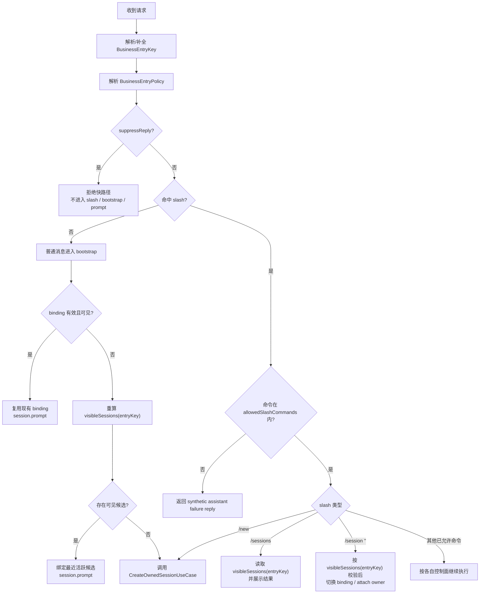
```mermaid
flowchart TD
  Start["收到请求"] --> Entry["解析/补全 BusinessEntryKey"]
  Entry --> Policy["解析 BusinessEntryPolicy"]
  Policy --> Suppress{"suppressReply?"}

  Suppress -- 是 --> Reject["拒绝快路径<br/>不进入 slash / bootstrap / prompt"]
  Suppress -- 否 --> Slash{"命中 slash?"}

  Slash -- 否 --> Bootstrap["普通消息进入 bootstrap"]
  Bootstrap --> Binding{"binding 有效且可见?"}
  Binding -- 是 --> PromptBound["复用现有 binding<br/>session.prompt"]
  Binding -- 否 --> Visible["重算 visibleSessions(entryKey)"]
  Visible --> Candidate{"存在可见候选?"}
  Candidate -- 是 --> PromptReuse["绑定最近活跃候选<br/>session.prompt"]
  Candidate -- 否 --> Create["调用 CreateOwnedSessionUseCase"]

  Slash -- 是 --> Gate{"命令在 allowedSlashCommands 内?"}
  Gate -- 否 --> Deny["返回 synthetic assistant failure reply"]
  Gate -- 是 --> Command{"slash 类型"}
  Command -- /new --> Create
  Command -- /sessions --> Sessions["读取 visibleSessions(entryKey)<br/>并展示结果"]
  Command -- /session '<sessionId>' --> Switch["按 visibleSessions(entryKey) 校验后<br/>切换 binding / attach owner"]
  Command -- 其他已允许命令 --> Other["按各自控制面继续执行"]
```

### 4.2 当前连接就绪后首次访问 ownership - AK scope 懒加载

ownership 文件不是进程启动即读取，而是在当前连接身份可用后，首次需要做 ownership 判定时按 `AK scope` 懒加载。

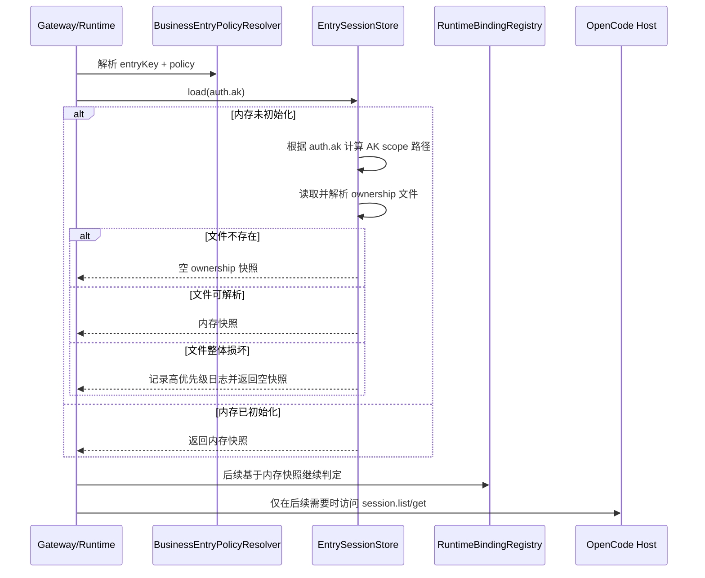
```mermaid
sequenceDiagram
  participant Gateway as Gateway/Runtime
  participant Policy as BusinessEntryPolicyResolver
  participant Store as EntrySessionStore
  participant Binding as RuntimeBindingRegistry
  participant Host as OpenCode Host

  Gateway->>Policy: 解析 entryKey + policy
  Gateway->>Store: load(auth.ak)
  alt 内存未初始化
    Store->>Store: 根据 auth.ak 计算 AK scope 路径
    Store->>Store: 读取并解析 ownership 文件
    alt 文件不存在
      Store-->>Gateway: 空 ownership 快照
    else 文件可解析
      Store-->>Gateway: 内存快照
    else 文件整体损坏
      Store-->>Gateway: 记录高优先级日志并返回空快照
    end
  else 内存已初始化
    Store-->>Gateway: 返回内存快照
  end
  Gateway->>Binding: 后续基于内存快照继续判定
  Gateway->>Host: 仅在后续需要时访问 session.list/get
```

### 4.3 统一建会话入口

SDK 链路内任何新建 OpenCode session 的路径，都必须走同一个 `CreateOwnedSessionUseCase`。

覆盖三类触发源：

- `create_session`
- `/new`
- 普通消息 bootstrap 在无可见候选或原会话失效后的自动重建

正式建会话路径的前置条件：

- 当前请求已解析出合法 `BusinessEntryKey` 与 `BusinessEntryPolicy`
- `create_session` 是业务入口内能力，不是脱离业务入口的通用 SDK 能力
- `create_session` 的合法 `entryKey` 必须由显式 `platformExtParam` 得到
- 若无法形成合法 `entryKey`，则转入 `anchor-only` 兼容路径，不执行 `session.create`
- 不允许创建“无 entry ownership”的 SDK 会话
- 也不允许在 SDK 链路里将这类会话降级为 `opencode-native`

统一创建语义固定为：

1. 解析 `BusinessEntryKey`
2. 解析 `BusinessEntryPolicy`
3. 生成权限参数
4. `session.create`
5. 写 ownership
6. 写 runtime binding
7. 写 attach owner
8. 返回新 session

下面这张图只说明 `CreateOwnedSessionUseCase` 的统一调用骨架；成功与失败的细分结果，分别在 `4.6` 与 `4.7` 展开。

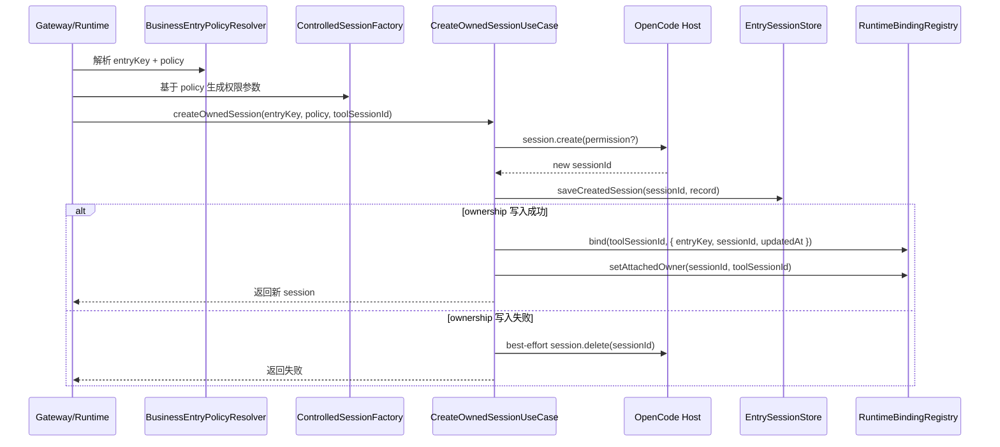
```mermaid
sequenceDiagram
  participant Gateway as Gateway/Runtime
  participant Policy as BusinessEntryPolicyResolver
  participant Factory as ControlledSessionFactory
  participant UseCase as CreateOwnedSessionUseCase
  participant Host as OpenCode Host
  participant Store as EntrySessionStore
  participant Binding as RuntimeBindingRegistry

  Gateway->>Policy: 解析 entryKey + policy
  Gateway->>Factory: 基于 policy 生成权限参数
  Gateway->>UseCase: createOwnedSession(entryKey, policy, toolSessionId)
  UseCase->>Host: session.create(permission?)
  Host-->>UseCase: new sessionId
  UseCase->>Store: saveCreatedSession(sessionId, record)
  alt ownership 写入成功
    UseCase->>Binding: bind(toolSessionId, { entryKey, sessionId, updatedAt })
    UseCase->>Binding: setAttachedOwner(sessionId, toolSessionId)
    UseCase-->>Gateway: 返回新 session
  else ownership 写入失败
    UseCase->>Host: best-effort session.delete(sessionId)
    UseCase-->>Gateway: 返回失败
  end
```

### 4.3.1 旧 `create_session` 的 `anchor-only` 兼容路径

当 `create_session` 无法形成合法 `entryKey` 时，兼容路径固定为：

1. runtime 本地生成一个新的 `toolSessionId`
2. 创建 `anchor-only runtime anchor`
3. 返回 `session_created`
4. 不调用宿主 `session.create`
5. 不写 ownership
6. 不建立 `toolSessionId -> host sessionId` binding

约束：

- runtime 生成的 `toolSessionId` 仅要求字符串形态与 OpenCode `sessionId` 兼容，不要求复用宿主的同一生成算法。
- 此时 `toolSessionId` 只承担 runtime conversation anchor 语义，不代表真实 host `sessionId`。
- 对旧客户端，`create_session` 成功仅表示 runtime conversation anchor 已创建。

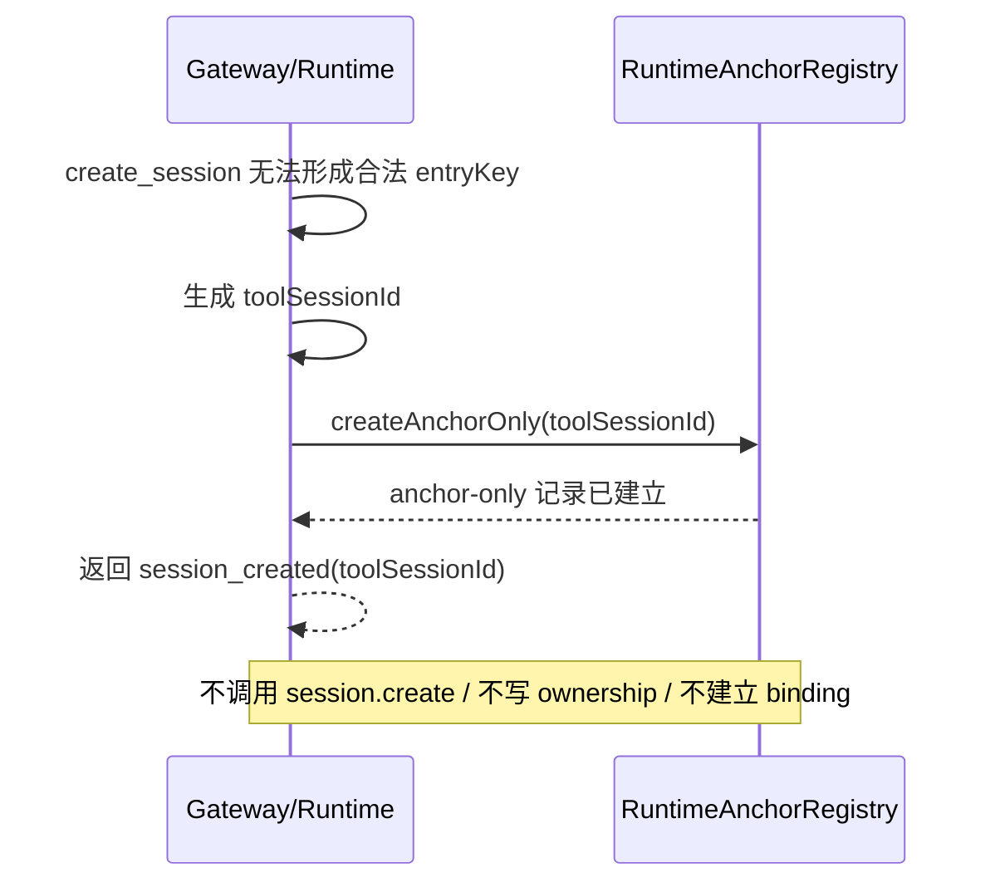
```mermaid
sequenceDiagram
  participant Gateway as Gateway/Runtime
  participant Anchor as RuntimeAnchorRegistry

  Gateway->>Gateway: create_session 无法形成合法 entryKey
  Gateway->>Gateway: 生成 toolSessionId
  Gateway->>Anchor: createAnchorOnly(toolSessionId)
  Anchor-->>Gateway: anchor-only 记录已建立
  Gateway-->>Gateway: 返回 session_created(toolSessionId)
  Note over Gateway,Anchor: 不调用 session.create / 不写 ownership / 不建立 binding
```

### 4.3.2 `anchor-only` 首次合法 `chat` 的第一次正式 bootstrap

旧 `create_session` 返回的 `toolSessionId` 后续收到首次合法 `chat` 时，不通过 `toolSessionId` 查找 host `sessionId`，而是按该次 `chat` 的合法 `entryKey` 执行标准 bootstrap。

固定流程：

1. 命中 `toolSessionId`
2. 识别当前 anchor 处于 `anchor-only` 状态
3. 解析本次 `chat` 的合法 `entryKey`
4. 计算 `visibleSessions(entryKey)`
5. 若存在可见候选，直接绑定该候选 host session
6. 若无可见候选，调用 `CreateOwnedSessionUseCase` 新建真实 host session
7. 成功后删除 `anchor-only` 状态，并建立正式 binding

失败边界：

- 若首次合法 `chat` 仍无法形成合法 `entryKey`，则 fail-closed
- 若能形成合法 `entryKey` 但复用/建会话失败，则该 anchor 保持 `anchor-only`
- 不允许产生半绑定状态

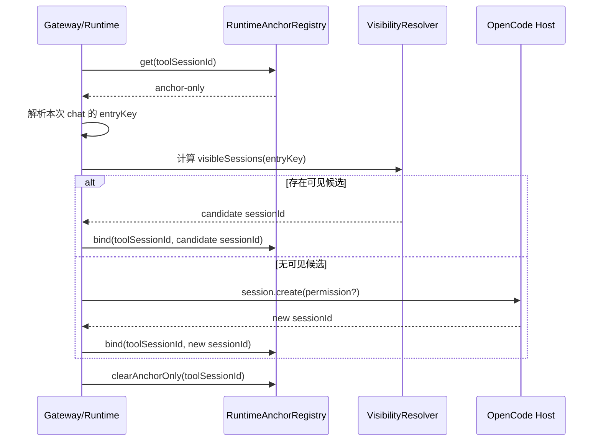
```mermaid
sequenceDiagram
  participant Gateway as Gateway/Runtime
  participant Anchor as RuntimeAnchorRegistry
  participant Visible as VisibilityResolver
  participant Host as OpenCode Host

  Gateway->>Anchor: get(toolSessionId)
  Anchor-->>Gateway: anchor-only
  Gateway->>Gateway: 解析本次 chat 的 entryKey
  Gateway->>Visible: 计算 visibleSessions(entryKey)
  alt 存在可见候选
    Visible-->>Gateway: candidate sessionId
    Gateway->>Anchor: bind(toolSessionId, candidate sessionId)
  else 无可见候选
    Gateway->>Host: session.create(permission?)
    Host-->>Gateway: new sessionId
    Gateway->>Anchor: bind(toolSessionId, new sessionId)
  end
  Gateway->>Anchor: clearAnchorOnly(toolSessionId)
```

### 4.4 普通消息 bootstrap - binding 有效直接复用

本节与下一节都只覆盖“普通消息路径”，对应上图中 `普通消息 -> bootstrap` 之后的局部展开。

普通消息 bootstrap 顺序固定为：

1. 解析/补全 `BusinessEntryKey`
2. 解析 `BusinessEntryPolicy`
3. 读取 `bindingsByToolSessionId[toolSessionId]`
4. 重算当前 `visibleSessions(entryKey)`
5. 若 binding 指向的 `sessionId` 仍存在且仍在可见集合中，则复用
6. 最后进入 prompt

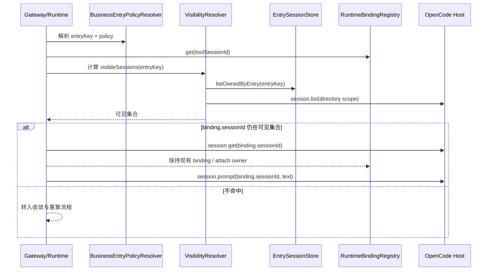
```mermaid
sequenceDiagram
  participant Gateway as Gateway/Runtime
  participant Policy as BusinessEntryPolicyResolver
  participant Visible as VisibilityResolver
  participant Store as EntrySessionStore
  participant Binding as RuntimeBindingRegistry
  participant Host as OpenCode Host

  Gateway->>Policy: 解析 entryKey + policy
  Gateway->>Binding: get(toolSessionId)
  Gateway->>Visible: 计算 visibleSessions(entryKey)
  Visible->>Store: listOwnedByEntry(entryKey)
  Visible->>Host: session.list(directory scope)
  Visible-->>Gateway: 可见集合
  alt binding.sessionId 仍在可见集合
    Gateway->>Host: session.get(binding.sessionId)
    Gateway-->>Binding: 保持现有 binding / attach owner
    Gateway->>Host: session.prompt(binding.sessionId, text)
  else 不命中
    Gateway-->>Gateway: 转入收敛与重算流程
  end
```

### 4.5 普通消息 bootstrap - binding 越界后收敛并重算

本节继续只覆盖“普通消息路径”，不涉及 slash 控制面。

当 binding 越界、宿主 session 不存在或不再可见时：

1. 清理旧 binding / attach owner
2. 重新计算 `visibleSessions(entryKey)`
3. 若候选非空，绑定宿主 `session.list` 返回列表中首个满足 `visibleSessions(entryKey)` 条件的会话
4. 若候选为空，走统一建会话入口

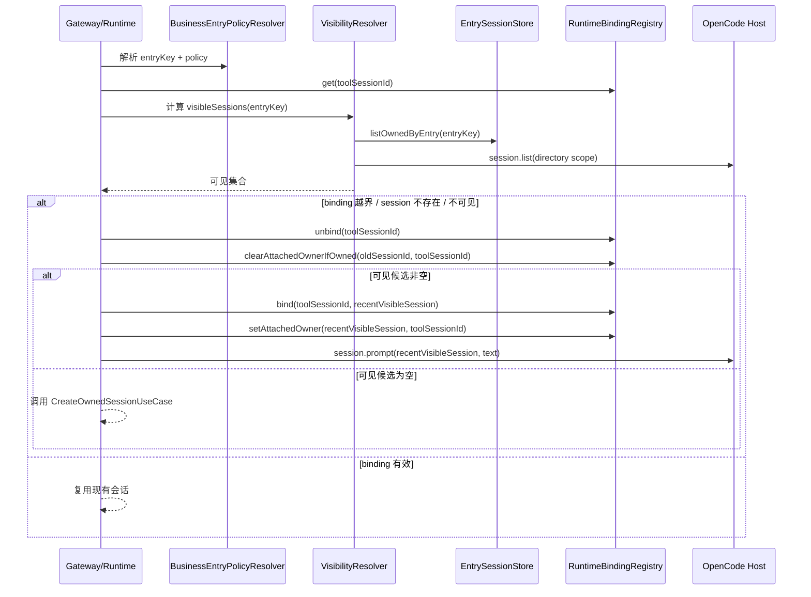
```mermaid
sequenceDiagram
  participant Gateway as Gateway/Runtime
  participant Policy as BusinessEntryPolicyResolver
  participant Visible as VisibilityResolver
  participant Store as EntrySessionStore
  participant Binding as RuntimeBindingRegistry
  participant Host as OpenCode Host

  Gateway->>Policy: 解析 entryKey + policy
  Gateway->>Binding: get(toolSessionId)
  Gateway->>Visible: 计算 visibleSessions(entryKey)
  Visible->>Store: listOwnedByEntry(entryKey)
  Visible->>Host: session.list(directory scope)
  Visible-->>Gateway: 可见集合
  alt binding 越界 / session 不存在 / 不可见
    Gateway->>Binding: unbind(toolSessionId)
    Gateway->>Binding: clearAttachedOwnerIfOwned(oldSessionId, toolSessionId)
    alt 可见候选非空
      Gateway->>Binding: bind(toolSessionId, recentVisibleSession)
      Gateway->>Binding: setAttachedOwner(recentVisibleSession, toolSessionId)
      Gateway->>Host: session.prompt(recentVisibleSession, text)
    else 可见候选为空
      Gateway-->>Gateway: 调用 CreateOwnedSessionUseCase
    end
  else binding 有效
    Gateway-->>Gateway: 复用现有会话
  end
```

### 4.6 新建会话 - ownership 落盘成功

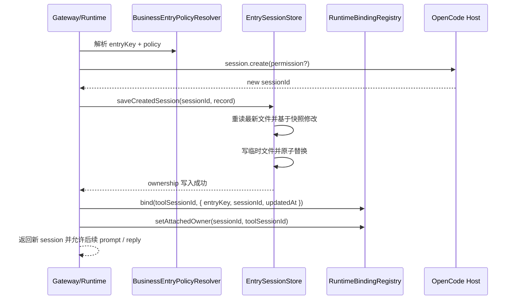
```mermaid
sequenceDiagram
  participant Gateway as Gateway/Runtime
  participant Policy as BusinessEntryPolicyResolver
  participant Store as EntrySessionStore
  participant Binding as RuntimeBindingRegistry
  participant Host as OpenCode Host

  Gateway->>Policy: 解析 entryKey + policy
  Gateway->>Host: session.create(permission?)
  Host-->>Gateway: new sessionId
  Gateway->>Store: saveCreatedSession(sessionId, record)
  Store->>Store: 重读最新文件并基于快照修改
  Store->>Store: 写临时文件并原子替换
  Store-->>Gateway: ownership 写入成功
  Gateway->>Binding: bind(toolSessionId, { entryKey, sessionId, updatedAt })
  Gateway->>Binding: setAttachedOwner(sessionId, toolSessionId)
  Gateway-->>Gateway: 返回新 session 并允许后续 prompt / reply
```

### 4.7 新建会话 - ownership 落盘失败补偿

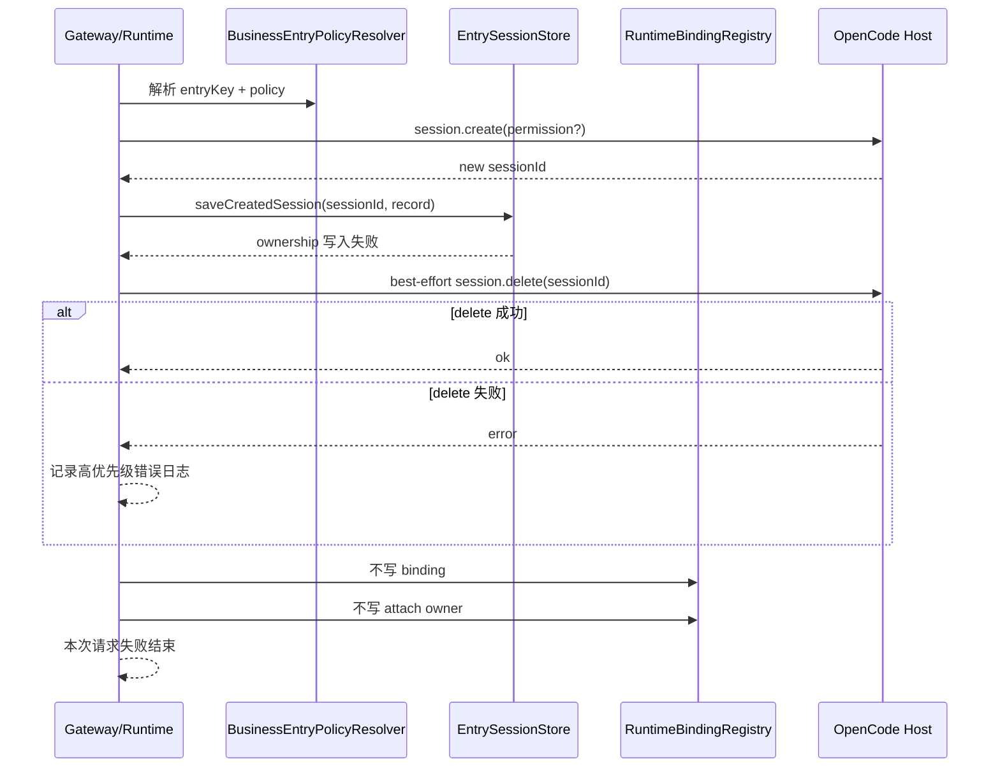
```mermaid
sequenceDiagram
  participant Gateway as Gateway/Runtime
  participant Policy as BusinessEntryPolicyResolver
  participant Store as EntrySessionStore
  participant Binding as RuntimeBindingRegistry
  participant Host as OpenCode Host

  Gateway->>Policy: 解析 entryKey + policy
  Gateway->>Host: session.create(permission?)
  Host-->>Gateway: new sessionId
  Gateway->>Store: saveCreatedSession(sessionId, record)
  Store-->>Gateway: ownership 写入失败
  Gateway->>Host: best-effort session.delete(sessionId)
  alt delete 成功
    Host-->>Gateway: ok
  else delete 失败
    Host-->>Gateway: error
    Gateway-->>Gateway: 记录高优先级错误日志
  end
  Gateway->>Binding: 不写 binding
  Gateway->>Binding: 不写 attach owner
  Gateway-->>Gateway: 本次请求失败结束
```

### 4.8 `/sessions` 与 `/session <sessionId>`

- `/sessions`、`/session <sessionId>`、普通消息 bootstrap 共用同一 `visibleSessions(entryKey)` 真源。
- `/sessions` 向用户展示的会话标识固定为 host `sessionId`。
- `/session <sessionId>` 的 `sessionId` 固定指 host `sessionId`。
- `/session <sessionId>` 只更新 runtime binding 和 attach owner，不修改 ownership。
- `/sessions`、`/session <sessionId>` 不暴露也不操作 `anchor-only runtime anchor`。
- 不允许切到：
  - 其他入口 owned 会话
  - 当前工作目录外会话
  - 当前策略不允许的 native 会话

### 4.9 `/session <sessionId>` 切换与 attach owner 转移

当 `toolSessionId` 从 `oldSessionId` 切换到 `newSessionId` 时：

1. 读取旧 binding
2. 若 `attachedOwnerBySessionId[oldSessionId] === toolSessionId`，先删除旧 owner
3. 更新 `bindingsByToolSessionId[toolSessionId]`
4. 写入 `attachedOwnerBySessionId[newSessionId] = toolSessionId`

这里的 owner 清理只针对“当前 `toolSessionId` 正从自己的旧 session 切到新 session”的切换路径；若是另一个 `toolSessionId` 复用同一 session，则 owner 转移由 `setAttachedOwner` 直接覆盖完成，不要求先显式清理前一个 owner。

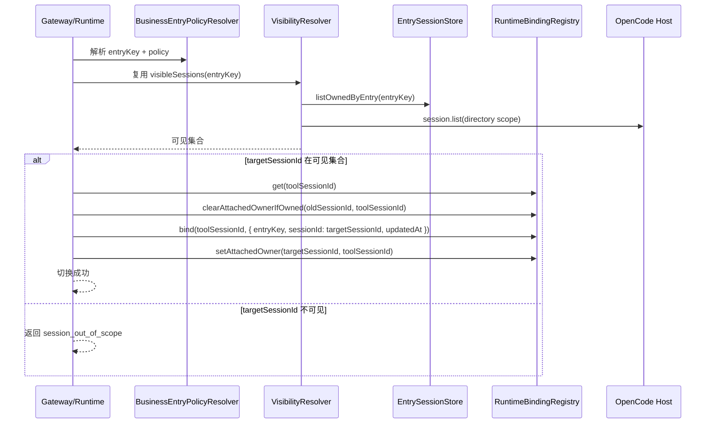
```mermaid
sequenceDiagram
  participant Gateway as Gateway/Runtime
  participant Policy as BusinessEntryPolicyResolver
  participant Visible as VisibilityResolver
  participant Store as EntrySessionStore
  participant Binding as RuntimeBindingRegistry
  participant Host as OpenCode Host

  Gateway->>Policy: 解析 entryKey + policy
  Gateway->>Visible: 复用 visibleSessions(entryKey)
  Visible->>Store: listOwnedByEntry(entryKey)
  Visible->>Host: session.list(directory scope)
  Visible-->>Gateway: 可见集合
  alt targetSessionId 在可见集合
    Gateway->>Binding: get(toolSessionId)
    Gateway->>Binding: clearAttachedOwnerIfOwned(oldSessionId, toolSessionId)
    Gateway->>Binding: bind(toolSessionId, { entryKey, sessionId: targetSessionId, updatedAt })
    Gateway->>Binding: setAttachedOwner(targetSessionId, toolSessionId)
    Gateway-->>Gateway: 切换成功
  else targetSessionId 不可见
    Gateway-->>Gateway: 返回 session_out_of_scope
  end
```

上图描述的是同一个 `toolSessionId` 主动切换目标 session。为避免它与“多个 `toolSessionId` 共享同一入口会话池”混淆，这里补一张专门对应 `7.2` 验收场景的时序图。该图只可视化已有规则，不引入正文之外的新语义。

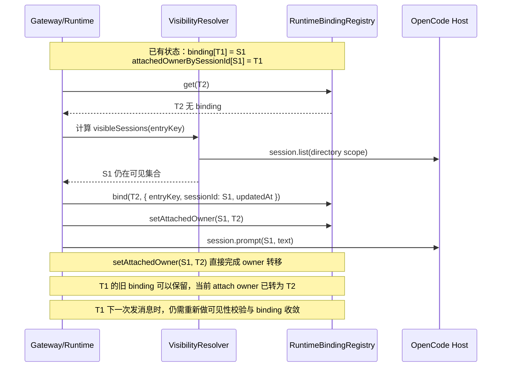
```mermaid
sequenceDiagram
  participant Gateway as Gateway/Runtime
  participant Visible as VisibilityResolver
  participant Binding as RuntimeBindingRegistry
  participant Host as OpenCode Host

  Note over Gateway,Binding: 已有状态：binding[T1] = S1<br/>attachedOwnerBySessionId[S1] = T1
  Gateway->>Binding: get(T2)
  Binding-->>Gateway: T2 无 binding
  Gateway->>Visible: 计算 visibleSessions(entryKey)
  Visible->>Host: session.list(directory scope)
  Visible-->>Gateway: S1 仍在可见集合
  Gateway->>Binding: bind(T2, { entryKey, sessionId: S1, updatedAt })
  Gateway->>Binding: setAttachedOwner(S1, T2)
  Gateway->>Host: session.prompt(S1, text)
  Note over Gateway,Binding: setAttachedOwner(S1, T2) 直接完成 owner 转移
  Note over Gateway,Binding: T1 的旧 binding 可以保留，当前 attach owner 已转为 T2
  Note over Gateway,Binding: T1 下一次发消息时，仍需重新做可见性校验与 binding 收敛
```

### 4.10 `close_session` 删除共享 session 的本地清理

当多个 `toolSessionId` 复用同一 host `sessionId` 时，`close_session(toolSessionId=T1)` 的语义固定为“删除 `T1` 当前绑定的 host session”，不是“仅解绑 T1”。

规则：

- `session.delete(S1)` 成功后，立即执行 `removeBindingsBySessionId(S1)`。
- 不保留“悬空 binding”状态。
- 其他原本指向 `S1` 的 `toolSessionId` 在下一次收到消息时，表现为“无 binding”，重新走可见性收敛或建会话流程。

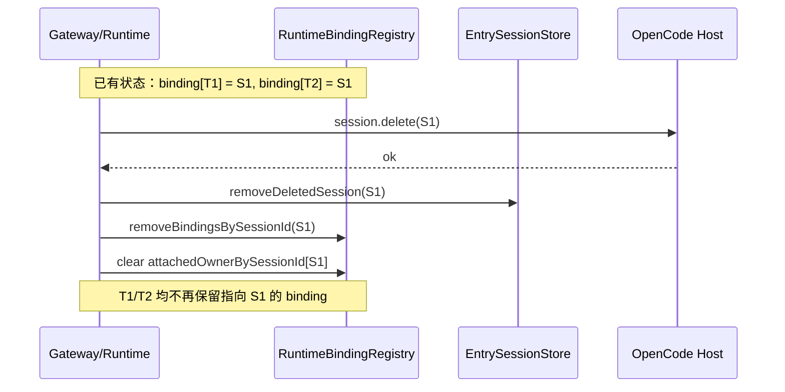
```mermaid
sequenceDiagram
  participant Gateway as Gateway/Runtime
  participant Binding as RuntimeBindingRegistry
  participant Store as EntrySessionStore
  participant Host as OpenCode Host

  Note over Gateway,Binding: 已有状态：binding[T1] = S1, binding[T2] = S1
  Gateway->>Host: session.delete(S1)
  Host-->>Gateway: ok
  Gateway->>Store: removeDeletedSession(S1)
  Gateway->>Binding: removeBindingsBySessionId(S1)
  Gateway->>Binding: clear attachedOwnerBySessionId[S1]
  Note over Gateway,Binding: T1/T2 均不再保留指向 S1 的 binding
```

### 4.11 `close_session` 成功后的立即清理与 `session.deleted` 幂等确认

统一删除生命周期事件真源固定为 OpenCode runtime `session.deleted` 事件；但对主动 `close_session`，本地在 `session.delete` 成功后先行执行同步清理。

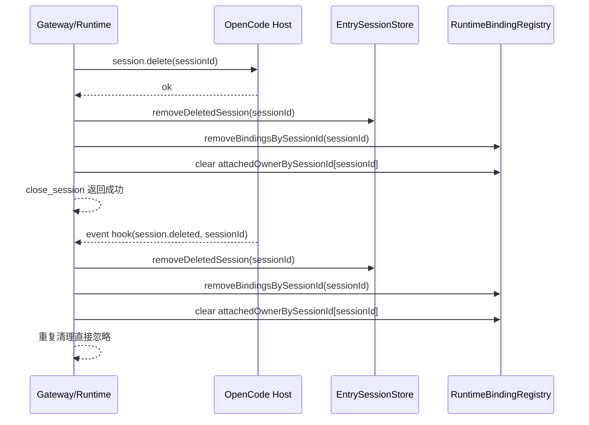
```mermaid
sequenceDiagram
  participant Gateway as Gateway/Runtime
  participant Host as OpenCode Host
  participant Store as EntrySessionStore
  participant Binding as RuntimeBindingRegistry

  Gateway->>Host: session.delete(sessionId)
  Host-->>Gateway: ok
  Gateway->>Store: removeDeletedSession(sessionId)
  Gateway->>Binding: removeBindingsBySessionId(sessionId)
  Gateway->>Binding: clear attachedOwnerBySessionId[sessionId]
  Gateway-->>Gateway: close_session 返回成功
  Host-->>Gateway: event hook(session.deleted, sessionId)
  Gateway->>Store: removeDeletedSession(sessionId)
  Gateway->>Binding: removeBindingsBySessionId(sessionId)
  Gateway->>Binding: clear attachedOwnerBySessionId[sessionId]
  Gateway-->>Gateway: 重复清理直接忽略
```

### 4.12 event hook 收到 session.deleted 后的同步清理

统一删除生命周期事件真源固定为 OpenCode runtime `session.deleted` 事件。

消费路径：

- 主路径：plugin `event` hook
- SSE `client.event.subscribe()` 只作附加观测，不作为删除生命周期真源

最小依赖字段：

```ts
event.properties.info.id
```

收到 `session.deleted` 后必须同步清理：

- `PersistedEntrySessionState.sessions[sessionId]`
- `attachedOwnerBySessionId[sessionId]`
- 所有指向该 `sessionId` 的 runtime bindings

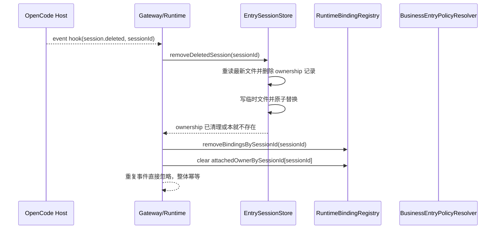
```mermaid
sequenceDiagram
  participant Host as OpenCode Host
  participant Gateway as Gateway/Runtime
  participant Store as EntrySessionStore
  participant Binding as RuntimeBindingRegistry
  participant Policy as BusinessEntryPolicyResolver

  Host-->>Gateway: event hook(session.deleted, sessionId)
  Gateway->>Store: removeDeletedSession(sessionId)
  Store->>Store: 重读最新文件并删除 ownership 记录
  Store->>Store: 写临时文件并原子替换
  Store-->>Gateway: ownership 已清理或本就不存在
  Gateway->>Binding: removeBindingsBySessionId(sessionId)
  Gateway->>Binding: clear attachedOwnerBySessionId[sessionId]
  Gateway-->>Gateway: 重复事件直接忽略，整体幂等
```

### 4.13 插件重启 - 基于 AK scope ownership 的恢复

- runtime binding 全量丢失
- ownership 保留
- anchor-only runtime anchor 全量丢失，且不恢复
- pending question / permission interaction 全量丢失，且不恢复
- 恢复时仅基于：
  - 当前 `AK scope` ownership
  - 当前工作目录 session 列表
  - 当前入口策略
  重算可见集合
- 不恢复旧 runtime binding 快照

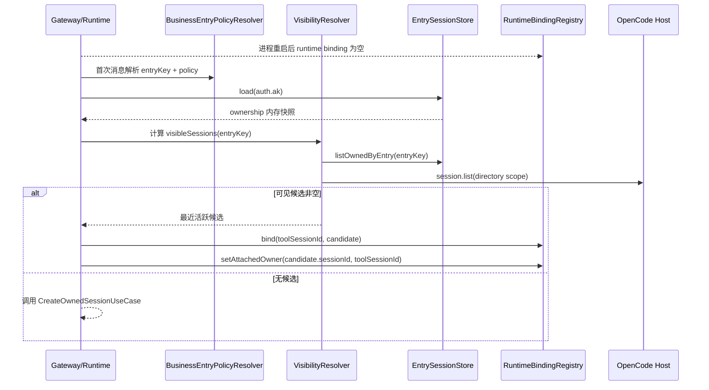
```mermaid
sequenceDiagram
  participant Gateway as Gateway/Runtime
  participant Policy as BusinessEntryPolicyResolver
  participant Visible as VisibilityResolver
  participant Store as EntrySessionStore
  participant Binding as RuntimeBindingRegistry
  participant Host as OpenCode Host

  Gateway-->>Binding: 进程重启后 runtime binding 为空
  Gateway->>Policy: 首次消息解析 entryKey + policy
  Gateway->>Store: load(auth.ak)
  Store-->>Gateway: ownership 内存快照
  Gateway->>Visible: 计算 visibleSessions(entryKey)
  Visible->>Store: listOwnedByEntry(entryKey)
  Visible->>Host: session.list(directory scope)
  alt 可见候选非空
    Visible-->>Gateway: 最近活跃候选
    Gateway->>Binding: bind(toolSessionId, candidate)
    Gateway->>Binding: setAttachedOwner(candidate.sessionId, toolSessionId)
  else 无候选
    Gateway-->>Gateway: 调用 CreateOwnedSessionUseCase
  end
```

### 4.14 ownership 文件整体损坏 - 告警后按空 ownership 继续运行

- 单条记录损坏、字段类型错误或结构错误时：
  - 跳过该条记录
  - 记录错误日志
- 整个文件不可解析时：
  - 记录高优先级错误日志
  - 继续按空 ownership 状态运行
- 若后续首次成功写回正式文件且原损坏文件仍存在：
  - 先对原损坏文件执行 best-effort 备份
  - 再执行“临时文件 + 原子替换”的正常写入
- 若备份失败：
  - 记录高优先级日志
  - 但不阻断新状态落盘
- 单条坏记录被跳过时：
  - 不单独备份
  - 下一次成功写回时，仅保留已通过校验并进入内存快照的记录

已知风险：

- 允许 native 的入口，可能误看到历史 `welink-entry-owned` 会话
- owned/native 分类在该异常态下不再可靠

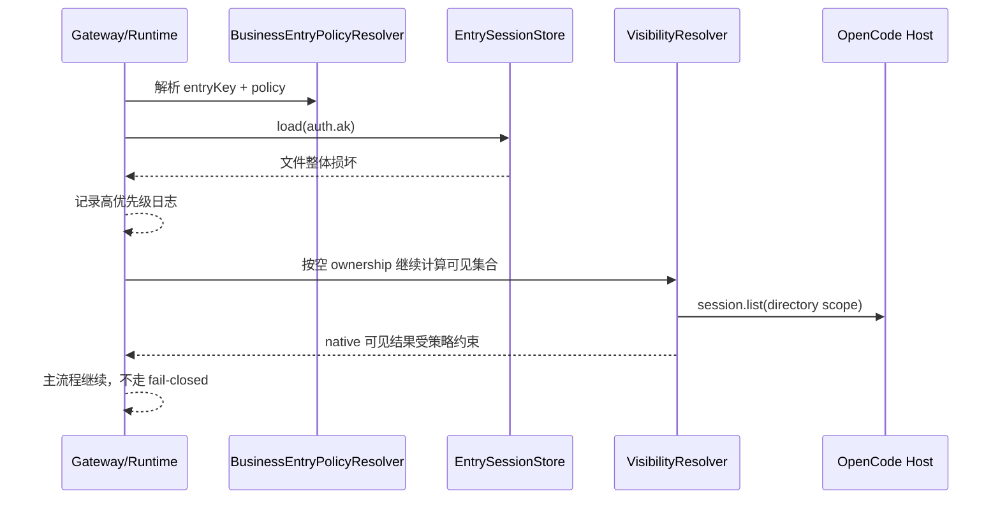
```mermaid
sequenceDiagram
  participant Gateway as Gateway/Runtime
  participant Policy as BusinessEntryPolicyResolver
  participant Store as EntrySessionStore
  participant Visible as VisibilityResolver
  participant Host as OpenCode Host

  Gateway->>Policy: 解析 entryKey + policy
  Gateway->>Store: load(auth.ak)
  Store-->>Gateway: 文件整体损坏
  Gateway-->>Gateway: 记录高优先级日志
  Gateway->>Visible: 按空 ownership 继续计算可见集合
  Visible->>Host: session.list(directory scope)
  Visible-->>Gateway: native 可见结果受策略约束
  Gateway-->>Gateway: 主流程继续，不走 fail-closed
```

## 5. 接口与实现改造

本章将“实现落点”和“公开接口变化”放在一起，避免读者在 Development View 与 Public Interface Changes 之间来回跳。

### 5.1 SDK 控制面职责边界

推荐拆成以下职责层：

- `business entry identity resolver`
  - 负责解析或补全：
    - `businessSessionDomain`
    - `businessSessionType`
    - `businessSessionId`
    - `entryKey`
- `business entry policy resolver`
  - 基于 `entryKey` 解析：
    - `controlled`
    - `allowOpencodeNativeSessions`
    - `allowedSlashCommands`
- `entry session store`
  - 持久化 `welink-entry-owned` ownership 真源
- `runtime binding registry`
  - 维护 process-local binding / attach owner 真源
  - 提供 `toolSessionId -> host sessionId` 强制可查映射
- `runtime anchor registry`
  - 维护 `anchor-only runtime anchor`
  - 提供 `createAnchorOnly / clearAnchorOnly / isAnchorOnly`
- `visibility resolver`
  - 基于工作目录、入口归属、native 暴露策略构造统一可见会话集
- `create-owned-session use case`
  - 作为 SDK 链路唯一合法的新建会话入口
- `command policy gate`
  - 基于入口策略决定 slash 命令是否允许执行
- `controlled session factory`
  - 基于 `controlled` 产出 `default` 或 `dialog_only` 权限画像
- `session lifecycle event handler`
  - 消费 `session.deleted` 并协调 ownership / binding 清理

### 5.2 SDK 控制面契约迁移

本方案包含 SDK 控制面契约迁移，不允许保留与最终语义冲突的旧控制面定义。

至少纳入迁移范围：

- entry 识别接口
- policy 接口
- visible session 解析接口
- create-owned-session 上下文接口
- slash gate
- binding / attach owner registry 接口
- anchor-only runtime anchor 接口
- run / reply runtime ownership 接口

必须明确替换的旧语义：

- 不能再用 `imGroupId` 作为正式隔离语义
- 不能再硬编码“群聊禁 `/sessions` `/session`”
- 不能再把 `listSessions()[0]` 视为默认复用候选
- `HostSessionCreateContext` 不能只承载 `assistantId / imGroupId`
- 不能再让 `title` 承载群聊/隔离语义

可以保留兼容层，但兼容层不得继续暴露上述旧规则为正式语义。

### 5.3 统一建会话入口

`CreateOwnedSessionUseCase` 是 SDK 链路唯一合法的新建会话入口。

`create_session`、`/new`、bootstrap 自动重建只允许通过该入口创建会话。

该入口的前置条件固定为：

- 当前请求已解析出合法 `BusinessEntryKey` 与 `BusinessEntryPolicy`
- 若前置条件不成立，则直接失败，不执行 `session.create`

任何新建路径都不得绕过：

- ownership 持久化
- binding 建立
- attach owner 建立
- ownership 落盘失败补偿

### 5.4 事件链路改造点

文档设计上必须显式覆盖以下 SDK 事件链路改造点：

- 事件类型定义纳入 `session.deleted`
- event extractor 能提取 `sessionId`
- raw session locator / routing 能将其路由到删除清理逻辑
- ownership store 支持删除
- runtime binding registry 支持按 `sessionId` 清理 binding 和 attach owner
- 重复 `session.deleted` 必须幂等

### 5.5 Public Interface Changes

落地前必须补齐或固定以下接口能力：

- `BusinessEntryPolicy`
  - `entryKey`
  - `controlled`
  - `allowOpencodeNativeSessions`
  - `allowedSlashCommands`
- `CreateSessionPayload`
  - `title?`
  - `assistantId?`
  - `extParameters?: ExtParameters`
- `CreateSessionUseCase`
  - 显式 `platformExtParam` 完整时进入正式建会话路径
  - 缺合法 `entryKey` 时允许创建 `anchor-only runtime anchor`
- `EntrySessionStore`
  - `load()`
  - `findBySessionId(sessionId)`
  - `listOwnedByEntry(entryKey)`
  - `saveCreatedSession(sessionId, record)`
  - `removeDeletedSession(sessionId)`
- `RuntimeAnchorRegistry`
  - `createAnchorOnly(toolSessionId)`
  - `isAnchorOnly(toolSessionId)`
  - `clearAnchorOnly(toolSessionId)`
  - `delete(toolSessionId)`
- `RuntimeBindingRegistry`
  - `get(toolSessionId)`
  - `bind(toolSessionId, record)`
  - `unbind(toolSessionId)`
  - `setAttachedOwner(sessionId, toolSessionId)`
  - `clearAttachedOwnerIfOwned(sessionId, toolSessionId)`
  - `removeBindingsBySessionId(sessionId)`
- `RequestRunRegistry` / pending interaction registry
  - 归属主键固定为 `toolSessionId`
  - 不允许以 host `sessionId` 作为 run 或 reply 恢复主键
- `CreateOwnedSessionUseCase`
  - 作为 SDK 链路唯一合法的新建会话入口
- 与 SDK 事件链路相关的协议接口需纳入 `session.deleted`

### 5.6 现有实现可复用 seam

以下现有能力可保留并复用：

- `directory` 的宿主侧下推
- `projectID / workspaceID / directory` 的基础 scope 过滤
- `/sessions` 与 `/session` 共用候选集合的控制面骨架
- synthetic reply / tool_done 发送链路
- 基于 `session.create.permission` 的权限下发能力

替换原则：

- 复用现有 SDK 控制面骨架
- 替换其“候选会话定义”和“入口策略定义”
- 不新增第二套并行控制面

## 6. 物理视图与运行约束

本章只回答“这些模型最终落在哪些物理边界上，以及运行时有哪些工程约束”。

### 6.1 部署实体

本方案至少涉及四类物理实体：

1. 上游业务侧
   - 负责下发或允许插件补全业务入口三元组
2. `message-bridge` SDK runtime
   - 负责入口识别、策略解析、归属持久化、binding 决策、slash 控制面、事件清理
3. OpenCode 运行实例
   - 负责提供当前启动目录下的 session 列表、session 创建、session 删除、session 权限
4. 插件本地持久化状态
   - 负责保存 AK scope 内的 `welink-entry-owned` ownership 真源

### 6.2 工作目录边界

本文所说“工作目录边界”，在 OpenCode 宿主层的直接落点是 `directory`。`worktree` 是更上层的项目根语义，`projectID` 是项目身份语义；当前通用 session 可见性讨论，不等同于 project 路由专用能力。

在此前提下，“当前 OpenCode 启动工作目录”是物理视图中的第一层边界：

- 不同 OpenCode 工作目录实例的 session 天然隔离
- 某入口即使历史上创建过会话，只要该会话不在当前工作目录视图内，就不得显示、不得切换、不得作为恢复候选
- 可见性规则总是在当前 OpenCode 实例之内成立，而不是对全局所有 session 成立

### 6.3 连接身份与 AK scope 边界

- `AK scope` 的唯一来源是当前 runtime 连接配置的 `auth.ak`
- ownership store 仅在连接身份可用后才能确定加载路径
- 同一个 runtime 实例只对应一个有效 `AK scope`
- 不允许从单次消息 payload 反查或派生另一个 `ak`
- ownership 文件不放在插件配置目录，也不放在工作目录相对路径下
- ownership 文件根目录固定为操作系统用户级数据目录下的 `message-bridge/sessions`
- `<ak-scope>` 固定为 `sha256(auth.ak)` 的小写十六进制字符串

### 6.4 写安全

首版最小写保护要求：

- 写入前重读最新 ownership 文件
- 在最新快照上修改
- 写入临时文件
- 原子替换正式文件
- 若源文件已被判定为整体损坏，则后续第一次成功写回前先执行 best-effort 备份

当前版本：

- 不强制引入跨进程文件锁
- 但也不把“同 AK 单连接”视为绝对无竞争证明

已知限制：

- 若同 AK 在重连切换或异常窗口中出现重叠 writer，仍存在剩余竞争风险

### 6.5 容量治理

- 容量治理按 `AK scope` 内的 `entryKey` 维度执行
- 不按全局总量执行
- 为每个 `entryKey` 配置独立阈值
- `session.deleted` 到达后的即时删除不属于容量治理动作
- 超过阈值时：
  - 当前版本仅记录容量告警
  - 不基于弱证据主动裁剪仍可能存在的 ownership 记录

## 7. 场景与验收

本章将代表性场景与测试验收清单放在一起，便于从“行为样例”直接落到“可验证条件”。

### 7.1 `im:group:*` 入口首次建会话

场景目标：

- 入口三元组最终解析为 `im:group:<imGroupId>`
- 当前工作目录内没有可见候选

预期：

- 当前入口使用 `BusinessEntryKey` 唯一标识
- 该入口本地模板默认 `controlled=true`
- 统一走 `CreateOwnedSessionUseCase`
- `controlled session factory` 负责下发 `dialog_only` deny list
- `EntrySessionStore` 负责落盘 ownership

### 7.2 新 `toolSessionId` 复用同一入口会话池

对应流程见 `4.9` 后“多个 `toolSessionId` 共享同一入口会话池”的专用时序图。

场景目标：

- 两个不同 `toolSessionId`
- 解析后都属于同一个 `entryKey`
- 当前工作目录内已有该入口可见会话 `S1`

预期：

- 两个 `toolSessionId` 各自独立
- 但共享同一个入口可见会话池
- 新 `toolSessionId` 缺 binding 时，必须先按 `entryKey` 过滤可见候选
- 可以复用 `S1`

### 7.2.1 `close_session` 删除共享 `S1`

场景目标：

- `T1` 与 `T2` 同时绑定到同一个 host `sessionId=S1`
- `T1` 执行 `close_session`

预期：

- `session.delete(S1)` 成功后立即删除 `S1` 的 ownership
- 立即清除 `attachedOwnerBySessionId[S1]`
- 立即执行 `removeBindingsBySessionId(S1)`，清理 `T1/T2` 全部相关 binding
- `T2` 下一次消息按“无 binding”路径重新收敛

### 7.2.2 旧 `create_session` 创建 `anchor-only runtime anchor`

场景目标：

- 旧客户端发起 `create_session`
- 请求中无法形成合法 `entryKey`

预期：

- runtime 本地生成 `toolSessionId`
- 创建 `anchor-only runtime anchor`
- 返回 `session_created(toolSessionId)`
- 不调用宿主 `session.create`
- 不写 ownership / binding

### 7.2.3 `anchor-only` 的首次合法 `chat`

场景目标：

- 已存在 `anchor-only runtime anchor`
- 后续 `chat` 可解析出合法 `entryKey`

预期：

- 不通过 `toolSessionId` 查找 host `sessionId`
- 按该次 `chat` 的 `entryKey` 正常执行 bootstrap
- 可复用现有可见 host session，或新建真实 host session
- 成功后才建立正式 binding，并清除 `anchor-only` 状态

### 7.3 `suppressReply` 快路径

场景目标：

- 当前消息 `suppressReply=true`
- 文本本身看起来像 slash 命令

预期：

- 在 slash parse 前短路
- 不进入 slash 白名单判定
- 不 bootstrap、不 prompt
- 不触发 OpenCode `session.create / session.prompt`

### 7.4 创建成功但 ownership 落盘失败

场景目标：

- `session.create` 成功
- `EntrySessionStore.saveCreatedSession()` 失败

预期：

- 本次请求不得继续使用该新会话
- 不更新 binding
- 不写 attach owner
- 尝试 best-effort 删除该 session
- 删除失败仅记录高优先级错误日志

### 7.5 `session.deleted` 同步清理

场景目标：

- OpenCode 通过 plugin `event` hook 推送 `session.deleted`

预期：

- ownership、binding、attach owner 同步清理
- 重复事件直接忽略
- 不依赖 SSE subscribe 作为删除真源

### 7.5.1 reply 类请求的重启失效

场景目标：

- 存在待回复 question 或 permission
- 插件重启后收到 `question_reply` 或 `permission_reply`

预期：

- 不恢复旧 pending interaction 映射
- 统一 fail-closed
- 返回“当前交互已失效，请刷新后重试”或等价文案

### 7.5.2 `anchor-only` 状态下的控制动作

场景目标：

- 当前 `toolSessionId` 处于 `anchor-only` 状态

预期：

- `close_session(toolSessionId)` 直接删除该 anchor，幂等成功
- `abort_session(toolSessionId)` 返回“无活跃 run”一类幂等失败
- `/sessions` 与 `/session <sessionId>` 不暴露该 anchor
- 当前版本不引入空闲超时自动回收
- `anchor-only` 仅在 `close_session`、首次合法 `chat` 成功 bootstrap、或进程重启时消失

### 7.6 验收清单

- 显式完整三元组优先，缺失时按补全规则生成正式 `entryKey`
- `chat.payload.extParameters` 与 `create_session.payload.extParameters` 使用同一 `ExtParameters` 契约
- `chat.payload.extParameters.platformExtParam.allowedSlashCommands` 允许请求级覆盖 slash 可用集合；`create_session` 上的同名字段不生效
- `allowedSlashCommands` 的 `undefined` / `null` / 非数组值不覆盖模板；数组非法项会被过滤；过滤后空数组 `[]` 视为显式禁用所有 slash
- 当前请求最终生效的 `allowedSlashCommands` = 本地模板与请求级有效值的交集
- `create_session.title` 不参与 `BusinessEntryKey` 解析
- 显式 `platformExtParam` 与历史字段冲突时，以显式字段为准
- `im:group:*` 使用 `imGroupId`，`im:direct:*` 使用 `${sendUserAccount}#${assistantAccount}`
- `im:skill:*` 不做历史补全
- 同一 `auth.ak` 下：
  - 父目录实例能识别子目录实例写下的 ownership
  - 但复用仍需通过当前工作目录过滤
- 不同 `auth.ak` 下：
  - ownership 文件完全隔离
  - 相同 `entryKey` 也不得互相可见或复用
- 显式完整 `platformExtParam` 的 `create_session`、`/new`、bootstrap 自动重建都调用同一建会话逻辑
- 新建路径统一执行 `session.create -> ownership -> binding -> attach owner`
- 旧 `create_session` 若无法解析出合法 `entryKey`，则创建 `anchor-only runtime anchor`，不执行 `session.create`
- `session_created` 对外仅返回 `toolSessionId`
- runtime 生成的 `toolSessionId` 在 `anchor-only` 阶段仅承担 runtime 路由语义，不代表真实 host `sessionId`
- `/sessions` 展示的切换标识为 host `sessionId`
- `/session <sessionId>` 按 host `sessionId` 切换 binding
- `/sessions` 与 `/session <sessionId>` 不暴露 `anchor-only runtime anchor`
- ownership 落盘失败时：
  - 请求失败
  - 不写 binding / attach owner
  - 尝试删除宿主 session
- binding 命中前必须重新过可见性校验；越界时先清理再重算
- `anchor-only` 状态下的首次合法 `chat` 按该次 `chat` 的 `entryKey` 执行正常 bootstrap，而不是通过 `toolSessionId` 查找 host session
- 首次真实 bootstrap 失败后，anchor 仍保持 `anchor-only`
- “最近活跃候选”取宿主 `session.list` 返回列表中首个满足当前 `visibleSessions(entryKey)` 条件的会话
- `/sessions`、`/session`、普通消息 bootstrap 共享同一 `visibleSessions(entryKey)` 真源
- `close_session` 成功后立即移除 ownership / attach owner / 所有指向该 host session 的 binding
- `T1` 删除共享 `S1` 后，`T2` 下一次消息按“无 binding”路径重新收敛
- request run 的正式归属锚点是 `toolSessionId`
- `abort_session(T1)` 不会中断 `T2` 的活跃 run
- `abort_session(anchor-only toolSessionId)` 返回“无活跃 run”一类幂等失败
- `question_reply` / `permission_reply` 在重启后因映射缺失统一 fail-closed
- `session.deleted` 到达时：
  - ownership、binding、attach owner 同步清理
  - 重复事件不报错
- ownership 文件整体损坏时：
  - 高优先级日志输出
  - 主流程继续
  - 允许 native 的入口误见历史 owned 的风险在测试说明中明确体现
  - 后续第一次成功写回前对原损坏文件执行 best-effort 备份
- 每个 `entryKey` 的 ownership 数量超过阈值时：
  - 记录告警
  - 不误删仍可能存在的记录

### 7.7 设计注意事项

- 不能把 OpenCode 宿主 scope 能力与插件补充过滤能力混写成同一个“工作目录过滤”概念。
- 若未来认为单靠 `directory` 不足以表达隔离边界，应优先评估 project 路由能力，而不是默认宿主已经按 `projectID` 或 `worktree` 做了通用 `session.list` 过滤。

## 8. 推荐结论

推荐将本方案作为 OpenCode SDK 链路的正式方案基线：

- 采用双层锚点模型：
  - `toolSessionId` 负责 runtime 路由
  - `entryKey` 负责 durable ownership
- 采用两层状态模型：
  - `PersistedEntrySessionState` 负责 AK scope 内的 durable ownership truth
  - `RuntimeBindingState` 负责进程内 binding / attach owner truth
- 采用 `auth.ak` 作为 `AK scope` 唯一来源，并在连接身份可用后按需懒加载 ownership
- 采用 `CreateOwnedSessionUseCase` 作为 SDK 链路唯一合法的新建会话入口
- 采用 `session.deleted` 作为 SDK 链路统一删除生命周期事件真源
- 采用 `visibleSessions(entryKey)` 作为 `/sessions`、`/session`、普通消息 bootstrap 的统一真源

这套设计能同时满足：

- 不同业务入口之间的会话隔离
- 同一 AK 下跨父子目录实例的 ownership 连续性
- OpenCode native 会话的受控暴露
- 受控入口 `dialog_only` 的安全边界
- 与现有 SDK 控制面骨架的兼容演进
