# Message Bridge Slash Commands 方案设计

**Version:** 2.2  
**Date:** 2026-05-14  
**Status:** Draft  
**Owner:** agent-plugin maintainers  
**Related:** `../specs/2026-05-08-message-bridge-slash-commands-requirements.md`, `integration/opencode/docs/architecture/07-command.md`, `integration/openclaw/docs/learn/slash-commands-tui-perspective.md`

## 1. 设计前提

本方案采用以下前提，作为后续所有设计讨论的基础：

1. 服务端不再管理 `welinkSessionId` 与宿主内部会话标识之间的映射关系。
2. 服务端不再关注宿主会话的创建、选择、切换逻辑。
3. 插件与服务端之间的桥接消息统一只使用 `welinkSessionId` 作为唯一会话标识。
4. slash command 面向用户暴露的 `sessionId` 只作为宿主会话选择标识，不进入插件与服务端之间的桥接协议。
5. 插件独立负责宿主会话创建、当前宿主会话选择、当前宿主会话切换与模型覆盖控制。

本方案中的三层标识关系如下：

- `welinkSessionId`
  - 插件与服务端之间唯一业务会话标识
- `sessionId`
  - slash command 返回结果与 `/session <sessionId>` 参数中使用的宿主会话选择标识
- `opencodeSessionId` / `sessionKey`
  - 宿主内部具体会话标识

其中：

- OpenCode 中，`sessionId` 对应 `opencodeSessionId`
- OpenClaw 中，`sessionId` 对应 `sessionKey`

## 2. 结论摘要

本需求不能简单理解为“两个插件都加一个 slash parser”。

在新前提下，五个命令统一落到插件控制面：
1. **会话控制类**
   - `/new`
   - `/sessions`
   - `/session <sessionId>`
2. **模型控制类**
   - `/models`
   - `/model <providerId/modelId>`

推荐职责划分如下：

- `/new`
  - 由插件创建新宿主会话，并覆盖当前 `welinkSessionId` 的宿主会话绑定
- `/sessions`
  - 由插件返回当前宿主作用域下可显式切换的会话目录
- `/session <sessionId>`
  - 由插件执行显式会话切换
- `/models`
  - 由插件读取宿主模型目录
- `/model <providerId/modelId>`
  - 由插件为当前会话写入后续请求模型覆盖

这意味着最终方案是：

- 服务端只持有 `welinkSessionId` 这一层业务标识
- 插件向用户返回 `sessionId` 作为宿主会话选择标识
- 插件独占宿主会话绑定与模型覆盖控制
- ai-gateway 继续承载桥接传输，但不再参与宿主内部会话映射与切换
- 当前设计与修订后的 requirements 文档保持一致，统一采用“复数命令列目录、单数命令做切换/设置”的外部命令面

### 2.1 群聊命令能力收敛

当前实现对群聊场景额外收口如下：

- 群聊允许：`/new`、`/models`、`/model <providerId/modelId>`
- 群聊禁用：`/sessions`、`/session <sessionId>`
- 命中禁用命令时，插件返回统一 synthetic assistant failure reply，不回退普通 chat，不发送 `tool_error`

这样做的目的不是改变 slash command 语法集合，而是避免群聊场景显式枚举或切换宿主会话，绕开当前会话隔离和权限约束。

## 3. In Scope

- 梳理 `message-bridge` 与 `message-bridge-openclaw` 在新前提下如何承接五个 slash commands
- 明确 OpenCode / OpenClaw 各自依赖的宿主能力
- 明确与 `ai-gateway`、`skill-server` 的职责边界
- 定义会话与模型控制的统一外部语义

## 4. Out of Scope

- 不在本轮统一 miniapp / IM 的最终 UI 呈现
- 不在本轮扩展更多 slash commands
- 不在本轮重构 OpenCode / OpenClaw 原生 TUI 命令体系
- 不在本轮定义具体实现文件、类名或代码改动清单

## 5. External Dependencies

- `integration/opencode-cui/skill-server`
  - 需要接受“服务端不再管理宿主内部会话映射”的边界调整
- `integration/opencode-cui/ai-gateway`
  - 需要接受插件与服务端之间仅使用 `welinkSessionId` 的消息语义
- `skill-server / miniapp UI`
  - 需要保留插件返回文本中的换行边界
  - 若支持 Markdown，则按简单 Markdown 渲染；若不支持，至少按换行拆段展示

## 6. 统一职责拆分

| 命令 | 主责任方 | 语义 |
| --- | --- | --- |
| `/new` | 插件 | 创建新的宿主会话，并切换当前 `welinkSessionId` 的活动会话 |
| `/sessions` | 插件 | 返回当前宿主作用域下可显式切换会话目录 |
| `/session <sessionId>` | 插件 | 将当前活动宿主会话切到目标 `sessionId` 对应的宿主会话 |
| `/models` | 插件 | 返回宿主模型目录 |
| `/model <provider/model>` | 插件 | 写入当前会话的后续请求模型覆盖 |

服务端只承担两件事：

- 把用户文本转发给插件
- 展示插件返回的结果文本与错误

## 7. 通用交互边界

### 7.1 统一入口

v1 中所有 slash command 必须复用现有 `invoke.chat` 下行入口：

1. 上游仍发送 `invoke.chat`
2. runtime 先判定 `invoke.chat.suppressReply`；当 `suppressReply === true` 时，必须直接短路为统一群聊拒答分支，本次请求不得进入 slash parser、slash control-plane 或宿主 LLM
3. 仅当 `suppressReply` 缺失或为 `false` 时，插件才在进入宿主对话 runtime 之前识别 slash command，并显式拿到“是否群聊”上下文
4. 命中控制命令后，不再把原始文本送给宿主 LLM
5. 插件直接执行控制逻辑
6. 插件通过现有 assistant synthetic reply 事件序列与 `tool_done` 返回成功结果；失败结果只走 assistant synthetic reply 文本

这里需要明确优先级关系：

- `suppressReply` 是服务端下发的一手回复许可，优先级高于 slash command 识别与执行
- slash command 复用 `invoke.chat` 入口，但不享有绕过禁回的特权
- 当 `suppressReply === true` 且文本形态看起来像 `/sessions` 或 `@bot /sessions` 时，返回的仍是统一群聊拒答文案，而不是 slash command 成功/失败文案

采用该约束的原因：

- 不需要第一阶段扩展新的 gateway action
- slash command 的对外体验保持统一
- 服务端无须理解宿主内部控制语义

### 7.1.1 Slash 识别与群聊前缀规则

当前版本的 slash parser 必须输出三态结果：

- `matched`
  - 已成功解析成控制面命令
- `invalid`
  - 已识别为已知 slash 命令，但参数形态不合法
- `none`
  - 不是 slash 控制面命令，继续走普通 chat / LLM

v1 当前收口的已知命令仅包括：

- `/new`
- `/sessions`
- `/session <sessionId>`
- `/models`
- `/model <providerId/modelId>`

判定规则如下：

- `/sessions fdsfs`、`/new foo`、`/session`、`/model`、`/model openai`、`/model a/b/c` 统一返回 `invalid`
- 未知 slash 文本如 `/abc` 返回 `none`，继续交给普通 chat 路径
- 群聊中的 `@bot /sessions`、`@bot /sessions fdsfs` 仅在明确群聊时才允许先剥离 mention 再做 slash 判定

对已识别但参数非法的已知命令，v1 用户可见失败文案必须返回命令专属用法提示，而不是泛化成“命令不受支持”。

对已识别且语法合法、但当前场景不允许执行的命令，v1 用户可见失败文案必须返回场景级限制提示；当前仅群聊下的 `/sessions`、`/session <sessionId>` 适用该规则。

本节的群聊 slash 规则只在“请求已获准继续处理”前提下成立。若上游在同一条 `invoke.chat` 上显式下发 `suppressReply=true`，runtime 必须先走群聊拒答短路，既不做 mention 剥离，也不做 slash 三态判定。

群聊信号必须显式进入 parser 输入，不能靠隐式字段猜测。当前 `message-bridge` 已稳定拿到的唯一群聊信号是 `invoke.chat.payload.imGroupId`；因此 v1 方案将“`imGroupId` 为非空字符串”定义为唯一群聊判定条件。若后续上游引入 `sessionType=group` 等更正式信号，必须先改造路由入口，再调整本节规则。

需要强调的是，`imGroupId` 只用于“允许继续处理时”的群聊 slash 识别与 mention 剥离，不是回复许可信号，也不能覆盖或绕过服务端下发的 `suppressReply`。

mention 剥离规则保持最小化：

- 先对原文做 trim
- 仅当 `isGroupChat=true` 时，若文本以 `@<非空白内容><空白>` 开头，则剥离这一个前缀
- 再基于剩余文本做 slash 三态判定

### 7.2 服务端职责收缩

skill-server / miniapp 不再需要承担：

- `toolSessionId` 持久化绑定
- 会话创建完成后的回写
- 会话目录查询
- 会话切换控制

skill-server / miniapp 只需要继续做：

- 以 `welinkSessionId` 作为唯一业务会话标识
- 把用户文本转发给插件
- 展示插件返回的结果文本与错误

本方案相对当前基线的核心变化不是“新增 slash command”，而是“重划会话控制平面”。

### 7.2.1 Reply 类交互约束

`question_reply` 与 `permission_reply` 不属于“当前会话上下文类请求”，不参与 slash command 的当前会话路由。

两类回复统一遵循以下规则：

- `question_reply` 使用 `questionId`
- `permission_reply` 使用 `permissionId`
- 二者都不依赖 `toolSessionId`
- slash command 的会话切换不得改变已挂起交互的回复命中
- 已挂起交互的回复闭环继续按宿主交互 ID 命中宿主 reply API

需要明确：

- 这条语义会带来后续代码与 schema 的同步调整
- 当前设计稿先定义目标语义，不要求本轮同时展开所有协议演进细节

### 7.3 Slash Command 上行回复约束

v1 不新增 gateway action，统一复用现有 `chat` 下行入口。slash command 的回复必须兼容 `origin/main` 现有“回复助手消息”展示链路，不引入 slash command 专属渲染分支。

当 `invoke.chat.suppressReply === true` 时，本节 slash command 回包约束不生效；runtime 必须直接返回群聊拒答分支定义的统一 synthetic assistant reply 与单次 `tool_done`。即使原始文本命中了 slash command 文法，也不得返回 slash command 自身的成功文案、失败文案或用法提示。

- 成功场景
  - 插件必须发送一组 assistant synthetic reply `tool_event`
  - 该序列的文本 part 即 slash command 返回给用户的正文
  - 插件随后发送 `tool_done`，表示本次控制命令完成
- 失败场景
  - 插件必须发送一组 assistant synthetic reply `tool_event`
  - 该序列的文本 part 即返回给用户的失败文案
  - 插件不得发送 `tool_error`
  - 插件不得补发额外 `tool_done`
- 服务端行为
  - 服务端继续复用现有助手消息展示逻辑
  - 服务端不对 slash command 增加新的消息类型判断或专属回复动作

### 7.4 Slash Command 返回文本格式
v1 中所有 slash command 继续通过 synthetic assistant reply 文本返回结果；成功场景额外发送 `tool_done`，失败场景不发送 `tool_error`。返回体采用简单 Markdown 约定组织，用于承载段落、换行、无序列表和行内代码样式，但不引入 Markdown 表格、HTML、复杂嵌套结构或额外结构化协议字段。为降低服务端渲染复杂度并保证 OpenCode / OpenClaw 行为一致，返回文本必须遵循以下统一格式约束：

1. 返回文本使用 `\n` 作为换行分隔符；服务端与前端必须保留这些换行边界，末尾是否带额外 `\n` 不作为协议要求。
2. 第一行必须是结果摘要，直接说明命令结果。
3. 列表型返回从第二行开始使用无序列表逐行列项，不嵌套层级。
4. 错误返回直接说明失败原因与下一步动作，不暴露宿主内部异常栈。
5. 同一命令在 OpenCode / OpenClaw 侧必须保持同构文案；若宿主差异导致字段名不同，仅允许替换宿主字段名。
6. 本节定义的成功模板、失败模板、列表格式与固定错误文案属于 v1 返回契约，后续实现、联调与测试均以本节为验收基线。
7. `sessionId`、`title`、`providerId/modelId` 等动态字段默认允许出现在 Markdown 文本中；若字段包含反引号、换行或会破坏列表结构的特殊字符，插件必须做最小转义，无法安全转义时降级为普通纯文本显示，不使用行内代码样式。

必须遵循的文本模板如下。

**`/new`**

成功：

```text
已切换到新会话 <sessionId> <title>
```

失败：

```text
新建会话失败 <reason>
```

当命令参数非法时，建议使用：

```text
新建会话失败 请直接使用 /new
```

**`/sessions`**

成功：

```md
可切换会话列表

- `<sessionId>` <title>（当前）
- `<sessionId>` <title>
```

约束：

- 当前激活会话使用显式文案 `（当前）`
- 每行至少包含宿主会话 ID
- `title` 缺失时可省略，不强造占位文案

失败：

```text
查询会话列表失败, <reason>
```

当命令参数非法时，建议使用：

```text
查询会话列表失败, 请直接使用 /sessions
```

**`/session <sessionId>`**

成功：

```text
已切换会话 <sessionId> <title>
```

失败：

```text
切换会话失败, <reason>
```

若目标会话不在当前显式可切换范围内，必须使用固定原因文案：

```text
切换会话失败, 目标会话不在当前 project/workspace 可切换范围内
```

当命令参数非法时，建议使用：

```text
切换会话失败, 请使用 /session <sessionId>，例如 /session ses_123
```

**`/models`**

成功：

```md
可用模型列表

- `<providerId>/<modelId>`
- `<providerId>/<modelId>`
```

约束：

- v1 不返回“当前正在使用的模型”
- 可按 provider 分组输出，但仍保持逐行纯文本
- 若宿主存在默认模型信息，可在摘要后补一行 `default: <providerId>/<modelId>`

失败：

```text
查询模型列表失败, <reason>
```

当命令参数非法时，建议使用：

```text
查询模型列表失败, 请直接使用 /models
```

**`/model <providerId/modelId>`**

成功：

```text
后续请求将使用该模型 <providerId>/<modelId>
```

失败：

```text
设置模型失败,<reason>
```

若模型不存在，建议使用固定原因文案：

```text
设置模型失败,目标模型不存在或当前宿主不可用
```

当命令参数非法时，建议使用：

```text
设置模型失败,请使用 /model <providerId/modelId>，例如 /model openai/gpt-5.4
```

以上格式是 v1 设计约束，不代表最终 UI 呈现。前端若支持 Markdown，应至少正确支持换行、无序列表和行内代码样式；若不支持 Markdown renderer，最低要求是按原始换行拆段展示，不得压平为单行。后续若服务端需要 richer rendering，应在保持上述文本兼容的前提下再扩展结构化字段。

## 8. OpenCode 实现

### 8.1 当前现状约束

OpenCode 当前已具备基础会话调用能力、会话目录能力与模型目录能力，但 slash command 方案仍受以下事实约束：

1. `session.list` 返回的是当前 `project` 范围内会话；若存在 `workspaceID`，则进一步限于当前 `workspace`。
2. `session.get()` 返回的 `Session.Info` 不包含模型字段。
3. 稳定的模型设置入口是 `session.prompt(..., model)` 与 `session.command(..., model)`，而不是 session 级 patch。
4. OpenCode 重启后，插件当前运行期内维护的绑定关系不会自动恢复。

### 8.2 依赖的宿主能力
OpenCode 侧本方案依赖以下能力：

- 宿主会话创建能力
- 宿主会话读取能力
- 会话目录读取能力
- 模型目录读取能力
- 普通对话发送能力

其中：

- `session.list` 返回的是当前 `project` 范围内会话；若存在 `workspaceID`，则进一步限于当前 `workspace`
- `session.get()` 返回的 `Session.Info` 不包含模型字段
- 本方案不依赖 OpenCode 宿主原生 slash command 执行入口；slash command 由 bridge 插件在 chat 入口前置识别并处理
### 8.3 OpenCode API 出入参

本节只列 bridge 实现最小依赖字段，不要求与 OpenCode 宿主全量 SDK schema 一一对齐。

#### `session.create`

**入参**

| 字段 | 类型 | 必填 | 含义 |
| --- | --- | --- | --- |
| `title` | `string` | 否 | 新建会话标题 |
| `parentID` | `string` | 否 | 父会话 ID，用于 fork 或子会话场景 |
| `directory` | `string` | 否 | 当前工作目录，用于让宿主在指定目录上下文创建会话 |

**出参**

| 字段 | 类型 | 含义 |
| --- | --- | --- |
| `id` | `string` | 宿主会话 ID，即 `opencodeSessionId` |
| `slug` | `string` | 宿主会话 slug |
| `projectID` | `string` | 宿主识别出的 project ID |
| `workspaceID` | `string` | 当前 workspace ID；无 workspace 时可缺省 |
| `directory` | `string` | 会话所属目录 |
| `parentID` | `string` | 父会话 ID；无父会话时可缺省 |
| `title` | `string` | 会话标题 |
| `version` | `string` | 宿主版本 |
| `time.created` | `number` | 会话创建时间戳 |
| `time.updated` | `number` | 会话最近更新时间戳 |
| `time.archived` | `number` | 会话归档时间；未归档时可缺省 |

#### `session.list`

**入参**

| 字段 | 类型 | 必填 | 含义 |
| --- | --- | --- | --- |
| `directory` | `string` | 否 | 按目录过滤会话 |
| `roots` | `boolean` | 否 | 是否只返回根会话 |
| `start` | `number` | 否 | 仅返回更新时间大于等于该时间戳的会话 |
| `search` | `string` | 否 | 按标题模糊过滤 |
| `limit` | `number` | 否 | 返回数量上限 |

**出参**

| 字段 | 类型 | 含义 |
| --- | --- | --- |
| `[]` | `SessionInfo[]` | 当前 `project/workspace` 范围内的会话列表 |
| `[].id` | `string` | 宿主会话 ID |
| `[].title` | `string` | 会话标题 |
| `[].projectID` | `string` | 会话所属 project |
| `[].workspaceID` | `string` | 会话所属 workspace；无 workspace 时可缺省 |
| `[].directory` | `string` | 会话所属目录 |
| `[].time.updated` | `number` | 最近更新时间戳 |

设计约束：`session.list` 返回范围受当前 `project/workspace` 约束，v1 不使用 `experimental.session.list`。

#### `session.get`

**入参**

| 字段 | 类型 | 必填 | 含义 |
| --- | --- | --- | --- |
| `sessionID` | `string` | 是 | 目标宿主会话 ID |

**出参**

| 字段 | 类型 | 含义 |
| --- | --- | --- |
| `id` | `string` | 宿主会话 ID |
| `title` | `string` | 会话标题 |
| `projectID` | `string` | 所属 project |
| `workspaceID` | `string` | 所属 workspace；无 workspace 时可缺省 |
| `directory` | `string` | 会话所属目录 |
| `time` | `object` | 会话时间信息 |

设计约束：`session.get()` 返回的 `SessionInfo` 中不包含模型字段，因此不能直接用于 `/models` 展示“当前正在使用的模型”。

#### `config.providers`

**入参**

| 字段 | 类型 | 必填 | 含义 |
| --- | --- | --- | --- |
| 无 | - | - | 无额外业务入参 |

**出参**

| 字段 | 类型 | 含义 |
| --- | --- | --- |
| `providers` | `ProviderInfo[]` | provider 及其模型目录 |
| `providers[].id` | `string` | provider ID |
| `providers[].name` | `string` | provider 展示名称；缺省时使用 `id` |
| `providers[].models` | `Record<string, ModelInfo>` | 该 provider 下的模型集合 |
| `providers[].models[*].id` | `string` | 模型 ID |
| `providers[].models[*].name` | `string` | 模型展示名称；缺省时使用 `id` |
| `providers[].models[*].variants` | `Record<string, unknown>` | 模型 variants；无时可缺省 |
| `providers[].models[*].capabilities.reasoning` | `boolean` | 是否支持 reasoning；无时可缺省 |
| `default` | `Record<string, string>` | 每个 provider 的默认模型映射 |

#### `provider.list`

**入参**

| 字段 | 类型 | 必填 | 含义 |
| --- | --- | --- | --- |
| 无 | - | - | 无额外业务入参 |

**出参**

| 字段 | 类型 | 含义 |
| --- | --- | --- |
| `all` | `ProviderInfo[]` | 宿主全量 provider 列表 |
| `default` | `Record<string, string>` | provider 默认模型映射；无时可缺省 |
| `connected` | `string[]` | 当前已连接 provider ID 列表；无时可缺省 |

设计约束：`config.providers` 作为 `/models` 主数据源，`provider.list` 仅用于补充展示信息。

#### `session.prompt`

**入参**

| 字段 | 类型 | 必填 | 含义 |
| --- | --- | --- | --- |
| `sessionID` | `string` | 是 | 目标宿主会话 ID |
| `messageID` | `string` | 否 | 本次消息 ID |
| `agent` | `string` | 否 | 宿主 agent 名称 |
| `model.providerID` | `string` | 否 | 显式指定模型的 provider ID |
| `model.modelID` | `string` | 否 | 显式指定模型的 model ID |
| `noReply` | `boolean` | 否 | 是否只注入上下文、不触发 AI 回复 |
| `system` | `string` | 否 | 附加 system prompt |
| `variant` | `string` | 否 | 模型 variant |
| `parts` | `Array<{ type: "text"; text: string }>` | 是 | 本次发送的消息内容 |

**出参**

| 字段 | 类型 | 含义 |
| --- | --- | --- |
| `info.id` | `string` | 返回消息 ID |
| `info.sessionID` | `string` | 会话 ID |
| `info.role` | `string` | 消息角色 |
| `info.model.providerID` | `string` | 实际记录的 provider ID；无时可缺省 |
| `info.model.modelID` | `string` | 实际记录的 model ID；无时可缺省 |
| `parts` | `unknown[]` | 返回消息 parts |

设计约束：OpenCode v1 的模型覆盖通过后续 `session.prompt` 显式传入 `model` 生效，不通过 `session.update` 修改会话属性。

#### `session.command`

**入参**

| 字段 | 类型 | 必填 | 含义 |
| --- | --- | --- | --- |
| `sessionID` | `string` | 是 | 目标宿主会话 ID |
| `messageID` | `string` | 否 | 本次命令消息 ID |
| `agent` | `string` | 否 | 宿主 agent 名称 |
| `model` | `string` | 否 | 显式指定模型，格式为 `providerId/modelId` |
| `command` | `string` | 是 | 宿主命令名 |
| `arguments` | `string` | 否 | 宿主命令参数 |

**出参**

| 字段 | 类型 | 含义 |
| --- | --- | --- |
| `info.id` | `string` | 返回消息 ID |
| `info.sessionID` | `string` | 会话 ID |
| `info.role` | `string` | 消息角色 |
| `parts` | `unknown[]` | 返回消息 parts |

设计约束：bridge v1 不依赖 `session.command` 承载 `/new`、`/sessions`、`/models` 主语义，但该接口仍构成 OpenCode 原生命令体系背景能力。

### 8.4 会话模型与运行期边界

在 OpenCode 场景下，插件只维护两层会话标识：

- 对外协议使用 `welinkSessionId`
- 插件内部使用 `opencodeSessionId`

并遵循以下规则：
1. 用户未指定会话时，普通 chat 使用当前绑定会话；若当前无绑定，则创建新会话并建立绑定。
2. `/session <opencodeSessionId>` 与 `/new` 都属于显式更新当前 `welinkSessionId` 绑定目标的控制命令。
3. 后执行的控制命令覆盖先执行的绑定结果。
4. 不维护 `welinkSessionId -> opencodeSessionId[]` 集合。

### 8.5 当前局限性 / 非目标

在 OpenCode 场景下，以下状态仅在当前 OpenCode 运行期内有效：

- `welinkSessionId -> opencodeSessionId` 当前绑定关系
- `/new` 创建后的当前绑定结果
- `/session <id>` 切换后的当前绑定结果

同时明确：

- OpenCode 重启后，不保证恢复上述绑定关系
- 重启后重新回到“用户未指定 sessionId”的默认逻辑：优先复用 `session.list` 返回的最近活跃会话；列表为空时再创建新会话
- 这是当前设计边界与局限性，不是产品目标

### 8.6 控制面严格、数据面宽松

OpenCode 场景下需要区分控制面与数据面：

- `session.list` 的 `project/workspace` 可见范围，只约束 `/sessions` 的展示与显式切换
- 已绑定会话的后续普通 chat，不以“当前是否仍在 `session.list` 结果中”作为硬前置条件
- 普通 chat 继续直接尝试使用当前绑定的 `opencodeSessionId`
- 只有在宿主明确返回 session 不存在、session 不可用，或用户再次执行显式控制命令时，当前绑定才失效或被覆盖
- 当不存在有效 binding 时，默认恢复逻辑先复用 `session.list` 的第一项作为最近活跃会话；仅当列表为空时才创建新会话
- 当前请求若在 `session.get` 校验阶段确认 binding 失效，仍直接失败，不做同一次请求内自动恢复

这意味着：

- 控制面边界清晰
- 普通对话连续性不因一次 `project/workspace` 变化被过度打断

### 8.7 `/new`

OpenCode 原生具备会话创建能力，因此 `/new` 在 OpenCode 侧语义明确：

- 插件拦截命令
- 调用 OpenCode `session.create`
- 获取新的 `opencodeSessionId`
- 覆盖当前 `welinkSessionId` 的绑定目标
- 后续普通 chat 统一走新会话

`/new` 的绑定结果仅在当前 OpenCode 运行期内保留，不跨重启恢复。

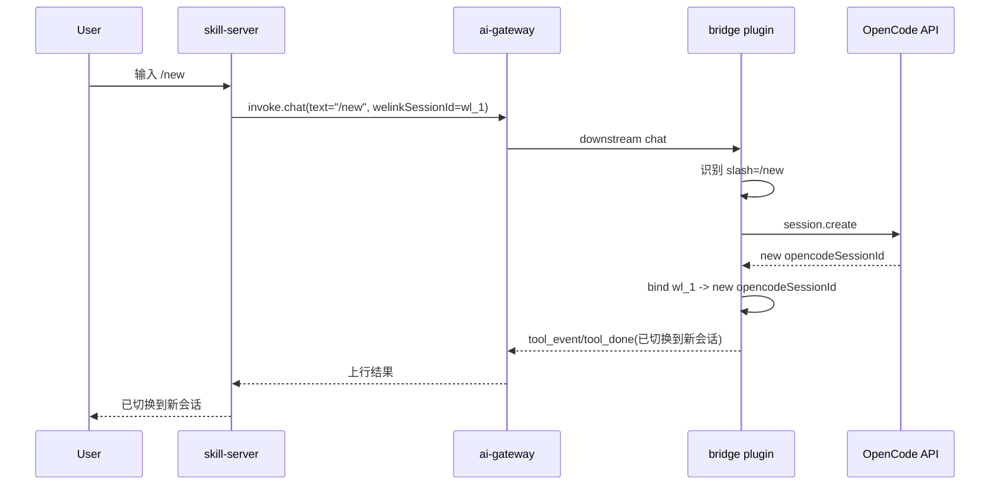

### 8.8 `/sessions`

OpenCode 侧 `/sessions` 直接依赖宿主原生 `session.list`：

- 返回范围是当前 `project`
- 若存在 `workspaceID`，则进一步限于当前 `workspace`
- 不使用 `experimental.session.list`
- 不展示全局宿主会话

返回结果应至少标识：

- `opencodeSessionId`
- 会话标题或宿主可展示标识
- 当前是否为显式可切换目标

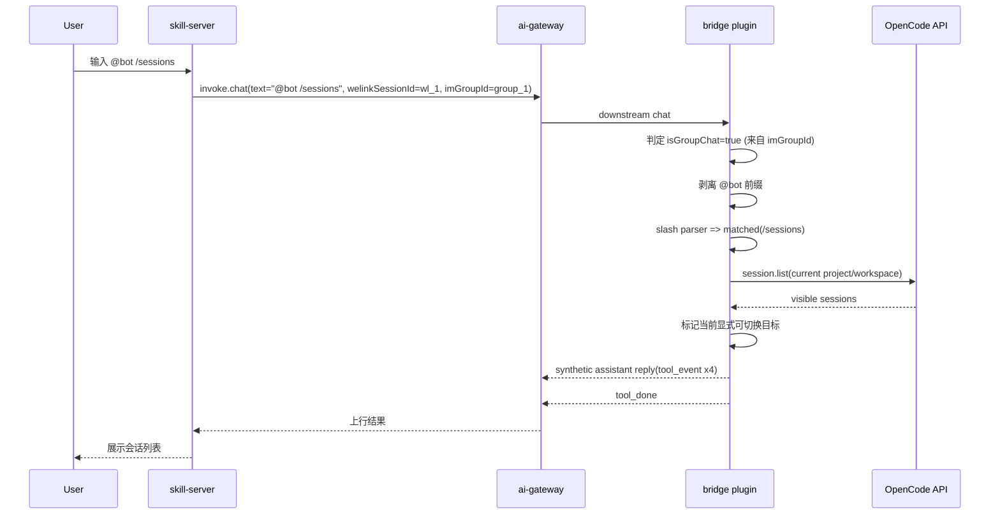

### 8.9 `/session <opencodeSessionId>`

OpenCode 侧 `/session <opencodeSessionId>` 采用严格显式切换规则：

- 目标会话必须出现在当前 `session.list` 结果中
- 不做 `session.get` 越界兜底
- 不允许用户通过显式切换绑定到当前 `project/workspace` 范围外的会话

切换成功后：

- 当前 `welinkSessionId` 绑定目标更新为该 `opencodeSessionId`
- 后执行的 `/new` 或 `/session <id>` 可继续覆盖此绑定

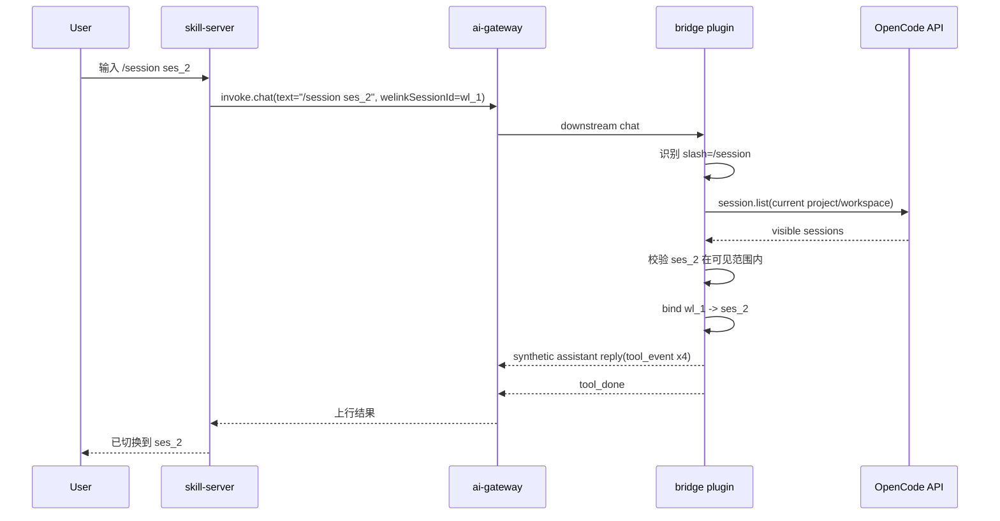

### 8.9.1 已知 Slash 失败路径

已知 slash 命令只要失败，统一视为控制面失败，不回落 LLM，也不发送 `tool_error`。这包括：

- parser 返回 `invalid`
- slash 上下文解析失败
- 宿主查询或执行失败
- 已匹配 slash 的宿主返回受控错误

`HandledSlashCommandFailure` 只用于告诉 runtime“失败回包已完成”；runtime 捕获后直接返回，不再补发 `tool_error`。

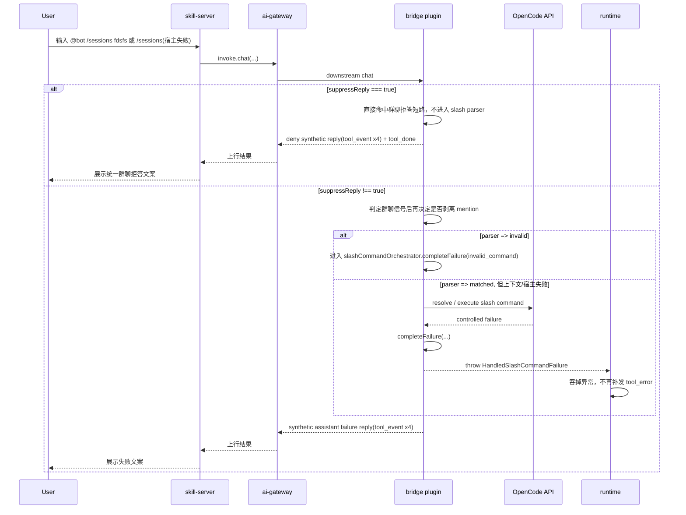

### 8.10 普通 chat

普通 chat 在 OpenCode 侧的执行规则如下：

- 若当前 `welinkSessionId` 已有绑定，则直接使用当前 `opencodeSessionId`
- 若当前 `welinkSessionId` 无绑定，则插件直接创建新会话并建立绑定
- 不以“当前是否仍出现在 `session.list` 结果中”作为硬前置条件
- 若宿主明确返回 session 不存在或不可用，则当前绑定失效，后续回到“用户未指定 sessionId”逻辑

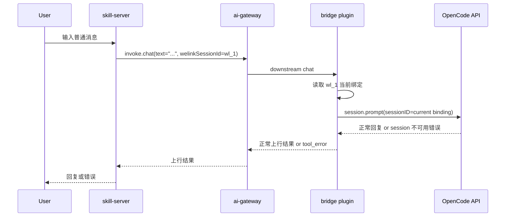

### 8.11 `/models`

OpenCode 侧 `/models` 的模型目录来源固定为宿主原生接口：

- `config.providers()` / `GET /config/providers`
- 需要补充展示信息时可引用 `provider.list()` / `GET /provider`

OpenCode v1 中，`/models` 只承担“列模型”职责：

- 展示宿主可用模型目录
- 不展示“当前正在使用的模型”

原因是：

- `session.get()` 返回的 `Session.Info` 不含模型字段
- OpenCode 当前没有公开的 session-level model getter / setter
- 直接展示“当前模型”会要求插件维护额外推断链，并与真实执行链保持一致

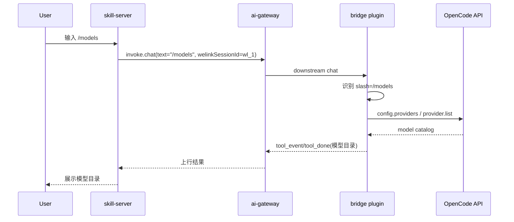

### 8.12 `/model <provider/model>`

OpenCode 侧 `/model <providerId/modelId>` 采用“后续请求 override”语义：

- 先校验目标模型存在于宿主模型目录
- 校验通过后，记录当前会话上下文的后续请求模型策略
- 若当前已有有效绑定，则后续请求立即对当前 `opencodeSessionId` 生效
- 若当前无有效绑定，则不报错；该策略在下次普通 `chat` 自动创建或命中有效绑定后生效
- 后续请求由插件显式把该 `model` 注入到 `session.prompt` / `session.command`
- 返回“后续请求将使用该模型”的确认结果

同时明确：

- 插件不承诺 `/model` override 跨 OpenCode 重启恢复
- 若重启后重新进入同一 `opencodeSessionId`，模型可能因宿主 `lastModel(sessionID)` 链继续沿用
- 这属于宿主默认模型选择行为，不等价于插件 override 持久化承诺

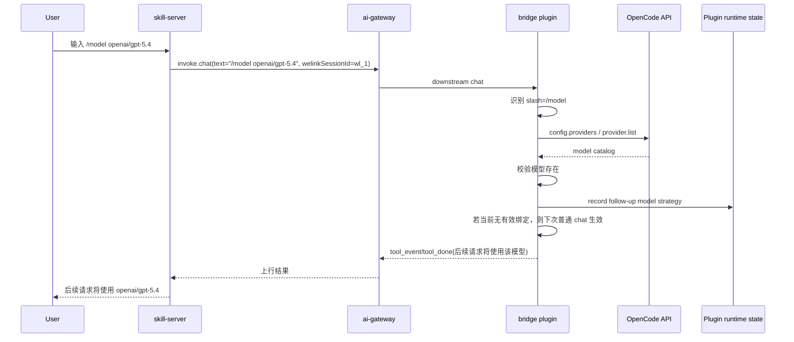

### 8.13 OpenCode 模型选择链

OpenCode 宿主当前模型选择链的关键事实如下：

1. 请求显式传入的 `model`
2. 宿主 `lastModel(sessionID)`
3. 宿主 `Provider.defaultModel()` 回退链

其中：

- `session.get()` 无模型字段
- `lastModel(sessionID)` 依赖历史消息中最近一次实际使用模型
- `Provider.defaultModel()` 负责宿主默认回退

这带来的设计结论是：

- v1 的 `/models` 不承担“准确显示当前模型”的职责
- 若未来要显示当前模型，需要额外协调：
  - 插件 `opencodeSessionId` 级 override
  - 宿主 `lastModel(sessionID)`
  - 宿主 `Provider.defaultModel()`
- 若展示链与执行链不一致，会误导用户

### 8.14 运行期绑定生命周期
本图用于说明 OpenCode 场景下当前绑定的生命周期：未绑定时如何由 `/new`、`/session <id>` 和首次普通 chat 建立绑定，建立后如何在普通 chat 中复用，以及宿主重启后为何回退到未绑定状态。其中“首次普通 chat 建立绑定”表示当前无显式绑定时，插件直接创建新会话并绑定。

```mermaid
flowchart TD
  A[未绑定] --> B[/new 创建并绑定新会话]
  A --> C[/session <id> 切换到指定会话]
  A --> D[首次普通 chat 创建新会话并绑定]

  B --> E[普通 chat 持续复用当前绑定]
  C --> E
  D --> E

  E --> F[/new 或 /session <id> 覆盖当前绑定]
  F --> E

  E --> G[OpenCode 重启]
  G --> H[绑定失效]
  H --> A
```

## 9. OpenClaw 实现

### 9.1 当前现状约束

OpenClaw 宿主已具备 session store、会话模型字段与模型目录能力，但当前 `message-bridge-openclaw` 的实现形态仍无法直接承接 slash command 方案。

当前插件现状：

1. `sessionKey` 仍按 `${agentIdPrefix}:${accountId}:${toolSessionId}` 规则由插件拼接。
2. `SessionRegistry` 仅维护进程内 `toolSessionId -> sessionKey` 映射。
3. 会话绑定真相源尚未落到 session store，OpenClaw 重启后无法恢复。

宿主能力现状：

1. OpenClaw runtime 已提供 `PluginRuntime.agent.session.*`，可直接读写 session store。
2. 宿主已有模型目录与会话模型 override 字段。
3. `bridge-runtime-sdk` 只负责插件与 ai-gateway 的连接，不构成 OpenClaw slash command 的宿主能力上界。

本章节的目标设计是：

- 会话真相源从进程内 `Map` 迁移到 session store。
- `welinkSessionId` 与 `sessionKey` 的绑定、活动指针、恢复逻辑均基于 session store。

### 9.2 依赖的宿主能力

OpenClaw 侧本方案优先依赖以下 runtime 能力：

- `PluginRuntime.agent.session.resolveStorePath`
- `PluginRuntime.agent.session.loadSessionStore`
- `PluginRuntime.agent.session.updateSessionStore`
- `PluginRuntime.agent.session.updateSessionStoreEntry`

模型目录主数据源固定为：

- `models.list`

补充说明：

- OpenClaw 宿主也具备 `sessions.*` 能力。
- 但本方案的会话绑定真相源不优先依赖 `GatewayClient + sessions.pluginPatch`。
- 当前待补的是插件如何接入这些宿主能力，而不是重新论证 OpenClaw 宿主是否支持该方案。

### 9.3 OpenClaw API 出入参

本节只列 bridge 实现最小依赖字段，不要求与 OpenClaw 宿主全量 SDK schema 一一对齐。

#### `resolveStorePath`

**入参**

| 字段 | 类型 | 必填 | 含义 |
| --- | --- | --- | --- |
| `cfg` | `OpenClawConfig` | 是 | 当前运行时配置快照 |

**出参**

| 字段 | 类型 | 含义 |
| --- | --- | --- |
| 返回值 | `string` | session store 文件路径 |

#### `loadSessionStore`

**入参**

| 字段 | 类型 | 必填 | 含义 |
| --- | --- | --- | --- |
| `storePath` | `string` | 是 | session store 文件路径 |
| `opts.skipCache` | `boolean` | 否 | 是否跳过 session store 缓存 |
| `opts.maintenanceConfig` | `ResolvedSessionMaintenanceConfig` | 否 | 指定 load 时使用的维护配置 |
| `opts.runMaintenance` | `boolean` | 否 | 是否在读取后执行维护逻辑 |
| `opts.clone` | `boolean` | 否 | 是否返回克隆副本；`false` 时返回内部对象 |

**出参**

| 字段 | 类型 | 含义 |
| --- | --- | --- |
| 返回值 | `Record<string, SessionEntry>` | 整个 session store 快照 |
| `Record` key | `string` | `sessionKey` |
| `Record` value | `SessionEntry` | 对应宿主会话 entry |

设计约束：`loadSessionStore` 返回的是整个 session store 快照，不是单条 session 查询接口。

#### `updateSessionStore`

**入参**

| 字段 | 类型 | 必填 | 含义 |
| --- | --- | --- | --- |
| `storePath` | `string` | 是 | session store 文件路径 |
| `updater` | `(store) => void \| Promise<void>` | 是 | 对 store 的原地更新函数 |
| `opts` | `object` | 否 | 宿主维护、告警与活跃 session 相关选项 |

**出参**

| 字段 | 类型 | 含义 |
| --- | --- | --- |
| 返回值 | `Promise<void>` | 持久化完成 |

#### `updateSessionStoreEntry`

**入参**

| 字段 | 类型 | 必填 | 含义 |
| --- | --- | --- | --- |
| `storePath` | `string` | 是 | session store 文件路径 |
| `sessionKey` | `string` | 是 | 目标宿主会话 key |
| `updater` | `(entry) => SessionEntry \| null \| undefined` | 是 | entry 更新函数 |
| `opts` | `object` | 否 | createIfMissing、维护与告警相关选项 |

**出参**

| 字段 | 类型 | 含义 |
| --- | --- | --- |
| 返回值 | `Promise<SessionEntry \| null>` | 更新后的 entry 或空值 |

#### `models.list`

**入参**

| 字段 | 类型 | 必填 | 含义 |
| --- | --- | --- | --- |
| 无 | - | - | 无额外业务入参 |

**出参**

| 字段 | 类型 | 含义 |
| --- | --- | --- |
| `models` | `Array<ModelCatalogEntry>` | 宿主模型目录 |
| `models[].provider` | `string` | provider ID |
| `models[].id` | `string` | model ID |
| `models[].name` | `string` | 展示名称 |

设计约束：`models.list` 是 OpenClaw `/models` 的主数据源。

### 9.4 OpenClaw 会话模型

OpenClaw 场景下，对外协议主标识仍然只有 `welinkSessionId`，宿主主标识是 `sessionKey`。

并遵循以下规则：

1. 一个 `welinkSessionId` 可以关联多个历史 `sessionKey`。
2. `/sessions` 返回这些 `sessionKey`。
3. 当前活动会话通过独立活动指针表示，而不是靠“最后一个会话”隐式推断。

#### `sessionKey` 定义

`sessionKey` 采用 bridge-owned session namespace，但只用于 `message-bridge-openclaw` 自建会话，不能替代宿主其他 channel/session grammar。

推荐格式：

```text
{agentIdPrefix}:{accountId}:message-bridge:{opaqueSessionId}
```

约束：

- 不再复用 `toolSessionId`
- 不把 `welinkSessionId` 编码进 `sessionKey`
- `opaqueSessionId` 使用随机段
- `message-bridge-openclaw` 仅为自身创建的宿主会话生成该命名空间下的 `sessionKey`
- `/session <sessionKey>` 只允许切换到本插件命名空间内、且已绑定到当前 `welinkSessionId` 的会话

#### 历史集合与绑定元数据

普通 session entry 上写入插件扩展字段：

```ts
pluginExtensions["message-bridge-openclaw"]["binding"] = {
  welinkSessionId: string,
  bindingUpdatedAt: number,
  bindingSource: "new" | "switch" | "auto"
}
```

历史集合生命周期：

- 自动创建的默认 session 和 `/new` 创建的 session 都进入历史集合
- `/session <sessionKey>` 只切活动指针，不新增集合成员
- `closeSession` 或明确删除宿主会话后，从集合移除
- `reset` 不移除集合成员，只重置会话内容
- 一个 `sessionKey` 不允许重新归属到另一个 `welinkSessionId`

#### 活动指针

活动指针也存放在 session store entry 中，不新增插件独立状态文件。

推荐专用 index entry：

```text
{agentIdPrefix}:{accountId}:message-bridge:index
```

其 `pluginExtensions["message-bridge-openclaw"]["index"]` 保存：

```ts
{
  activeByWelinkSessionId: {
    [welinkSessionId: string]: sessionKey
  },
  updatedAt: number
}
```

### 9.5 Slash Command 返回文本格式

OpenClaw 侧继续复用第 7 章定义的统一返回契约，不单独扩展结构化协议。

要求：

- slash command 成功统一复用现有上行消息链路
- slash command 文本格式必须与 OpenCode v1 同构
- `/sessions` 返回列表第一行是摘要，后续逐行列出 `sessionKey`
- 当前激活项使用固定前缀标记
- 失败场景使用固定原因文案

虽然 OpenClaw 宿主能力更强，但 v1 仍和 OpenCode 保持一致的返回契约。

### 9.6 `/new`

OpenClaw 侧 `/new` 用于在当前 `welinkSessionId` 作用域下创建一个新的宿主会话，并立即将当前活动绑定切换到该新会话。

行为定义：

1. 插件拦截 `/new`
2. 生成新的 `sessionKey`
3. 创建或初始化对应 session entry
4. 在普通 session entry 上写入当前 `welinkSessionId` 绑定元数据
5. 更新 index entry 中的 `activeByWelinkSessionId`
6. 返回成功文本

语义约束：

- `/new` 总是创建新宿主会话
- `/new` 总是覆盖当前活动绑定
- 旧 `sessionKey` 仍保留在该 `welinkSessionId` 的历史关联集合中

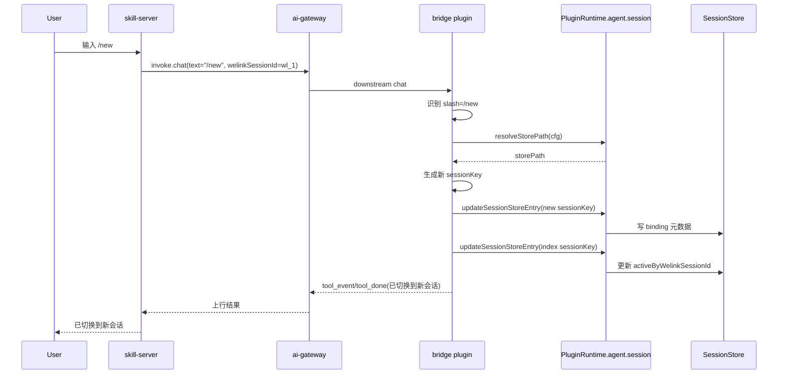

### 9.7 `/sessions`

OpenClaw 侧 `/sessions` 返回的是当前 `welinkSessionId` 的关联宿主会话，而不是宿主全量 session store，也不是 channel 全量会话。

行为定义：

1. 读取 session store
2. 过滤出 `binding.welinkSessionId === 当前值` 的 session entry
3. 按 `bindingUpdatedAt` 倒序返回 `sessionKey` 列表
4. 若 `bindingUpdatedAt` 相同，再按 `updatedAt` 倒序
5. 结合 index entry 标记当前激活项

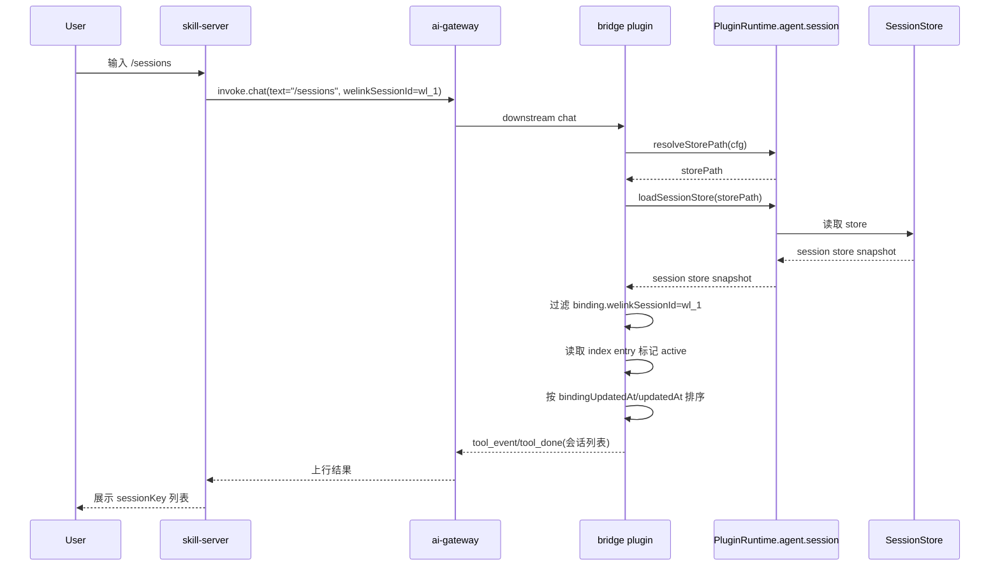

### 9.8 `/session <sessionKey>`

OpenClaw 侧 `/session <sessionKey>` 只切换当前活动绑定，不创建新会话，不改历史关联集合。

行为定义：

1. 校验目标 `sessionKey` 存在
2. 校验其绑定元数据属于当前 `welinkSessionId`
3. 通过后只更新 index entry 中的活动指针
4. 返回切换成功文本

语义约束：

- `/session <sessionKey>` 与 `/new` 一样，都是显式更新当前活动绑定
- 后执行者覆盖先执行者

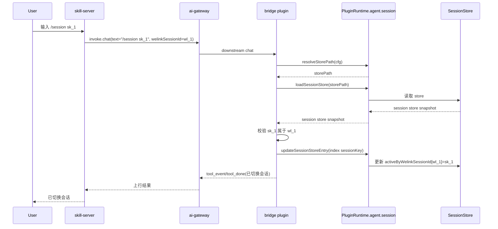

### 9.9 普通 chat

普通 chat 先从 index entry 解析当前 `welinkSessionId` 的活动 `sessionKey`。

执行规则：

1. 如果找到活动项，直接复用。
2. 如果 index entry 丢失、损坏，或指向不存在的 `sessionKey`：
   - 先从当前 `welinkSessionId` 的历史集合中按 `/sessions` 相同排序规则选出候选并恢复为 active
   - 若历史集合为空，再自动生成新的 `sessionKey`
3. 自动创建默认 session 时，写入绑定元数据并更新活动指针。

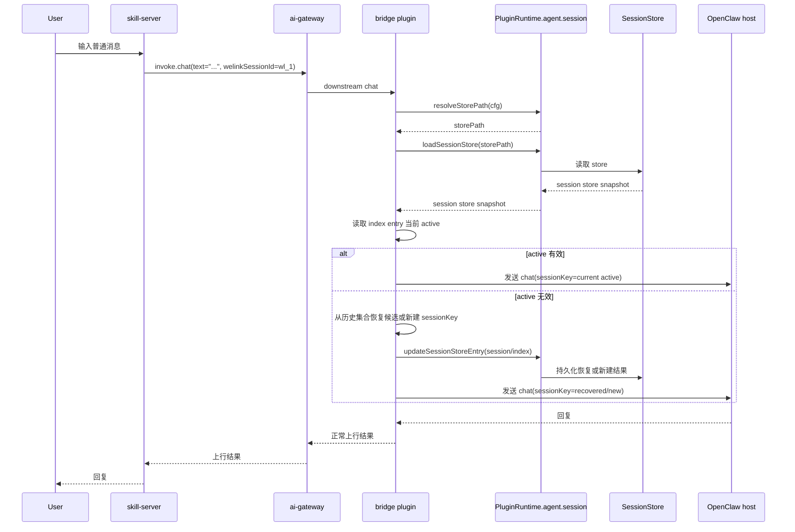

### 9.10 `/models`

OpenClaw 侧 `/models` 为保持跨宿主一致性，v1 收敛为：

- 只展示模型目录
- 不展示“当前正在使用的模型”

说明：

- 这不是 OpenClaw 宿主做不到
- 而是为了和 OpenCode 保持 v1 返回契约一致
- `/models` 主数据源固定为 `models.list`

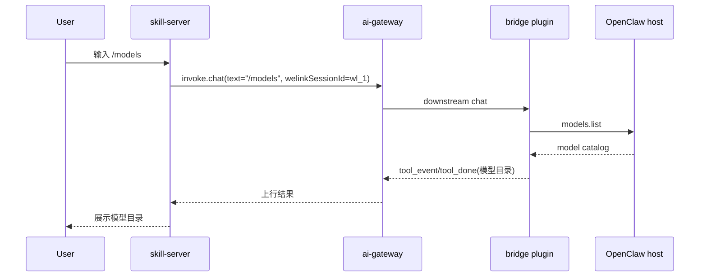

### 9.11 `/model <provider/model>`

OpenClaw 侧 `/model <provider/model>` 直接复用宿主现有 session 字段写模型覆盖，不写入 `pluginExtensions`。

行为定义：

1. 解析当前 `welinkSessionId` 对应的活动 `sessionKey`
2. 直接复用宿主现有 session 字段写模型覆盖：
   - `providerOverride`
   - `modelOverride`
   - `modelOverrideSource: "user"`
3. 返回“后续请求将使用该模型”的确认文本

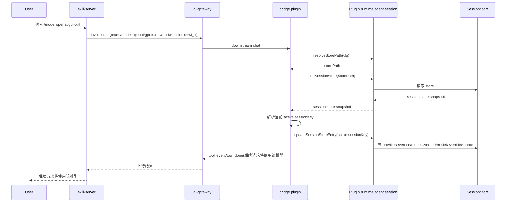

### 9.12 运行期与恢复边界

OpenClaw 与 OpenCode 的关键差异在于：OpenClaw 的会话绑定真相源落在 session store，因此绑定与活动指针应可跨宿主重启恢复。

恢复规则：

- 普通 session entry 上的 `binding` 元数据负责恢复历史集合
- index entry 中的 `activeByWelinkSessionId` 负责恢复当前活动项
- 若 index entry 失效，则先从历史集合恢复候选；无候选时再新建

```mermaid
flowchart TD
  A[未绑定] --> B[/new 创建并绑定新会话]
  A --> C[首次普通 chat 自动创建并绑定]

  B --> D[普通 chat 复用当前 active]
  C --> D

  D --> E[/session <sessionKey> 覆盖当前 active]
  E --> D
  D --> F[/new 覆盖当前 active]
  F --> D

  D --> G[OpenClaw 重启]
  G --> H[从 session store 恢复绑定与 active]
  H --> D
  H --> I[index entry 失效时从历史集合恢复或新建]
  I --> D
```

### 9.13 OpenClaw 与 OpenCode 的差异结论

需要显式区分两侧语义，避免把 OpenCode 方案直接套用到 OpenClaw：

- OpenCode
  - 当前方案更偏运行期绑定
  - `/sessions` 基于宿主列表范围
  - `/models` 受宿主 session-level 模型状态缺失约束更强
- OpenClaw
  - 绑定真相源落在 session store
  - `sessionKey` 与 `welinkSessionId` 通过元数据关联
  - 一个 `welinkSessionId` 可关联多个历史 `sessionKey`
  - 活动指针通过专用 index entry 持久化恢复
  - 模型覆盖直接复用宿主现有 session 字段
  - 为了 v1 一致性，`/models` 仍只列模型目录

## 10. 主要风险

### 10.1 OpenCode 运行期绑定不跨重启恢复

风险：

- OpenCode 重启后，当前 `welinkSessionId -> opencodeSessionId` 绑定关系丢失

说明：

- 这是当前设计的已知局限性，不是设计目标
- 重启后需要回退到“用户未指定 sessionId”逻辑

### 10.2 服务端与插件形成双重真相源

风险：

- 如果服务端仍然缓存或推断宿主内部会话标识，会与插件状态冲突

建议：

- 明确规定服务端只认 `welinkSessionId`，不得自行持有或推断宿主内部会话标识

### 10.3 OpenCode 当前模型展示易误导

风险：

- 若在缺少宿主 session-level model state 的情况下强行展示“当前模型”，会与真实执行链分叉

建议：

- v1 的 `/models` 仅展示宿主可用模型目录
- 当前模型确认通过对话链路完成

### 10.4 OpenClaw session store 成为唯一真相源后的恢复一致性

风险：

- 若 index entry 丢失、损坏，或指向不存在的 `sessionKey`，普通 chat 会失去当前活动项

建议：

- 明确 index entry 失效后的恢复策略
- 先从当前 `welinkSessionId` 的历史集合恢复候选
- 无候选时再自动创建新的 `sessionKey`

### 10.5 OpenClaw bridge-owned session namespace 与宿主其他 grammar 的边界

风险：

- 若未明确 `message-bridge-openclaw` 自建会话的命名边界，后续可能与宿主其他 channel/session grammar 混淆

建议：

- 明确 `message-bridge` 命名空间只用于本插件自建会话
- `/session <sessionKey>` 仅允许切换到本插件命名空间内且已绑定的会话

## 11. 最小实施顺序

1. 完成 OpenCode 章节修正，固定两层会话模型、运行期边界、`/sessions` 范围、`/models` 目录与运行期生命周期图。
2. 重写 OpenClaw 章节结构，使其组织方式与 OpenCode 对齐。
3. 在 OpenClaw 侧写死会话模型、历史集合、活动指针与恢复边界。
4. 补齐 OpenClaw API 出入参与命令级时序图。
5. 在 OpenClaw 侧固定 `/models` 主数据源与模型 override 写入宿主字段的规则。
6. 最后统一校验通用返回文本格式、风险章节与验收建议。

## 12. 验收建议

- OpenCode：
  - 文档中的会话模型只保留 `welinkSessionId` 与 `opencodeSessionId` 两层
  - 文档明确说明不维护 `welinkSessionId -> opencodeSessionId[]` 集合
  - `/sessions` 明确绑定 `session.list`，并写清 `project/workspace` 范围
  - `/session <id>` 明确只允许切换到当前列表可见会话
  - 普通 chat 不因列表不可见自动失效
  - `/models` 明确使用宿主模型目录接口
  - `session.get()` 不含模型字段这一事实有明确说明
  - `/models` 明确不展示当前正在使用模型
  - 图示中明确体现重启导致绑定失效与回退逻辑
- OpenClaw：
  - 文档中存在独立完整的 `OpenClaw 实现` 章节，组织方式对齐 OpenCode
  - 文档明确 `sessionKey` 命名规则，并写清它只用于 bridge-owned session namespace
  - 文档明确 `welinkSessionId` 与 `sessionKey` 的关联元数据结构
  - 文档明确活动指针保存在 session store 专用 index entry 中
  - 文档明确历史集合生命周期规则
  - `/sessions` 明确返回 `sessionKey` 列表，并按 `bindingUpdatedAt` 倒序、`updatedAt` 次排序
  - 文档明确 index entry 失效后的恢复策略
  - 文档明确 OpenClaw 首选 `PluginRuntime.agent.session.*` 作为持久化路径
  - 文档明确 `models.list` 是 `/models` 主数据源
  - 文档明确 `/model <provider/model>` 直接复用宿主 `providerOverride/modelOverride/modelOverrideSource`
  - 每个 slash command 都有明确行为定义与时序图
  - 文档明确 `/models` v1 只展示模型目录是主动收敛，不是宿主能力缺失
- 服务端：
  - 全链路不再依赖 `toolSessionId` 作为外部标识
  - 全链路只使用 `welinkSessionId` 作为插件与服务端之间的会话标识
