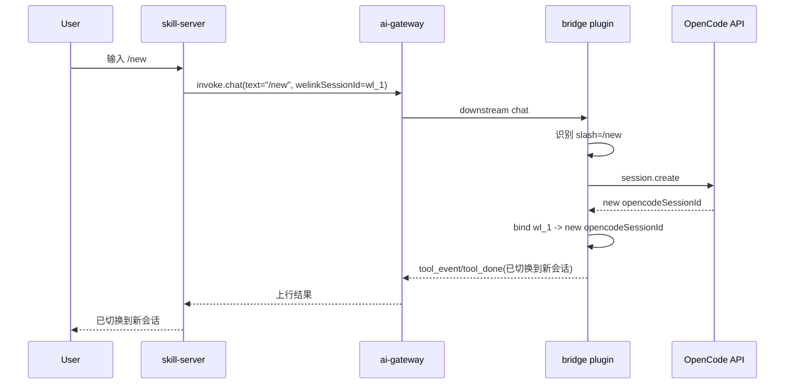
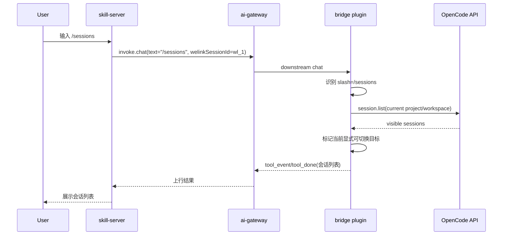
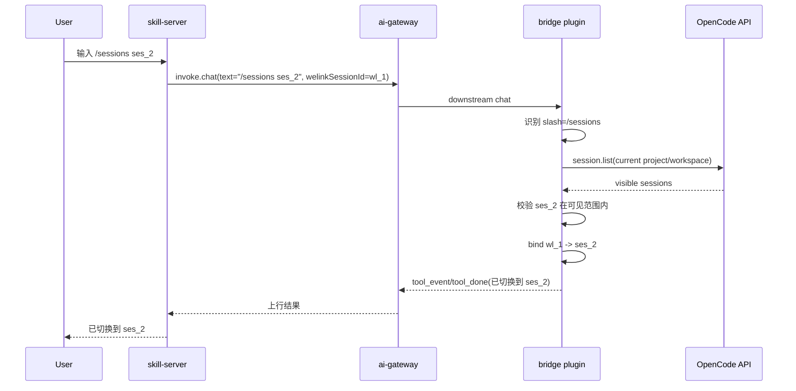
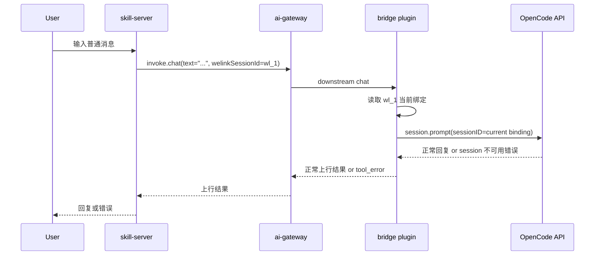
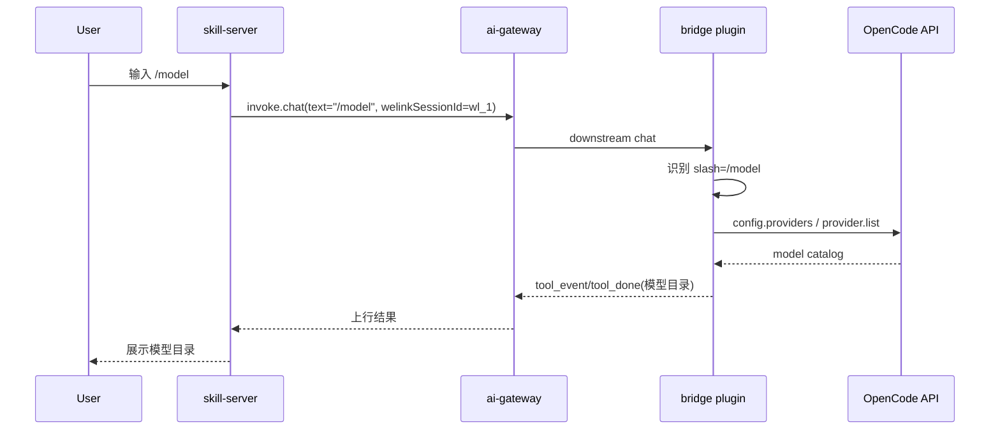
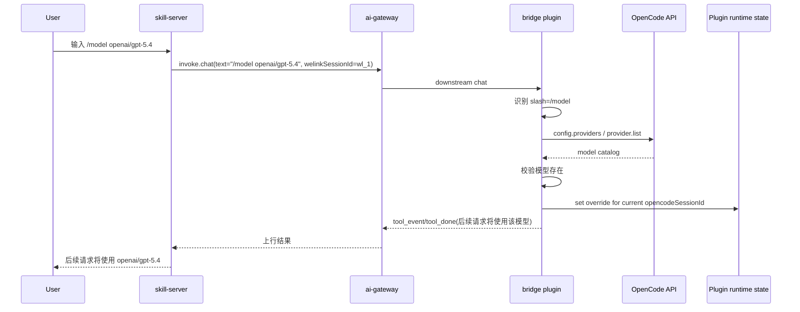
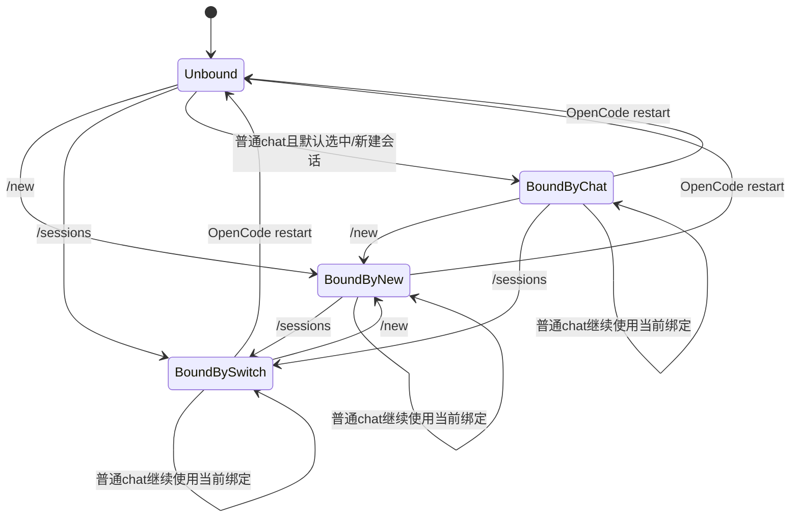

# Message Bridge Slash Commands 方案设计

**Version:** 2.1  
**Date:** 2026-05-09  
**Status:** Draft  
**Owner:** agent-plugin maintainers  
**Related:** `../specs/2026-05-08-message-bridge-slash-commands-requirements.md`, `integration/opencode/docs/architecture/07-command.md`, `integration/openclaw/docs/learn/slash-commands-tui-perspective.md`

## 1. 设计前提

本方案采用以下前提，作为后续所有设计讨论的基础：

1. 服务端不再管理 `welinkSessionId` 与宿主内部会话标识之间的映射关系。
2. 服务端不再关注宿主会话的创建、选择、切换逻辑。
3. 插件与服务端之间的桥接消息统一只使用 `welinkSessionId` 作为唯一会话标识。
4. `toolSessionId`、宿主原生 `session.id`、`sessionKey` 等内部标识只在插件内部使用，不再透传给服务端。
5. 插件独立负责宿主会话创建、当前宿主会话选择、当前宿主会话切换与模型覆盖控制。

在这个前提下，需求文档中原本面向外部暴露的 `toolSessionId` 语义，在本方案中统一收敛为 `welinkSessionId` 语义；`toolSessionId` 降级为插件内部实现细节。

## 2. 结论摘要

本需求不能简单理解为“两个插件都加一个 slash parser”。

在新前提下，五个命令统一落到插件控制面：

1. **会话控制类**
   - `/new`
   - `/sessions`
   - `/sessions <sessionId>`
2. **模型控制类**
   - `/model`
   - `/model <providerId/modelId>`

推荐职责划分如下：

- `/new`
  - 由插件创建新宿主会话，并覆盖当前 `welinkSessionId` 的宿主会话绑定
- `/sessions`
  - 由插件返回当前宿主作用域下可显式切换的会话目录
- `/sessions <sessionId>`
  - 由插件执行显式会话切换
- `/model`
  - 由插件读取宿主模型目录
- `/model <providerId/modelId>`
  - 由插件为当前会话写入后续请求模型覆盖

这意味着最终方案是：

- 服务端只持有 `welinkSessionId` 这一层业务标识
- 插件独占宿主会话绑定与模型覆盖控制
- ai-gateway 继续承载桥接传输，但不再参与宿主内部会话映射与切换

## 3. In Scope

- 梳理 `message-bridge` 与 `message-bridge-openclaw` 在新前提下如何承接五个 slash commands
- 明确 OpenCode / OpenClaw 各自依赖的宿主能力
- 明确与 `ai-gateway`、`skill-server` 的职责边界
- 定义会话与模型控制的统一外部语义

## 4. Out of Scope

- 不在本轮统一 miniapp / IM 的最终 UI 呈现
- 不在本轮扩展更多 slash commands
- 不在本轮重构 OpenCode / OpenClaw 原生 TUI 命令体系
- 不在本轮定义具体实现文件、类名或代码改动清单

## 5. External Dependencies

- `integration/opencode-cui/skill-server`
  - 需要接受“服务端不再管理宿主内部会话映射”的边界调整
- `integration/opencode-cui/ai-gateway`
  - 需要接受插件与服务端之间仅使用 `welinkSessionId` 的消息语义

## 6. 统一职责拆分

| 命令 | 主责任方 | 语义 |
| --- | --- | --- |
| `/new` | 插件 | 创建新的宿主会话，并切换当前 `welinkSessionId` 的活动会话 |
| `/sessions` | 插件 | 返回当前宿主作用域下可显式切换会话目录 |
| `/sessions <sessionId>` | 插件 | 将当前活动宿主会话切到目标宿主会话 |
| `/model` | 插件 | 返回宿主模型目录 |
| `/model <provider/model>` | 插件 | 写入当前会话的后续请求模型覆盖 |

服务端只承担两件事：

- 把用户文本转发给插件
- 展示插件返回的结果文本与错误

## 7. 通用交互边界

### 7.1 统一入口

推荐所有 slash command 都复用现有 `chat` 下行入口：

1. 上游仍发送 `invoke.chat`
2. 插件在进入宿主对话 runtime 之前识别 slash command
3. 命中控制命令后，不再把原始文本送给宿主 LLM
4. 插件直接执行控制逻辑
5. 插件通过现有 `tool_event` / `tool_done` / `tool_error` 返回结果

这样做的好处：

- 不需要第一阶段扩展新的 gateway action
- slash command 的对外体验保持统一
- 服务端无须理解宿主内部控制语义

### 7.2 服务端职责收缩

skill-server / miniapp 不再需要承担：

- `toolSessionId` 持久化绑定
- 会话创建完成后的回写
- 会话目录查询
- 会话切换控制

skill-server / miniapp 只需要继续做：

- 以 `welinkSessionId` 作为唯一业务会话标识
- 把用户文本转发给插件
- 展示插件返回的结果文本与错误

本方案相对当前基线的核心变化不是“新增 slash command”，而是“重划会话控制平面”。

### 7.3 Slash Command 上行回复约束

v1 不新增 gateway action，统一复用现有 `chat` 下行入口以及 `tool_event` / `tool_done` / `tool_error` 上行消息。slash command 的回复必须兼容 `origin/main` 现有“回复助手消息”展示链路，不引入 slash command 专属渲染分支。

- 成功场景
  - 插件必须先发送 `tool_event`
  - `tool_event` 的文本内容即 slash command 返回给用户的正文
  - 插件随后发送 `tool_done`，表示本次控制命令完成
- 失败场景
  - 插件必须发送 `tool_error`
  - `tool_error` 的文本内容即返回给用户的失败文案
- 服务端行为
  - 服务端继续复用现有助手消息展示逻辑
  - 服务端不对 slash command 增加新的消息类型判断或专属回复动作

### 7.4 Slash Command 返回文本格式

v1 中所有 slash command 继续通过 `tool_event` / `tool_done` / `tool_error` 返回纯文本结果。为降低服务端渲染复杂度并保证 OpenCode / OpenClaw 行为一致，返回文本必须遵循以下统一格式约束：

1. 纯文本返回，不引入 JSON、Markdown 表格或额外结构化协议字段。
2. 第一行必须是结果摘要，直接说明命令结果。
3. 列表型返回从第二行开始逐行列项，不嵌套层级。
4. 错误返回直接说明失败原因与下一步动作，不暴露宿主内部异常栈。
5. 同一命令在 OpenCode / OpenClaw 侧必须保持同构文案；若宿主差异导致字段名不同，仅允许替换宿主字段名。
6. 本节定义的成功模板、失败模板、列表格式与固定错误文案属于 v1 返回契约，后续实现、联调与测试均以本节为验收基线。

必须遵循的文本模板如下。

**`/new`**

成功：

```text
已切换到新会话 <sessionId> <title>
```

失败：

```text
新建会话失败 <reason>
```

**`/sessions`**

成功：

```text
可切换会话列表:
* <sessionId> <title>
  <sessionId> <title>
```

约束：

- 当前激活会话使用 `* ` 前缀
- 每行至少包含宿主会话 ID
- `title` 缺失时可省略，不强造占位文案

失败：

```text
查询会话列表失败, <reason>
```

**`/sessions <sessionId>`**

成功：

```text
已切换会话 <sessionId> <title>
```

失败：

```text
切换会话失败, <reason>
```

若目标会话不在当前显式可切换范围内，必须使用固定原因文案：

```text
切换会话失败, 目标会话不在当前 project/workspace 可切换范围内
```

**`/model`**

成功：

```text
可用模型列表:
<providerId>/<modelId>
<providerId>/<modelId>
```

约束：

- v1 不返回“当前正在使用的模型”
- 可按 provider 分组输出，但仍保持逐行纯文本
- 若宿主存在默认模型信息，可在摘要后补一行 `default: <providerId>/<modelId>`

失败：

```text
查询模型列表失败, <reason>
```

**`/model <providerId/modelId>`**

成功：

```text
后续请求将使用该模型 <providerId>/<modelId>
```

失败：

```text
设置模型失败,<reason>
```

若模型不存在，建议使用固定原因文案：

```text
设置模型失败,目标模型不存在或当前宿主不可用
```

以上格式是 v1 设计约束，不代表最终 UI 呈现。后续若服务端需要 richer rendering，应在保持上述文本兼容的前提下再扩展结构化字段。

## 8. OpenCode 实现

### 8.1 当前现状约束

OpenCode 当前已具备基础会话调用能力、会话目录能力与模型目录能力，但 slash command 方案仍受以下事实约束：

1. `session.list` 返回的是当前 `project` 范围内会话；若存在 `workspaceID`，则进一步限于当前 `workspace`。
2. `session.get()` 返回的 `Session.Info` 不包含模型字段。
3. 稳定的模型设置入口是 `session.prompt(..., model)` 与 `session.command(..., model)`，而不是 session 级 patch。
4. OpenCode 重启后，插件当前运行期内维护的绑定关系不会自动恢复。

### 8.2 依赖的宿主能力

OpenCode 侧本方案依赖以下能力：

- 宿主会话创建能力
- 宿主会话读取能力
- 会话目录读取能力
- 模型目录读取能力
- 普通对话发送能力
- slash command 执行能力

其中：

- `session.list` 返回的是当前 `project` 范围内会话；若存在 `workspaceID`，则进一步限于当前 `workspace`
- `session.get()` 返回的 `Session.Info` 不包含模型字段
### 8.3 OpenCode API 出入参

本节只列 bridge 实现最小依赖字段，不要求与 OpenCode 宿主全量 SDK schema 一一对齐。

#### `session.create`

**入参**

| 字段 | 类型 | 必填 | 含义 |
| --- | --- | --- | --- |
| `title` | `string` | 否 | 新建会话标题 |
| `parentID` | `string` | 否 | 父会话 ID，用于 fork 或子会话场景 |
| `directory` | `string` | 否 | 当前工作目录，用于让宿主在指定目录上下文创建会话 |

**出参**

| 字段 | 类型 | 含义 |
| --- | --- | --- |
| `id` | `string` | 宿主会话 ID，即 `opencodeSessionId` |
| `slug` | `string` | 宿主会话 slug |
| `projectID` | `string` | 宿主识别出的 project ID |
| `workspaceID` | `string` | 当前 workspace ID；无 workspace 时可缺省 |
| `directory` | `string` | 会话所属目录 |
| `parentID` | `string` | 父会话 ID；无父会话时可缺省 |
| `title` | `string` | 会话标题 |
| `version` | `string` | 宿主版本 |
| `time.created` | `number` | 会话创建时间戳 |
| `time.updated` | `number` | 会话最近更新时间戳 |
| `time.archived` | `number` | 会话归档时间；未归档时可缺省 |

#### `session.list`

**入参**

| 字段 | 类型 | 必填 | 含义 |
| --- | --- | --- | --- |
| `directory` | `string` | 否 | 按目录过滤会话 |
| `roots` | `boolean` | 否 | 是否只返回根会话 |
| `start` | `number` | 否 | 仅返回更新时间大于等于该时间戳的会话 |
| `search` | `string` | 否 | 按标题模糊过滤 |
| `limit` | `number` | 否 | 返回数量上限 |

**出参**

| 字段 | 类型 | 含义 |
| --- | --- | --- |
| `[]` | `SessionInfo[]` | 当前 `project/workspace` 范围内的会话列表 |
| `[].id` | `string` | 宿主会话 ID |
| `[].title` | `string` | 会话标题 |
| `[].projectID` | `string` | 会话所属 project |
| `[].workspaceID` | `string` | 会话所属 workspace；无 workspace 时可缺省 |
| `[].directory` | `string` | 会话所属目录 |
| `[].time.updated` | `number` | 最近更新时间戳 |

设计约束：`session.list` 返回范围受当前 `project/workspace` 约束，v1 不使用 `experimental.session.list`。

#### `session.get`

**入参**

| 字段 | 类型 | 必填 | 含义 |
| --- | --- | --- | --- |
| `sessionID` | `string` | 是 | 目标宿主会话 ID |

**出参**

| 字段 | 类型 | 含义 |
| --- | --- | --- |
| `id` | `string` | 宿主会话 ID |
| `title` | `string` | 会话标题 |
| `projectID` | `string` | 所属 project |
| `workspaceID` | `string` | 所属 workspace；无 workspace 时可缺省 |
| `directory` | `string` | 会话所属目录 |
| `time` | `object` | 会话时间信息 |

设计约束：`session.get()` 返回的 `SessionInfo` 中不包含模型字段，因此不能直接用于 `/model` 展示“当前正在使用的模型”。

#### `config.providers`

**入参**

| 字段 | 类型 | 必填 | 含义 |
| --- | --- | --- | --- |
| 无 | - | - | 无额外业务入参 |

**出参**

| 字段 | 类型 | 含义 |
| --- | --- | --- |
| `providers` | `ProviderInfo[]` | provider 及其模型目录 |
| `providers[].id` | `string` | provider ID |
| `providers[].name` | `string` | provider 展示名称；缺省时使用 `id` |
| `providers[].models` | `Record<string, ModelInfo>` | 该 provider 下的模型集合 |
| `providers[].models[*].id` | `string` | 模型 ID |
| `providers[].models[*].name` | `string` | 模型展示名称；缺省时使用 `id` |
| `providers[].models[*].variants` | `Record<string, unknown>` | 模型 variants；无时可缺省 |
| `providers[].models[*].capabilities.reasoning` | `boolean` | 是否支持 reasoning；无时可缺省 |
| `default` | `Record<string, string>` | 每个 provider 的默认模型映射 |

#### `provider.list`

**入参**

| 字段 | 类型 | 必填 | 含义 |
| --- | --- | --- | --- |
| 无 | - | - | 无额外业务入参 |

**出参**

| 字段 | 类型 | 含义 |
| --- | --- | --- |
| `all` | `ProviderInfo[]` | 宿主全量 provider 列表 |
| `default` | `Record<string, string>` | provider 默认模型映射；无时可缺省 |
| `connected` | `string[]` | 当前已连接 provider ID 列表；无时可缺省 |

设计约束：`config.providers` 作为 `/model` 主数据源，`provider.list` 仅用于补充展示信息。

#### `session.prompt`

**入参**

| 字段 | 类型 | 必填 | 含义 |
| --- | --- | --- | --- |
| `sessionID` | `string` | 是 | 目标宿主会话 ID |
| `messageID` | `string` | 否 | 本次消息 ID |
| `agent` | `string` | 否 | 宿主 agent 名称 |
| `model.providerID` | `string` | 否 | 显式指定模型的 provider ID |
| `model.modelID` | `string` | 否 | 显式指定模型的 model ID |
| `noReply` | `boolean` | 否 | 是否只注入上下文、不触发 AI 回复 |
| `system` | `string` | 否 | 附加 system prompt |
| `variant` | `string` | 否 | 模型 variant |
| `parts` | `Array<{ type: "text"; text: string }>` | 是 | 本次发送的消息内容 |

**出参**

| 字段 | 类型 | 含义 |
| --- | --- | --- |
| `info.id` | `string` | 返回消息 ID |
| `info.sessionID` | `string` | 会话 ID |
| `info.role` | `string` | 消息角色 |
| `info.model.providerID` | `string` | 实际记录的 provider ID；无时可缺省 |
| `info.model.modelID` | `string` | 实际记录的 model ID；无时可缺省 |
| `parts` | `unknown[]` | 返回消息 parts |

设计约束：OpenCode v1 的模型覆盖通过后续 `session.prompt` 显式传入 `model` 生效，不通过 `session.update` 修改会话属性。

#### `session.command`

**入参**

| 字段 | 类型 | 必填 | 含义 |
| --- | --- | --- | --- |
| `sessionID` | `string` | 是 | 目标宿主会话 ID |
| `messageID` | `string` | 否 | 本次命令消息 ID |
| `agent` | `string` | 否 | 宿主 agent 名称 |
| `model` | `string` | 否 | 显式指定模型，格式为 `providerId/modelId` |
| `command` | `string` | 是 | 宿主命令名 |
| `arguments` | `string` | 否 | 宿主命令参数 |

**出参**

| 字段 | 类型 | 含义 |
| --- | --- | --- |
| `info.id` | `string` | 返回消息 ID |
| `info.sessionID` | `string` | 会话 ID |
| `info.role` | `string` | 消息角色 |
| `parts` | `unknown[]` | 返回消息 parts |

设计约束：bridge v1 不依赖 `session.command` 承载 `/new`、`/sessions`、`/model` 主语义，但该接口仍构成 OpenCode 原生命令体系背景能力。

### 8.4 会话模型与运行期边界

在 OpenCode 场景下，插件只维护两层会话标识：

- 对外协议使用 `welinkSessionId`
- 插件内部使用 `opencodeSessionId`

并遵循以下规则：

1. 用户未指定会话时，普通 chat 使用当前绑定会话；若当前无绑定，则按默认逻辑选择或新建会话。
2. `/sessions <opencodeSessionId>` 与 `/new` 都属于显式更新当前 `welinkSessionId` 绑定目标的控制命令。
3. 后执行的控制命令覆盖先执行的绑定结果。
4. 不维护 `welinkSessionId -> opencodeSessionId[]` 集合。

### 8.5 当前局限性 / 非目标

在 OpenCode 场景下，以下状态仅在当前 OpenCode 运行期内有效：

- `welinkSessionId -> opencodeSessionId` 当前绑定关系
- `/new` 创建后的当前绑定结果
- `/sessions <id>` 切换后的当前绑定结果

同时明确：

- OpenCode 重启后，不保证恢复上述绑定关系
- 重启后重新回到“用户未指定 sessionId”的默认逻辑
- 这是当前设计边界与局限性，不是产品目标

### 8.6 控制面严格、数据面宽松

OpenCode 场景下需要区分控制面与数据面：

- `session.list` 的 `project/workspace` 可见范围，只约束 `/sessions` 的展示与显式切换
- 已绑定会话的后续普通 chat，不以“当前是否仍在 `session.list` 结果中”作为硬前置条件
- 普通 chat 继续直接尝试使用当前绑定的 `opencodeSessionId`
- 只有在宿主明确返回 session 不存在、session 不可用，或用户再次执行显式控制命令时，当前绑定才失效或被覆盖

这意味着：

- 控制面边界清晰
- 普通对话连续性不因一次 `project/workspace` 变化被过度打断

### 8.7 `/new`

OpenCode 原生具备会话创建能力，因此 `/new` 在 OpenCode 侧语义明确：

- 插件拦截命令
- 调用 OpenCode `session.create`
- 获取新的 `opencodeSessionId`
- 覆盖当前 `welinkSessionId` 的绑定目标
- 后续普通 chat 统一走新会话

`/new` 的绑定结果仅在当前 OpenCode 运行期内保留，不跨重启恢复。



### 8.8 `/sessions`

OpenCode 侧 `/sessions` 直接依赖宿主原生 `session.list`：

- 返回范围是当前 `project`
- 若存在 `workspaceID`，则进一步限于当前 `workspace`
- 不使用 `experimental.session.list`
- 不展示全局宿主会话

返回结果应至少标识：

- `opencodeSessionId`
- 会话标题或宿主可展示标识
- 当前是否为显式可切换目标



### 8.9 `/sessions <opencodeSessionId>`

OpenCode 侧 `/sessions <opencodeSessionId>` 采用严格显式切换规则：

- 目标会话必须出现在当前 `session.list` 结果中
- 不做 `session.get` 越界兜底
- 不允许用户通过显式切换绑定到当前 `project/workspace` 范围外的会话

切换成功后：

- 当前 `welinkSessionId` 绑定目标更新为该 `opencodeSessionId`
- 后执行的 `/new` 或 `/sessions <id>` 可继续覆盖此绑定



### 8.10 普通 chat

普通 chat 在 OpenCode 侧的执行规则如下：

- 若当前 `welinkSessionId` 已有绑定，则直接使用当前 `opencodeSessionId`
- 不以“当前是否仍出现在 `session.list` 结果中”作为硬前置条件
- 若宿主明确返回 session 不存在或不可用，则当前绑定失效，后续回到“用户未指定 sessionId”逻辑



### 8.11 `/model`

OpenCode 侧 `/model` 的模型目录来源固定为宿主原生接口：

- `config.providers()` / `GET /config/providers`
- 需要补充展示信息时可引用 `provider.list()` / `GET /provider`

OpenCode v1 中，`/model` 只承担“列模型”职责：

- 展示宿主可用模型目录
- 不展示“当前正在使用的模型”

原因是：

- `session.get()` 返回的 `Session.Info` 不含模型字段
- OpenCode 当前没有公开的 session-level model getter / setter
- 直接展示“当前模型”会要求插件维护额外推断链，并与真实执行链保持一致



### 8.12 `/model <provider/model>`

OpenCode 侧 `/model <providerId/modelId>` 采用“后续请求 override”语义：

- 先校验目标模型存在于宿主模型目录
- 校验通过后，为当前 `opencodeSessionId` 记录后续请求的 override 语义
- 后续请求由插件显式把该 `model` 注入到 `session.prompt` / `session.command`
- 返回“后续请求将使用该模型”的确认结果

同时明确：

- 插件不承诺 `/model` override 跨 OpenCode 重启恢复
- 若重启后重新进入同一 `opencodeSessionId`，模型可能因宿主 `lastModel(sessionID)` 链继续沿用
- 这属于宿主默认模型选择行为，不等价于插件 override 持久化承诺



### 8.13 OpenCode 模型选择链

OpenCode 宿主当前模型选择链的关键事实如下：

1. 请求显式传入的 `model`
2. 宿主 `lastModel(sessionID)`
3. 宿主 `Provider.defaultModel()` 回退链

其中：

- `session.get()` 无模型字段
- `lastModel(sessionID)` 依赖历史消息中最近一次实际使用模型
- `Provider.defaultModel()` 负责宿主默认回退

这带来的设计结论是：

- v1 的 `/model` 不承担“准确显示当前模型”的职责
- 若未来要显示当前模型，需要额外协调：
  - 插件 `opencodeSessionId` 级 override
  - 宿主 `lastModel(sessionID)`
  - 宿主 `Provider.defaultModel()`
- 若展示链与执行链不一致，会误导用户

### 8.14 运行期绑定生命周期



## 9. OpenClaw 实现

### 9.1 当前现状约束

OpenClaw 当前已有本地会话目录、模型目录与会话 patch 能力，但现有 `/new` 更接近 reset 语义，不等于“创建并切换新会话”。

这带来两个约束：

1. bridge 不能直接复用 OpenClaw 现有 `/new` 的 reset 语义。
2. 插件必须拥有可恢复的 `welinkSessionId -> 宿主会话` 真相源，不能只依赖进程内映射。

### 9.2 依赖的宿主能力

OpenClaw 侧本方案依赖以下能力：

- 宿主会话目录读取能力
- 会话状态 patch 能力
- 模型目录读取能力
- 会话 reset 之外的新建语义
- 可持久化的宿主会话记录

### 9.3 会话语义

OpenClaw 侧建议采用：

- `welinkSessionId` 作为插件对外唯一会话标识
- `sessionKey` 或宿主等价会话标识只在插件内部使用

插件需要维护：

- `welinkSessionId -> 活动宿主会话`
- 该绑定的持久化恢复

### 9.4 `/new`

OpenClaw 当前的 reset 语义不能直接代表“创建新宿主会话”。因此 bridge 侧需要独立定义：

- 新建新的宿主会话实例
- 绑定到当前 `welinkSessionId`
- 切换活动宿主会话

### 9.5 `/sessions`

OpenClaw 当前已有会话目录和切换能力，但 bridge 需要的是“当前 `welinkSessionId` 作用域下的可恢复会话集合”，而不是简单复用原生命令展示。

### 9.6 `/model`

OpenClaw 已有模型目录和 session patch 能力，因此它更适合作为“宿主负责校验、插件负责桥接语义”的实现形态。

### 9.7 `/model <provider/model>`

OpenClaw 侧推荐直接复用宿主会话 patch 语义，把模型覆盖写入当前活动宿主会话。

## 10. 主要风险

### 10.1 OpenCode 运行期绑定不跨重启恢复

风险：

- OpenCode 重启后，当前 `welinkSessionId -> opencodeSessionId` 绑定关系丢失

说明：

- 这是当前设计的已知局限性，不是设计目标
- 重启后需要回退到“用户未指定 sessionId”逻辑

### 10.2 服务端与插件形成双重真相源

风险：

- 如果服务端仍然缓存或推断宿主内部会话标识，会与插件状态冲突

建议：

- 明确规定服务端只认 `welinkSessionId`，不得自行持有或推断宿主内部会话标识

### 10.3 OpenCode 当前模型展示易误导

风险：

- 若在缺少宿主 session-level model state 的情况下强行展示“当前模型”，会与真实执行链分叉

建议：

- v1 的 `/model` 仅展示宿主可用模型目录
- 当前模型确认通过对话链路完成

## 11. 最小实施顺序

1. 在 OpenCode 侧修正文档中的会话绑定模型，明确只维护 `welinkSessionId -> opencodeSessionId` 当前绑定。
2. 在 OpenCode 侧修正文档中的运行期边界，明确 `/new`、`/sessions <id>` 绑定不跨重启恢复。
3. 在 OpenCode 侧修正文档中的 `/sessions` 设计，明确绑定 `session.list` 且只约束显式切换。
4. 在 OpenCode 侧修正文档中的 `/model` 设计，明确只列模型目录、不显示当前模型。
5. 修正文档时序图，补充“运行期绑定生命周期”图。
6. OpenClaw 部分仅保留与本轮设计边界兼容的高层说明，不在本轮展开实现细节。

## 12. 验收建议

- OpenCode：
  - 文档中的会话模型只保留 `welinkSessionId` 与 `opencodeSessionId` 两层
  - 文档明确说明不维护 `welinkSessionId -> opencodeSessionId[]` 集合
  - `/sessions` 明确绑定 `session.list`，并写清 `project/workspace` 范围
  - `/sessions <id>` 明确只允许切换到当前列表可见会话
  - 普通 chat 不因列表不可见自动失效
  - `/model` 明确使用宿主模型目录接口
  - `session.get()` 不含模型字段这一事实有明确说明
  - `/model` 明确不展示当前正在使用模型
  - 图示中明确体现重启导致绑定失效与回退逻辑
- 服务端：
  - 全链路不再依赖 `toolSessionId` 作为外部标识
  - 全链路只使用 `welinkSessionId` 作为插件与服务端之间的会话标识
