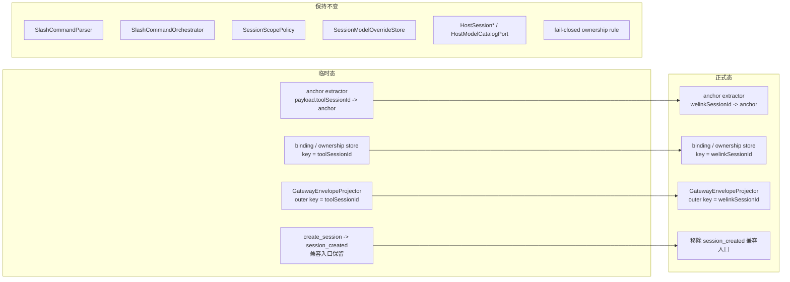

# Message Bridge Slash Commands 临时接口设计

**Version:** 1.1  
**Date:** 2026-05-13  
**Status:** Draft  
**Owner:** agent-plugin maintainers  
**Related:** `./message-bridge-slash-commands-temporary-solution.md`, `./message-bridge-slash-commands-solution.md`, `./toolsessionid-dependency-analysis.md`, `../plugins/message-bridge/docs/architecture/overview.md`, `../plugins/message-bridge/docs/architecture/source-layout.md`, `../plugins/message-bridge/docs/design/interfaces/protocol-contract.md`

## 1. 文档定位

本文档基于 `message-bridge-slash-commands-temporary-solution.md`，补充 `plugins/message-bridge` 在 OpenCode 临时态下的详细接口设计。

本文档不重复上位方案中已经冻结的产品行为，而是进一步明确：

- 插件内部控制面的模块边界
- 运行时状态模型与一致性边界
- 下行 chat 入口与上行事件回流的接口职责
- slash command 回包与完成态所有权
- 后续实现时建议遵循的目录归属

本文档是临时态内部架构真源，不是对外 gateway 协议真源。

本文档额外约束一条迁移原则：

- 临时态特有的 `toolSessionId` 只能作为适配层事实存在
- 控制面核心接口优先围绕“外部会话锚点（external conversation anchor）”建模
- 切换正式方案时，应主要替换 adapter / mapper / envelope projector，而不是重写 use case

## 2. In Scope / Out of Scope / External Dependencies

### 2.1 In Scope

- 定义 OpenCode 临时态 slash command 的插件内控制面接口
- 定义 `toolSessionId`、`opencodeSessionId`、`sessionId` 的内部职责分工
- 定义普通 `chat`、slash command、上行事件回流三条链路的协作边界
- 定义会话级模型覆盖、binding、ownership、scope 的状态模型
- 给出建议目录归属，约束后续实现不要把逻辑重新散落回 `runtime` 或 `action`

### 2.2 Out of Scope

- 不改写 `message-bridge-slash-commands-temporary-solution.md` 中已冻结的外部行为
- 不新增 gateway action 或 transport message type
- 不扩展 `message-bridge-openclaw`
- 不定义具体类名、文件名必须一字不差照搬
- 不承诺运行期重启后的 binding/ownership 恢复

### 2.3 External Dependencies

- `ai-gateway` 继续通过现有 `invoke.chat` / `tool_event` / `tool_done` / `tool_error` 与插件交互
- OpenCode 宿主继续提供 `session.create`、`session.get`、`session.list`、`session.prompt`、`config.providers`、`provider.list`
- `question_reply` / `permission_reply` 的宿主 reply API 继续按交互 ID 命中，不通过当前 binding 路由

## 3. 设计目标与非目标

### 3.1 设计目标

1. 保持临时态外部协议兼容，不要求服务端理解 slash command 控制语义。
2. 将 slash command 逻辑收口到插件控制面，避免污染 `protocol` 和普通 `chat` 执行链。
3. 明确会话绑定、事件归属、模型覆盖三类状态的聚合边界，避免实现阶段混用一个状态对象承载所有职责。
4. 对上行事件采用严格 fail-closed，避免会话重绑后旧宿主 session 事件串到错误业务会话。

### 3.2 非目标

- 不在临时态提前实现正式方案的 `welinkSessionId` 单主键闭环
- 不为 slash command 新增结构化回包协议
- 不把控制面状态持久化为跨进程、跨重启能力

## 4. 与现有分层的关系

当前 `message-bridge` 已采用如下主分层：

```text
contracts -> protocol -> runtime -> usecase / action / adapter
```

临时态 slash command 继续遵守该分层，但补充如下约束：

- `contracts`
  - 不新增 slash command 专属外部协议
- `protocol`
  - 只做 `invoke.chat` 原始 payload 归一化
  - 不识别 `/new`、`/sessions` 等控制语义
- `runtime`
  - 只负责编排、发送和上行事件接线
  - 不直接承载 slash command 业务规则
- `usecase`
  - 承载 slash command 控制面业务
  - 承载 binding bootstrap、scope 解析、模型覆盖决策
- `action`
  - 继续承载普通执行型 action
  - 不重新解析 slash command

换言之，slash command 在本设计中是“控制面 use case”，不是“协议层分支”或“action 内部特判”。

## 5. 临时控制面总览

临时态中的 `invoke.chat` 统一进入如下处理链：

```text
protocol/downstream normalize invoke.chat
  -> BindingAwareChatRouter.ensureBinding()
  -> SlashCommandParser.tryParse(text)
  -> if slash:
       SlashCommandOrchestrator.execute()
     else:
       ChatUseCase.executeWithBinding()
```

该链路的核心设计点如下：

1. 普通 `chat` 和 slash command 共用同一入口前置 bootstrap。
2. slash command 只在 binding 已准备完成后才允许进入控制面。
3. reply 类 action 不复用当前 binding 路由，因此不进入该链路。
4. 上行事件回流不依赖“当前 active binding 猜测”，而是依赖 ownership 查询。

### 5.1 控制面总览图

```mermaid
flowchart LR
  RAW["raw invoke.chat"] --> NORM["protocol/downstream\nnormalize invoke.chat"]
  NORM --> EXTRACT["anchor extractor\npayload.toolSessionId -> ExternalConversationAnchor"]
  EXTRACT --> ROUTER["BindingAwareChatRouter"]
  ROUTER --> PARSER["SlashCommandParser"]
  PARSER -->|slash| ORCH["SlashCommandOrchestrator"]
  PARSER -->|normal chat| CHAT["ChatUseCase.executeWithBinding()"]

  ORCH --> PRESENTER["SlashCommandReplyPresenter"]
  PRESENTER --> COMPLETE["SlashCommandCompletionPort"]
  COMPLETE --> PROJECTOR["GatewayEnvelopeProjector"]
  CHAT --> UPSTREAM["普通 chat 完成链 / 上行事件回流"]
  UPSTREAM --> OWNERSHIP["OpencodeSessionOwnershipResolver"]
  OWNERSHIP --> PROJECTOR
  PROJECTOR --> GATEWAY["gateway.send(...)"]
```



图中有两个需要刻意保留的 seam：

- 左侧入口 seam：`anchor extractor`
- 右侧出口 seam：`GatewayEnvelopeProjector`

临时态切到正式态时，优先替换这两个 seam 以及其依赖的 key 适配，而不是重写中间控制面 use case。

## 6. 核心状态模型与一致性边界

### 6.0 `ExternalConversationAnchor`

为兼容后续正式态，控制面不直接把 `toolSessionId` 作为稳定领域概念，而是先抽象一层中性锚点。

```ts
type ExternalConversationAnchor = string;
```

约束：

- 临时态中，`ExternalConversationAnchor` 由 `payload.toolSessionId` 承载
- 正式态中，`ExternalConversationAnchor` 将由 `welinkSessionId` 承载
- `runtime` / `usecase` / `completion` 的稳定接口优先只依赖该抽象
- 只有临时态 adapter 才知道当前 anchor 实际上映射到 `toolSessionId`
- `ExternalConversationAnchor` 在领域语义上应视为稳定值对象，而不是可随意拼接或复用的裸字符串
- 业务层禁止通过字符串前缀、来源字段名或临时协议知识判断它当前来自 `toolSessionId` 还是 `welinkSessionId`
- 临时态与正式态的差异只允许出现在 extractor / mapper / projector 中

### 6.1 `ToolSessionBinding`

`ToolSessionBinding` 是临时态 binding store 的存储事实，不是控制面稳定入参。

```ts
interface ToolSessionBinding {
  anchor: ExternalConversationAnchor;
  activeOpencodeSessionId: string;
  status: 'active' | 'invalid';
}
```

约束：

- 只表示当前默认命中的宿主会话
- 不保存历史 session 集合
- 不直接保存 `modelOverride`
- 不直接保存 `projectID/workspaceID/directory`

### 6.2 `SessionModelOverride`

模型覆盖以宿主会话为主键，而不是以外部锚点为主键。

```ts
interface SessionModelOverride {
  providerId: string;
  modelId: string;
}
```

```ts
interface SessionModelOverrideStore {
  get(opencodeSessionId: string): SessionModelOverride | undefined;
  set(opencodeSessionId: string, override: SessionModelOverride): void;
  clear(opencodeSessionId: string): void;
}
```

约束：

- `/model <provider/model>` 只作用于当前 `activeOpencodeSessionId`
- `/session <id>` 切换后，读取目标会话自己的 override
- 新会话默认无 override
- 普通 `chat` 只读取当前 active session 对应的 override

### 6.3 `SessionScope`

`SessionScope` 是运行时快照，不是持久权威状态。

```ts
interface SessionScope {
  projectID?: string;
  workspaceID?: string;
  directory?: string;
}
```

约束：

- 由 `SlashCommandContextResolver` 在解析当前 active session 时动态求值
- 不长期写回 `ToolSessionBinding`
- `/sessions` 与 `/session` 的控制面范围判定基于该快照完成

### 6.4 `SessionOwnership`

`SessionOwnership` 用于上行事件归属判定。

```ts
interface SessionOwnership {
  opencodeSessionId: string;
  anchor: ExternalConversationAnchor;
  routeStatus: 'attached' | 'detached';
}
```

约束：

- `/new` 或 `/session <id>` 重绑后，旧 `opencodeSessionId` 默认转为 `detached`
- 只有 `attached` 的 ownership 允许上行事件回流
- detached session 继续产生事件时，插件必须丢弃上送，不做猜测性归属

### 6.5 `SlashCommandContext`

```ts
interface SlashCommandContext {
  anchor: ExternalConversationAnchor;
  activeOpencodeSessionId?: string;
  scope?: SessionScope;
  modelOverride?: SessionModelOverride;
  bootstrapSource:
    | 'existing_binding'
    | 'bootstrap_reused_recent_session'
    | 'bootstrap_created';
}
```

它回答四个问题：

- 当前默认命中的宿主会话是谁
- 当前控制面范围是什么
- 当前会话是否已有模型覆盖
- 本次上下文是复用旧 binding、复用宿主最近活跃会话，还是刚 bootstrap 新会话

## 7. 内部服务接口设计

### 7.1 `ToolSessionBindingStore`

职责：

- 维护 `anchor -> activeOpencodeSessionId`
- 标记 binding `active` / `invalid`
- 支持 bootstrap、重绑、失效

建议接口：

```ts
interface ToolSessionBindingStore {
  get(anchor: ExternalConversationAnchor): ToolSessionBinding | undefined;
  bind(anchor: ExternalConversationAnchor, opencodeSessionId: string): ToolSessionBinding;
  invalidate(anchor: ExternalConversationAnchor): void;
}
```

临时态适配说明：

- 当前临时态实现中，`anchor` 实际等于 `toolSessionId`
- 正式态切换时，该 store 的主键来源切为 `welinkSessionId`
- use case 不应感知这一差异

### 7.2 `OpencodeSessionOwnershipResolver`

职责：

- 维护 `opencodeSessionId -> anchor` 的当前事件归属
- 为上行事件回流提供 fail-closed 查询

建议接口：

```ts
interface OpencodeSessionOwnershipResolver {
  attach(opencodeSessionId: string, anchor: ExternalConversationAnchor): void;
  detach(opencodeSessionId: string): void;
  resolveAttachedAnchor(opencodeSessionId: string): ExternalConversationAnchor | undefined;
}
```

这里的稳定职责是“解析外部锚点”，不是“返回 `toolSessionId`”。

### 7.2.1 Binding / Ownership 一致性边界

`ToolSessionBindingStore` 与 `OpencodeSessionOwnershipResolver` 虽然是两个 port，但它们共同服务于同一个“会话路由聚合”。

该聚合的领域不变量是：

- 一个 `anchor` 同时最多只允许一个 active `opencodeSessionId`
- 一个允许上行回流的 `opencodeSessionId` 同时最多只允许归属一个 attached `anchor`
- 显式切换或失效处理时，binding 与 ownership 必须在同一业务步骤内一起更新

因此后续实现必须满足：

- `/new`、`/session <id>`、binding invalidation 不允许只更新 binding 或只更新 ownership
- `usecase` 或专门的聚合协调器必须拥有这组状态变更的一致性
- `runtime` 不应散落 `bind -> attach -> detach` 的临时顺序逻辑

推荐做法：

- 由控制面 use case 或单独的路由聚合协调器统一执行“rebind + ownership rotate”
- store / resolver 继续保持小接口，不把业务判定塞进底层 adapter

### 7.3 `SlashCommandContextResolver`

职责：

- 确保当前 `anchor` 存在可用 binding
- 必要时执行 bootstrap
- 动态解析 scope
- 装配当前 session 的模型覆盖

建议接口：

```ts
interface SlashCommandContextResolver {
  resolve(anchor: ExternalConversationAnchor): Promise<SlashCommandContext>;
}
```

### 7.4 `SlashCommandParser`

职责：

- 将原始文本识别为 slash command
- 只负责语法识别，不做业务校验

建议接口：

```ts
type SlashCommand =
  | { kind: 'new' }
  | { kind: 'sessions' }
  | { kind: 'session'; sessionId: string }
  | { kind: 'models' }
  | { kind: 'model'; providerId: string; modelId: string };

interface SlashCommandParser {
  tryParse(text: string): SlashCommand | undefined;
}
```

### 7.5 `SlashCommandOrchestrator`

职责：

- 接收已解析命令和上下文
- 调用具体控制面 use case
- 交给 presenter / completion port 生成最终回包

建议接口：

```ts
interface SlashCommandOrchestrator {
  execute(input: {
    command: SlashCommand;
    context: SlashCommandContext;
    anchor: ExternalConversationAnchor;
  }): Promise<void>;
}
```

### 7.6 宿主访问 Port

```ts
interface HostSessionQueryPort {
  getSession(sessionId: string): Promise<HostSessionInfo>;
  listSessions(scope: SessionScope): Promise<HostSessionInfo[]>;
}

interface HostSessionCreationPort {
  createSession(input?: { title?: string; directory?: string }): Promise<HostSessionInfo>;
}

interface HostPromptExecutionPort {
  prompt(input: {
    sessionId: string;
    text: string;
    assistantId?: string;
    modelOverride?: SessionModelOverride;
  }): Promise<void>;
}

interface HostModelCatalogPort {
  listModels(): Promise<ModelCatalog>;
}
```

拆分原则：

- `session.create` 与 `session.prompt` 不能放进同一个胖接口
- 控制面生命周期操作与普通对话执行操作分开建模

### 7.7 `SessionScopePolicy`

职责：

- 封装“控制面严格、数据面宽松”

建议接口：

```ts
interface SessionScopePolicy {
  canSwitchTo(targetSession: HostSessionInfo, currentScope: SessionScope): boolean;
}
```

语义约束：

- `/sessions` 只展示当前 scope 内会话
- `/session <id>` 只允许切换到当前 scope 可见目标
- 普通 `chat` 对已绑定会话不做“仍在 scope 内”的二次硬校验

### 7.8 `SlashCommandReplyPresenter` 与 `SlashCommandCompletionPort`

职责拆分：

- presenter 负责生成文本
- completion port 负责按现有 transport message 类型发送

建议接口：

```ts
interface SlashCommandReplyPresenter {
  presentSuccess(result: SlashCommandResult): string;
  presentFailure(error: SlashCommandFailure): string;
}

interface SlashCommandCompletionPort {
  completeSuccess(input: {
    anchor: ExternalConversationAnchor;
    text: string;
  }): Promise<void>;
  completeFailure(input: {
    anchor: ExternalConversationAnchor;
    text: string;
  }): Promise<void>;
}
```

### 7.9 外层 Envelope 抽象

为避免 slash command completion 与普通上行事件各自维护一套外层锚点映射，统一补一个 envelope projector seam。

```ts
interface GatewayEnvelopeProjector {
  projectToolEvent(input: {
    anchor: ExternalConversationAnchor;
    event: unknown;
  }): GatewaySendPayload;
  projectToolDone(input: {
    anchor: ExternalConversationAnchor;
  }): GatewaySendPayload;
  projectToolError(input: {
    anchor: ExternalConversationAnchor;
    text: string;
  }): GatewaySendPayload;
}
```

约束：

- slash command completion 通过该 projector 生成 `tool_event` / `tool_done` / `tool_error`
- 普通上行事件回流也通过该 projector 生成外层 envelope
- 临时态到正式态切换时，外层锚点字段映射集中在这里替换
- `GatewayEnvelopeProjector` 只负责 envelope 形状投影，不负责业务判定、不负责发送、副作用或状态更新
- “何时发送 `tool_done` / `tool_error`” 仍属于控制面 completion 语义，而不是 projector 语义
- “事件是否允许回流” 仍属于 ownership fail-closed 判定，而不是 projector 语义

## 8. 下行处理链路

### 8.1 `BindingAwareChatRouter`

该组件是普通 `chat` 与 slash command 的公共入口协调者。

职责：

- 读取下行协议中的外部锚点，并归一化为 `ExternalConversationAnchor`
- 通过 `SlashCommandContextResolver` 确保 binding 存在
- 将结果分发给 slash control-plane 或普通 `ChatUseCase`

它不负责：

- slash 命令语法解析
- slash 命令业务执行
- 上行事件归属判定

### 8.2 普通 `chat`

普通 `chat` 路径只复用 binding 解析结果：

1. 确保当前 `anchor` 已有 active session
2. 读取当前 active session 的 `modelOverride`
3. 调用 `HostPromptExecutionPort.prompt(...)`
4. 后续 completion 仍走现有普通 chat 完成链

### 8.3 slash command

slash command 路径固定如下：

1. 解析 slash 语法
2. 执行控制面 use case
3. 生成文本正文
4. 发送 `tool_event`
5. 发送 `tool_done`

reply 类 action 明确不进入该链：

- `question_reply`
- `permission_reply`

## 9. 上行事件归属与 fail-closed 路由

这是临时态下最关键的架构约束之一。

### 9.1 归属查询规则

上行事件到达 runtime 后：

1. 从宿主事件事实中提取 `opencodeSessionId`
2. 调用 `OpencodeSessionOwnershipResolver.resolveAttachedAnchor(opencodeSessionId)`
3. 只有命中 attached ownership，才允许交给 `GatewayEnvelopeProjector` 投影并上送 gateway

### 9.2 丢弃规则

以下场景必须直接丢弃上送：

- 当前 `opencodeSessionId` 没有 ownership
- ownership 已是 `detached`
- 当前归属存在歧义或无法明确解析

禁止行为：

- 按最近一次 binding 猜测回流
- 按当前 active binding 猜测回流
- 用 `session.list` 结果回推归属

### 9.3 重绑后的行为

- `/new` 成功后：
  - 新 session attach 到当前 `anchor`
  - 旧 active session detach
- `/session <id>` 成功后：
  - 目标 session attach 到当前 `anchor`
  - 原 active session detach

这样可以保证：

- 当前业务会话只允许一个 active 宿主会话继续回流
- 旧宿主会话即使继续产生日志或事件，也不会串回当前业务会话

## 10. 回包与完成态设计

### 10.1 slash command 成功

slash command 成功时必须由控制面唯一负责：

1. `SlashCommandReplyPresenter.presentSuccess(...)`
2. `SlashCommandCompletionPort.completeSuccess(...)`
3. `completeSuccess()` 内部通过 `GatewayEnvelopeProjector` 先投影 `tool_event`
4. 再投影 `tool_done`

### 10.2 slash command 失败

slash command 失败时：

1. `SlashCommandReplyPresenter.presentFailure(...)`
2. `SlashCommandCompletionPort.completeFailure(...)`
3. `completeFailure()` 内部通过 `GatewayEnvelopeProjector` 投影 `tool_error`

### 10.3 与 `ToolDoneCompat` 的边界

必须明确：

- slash command 不接入现有 `ToolDoneCompat` 的 prompt completion dedupe 语义
- runtime 通用普通 chat 完成路径不得为 slash command 再补发一次 `tool_done`
- slash command 的 `tool_done` 所有者只能是控制面 completion port

## 11. 失败语义与恢复策略

### 11.1 bootstrap

- `invoke.chat` 无 binding 时自动按当前 `anchor` bootstrap 创建新会话
- bootstrap 只建立插件内 binding/ownership
- bootstrap 不上送 `session_created`

### 11.2 binding 失效

当宿主明确返回“session 不存在”或“session 不可用”：

1. `ToolSessionBindingStore.invalidate(anchor)`
2. `OpencodeSessionOwnershipResolver.detach(activeOpencodeSessionId)`
3. 再对当前请求回 `tool_error`

### 11.3 失效后的后续行为

- 下一次普通 `chat` 重新走 bootstrap
- `/sessions` 可继续返回当前 scope 可见列表，但不标 `（当前）`
- `/session <id>` 仍必须只允许切换到当前 scope 可见目标

### 11.4 模型覆盖与失败恢复

- 失效当前 session 后，不自动迁移其 override 到新 bootstrap session
- 新 bootstrap session 默认无 override
- `/session <id>` 切换到其他已存在 session 时，只读取目标 session 自己的 override

## 12. 建议目录归属

建议按以下方向实现，避免职责漂移：

- `src/contracts/`
  - 不新增 slash command 专属对外协议
- `src/protocol/downstream/`
  - 保持 `invoke.chat` 归一化
- `src/runtime/`
  - `BindingAwareChatRouter`
  - `SlashCommandCompletionPort` 的 runtime 发送实现
  - `GatewayEnvelopeProjector`
  - 上行事件 ownership 查询与 fail-closed 发送编排
- `src/usecase/`
  - `EnsureToolSessionBindingUseCase`
  - `ResolveSlashCommandContextUseCase`
  - `SlashCommandOrchestrator`
  - `ListScopedSessionsUseCase`
  - `SwitchScopedSessionUseCase`
  - `CreateAndRebindSessionUseCase`
  - `SetSessionModelOverrideUseCase`
- `src/port/`
  - `ToolSessionBindingStore`
  - `SessionModelOverrideStore`
  - `OpencodeSessionOwnershipResolver`
  - `HostSessionQueryPort`
  - `HostSessionCreationPort`
  - `HostPromptExecutionPort`
  - `HostModelCatalogPort`
  - `SessionScopePolicy`
- `src/adapter/`
  - OpenCode SDK adapter
  - 临时态 anchor extractor（`payload.toolSessionId -> ExternalConversationAnchor`）
  - 内存态 binding / ownership / override store
- `src/session/`
  - 仅在已有明确 session 聚合位置时承接值对象或 helper
  - 不新建无边界杂项层

按 Ports and Adapters 视角补充说明：

- primary adapters
  - `BindingAwareChatRouter`
  - slash command completion 的 runtime 接线
- secondary adapters
  - OpenCode SDK adapter
  - binding / ownership / override store
  - `GatewayEnvelopeProjector`

约束：

- primary adapter 负责接收外部输入并触发 use case
- secondary adapter 负责实现 port，不拥有业务规则

## 13. 测试与验收口径

### 13.1 与插件 PRD 的差异登记

`plugins/message-bridge/docs/product/prd.md` 当前仍将“slash 命令体系”列为 Out of Scope。

因此本文档对插件实现范围的补充，应按“临时范围例外”理解，而不是对 PRD 结论的静默改写。当前差异只限以下三项：

1. 在 `plugins/message-bridge` 内新增临时态 slash command 控制面。
2. slash command 成功路径复用现有 `tool_event + tool_done` 完成语义，但不新增 transport message type。
3. 插件内部以 `ExternalConversationAnchor` 抽象控制面入参，临时态再投影回 `toolSessionId`。

上述差异都不改变本文已冻结的外部兼容前提：

- 不新增 gateway action
- 不新增 transport message type
- 首次 `create_session -> session_created` 继续保留
- 临时态外部锚点继续由 `payload.toolSessionId` 承载

后续实现至少覆盖以下场景：

1. 首次 `create_session -> session_created` 继续成立。
2. 首条普通 chat 在无 binding 时自动 bootstrap。
3. 首条消息是 `/new` 时允许 bootstrap 后立即重绑。
4. `/sessions` 只列当前 `project/workspace` 范围。
5. `/session <id>` 对越界目标返回固定失败文案。
6. `/model <provider/model>` 只影响目标 `opencodeSessionId`。
7. `/session` 切换后不继承来源会话的模型覆盖。
8. 普通 chat 对当前 active session 带上该 session 自身的 `modelOverride`。
9. 宿主返回 session 不存在时，binding invalid 且 ownership detached。
10. binding invalid 后下一次普通 chat 重新 bootstrap。
11. 旧 detached session 的上行事件不会回流 gateway。
12. 当前 attached session 的上行事件可以正常回流 gateway。
13. `question_reply` / `permission_reply` 不受 slash command 切会话影响。
14. slash command 成功走 `tool_event + tool_done`。
15. slash command 失败走 `tool_error`。
16. slash command 不新增 gateway action 或新的 transport message type。

### 13.2 最低验证门禁

若进入实际编码阶段，建议至少遵守以下验证门禁：

1. 每个行为先写失败测试，再补最小实现。
2. 每完成一类行为，至少运行受影响测试，不以“最终一次性联跑”替代过程校验。
3. 合并前至少执行：
   - `pnpm --dir plugins/message-bridge run test:unit`
   - `pnpm --dir plugins/message-bridge run test:integration`
   - `pnpm --dir plugins/message-bridge run typecheck`
4. 若最终改动越过 `plugins/message-bridge` 边界，或触达共享包，再追加 `pnpm verify:workspace`。

不应宣称完成的情形包括：

- 只补实现，没有先写失败测试
- 只跑单测，没有跑 `typecheck`
- slash command 成功链路仍复用普通 `ToolDoneCompat`
- 上行事件仍按“当前 active binding 猜测”决定归属

## 14. 与正式态迁移的兼容边界

### 14.1 临时态到正式态迁移对照图



这张图表达的不是“整体重构”，而是“替换入口/出口适配层，保留中间控制面核心”。

本文档只定义 OpenCode 临时态控制面。

迁移到正式态时，以下结论可以保留：

- slash command 由插件控制面处理，而不是服务端处理
- 模型覆盖属于会话级状态，而不是外部锚点级状态
- 上行事件需要明确 ownership，不能猜测归属
- `protocol` 层不承担 slash command 业务语义

迁移到正式态时，以下领域语义也应保持不变：

- `ExternalConversationAnchor` 仍是控制面唯一外部会话锚点抽象
- binding + ownership 仍属于同一个会话路由一致性边界
- scope 仍是运行时快照，而不是长期持久状态
- slash command success/failure 仍通过统一 completion 语义收口

迁移到正式态时，以下点需要替换：

- 临时态 anchor extractor 从 `payload.toolSessionId` 切为 `welinkSessionId`
- binding store 的 key 来源从 `toolSessionId` 切为 `welinkSessionId`
- ownership resolver 返回的外部锚点从 `toolSessionId` 语义切为 `welinkSessionId`
- `GatewayEnvelopeProjector` 的外层字段投影从 `toolSessionId` 切为 `welinkSessionId`
- 首次 `create_session -> session_created` 路径可被移除

迁移到正式态时，以下部分应保持不变：

- `SlashCommandParser`
- `SlashCommandOrchestrator`
- `SessionScopePolicy`
- `SessionModelOverrideStore`
- `HostSessionQueryPort` / `HostSessionCreationPort` / `HostPromptExecutionPort` / `HostModelCatalogPort`
- fail-closed 的 ownership 判定规则
- slash command success/failure 的控制面完成语义

因此，临时态实现时应尽量把差异隔离在：

- 下行协议到 `ExternalConversationAnchor` 的提取器
- binding / ownership store 的 key 适配
- `GatewayEnvelopeProjector` 的外层 transport 映射
- 首次建链 bootstrap 的兼容入口

而不要把 `toolSessionId` 写死到 use case、orchestrator、completion 和上行回流主链路。
