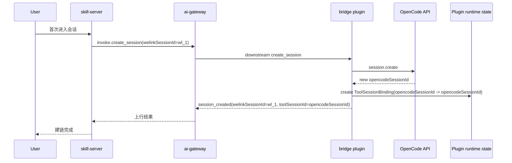
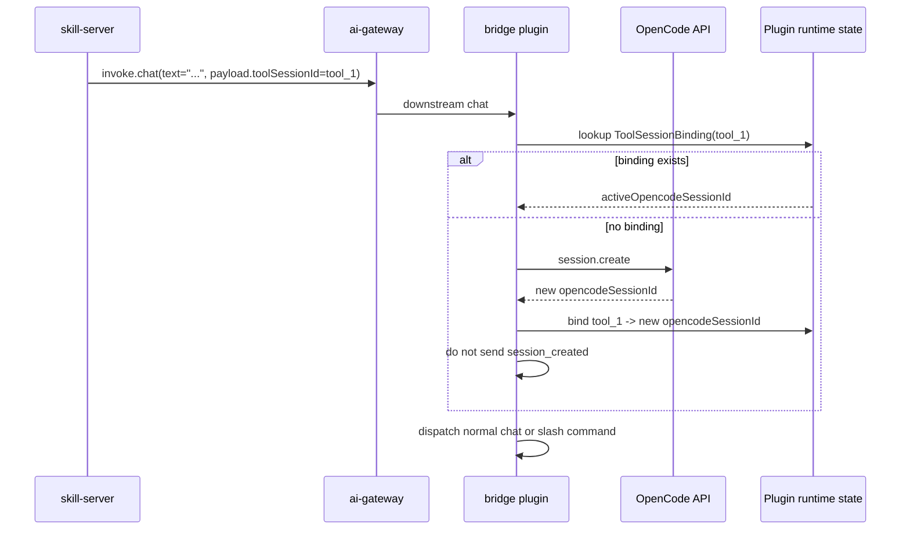
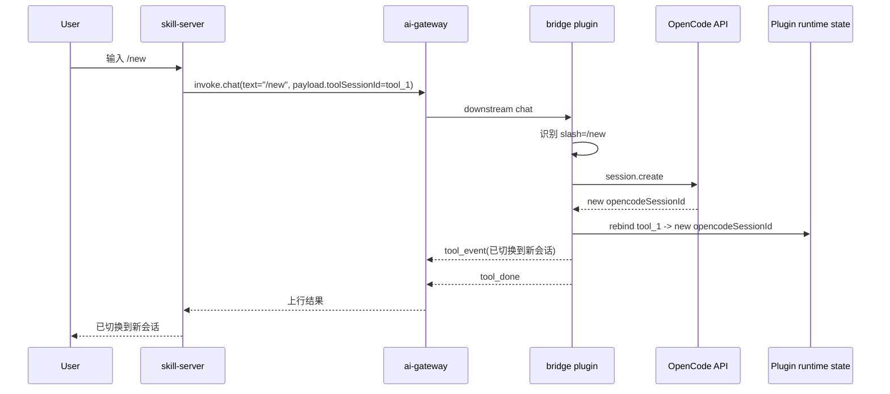
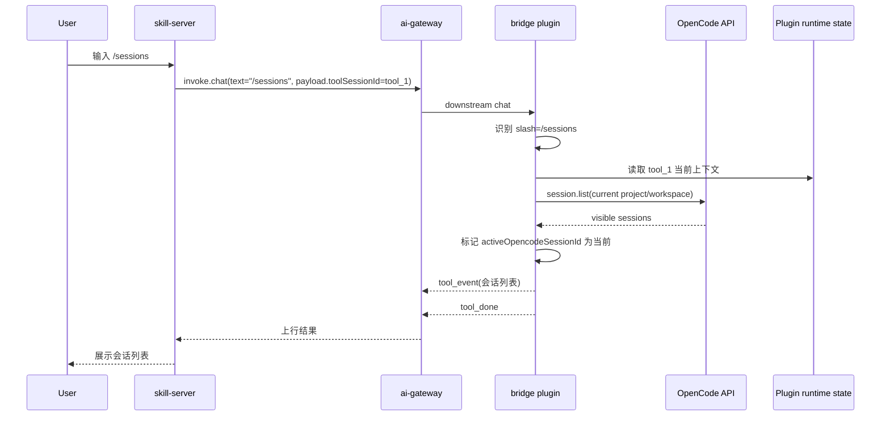
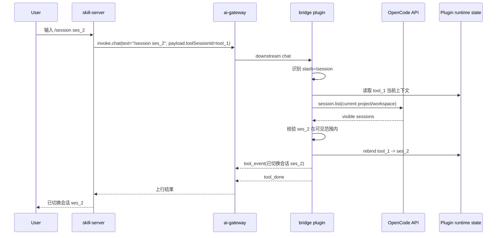
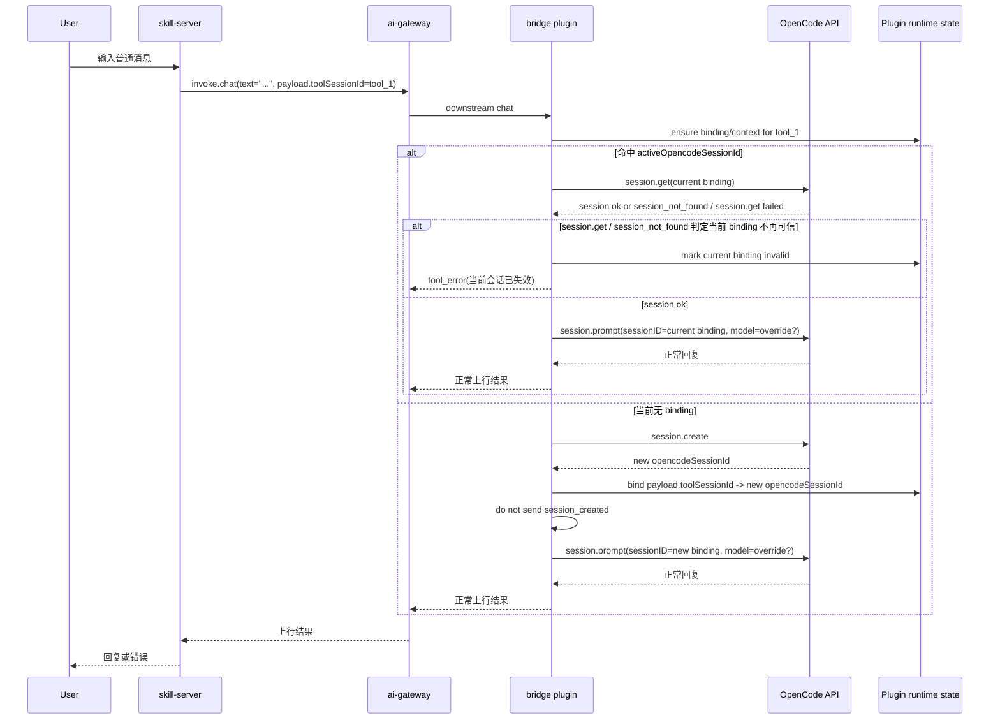
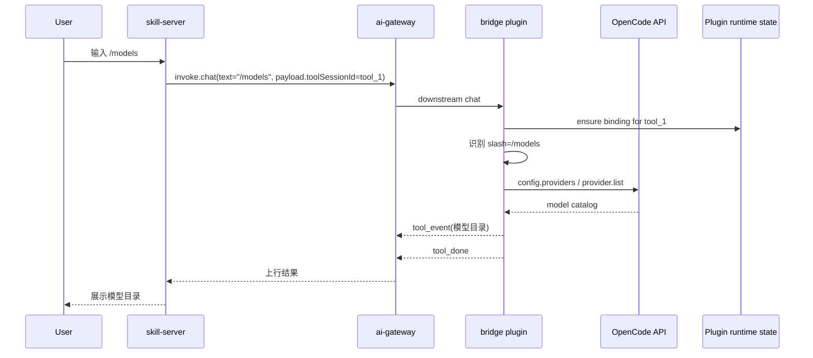
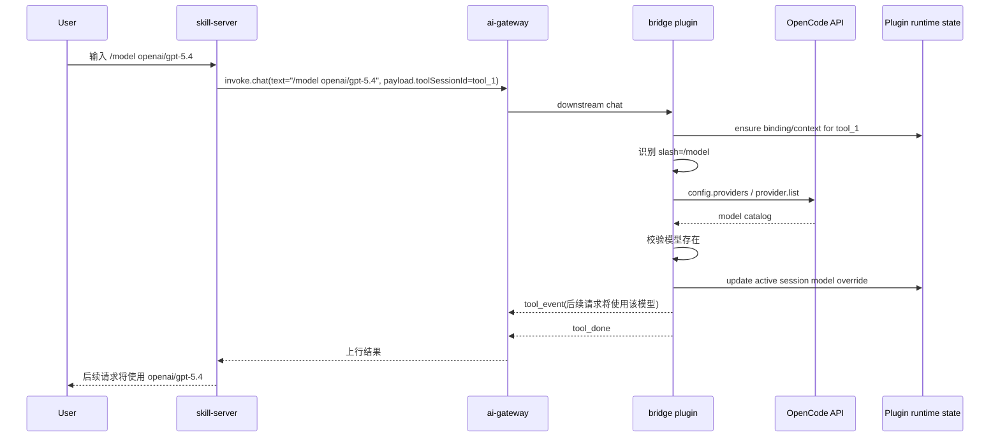
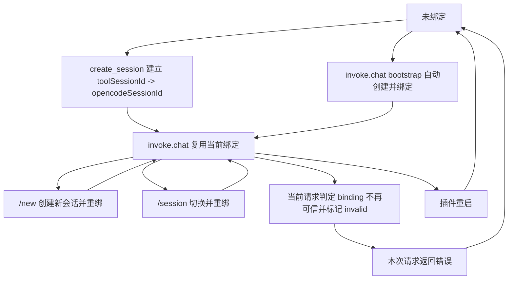

# Message Bridge Slash Commands 临时方案设计

**Version:** 1.1  
**Date:** 2026-05-14  
**Status:** Draft  
**Owner:** agent-plugin maintainers  
**Related:** `./message-bridge-slash-commands-solution.md`, `./toolsessionid-dependency-analysis.md`, `../superpowers/specs/2026-05-08-message-bridge-slash-commands-requirements.md`

## 1. 文档定位

本文档定义 `message-bridge` 在 OpenCode 场景下的 slash command 临时方案。

这份文档的目标不是替代正式方案，而是在正式方案落地前，先给出一个可联调、可实现、可验收的过渡设计。

本稿只适用于：

- `plugins/message-bridge`
- OpenCode 宿主

本稿不适用于：

- `plugins/message-bridge-openclaw`
- 正式态 `welinkSessionId` 单标识闭环设计

本文的核心前提是：

- 服务端不做 `welinkSessionId` 路由改造
- 插件侧完成 slash command 闭环
- 首次建链继续保留现有 `create_session -> session_created`

## 2. 背景与目标

正式方案的目标态已经明确：

- 插件与服务端之间统一只使用 `welinkSessionId` 作为唯一业务会话标识
- 插件独占宿主会话绑定、切换与模型覆盖控制

但在当前阶段，服务端侧仍保留基于 `toolSessionId` 的现有会话交互心智，短期内不做 `welinkSessionId` 路由改造。因此需要一个过渡态，保证以下目标同时成立：

1. 五个 slash command 在插件侧闭环：
   - `/new`
   - `/sessions`
   - `/session <sessionId>`
   - `/models`
   - `/model <providerId/modelId>`
2. 首次建链继续兼容现有 `create_session -> session_created`
3. 服务端不参与 slash command 触发的新会话切换
4. 普通 `chat` 与 slash command 的当前上下文统一由插件内部维护

## 2.1 与正式方案差异

除本节明确列出的差异外，临时方案默认与正式方案保持一致。

仅保留以下 3 个主差异：

1. 会话绑定主键不同
   - 正式方案：`welinkSessionId -> opencodeSessionId`
   - 临时方案：`toolSessionId -> opencodeSessionId`
2. 首次建链协议不同
   - 正式方案：不再保留 `create_session -> session_created`
   - 临时方案：继续保留 `create_session -> session_created`
3. 上下行外部锚点不同
   - 正式方案：围绕 `welinkSessionId`
   - 临时方案：围绕 `toolSessionId`

需要明确：

- 普通 `chat` 的默认行为不是差异点
- `invoke.chat` 无 binding 时的 bootstrap 行为不是差异点
- `question_reply` / `permission_reply` 的命中方式不是差异点

## 3. 适用范围

### 3.1 In Scope

- 定义 `message-bridge` / OpenCode 的 slash command 过渡态
- 明确临时态中 `toolSessionId`、`sessionId`、`opencodeSessionId` 的职责边界
- 明确首次建链、后续重绑、普通 chat 路由、模型覆盖的插件侧规则
- 明确服务端在临时态下的最小职责
- 定义临时态迁移到正式态时必须保持稳定的对外行为

### 3.2 Out of Scope

- 不改写正式方案的最终目标
- 不要求服务端新增 `welinkSessionId` 路由能力
- 不要求 `message-bridge-openclaw` 在本轮同步采用该临时态
- 不定义具体代码文件、类名、存储实现细节
- 不承诺 `toolSessionId -> opencodeSessionId` 跨重启恢复

## 4. 临时态标识模型

临时态中存在三层标识，但职责与正式态不同。

### 4.1 `toolSessionId`

`toolSessionId` 是临时方案中的唯一插件侧业务锚点。

它承担以下职责：

- 首次 `create_session/session_created` 建链后的外部锚点
- 后续普通 `chat` 的当前上下文入口
- slash command 的当前上下文入口
- 当前会话模型策略的上下文锚点

约束如下：

- `toolSessionId` 在当前运行期内稳定复用
- 首次 `create_session` 建链时，`toolSessionId` 可以直接取新建 `opencodeSessionId`
- 后续 `invoke.chat` 已携带 `payload.toolSessionId` 时，插件必须保留该外部锚点
- `/new` 不会生成新的 `toolSessionId`
- `/new` 或 `/session <sessionId>` 重绑后，不保证 `toolSessionId` 等于当前 `activeOpencodeSessionId`

这是一条 OpenCode 临时态规则，不改变公共接口中 `toolSessionId` 与宿主内部会话 ID 不要求相同的一般约束。

### 4.2 `sessionId`

`sessionId` 是 slash command 面向用户暴露的宿主会话选择标识。

在 OpenCode 场景中：

- `sessionId` 等同于 `opencodeSessionId`

它只用于：

- `/sessions` 返回结果展示
- `/session <sessionId>` 参数输入
- slash command 成功文案中的用户可读会话标识

它不进入服务端与插件之间的桥接协议。

### 4.3 `opencodeSessionId`

`opencodeSessionId` 是插件内部真实宿主会话 ID。

它只用于：

- 调用 OpenCode `session.create`
- 调用 OpenCode `session.list`
- 调用 OpenCode `session.get`
- 调用 OpenCode `session.prompt`
- 作为插件内当前激活宿主会话的真实目标

### 4.4 `welinkSessionId` 的临时态边界

临时态中，`welinkSessionId` 不承担插件内会话路由职责。

它可以继续存在于现有兼容协议 envelope 中，包括：

- `create_session` 下行
- `session_created` 上行
- 后续既有普通消息链路中的兼容字段

进入普通 `chat` 与 slash command 控制面后：

- 插件内部不再依赖 `welinkSessionId` 做会话选择
- 插件内部不再依赖 `welinkSessionId` 做模型覆盖上下文选择
- 不允许 `welinkSessionId` 与 `toolSessionId` 双主键并行路由

这意味着：

- 正式方案中的“插件与服务端统一只使用 `welinkSessionId` 作为唯一会话标识”不适用于本文
- 本文只定义一个过渡期可运行方案，而不是正式态协议收口方案

## 5. 运行时概念

为降低实现歧义，临时态引入两个运行时概念。

### 5.1 `ToolSessionBinding`

`ToolSessionBinding` 表示一个 `toolSessionId` 在插件内维护的当前会话上下文。

建议至少包含以下信息：

- `toolSessionId`
- `activeOpencodeSessionId`
- `projectID?`
- `workspaceID?`
- `directory?`

其中：

- `activeOpencodeSessionId` 是当前普通 chat 与控制命令默认命中的宿主会话
- `projectID/workspaceID/directory` 用于 `/sessions` 与 `/session` 的控制面范围判定

`modelOverride` 在语义上归属于当前 active session 的后续请求模型策略。
实现上可以作为 binding 的一部分维护，也可以按 `activeOpencodeSessionId`
独立存储；本文只约束其外部行为，不约束具体内存结构。

`ToolSessionBinding` 只维护当前上下文，不维护 `toolSessionId -> [opencodeSessionId]` 历史列表。

宿主会话目录仍以 OpenCode `session.list` 返回为准，插件不得用本地历史 binding 缓存替代 `/sessions` 的目录来源。

### 5.2 `SlashCommandContext`

`SlashCommandContext` 表示插件基于 `toolSessionId` 解析出的当前宿主上下文。

它至少需要支持回答以下问题：

- 当前激活的宿主会话是谁
- 当前会话属于哪个 `project/workspace`
- 当前 slash command 应该作用于哪个宿主会话
- 当前是否存在模型覆盖

## 6. 首次建链与后续重绑

### 6.1 首次建会话继续保留现有链路

首次对话仍保留现有 `create_session -> session_created`。
时序语义如下：

1. 服务端下发 `create_session`
2. 插件创建 OpenCode 会话
3. 插件得到新的 `opencodeSessionId`
4. 插件可以直接使用该 `opencodeSessionId` 作为首次上送的 `toolSessionId`
5. 插件上行 `session_created { welinkSessionId, toolSessionId }`
6. 插件建立 `toolSessionId -> opencodeSessionId` 映射

需要明确：

- 服务端只在首次建链时接收 `toolSessionId`
- 服务端不负责 slash command 触发的新会话切换
- 服务端不负责宿主会话绑定回写
- 只有服务端显式下发 `create_session` 的路径会上送 `session_created`

### 6.2 `/new` 采用重绑，而非重建锚点

`/new` 在临时态中的语义是：

- 创建新的宿主会话
- 把当前 `toolSessionId` 重绑到新的 `opencodeSessionId`

硬约束如下：

- `/new` 不生成新的 `toolSessionId`
- `/new` 不再次触发服务端侧 `create_session/session_created`
- `/new` 只更新插件内 `ToolSessionBinding.activeOpencodeSessionId`

因此，`/new` 后的系统行为是：

- 服务端继续透传原有 `toolSessionId`
- 插件把后续普通 `chat` 落到新的宿主会话
- 原宿主会话历史保留，但不再是当前默认命中目标

## 7. `invoke.chat` 路由与绑定规则

临时态下，普通 `chat` 与 slash command 共用 `invoke.chat` 下行入口。

插件在执行普通 chat 或 slash command 前，先以 `payload.toolSessionId` 为外部锚点确保当前 binding 存在。

### 7.1 Binding bootstrap

收到 `invoke.chat` 后，插件在执行普通 `chat` 或 slash command 前，先完成
binding bootstrap，确保当前 `payload.toolSessionId` 已解析出可用的
`activeOpencodeSessionId`。这是运行时前置条件，不要求固定实现顺序；
实现可以先解析命令，也可以先解析上下文，只要命令真正执行前已经拿到
当前上下文即可。

当前实现下，插件按以下逻辑处理：

1. 从 `payload.toolSessionId` 读取业务锚点
2. 用该 `toolSessionId` 查询本地 `ToolSessionBinding`
3. 若存在有效 `activeOpencodeSessionId`，则复用该 binding
4. 若当前无 binding，或 binding 已标记为 `invalid`，则插件创建新的 OpenCode 会话
5. 插件建立 `payload.toolSessionId -> new opencodeSessionId` binding
6. binding 准备完成后，再执行普通 chat 或 slash command 分发

该 bootstrap 规则适用于：

- 普通 chat
- `/new`
- `/sessions`
- `/session <sessionId>`
- `/models`
- `/model <providerId/modelId>`

需要明确：

- 自动补建 binding 不改变外部 `payload.toolSessionId`
- 自动补建 binding 不上送 `session_created`
- 即使首条消息是 slash command，先补建 binding 产生一个临时宿主会话也是允许行为
- `/new` 和 `/session <sessionId>` 后续仍可继续创建或切换目标会话，并覆盖当前 `activeOpencodeSessionId`

### 7.2 禁止项

`invoke.chat` 路由中必须禁止以下行为：

- 不把下行 `toolSessionId` 当作宿主会话 ID 直接使用
- 不允许 `welinkSessionId` 与 `toolSessionId` 双主键并行路由
- 不允许隐式回退到“最近一次会话”或其他猜测性目标

### 7.3 失败语义

当 `toolSessionId` 当前无 binding 时，`invoke.chat` 不报错，而是直接创建新会话并建立绑定。

临时态允许该绑定在插件重启后失效；失效后下一次 `invoke.chat` 回到“当前无 binding 时自动创建新会话并建立绑定”的逻辑。

当当前 active binding 指向的宿主 session 在本次请求中被实现判定为“不再可信”时，本次请求先返回错误，并将当前 `toolSessionId` 对应的 binding 标记为 `invalid`。

当前实现中，这里的“不再可信”不是泛指任意请求失败，而是以下可验证信号：

- 宿主明确返回 `session_not_found`
- 当前 active session 的 `session.get` 校验阶段失败，并被实现视为当前 binding 不再可信

需要明确：

- 这是当前实现策略，不等同于未来对“终态错误”的精细分类标准
- 本轮不承诺区分所有“终态错误”和“临时性 SDK/网络错误”
- 本轮不定义“同一次请求内自动恢复并继续执行”
- 当前 binding 失效判定只覆盖 `session_not_found` 与 `session.get` 校验失败，不把其他“会话不可用”表述泛化为既成实现事实

绑定失效后：

- 本次请求直接返回错误，且在请求结束前将 binding 标记为 `invalid`
- 下一次 `invoke.chat` 或 slash 重新进入“无有效 binding 的恢复逻辑”：先尝试复用 `session.list` 返回的最近活跃会话；列表为空时才自动创建新会话并建立绑定
- 只有本次请求已成功完成上下文解析时，`/sessions` 才进入当前 `project/workspace` 范围内的列目录逻辑
- `（当前）` 只表示当前有效 `active binding`，不表示宿主列表中的最近活跃会话
- 当 active binding 已失效且本次请求未重新 bootstrap 时，`/sessions` 不标任何 `（当前）`
- 本轮仍不定义“同一次请求内自动恢复并继续执行”；恢复只发生在下一次重新进入上下文解析时

### 7.4 `question_reply` / `permission_reply` 不走当前绑定

临时方案中，`toolSessionId -> activeOpencodeSessionId` 只用于以下“当前上下文类”请求：

- 普通 `chat`
- slash command
- 当前会话模型覆盖

`question_reply` 与 `permission_reply` 不属于“当前上下文类”请求，不走 `toolSessionId -> activeOpencodeSessionId` 当前绑定路由。

这两类回复直接按宿主挂起交互 ID 命中宿主 reply API：

- `question_reply` 使用 `questionId`
- `permission_reply` 使用 `permissionId`

因此：

- 二者都不依赖 `toolSessionId` 作为 reply 命中依据
- slash command 的会话切换不得改变已挂起 `question` / `permission` 的归属
- `/new` 或 `/session <sessionId>` 只影响后续普通 `chat` 与控制命令的默认命中目标
- 已挂起交互的回复闭环继续按宿主交互 ID 命中，不受当前 active session 变化影响

在 OpenCode 已保证 `questionId`、`permissionId` 全局唯一且宿主 reply API 可直接按 ID 回复的前提下，插件无需为了 reply 路由额外维护 `questionId -> originOpencodeSessionId` 或 `permissionId -> originOpencodeSessionId` 映射。

## 8. Slash Command 控制面边界

临时态统一采用：

- 控制面严格
- 数据面宽松

### 8.1 控制面严格

控制面严格是指：

- `/sessions` 只展示当前 `project/workspace` 范围内可切换会话
- `/session <sessionId>` 只允许切换到 `/sessions` 当前可见范围内的目标
- 超出当前显式可切换范围时，必须返回固定失败文案

该设计的目的不是“尽量放宽切换”，而是确保：

- slash command 的显式切换行为与 OpenCode 当前可见范围一致
- 插件不会通过临时态绕过宿主已有作用域边界

### 8.2 数据面宽松

数据面宽松是指：

- 对已绑定会话的后续普通 `chat`，不额外做一次“必须仍在当前 `/sessions` 范围内”的硬校验
- 普通对话连续性优先于一次性的列表范围变化

当前绑定只在以下场景失效或被覆盖：

- 宿主明确返回会话不存在
- 宿主明确返回会话不可用
- 用户执行新的显式控制命令，如 `/new` 或 `/session <sessionId>`

### 8.3 `/new`

`/new` 的控制语义如下：

- 执行命令前先按 `payload.toolSessionId` 完成 binding bootstrap
- 由插件创建新宿主会话
- 创建成功后立即更新当前 `toolSessionId` 的 `activeOpencodeSessionId`
- 后续普通 `chat` 默认进入该新会话
- 若首条消息就是 `/new`，bootstrap 产生的临时宿主会话可以被随后新建的会话覆盖

### 8.4 `/sessions`

`/sessions` 的控制语义如下：

- 执行命令前先按 `payload.toolSessionId` 完成 binding bootstrap
- 返回当前 `project/workspace` 范围内可显式切换的会话目录
- 当前 `activeOpencodeSessionId` 必须带 `（当前）` 标记
- 至少返回可用于 `/session <sessionId>` 的宿主会话 ID

### 8.5 `/session <sessionId>`

`/session <sessionId>` 的控制语义如下：

- 执行命令前先按 `payload.toolSessionId` 完成 binding bootstrap
- 目标 `sessionId` 必须在当前显式可切换范围内
- 切换成功后，更新当前 `toolSessionId` 的 `activeOpencodeSessionId`
- 切换结果对后续普通 `chat` 立即生效
- 若首条消息就是 `/session <sessionId>`，bootstrap 产生的临时宿主会话可以被目标会话覆盖

若目标不在当前范围内，必须使用正式方案已定义的固定失败文案：

```text
切换会话失败, 目标会话不在当前 project/workspace 可切换范围内
```

## 9. 模型命令

模型命令在临时态中仍由插件控制，但行为语义与正式方案保持一致。

### 9.1 `/models`

`/models` 的语义不变：

- 返回宿主模型目录
- 面向用户统一展示 `providerId/modelId`

临时态下，它读取的是：

- 命令执行前已按 `payload.toolSessionId` 完成 binding bootstrap
- OpenCode 宿主的全局模型目录

需要明确：

- `/models` 仍复用当前 `toolSessionId` 的统一控制面入口
- 当前实现中，模型目录查询结果本身不随当前 session/scope 变化
- 若未来宿主支持 session-aware 模型视图，再单独扩展；当前临时方案不承诺这类能力

### 9.2 `/model <providerId/modelId>`

`/model <providerId/modelId>` 的语义不变：

- 记录当前会话上下文的后续请求模型策略
- 不修改宿主默认模型
- 不影响其他会话上下文

在实现语义上：

- 命令执行前先按 `payload.toolSessionId` 完成 binding bootstrap
- 插件把模型覆盖写入当前 active session 对应的模型覆盖存储
- 后续普通 `chat` 对当前 `activeOpencodeSessionId` 立即带上该覆盖
- 切换到其他 active session 后，不自动继承原会话 override

## 10. 临时态时序图

本章补充临时态下 OpenCode / `message-bridge` 的关键时序图。

除 slash command 本身外，额外补充：

- 首次 `create_session -> session_created`
- `invoke.chat` 入口 binding bootstrap
- 普通 `chat`

原因是这些链路共同决定了临时态的 `toolSessionId -> activeOpencodeSessionId` 绑定如何建立、复用与覆盖。

### 10.1 首次 `create_session -> session_created`

首次建链继续保留现有协议。插件创建 OpenCode 会话后，可以直接使用新建的 `opencodeSessionId` 作为首次上送给服务端的 `toolSessionId`。



### 10.2 `invoke.chat` 入口 binding bootstrap

普通 chat 与所有 slash command 都先经过同一套 binding bootstrap。这里的
bootstrap 指：在命令真正执行前，先确保当前 `payload.toolSessionId` 已解析出
可用的 `activeOpencodeSessionId`。若 `payload.toolSessionId` 当前无 binding，
或 binding 已标记为 `invalid`，插件以该外部锚点为 key 创建新的宿主会话绑定，
但不上送 `session_created`。



### 10.3 `/new`

`/new` 在临时态中只重绑当前 `toolSessionId` 的目标宿主会话，不生成新的外部锚点。

进入本命令前，插件已按 10.2 完成 binding bootstrap 与当前上下文解析。若首条消息就是 `/new`，bootstrap 产生的临时宿主会话可以被本命令新建的会话覆盖。



### 10.4 `/sessions`

`/sessions` 展示的是当前 `toolSessionId` 上下文所属 `project/workspace` 范围内的显式可切换会话。

进入本命令前，插件已按 10.2 完成 binding bootstrap 与当前上下文解析。若上下文解析阶段已因当前 active session 不再可信而失败，则本次请求直接返回错误，不进入列目录逻辑。



### 10.5 `/session <sessionId>`

`/session <sessionId>` 只允许切到当前显式可切换范围内的宿主会话，切换成功后覆盖当前 `toolSessionId` 绑定。

进入本命令前，插件已按 10.2 完成 binding bootstrap 与当前上下文解析。若首条消息就是 `/session <sessionId>`，bootstrap 产生的临时宿主会话可以被目标会话覆盖。



### 10.6 普通 `chat`

普通 `chat` 优先按当前 `toolSessionId` 绑定路由。若入口无 binding，插件已按 10.2 以 `payload.toolSessionId` 为 key 自动创建新会话并建立绑定。

若当前 active binding 在 `session.get` 校验阶段失败，或宿主明确返回
`session_not_found` 并被实现判定为当前 binding 不再可信，则本次请求返回
`tool_error`，当前 binding 在本次请求结束前被标记为 `invalid`，后续下一次请求再重新 bootstrap。



### 10.7 `/models`

`/models` 读取的是 OpenCode 宿主的全局模型目录，但不展示当前正在使用的模型。

进入本命令前，插件已按 10.2 完成 binding bootstrap。



### 10.8 `/model <providerId/modelId>`

`/model <providerId/modelId>` 记录的是当前会话上下文的后续请求模型策略，而不是宿主全局默认模型。

进入本命令前，插件已按 10.2 完成 binding bootstrap，因此模型覆盖会写入当前 active session 对应的模型覆盖存储。



### 10.9 临时态绑定生命周期

本图用于说明临时态下 `toolSessionId` 绑定如何建立、复用、被 slash command 覆盖，以及插件重启或当前请求判定 binding 不再可信后如何回到默认逻辑。



## 11. 服务端职责

临时态中，服务端职责收缩到最小集合。

服务端继续做：

- 首次建链时下发 `create_session`
- 接收 `session_created`
- 后续普通 `chat` 继续透传既有 `toolSessionId`
- 展示插件返回的 slash command 结果文本与错误

服务端不再负责：

- 解释 `toolSessionId` 对应哪个宿主会话
- 感知 `/new` 触发的新宿主会话
- 感知 `/session <sessionId>` 触发的会话切换
- 维护 `toolSessionId -> opencodeSessionId` 映射
- 新增 `welinkSessionId` 路由逻辑

需要明确：

- reply 类交互按宿主交互 ID 命中，不再依赖 `toolSessionId`
- 这条变化会带来后续代码和 schema 改造
- 临时方案中服务端继续透传 `toolSessionId`，仅用于普通 `chat` / slash command 的会话锚点，不再用于 reply

## 12. 对外接口与兼容约束

临时态中，本轮优先修正文档语义；其中 reply 类交互的目标契约需要后续代码与 schema 同步调整。

保留：

- `create_session`
- `session_created`
- `chat.payload.toolSessionId`
- `tool_event`
- `tool_done`
- `tool_error`

不新增：

- 服务端可见的会话切换字段
- slash command 专属 gateway action
- 服务端侧 `welinkSessionId` 路由改造要求

需要特别强调：

- 协议 shape 保持兼容，不代表业务语义保持不变
- `chat.payload.toolSessionId` 在临时态中是“当前业务锚点”，不是“目标宿主会话 ID”
- `question_reply` / `permission_reply` 的目标语义将从依赖 `toolSessionId` 收敛到依赖宿主交互 ID

### 12.1 Slash command 返回契约完全继承正式方案

临时方案只调整内部会话路由与上下文来源，不调整 slash command 的对外返回契约。

slash command 的以下约束完全继承正式方案 `message-bridge-slash-commands-solution.md`：

- 第 7.3 节定义的上行回复通道与消息顺序
- 第 7.4 节定义的成功/失败模板、列表格式、换行约束与固定错误文案

即：

- 成功场景仍先发送 `tool_event`，再发送 `tool_done`
- 失败场景发送 synthetic assistant failure reply，不发送 `tool_error`
- `/new`、`/sessions`、`/session`、`/models`、`/model` 的返回文本模板保持与正式方案一致
- 已知命令但参数非法时，失败文案返回命令专属用法提示，而不是泛化成“命令不受支持”
- 已知命令但参数非法的示例与正式方案保持一致，包括 `/sessions fdsfs`、`/new foo`、`/session`、`/model`、`/model openai`、`/model a/b/c`
- 当前版本的群聊判定信号唯一取 `invoke.chat.payload.imGroupId`；只有该信号存在时才允许剥离 `@xxx ` 前缀后再做 slash 三态判定
- 未知 slash 文本如 `/abc` 继续走普通 chat / LLM，不进入 slash 失败分支

实现约束补充：

- slash command 分支只允许产出受控错误码和少量结构化上下文，不直接拼接最终中文失败文案
- 用户可见失败文本必须由统一 failure policy 生成，不能直接透传 SDK 异常字符串、错误栈或未经审查的底层 `errorMessage`

## 13. 迁移出口

正式态目标仍然保持不变：

- `welinkSessionId` 成为唯一业务会话标识

因此，临时态到正式态的迁移必须遵守以下兼容约束：

- 不改 slash command 名称
- 不改 slash command 成功文案模板
- 不改 slash command 失败文案模板
- 不改会话切换与模型设置的外部语义
- 只把内部锚点从 `toolSessionId` 切换到 `welinkSessionId`

这意味着：

- 临时稿需要把用户可见交互面尽量做成正式态前置形态
- 后续迁移主要替换内部路由主键，而不是重新定义命令体验

### 13.1 后续正式方案落地变体

本节描述的是后续正式方案落地时，服务端可能采用的一种过渡实现变体。
它不是当前实现前提，也不是本文前文“当前阶段”约束的一部分。
正式方案的最终协议形态仍以 `message-bridge-slash-commands-solution.md` 为准，
本节只补充一条可能的落地路径，不替代正式方案文档本身。

该变体的触发条件是：

- 历史版本插件已经下线
- 服务端不再需要兼容旧插件对 `toolSessionId` 的旧语义依赖

在该前提下，服务端可以采用以下实现方式：

- 下行 `invoke.chat` / slash command 相关入口继续沿用 `payload.toolSessionId` 字段名
- 但该字段取值改为 `welinkSessionId`
- 服务端暂不要求同时补齐 chat/slash 顶层 `welinkSessionId` 字段

该变体的目标是：

- 在字段名尚未完成收口前，先实现正式方案要求的“插件侧单锚点会话绑定”运行语义
- 让插件与服务端之间的实际业务锚点提前收敛到 `welinkSessionId`

需要明确：

- 这属于正式方案落地路径上的过渡实现，不等于正式方案文档中定义的最终协议形态
- 它不能反向改写本文前文对“当前临时态前提”的定义
- 它也不意味着“桥接消息字段级协议已经完成收口”

对当前 `message-bridge` 实现的兼容性判断是：

- 若服务端采用该变体，当前实现仍可继续把 `payload.toolSessionId` 当作稳定外部锚点使用
- 因而从插件行为上看，普通 `chat` 与 slash command 仍可正常建立或复用 binding
- 但这仍然属于“旧字段承载新语义”，不是正式方案最终意义上的字段收口完成

最小对比如下：

- 当前临时态：`payload.toolSessionId=<临时锚点>`
- 后续落地变体：`payload.toolSessionId=<welinkSessionId>`
- 正式方案终态：桥接协议字段与业务语义都收口到 `welinkSessionId`

## 14. 测试与验收场景

临时态文档验收至少覆盖以下场景：

1. 首次 `create_session` 后，插件可以使用新建 `opencodeSessionId` 作为 `toolSessionId`，并成功回传 `session_created`
2. 普通 `invoke.chat` 当前无 binding 时，插件用 `payload.toolSessionId` 建立到新 `opencodeSessionId` 的 binding，且不上送 `session_created`
3. 首条 `/sessions`、`/models`、`/model` 当前无 binding 时，先完成 binding bootstrap，再执行命令
4. 首条 `/new`、`/session <sessionId>` 当前无 binding 时，允许先 bootstrap 产生临时宿主会话，再创建或切换目标会话
5. `/new` 后，`toolSessionId` 保持不变，仅重绑到新的 `opencodeSessionId`
6. `/session <sessionId>` 切换后，后续普通 `chat` 命中新绑定会话
7. 目标会话超出当前显式可切换范围时，`/session <sessionId>` 返回固定失败文案
8. `/sessions` 仅返回当前 `project/workspace` 范围内会话，并正确标记当前项
9. `/model` 设置后，模型覆盖写入当前 active session 对应的模型覆盖存储，后续普通 `chat` 立即使用该覆盖
10. 当当前 active binding 在 `session.get` / `session_not_found` 判定中失效时，本次请求返回错误并将 binding 标记为 `invalid`，下一次请求重新 bootstrap
11. slash command 成功继续复用 synthetic assistant reply + `tool_done`；失败继续复用 synthetic assistant reply，且不发送 `tool_error`
12. `question_reply` 使用 `questionId`、`permission_reply` 使用 `permissionId`，并明确该语义会带来后续代码与 schema 改造
13. 后续从临时态迁移到正式态时，用户可见命令文案和交互模板无需变化
14. 当历史版本插件已下线且服务端采用“`payload.toolSessionId` 继续保留字段名、但取值改为 `welinkSessionId`”的落地变体时，当前插件行为仍可兼容，但文档仍明确这不等于字段级协议收口完成

## 15. 假设与限制

- 本轮只设计 OpenCode / `message-bridge`
- 五个命令都纳入临时方案，但会话路由是主轴
- `toolSessionId` 在当前运行期内稳定可复用；首次 `create_session` 时可以取新建 `opencodeSessionId`
- 后续 `invoke.chat` 已携带 `payload.toolSessionId` 时，插件必须保留该外部锚点，只重建内部 binding
- `toolSessionId -> opencodeSessionId` 映射默认仅在插件运行期内有效，不承诺跨重启恢复
- `welinkSessionId` 在临时态中仅保留首次建链兼容语义，不承担插件内会话路由职责
- 本文只定义临时态可运行闭环，不否定正式态 `welinkSessionId` 单标识目标
