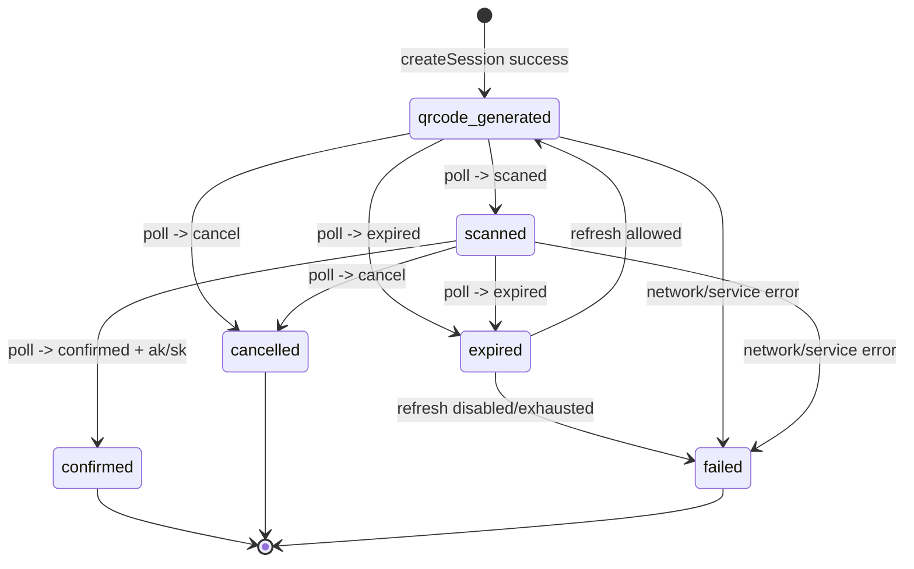
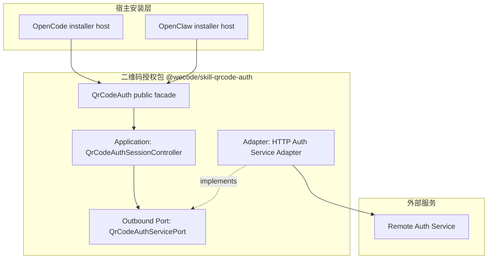
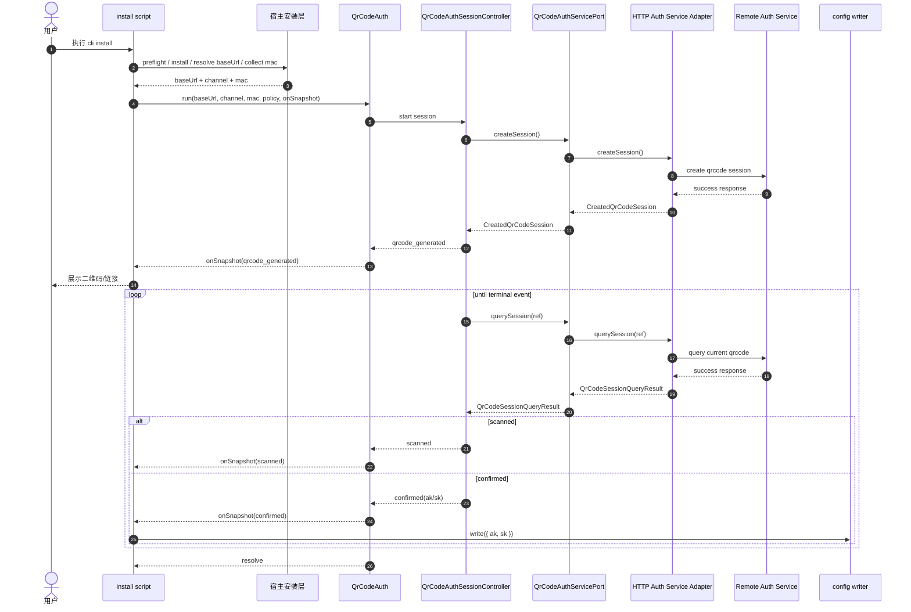
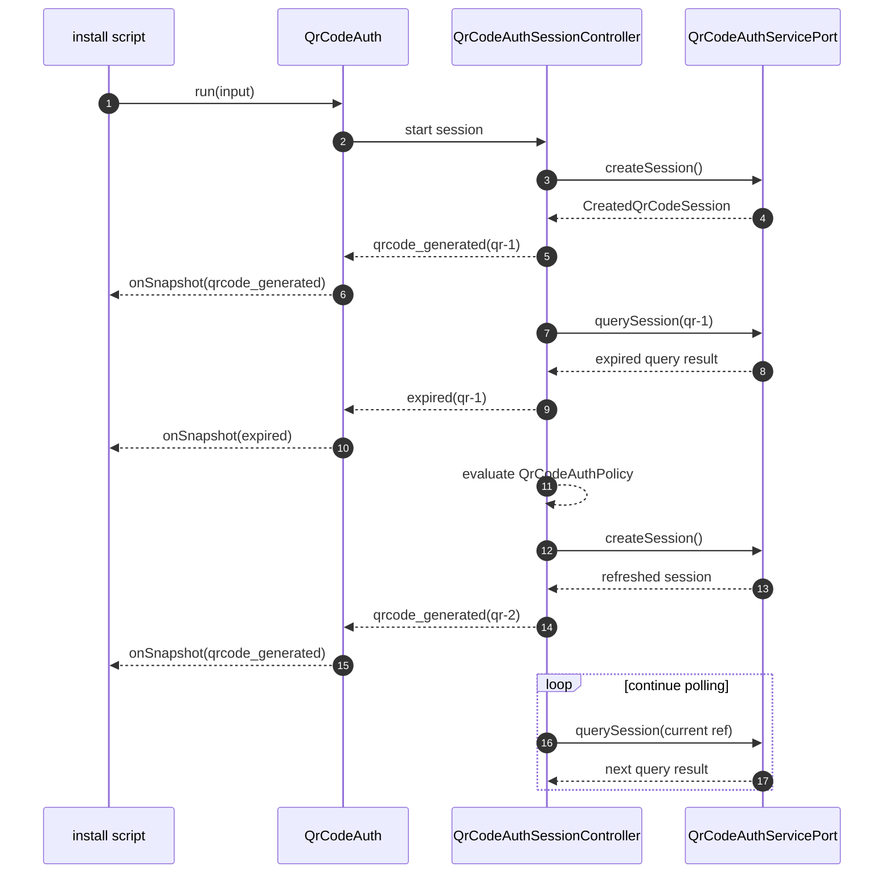
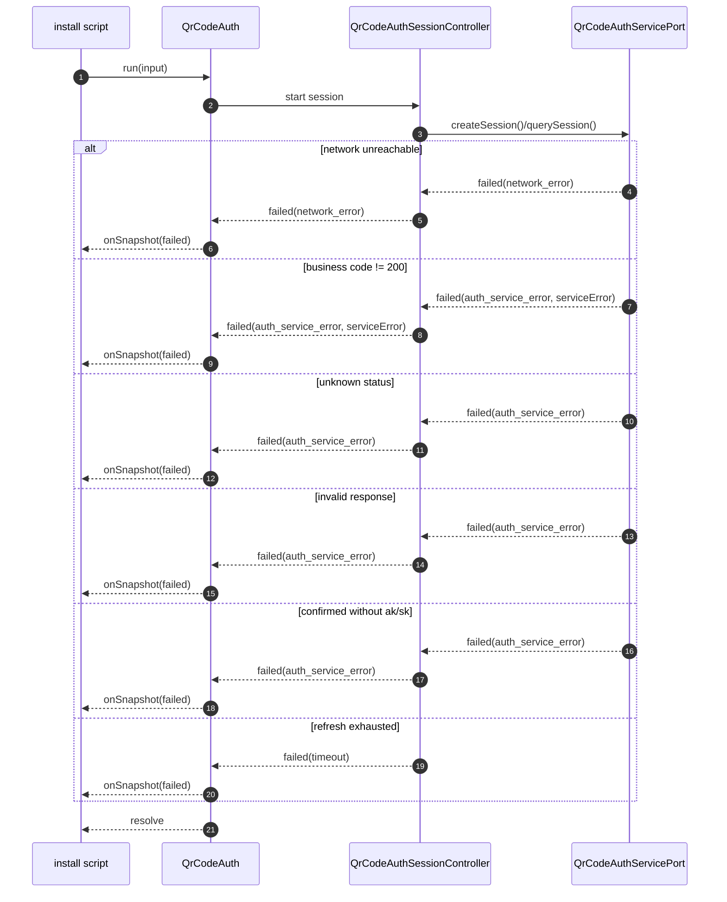

# 二维码扫码授权方案设计

**Version:** 0.4  
**Date:** 2026-04-24  
**Status:** Draft  
**Owner:** agent-plugin maintainers  
**Related:** [二维码扫码授权需求说明](../superpowers/specs/2026-04-23-qrcode-auth-requirements.md), [三方 Agent Runtime 系统分层架构设计](../architecture/third-party-agent-runtime-architecture.md), [bridge-runtime-sdk 目标态架构设计](../architecture/bridge-runtime-sdk-architecture.md)

## 1. 文档定位

本文基于 [二维码扫码授权需求说明](../superpowers/specs/2026-04-23-qrcode-auth-requirements.md)，定义安装脚本场景下的二维码扫码授权方案。

本文负责定义：

- 安装脚本视角下的主接口
- 调用方可见授权事件模型
- `baseUrl` / `mac` 的输入来源边界
- 二维码刷新、轮询和失败收口规则
- 二维码授权包的内部职责边界
- `opencode` / `openclaw` 双端安装脚本接入方式

本文不负责定义：

- 二维码 ASCII 渲染细节
- 配置文件最终字段 shape
- 插件正式接入后的逐文件改动步骤
- `bridge-runtime-sdk` 正式 API
- 独立安装 CLI 包发布方案

## 2. 设计结论

本期将二维码扫码授权收敛为安装期能力，并对安装脚本只暴露一个高层入口。

核心结论如下：

1. 高层入口命名为 `QrCodeAuth`。
2. 安装脚本只调用 `qrcodeAuth.run()`。
3. `onSnapshot` 是唯一业务输出通道，且为必填。
4. `run()` 返回 `Promise<void>`，只表示授权流程结束，不返回业务结果。
5. `run()` resolve 前必须已经发出终态事件，resolve 后不再发送事件。
6. `QrCodeAuthSnapshot` 是调用方可见授权事件模型，使用 `type` 作为唯一判别字段。
7. 新增内部 package 命名为 `@wecode/skill-qrcode-auth`，目录为 `packages/skill-qrcode-auth`。
8. `baseUrl` 由宿主安装层解析后传入 `qrcodeAuth.run()`。
9. `mac` 由 SDK / 宿主自动采集，采集失败传空字符串 `""`。
10. `expired` 是当前二维码实例事件，不是整次授权会话终态。
11. 终态事件只包括 `confirmed`、`cancelled`、`failed`。
12. 二维码授权包不负责宿主 preflight、插件安装或配置写入。
13. 包入口提供默认 runtime 实例 `qrcodeAuth`；安装脚本不调用工厂或内部装配能力。

## 3. 对使用方的主接口

### 3.1 设计原则

本期唯一确定的使用方是安装脚本：

- [plugins/message-bridge/scripts/setup-message-bridge.mjs](/Users/zy/Code/agent-plugin/.worktrees/2026-04-23-qrcode-auth-requirements/plugins/message-bridge/scripts/setup-message-bridge.mjs)
- [plugins/message-bridge-openclaw/scripts/install-openclaw-plugin.mjs](/Users/zy/Code/agent-plugin/.worktrees/2026-04-23-qrcode-auth-requirements/plugins/message-bridge-openclaw/scripts/install-openclaw-plugin.mjs)

主接口必须满足：

- 调用方只需调用一次
- 调用方只通过 `onSnapshot` 接收业务事件
- 调用方不需要理解内部 controller、service port 或 session context
- 调用方通过包入口导出的默认 runtime 实例 `qrcodeAuth` 调用 `run()`

### 3.2 主接口示意

```ts
export interface QrCodeAuth {
  run(input: {
    baseUrl: string;
    channel: string;
    mac: string;
    policy?: QrCodeAuthPolicy;
    onSnapshot: (snapshot: QrCodeAuthSnapshot) => void;
  }): Promise<void>;
}
```

TypeScript 代码块仅用于展示接口形状，字段真源以下表为准。

| 字段 | 类型 | 必填 | 默认值 | 说明 |
| --- | --- | --- | --- | --- |
| `baseUrl` | `string` | Y | 无 | 二维码授权服务 base URL，由宿主安装层解析后传入 |
| `channel` | `string` | Y | 无 | 渠道来源 |
| `mac` | `string` | Y | 无 | 宿主自动采集的 MAC；采集失败传 `""` |
| `policy` | `QrCodeAuthPolicy` | N | 默认策略 | 轮询与过期刷新策略 |
| `onSnapshot` | `(snapshot: QrCodeAuthSnapshot) => void` | Y | 无 | 唯一业务输出通道 |

接口语义：

- `run()` 启动授权流程。
- `onSnapshot` 接收所有业务事件，包括终态事件。
- `run()` 不承载业务结果。
- `run()` 在终态事件发出后 resolve。

### 3.3 使用示意

```ts
import { qrcodeAuth } from "@wecode/skill-qrcode-auth";

await qrcodeAuth.run({
  baseUrl: resolvedBaseUrl,
  channel: "openclaw",
  mac: resolvedMacAddress,
  policy: {
    refreshOnExpired: true,
    maxRefreshCount: 3,
    pollIntervalMs: 2_000,
  },
  onSnapshot(snapshot) {
    switch (snapshot.type) {
      case "qrcode_generated":
        renderQrCode(snapshot.display);
        break;
      case "confirmed":
        writeCredentials(snapshot.credentials);
        break;
      case "failed":
        renderFailure(snapshot.reasonCode, snapshot.serviceError);
        break;
    }
  },
});
```

## 4. 输入来源约束

### 4.1 `baseUrl`

`baseUrl` 是二维码授权服务 base URL，由宿主安装层解析后传入 `qrcodeAuth.run()`。

约束如下：

- 二维码授权包只使用调用方传入的 `baseUrl`。
- 二维码授权包不判断 `prod` / `uat` 或其他环境来源。
- `baseUrl` 是服务入口配置，不是用户交互输入。
- 具体配置键和默认值不在本文展开。

### 4.2 `mac`

`mac` 是宿主自动采集字段。

约束如下：

- SDK / 宿主优先采集本机可用 MAC 地址。
- 采集失败时传空字符串 `""`。
- 服务端应将空字符串视为缺失值。
- 用户不需要在安装过程中手动输入 MAC。

虽然服务端创建二维码接口将 `mac` 标为可选字段，但安装期授权流程仍优先携带该字段，用于统一双端行为。

## 5. 业务事件模型

### 5.1 `QrCodeDisplayData`

```ts
export interface QrCodeDisplayData {
  qrcode: string;
  weUrl: string;
  pcUrl: string;
}
```

TypeScript 代码块仅用于展示接口形状，字段真源以下表为准。

| 字段 | 类型 | 必填 | 说明 |
| --- | --- | --- | --- |
| `qrcode` | `string` | Y | 二维码唯一标识 |
| `weUrl` | `string` | Y | H5 扫码内容 |
| `pcUrl` | `string` | Y | PC 端拉起 app 链接 |

说明：

- `weUrl` 与 `pcUrl` 来自服务端展示数据。
- 二维码授权包不决定展示偏好。
- 安装脚本或 UI 层自行选择展示 `weUrl`、`pcUrl`，或将其中一个 URL 渲染为终端二维码。

### 5.2 `QrCodeAuthSnapshot`

`QrCodeAuthSnapshot` 是调用方可见授权事件，不是完整会话状态对象。

```ts
export type QrCodeAuthSnapshot =
  | {
      type: "qrcode_generated";
      qrcode: string;
      display: QrCodeDisplayData;
      expiresAt: string;
    }
  | {
      type: "scanned";
      qrcode: string;
    }
  | {
      type: "expired";
      qrcode: string;
    }
  | {
      type: "cancelled";
      qrcode: string;
    }
  | {
      type: "confirmed";
      qrcode: string;
      credentials: { ak: string; sk: string };
    }
  | {
      type: "failed";
      qrcode?: string;
      reasonCode: "timeout" | "network_error" | "auth_service_error";
      serviceError?: QrCodeAuthServiceError;
    };
```

TypeScript 代码块仅用于展示接口形状，字段真源以下表为准。

事件类型：

| `type` | 是否终态 | 说明 |
| --- | --- | --- |
| `qrcode_generated` | N | 新二维码已生成，可展示 |
| `scanned` | N | 当前二维码已扫码，等待确认 |
| `expired` | N | 当前二维码已失效，整次会话可能继续 |
| `cancelled` | Y | 授权流程取消 |
| `confirmed` | Y | 授权成功 |
| `failed` | Y | 授权失败收口 |

公共字段：

| 字段 | 类型 | 必填 | 适用事件 | 说明 |
| --- | --- | --- | --- | --- |
| `type` | union string | Y | 全部 | 事件类型 |
| `qrcode` | `string` | 条件必填 | 除会话级 `failed` 外 | 具体二维码实例标识 |

事件字段：

| 事件 | 字段 | 类型 | 必填 | 说明 |
| --- | --- | --- | --- | --- |
| `qrcode_generated` | `qrcode` | `string` | Y | 新生成二维码的唯一标识 |
| `qrcode_generated` | `display` | `QrCodeDisplayData` | Y | 展示层所需数据 |
| `qrcode_generated` | `expiresAt` | `string` | Y | 当前二维码过期时间 |
| `scanned` | `qrcode` | `string` | Y | 已扫码二维码标识 |
| `expired` | `qrcode` | `string` | Y | 已过期二维码标识 |
| `cancelled` | `qrcode` | `string` | Y | 已取消二维码标识 |
| `confirmed` | `qrcode` | `string` | Y | 已确认二维码标识 |
| `confirmed` | `credentials.ak` | `string` | Y | 授权成功返回的 AK |
| `confirmed` | `credentials.sk` | `string` | Y | 授权成功返回的 SK |
| `failed` | `qrcode` | `string` | N | 关联二维码；尚未生成二维码即失败时可缺省 |
| `failed` | `reasonCode` | `"timeout" \| "network_error" \| "auth_service_error"` | Y | 失败大类 |
| `failed` | `serviceError` | `QrCodeAuthServiceError` | N | 服务端错误安全子集 |

约束如下：

- 所有与具体二维码实例相关的事件必须携带 `qrcode`。
- 会话级失败在尚未生成二维码时可以不携带 `qrcode`。
- `confirmed` 缺失 `ak/sk` 时，不允许发送 `confirmed`，必须发送 `failed`。
- `accessToken` 不进入对外模型。
- 对外模型不携带 UI 文案字段；文案由调用方根据 `type` / `reasonCode` 生成。

### 5.3 `QrCodeAuthServiceError`

```ts
export interface QrCodeAuthServiceError {
  httpStatus?: number;
  businessCode?: string;
  error?: string;
  message?: string;
  errorEn?: string;
}
```

TypeScript 代码块仅用于展示接口形状，字段真源以下表为准。

| 字段 | 类型 | 必填 | 说明 |
| --- | --- | --- | --- |
| `httpStatus` | `number` | N | HTTP 响应状态码 |
| `businessCode` | `string` | N | 响应体业务 `code` |
| `error` | `string` | N | 响应体 `error` |
| `message` | `string` | N | 响应体 `message` |
| `errorEn` | `string` | N | 响应体 `errorEn` |

约束如下：

- `serviceError` 仅在 `reasonCode = "auth_service_error"` 且存在服务端响应时出现。
- 不透传完整响应对象。
- 不透传 headers。
- 不透传 request body。
- 不透传 `accessToken` 或其他查询凭据。

### 5.4 失败原因

`failed.reasonCode` 只保留三类：

| reasonCode | 含义 | 典型来源 |
| --- | --- | --- |
| `timeout` | 授权流程自然耗尽 | 当前二维码过期后不允许刷新，或刷新次数已耗尽 |
| `network_error` | 没有拿到 HTTP 响应 | DNS / TCP / TLS / socket timeout / request timeout |
| `auth_service_error` | 拿到了 HTTP 响应，但授权服务无法继续 | HTTP 非 2xx、业务 code 非成功、响应结构缺字段、`confirmed` 缺失 `ak/sk` |

## 6. `QrCodeAuthPolicy` 与 `onSnapshot` 语义

### 6.1 `QrCodeAuthPolicy`

```ts
export interface QrCodeAuthPolicy {
  refreshOnExpired?: boolean;
  maxRefreshCount?: number;
  pollIntervalMs?: number;
}
```

TypeScript 代码块仅用于展示接口形状，字段真源以下表为准。

| 字段 | 类型 | 必填 | 默认值 | 说明 |
| --- | --- | --- | --- | --- |
| `refreshOnExpired` | `boolean` | N | `true` | 当前二维码过期后是否自动重新生成二维码 |
| `maxRefreshCount` | `number` | N | `3` | 最多允许自动重新生成二维码的次数 |
| `pollIntervalMs` | `number` | N | `2000` | 查询二维码状态的轮询间隔 |

说明：

- `policy` 整体可选。
- 调用方未提供 `policy` 时使用默认值。
- 调用方提供部分字段时，未提供字段仍使用默认值。

### 6.2 运行时输入校验

`QrCodeAuth.run()` 会对调用方输入执行 fail-closed 校验。非法输入属于调用方编程错误，`run()` 以 `TypeError` reject，不通过 `onSnapshot({ type: "failed" })` 表达。

校验规则如下：

- `onSnapshot` 必须是函数。
- `baseUrl` 必须是非空 `http` / `https` URL。
- `channel` 必须是非空字符串。
- `mac` 必须是字符串；采集失败时由调用方传 `""`。
- `refreshOnExpired` 未提供时使用默认值；若提供，必须是 `boolean`。
- `maxRefreshCount` 未提供时使用默认值；若提供，必须是有限数字且 `>= 0`。
- `pollIntervalMs` 未提供时使用默认值；若提供，必须是有限数字且 `> 0`。

### 6.3 刷新规则

自动刷新只发生在：

- 查询接口成功响应中产生 `expired` 事件。

不会自动重试：

- `network_error`
- `auth_service_error`

收口规则：

- 二维码过期先发 `expired`。
- 如果 `refreshOnExpired = true` 且刷新次数未耗尽，重新生成二维码并发 `qrcode_generated`。
- 如果不允许刷新或刷新次数耗尽，发 `failed`，`reasonCode = "timeout"`。
- 当前二维码 `cancelled` 时，整次授权会话直接结束，不自动重新建码。

HTTP adapter 查询响应转换规则：

以下规则属于 HTTP service adapter 对远端查询响应的转换规则。adapter 将远端响应转换为稳定的 `QrCodeSessionQueryResult`；`QrCodeAuthSessionController` 不解析 HTTP response、业务 `code`、远端原始 `data.status` 或 `accessToken`。

1. 业务 `code` 先按 `string | number` 归一化为字符串；只有归一化后等于 `"200"` 的查询响应才参与状态解释。
2. `expired` 仅由成功响应中的 `data.expired` 字段决定。
3. `data.status` 不参与过期判定。
4. 若 `data.expired` 表示已过期，发送 `expired`。
5. 否则 `data.status = "scaned"`，发送 `scanned`。
6. 否则 `data.status = "confirmed"` 且 `ak/sk` 完整，发送 `confirmed`。
7. 否则 `data.status = "cancel"`，发送 `cancelled`。
8. 否则 `data.status = "wait"`，不触发新事件。
9. 其他状态或关键字段缺失，发送 `failed`，`reasonCode = "auth_service_error"`。
10. 业务 `code` 归一化后不等于 `"200"`，包括 `585704`、`585705`、`587706`，发送 `failed`，`reasonCode = "auth_service_error"`，不触发刷新。

### 6.4 `onSnapshot` 触发时机

`onSnapshot` 的触发依据是调用方可见事件发生，而不是每次轮询都触发。

必须触发：

- 首次生成二维码成功：`qrcode_generated`
- 任意一次重新生成二维码成功：`qrcode_generated`
- 当前二维码首次变为已扫码：`scanned`
- 当前二维码进入过期：`expired`
- 当前二维码取消：`cancelled`
- 授权成功：`confirmed`
- 授权失败收口：`failed`

不触发：

- 连续轮询结果没有变化。
- 同一二维码仍处于等待扫码。
- 同一二维码仍处于已扫码待确认。
- 仅内部 adapter context 变化。
- 仅内部计时器推进但没有调用方可见事件。

时序规则：

- 所有业务事件包括终态事件都通过 `onSnapshot` 下发。
- `run()` 不承载业务结果。
- 终态事件一定先通过 `onSnapshot` 发出。
- 然后 `run()` 才 resolve。
- `run()` resolve 后不再发送任何事件。

### 6.5 `onSnapshot` 事件状态转移图



补充规则：

- 每条进入图中事件节点的可见转换都会触发 `onSnapshot`。
- 连续轮询没有造成事件变化时不触发。
- `expired` 不是整次授权会话终态；若允许刷新，后续会进入新的 `qrcode_generated`。
- `cancelled`、`confirmed`、`failed` 是整次授权会话终态事件。
- 终态事件先通过 `onSnapshot` 发出，然后 `run()` resolve。

## 7. 架构设计图



图中有三层边界：

- 宿主安装层只依赖 `QrCodeAuth` public facade。
- 二维码授权包内部按 application controller、outbound port、HTTP adapter 分层。
- 外部服务提供二维码创建和二维码状态查询能力。

## 8. 关键流程时序图

### 8.1 标准成功流程



### 8.2 过期刷新流程



### 8.3 失败流程



## 9. 包内架构分层

### 9.1 定位

二维码授权包作为内部 workspace package 承载：

| 项 | 值 |
| --- | --- |
| package name | `@wecode/skill-qrcode-auth` |
| package path | `packages/skill-qrcode-auth` |

包内采用 Hexagonal Architecture 分层：

| 层 | 组件 | 对外可见性 | 职责 |
| --- | --- | --- | --- |
| Public Facade | `qrcodeAuth: QrCodeAuth` | public | 安装脚本唯一调用入口 |
| Application Layer | `QrCodeAuthSessionController` | internal | 授权流程状态机 |
| Outbound Port | `QrCodeAuthServicePort` | internal | 应用层需要的远端授权能力 |
| Adapter Layer | HTTP service adapter | internal | HTTP 与服务端协议转换 |

依赖方向固定为：

- 安装脚本只依赖 `qrcodeAuth` 默认 runtime 实例。
- `qrcodeAuth` 依赖 application controller。
- application controller 只依赖 `QrCodeAuthServicePort`。
- HTTP service adapter 实现 `QrCodeAuthServicePort` 并访问远端服务。
- application controller 不依赖 HTTP、fetch、headers、业务 code 原始响应或 `accessToken`。

### 9.2 职责划分

#### `QrCodeAuth`

`QrCodeAuth` 是 `@wecode/skill-qrcode-auth` 的 public facade，负责：

- 校验 `baseUrl`、`channel`、`mac` 和 `onSnapshot`
- 接收 `baseUrl`、`channel`、`mac`、`policy` 和 `onSnapshot`
- 合并默认 `QrCodeAuthPolicy`
- 创建并启动 `QrCodeAuthSessionController`
- 转发 controller 产生的 `QrCodeAuthSnapshot`
- 在终态事件发出后 resolve

它不负责轮询实现、刷新策略判断、服务端状态映射、HTTP 请求、宿主 preflight、插件安装或配置写入。

包入口导出的 `qrcodeAuth` 是默认 `QrCodeAuth` runtime 实例。它可以作为模块级单例复用，但不得持有单次授权会话状态；每次 `run()` 必须创建新的 controller 和会话状态。工厂、HTTP adapter 与 service port 都属于内部装配细节，安装脚本不得 import 或调用。
内部 runtime 工厂允许以 `QrCodeAuthServicePort` 形式替换默认远端实现；未显式注入时，工厂默认装配 HTTP service adapter。

#### `QrCodeAuthSessionController`

应用层授权流程状态机，负责：

- 创建首个二维码会话
- 调度轮询节奏
- 根据稳定查询结果推进授权事件
- 根据 `QrCodeAuthPolicy` 执行过期刷新
- 按事件类型、`qrcode` 与失败原因对轮询态 `onSnapshot` 事件去重
- 终态收口

它不负责 HTTP 协议细节、业务 `code` 原始解析、`accessToken` 管理、宿主 preflight、配置写入或终端渲染。

#### `QrCodeAuthServicePort`

outbound port，只表达应用层需要的远端授权能力：

- `createSession()`
- `querySession()`

约束如下：

- `createSession()` 返回包内稳定的 `CreatedQrCodeSession`。
- application 层持有稳定的 `QrCodeSessionRef`。
- 后续查询以 `QrCodeSessionRef` 为输入。
- `querySession()` 返回稳定的 `QrCodeSessionQueryResult`。
- port 不暴露 HTTP response、headers、业务原始响应或 `accessToken`。

#### HTTP service adapter

HTTP service adapter 实现 `QrCodeAuthServicePort`，负责：

- 使用 `baseUrl` 访问远端二维码服务。
- 管理 HTTP 请求、响应解析和请求超时。
- 管理 `accessToken` 或等价查询凭据。
- 将 HTTP 非 2xx、业务 `code` 归一化后不等于 `"200"`、非法响应转换为稳定失败结果。
- 将 `serviceError.businessCode` 统一输出为字符串；数值型业务码会被字符串化。
- 将远端成功响应转换为 `CreatedQrCodeSession` 或 `QrCodeSessionQueryResult`。

它不向 facade、controller、调用方暴露远端协议细节。

### 9.3 宿主安装层职责

以下职责属于 OpenCode / OpenClaw 安装脚本或其宿主安装层，不属于二维码授权包：

- host preflight
- 插件安装
- `baseUrl` 解析
- mac 采集
- 配置写入
- 安装后的宿主重启或提示

安装脚本在收到 `confirmed` 事件后写入 `ak/sk`；二维码授权包不写宿主配置。

## 10. OpenCode / OpenClaw 接入方式

### 10.1 OpenCode

OpenCode 本期主接入点固定为：

- [plugins/message-bridge/scripts/setup-message-bridge.mjs](/Users/zy/Code/agent-plugin/.worktrees/2026-04-23-qrcode-auth-requirements/plugins/message-bridge/scripts/setup-message-bridge.mjs)

接入原则：

- 保留当前脚本作为用户入口。
- 安装脚本负责 preflight、`baseUrl` 解析、mac 采集和配置写入。
- 把原先直接输入 `AK/SK` 的步骤替换为 `qrcodeAuth.run()`。
- 在 `onSnapshot` 中输出二维码和状态提示。
- 在收到 `confirmed` 后沿用现有配置写入逻辑。

### 10.2 OpenClaw

OpenClaw 本期主接入点固定为：

- [plugins/message-bridge-openclaw/scripts/install-openclaw-plugin.mjs](/Users/zy/Code/agent-plugin/.worktrees/2026-04-23-qrcode-auth-requirements/plugins/message-bridge-openclaw/scripts/install-openclaw-plugin.mjs)

接入原则：

- 保留当前脚本里的 preflight、版本校验、registry 配置和安装主流程。
- 安装脚本负责 `baseUrl` 解析、mac 采集和配置写入。
- 在宿主安装准备完成后调用 `qrcodeAuth.run()`。
- 在收到 `confirmed` 后通过现有或新增的宿主配置写入逻辑写入 `ak/sk`。

约束：

- 本期不以 `src/onboarding.ts` 作为主接入点。
- `src/onboarding.ts` 仅作为后续可选扩展方向，不属于本期主方案。
- `MB_SETUP_QRCODE_AUTH_MODULE` / `OPENCLAW_INSTALL_QRCODE_AUTH_MODULE` 指向的 override 模块必须导出 `qrcodeAuth.run(input)`。

## 11. 错误处理与 fail-closed 规则

### 11.1 fail-closed 原则

以下情况一律按失败处理，不做乐观推断：

- `confirmed` 但缺失 `ak` 或 `sk`
- 创建接口缺失最小展示字段
- 查询接口业务 `code` 归一化后不等于 `"200"`
- 查询接口成功响应中的 `data.status` 未知
- 响应结构不满足最小契约

### 11.2 错误映射

推荐映射如下：

| 场景 | 对外事件 |
| --- | --- |
| DNS / TCP / TLS / request timeout | `failed + network_error` |
| HTTP 非 2xx | `failed + auth_service_error` |
| 业务 `code` 归一化后不等于 `"200"` | `failed + auth_service_error` |
| `585704 / 585705 / 587706` | `failed + auth_service_error` |
| 查询成功响应中的未知 `data.status` | `failed + auth_service_error` |
| 响应结构缺失关键字段 | `failed + auth_service_error` |
| `confirmed` 缺失 `ak/sk` | `failed + auth_service_error` |
| 二维码过期且不允许刷新 | `failed + timeout` |
| 二维码过期且刷新次数耗尽 | `failed + timeout` |

## 12. 测试与验收要求

### 12.1 facade 单元测试

facade 单元测试覆盖：

- 安装脚本只调用 `qrcodeAuth.run()` 即可完成授权。
- `onSnapshot` 是唯一业务输出通道。
- `run()` 只表示流程结束，不返回业务结果。
- `baseUrl` 由调用方传入 `qrcodeAuth.run()`。
- `policy` 默认值合并。
- facade 只负责输入校验、controller 创建启动、事件转发和终态后 resolve。

### 12.2 controller 单元测试

controller 单元测试使用 fake `QrCodeAuthServicePort`，不依赖 HTTP mock server。

覆盖：

- `qrcode_generated -> scanned -> confirmed`。
- `qrcode_generated -> expired -> qrcode_generated` 自动刷新。
- `expired` 不允许刷新或刷新次数耗尽后转为 `failed + timeout`。
- `cancelled` 作为终态事件。
- port 返回稳定 `failed(network_error)` 时终态收口。
- port 返回稳定 `failed(auth_service_error)` 时终态收口。
- 连续相同状态不重复触发 `onSnapshot`。
- 终态事件先发送，`run()` 后 resolve，resolve 后不再发送事件。

不覆盖：

- HTTP 状态码。
- 业务 `code`。
- 远端原始 `data.status`。
- `accessToken`。
- confirmed 缺失 `ak/sk` 的远端响应解析。

### 12.3 adapter 单元测试

adapter 单元测试覆盖远端协议转换：

- create 成功响应转换为 `CreatedQrCodeSession`。
- query 成功响应中的 `data.expired` 转换为 expired query result。
- query 成功响应中的 `data.status = "wait"` 转换为 no-change / waiting result。
- `data.status = "scaned"` 转换为 scanned result。
- `data.status = "confirmed"` 且 `ak/sk` 完整转换为 confirmed result。
- `data.status = "cancel"` 转换为 cancelled result。
- `data.status` 未知转换为 stable failed result。
- HTTP 非 2xx 转换为 `failed(auth_service_error)`。
- 业务 `code` 归一化后不等于 `"200"`，包括 `585704 / 585705 / 587706`，转换为 `failed(auth_service_error)`。
- 网络不可达或请求超时转换为 `failed(network_error)`。
- confirmed 缺少 `ak/sk` 转换为 `failed(auth_service_error)`。
- `serviceError.httpStatus` / `serviceError.businessCode` 安全透传。
- 不向 port result 暴露 `accessToken`、headers、request body 或完整响应对象。

### 12.4 mock server 集成测试

后续实现至少应使用 mock auth server 覆盖端到端 create/query 链路，并断言事件序列：

- 成功链路：`qrcode_generated -> scanned -> confirmed`，随后 `run()` resolve。
- 自动刷新链路：`qrcode_generated(qr-1) -> expired(qr-1) -> qrcode_generated(qr-2)`，后续继续轮询。
- 刷新耗尽链路：最后一次 `expired` 后发送 `failed(timeout)`。
- 取消链路：`qrcode_generated -> cancelled`。
- 业务错误响应：`585704 / 585705 / 587706` 发送 `failed(auth_service_error)`，不刷新。
- 网络不可达或请求超时发送 `failed(network_error)`。
- 服务端错误响应透传 `serviceError.httpStatus` 与 `serviceError.businessCode`。
- confirmed 缺少 `ak/sk` 发送 `failed(auth_service_error)`。
- 终态事件先通过 `onSnapshot` 发出，`run()` 后 resolve。

### 12.5 架构边界验收

后续实现应通过静态检查或代码审查确认：

- OpenCode / OpenClaw 安装脚本只 import / 调用 `qrcodeAuth` public facade。
- 安装脚本不得 import `QrCodeAuthSessionController`、`QrCodeAuthServicePort` 或 HTTP adapter。
- `QrCodeAuthSessionController` 不得 import HTTP adapter、fetch、HTTP client、headers 或远端响应 DTO。
- HTTP adapter 不得依赖 OpenCode / OpenClaw host 安装逻辑。
- OpenCode 与 OpenClaw 不复制二维码状态机、刷新策略或服务端状态映射逻辑。
- `accessToken` 只存在于 adapter / session context，不进入 snapshot、controller 对外事件或 host 配置写入。
- host 相关测试覆盖 `mac` 自动采集；采集失败时以空字符串继续。
- OpenClaw 以 `install-openclaw-plugin.mjs` 为主入口，不与 onboarding 混用。

## 13. 结论

本方案把二维码扫码授权收敛为一个安装期高层能力：

- 对安装脚本，只暴露 `qrcodeAuth.run()`
- 对业务输出，只使用 `QrCodeAuthSnapshot` 事件流
- 对内部实现，由 `@wecode/skill-qrcode-auth` 保留自己的 controller / service port / adapter 分层
- 对宿主动作，由 OpenCode / OpenClaw 安装脚本负责

这样既能满足双端安装脚本复用诉求，又能避免把协议细节、状态机实现和宿主安装逻辑混在同一层。
