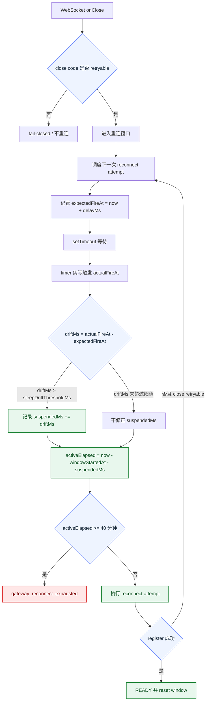
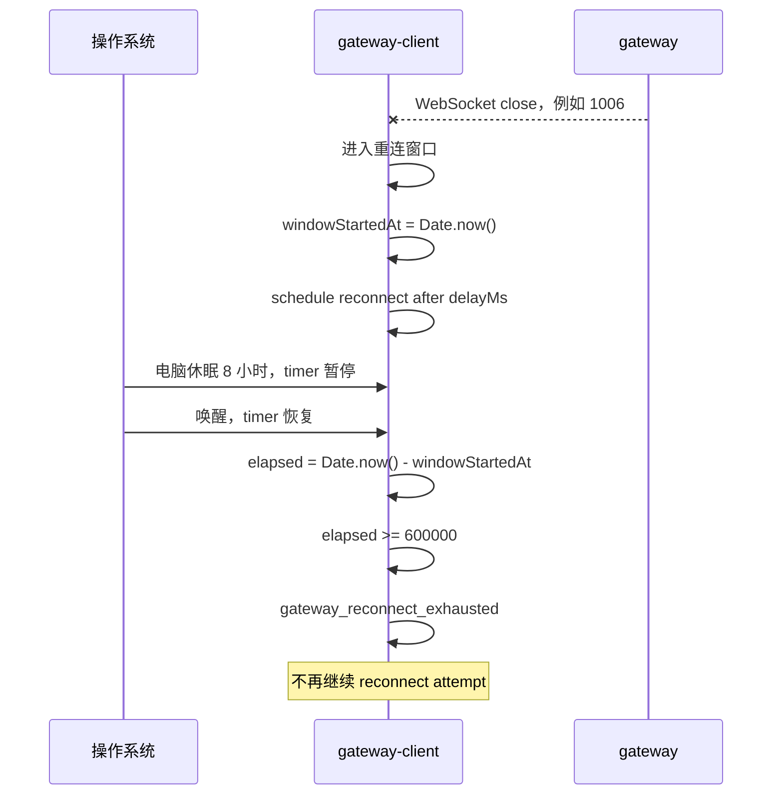
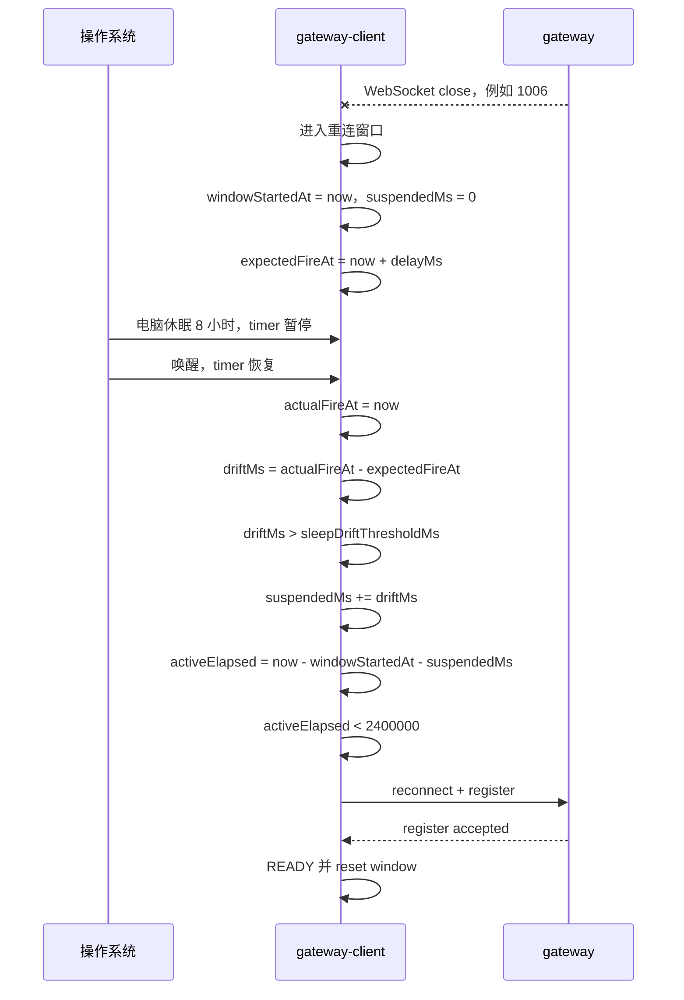

# `SDK 与 Gateway 重连窗口 Active Elapsed 计算 B 方案`

- 方案日期：`2026-07-16`
- 目标工程：`agent-plugin`
- 参考文档：`docs/design/sdk-gateway-reconnect-solution.md`、`packages/gateway-client/src/factory/createGatewayRuntimeDependencies.ts`、`packages/gateway-client/src/adapters/DefaultReconnectPolicy.ts`、`packages/gateway-client/src/application/runtime/ReconnectOrchestrator.ts`、`packages/gateway-client/src/ports/ReconnectPolicy.ts`、`packages/gateway-client/src/adapters/TimeoutReconnectScheduler.ts`
- 方案类型：`重连窗口耗时计算优化 B 方案`

## 1. 背景

### 1.1 场景说明

现有方案文档 `docs/design/sdk-gateway-reconnect-solution.md` 采用将默认 `maxElapsedMs` 从 10 分钟调整到 40 分钟的方式，降低短中时长休眠、网络不可达、gateway 短时维护后重连窗口被耗尽的概率。

本 B 方案在默认 `maxElapsedMs = 2400000`，即 40 分钟的基础上，改变重连窗口耗时计算口径：从墙钟耗时改为 active elapsed。电脑休眠、系统挂起、事件循环长时间停顿导致的 timer drift 不计入 40 分钟耗尽窗口。

本方案调整前代码事实如下：

1. `createGatewayRuntimeDependencies.ts` 中默认 `maxElapsedMs = 600000`。
2. `DefaultReconnectPolicy` 通过 `Date.now() - windowStartedAt` 计算 elapsed。
3. `ReconnectOrchestrator.scheduleReconnect()` 在调度下一次 attempt 前调用 `policy.scheduleNextAttempt()`，在定时器触发后再调用 `policy.getExhaustedDecision()`。
4. `TimeoutReconnectScheduler` 基于 `setTimeout` 调度；电脑休眠期间 timer 暂停，但 `Date.now()` 墙钟时间继续前进。

因此，调整前若 SDK 已进入重连窗口后电脑休眠超过默认 10 分钟，唤醒后 `getExhaustedDecision()` 可能直接返回耗尽，进入 `gateway_reconnect_exhausted`，不再继续 reconnect attempt。

### 1.2 需求目标

1. 将默认最大重连窗口调整为 40 分钟。
2. 休眠、系统挂起、长时间事件循环停顿期间不消耗 40 分钟重连预算。
3. 唤醒后 gateway 已恢复时，SDK 能继续 reconnect attempt 并回到 READY。
4. 在线且 gateway 持续不可达时，仍按 active elapsed 40 分钟耗尽，保留止损边界。
5. 不改变 WebSocket close code 准入规则。

### 1.3 非目标

1. 不完全放开重连窗口限制。
2. 不新增系统级 sleep/wake 事件监听。
3. 不新增半开连接 watchdog。
4. 不扩展 reconnect attempt 中非 close 失败的重试分类。
5. 不修改 gateway wire 业务消息协议。

## 2. 方案图

### 2.1 整体方案图



### 2.2 方案核心

重连窗口调整为 40 分钟，且 40 分钟只统计 SDK 实际可执行重连逻辑的 active elapsed；休眠/挂起导致的 timer drift 计入 suspended duration，并从窗口耗时中扣除。

## 3. 时序图

### 3.1 `现状：休眠时间消耗窗口`



### 3.2 `B 方案：休眠漂移不计入窗口`



## 4. 技术细节

### 4.1 调整点

1. `DefaultReconnectPolicy`
   - 新增 `suspendedMs` 或等价字段。
   - 将 `getElapsedMs()` 从墙钟 elapsed 改为 active elapsed。
   - 新增记录 scheduler drift 的入口。

2. `ReconnectPolicy`
   - 扩展端口方法，例如 `recordSchedulerDrift(driftMs: number): void` 或 `recordSuspendedDuration(durationMs: number): void`。

3. `ReconnectOrchestrator`
   - 调度时记录 `expectedFireAt`。
   - timer callback 触发时计算 `actualFireAt` 和 `driftMs`。
   - drift 超过阈值后通知 policy 扣除 suspended duration。

4. 测试
   - 使用注入 clock 或 fake clock 模拟休眠/挂起。
   - 覆盖 active elapsed 耗尽与 suspended duration 扣除。

### 4.2 核心实现方式

建议新增内部参数：

```ts
const DEFAULT_SLEEP_DRIFT_THRESHOLD_MS = 60000;
```

阈值取 60 秒的原因：

1. 普通 `setTimeout` 抖动通常远小于 60 秒。
2. 长 GC、系统繁忙、电脑休眠、系统挂起都可能超过该阈值；这些时间段 SDK 没有实际执行重连逻辑，按不消耗重连预算处理是合理的。
3. 该阈值可后续内聚到 `GatewayReconnectConfig`，首版建议作为内部常量，减少 public contract 扩面。

`DefaultReconnectPolicy` 建议模型：

```ts
class DefaultReconnectPolicy implements ReconnectPolicy {
  private attempt = 0;
  private windowStartedAt: number | null = null;
  private suspendedMs = 0;

  recordSuspendedDuration(durationMs: number): void {
    this.suspendedMs += Math.max(0, durationMs);
  }

  reset(): void {
    this.attempt = 0;
    this.windowStartedAt = null;
    this.suspendedMs = 0;
  }

  private getElapsedMs(): number {
    const now = this.clock.now();
    const windowStartedAt = this.windowStartedAt ?? now;
    return Math.max(0, now - windowStartedAt - this.suspendedMs);
  }
}
```

`ReconnectOrchestrator` 建议模型：

```ts
const expectedFireAt = this.context.clock.now() + reconnectDecision.delayMs;
this.scheduler.schedule(async () => {
  const actualFireAt = this.context.clock.now();
  const driftMs = actualFireAt - expectedFireAt;
  if (driftMs > DEFAULT_SLEEP_DRIFT_THRESHOLD_MS) {
    this.policy.recordSuspendedDuration(driftMs);
  }

  const exhaustedDecision = this.policy.getExhaustedDecision();
  // 后续保持现有逻辑
}, reconnectDecision.delayMs);
```

实际实现时需要复用现有 `ReconnectClock`，避免 `ReconnectOrchestrator` 直接依赖 `Date.now()`。如果当前 `GatewayRuntimeContext` 未暴露 clock，可由 `ReconnectPolicy` 提供 `markAttemptScheduled(delayMs)` / `markAttemptTimerFired()` 这类更内聚的方法，避免在 orchestrator 中扩散时间源。

### 4.3 兼容与边界

1. 默认 `maxElapsedMs` 调整为 `2400000`，即 40 分钟。
2. WebSocket close code 准入不变：`1006 / 1012 / 1013 / 4408` 触发重连；`4403 / 4409` 拒绝重连。
3. 手动 `disconnect()`、abort 不触发自动重连。
4. 如果机器保持唤醒且 gateway 持续不可达，active elapsed 仍会在 40 分钟后耗尽。
5. 如果电脑休眠后 socket 半开且没有触发 WebSocket close，本方案不会主动发现半开连接。
6. 长 GC 或事件循环长时间阻塞也可能被视为 suspended duration；这是可接受的，因为 SDK 在这段时间没有执行重连 attempt。

### 4.4 相关接口联动

1. `ReconnectPolicy`
   - 建议新增内部端口方法：`recordSuspendedDuration(durationMs: number): void`。

2. `ReconnectScheduledDecision`
   - 可选新增 `expectedFireAt`，但更推荐由 `ReconnectOrchestrator` 根据 `delayMs` 和 clock 计算，减少 decision 结构扩展。

3. `GatewayReconnectConfig`
   - 首版不建议新增公开字段。
   - 后续若需要配置阈值，可新增 `sleepDriftThresholdMs?: number`。

4. 日志/telemetry
   - 增加 drift 检测和 active elapsed 字段，便于线上判断是否命中休眠修正。

### 4.5 文档需要同步修改的内容

1. `packages/gateway-client/docs/reconnect-strategy-design.md`
   - 说明重连窗口耗时口径从 wall-clock elapsed 改为 active elapsed。
   - 说明休眠/挂起漂移不计入 40 分钟耗尽窗口。

2. `docs/design/sdk-gateway-reconnect-solution.md`
   - 不修改；该文档保留原方案。

3. 日志文档
   - 如果已有 gateway reconnect 日志说明，需要增加 `driftMs`、`suspendedMs`、`activeElapsedMs` 字段解释。

## 5. 性能

本方案不增加网络请求频率，不增加额外轮询，不改变退避策略。

新增计算仅包括：

1. 每次调度 reconnect attempt 时记录一个 `expectedFireAt` 时间戳。
2. timer 触发时计算一次 `driftMs`。
3. policy 内部维护 `suspendedMs` 并计算 `activeElapsedMs`。

这些都是常数级计算，对 CPU、内存、首屏、列表渲染均不产生影响。

## 6. 功耗

本方案不新增后台任务，不新增轮询；活跃状态下的默认重连预算从 10 分钟延长到 40 分钟。

与直接放开窗口限制相比，本方案功耗更可控：

1. 机器唤醒且 gateway 持续不可达时，仍会在 active elapsed 40 分钟后停止重连。
2. 机器休眠期间不会补偿执行 missed timer。
3. 唤醒后只恢复一次正常 reconnect attempt 调度。

## 7. 埋码

1. `gateway.reconnect.sleep_drift_detected`
   - 说明：记录 `expectedFireAt`、`actualFireAt`、`driftMs`、`thresholdMs`。
2. `gateway.reconnect.elapsed_adjusted`
   - 说明：记录 `wallElapsedMs`、`suspendedMs`、`activeElapsedMs`、`maxElapsedMs`。
3. `gateway.reconnect.exhausted`
   - 说明：耗尽日志需明确使用 active elapsed，避免误读为墙钟耗尽。

## 8. 影响范围

### 8.1 直接影响

1. `packages/gateway-client/src/adapters/DefaultReconnectPolicy.ts`
2. `packages/gateway-client/src/application/runtime/ReconnectOrchestrator.ts`
3. `packages/gateway-client/src/ports/ReconnectPolicy.ts`
4. `packages/gateway-client/tests/*reconnect*`
5. 默认 `maxElapsedMs` 配置值从 `600000` 调整为 `2400000`

### 8.2 间接影响

1. 电脑休眠或系统挂起后的重连恢复概率提升。
2. `gateway_reconnect_exhausted` 触发语义从墙钟 10 分钟变为 active elapsed 40 分钟。
3. 日志和诊断需要区分 `wallElapsedMs` 与 `activeElapsedMs`。

### 8.3 不影响

1. retryable / terminal close code 集合。
2. gateway wire 业务消息 schema。
3. OpenCode / OpenClaw provider 命令实现。
4. `integration/opencode-cui` submodule。

## 9. 测试范围

### 9.1 功能测试

1. 休眠漂移扣除
   - 模拟 `expectedFireAt = 1000`，`actualFireAt = 8 小时后`。
   - 确认 `driftMs` 被计入 `suspendedMs`。
   - 确认 `activeElapsedMs < 2400000` 时继续调度 attempt。

2. active elapsed 耗尽
   - 模拟机器保持唤醒，连续重连 active elapsed 达到 40 分钟。
   - 确认仍触发 `gateway_reconnect_exhausted`。

3. READY reset
   - reconnect 成功进入 READY 后，确认 `attempt`、`windowStartedAt`、`suspendedMs` 都 reset。

4. 阈值判断
   - `driftMs <= sleepDriftThresholdMs` 时不扣除。
   - `driftMs > sleepDriftThresholdMs` 时扣除。

### 9.2 兼容测试

1. `1006 / 1012 / 1013 / 4408` 仍可进入重连窗口。
2. `4403 / 4409` 仍不触发自动重连。
3. 手动 disconnect / abort 仍不触发自动重连。
4. 显式配置 `reconnect.maxElapsedMs` 时，active elapsed 使用该显式窗口。

### 9.3 文档一致性检查

1. `gateway-client` 重连策略文档说明 active elapsed 口径。
2. 日志文档说明 `wallElapsedMs`、`suspendedMs`、`activeElapsedMs`。
3. PR 描述按 `.github/PULL_REQUEST_TEMPLATE.md` 和 `docs/operations/pull-request-process.md` 填写。

## 10. 最终建议

最终结论：B 方案建议采用 active elapsed 作为重连窗口耗时口径，并将默认最大窗口调整为 40 分钟。休眠、系统挂起、长时间事件循环停顿导致的 timer drift 不计入耗尽时间；机器唤醒且 gateway 持续不可达时，仍按 active elapsed 40 分钟耗尽。

取舍原因：

1. 相比仅把窗口从 10 分钟调整为 40 分钟，本方案同时修正休眠导致墙钟耗尽的问题。
2. 相比完全放开窗口限制，本方案保留 SDK 内部止损边界，服务端压力和功耗更可控。
3. 方案不依赖系统级 sleep/wake 事件，跨平台行为更稳定。
4. 实现复杂度高于单纯改默认值，需要扩展 policy 端口和时间相关测试。

后续动作：

1. 评审确认是否采用“40 分钟窗口 + active elapsed”方案。
2. 在 `gateway-client` 内扩展 `ReconnectPolicy` 和 `DefaultReconnectPolicy`。
3. 在 `ReconnectOrchestrator` 中记录 expected/actual fire time 并上报 drift。
4. 补齐 active elapsed 单元测试和日志字段。
