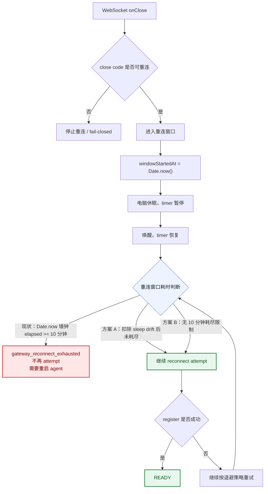
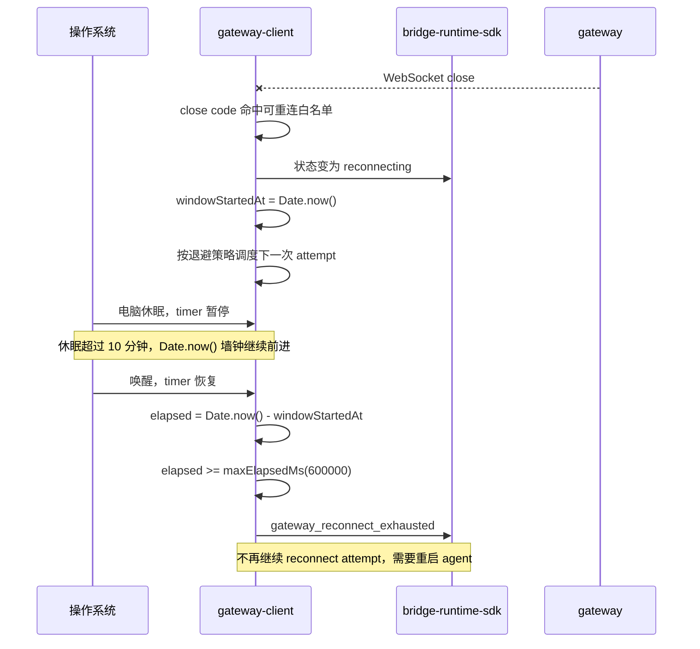
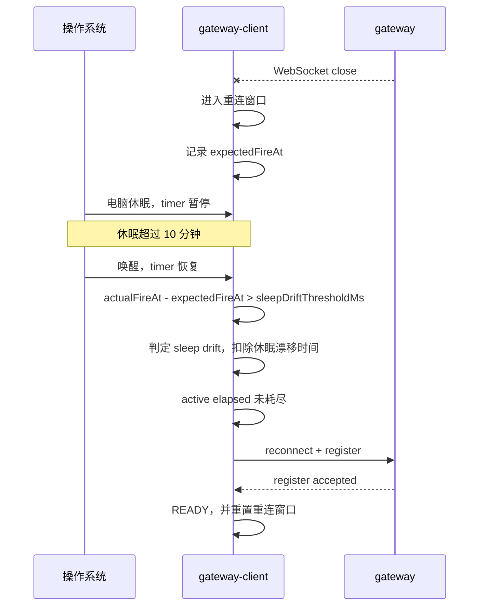
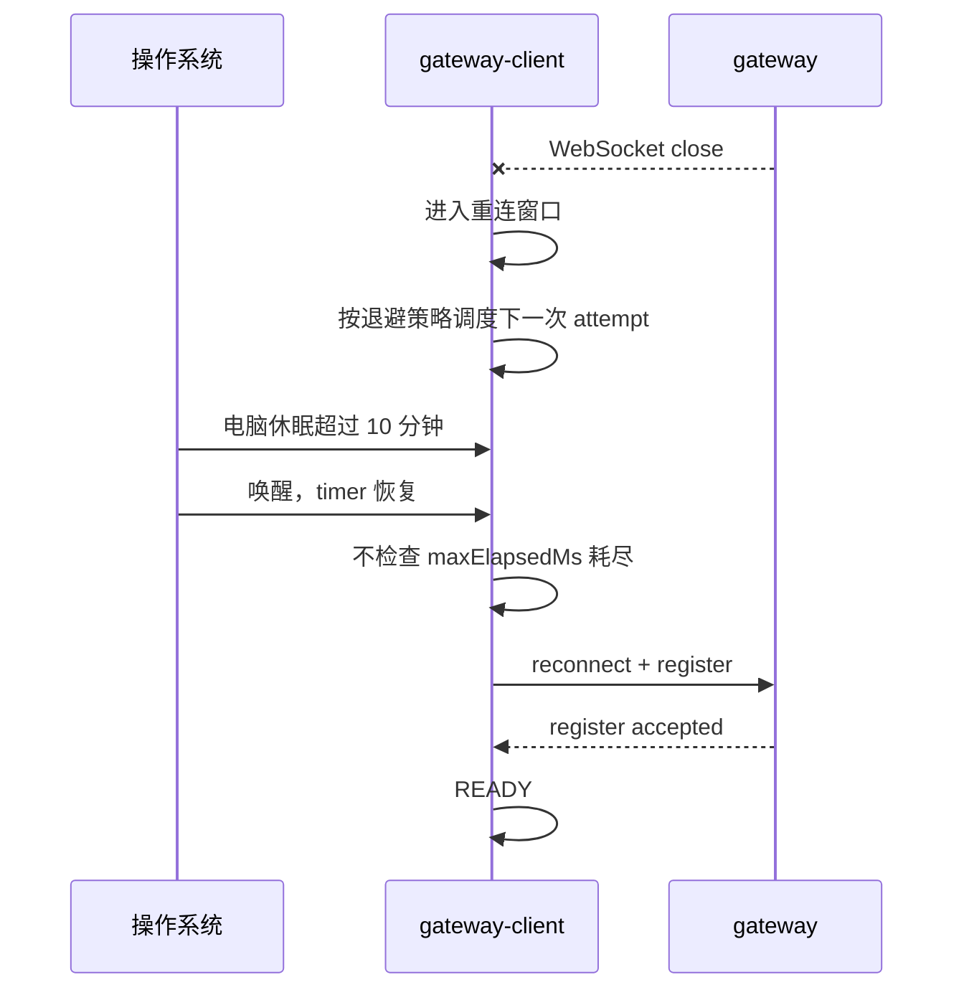

# `SDK 与 Gateway 重连窗口休眠耗尽优化方案`

- 方案日期：`2026-07-09`
- 目标工程：`agent-plugin`
- 参考文档：`packages/gateway-client/docs/reconnect-strategy-design.md`、`packages/gateway-client/src/application/runtime/ReconnectOrchestrator.ts`、`packages/gateway-client/src/adapters/DefaultReconnectPolicy.ts`、`packages/gateway-client/src/application/runtime/ConnectSession.ts`
- 方案类型：`线上故障优化方案`

## 1. 背景

### 1.1 场景说明

现网用户反馈：电脑休眠后，SDK 与 gateway 的 WebSocket 连接断开，唤醒后无法自动恢复，需要重新启动 agent。

当前代码没有专门监听系统休眠/唤醒事件。SDK 与 gateway 断开后，主要依赖 WebSocket `onClose` + close code 白名单进入重连窗口；进入重连窗口后，由 `ReconnectOrchestrator` 按退避策略调度下一次 reconnect attempt。

现有默认重连配置为：

1. `baseMs = 1000`
2. `maxMs = 30000`
3. `exponential = true`
4. `maxElapsedMs = 600000`

其中 `maxElapsedMs = 600000` 表示重连窗口最多 10 分钟。`DefaultReconnectPolicy` 当前使用 `Date.now() - windowStartedAt` 计算窗口耗时。电脑休眠期间 JavaScript timer 暂停，但 `Date.now()` 墙钟时间继续前进；如果进入重连窗口后电脑休眠超过 10 分钟，唤醒后下一次检查会直接判定窗口耗尽，进入 `gateway_reconnect_exhausted`，不再继续调度 reconnect attempt。

### 1.2 需求目标

1. 解决电脑休眠超过 10 分钟后，唤醒时重连窗口被墙钟时间误耗尽的问题。
2. 唤醒后 gateway 已恢复时，SDK 能继续 reconnect attempt 并回到 READY。
3. 保留长期不可达场景下的重连窗口止损能力，避免无限高频后台重试。
4. 明确是否去除 10 分钟耗尽限制的取舍，供评审决策。

### 1.3 非目标

1. 不改造 WebSocket close code 白名单。
2. 不处理其它重连增强项。
3. 不修改 gateway wire 业务消息协议。

## 2. 方案图

### 2.1 整体方案图

### 2.2 方案核心

只优化“重连窗口 10 分钟耗尽被电脑休眠误触发”的问题。评审在两个实现方向中决策：方案 A 保留 10 分钟止损但扣除休眠漂移；方案 B 去除 10 分钟耗尽限制，仅保留退避策略与 terminal error 停止条件。

## 3. 时序图

### 3.1 `现状：休眠超过 10 分钟后窗口耗尽`

### 3.2 `方案 A：休眠/定时器漂移检测`

### 3.3 `方案 B：去除 10 分钟耗尽限制`

## 4. 技术细节

### 4.1 调整点

1. 调整 `packages/gateway-client/src/adapters/DefaultReconnectPolicy.ts` 的重连窗口耗时判断。
2. 调整 `packages/gateway-client/src/application/runtime/ReconnectOrchestrator.ts` 的调度上下文，支持记录预计触发时间与实际触发时间。
3. 补充重连窗口耗尽、sleep drift 修正、去除耗尽限制三类测试。

### 4.2 核心实现方式

当前重连准入仍保持不变：

1. 自动重连主要由 WebSocket `onClose` 触发。
2. retryable close code 为 `1006 / 1012 / 1013 / 4408`。
3. terminal close code 为 `4403 / 4409`，命中后不触发自动重连。
4. 手动断开、abort 不触发自动重连。

本方案只讨论进入重连窗口后，`maxElapsedMs = 600000` 是否应被休眠期间的墙钟时间耗尽。

#### 4.2.1 方案 A：增加休眠/定时器漂移检测

实现方式：

1. `ReconnectOrchestrator` 调度 attempt 时记录 `expectedFireAt = clock.now() + delayMs`。
2. scheduler 实际触发时记录 `actualFireAt = clock.now()`。
3. 如果 `actualFireAt - expectedFireAt > sleepDriftThresholdMs`，判定发生休眠或长时间挂起。
4. `DefaultReconnectPolicy` 不再只使用 `Date.now() - windowStartedAt` 作为 elapsed，而是维护 active elapsed：
   - 正常调度间隔计入 active elapsed。
   - sleep drift 部分不计入 active elapsed。
   - 成功 READY 后 reset。
5. 检测到 sleep drift 后，允许立即执行一次 reconnect attempt，避免唤醒后继续等待长退避尾部。

优点：

1. 精准解决休眠超过 10 分钟后窗口被误耗尽的问题。
2. 保留 `maxElapsedMs` 对长期不可达场景的止损能力。
3. 对 gateway 压力和本机功耗影响较小。

风险：

1. 实现复杂度高于直接去除耗尽限制。
2. `sleepDriftThresholdMs` 需要评审确认，阈值过小可能误判长 GC 或系统繁忙，阈值过大可能漏判短休眠。
3. 需要增强 clock/scheduler 测试能力，避免时间相关测试不稳定。

#### 4.2.2 方案 B：去除 10 分钟耗尽限制

实现方式：

1. 将默认 `maxElapsedMs` 调整为无限制，或允许配置 `maxElapsedMs = 0 / null` 表示不耗尽。
2. `DefaultReconnectPolicy.scheduleNextAttempt()` 不再因为 elapsed 超过 10 分钟返回 exhausted。
3. 仍保留 `baseMs`、`maxMs`、`exponential`、`jitter`，确保重试频率受退避策略控制。
4. terminal error 仍停止重连：`4403 / 4409`、鉴权拒绝、注册拒绝、手动 disconnect、abort。

优点：

1. 实现简单，最直接避免休眠超过 10 分钟后不再重连。
2. 对长期休眠、gateway 长时间维护、用户网络长时间不可用后恢复的体验最好。
3. 不依赖系统 sleep/wake 事件或 timer drift 判断，跨平台行为更一致。

风险：

1. 失去 `maxElapsedMs` 作为长期不可达的止损边界。
2. 配置错误或 gateway 长期不可达时，客户端会持续后台重试。
3. 需要更明确的日志、状态展示和告警，否则用户可能不知道 agent 正在长期重试。

### 4.3 兼容与边界

1. 两个方案都不改变 close code 准入规则。
2. 两个方案都不改变 register message、gateway wire schema、业务消息格式。
3. 两个方案都不处理其它重连增强项。
4. 方案 A 保留 10 分钟活跃窗口语义；方案 B 改变该语义，需要产品和服务端共同确认。

### 4.4 相关接口联动

1. 方案 A 可新增内部配置：
   - `sleepDriftThresholdMs`
   - `reconnectElapsedMode = "active"`
2. 方案 B 可调整 `GatewayReconnectConfig.maxElapsedMs` 语义：
   - `maxElapsedMs?: number | null`
   - `0` 或 `null` 表示不限制总耗时
3. 对外是否暴露新配置待评审决定；若不暴露，可先作为 SDK 内部默认策略。

### 4.5 文档需要同步修改的内容

1. `packages/gateway-client/docs/reconnect-strategy-design.md`
   - 更新重连窗口耗尽语义。
   - 说明休眠时间是否计入重连窗口。
2. 插件配置文档
   - 如果方案 B 暴露 `maxElapsedMs = 0 / null`，需要说明含义。
3. 日志文档
   - 增加普通耗尽、sleep drift 修正、无限重试三类日志解释。

## 5. 性能

方案 A：

1. 只增加少量时间戳记录和差值计算。
2. 不增加额外网络请求。
3. 保留 `maxElapsedMs` 止损，长期不可达时仍会停止重连。
4. 对 CPU、内存、gateway 压力影响很小。

方案 B：

1. 去除总耗时限制后，长期不可达时会持续后台重试。
2. 在退避达到 `maxMs = 30000` 后，单个 agent 最多约每 30 秒一次 reconnect attempt。
3. 单客户端 CPU 消耗较低，但大量客户端同时离线或 gateway 故障时，会形成持续背景重连流量。
4. 建议配合 jitter，降低集中故障和集中恢复时的连接尖峰。

## 6. 功耗

方案 A：

1. 不增加轮询。
2. 不增加额外后台任务。
3. 休眠期间不会补偿执行 missed timer。
4. 功耗基本保持现状。

方案 B：

1. 长期不可达时会永久保持后台定时器和网络尝试。
2. 对桌面常驻 agent 可接受性较高。
3. 对笔记本电池、弱网环境不如方案 A 可控。

## 7. 埋码

1. `gateway.reconnect.exhausted`
   - 说明：记录普通重连窗口耗尽，包含 `elapsedMs`、`maxElapsedMs`。
2. `gateway.reconnect.sleep_drift_detected`
   - 说明：方案 A 使用，记录 `expectedFireAt`、`actualFireAt`、`driftMs`。
3. `gateway.reconnect.elapsed_adjusted`
   - 说明：方案 A 使用，记录扣除 sleep drift 后的 active elapsed。
4. `gateway.reconnect.unbounded_window`
   - 说明：方案 B 使用，记录当前重连窗口不设置总耗时限制。

## 8. 影响范围

### 8.1 直接影响

1. `packages/gateway-client/src/adapters/DefaultReconnectPolicy.ts`
2. `packages/gateway-client/src/application/runtime/ReconnectOrchestrator.ts`
3. `packages/gateway-client/tests/reconnect-close-decision.test.ts`
4. `packages/gateway-client/tests/should-retry-on-close.test.ts`

### 8.2 间接影响

1. gateway-client 重连日志。
2. bridge-runtime-sdk 看到的 `gateway_reconnect_exhausted` 触发概率。
3. 用户休眠唤醒后的自动恢复体验。

### 8.3 不影响

1. gateway wire 业务消息 schema。
2. OpenCode / OpenClaw provider 命令实现。
3. 插件 session isolation 逻辑。
4. `integration/opencode-cui` submodule。

## 9. 测试范围

### 9.1 功能测试

1. 现状复现：进入重连窗口后模拟休眠超过 10 分钟，当前实现会触发 `gateway_reconnect_exhausted`。
2. 方案 A：模拟 sleep drift 超过阈值，唤醒后不立即耗尽，继续 reconnect attempt。
3. 方案 A：未发生 sleep drift 时，超过 `maxElapsedMs` 仍触发 exhausted。
4. 方案 B：超过 10 分钟后仍继续调度 reconnect attempt。
5. 两个方案都需要验证 READY 后 reset 重连窗口。

### 9.2 兼容测试

1. retryable close code `1006 / 1012 / 1013 / 4408` 仍可进入重连窗口。
2. terminal close code `4403 / 4409` 仍不触发自动重连。
3. 手动 disconnect / abort 仍不触发自动重连。
4. 旧配置未设置新字段时，行为符合评审选定方案的默认策略。

### 9.3 文档一致性检查

1. `gateway-client` 重连策略文档与代码默认值一致。
2. 如果方案 B 暴露 `maxElapsedMs = 0 / null`，配置文档必须同步。
3. PR 描述按 `.github/PULL_REQUEST_TEMPLATE.md` 和 `docs/operations/pull-request-process.md` 填写。

## 10. 最终建议

最终结论：本方案只处理电脑休眠导致 10 分钟重连窗口被墙钟时间误耗尽的问题，其它重连增强项不纳入本次方案。

评审决策点：

1. 方案 A：增加休眠/定时器漂移检测，保留 10 分钟活跃重连窗口。
2. 方案 B：去除 10 分钟耗尽限制，让重连持续进行直到恢复或命中 terminal error。

初步倾向推荐方案 A，原因是它精准修复休眠误耗尽，同时保留长期不可达的止损边界。方案 B 实现更简单、用户恢复体验更强，但会带来长期后台重试和 gateway 持续连接压力，需要产品与服务端共同确认是否接受。
