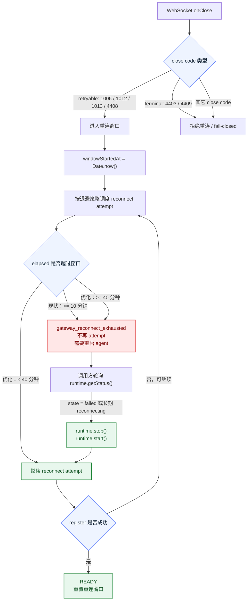
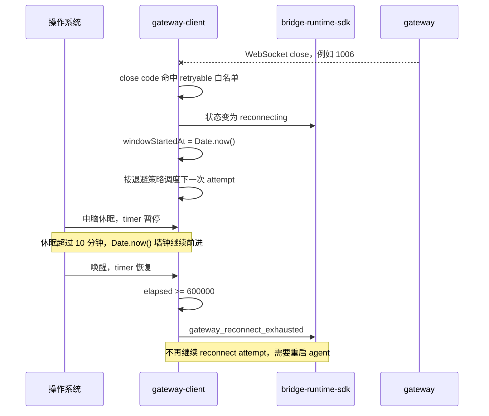
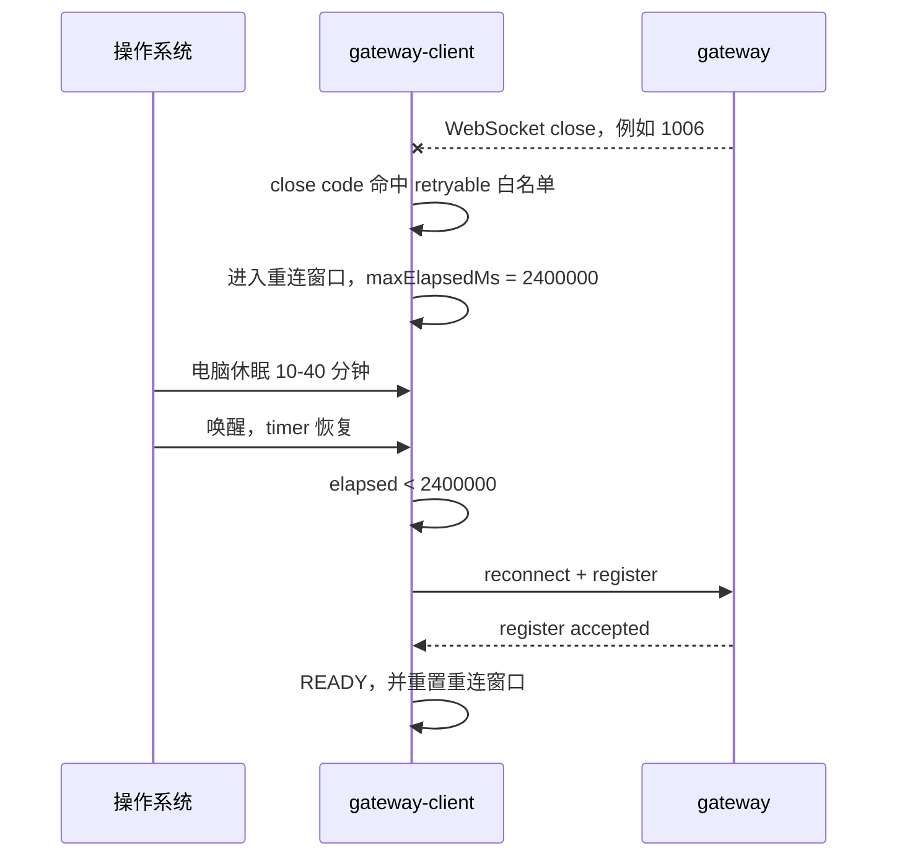
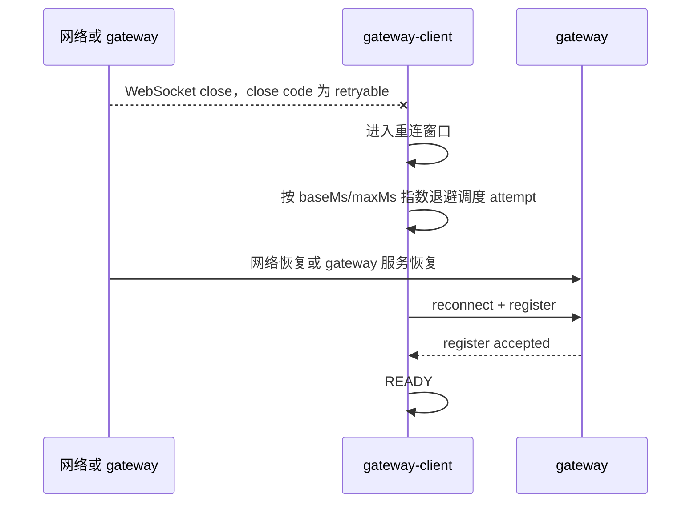
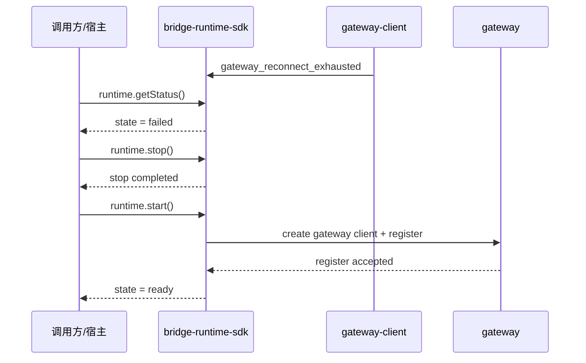

# `SDK 与 Gateway 重连窗口 40 分钟优化方案`

- 方案日期：`2026-07-09`
- 目标工程：`agent-plugin`
- 参考文档：`packages/gateway-client/docs/reconnect-strategy-design.md`、`packages/gateway-client/src/factory/createGatewayRuntimeDependencies.ts`、`packages/gateway-client/src/adapters/DefaultReconnectPolicy.ts`、`packages/gateway-client/src/application/runtime/ReconnectOrchestrator.ts`、`packages/gateway-client/src/application/runtime/shouldRetryOnClose.ts`、`packages/gateway-client/src/application/runtime/evaluateReconnectOnClose.ts`
- 方案类型：`线上故障优化方案`

## 1. 背景

### 1.1 场景说明

现网用户反馈：电脑休眠、网络重连、gateway 服务重启后，SDK 与 gateway 的 WebSocket 连接断开，唤醒或服务恢复后没有自动恢复，需要重新启动 agent。

当前代码没有专门监听系统休眠/唤醒事件。SDK 与 gateway 断开后，主要依赖 WebSocket `onClose` + close code 白名单进入重连窗口；进入重连窗口后，由 `ReconnectOrchestrator` 按退避策略调度下一次 reconnect attempt。

现有默认重连配置为：

1. `baseMs = 1000`
2. `maxMs = 30000`
3. `exponential = true`
4. `maxElapsedMs = 600000`

其中 `maxElapsedMs = 600000` 表示重连窗口最多 10 分钟。`DefaultReconnectPolicy` 当前使用 `Date.now() - windowStartedAt` 计算窗口耗时。电脑休眠期间 JavaScript timer 暂停，但 `Date.now()` 墙钟时间继续前进；如果进入重连窗口后电脑休眠超过 10 分钟，唤醒后下一次检查会直接判定窗口耗尽，进入 `gateway_reconnect_exhausted`，不再继续调度 reconnect attempt。

### 1.2 需求目标

1. 将默认重连窗口从 10 分钟调整为 40 分钟，即 `maxElapsedMs` 从 `600000` 调整为 `2400000`。
2. 降低电脑短中时长休眠、网络短时不可达、gateway 短时维护后需要重启 agent 的概率。
3. 保留重连窗口耗尽的止损能力，不引入无限重试。
4. 明确 WebSocket close code 中哪些触发重连，哪些拒绝重连。
5. 明确超过 40 分钟后的调用方兜底恢复建议。
6. 明确网络断开、休眠唤醒、服务重启三类场景的验证方式。

### 1.3 非目标

1. 不改造 WebSocket close code 白名单。
2. 不新增系统 sleep/wake 事件监听。
3. 不新增半开连接 watchdog。
4. 不扩展 reconnect attempt 中非 close 失败的重试分类。
5. 不修改 gateway wire 业务消息协议。

## 2. 方案图

### 2.1 整体方案图



### 2.2 方案核心

最终方案是将默认重连耗尽窗口从 10 分钟调整为 40 分钟。该方案不改变重连触发条件、不引入无限重试、不新增休眠检测；它通过延长现有 `maxElapsedMs`，覆盖更多真实用户的短中时长休眠、网络切换和 gateway 短时重启场景。

对于断开超过 40 分钟的隔夜休眠、长时间断网、长时间 gateway 不可用场景，40 分钟窗口仍会耗尽。建议调用方基于 `bridge-runtime-sdk` 暴露的 `runtime.getStatus()` 做兜底恢复：当状态进入 `failed`，或长时间停留在 `reconnecting` 且业务判断需要恢复时，由调用方执行 `runtime.stop()` 后再执行 `runtime.start()`，主动启动一轮新连接。

## 3. 时序图

### 3.1 `休眠唤醒：现状 10 分钟耗尽`



### 3.2 `休眠唤醒：优化后 40 分钟窗口`



### 3.3 `网络断开与 gateway 服务重启`



### 3.4 `超过 40 分钟：调用方主动恢复`



## 4. 技术细节

### 4.1 调整点

1. 调整 `packages/gateway-client/src/factory/createGatewayRuntimeDependencies.ts` 中的默认重连配置。
2. 将 `DEFAULT_RECONNECT_CONFIG.maxElapsedMs` 从 `600000` 调整为 `2400000`。
3. 补充或调整单元测试，验证默认配置、耗尽判断和 READY 后 reset。
4. 同步 `packages/gateway-client/docs/reconnect-strategy-design.md` 中关于默认重连窗口的说明。

### 4.2 核心实现方式

代码改动建议：

```ts
const DEFAULT_RECONNECT_CONFIG: Required<GatewayReconnectConfig> = {
  baseMs: 1000,
  maxMs: 30000,
  exponential: true,
  jitter: GATEWAY_RECONNECT_JITTER.NONE,
  maxElapsedMs: 2400000,
  enabled: true,
};
```

该调整只改变默认重连窗口长度，不改变以下逻辑：

1. `DefaultReconnectPolicy.scheduleNextAttempt()` 仍按 elapsed 判断是否耗尽。
2. `ReconnectOrchestrator` 仍按退避策略调度 reconnect attempt。
3. READY 后仍通过 `reconnectOrchestrator.reset()` 重置重连窗口。
4. close code 准入仍由 `shouldRetryOnClose()` 和 `evaluateReconnectOnClose()` 决定。

### 4.3 close code 准入说明

| close code | 类型 | 是否触发自动重连 | 含义 | 处理策略 |
|---|---|---|---|---|
| `1006` | retryable | 是 | 异常断开。客户端没有收到正常 close frame，常见于网络突然断开、进程退出、连接被中间设备切断。 | 进入重连窗口，按退避策略重试，最长 40 分钟。 |
| `1012` | retryable | 是 | Service Restart。服务端正在重启，适合 gateway 发布、重启、滚动更新时主动关闭连接。 | 进入重连窗口，按退避策略重试，最长 40 分钟。 |
| `1013` | retryable | 是 | Try Again Later。服务端临时不可用、过载或依赖短暂异常，希望客户端稍后再试。 | 进入重连窗口，按退避策略重试，最长 40 分钟。 |
| `4408` | retryable | 是 | register timeout。项目协议层自定义 close code，表示注册握手超时。 | 进入重连窗口，按退避策略重试，最长 40 分钟。 |
| `4403` | terminal | 否 | 鉴权或权限拒绝。当前 AK/SK、账号状态或访问权限不满足 gateway 接入要求。 | fail-closed，暴露明确错误，避免无效重试。 |
| `4409` | terminal | 否 | 注册冲突或接入被拒绝。gateway 明确拒绝当前注册请求，例如同一身份冲突、重复注册或服务端策略拒绝。 | fail-closed，避免无限抢占或抖动。 |
| 其它 close code | terminal by default | 否 | 未进入当前白名单的断开原因。 | 默认 fail-closed，避免未知语义被误判为可恢复。 |

补充边界：

1. 手动 `disconnect()` 不触发自动重连。
2. `abortSignal` 已触发时不触发自动重连。
3. 本方案不改变上述 close code 集合，只改变 retryable close 进入重连窗口后的默认耗尽时间。

### 4.4 兼容与边界

1. 已配置自定义 `reconnect.maxElapsedMs` 的调用方不受默认值影响，仍以显式配置为准。
2. 未配置 `reconnect.maxElapsedMs` 的调用方默认窗口从 10 分钟变为 40 分钟。
3. 如果休眠或不可达时间超过 40 分钟，仍会进入 `gateway_reconnect_exhausted`。
4. 如果休眠后 socket 半开且没有触发 WebSocket close，本方案不会主动发现该状态。
5. 如果 gateway 服务重启期间不是 retryable close code，仍不会进入自动重连。

### 4.5 调用方兜底恢复建议

40 分钟窗口优化不能覆盖隔夜休眠、长时间断网、gateway 长时间维护等超过窗口的场景。为避免用户第二天唤醒电脑后仍需要手动重启 agent，建议 `bridge-runtime-sdk` 的调用方增加运行态兜底恢复逻辑。

建议策略：

1. 调用方周期性读取 `runtime.getStatus()`。
2. 当 `status.state === "failed"`，且 failure reason 属于 gateway 重连耗尽或 gateway transport 失败时，调用方可以主动执行恢复。
3. 当 `status.state === "reconnecting"` 持续超过调用方自定义阈值，也可以进入主动恢复流程；该阈值建议大于 SDK 默认窗口，例如 45 分钟。
4. 主动恢复流程固定为先 `runtime.stop()`，再 `runtime.start()`，避免旧连接、旧 scheduler 或旧 provider 状态残留。
5. 调用方应避免高频循环重启，建议加恢复冷却时间，例如 1-5 分钟。

示例伪代码：

```ts
async function recoverRuntimeIfNeeded(runtime: BridgeRuntime): Promise<void> {
  const status = runtime.getStatus();
  if (status.state !== "failed") {
    return;
  }

  await runtime.stop();
  await runtime.start();
}
```

注意事项：

1. `runtime.stop()` / `runtime.start()` 是调用方兜底，不改变 `gateway-client` 内部重连策略。
2. 如果失败原因是鉴权拒绝、注册拒绝、手动 stop 或配置错误，调用方不应盲目循环重启。
3. 如果业务需要覆盖长期 `reconnecting`，调用方应记录进入 `reconnecting` 的时间，超过阈值后再恢复，避免和 SDK 自身 40 分钟窗口互相抢占。

### 4.6 文档需要同步修改的内容

1. `packages/gateway-client/docs/reconnect-strategy-design.md`
   - 将默认 `maxElapsedMs` 从 10 分钟更新为 40 分钟。
   - 同步 retryable / terminal close code 表述。
   - 补充超过 40 分钟后调用方可通过 `runtime.getStatus()` + `runtime.stop()` + `runtime.start()` 进行兜底恢复。
2. 插件配置文档
   - 如文档写到默认重连窗口，需要同步为 40 分钟。
3. 日志文档
   - `gateway.reconnect.exhausted` 的默认耗尽窗口说明同步为 40 分钟。

## 5. 性能

本方案不增加请求频率，只延长允许重连的总时间。

现有退避上限为 `maxMs = 30000`。窗口从 10 分钟调整到 40 分钟后的影响估算：

1. 前 10 分钟行为与当前一致。
2. 10-40 分钟区间内，已达到最大退避后约每 30 秒一次 reconnect attempt。
3. 相比现状，最坏情况下每个断线 agent 额外增加约 30 分钟 / 30 秒 = 60 次 reconnect attempt。
4. 单个 agent 的 CPU、内存影响很小，因为重试由定时器驱动，且频率较低。
5. 对 gateway 的影响主要体现在故障或网络不可达期间的额外连接尝试。若大量客户端同时断线，40 分钟窗口会让背景重连流量持续更久。

结论：从单机性能看可接受；从服务端容量看，需要确认 gateway 能接受每个断线客户端最多额外约 60 次低频连接尝试。若担心集中重连尖峰，可后续评估将默认 jitter 调整为 full jitter，但这不属于本次方案范围。

## 6. 功耗

本方案不新增轮询、不新增后台任务，只延长已有 reconnect scheduler 的存活时间。

影响分析：

1. 前 10 分钟功耗与当前一致。
2. 10-40 分钟期间，断线 agent 会继续约每 30 秒尝试一次连接。
3. 对桌面常驻 agent 通常可接受。
4. 对笔记本电池场景会比当前多一些网络唤醒，但频率较低，且 40 分钟后仍会停止。

结论：功耗影响可控，优于无限重试方案。

## 7. 埋码

1. `gateway.reconnect.scheduled`
   - 说明：已有调度日志需要能看到 `elapsedMs`、`delayMs`、`attempt`。
2. `gateway.reconnect.exhausted`
   - 说明：耗尽时记录 `elapsedMs`、`maxElapsedMs = 2400000`。
3. `gateway.close`
   - 说明：记录 close code、reason、是否 `reconnectPlanned`，用于区分 retryable 和 terminal close。
4. `runtime.recover.requested`
   - 说明：调用方执行兜底恢复时记录，包含恢复原因、恢复前状态、冷却时间。
5. `runtime.recover.completed`
   - 说明：调用方 `stop()` + `start()` 成功完成并回到 READY 时记录。

## 8. 影响范围

### 8.1 直接影响

1. `packages/gateway-client/src/factory/createGatewayRuntimeDependencies.ts`
2. `packages/gateway-client/tests/*reconnect*`
3. `packages/gateway-client/docs/reconnect-strategy-design.md`

### 8.2 间接影响

1. `bridge-runtime-sdk` 看到 `gateway_reconnect_exhausted` 的时间从默认 10 分钟后延后到 40 分钟后。
2. 用户在 10-40 分钟内恢复网络、唤醒电脑或等待 gateway 恢复时，自动恢复概率提升。
3. gateway 在大规模断线场景下会承受更长时间的低频重连尝试。
4. 调用方如果采纳兜底恢复建议，需要新增状态监控和主动 `stop()` / `start()` 编排。

### 8.3 不影响

1. gateway wire 业务消息 schema。
2. WebSocket close code 白名单。
3. OpenCode / OpenClaw provider 命令实现。
4. 插件 session isolation 逻辑。
5. `integration/opencode-cui` submodule。

## 9. 测试范围

### 9.1 功能测试

1. 默认配置测试
   - 不传 `reconnect.maxElapsedMs` 时，默认值应为 `2400000`。
   - 显式传入 `reconnect.maxElapsedMs` 时，应优先使用显式配置。

2. 重连窗口耗尽测试
   - 模拟 elapsed 小于 `2400000`，`scheduleNextAttempt()` 应返回可调度。
   - 模拟 elapsed 大于等于 `2400000`，应返回 exhausted。
   - READY 后应 reset attempt 和 window。

3. close code 准入测试
   - `1006 / 1012 / 1013 / 4408` 应触发重连窗口。
   - `4403 / 4409` 不应触发重连。
   - 手动 disconnect / abort 不应触发重连。

### 9.2 现网场景验证

#### 9.2.1 网络连接断开

验证目标：网络短时断开后，在 40 分钟窗口内恢复网络，SDK 能自动回到 READY。

建议步骤：

1. 启动 agent，并确认 gateway 状态为 READY。
2. 断开本机网络，例如关闭 Wi-Fi、拔掉网线，或使用系统网络开关。
3. 观察日志出现 WebSocket close，且 close code 命中 retryable 时进入 `gateway.reconnect.scheduled`。
4. 保持断网 10-40 分钟内任意时长。
5. 恢复网络。
6. 观察 SDK 发起 reconnect + register，并回到 READY。

通过标准：

1. 断网期间出现 `gateway.reconnect.scheduled`。
2. 40 分钟内不出现 `gateway_reconnect_exhausted`。
3. 网络恢复后无需重启 agent，状态回到 READY。

#### 9.2.2 电脑休眠唤醒

验证目标：进入重连窗口后，电脑休眠超过 10 分钟但小于 40 分钟，唤醒后仍继续重连。

建议步骤：

1. 启动 agent，并确认 gateway 状态为 READY。
2. 通过关闭网络或停止 gateway，让 WebSocket close 并进入重连窗口。
3. 确认日志出现 `gateway.reconnect.scheduled`。
4. 让电脑休眠，休眠时长建议选择 15 分钟、30 分钟两档。
5. 唤醒电脑，并恢复网络或 gateway。
6. 观察是否继续 reconnect attempt，并回到 READY。

通过标准：

1. 休眠超过 10 分钟后唤醒，不应立即出现 `gateway_reconnect_exhausted`。
2. elapsed 小于 40 分钟时，应继续调度 reconnect attempt。
3. gateway 可用后无需重启 agent，状态回到 READY。

边界验证：

1. 休眠超过 40 分钟后唤醒，允许出现 `gateway_reconnect_exhausted`。
2. 休眠超过 40 分钟后，调用方可通过 `runtime.getStatus()` 观察到 `failed`，再执行 `runtime.stop()` + `runtime.start()` 主动恢复。
3. 如果休眠后没有触发 WebSocket close，本方案不保证立即重连，该情况不属于本次优化验收范围。

#### 9.2.3 gateway 服务重启

验证目标：gateway 服务重启在 40 分钟窗口内完成时，SDK 自动重连并重新注册。

建议步骤：

1. 启动 agent，并确认 gateway 状态为 READY。
2. 重启 gateway 服务，建议服务端主动使用 `1012` 或 `1013` close code。
3. 观察 SDK 进入 reconnecting，并出现 `gateway.reconnect.scheduled`。
4. 保持 gateway 不可用 10-40 分钟内任意时长。
5. 启动 gateway 服务。
6. 观察 SDK reconnect + register 成功，状态回到 READY。

通过标准：

1. 服务重启触发的 close code 为 `1012` 或 `1013` 时，应进入重连窗口。
2. gateway 在 40 分钟内恢复后，无需重启 agent，SDK 回到 READY。
3. 如果 close code 为 `4403 / 4409`，应拒绝重连并 fail-closed。

### 9.3 文档一致性检查

1. `gateway-client` 重连策略文档与默认值 `2400000` 一致。
2. close code 表格与 `shouldRetryOnClose()`、`evaluateReconnectOnClose()` 测试一致。
3. PR 描述按 `.github/PULL_REQUEST_TEMPLATE.md` 和 `docs/operations/pull-request-process.md` 填写。

### 9.4 调用方兜底恢复验证

验证目标：断开超过 40 分钟导致 SDK 内部重连窗口耗尽后，调用方可通过 runtime 状态主动恢复连接。

建议步骤：

1. 启动 agent，并确认 runtime 状态为 READY。
2. 制造 retryable close，让 SDK 进入 reconnecting。
3. 通过测试 clock 或缩短测试配置模拟 `maxElapsedMs` 耗尽，观察 runtime 进入 `failed`。
4. 调用 `runtime.getStatus()`，确认 `state === "failed"`。
5. 调用方执行 `await runtime.stop(); await runtime.start();`。
6. gateway 可用时，观察 runtime 回到 READY。

通过标准：

1. `runtime.getStatus()` 能暴露 `failed` 状态。
2. `runtime.stop()` 后旧连接和旧重连调度被清理。
3. `runtime.start()` 能创建新连接并重新 register。
4. 对 terminal error，例如 `4403 / 4409`，调用方不应无限循环执行恢复。

## 10. 最终建议

最终结论：推荐将默认重连耗尽时间从 10 分钟调整为 40 分钟，即 `maxElapsedMs = 2400000`。同时建议调用方增加基于 `runtime.getStatus()` 的兜底恢复：当 runtime 进入 `failed`，或长期停留在 `reconnecting` 且业务判断需要恢复时，调用方执行 `runtime.stop()` 后再执行 `runtime.start()`，主动启动新连接。

取舍原因：

1. 相比实现 sleep/wake 检测，调整默认窗口改动更小，风险更低。
2. 相比去除耗尽限制，40 分钟仍保留止损边界，性能和功耗更可控。
3. 对用户常见的短中时长休眠、网络切换、gateway 短时维护，40 分钟窗口能显著降低需要重启 agent 的概率。
4. 对超过 40 分钟的隔夜休眠场景，调用方兜底恢复可以补齐 SDK 内部窗口耗尽后的恢复路径。

后续动作：

1. 修改 `DEFAULT_RECONNECT_CONFIG.maxElapsedMs` 为 `2400000`。
2. 补充默认值、耗尽窗口、close code 准入测试。
3. 在调用方接入 `runtime.getStatus()` 状态监控和 `runtime.stop()` + `runtime.start()` 兜底恢复。
4. 按第 9 章验证网络断开、休眠唤醒、gateway 服务重启、超过 40 分钟后调用方主动恢复四类场景。
