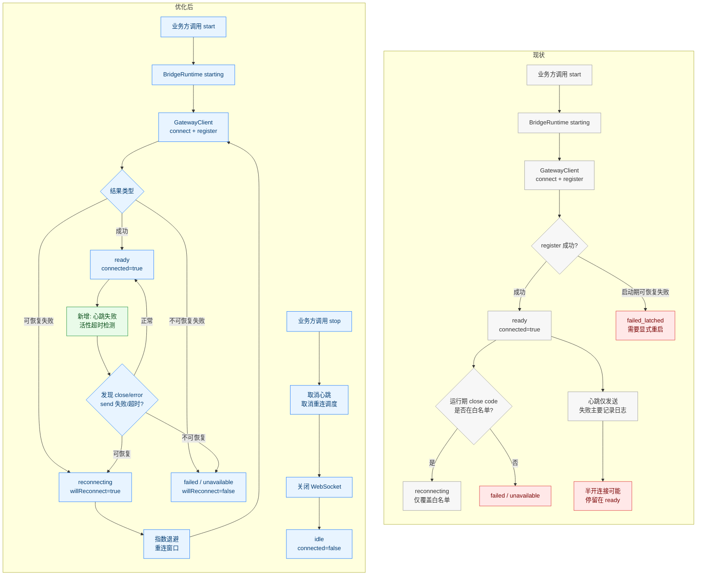
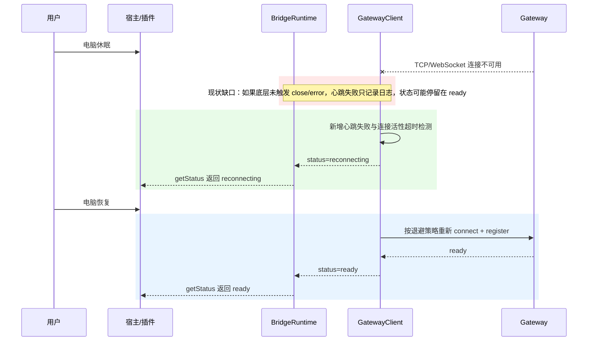
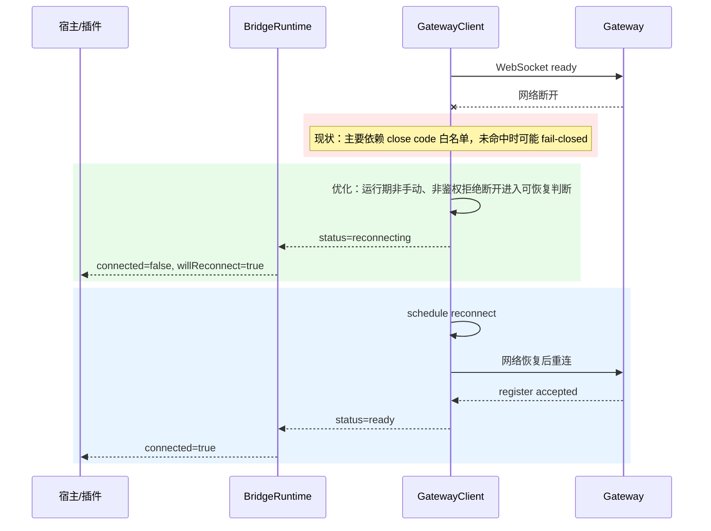
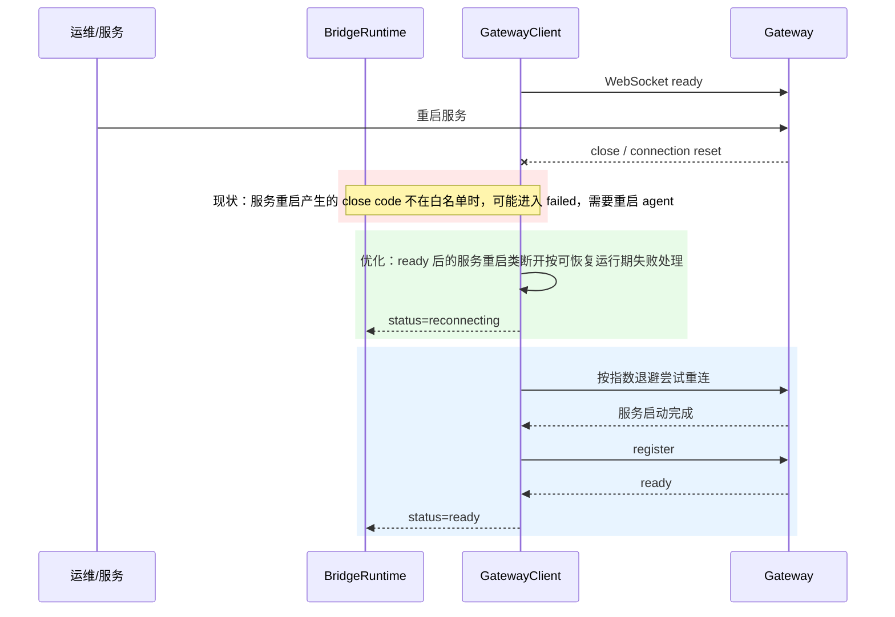
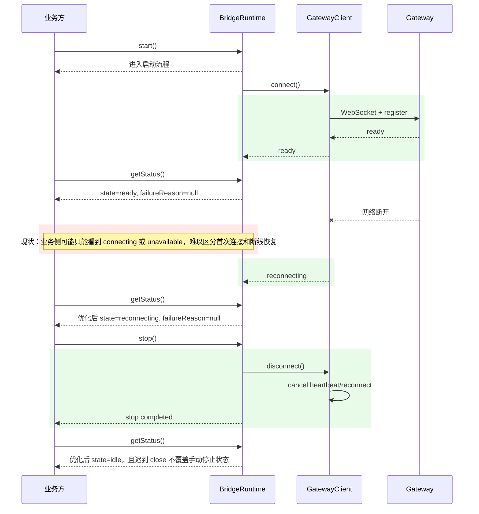

# `SDK 与 Gateway 连接自动恢复及状态可感知优化方案`

- 方案日期：`2026-07-08`
- 目标工程：`agent-plugin`
- 参考文档：`packages/gateway-client/docs/reconnect-strategy-design.md`、`packages/bridge-runtime-sdk/docs/bridge-runtime-sdk-architecture.md`、`docs/architecture/gateway-client-architecture.md`、`docs/architecture/bridge-runtime-sdk-architecture.md`
- 方案类型：`稳定性优化 / SDK API 状态语义优化 / 长连接自动恢复`

## 1. 背景

### 1.1 场景说明

现网用户反馈在电脑休眠、网络断开后重连、gateway 服务重启等高频场景中，SDK 与 gateway 的 WebSocket 连接断开后无法自动恢复，需要重新启动 agent。

当前仓库已有重连基础能力，主要位于 `packages/gateway-client`：

1. `GatewayClientRuntime` 负责 `connect`、`disconnect`、`send`、`getStatus` 的运行时编排。
2. `ConnectSession` 负责单次 WebSocket 连接、register 握手、close/error/message 事件处理。
3. `ReconnectOrchestrator` 负责重连调度。
4. `DefaultReconnectPolicy` 默认使用指数退避：`baseMs=1000`、`maxMs=30000`、`exponential=true`、`jitter=none`、`maxElapsedMs=600000`、`enabled=true`。
5. `shouldRetryOnClose` 当前仅对白名单 close code 自动重试：`1006`、`1012`、`1013`、`4408`。
6. `4403`、`4409` 被视为 gateway 拒绝，当前不自动重连。

当前问题不是完全没有重连，而是重连触发面偏窄，且业务侧对 `starting`、`ready`、`reconnecting`、`failed` 的感知不够明确。

#### 1.1.1 场景现状与优化后对比

| 场景 | 当前现状 | 主要问题 | 优化后表现 | 业务可感知状态 |
| --- | --- | --- | --- | --- |
| 电脑休眠后恢复 | 休眠期间 TCP/WebSocket 可能变成半开；如果底层没有及时触发 `close/error`，SDK 仍可能停留在 `ready`；心跳发送失败当前主要记录日志。 | 连接实际不可用但状态可能仍显示可用；如果重连窗口按墙钟时间计算，休眠 1 小时会超过现有 `maxElapsedMs=600000`，恢复后可能直接重连耗尽。 | 增加心跳发送失败、连接活性超时与休眠恢复检测；休眠时间不计入快速重连窗口，唤醒后立即尝试 `connect + register`；即使超过 10 分钟也不停止可恢复重连。 | 休眠恢复检测到异常后：`reconnecting`、`connected=false`、`willReconnect=true`；唤醒后继续重连，成功后：`ready`、`connected=true`。 |
| 网络断开后重连 | 运行期断开主要依赖 close code 白名单：`1006/1012/1013/4408`；未命中白名单时可能进入 `failed/unavailable`。 | 网络断开表现不稳定；即使命中可重连，连续断网超过 10 分钟也会重连耗尽，用户恢复网络后 client 不再主动重连。 | `ready` 后的非手动、非 abort、非鉴权拒绝断开，按可恢复运行期失败处理；前 10 分钟快速指数退避，超过后进入低频保活重连，网络恢复后自动连回。 | 断网期间：`reconnecting`、`connected=false`、`willReconnect=true`；网络恢复且 register 成功后：`ready`、`connected=true`。 |
| gateway 服务重启 | 服务重启可能产生 connection reset 或非白名单 close code；当前可能 fail-closed。 | gateway 短暂不可用会把 runtime 推入失败态；如果服务维护超过 10 分钟，现有重连窗口耗尽后也不会在服务恢复时自动重连。 | 将服务重启类运行期断开纳入可恢复范围；前 10 分钟快速恢复，超过后低频探测，服务恢复后自动 register；保留 `4403/4409` 等明确拒绝场景不重连。 | 服务重启期间：`reconnecting`、`willReconnect=true`；服务恢复后：`ready`。 |
| 首次启动时 gateway 暂不可用 | `connect + register` 失败可能使 `BridgeRuntime.start()` reject；`plugins/message-bridge` singleton 可能进入 `failed_latched`。 | 自动初始化失败后不会再次自动尝试，必须显式重启或重新 start；长时间无网络或 gateway 未启动也会耗尽。 | 对启动期网络类、服务未就绪类错误进入重连窗口；超过快速窗口后降级为低频保活重连；只有不可恢复错误或用户显式 stop 才停止。 | 启动恢复中：`starting` 或 `reconnecting`；长期不可达时仍保持 `willReconnect=true`，恢复后进入 `ready`。 |
| `start/stop/getStatus` 状态感知 | `starting` 与 `reconnecting` 在部分插件公共状态中都映射为 `connecting`；`stop()` 后需要避免迟到 close 覆盖状态。 | 业务方难以区分首次启动、断线恢复、已停止、失败。 | 保留兼容字段，同时新增或透出更细的 `runtimeState/connectionState`；`stop()` 明确取消心跳和重连调度。 | `start()` 后可见 `starting/reconnecting/ready/failed`；`stop()` 后稳定为 `idle` 或 stopped 类状态。 |

### 1.2 需求目标

1. 梳理并对齐现有重连策略，明确当前哪些断开会自动恢复，哪些会 fail-closed。
2. 覆盖电脑休眠、网络重连、gateway 服务重启三类高频场景，使可恢复断开无需重启 agent。
3. 连接状态对业务方可感知，重点保证 `start`、`stop`、`getStatus` 能准确反映当前连接状态。
4. 保留鉴权失败、配置错误、协议拒绝等不可恢复错误的 fail-closed 行为。
5. 不让 provider、session、permission、question 等业务逻辑感知底层重连细节。

### 1.3 非目标

1. 不修改 gateway wire 业务协议字段。
2. 不改变 AK/SK 鉴权算法。
3. 不把所有 WebSocket close 都无条件重试。
4. 不修改 `integration/opencode-cui` submodule 或集成夹具指针。
5. 不重写现有 gateway-client 与 bridge-runtime-sdk 架构。

## 2. 方案图

### 2.1 整体方案图

### 2.2 方案核心

复用现有 `ReconnectOrchestrator` 与生命周期状态机，补齐“断线检测、初始连接失败重试、服务重启 close 兼容、状态精确投影”四个环节，使连接从“部分 close code 可恢复”升级为“常见网络、休眠、服务重启可自动恢复且业务可观测”。

## 3. 时序图

### 3.1 `电脑休眠后恢复`

### 3.2 `网络断开后重连`

### 3.3 `gateway 服务重启`

### 3.4 `start/stop/getStatus 状态可感知`

## 4. 技术细节

### 4.1 调整点

1. 对齐现有重连策略：
   - 策略入口：`ReconnectOrchestrator.scheduleReconnect()`。
   - 退避实现：`DefaultReconnectPolicy`。
   - close 决策：`evaluateReconnectOnClose()` 与 `shouldRetryOnClose()`。
   - 底层状态源：`GatewayLifecycleState`。
   - Runtime 状态源：`RuntimeLifecycleState`。
2. 扩展运行期可恢复断开判定：
   - `ready` 后发生的非手动、非 abort、非鉴权拒绝 close，应优先进入 `reconnecting`。
   - `4403`、`4409` 继续不可重连。
   - 手动 `disconnect/stop` 继续不可重连。
3. 增加连接活性检测：
   - 心跳发送失败不能只记录 `gateway.heartbeat.failed`，需要触发当前连接关闭并进入重连评估。
   - 增加心跳超时或活动超时 watchdog，覆盖休眠恢复后 WebSocket 未及时触发 close 的半开连接。
4. 优化首次连接失败后的自动恢复：
   - 首次启动遇到 gateway 暂不可用、网络暂不可用、服务重启窗口时，进入 `reconnecting`，不要直接让插件进入不可自动恢复的 `failed_latched`。
   - `maxElapsedMs` 不应作为可恢复故障的永久停止条件，否则休眠、断网、gateway 长时间维护都会在恢复后无法自动重连。
   - 推荐把 `maxElapsedMs=600000` 定义为“快速重连窗口上限”，超过后从快速指数退避降级为低频保活重连，而不是进入永久 failed。
5. 调整重连窗口耗尽语义：
   - 现有默认 `maxElapsedMs=600000` 对普通网络抖动与 gateway 短暂重启是合理的快速恢复窗口，但不适合作为可恢复故障的终止窗口。
   - 推荐采用两阶段重连：第一阶段在 `maxElapsedMs` 内使用现有指数退避快速恢复；第二阶段进入低频保活重连，例如每 60 秒或 120 秒尝试一次。
   - 低频保活重连只针对可恢复错误：网络不可达、连接超时、gateway 服务未就绪、运行期 transport close。
   - 不可恢复错误仍立即终止：手动 `stop/disconnect`、`AbortSignal`、鉴权拒绝、协议拒绝、register 参数错误、明确的 duplicate policy 拒绝。
   - `TimeoutReconnectScheduler` 调度时记录计划触发时间；如果实际触发时间明显晚于计划时间，例如漂移超过 60 秒，判定发生系统休眠或进程冻结，恢复后立即尝试一次重连。
   - `GATEWAY_RECONNECT_EXHAUSTED` 不再用于普通可恢复网络/gateway 长期不可达场景；仅用于策略显式配置为有限重试，或出现不可恢复错误时的终态映射。
6. 状态对外精确投影：
   - `GatewayClientStatus` 保留 `closed/connecting/ready/reconnecting`。
   - `BridgeRuntimeStatusSnapshot.state` 保留 `idle/starting/ready/reconnecting/stopping/failed`。
   - `plugins/message-bridge` 建议新增 `runtimeState` 或 `connectionState`，区分 `starting` 与 `reconnecting`。
   - `plugins/message-bridge-openclaw` 建议将 `runtimePhase` 扩展为支持 `reconnecting`，或增加 `willReconnect` 字段。

### 4.2 核心实现方式

第一层：增强 `gateway-client` 重连触发。

1. 调整 `packages/gateway-client/src/application/runtime/evaluateReconnectOnClose.ts`：
   - 保留 `manuallyDisconnected`、`aborted`、`reconnectEnabled=false`、`4403/4409` 的 stop 逻辑。
   - 对 `phase === "ready"` 的运行期异常关闭，除明确不可恢复 close code 外，默认进入 `start-window`。
   - 对 `reconnectAttempt === true` 且未命中不可恢复条件的关闭，允许 `continue-window`。
2. 调整 `packages/gateway-client/src/application/runtime/shouldRetryOnClose.ts`：
   - 保留白名单 close code 作为强信号。
   - 将“运行期是否允许恢复”的最终判断放在 `evaluateReconnectOnClose`，避免低层函数承载过多业务语义。
3. 启动期保持谨慎：
   - 参数错误、鉴权拒绝、协议错误不重连。
   - 网络类连接失败可进入重连窗口，覆盖 gateway 尚未启动或重启中的场景。

第二层：补齐连接活性检测。

1. 调整 `packages/gateway-client/src/application/runtime/HeartbeatLoop.ts`：
   - 心跳发送失败时通知当前连接进入失败路径。
   - 停止只打日志但状态仍保持 ready 的行为。
2. 建议新增 `ConnectionHealthMonitor` 或在 `ConnectSession` 内维护健康检查：
   - 记录最近 inbound、outbound、heartbeat 时间。
   - 超过 `heartbeatIntervalMs * 2 + graceMs` 后主动关闭 transport。
3. 如果 gateway 支持 heartbeat ack，中期建议增加 pong/ack 控制帧；短期可先基于 send 失败、close/error、活动超时判断。

第三层：让重连窗口支持长期可恢复故障。

1. 调整 `packages/gateway-client/src/adapters/TimeoutReconnectScheduler.ts` 或在 `ReconnectOrchestrator` 中记录：
   - `scheduledAt`
   - `expectedFireAt = scheduledAt + delayMs`
   - `actualFireAt = Date.now()`
   - `timerDriftMs = actualFireAt - expectedFireAt`
2. 当 `timerDriftMs` 超过阈值，例如 `60000` 毫秒，判定为系统休眠、进程冻结或机器长时间不可调度，恢复后立即发起一次 reconnect attempt。
3. 调整 `DefaultReconnectPolicy` 或新增策略包装层，输出两类 decision：
   - `fast-retry`：处于 `maxElapsedMs` 快速窗口内，沿用现有指数退避。
   - `keepalive-retry`：超过快速窗口后，使用固定低频间隔继续尝试。
4. `keepalive-retry` 期间状态继续保持 `reconnecting`，`connected=false`，`willReconnect=true`，不得转为 `failed`。
5. 只有不可恢复错误、用户显式停止、或配置显式关闭长期重连时，才从 `reconnecting` 转为 `failed/unavailable`。

第四层：收紧 `bridge-runtime-sdk` 生命周期投影。

1. `RuntimeLifecycleService.handleGatewayStatusChanged()` 当前已能处理：
   - `status.isReady()` -> `ready`
   - `status.isReconnecting()` -> `reconnecting`
   - `status.isFailureClosed()` -> `failed`
2. 需要确保启动期间可恢复失败不会被 `connectGatewayOrFail()` 立即转换为 `failed`。
3. 推荐保持 `start()` 等待首次 ready 的兼容语义，但在可恢复失败期间不立即 reject；直到 ready、stop、abort、不可恢复错误或显式有限重试耗尽才完成或失败。

第五层：插件侧公共状态同步。

1. `plugins/message-bridge/src/runtime/SdkRuntimeStatusAdapter.ts`：
   - 当前 `starting/reconnecting` 都映射为 `createConnectingStatus()`。
   - 建议新增 `runtimeState` 或 `connectionState`，同时保留旧字段 `phase/connected/willReconnect`。
2. `plugins/message-bridge/src/runtime/SdkBridgeRuntime.ts`：
   - `syncSdkStatus()` 应持续发布 `reconnecting` 状态。
   - `stop()` 后应立即让公共状态可读为 stopped/idle 类语义，避免业务侧误判仍在自动恢复。
3. `plugins/message-bridge-openclaw/src/OpenClawGatewayBridge.ts`：
   - 当前将 `starting/reconnecting` 都映射为 `connecting`。
   - 建议扩展 `runtimePhase` 支持 `reconnecting`。
   - `connected` 继续只在 `ready` 时为 true。

### 4.3 兼容与边界

1. 鉴权失败不重连：`4403`、`4409`、`GATEWAY_AUTH_REJECTED`。
2. 协议不兼容不重连：handshake rejected、invalid handshake、register 参数错误。
3. 手动停止不重连：`disconnect()`、`stop()` 必须取消 heartbeat 与 reconnect scheduler。
4. 长期可恢复故障不 fail-closed：
   - 默认 10 分钟仅表示快速重连窗口上限，不表示可恢复故障的永久停止时间。
   - 系统休眠、长时间断网、gateway 长时间维护后恢复，都应继续保持 `reconnecting` 并自动尝试恢复连接。
   - `GATEWAY_RECONNECT_EXHAUSTED` 仅用于显式有限重试配置，或不可恢复错误的终态映射，不用于默认网络/gateway 可恢复场景。
5. 半开连接需要主动健康检测，否则底层 WebSocket 不触发 close/error 时可能卡在 ready。
6. 现有 `gateway.reconnect` 配置继续生效；如需宿主配置重连参数，需要补充 host-level 配置映射。

### 4.4 相关接口联动

1. `GatewayClient.connect()`
   - 当前负责建立 WebSocket、发送 register、等待 ready。
   - 优化后对可恢复启动失败进入重连窗口，不因短暂网络/gateway 不可用直接终止 runtime。
2. `GatewayClient.disconnect()`
   - 取消重连调度、停止心跳、关闭 transport。
   - disconnect 后迟到 close/error 不能覆盖手动停止状态。
3. `GatewayClient.getStatus()`
   - 返回 `closed/connecting/ready/reconnecting`。
   - 只有 `ready` 表示可发送业务消息。
4. `BridgeRuntime.start()`
   - 不可恢复错误 reject。
   - 可恢复错误保持重连流程，并通过 `getStatus()` 暴露 `reconnecting`。
5. `BridgeRuntime.stop()`
   - 停止 provider runtime 与 gateway runtime。
   - 完成后 `getStatus().state = idle`。
6. `BridgeRuntime.getStatus()`
   - 返回 `idle/starting/ready/reconnecting/stopping/failed`。
   - `failureReason` 只在 failed 态作为展示摘要。
7. `MessageBridgeRuntimeApi.getMessageBridgeStatus()`
   - 保留 `connected/phase/unavailableReason/willReconnect/lastError/lastReadyAt`。
   - 建议新增 `runtimeState` 或 `connectionState`。

### 4.5 文档需要同步修改的内容

1. `packages/gateway-client/docs/reconnect-strategy-design.md`：更新重连触发条件与三类高频场景。
2. `packages/bridge-runtime-sdk/docs/bridge-runtime-sdk-architecture.md`：更新 `start/stop/getStatus` 生命周期语义。
3. `plugins/message-bridge/docs/`：同步公共状态字段说明，修改时遵守该目录 `AGENTS.md`。
4. `plugins/message-bridge-openclaw/docs/CONFIGURATION.zh-CN.md`：补充重连配置与状态字段含义。
5. 运维排障文档：补充 `lastReadyAt`、`lastHeartbeatAt`、`failureReason`、`willReconnect` 的解释。

## 5. 性能

1. 不新增业务请求。
2. 重连只在断线或健康检测失败时触发。
3. 心跳 watchdog 可复用现有心跳周期，避免额外高频轮询。
4. 指数退避最大 30 秒间隔，避免 gateway 不可用时高频冲击。
5. 如增加 heartbeat ack，会新增少量控制帧，但可显著提升半开连接检测准确性。

## 6. 功耗

1. 现有心跳默认 30 秒一次，方案不建议提高频率。
2. watchdog 与心跳循环合并，避免后台高频任务。
3. 电脑休眠期间定时器通常暂停；恢复后下一次 tick 触发健康判断，并通过 timer drift 识别休眠恢复。
4. 重连退避使用 `setTimeout`，不会持续忙等。
5. 不涉及动画、频繁刷新或前端列表更新。

## 7. 埋码

1. `gateway.reconnect.scheduled`
   - 说明：记录 attempt、delayMs、elapsedMs。
2. `gateway.reconnect.attempt`
   - 说明：记录每次实际重连尝试。
3. `gateway.reconnect.exhausted`
   - 说明：仅在显式有限重试策略耗尽或不可恢复错误映射为终态时记录；默认可恢复网络/gateway 故障不应触发该埋码。
4. `gateway.health.timeout`
   - 说明：新增，记录心跳或连接活性超时。
5. `gateway.heartbeat.failed`
   - 说明：建议从单纯错误日志升级为可触发状态变化的关键日志。
6. `runtime.status.changed`
   - 说明：建议新增或统一，记录 `starting/ready/reconnecting/failed/idle` 转换。
7. `runtime.start.retryable_failure`
   - 说明：新增，记录首次启动阶段遇到可恢复失败并进入重连窗口。
8. `runtime.stop.cancel_reconnect`
   - 说明：新增，确认 stop 取消了重连调度。

## 8. 影响范围

### 8.1 直接影响

1. `packages/gateway-client`：重连判断、心跳健康检测、WebSocket close/error 处理。
2. `packages/bridge-runtime-sdk`：`start/stop/getStatus` 生命周期状态投影。
3. `plugins/message-bridge`：`SdkRuntimeStatusAdapter` 状态映射与公共状态字段。
4. `plugins/message-bridge-openclaw`：`OpenClawGatewayBridge.syncStatusFromBridgeRuntime()` 状态映射。

### 8.2 间接影响

1. gateway 服务重启期间注册重试次数会增加，但受指数退避限制。
2. 业务方可开始依赖更精细的 `reconnecting` 状态，需要文档说明。
3. 现有测试中断言 `connecting` 的场景可能需要补充 `reconnecting`。
4. 运维排障可通过 `lastHeartbeatAt/lastReadyAt/failureReason` 更准确判断问题。

### 8.3 不影响

1. 不影响 gateway wire 业务消息协议。
2. 不影响 session、permission、question、tool event 等业务字段。
3. 不影响 AK/SK 鉴权算法。
4. 不影响 OpenCode/OpenClaw provider adapter 的核心业务执行逻辑。
5. 不影响 `integration/opencode-cui` submodule。

## 9. 测试范围

### 9.1 功能测试

1. `gateway-client` 运行期 close `1006` 后进入 `reconnecting` 并最终恢复 `ready`。
2. gateway 服务重启导致非 `4403/4409` close 时，运行期进入自动重连。
3. `4403/4409` close 不重连，状态进入 failed/unavailable。
4. 手动 `disconnect()` 后不重连。
5. `AbortSignal` 触发后不重连。
6. 心跳发送失败触发 reconnect。
7. 心跳或活动超时触发 reconnect。
8. 首次启动 gateway 不可用，进入 reconnecting，不需要重启 agent。
9. 电脑休眠 1 小时后恢复，不因墙钟超过 `maxElapsedMs=600000` 直接进入 `GATEWAY_RECONNECT_EXHAUSTED`。
10. 网络断开超过 `maxElapsedMs=600000` 后仍保持低频保活重连，网络恢复后自动进入 `ready`。
11. gateway 服务重启或维护超过 `maxElapsedMs=600000` 后仍保持低频保活重连，服务恢复后自动进入 `ready`。
12. 显式配置有限重试时，连续失败超过配置阈值后进入 `GATEWAY_RECONNECT_EXHAUSTED`。
13. 重连成功后 attempt/window reset，后续断线重新从 attempt 1 开始。

### 9.2 兼容测试

1. `plugins/message-bridge`：`getMessageBridgeStatus()` 在 ready、reconnecting、unavailable 下字段一致。
2. `plugins/message-bridge`：旧字段 `phase/connected/willReconnect` 保持兼容。
3. `plugins/message-bridge-openclaw`：`start()` 后状态从 connecting/reconnecting 到 ready。
4. `plugins/message-bridge-openclaw`：`stop()` 后状态回到 idle，且不会被迟到 close 覆盖。
5. `bridge-runtime-sdk`：`start()` 并发调用仍复用同一个 startPromise。
6. `bridge-runtime-sdk`：`stop()` 与 start 竞态仍由 attempt token 正确隔离。
7. 运行环境覆盖 macOS 休眠恢复、网络断开恢复、gateway 进程重启。

### 9.3 文档一致性检查

1. 检查 README、配置文档、架构文档中的状态枚举一致。
2. 检查 `gateway.reconnect` 默认值与代码一致。
3. 检查 PR 模板中测试项覆盖休眠、网络重连、服务重启。
4. 检查 `plugins/message-bridge/docs/` 修改遵守子目录 `AGENTS.md`。

## 10. 最终建议

最终建议采用“现有重连框架增强”的方案，而不是重写连接层。

推荐实施顺序：

1. 先在 `packages/gateway-client` 补齐重连触发条件和连接活性检测。
2. 再在 `packages/bridge-runtime-sdk` 收紧 `start/stop/getStatus` 状态语义，确保 `reconnecting` 不被误判为 `failed`。
3. 最后同步两个插件的用户可见状态映射，让业务方能明确看到 `ready/reconnecting/failed/idle`。

取舍原因：

1. 现有架构已经有 `ReconnectOrchestrator`、`GatewayLifecycleState`、`RuntimeLifecycleState`，继续增强风险最低。
2. close code 白名单适合做 fail-closed 安全边界，但不足以覆盖休眠、网络重连、服务重启，需要增加运行期默认可恢复策略。
3. 业务方最需要的是“当前是否可用”和“是否正在恢复”，因此 `getStatus()` 的精确性与自动恢复同等重要。
4. 鉴权、配置、协议错误必须继续快速失败，避免错误配置下无限重试掩盖问题。
