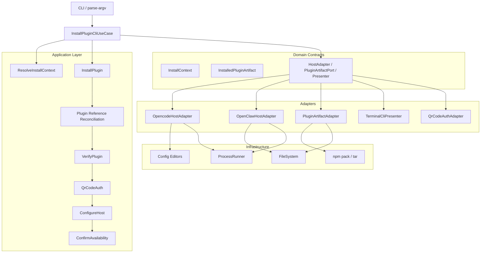
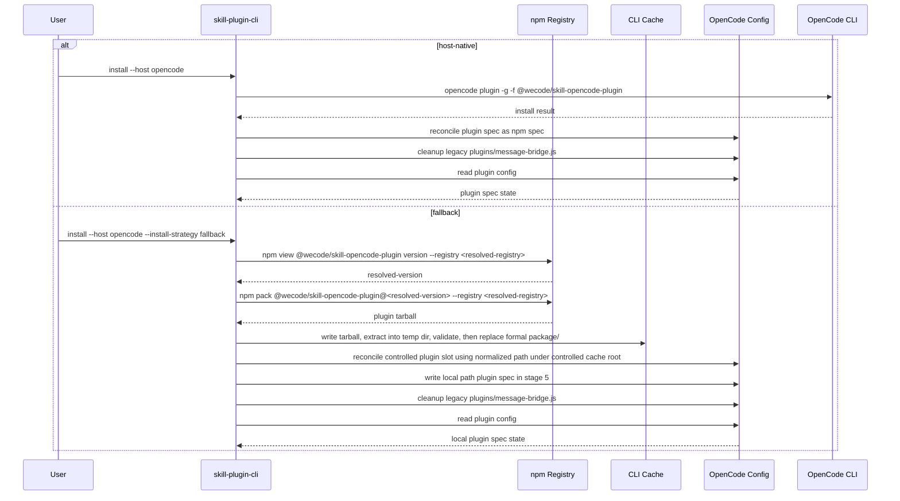
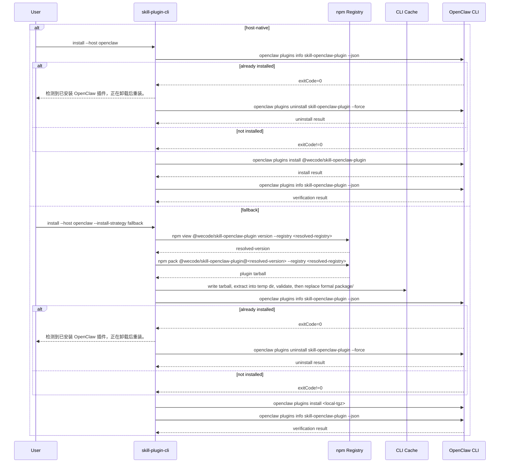
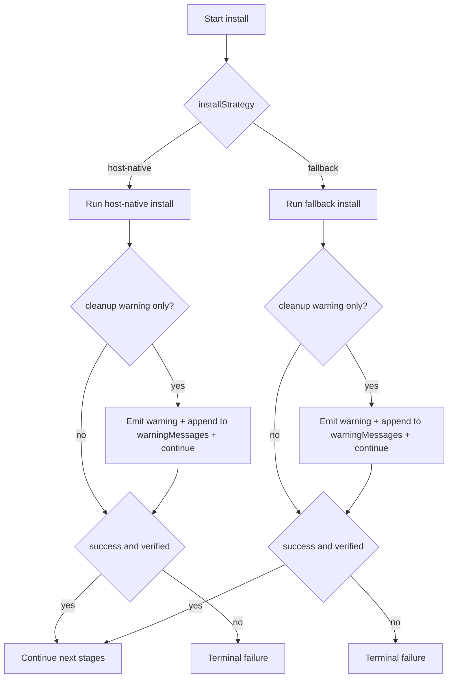

# `skill-plugin-cli` 安装策略方案设计

**Version:** 0.1  
**Date:** 2026-04-29  
**Status:** Draft  
**Owner:** agent-plugin maintainers  
**Related:** [统一安装 CLI 方案](./skill-plugin-cli-solution.md), [统一安装需求说明](../superpowers/specs/2026-04-25-skill-plugin-cli.md)

## 1. 文档定位

本文是 `skill-plugin-cli` 统一安装方案的安装策略专题子文档，用于冻结 `host-native` / `fallback` contract、宿主级 fallback 设计、内部架构分层、下载策略时序图与失败收口规则。

本文负责定义：

- `--install-strategy` 的 CLI contract
- `host-native` 与 `fallback` 的固定语义
- fallback 必须显式指定的规则
- OpenCode / OpenClaw fallback 的物料来源、下载命令、缓存路径、宿主落盘方式与校验真源
- 安装阶段的内部状态模型、端口边界与公共子步骤
- 安装策略相关的用户可见输出与错误提示
- 安装策略相关的架构图与时序图

本文不负责定义：

- 二维码认证协议与状态模型
- 宿主接入配置字段 schema
- 发布流水线、版本策略与 registry 运维流程
- OpenCode / OpenClaw 上游缺陷修复方案
- 现有总方案文档正文的同步改写

## 2. 冻结结论

本专题冻结以下结论：

1. 统一 CLI 对外只暴露两种安装策略：`host-native` 与 `fallback`。
2. `--install-strategy` 为显式输入参数；未传时默认 `host-native`。
3. `host-native` 失败后，CLI 不自动切换到 `fallback`，也不承诺输出 fallback retry hint。
4. 只有用户显式传入 `--install-strategy fallback` 时，CLI 才执行 fallback 路径。
5. OpenCode 对本插件只允许一个最终 plugin spec：要么 npm spec，要么本地路径 spec，不能并存。
6. OpenClaw fallback 的唯一正式路径是：先通过 `npm view` 解析确定版本，再通过 `npm pack` 获取本地 `.tgz`，最后执行 `openclaw plugins install <local-tgz>`。
7. 手工目录替换不是 OpenClaw fallback 的主路径，也不是备选路径。
8. OpenCode fallback 的唯一正式路径是：从私仓获取 `@wecode/skill-opencode-plugin` 发布包，解包到 CLI 受控缓存目录，并将该缓存目录下的本地绝对路径 plugin spec 写入 OpenCode 配置。
9. `fallback` 与 `host-native` 都必须经过统一安装校验；策略之间不互相兜底。
10. `fallback` 是已知宿主安装缺陷的显式绕行路径，不是自动容错机制。
11. fallback 首版不暴露版本选择参数，而是固定先通过 `npm view <pkg> version --registry <resolved-registry>` 解析 registry 当前 `latest` 对应的确定版本，再执行显式版本的 `npm pack`。
12. OpenCode 对受控本地 path spec 的识别，必须以 CLI 写入的受控本地绝对路径 spec 为真源，先做路径规范化，再按受控缓存根目录绝对前缀匹配；不允许按 `~/.cache/...` 字面值比较。
13. OpenCode fallback path spec 首版不要求兼容历史 `~/.cache/...` 字面写法、相对路径或其他非常规 path spec 表达形式。
14. `PluginArtifactPort` 负责发布包完整性 contract 校验，不负责最终落盘目录文件白名单筛选。
15. OpenCode 无论 `host-native` 还是 `fallback`，都必须尝试清理全局配置目录下历史源码集成残留 `plugins/message-bridge.js`。
16. OpenClaw fallback 由 CLI 负责远程取包并准备本地 `.tgz`，由 OpenClaw 负责消费本地 `.tgz` 完成安装。
17. 安装策略专题文档固定包含内部架构分层图、OpenCode 下载策略时序图、OpenClaw 下载策略时序图与策略失败收口图。

## 3. CLI Contract

### 3.1 固定命令

```bash
skill-plugin-cli install --host opencode
skill-plugin-cli install --host opencode --install-strategy fallback

skill-plugin-cli install --host openclaw
skill-plugin-cli install --host openclaw --install-strategy fallback
```

### 3.2 参数表

| 参数 | 必填 | 默认值 | 说明 |
| --- | --- | --- | --- |
| `--host <opencode\|openclaw>` | Y | 无 | 安装目标宿主 |
| `--install-strategy <host-native\|fallback>` | N | `host-native` | 安装策略；`fallback` 仅在用户显式指定时执行 |
| `--environment <uat\|prod>` | N | `prod` | 二维码认证环境 |
| `--registry <url>` | N | 先读现有 `.npmrc` 中的 `@wecode:registry`，否则使用默认 registry | `@wecode` 仓源地址 |
| `--url <gateway-url>` | N | 无 | 显式覆盖宿主接入使用的 gateway URL |

### 3.3 固定说明

- `--install-strategy` 默认为 `host-native`
- CLI 不会在安装失败后自动切换到 `fallback`
- `fallback` 主要用于绕过宿主已知安装缺陷

## 4. 策略总语义

### 4.1 `host-native`

`host-native` 表示调用宿主当前标准插件安装入口。

- OpenCode：`opencode plugin -g -f @wecode/skill-opencode-plugin`
- OpenClaw：先执行 `openclaw plugins info skill-openclaw-plugin --json`；若退出码为 `0` 则执行 `openclaw plugins uninstall skill-openclaw-plugin --force`，再执行 `openclaw plugins install @wecode/skill-openclaw-plugin`

### 4.2 `fallback`

`fallback` 表示由 `skill-plugin-cli` 接管插件分发物获取与宿主侧落盘动作，绕过宿主下载链路缺陷。

`fallback` 不等于自动重试，也不等于安装失败后的隐式二次尝试。它只能由用户显式指定。

### 4.3 失败收口规则

- `host-native` 失败：直接失败；CLI 不自动切换到 `fallback`，也不承诺输出 fallback 重试命令
- `fallback` 失败：直接失败，不回退到 `host-native`
- 任一策略安装成功但安装校验失败：不得宣告完成，也不得自动切换另一策略
- OpenCode 历史 `plugins/message-bridge.js` 存在但清理失败：安装继续，但必须输出显式 warning，并提示用户手动删除绝对路径

## 5. 内部架构分层与状态模型

### 5.1 核心内部模型

- `InstallContext`：安装输入上下文与解析后的执行上下文
- `InstalledPluginArtifact`：阶段 5 产出的安装产物对象
- `PluginArtifactPort`：共享分发物获取端口
- `HostAdapter`：宿主安装、校验、配置接入与结果确认端口
- `Presenter`：终端输出端口

OpenClaw / OpenCode 的阶段 9 当前统一收敛为宿主可执行性确认，不把 channel 级运行态探活并入本方案的安装策略完成条件。

建议 `InstalledPluginArtifact` 至少包含：

- `installStrategy`
- `pluginSpec`
- `packageName`
- `packageVersion?`
- `localExtractPath?`

### 5.2 阶段状态流

- 阶段 5 `installPlugin()` 产出 `InstalledPluginArtifact`
- 阶段 5 内部执行 `Plugin Reference Reconciliation`，其中可包含宿主特有 cleanup
- OpenCode 的 plugin spec 收口与写入属于阶段 5 的 `Plugin Reference Reconciliation`
- 阶段 6 `verifyPlugin()` 显式消费 artifact
- 阶段 8 `configureHost()` 只负责宿主业务配置接入，不承担 plugin spec 写回

fallback 产物不进入 `InstallContext`，也不依赖 `HostAdapter` 私有状态跨阶段传递。

### 5.3 职责边界

- `PluginArtifactPort` 负责 `npm pack`、缓存、解包、发布包完整性 contract 校验与 artifact 返回
- `HostAdapter` 负责宿主接入、宿主配置、宿主校验与宿主特有 cleanup
- `Presenter` 负责策略相关结构化终端输出
- `InstallPluginCliUseCase` 只编排阶段，不持有宿主私有隐式状态

首版 `HostAdapter` 需要显式暴露宿主特有 cleanup 接口：

- `cleanupLegacyArtifacts(context): Promise<{ warnings: string[] }>`

该接口只承载宿主特有清理动作，例如 OpenCode 历史 `plugins/message-bridge.js` 清理，不代表整个 `Plugin Reference Reconciliation` 都由 adapter 独占。

首版结构化 warning 归集真源固定为：

- `InstallResult.warningMessages`

`HostAdapter.cleanupLegacyArtifacts(context)` 返回的 `warnings` 由 `InstallPluginCliUseCase` 统一写入 `Presenter.warning(...)` 与 `InstallResult.warningMessages`。

## 6. 共享分发与 `Plugin Reference Reconciliation`

### 6.1 共享分发

OpenCode / OpenClaw fallback 都依赖同类分发动作：

- 解析最终 registry
- 解析 registry 当前 `latest` 对应的确定版本
- 执行 `npm pack`
- 写入 tarball 缓存
- 解包 tarball
- 校验发布包完整性 contract
- 返回标准化安装产物

这些动作属于共享分发基础设施，不属于单一宿主差异，应由 `PluginArtifactPort` 统一承载。

首版 `PluginArtifactPort` 的最低 contract 如下：

- OpenCode：
  - `package.json` 存在
  - `package.json` 声明的入口文件存在
- OpenClaw：
  - `package.json` 存在
  - `openclaw.plugin.json` 存在
  - `package.json` 声明的入口文件存在

`PluginArtifactPort` 不负责：

- OpenClaw 最终目录文件裁剪
- OpenClaw 宿主侧本地归档安装执行
- 运行态校验

### 6.2 公共子步骤

在阶段 5 “插件安装” 内，固定存在一个公共子步骤：`Plugin Reference Reconciliation`。

其职责是：

- 保证当前宿主中，该插件身份最终只保留一种有效引用或一种有效落点
- 不允许旧引用与新引用并存
- 不允许旧布局与新布局混杂

其中“旧布局与新布局混杂”不仅包括旧 plugin spec 与新 plugin spec 并存，也包括历史源码集成残留与当前 plugin spec 并存。

OpenCode 与 OpenClaw 都执行这一语义，但不要求共用同一 adapter 实现。

## 7. OpenCode fallback 设计

### 7.0 关键结论摘要

- OpenCode fallback 的正式来源是 `@wecode/skill-opencode-plugin` 发布包，最终写入的是受控本地 path spec，而不是工作区源码目录。
- OpenCode 同一插件位最终只能保留一种 plugin spec：npm spec 或受控本地 path spec。
- OpenCode 的 plugin spec 收口与写入在阶段 5 完成，不延后到阶段 8 `configureHost()`。
- 历史 `plugins/message-bridge.js` 必须清理；`host-native` 在宿主安装成功后清理，`fallback` 在本地 path spec 写入后清理，二者都在安装校验前完成。
- cleanup 失败只产生 warning，不阻断成功路径；warning 会进入 `InstallResult.warningMessages` 并与终端输出一致。

### 7.1 真源包、版本解析与下载命令

- 真源包：`@wecode/skill-opencode-plugin`
- 版本解析命令：

```bash
npm view @wecode/skill-opencode-plugin version \
  --registry <resolved-registry>
```

- 下载命令：

```bash
npm pack @wecode/skill-opencode-plugin@<resolved-version> \
  --pack-destination <tarball-cache-dir> \
  --registry <resolved-registry>
```

fallback 不调用 `opencode plugin -g -f`，而是由 CLI 自己获取发布包并转成本地 plugin spec。

首版不暴露 `--plugin-version` 之类版本选择参数，也不尝试继承 host-native 曾尝试安装的版本。fallback 一律以 `resolved-registry` 上 `latest` 对应的确定版本为真源。

### 7.2 缓存路径

- tarball 缓存：`~/.cache/skill-plugin-cli/opencode/tarballs/`
- 解包目录：`~/.cache/skill-plugin-cli/opencode/extracted/@wecode/skill-opencode-plugin/<resolved-version>/`

tarball 文件名、解包目录名与最终本地 plugin spec 路径都以 `resolved-version` 为命名真源。

### 7.3 本地 plugin spec

fallback 使用解包后 `package/` 根目录的本地绝对路径作为本地 plugin spec。

首版不使用工作区源码目录作为正式 fallback 路径。

本文中的 `~/.cache/...` 仅作展示示例，不是实现时的字符串比较值。

### 7.4 OpenCode 全局配置目录解析真源

`<resolved-config-dir>` 固定表示 OpenCode 全局配置目录，按以下顺序解析：

1. 优先 `OPENCODE_CONFIG_DIR`
2. 否则 `XDG_CONFIG_HOME/opencode`
3. Windows 回退 `USERPROFILE/.config/opencode`
4. 其他平台回退 `HOME/.config/opencode`

cleanup 目标文件固定为 `<resolved-config-dir>/plugins/message-bridge.js`，warning 中必须展示该解析后的绝对路径。

### 7.5 单插件位约束

对 `@wecode/skill-opencode-plugin` 这一插件身份，任一时刻只能保留一个最终 plugin spec：

- 要么 npm spec：`@wecode/skill-opencode-plugin`
- 要么本地路径 spec：`~/.cache/skill-plugin-cli/opencode/extracted/@wecode/skill-opencode-plugin/<resolved-version>/package`

不能同时保留两者。其他不属于本插件身份的插件项不在本专题收口范围内。

### 7.6 `Plugin Reference Reconciliation` 在 OpenCode 上的实现

- 受控 npm spec：精确匹配 `@wecode/skill-opencode-plugin`
- 受控 fallback path spec 的识别步骤：
  1. 仅识别 CLI 写入的受控本地绝对路径 spec
  2. 对该 path spec 做绝对路径规范化
  3. 再与当前平台解析后的受控缓存根目录绝对前缀匹配
- 受控缓存根目录示例为 `~/.cache/skill-plugin-cli/opencode/extracted/@wecode/skill-opencode-plugin/`，但该示例不是实现时的字面比较值
- 首版不要求兼容历史 `~/.cache/...` 字面写法、相对路径或其他非常规 path spec 表达形式
- 仅收口上述两类“本插件受控引用”
- 其他不属于本插件的插件项一律不动
- 若目标策略是 `host-native`，移除受控 fallback path spec，仅保留受控 npm spec
- 若目标策略是 `fallback`，移除受控 npm spec，仅保留受控 fallback path spec
- 受控历史残留文件为 `<resolved-config-dir>/plugins/message-bridge.js`
- 该历史文件清理由 `HostAdapter.cleanupLegacyArtifacts(context)` 承载，不并入 `verifyPlugin()` 或 `configureHost()`
- OpenCode 的 plugin spec 收口与写入在阶段 5 完成，不延后到阶段 8 `configureHost()`
- `host-native` 的 cleanup 时机固定为：`opencode plugin -g -f ...` 成功后、安装校验前
- `fallback` 的 cleanup 时机固定为：受控本地 path spec 写入完成后、安装校验前
- 历史文件不存在时静默跳过；存在但删除失败时只产出 warning，不改变安装校验真源

`buildNextOpencodeConfig()` 的入参语义必须从 `pluginName` 升级为 `pluginSpec`。

`InstalledPluginArtifact.pluginSpec` 表示阶段 5 已确定的安装产物引用，供后续校验与宿主业务配置接入阶段读取；它不是阶段 8 的待写回 plugin spec 输入。

### 7.7 安装后校验

- `host-native`：校验 `opencode.json` 中存在 npm spec
- `fallback`：校验 `opencode.json` 中存在本地路径 spec

安装校验前提包含 OpenCode 历史 `plugins/message-bridge.js` cleanup 已经执行；cleanup 失败只产出 warning，不改变安装校验真源。

首版不额外引入运行态加载探活作为安装校验真源。

## 8. OpenClaw fallback 设计

### 8.1 identity 裁定

- npm package identity：`@wecode/skill-openclaw-plugin`
- plugin identity：`skill-openclaw-plugin`
- channel identity：`message-bridge`

fallback 安装目标目录跟 plugin identity 走，而不是 channel identity。

### 8.2 真源包、版本解析与下载命令

- 真源包：`@wecode/skill-openclaw-plugin`
- 版本解析命令：

```bash
npm view @wecode/skill-openclaw-plugin version \
  --registry <resolved-registry>
```

- 下载命令：

```bash
npm pack @wecode/skill-openclaw-plugin@<resolved-version> \
  --pack-destination <tarball-cache-dir> \
  --registry <resolved-registry>
```

首版不暴露 `--plugin-version` 之类版本选择参数，也不尝试继承 host-native 曾尝试安装的版本。fallback 一律以 `resolved-registry` 上 `latest` 对应的确定版本为真源。

### 8.3 缓存路径

- tarball 缓存：`~/.cache/skill-plugin-cli/openclaw/tarballs/`
- 解包目录：`~/.cache/skill-plugin-cli/openclaw/extracted/@wecode/skill-openclaw-plugin/<resolved-version>/`

tarball 文件名与解包目录名都以 `resolved-version` 为命名真源。解包目录仅用于发布包完整性 contract 校验，不作为宿主落盘来源。

### 8.4 宿主内部安装结果说明

OpenClaw fallback 的主设计 contract 不再直接定义宿主插件目录切换语义。宿主最终安装目录由 `openclaw plugins install <local-tgz>` 的宿主安装机制决定。

作为宿主内部结果说明，当前插件身份仍与以下事实保持一致：

- plugin identity：`skill-openclaw-plugin`
- 典型安装目录：`~/.openclaw/extensions/skill-openclaw-plugin/`
- dev profile 典型安装目录：`~/.openclaw-dev/extensions/skill-openclaw-plugin/`

`extensions/message-bridge` 不属于本方案允许的插件安装目录身份。

### 8.5 `Plugin Reference Reconciliation` 在 OpenClaw 上的实现

OpenClaw fallback 的安装语义是本地 `.tgz` 安装：

- 先完成 `npm pack`、解包与发布包完整性 contract 校验
- 使用 `openclaw plugins install <local-tgz>` 执行宿主安装
- CLI 负责远程取包并准备本地归档
- OpenClaw 负责消费本地 `.tgz` 完成安装
- CLI 不再直接删除、复制或切换宿主插件目录
- 因此 fallback 只能由用户显式指定，不能自动切换

`skill-plugin-cli` 不维护 OpenClaw 落盘目录文件白名单。产物完整性由 `@wecode/skill-openclaw-plugin` 发布包 contract 保证。

### 8.6 安装后校验

统一校验真源：

```bash
openclaw plugins info skill-openclaw-plugin --json
```

校验目标是 plugin identity `skill-openclaw-plugin`，而不是 channel identity `message-bridge`。

安装前探测与安装后校验都只依赖退出码，但语义不同：

- 安装前探测：`openclaw plugins info skill-openclaw-plugin --json` 退出 `0` 表示已安装，非 `0` 表示未安装
- 安装后校验：仍以同一命令为真源，但退出 `0` 即视为校验通过，非 `0` 必须直接判定为校验失败

## 9. 用户可见输出与错误提示

固定输出语义：

- 阶段 2 成功摘要必须包含 `installStrategy=<...>`
- 阶段 5 开始前必须提示当前策略
- `host-native` 失败时直接收口；不自动切换 fallback，也不承诺输出 fallback 重试命令
- `fallback` 失败时直接收口，不回退 `host-native`
- OpenCode 历史残留 `plugins/message-bridge.js` 清理失败时必须输出显式 warning

`Presenter` 需要最小策略感知结构化输出能力，至少能表达：

- 当前安装策略已选定
- fallback 产物已解析
- fallback 已写入宿主目标
- OpenCode cleanup warning 已产生

warning 的用户可见输出必须与 `InstallResult.warningMessages` 保持一致，但本文档不展开 `InstallResult` 各状态对象的完整载荷细则。

## 10. 图示

### 10.1 内部架构分层图



### 10.2 OpenCode 下载策略时序图



### 10.3 OpenClaw 下载策略时序图



### 10.4 策略失败收口图



## 11. 与总方案文档的衔接要求

- 本专题文档是安装策略真源
- 现有 [`docs/design/skill-plugin-cli-solution.md`](./skill-plugin-cli-solution.md) 后续只保留高层引用
- 本次任务不修改总方案文档正文
- 后续若修总方案文档，应将安装策略细节替换为对本专题文档的引用

## 12. 验收口径

本文档落地后，应能直接支撑以下实现与评审检查：

- 任一实现者都能明确 `fallback` 不是自动切换
- `host-native` 失败不再承诺 fallback 提示输出
- OpenCode fallback 不会再把本地 path spec 写回 npm spec
- OpenCode fallback 的本地 path spec 在阶段 5 写入，而不是阶段 8 写入
- OpenCode 同一插件位不会并存两种 spec
- OpenCode fallback path spec 的识别会以 CLI 写入的受控本地绝对路径 spec 为真源，再按受控缓存根目录绝对前缀匹配
- 首版不要求兼容历史 `~/.cache/...` 字面 spec、相对路径或其他非常规 path spec
- OpenCode 全局配置目录解析规则是固定真源，并用于得到 `<resolved-config-dir>`
- OpenCode 两种策略都会尝试清理历史 `plugins/message-bridge.js`
- OpenCode cleanup 是 `Plugin Reference Reconciliation` 中的宿主特有动作，而不是共享分发 contract
- OpenCode cleanup 失败只产生 warning，不阻断成功路径
- OpenCode cleanup warning 会归集到 `InstallResult.warningMessages`，并与终端输出一致
- OpenClaw fallback 不会落到 `extensions/message-bridge`
- `PluginArtifactPort` 对 OpenCode 的最低 contract 是 `package.json` 与其声明入口存在
- `PluginArtifactPort` 对 OpenClaw 的最低 contract 是 `package.json`、`openclaw.plugin.json` 与其声明入口存在
- OpenClaw fallback 的安装语义是本地 `.tgz` 安装，而不是手工目录替换
- OpenClaw fallback 不依赖 staging、正式目录删除或 rollback 模型
- OpenClaw fallback 最终仍由宿主命令完成安装
- OpenClaw fallback 的统一校验真源是 `openclaw plugins info skill-openclaw-plugin --json`
- 分发物下载、缓存、解包不会被重复塞进两个 HostAdapter
- 图示足够让评审者理解分层、下载路径、引用收口与失败收口
