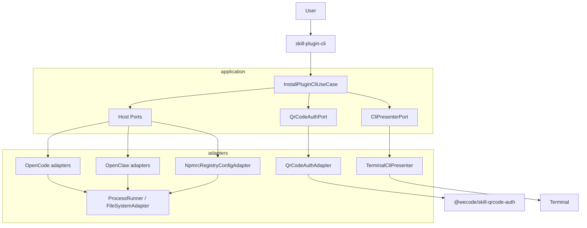
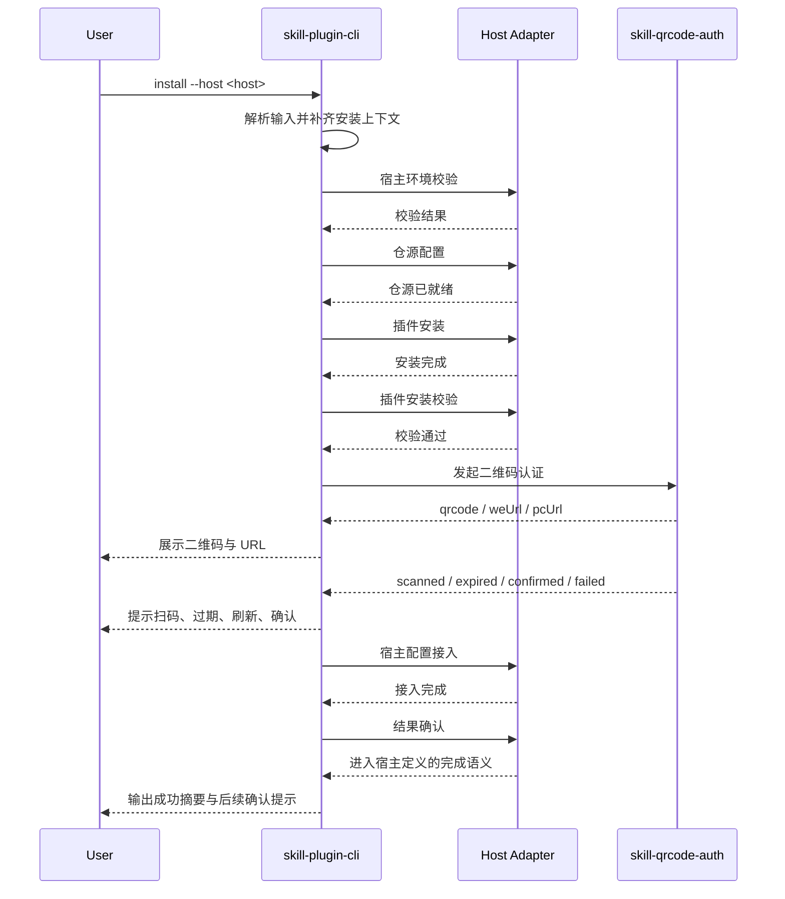
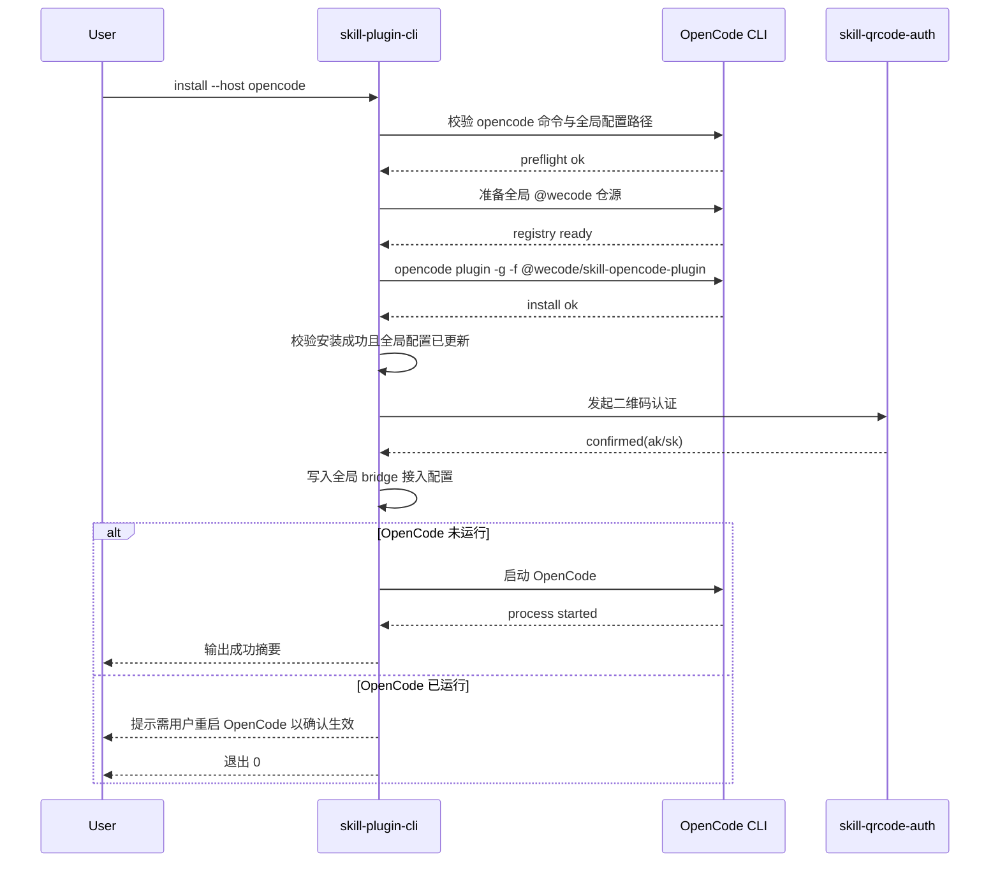
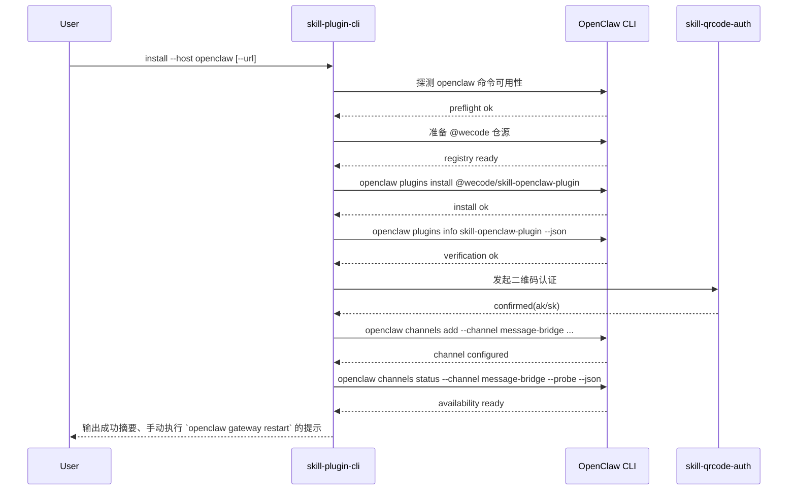
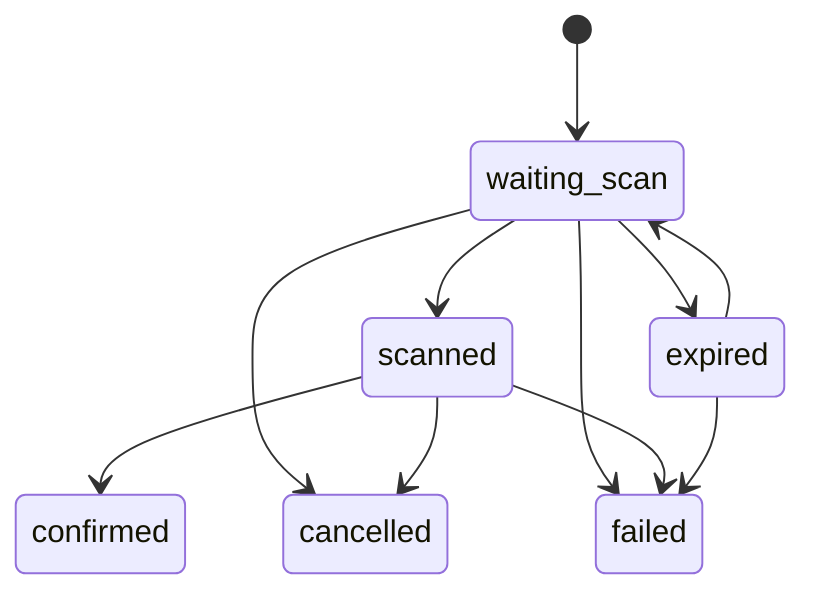

# `skill-plugin-cli` 统一安装 CLI 方案设计

**Version:** 0.4  
**Date:** 2026-04-27  
**Status:** Draft  
**Owner:** agent-plugin maintainers  
**Related:** [统一安装需求说明](../superpowers/specs/2026-04-25-skill-plugin-cli.md), [二维码扫码授权方案设计](./qrcode-auth-session-solution.md)

## 1. 文档定位

本文基于 [统一安装需求说明](../superpowers/specs/2026-04-25-skill-plugin-cli.md)，重写 `skill-plugin-cli` 的统一安装方案，并将正文冻结为开发真源。实现阶段不得再就 CLI contract、主流程顺序、宿主命令、完成语义和基础技术选型做高影响再设计。

本文负责定义：

- 统一安装 CLI 的命令形态、参数、默认值与删除参数
- CLI 输入来源、回退规则与宿主差异约束
- OpenCode / OpenClaw 共享的 10 阶段主流程
- 成功完成条件、失败收口、取消语义与退出码约束
- 开发启动所需的基础技术选型冻结
- `skill-plugin-cli` 的内部架构、目录结构、端口与适配器边界
- 与 `skill-qrcode-auth`、插件分发包和统一安装入口的职责分界
- 方案图示表达与图示数量
- 与当前 README、旧测试口径的暂时失配说明

本文不负责定义：

- 各配置文件字段 schema、持久化格式或逐文件迁移步骤
- `message-bridge`、`message-bridge-openclaw`、`skill-qrcode-auth` 的逐提交改造计划
- 发布流水线、版本策略或 npm 包发布流程
- 宿主外部产品本身的长期能力演进路线
- 当前 README、现有安装脚本测试或 `skill-qrcode-auth` 包内测试的同步改造

## 2. 冻结结论

本方案冻结以下结论：

1. `skill-plugin-cli` 是统一安装 CLI，对外真源是命令、参数、阶段顺序、输出和退出语义，而不是 runtime library 主接口。
2. `packages/skill-plugin-cli` 提供统一 bin，并以 `install` 子命令承载安装主流程。
3. 主流程顺序固定为：宿主环境校验、仓源配置、插件安装、插件安装校验，再进入二维码认证，避免用户在无效安装链路上先扫码。
4. OpenCode 首版安装命令冻结为 `opencode plugin -g -f @wecode/skill-opencode-plugin`，插件安装和 bridge 接入配置默认都走全局级。
5. OpenClaw 首版安装命令冻结为 `openclaw plugins install @wecode/skill-openclaw-plugin`，并在完成前强制执行 `openclaw channels status --channel message-bridge --probe --json`。
6. OpenCode 首版不接管宿主启停；CLI 完成安装后统一输出明确的手动重启提示，该场景允许退出 `0`。
7. OpenClaw 首版不再支持 `--no-restart`；CLI 在 probe 通过后不自动执行 `openclaw gateway restart`，改为输出明确的手动执行提示。
8. CLI 自己承担阶段提示、二维码展示、URL 展示、过期刷新提示、成功失败取消收口与后续确认提示。
9. 二维码认证阶段内部统一调用 `@wecode/skill-qrcode-auth`，但二维码终端展示和交互责任保留在 CLI。
10. 基础技术选型在本文内冻结，不留给实现阶段二次讨论。
11. 图示数量不受需求文档冻结；本方案固定采用 5 张图表达架构与主流程。

## 3. CLI Contract

### 3.1 固定命令

```bash
skill-plugin-cli install --host opencode
skill-plugin-cli install --host openclaw
```

`install` 是统一安装入口。OpenCode / OpenClaw 不再长期维护独立主入口作为正式 contract。

### 3.2 参数表

#### 共享参数

| 参数 | 必填 | 默认值 | 说明 |
| --- | --- | --- | --- |
| `--host <opencode\|openclaw>` | Y | 无 | 安装目标宿主 |
| `--environment <uat\|prod>` | N | `prod` | 二维码认证环境 |
| `--registry <url>` | N | 先读现有 `.npmrc` 中的 `@wecode:registry`，否则使用默认 registry | `@wecode` 仓源地址 |
| `--url <gateway-url>` | N | 无 | 显式覆盖宿主接入使用的 gateway URL；未传时不再由 CLI 提前决定默认值 |

#### OpenCode

OpenCode 作用域冻结如下：

- 插件安装作用域：全局级
- bridge 或等效接入配置作用域：全局级
- CLI 不对外暴露 `--scope`

### 3.3 已删除参数

以下参数不进入统一 CLI 正式 contract：

- `--yes`
- `--scope`
- `--name`
- `--openclaw-bin`
- `--dev`
- `--no-restart`

删除原因如下：

- 它们会把宿主实现细节暴露到用户输入层。
- OpenCode / OpenClaw 会因此继续维持两套不一致的安装面。
- OpenClaw 首版需要闭环完成语义，`--no-restart` 会直接削弱完成前必过检查。

## 4. 输入来源与回退规则

CLI 在解析参数后，必须按以下规则补齐最终安装上下文。

| 输入项 | 来源 | 回退规则 |
| --- | --- | --- |
| `host` | 用户显式提供 | 无回退；缺失即参数错误 |
| `environment` | 用户显式提供 | 未传默认 `prod` |
| `registry` | 用户显式提供 | 未传时先读现有 `.npmrc` 中的 `@wecode:registry`，否则回退默认 registry |
| `url` | 用户可选覆盖 | 未传时保持未决，由宿主配置接入阶段按宿主语义处理 |
| `mac` | CLI 自动采集 | 自动采集失败时传 `""` |
| `channel` | CLI 内部固定填充 | 首版统一固定 `openx`，不对用户暴露，也不提供按宿主覆盖 |
| OpenCode 安装作用域 | CLI 内部固定 | 固定全局级，不提供用户覆盖 |
| OpenCode bridge 配置作用域 | CLI 内部固定 | 固定全局级，不提供用户覆盖 |
| OpenClaw 命令可用性 | CLI 自动探测 | 探测失败视为宿主环境校验失败，不提供用户覆盖参数 |

补充约束如下：

- CLI 不对外暴露任意二维码认证 `baseUrl` 输入。
- CLI 不要求用户手动输入 `mac`。
- `registry` 属于统一安装能力边界，不要求用户预先手工配置。
- OpenClaw 的可执行命令路径由 CLI 自动探测，不再保留 `--openclaw-bin`。

## 5. 基础技术选型冻结

本文同时作为开发启动文档。以下能力在启动实现前冻结，不再单独讨论。

### 5.1 参数解析

- 统一 CLI 使用 Node 原生 `node:util` 的 `parseArgs` 实现参数解析。
- 不引入 `commander`、`cac`、`yargs` 等通用 CLI 框架。
- `cli/parse-argv.ts` 负责参数解析、子命令识别、语法校验和 usage error 输出。
- 插件包不再保留旧入口 wrapper；统一 CLI 自己承担正式命令 contract。

### 5.2 二维码渲染

- 统一 CLI 使用纯 JavaScript 终端二维码渲染库，将 `weUrl` 直接渲染为终端可扫码图形。
- 首版选型以轻量终端渲染方案为准，不依赖图片后端、canvas 或远端二维码图片。
- 渲染失败或终端不适配时，必须降级为完整 `weUrl` 文本展示。
- `pcUrl` 仅作为辅助信息展示，不参与二维码主渲染输入。

### 5.3 终端超链接探测

- 统一 CLI 使用专门的终端超链接能力探测库判断当前环境是否支持可点击链接。
- 不自行维护基于环境变量猜测的终端兼容矩阵。
- 支持超链接时，`weUrl` 以可点击方式展示。
- 不支持超链接时，回退为完整 `weUrl` 纯文本展示。

### 5.4 进程执行

- 统一 CLI 通过自有 `adapters/system/ProcessRunner.ts` 封装宿主命令调用。
- `ProcessRunner` 基于 Node 原生 `child_process` 能力实现，优先使用 `spawn` / `execFile`。
- 不引入 `zx` 作为统一命令执行基础设施。
- 首版以原生 Node 封装为基线。
- 所有宿主命令执行、状态探测、安装校验都必须通过 `ProcessRunner` 进入 adapter 层。

### 5.5 `.npmrc` 读写

- 统一 CLI 使用自有最小文本读写实现处理 `.npmrc`。
- 首版只负责解析、读取和更新 `@wecode:registry`，不实现完整 npm config 语义解释器。
- 读写逻辑必须尽量保留非目标配置行原样。
- 已存在 `@wecode:registry` 时执行幂等替换；不存在时追加。
- 写回必须采用原子写文件策略。
- `.npmrc` 路径解析优先级遵循宿主规则与现有脚本约定。

## 6. CLI 输出行为

CLI 自己承担终端交互责任。宿主 adapter 不直接向用户输出安装过程文本。

### 6.1 阶段提示输出

CLI 必须在每个阶段开始、成功、失败时输出明确提示，至少包含：

- 当前阶段名称
- 当前宿主
- 失败时的失败阶段与失败原因
- 成功结束时的后续确认提示

### 6.2 二维码展示输出

二维码展示规则固定如下：

- `weUrl` 是主扫码入口。
- `pcUrl` 是辅助信息。
- 支持超链接时，`weUrl` 可点击。
- 不支持超链接或二维码图形不可用时，至少展示完整 `weUrl`。
- 二维码过期时必须提示旧二维码失效。
- 生成新二维码时必须明确区分“旧码失效”与“新码可用”。

CLI 在二维码认证阶段至少要输出：

- 当前二维码图形或等价展示
- 完整 `weUrl`
- `pcUrl`
- 过期或刷新提示
- 扫码后等待确认提示

### 6.3 收口输出

CLI 必须负责三类终态收口：

- 成功：输出成功摘要、已完成阶段、后续确认提示
- 失败：输出失败原因、失败阶段、必要的后续处理提示
- 取消：输出取消结果，并明确本次安装未完成

补充约束如下：

- 二维码过期不是终态。
- 认证成功不是完成态。
- 配置接入完成不是完成态。
- 只有到达宿主定义的完成语义后才允许宣告完成。

## 7. 通用安装主流程

OpenCode / OpenClaw 共享以下 10 个阶段名称，阶段顺序固定，不因宿主不同而改名：

1. 用户启动 CLI
2. 解析输入并补齐安装上下文
3. 宿主环境校验
4. 仓源配置
5. 插件安装
6. 插件安装校验
7. 二维码认证
8. 宿主配置接入
9. 结果确认
10. 结束收口

先安装、后扫码的设计理由如下：

- 宿主命令缺失、版本不满足、仓源不可写、插件安装失败都不需要用户参与。
- 这些失败点应尽可能在扫码前暴露，避免用户完成认证后仍因安装链路不可用而整体失败。
- 二维码认证是用户参与成本最高的阶段，应只在安装链路已可继续时触发。

### 7.1 各阶段语义

| 阶段 | 通用语义 | OpenCode 实现差异 | OpenClaw 实现差异 |
| --- | --- | --- | --- |
| 1. 用户启动 CLI | 用户执行统一命令 | 从统一 bin 进入 | 从统一 bin 进入 |
| 2. 解析输入并补齐安装上下文 | 解析参数、补齐 `channel` / `mac` / registry，并保留显式 URL 覆盖 | 解析 `--url`，但未传时不提前决定默认 gateway URL；固定全局安装与全局 bridge 配置作用域 | 解析 `--url`；未传时在接入阶段省略 `channels add --url`，并探测宿主命令 |
| 3. 宿主环境校验 | 校验命令、版本与前置条件 | 校验 `opencode` 命令可用及全局配置路径可写 | 校验 `openclaw` 命令可用及必要子命令存在 |
| 4. 仓源配置 | 确保 `@wecode` 仓源已就绪 | 为 `opencode plugin -g -f @wecode/skill-opencode-plugin` 准备可用仓源 | 为 `openclaw plugins install @wecode/skill-openclaw-plugin` 准备可用仓源 |
| 5. 插件安装 | 执行宿主所需插件安装动作 | 执行 `opencode plugin -g -f @wecode/skill-opencode-plugin` | 执行 `openclaw plugins install @wecode/skill-openclaw-plugin` |
| 6. 插件安装校验 | 校验插件已进入宿主可识别状态 | 以安装命令成功退出且全局配置已更新为首版真源 | 执行 `openclaw plugins info skill-openclaw-plugin --json` |
| 7. 二维码认证 | 调用 `skill-qrcode-auth` 获取 `ak/sk` | 认证结果用于全局 bridge 配置接入，且 `channel` 固定为 `openx` | 认证结果用于 channel 接入，且 `channel` 固定为 `openx` |
| 8. 宿主配置接入 | 使用 `ak/sk` 完成宿主接入 | 写入全局 Message Bridge 或等效接入配置 | 执行 `openclaw channels add --channel message-bridge ...` |
| 9. 结果确认 | 确认宿主结果已进入宿主定义的完成语义 | 执行 `opencode --version` 确认可执行，并输出手动重启提示 | 执行 `openclaw channels status --channel message-bridge --probe --json` 确认可用，probe 成功后输出手动 restart 提示 |
| 10. 结束收口 | 输出终态摘要并退出 | 输出 OpenCode 安装成功摘要与后续手动操作 | 输出 OpenClaw 安装成功摘要与后续手动操作 |

### 7.2 二维码认证阶段内部分解

阶段 7 必须明确包含以下动作：

1. CLI 内部调用 `skill-qrcode-auth`
2. CLI 展示二维码
3. CLI 处理扫码、过期、刷新、取消、确认
4. 成功时获得 `ak/sk`

约束如下：

- `skill-qrcode-auth` 只作为认证 port 的实现。
- CLI 不把二维码交互责任下推到插件包或宿主安装元数据。
- 二维码过期后，如果认证会话允许刷新，CLI 必须继续展示新二维码。

## 8. 宿主差异与首版完成语义

### 8.1 OpenCode

OpenCode 侧由统一 CLI 负责：

- 仓源配置
- 插件安装
- 插件安装校验
- 二维码认证
- 全局 bridge 接入配置
- 结果确认与成功收口提示

OpenCode 首版冻结口径如下：

- 插件安装命令是真源：`opencode plugin -g -f @wecode/skill-opencode-plugin`
- 插件安装作用域是全局级
- bridge 或等效接入配置作用域是全局级
- `--url <gateway-url>` 可显式覆盖 OpenCode 全局 bridge 接入使用的 gateway URL
- 未显式传入 `--url` 时，CLI 不主动新增或覆盖 `gateway.url`
- 阶段 6 只认“安装命令成功退出且全局配置已更新”为首版安装校验真源
- 阶段 9 只按宿主运行状态区分收口，不额外引入“部分完成”术语

OpenCode 阶段 9 的完成语义固定如下：

1. CLI 执行 `opencode --version` 作为可执行性确认。
2. CLI 不接管 OpenCode 启停，不再尝试主动拉起宿主。
3. CLI 输出“需用户手动重启 OpenCode 以确认新插件与配置生效”的明确提示。
4. CLI 同步输出可执行命令 `opencode`。
5. 该场景允许退出 `0`，并视为 OpenCode 首版完成收口。

### 8.2 OpenClaw

OpenClaw 侧由统一 CLI 负责：

- 环境校验
- 仓源配置
- 插件安装
- 插件安装校验
- 二维码认证
- channel 接入
- 结果确认
- 后续手动生效提示

OpenClaw 首版冻结口径如下：

- 插件安装：`openclaw plugins install @wecode/skill-openclaw-plugin`
- 插件安装校验：`openclaw plugins info skill-openclaw-plugin --json`
- 宿主配置接入：`openclaw channels add --channel message-bridge ...`
- 结果确认：`openclaw channels status --channel message-bridge --probe --json`
- 手动生效提示：`openclaw gateway restart`

约束如下：

- 阶段 6 只认 `openclaw plugins info skill-openclaw-plugin --json` 为安装校验真源，不把运行态探活混入该阶段。
- `channels add` 的 `--url` 变为可选；未传时优先复用现有 `channels.message-bridge.gateway.url`，否则使用插件 bundle 默认值链。
- 阶段 9 先以 `openclaw channels status --channel message-bridge --probe --json` 作为完成前真源检查。
- probe 通过后，CLI 输出手动执行 `openclaw gateway restart` 的明确提示。
- probe 未通过即不得宣告完成，也不得输出 `openclaw gateway restart` 提示。

## 9. 完成条件、失败收口与退出语义

### 9.1 成功完成条件

通用前置条件如下：

- 环境校验通过
- 仓源已就绪
- 插件安装完成
- 插件安装校验通过
- 二维码认证成功并获得 `ak/sk`
- 宿主配置接入完成

宿主特化完成条件如下：

- OpenCode：
  - `opencode --version` 可执行性确认成功。
  - CLI 已输出明确的手动重启提示与 `opencode` 可执行命令。
- OpenClaw：
  - `openclaw channels status --channel message-bridge --probe --json` 成功返回可用结果。
  - CLI 已输出明确的手动 restart 提示与 `openclaw gateway restart` 可执行命令。

### 9.2 结束收口语义

终态收口规则固定如下：

- 成功：输出成功摘要与后续确认提示，退出 `0`
- 失败：输出失败原因与失败阶段，非零退出
- 取消：输出取消结果，非零退出或单独退出码策略

补充约束如下：

- 二维码过期不是终态。
- 认证成功不是完成态。
- 配置接入完成不是完成态。
- OpenCode 已运行分支虽然允许退出 `0`，但必须在成功摘要中明确标出“需用户重启确认生效”。
- OpenClaw 若 probe 已通过但 restart 失败，CLI 仍退出 `0`，但成功摘要中必须显式携带 warning 和后续提示。

### 9.3 fail-closed 约束

统一 CLI 必须遵守以下 fail-closed 规则：

- 未获得 `ak/sk` 时，不进入宿主配置接入。
- 插件安装命令成功但安装校验失败时，不得宣告完成。
- 宿主配置接入失败时，不得宣告完成。
- OpenClaw probe 失败时，不得以“前序阶段已成功”替代完成态。
- OpenClaw restart 失败时，不得覆盖已通过 probe 的完成态，但必须输出 warning。
- 宿主环境不可用或仓源未就绪时，不进入后续阶段。

## 10. CLI 内部架构

### 10.1 架构原则

- 依赖方向向内
- 通用编排在 application 层
- host 差异通过 ports/adapters 吸收
- CLI 展示层与业务编排层分离
- `skill-qrcode-auth` 只作为认证 port 的实现

### 10.2 建议目录结构

```text
packages/skill-plugin-cli/
  package.json
  scripts/
    build.mjs
    check-pack.mjs
  src/
    index.ts
    cli/
      bin.ts
      parse-argv.ts
      command-spec.ts
    domain/
      InstallHostKind.ts
      InstallPhase.ts
      InstallFailureCode.ts
      InstallContext.ts
      InstallResult.ts
    application/
      InstallPluginCliUseCase.ts
      ResolveInstallContextUseCase.ts
      RunHostPreflightUseCase.ts
      ConfigureRegistryUseCase.ts
      InstallPluginUseCase.ts
      VerifyPluginInstallationUseCase.ts
      RunQrCodeAuthUseCase.ts
      ConfigureHostUseCase.ts
      VerifyAvailabilityUseCase.ts
      ports/
        HostPreflightPort.ts
        RegistryConfigPort.ts
        PluginInstallerPort.ts
        PluginVerificationPort.ts
        QrCodeAuthPort.ts
        HostConfigurationPort.ts
        AvailabilityVerificationPort.ts
        CliPresenterPort.ts
        InstallContextResolverPort.ts
    adapters/
      qrcode-auth/
        QrCodeAuthAdapter.ts
      opencode/
        OpencodePreflightAdapter.ts
        OpencodePluginInstallerAdapter.ts
        OpencodePluginVerificationAdapter.ts
        OpencodeHostConfigurationAdapter.ts
        OpencodeAvailabilityVerificationAdapter.ts
        OpencodeContextResolverAdapter.ts
      openclaw/
        OpenClawPreflightAdapter.ts
        OpenClawPluginInstallerAdapter.ts
        OpenClawPluginVerificationAdapter.ts
        OpenClawHostConfigurationAdapter.ts
        OpenClawAvailabilityVerificationAdapter.ts
        OpenClawContextResolverAdapter.ts
      registry/
        NpmrcRegistryConfigAdapter.ts
      presenter/
        TerminalCliPresenter.ts
      system/
        MacAddressResolver.ts
        ProcessRunner.ts
        FileSystemAdapter.ts
    infrastructure/
      createSkillPluginCliRuntime.ts
      dependency-factory.ts
      defaults.ts
  tests/
    unit/
    integration/
```

### 10.3 核心职责

| 模块 | 职责 |
| --- | --- |
| `cli/bin.ts` | 统一 CLI 入口 |
| `cli/parse-argv.ts` | 参数解析与语法校验 |
| `application/InstallPluginCliUseCase.ts` | 统一 10 阶段主流程编排 |
| `application/ResolveInstallContextUseCase.ts` | 合成最终执行上下文 |
| `adapters/qrcode-auth/QrCodeAuthAdapter.ts` | 适配 `@wecode/skill-qrcode-auth` |
| `adapters/presenter/TerminalCliPresenter.ts` | 承担二维码、URL、阶段、错误、确认提示输出 |
| `adapters/opencode/*Adapter` | OpenCode 按阶段切分宿主实现 |
| `adapters/openclaw/*Adapter` | OpenClaw 按阶段切分宿主实现 |

### 10.4 端口与适配器边界

端口按阶段职责拆分，避免出现新的“大一统 runtime 接口”：

- `HostPreflightPort`：宿主环境校验
- `RegistryConfigPort`：仓源解析与配置
- `PluginInstallerPort`：插件安装动作
- `PluginVerificationPort`：插件安装校验
- `QrCodeAuthPort`：二维码认证与状态事件读取
- `HostConfigurationPort`：宿主配置接入
- `AvailabilityVerificationPort`：结果确认
- `CliPresenterPort`：终端输出
- `InstallContextResolverPort`：安装上下文补齐

边界约束如下：

- application 层只依赖 ports，不依赖具体宿主命令实现。
- adapter 层可以依赖进程执行、文件系统、终端能力，但不得反向依赖 CLI 参数解析。
- presenter 负责用户可见输出，不负责业务决策。
- `skill-qrcode-auth` 适配器只负责认证能力接入，不负责二维码终端展示策略。

### 10.5 统一入口策略

入口策略固定如下：

- `packages/skill-plugin-cli` 提供唯一统一 bin。
- `@wecode/skill-opencode-plugin` 与 `@wecode/skill-openclaw-plugin` 不再发布 wrapper/bin。
- 插件包只承载插件本体与宿主安装元数据，不承载二维码认证、仓源配置、安装校验或配置接入。
- 文档、测试与发布契约统一以 `skill-plugin-cli install --host ...` 为真源。

### 10.6 内部实现约束

如果实现阶段仍需要内部事件抽象，例如 `PluginCliInstallSnapshot`，它只能作为内部实现约束存在，不得继续作为正文主接口或对外 contract 真源。

## 11. 图示

本方案固定采用 5 张图。图示目标是稳定表达分层、依赖方向、宿主差异和二维码状态，不追求把所有实现细节堆进单张图中。

### 11.1 架构图



### 11.2 通用主流程时序图



### 11.3 OpenCode 特化时序图



### 11.4 OpenClaw 特化时序图



### 11.5 二维码认证状态图



### 11.6 当前失配说明

以下内容当前仍可能保留旧口径，但不属于本轮设计真源修订范围：

- `plugins/message-bridge-openclaw/README.md`
- 现有安装脚本相关测试
- `packages/skill-qrcode-auth` 包内测试

这些文件与本文档新真源之间的同步应作为后续独立工作跟进。

## 12. 结论

`skill-plugin-cli` 的统一安装方案已经冻结为可直接启动开发的真源：CLI contract 固定，主流程固定为先安装再认证，OpenCode / OpenClaw 的宿主命令和完成语义均已明确，基础技术选型与 5 张图示也已收敛。实现阶段的工作重点应转为按本文落地 `packages/skill-plugin-cli`，而不是继续讨论高影响方案分歧。
