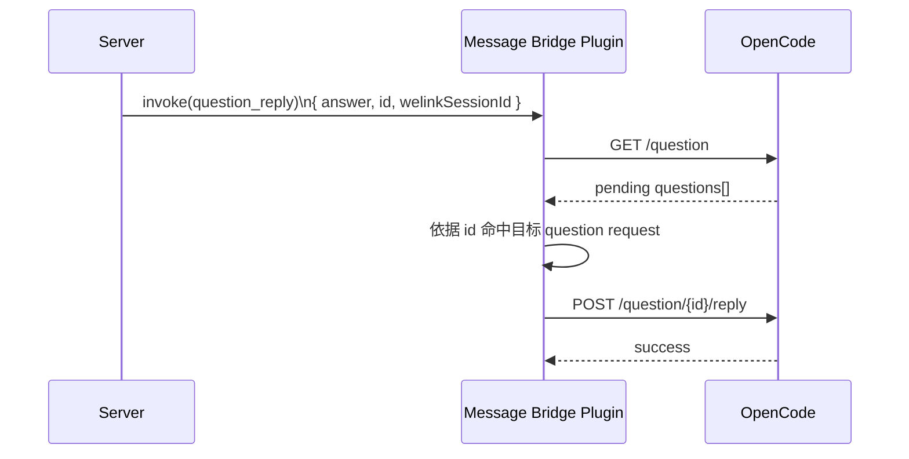

# `toolSessionId` 依赖边界梳理

**Version:** 1.0  
**Date:** 2026-05-11  
**Status:** Draft  
**Owner:** agent-plugin maintainers  
**Related:** `./message-bridge-slash-commands-solution.md`

## 1. 背景

在 `message-bridge-slash-commands-solution.md` 中，已经把如下前提作为方案基础：

1. 服务端不再管理 `welinkSessionId` 与宿主内部会话标识之间的映射。
2. 服务端不再关注宿主会话创建、选择、切换逻辑。
3. 插件与服务端之间统一只使用 `welinkSessionId` 作为外部会话标识。
4. `toolSessionId` 只作为插件内部实现细节存在。

但从当前 `plugins/message-bridge` 实现看，`toolSessionId` 仍然是多条主链路中的关键字段。若直接按代码层级讨论，容易把协议问题、插件内部逻辑和宿主能力限制混在一起。

本文不直接给出修改方案，而是先把 `toolSessionId` 依赖按边界拆清楚，作为后续逐项讨论和方案收敛的前置文档。

## 2. 目标

本文只回答三个问题：

1. 当前哪些依赖属于服务端与插件的外部交互问题。
2. 当前哪些依赖只是插件内部为了完成桥接而保留的实现逻辑。
3. 当前哪些依赖其实来自 OpenCode 宿主 API 的天然 session 语义，不能简单移除。

这样拆分后，后续讨论可以按边界推进：

1. 先决定哪些外部交互必须收口。
2. 再决定插件内部如何承接这些变化。
3. 最后确认 OpenCode 宿主能力是否支持目标语义。

## 3. 分类框架

### 3.1 服务端相关依赖

判断标准：

- 服务端是否需要发送 `toolSessionId`
- 服务端是否会接收到 `toolSessionId`
- 服务端是否会被诱导去理解 `toolSessionId` 的业务语义

这类问题的本质是外部交互契约问题，不是插件内部怎么实现的问题。

### 3.2 插件内部实现依赖

判断标准：

- 服务端并不直接感知
- 但插件内部当前拿 `toolSessionId` 作为状态、路由、兼容或日志主键

这类依赖不必在第一阶段彻底删除，但需要从“外部输入主键”重构为“插件内部解析出的宿主 session ID”。

### 3.3 OpenCode 宿主耦合依赖

判断标准：

- 依赖来自 OpenCode 宿主 API 天然以 session 或 request 为单位的接口语义
- 不是服务端协议设计产物
- 也不是插件自选的状态结构

这类依赖不能简单靠“删掉 `toolSessionId` 字段”解决，只能通过插件内部映射把宿主 session / request 语义重新收口到 `welinkSessionId` 外部语义。

## 4. 服务端相关依赖

### 4.1 下行 invoke action 输入

当前以下 action 的输入契约仍要求服务端显式传入 `toolSessionId`：

- `chat`
- `close_session`
- `abort_session`
- `permission_reply`
- `question_reply`

这意味着当前外部交互模型仍然默认：

- 服务端先知道目标宿主会话是谁
- 插件再负责调用宿主 API 执行

在“服务端不管理宿主会话”的前提下，这部分依赖是最直接的冲突点。

其中核心程度不同：

- `chat` 是主链路冲突点，因为它决定普通消息是否仍由服务端指定宿主会话。
- `close_session`、`abort_session` 属于显式宿主会话控制动作，当前语义仍然要求服务端指定目标宿主 session。
- `permission_reply`、`question_reply` 当前实现仍要求外部透传 `toolSessionId`，但这一点已经不能再直接归因为 OpenCode 宿主 API 的硬要求。

基于当前讨论结论，下行 action 可以进一步收紧为以下判断：

- `chat`
  - 仍是必须修改的主链路
  - 当前要求服务端显式传 `toolSessionId`，与“服务端不管理宿主会话”直接冲突
- `create_session`
  - 虽然不以 `toolSessionId` 为输入，但仍暴露了“服务端主动驱动宿主会话创建”的能力
  - 在目标态下不再处理，也不再执行任何宿主 side effect
- `close_session`
  - 当前语义是“关闭服务端指定的宿主 session”
  - 在目标态下不再处理，也不再执行任何宿主 side effect
- `abort_session`
  - 当前语义是“中止服务端指定的宿主 session”
  - 该 action 应保留，但目标态语义应改为“中止当前 `welinkSessionId` 关联的正在执行的 session”
- `permission_reply`
  - 当前插件实现仍依赖 `toolSessionId`
  - 但 OpenCode 正式 reply API 已不要求外部提供宿主 session ID
  - 因此它属于插件适配层仍停留在旧模型，而不是宿主能力强制要求外部透传 `toolSessionId`
- `question_reply`
  - 当前插件实现仍依赖 `toolSessionId + toolCallId` 去解析 `requestID`
  - 但 OpenCode 正式 reply API 本身不要求 `toolSessionId`
  - 因此它也不应再被归类为“宿主天然要求 session 的下行动作”
  - 目标态下外部应直接使用 `question.asked.properties.id` 作为回复主键，`toolCallId` 只保留兼容期意义

### 4.2 上行消息输出

当前以下上行消息会把 `toolSessionId` 暴露给服务端：

- `tool_event`
- `tool_done`
- `tool_error`
- `session_created`

这会带来两个外部语义问题：

1. 即使服务端下行不再传 `toolSessionId`，上行仍会持续收到该字段。
2. 只要上行消息仍以 `toolSessionId` 为外层关联主键，服务端就仍然会自然地把它当作业务归属锚点。

其中：

- `tool_event` 和 `tool_done` 是普通输出主链路上的核心消息。
- `session_created` 会把新建宿主 session 的结果显式暴露给服务端，最容易诱导服务端继续承担宿主会话真相学习职责。
- `tool_error` 当前仍允许附带 `toolSessionId`，因此错误路径也没有完全摆脱旧模型。

基于当前讨论结论，上行消息可以进一步收紧为以下判断：

- `tool_event`
  - 仍是必须修改的主输出链路
  - 只要其外层关联仍以 `toolSessionId` 为主，服务端就仍会被诱导按宿主会话理解输出归属
  - 目标态下应改为由 `welinkSessionId` 承担外部主关联语义
- `tool_done`
  - 与 `tool_event` 同类，仍属于必须收口的主输出消息
  - 若继续以宿主 session 完成态为中心暴露 `toolSessionId`，则“服务端不管理宿主会话”的前提仍不成立
- `tool_error`
  - 当前允许附带 `toolSessionId`，但它不应再被视为服务端路由或业务归属的必要字段
  - 目标态下应保留 `tool_error`，并以 `welinkSessionId` 完成外部关联
  - `toolSessionId` 不应再上行到 ai-gateway
- `session_created`
  - 当前语义是把新建宿主 session 的结果显式暴露给服务端
  - 在“服务端不管理宿主会话”的前提下，这条消息不再上行到 ai-gateway
  - 不再承担服务端学习宿主会话真相的职责

因此，从上行契约角度看，真正必须收口的是两类问题：

1. 普通输出主链路是否仍以 `toolSessionId` 作为外层关联锚点
2. 插件是否仍通过 `session_created` 把宿主会话创建结果显式同步给服务端

同时也需要补充一个外部可观察行为边界：

- 即使 `tool_event` / `tool_done` / `tool_error` 的外层主关联收口为 `welinkSessionId`，这些消息也只在绑定存在时具备稳定业务归属
- 对于重启后失去绑定的旧 TUI session，本地继续产生的消息不应上行到 ai-gateway

### 4.3 协议语义决策项

本节不再罗列开放问题，而是把当前已经讨论收敛的外部协议语义固定如下：

- `chat`
  - 不再允许服务端指定宿主 session
- `session_created`
  - 不再上行到 ai-gateway
- `tool_event`
  - 外层主关联改为 `welinkSessionId`
- `tool_done`
  - 对外语义从宿主 session 完成态收口为业务会话完成态
- `tool_error`
  - 保留消息类型
  - 只以 `welinkSessionId` 完成外部关联
  - `toolSessionId` 不再上行到 ai-gateway
- `question_reply`
  - 不再以 `toolCallId` 作为正式长期回复主键
  - 目标态使用 `question.asked.properties.id`

这些协议语义已构成后续内部实现改造的稳定目标。

### 4.4 外部交互决策表

基于当前讨论结论，可以先把服务端与插件外部交互面的判断收口为下表。

| 交互项 | 当前外部语义 | 是否与“服务端不管理宿主会话”冲突 | 当前结论 |
| --- | --- | --- | --- |
| `chat` | 服务端传 `toolSessionId`，指定目标宿主会话 | 强冲突 | 必须修改，改为由插件按 `welinkSessionId` 解析活动宿主会话 |
| `create_session` | 服务端主动驱动宿主会话创建 | 冲突 | 目标态下不再处理，也不再执行宿主 side effect |
| `close_session` | 服务端指定要关闭的宿主 session | 冲突 | 目标态下不再处理，也不再执行宿主 side effect |
| `abort_session` | 服务端指定要中止的宿主 session | 冲突 | 保留 action，但目标态改为中止当前 `welinkSessionId` 关联的正在执行的 session |
| `permission_reply` | 服务端透传 `toolSessionId` 后回复权限请求 | 有冲突，但非宿主硬约束 | 当前依赖来自插件适配层，可重构，不应再表述为宿主天然要求 |
| `question_reply` | 服务端透传 `toolSessionId + toolCallId`，插件再解析 `requestID` | 有冲突，但非宿主硬约束 | 目标态应改为使用 `question.asked.properties.id` 回复，`toolCallId` 仅保留兼容期意义 |
| `tool_event` | 以 `toolSessionId` 作为外层关联锚点 | 强冲突 | 必须修改，目标态应由 `welinkSessionId` 承担外部主关联语义 |
| `tool_done` | 以宿主 session 完成态对外回传 | 强冲突 | 必须修改，不应继续以 `toolSessionId` 作为外部完成锚点 |
| `tool_error` | 可附带 `toolSessionId`，可被外部继续依赖 | 冲突 | 保留消息类型，但目标态下只以 `welinkSessionId` 完成外部关联，`toolSessionId` 不再上行到 ai-gateway |
| `session_created` | 把新建宿主 session 显式同步给服务端 | 强冲突 | 目标态下不再上行到 ai-gateway，也不再承担服务端学习宿主会话真相的职责 |

从该决策表可以直接得到两条结论：

1. 外部主链路中，`chat`、`tool_event`、`tool_done`、`session_created` 都属于必须收口的高优先级项。
2. `permission_reply`、`question_reply` 当前虽然仍表现出 `toolSessionId` 依赖，但它们已不再属于宿主 API 强制要求的外部契约问题，而是插件适配层与外部协议设计问题。

附加限制：

- 外部消息主关联改为 `welinkSessionId` 后，不意味着所有宿主事件都天然可回流
- TUI 本地继续对话只有在绑定存在时才允许回流
- 无绑定时不上行，也不做猜测性归属

## 5. 插件内部实现依赖

### 5.1 内部执行入口

当前多个执行入口都直接把 `toolSessionId` 当作宿主执行目标：

- `ChatUseCase` 直接使用 `payload.toolSessionId` 调用 `session.prompt`
- `CloseSessionAction` 用 `payload.toolSessionId` 调用 `session.delete`
- `AbortSessionAction` 用 `payload.toolSessionId` 调用 `session.abort`
- `PermissionReplyAction` 用 `payload.toolSessionId` 作为 permission reply 命中目标
- `QuestionReplyAction` 用 `payload.toolSessionId` 作为 question reply 命中目标

这部分依赖本身不等价于“外部必须一直传 `toolSessionId`”，但说明当前插件内部还没有形成“先按 `welinkSessionId` 解析活动宿主会话，再执行宿主调用”的统一入口。

### 5.2 `permission_reply`：当前事实、可优化方向与已确认边界

#### 当前事实

当前插件实现仍通过 session-scoped 的旧适配方式执行 permission reply：

- 外部 payload 仍要求 `toolSessionId`
- 插件内部把 `toolSessionId` 传入旧的 session-scoped SDK 接口

因此，当前代码实现层面仍然表现为“permission reply 依赖宿主 session”。

#### 可优化方向

插件后续可以改为直接基于 `requestID` 调用新的 OpenCode permission reply API，而不再要求服务端显式透传 `toolSessionId`。

这意味着后续若要收口外部协议，`permission_reply` 的重点不在于“宿主是否支持无 session 回复”，而在于：

- 插件是否切换到新的 reply API
- 外部是否继续暴露旧的 session-scoped 输入模型

#### 已确认边界

基于当前 OpenCode 源码与 API 文档，已可以确认：

- 正式 permission reply API 为 `POST /permission/{requestID}/reply`
- 旧的 `POST /session/{sessionID}/permissions/{permissionID}` 已属于兼容路径
- `toolSessionId` 不是 permission reply 的宿主硬要求

因此，`permission_reply` 当前对 `toolSessionId` 的依赖来自插件适配层，而不是来自宿主正式接口。

### 5.3 `question_reply`：当前事实、可优化方向与已确认边界

#### 当前事实

当前插件实现中，`question_reply` 的处理流程是：

1. 调用 `GET /question`
2. 先按 `sessionID === toolSessionId` 过滤 pending questions
3. 若提供 `toolCallId`，再按 `tool.callID === toolCallId` 精确匹配
4. 命中唯一 `requestID` 后，再调用 `POST /question/{requestID}/reply`

这说明当前插件实现确实仍依赖：

- 外部传入 `toolSessionId`
- 插件内部通过 `sessionID + toolCallId` 组合解析 `requestID`

#### 可优化方向

本节中的目标态协议选择已在第 4 节决策区收口，这里只解释这些选择对插件内部承接逻辑的影响。

后续可以把当前“先按 session 过滤，再按 `toolCallId` 精确匹配”的逻辑明确降级为插件内部实现策略，而不是继续表述成宿主 API 硬要求。

目标态应直接使用 `question.asked.properties.id` 作为 question reply 的正式回复主键。

这意味着：

- 服务端 / 客户端需要保存并回传 `question.asked.properties.id`
- 插件不再把 `toolCallId -> requestID` 作为长期主路径能力
- `toolCallId` 只保留兼容期意义

#### 已确认边界

基于当前 OpenCode 源码与 API 文档，已可以确认：

- 正式 question reply API 为 `POST /question/{requestID}/reply`
- `requestID` 是宿主明确建模的问题请求主键
- `tool.callID` 只是可选工具引用，不是 question 请求主键
- 当前插件按 `sessionID + toolCallId` 过滤，是实现策略，不是 OpenCode reply API 的硬要求

同时也应明确：

- 当前没有足够强的 OpenCode 契约证明 `toolCallId/callID` 可在全局 pending question 范围内单独充当唯一主键
- 因此 `toolCallId` 不应继续作为目标态的正式长期回复主键

#### `question_reply` 当前链路时序图

图中的两个语义层需要严格区分：

- 对外正式回复主键是 `question.asked.properties.id`
- 宿主真正消费的请求主键也是该 question request `id`

兼容期内旧的 `toolCallId` 仍可作为过渡输入，但目标态下不再把它当作正式长期回复主键。

### 5.4 内部状态与兼容逻辑

当前以下逻辑都以 `toolSessionId` 为内部状态主键：

- `ToolDoneCompat` 用 `toolSessionId` 跟踪 pending/completed prompt
- subagent session 聚合与 child -> parent 映射围绕宿主 session 展开
- runtime 日志、trace context、发送上下文广泛记录 `toolSessionId`
- `SessionDirectoryResolver` 通过 `toolSessionId` 调 `session.get` 查询目录

这类逻辑的特点是：

- 即使未来外部协议改成只用 `welinkSessionId`
- 它们也未必需要被删除
- 但必须从“依赖服务端透传 `toolSessionId`”改成“依赖插件内部已解析出的宿主 session ID”

### 5.5 内部错误与 fail-closed 逻辑

当前错误与协议兜底路径也依赖 `toolSessionId`：

- invalid invoke responder 支持仅凭 `toolSessionId` 回 `tool_error`
- `buildToolError` 允许附带 `toolSessionId`
- 多处错误日志把 `toolSessionId` 当核心诊断字段

这部分说明：

- `toolSessionId` 当前不仅是成功链路主键
- 也是失败链路的可路由标识

后续若外部协议要只依赖 `welinkSessionId`，错误路径是否继续允许只靠 `toolSessionId` 回包，也需要单独讨论。

## 6. OpenCode 宿主耦合依赖

### 6.1 宿主调用与请求命中边界

OpenCode 侧以下调用天然以宿主 session 为单位：

- `session.prompt`
- `session.get`
- `session.abort`
- `session.delete`
- permission / question 等交互最终需要命中具体宿主请求对象

这说明：

- `toolSessionId` 或宿主等价 session 标识在插件内部不可能彻底消失
- 真正需要改变的是它在插件外部的语义地位

也就是说，目标态不是“插件内部没有 session ID”，而是“服务端不再直接感知或控制宿主 session ID”。

同时，当前基于 OpenCode 源码已经可以进一步确认：

- `permission_reply` 的正式 reply API 是 request-scoped，而不是 session-scoped
- `question_reply` 的正式 reply API 也是 request-scoped，而不是 session-scoped

因此，这两类交互更准确的宿主边界表述应为：

- 宿主交互需要命中具体宿主请求对象
- 但不一定要求服务端显式提供宿主 session ID

### 6.2 宿主上行事件天然带 session 归属

OpenCode 原生事件本身就归属于某个宿主 session，例如：

- `message.updated`
- `session.status`
- `session.idle`
- `permission.*`
- `question.asked`

因此这里真正的难点不是“要不要 session ID”，而是：

- 插件如何把宿主事件从 session 语义重新映射回 `welinkSessionId` 语义
- 哪些上行事件可以直接重映射
- 哪些上行事件仍然需要保留内部宿主 session 语义仅用于插件内处理

### 6.3 TUI 本地对话回流限制

宿主事件是否能回流到 gateway，不只取决于某个 OpenCode session 上是否有新消息，还取决于插件是否仍持有该 session 对应的 `welinkSessionId` 绑定。

目标态限制如下：

- 只有存在 `welinkSessionId -> opencodeSessionId` 绑定时，TUI 本地对话才允许回流 gateway
- 绑定不存在时，TUI 本地消息不上行 gateway
- 插件不做猜测性归属，不尝试把旧 session 自动挂回某个业务会话

这属于 fail-closed 限制，不属于待后续讨论的开放问题。

### 6.3 宿主能力边界

OpenCode 宿主本身的能力边界也会影响方案设计，例如：

- `session.get()` 不返回模型字段
- prompt 与事件都天然以宿主 session 为单位
- question / permission 等交互需要命中具体宿主请求对象

这些都不是服务端交互契约问题，也不是插件内部是否愿意重构的问题，而是宿主 API 的天然约束。

## 7. 阅读索引

为避免“分析、决策、结论”三层信息混写，后续阅读可按以下顺序定位：

### 7.1 外部交互结论

若关注服务端与插件之间哪些协议语义已经收口，优先阅读：

- 第 4 节服务端相关依赖
- 第 4.4 节外部交互决策表

### 7.2 插件内部承接

若关注外部不再透传 `toolSessionId` 后插件内部还需要承接什么，优先阅读：

- 第 5 节插件内部实现依赖

### 7.3 宿主硬边界

若关注哪些限制来自 OpenCode 宿主本身，而不是桥接协议设计，优先阅读：

- 第 6 节 OpenCode 宿主耦合依赖

## 8. 推荐讨论顺序

建议后续按边界逐项讨论，而不是一次性覆盖所有问题：

1. 服务端下行交互
   - 当前哪些 action 输入依赖 `toolSessionId`
   - 哪些是必须改
   - 哪些可以先保留兼容
2. 服务端上行交互
   - 当前哪些消息输出暴露 `toolSessionId`
   - 哪些会直接破坏“服务端不管理宿主会话”的前提
3. 插件内部承接逻辑
   - 外部不再传 `toolSessionId` 后，内部如何找到活动宿主 session
   - 哪些内部状态可继续保留
4. OpenCode 宿主边界
   - 哪些地方天然还得保留 session 语义
   - 哪些能力限制会影响目标态的可行性

这种顺序的好处是：

- 先澄清协议面改什么
- 再讨论插件内部怎么接住
- 最后确认宿主能力是否支持目标语义

## 9. 当前代码落点速览

以下只列出当前实现中最典型的依赖落点，作为后续逐项讨论的索引。

### 9.1 服务端相关落点

- 下行 action 契约：
  - `plugins/message-bridge/src/contracts/downstream-messages.ts`
  - `plugins/message-bridge/src/protocol/downstream/GatewayBusinessMessageAdapter.ts`
- 上行消息契约：
  - `packages/gateway-schema/src/contract/schemas/upstream-business.ts`
  - `plugins/message-bridge/src/runtime/BridgeRuntime.ts`

### 9.2 插件内部落点

- 执行入口：
  - `plugins/message-bridge/src/usecase/ChatUseCase.ts`
  - `plugins/message-bridge/src/action/CloseSessionAction.ts`
  - `plugins/message-bridge/src/action/AbortSessionAction.ts`
  - `plugins/message-bridge/src/action/PermissionReplyAction.ts`
  - `plugins/message-bridge/src/action/QuestionReplyAction.ts`
- compat / runtime / 错误：
  - `plugins/message-bridge/src/runtime/compat/ToolDoneCompat.ts`
  - `plugins/message-bridge/src/error/index.ts`
  - `plugins/message-bridge/src/protocol/downstream/InvalidInvokeToolErrorResponder.ts`

### 9.3 OpenCode 宿主落点

- 宿主 session 执行与辅助查询：
  - `plugins/message-bridge/src/adapter/OpencodeSessionGatewayAdapter.ts`
  - `plugins/message-bridge/src/adapter/SessionDirectoryResolver.ts`
- 宿主事件抽取与转发：
  - `plugins/message-bridge/src/protocol/upstream/UpstreamEventExtractor.ts`
  - `plugins/message-bridge/src/runtime/BridgeRuntime.ts`

## 10. 结论

`toolSessionId` 当前不是单一 action 的局部字段，而是同时承担了三种角色：

1. 服务端与插件之间的外部交互锚点
2. 插件内部的宿主执行与兼容状态主键
3. OpenCode 宿主 session / request 语义在插件中的直接投影

因此后续不能笼统讨论“去掉 `toolSessionId`”，而应明确：

- 哪些是必须从外部交互面移除的依赖
- 哪些只需要在插件内部保留并重构来源
- 哪些是 OpenCode 宿主能力决定的天然 session 语义

只有先完成这一层边界澄清，后续修改方案才不会把协议问题、实现问题和宿主约束混在一起。

当前已经收敛的高优先级结论如下：

- `chat` 必须改为只按 `welinkSessionId` 驱动
- `create_session` / `close_session` 在目标态下不再处理，也不再执行宿主 side effect
- `abort_session` 保留，但语义改为中止当前 `welinkSessionId` 关联的正在执行的 session
- `question_reply` 目标态改为使用 `question.asked.properties.id` 回复，`toolCallId` 仅保留兼容期意义
- `tool_event` / `tool_done` / `tool_error` 对外主关联统一收口为 `welinkSessionId`
- `tool_error` 保留，但 `toolSessionId` 不再上行到 ai-gateway
- `session_created` 不再上行到 ai-gateway
- 只有绑定存在时，TUI 本地对话才允许回流 gateway；绑定丢失后不上行，也不做猜测性归属

基于当前 OpenCode 源码，已经可以把两项此前的未确认结论收紧为：

- `permission_reply`：已确认不需要把 `toolSessionId` 视为宿主硬约束
- `question_reply`：已确认最终 reply API 不需要 `toolSessionId`

当前仍保留的主要风险集中在迁移与兼容策略，而不是目标态语义本身：

- 服务端 / 客户端从 `toolCallId` 切换到使用 `question.asked.properties.id` 的改造成本
- 插件重启后，如果 `welinkSessionId -> opencodeSessionId` 绑定丢失，旧 TUI session 上继续发生的对话事件将失去回流 gateway 的能力；这是当前不做持久化绑定恢复的直接结果
