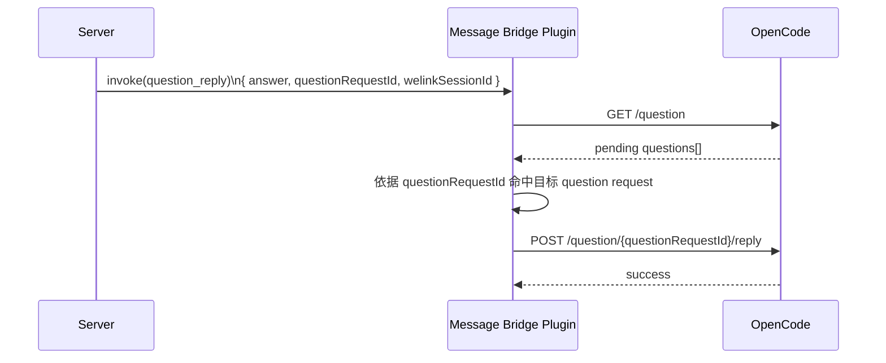

# `toolSessionId` 依赖边界梳理

**Version:** 1.1  
**Date:** 2026-05-11  
**Status:** Draft  
**Owner:** agent-plugin maintainers  
**Related:** `./message-bridge-slash-commands-solution.md`

## 1. 文档目的

这份文档不直接给出改造方案，而是先回答一个更基础的问题：

`toolSessionId` 当前到底承担了哪些职责，这些职责分别属于哪一层边界。

如果不先拆清边界，后续很容易把三类问题混在一起讨论：

1. 服务端与插件之间的外部协议问题
2. 插件内部为了桥接宿主而保留的实现问题
3. OpenCode 宿主 API 天然存在的 session / request 语义问题

本文的目标，就是把这三类依赖拆开，作为后续方案设计与改造讨论的前置材料。

## 2. 阅读导航

按阅读目的建议直接定位到对应章节：

- 想先看已经收敛的结论：第 3 节
- 想看三类依赖如何划分：第 4 节
- 想看服务端与插件外部交互冲突点：第 5 节
- 想看插件内部还要承接哪些能力：第 6 节
- 想看哪些限制来自 OpenCode 宿主：第 7 节
- 想快速定位代码落点：第 8 节

## 3. 结论摘要

### 3.1 核心判断

`toolSessionId` 当前不是单一字段问题，而是同时承担了三种角色：

1. 服务端与插件之间的外部交互锚点
2. 插件内部的宿主执行与兼容状态主键
3. OpenCode 宿主 session / request 语义在插件中的直接投影

因此，后续不能笼统讨论“去掉 `toolSessionId`”，而要拆成三类动作：

- 从外部协议中移除哪些依赖
- 在插件内部保留但重构来源的依赖有哪些
- 哪些天然 session 语义必须继续存在

### 3.2 已收敛的高优先级结论

- 外部主链路要从 `toolSessionId` 收口到 `welinkSessionId`，覆盖下行 `chat` 和上行 `tool_event` / `tool_done` / `tool_error`。
- 服务端不再主动驱动宿主会话创建与关闭；`create_session`、`close_session` 在目标态下不再处理。
- reply 类交互需要从“外部透传宿主 session”转向“外部提供宿主 request 主键”；`question_reply` 目标态使用 `question.asked.properties.id`，`toolCallId` 仅保留兼容期意义。
- 宿主事件回流必须 fail-closed：只有绑定存在时才允许 TUI 本地对话回流 gateway。

更细的交互项判断与动作结论，统一以第 5.1 节决策表为准。

### 3.3 已确认但容易混淆的边界

- `permission_reply`：已经可以确认，`toolSessionId` 不是宿主正式 reply API 的硬要求；当前依赖来自插件适配层。
- `question_reply`：已经可以确认，宿主正式 reply API 使用 `requestID`，不是 `toolSessionId`。

### 3.4 当前主要风险

当前剩余风险主要在迁移与兼容策略，不在目标态语义本身：

- 服务端 / 客户端从 `toolCallId` 切换到 `question.asked.properties.id` 的改造成本
- 插件重启后，如果 `welinkSessionId -> opencodeSessionId` 绑定丢失，旧 TUI session 上继续发生的事件将失去回流 gateway 的能力

## 4. 分析框架

### 4.1 设计前提

本文沿用 `message-bridge-slash-commands-solution.md` 已经明确的前提：

1. 服务端不再管理 `welinkSessionId` 与宿主内部会话标识之间的映射。
2. 服务端不再关注宿主会话创建、选择、切换逻辑。
3. 插件与服务端之间统一只使用 `welinkSessionId` 作为外部会话标识。
4. `toolSessionId` 只作为插件内部实现细节存在。

### 4.2 三类依赖划分标准

#### A. 服务端相关依赖

判断标准：

- 服务端是否需要发送 `toolSessionId`
- 服务端是否会接收到 `toolSessionId`
- 服务端是否会被诱导去理解 `toolSessionId` 的业务语义

这类问题本质上是外部交互契约问题。

#### B. 插件内部实现依赖

判断标准：

- 服务端并不直接感知
- 但插件内部当前把 `toolSessionId` 当作状态、路由、兼容或日志主键

这类依赖未必要删除，但需要改成“插件内部解析出的宿主 session ID”，而不是“服务端透传的外部输入主键”。

#### C. OpenCode 宿主耦合依赖

判断标准：

- 依赖来自 OpenCode 宿主 API 天然的 session / request 语义
- 不是服务端协议设计产物
- 也不是插件任意选择的内部状态结构

这类依赖不能靠“删字段”解决，只能在插件内部重映射宿主语义与 `welinkSessionId` 语义。

## 5. 服务端相关依赖

这一节只讨论服务端与插件之间的外部交互，不讨论插件内部如何承接。

### 5.1 外部交互决策表

| 交互项 | 当前外部语义 | 是否与“服务端不管理宿主会话”冲突 | 当前结论 |
| --- | --- | --- | --- |
| `chat` | 服务端传 `toolSessionId`，指定目标宿主会话 | 强冲突 | 必须修改，改为由插件按 `welinkSessionId` 解析活动宿主会话 |
| `create_session` | 服务端主动驱动宿主会话创建 | 冲突 | 目标态下不再处理，也不再执行宿主 side effect |
| `close_session` | 服务端指定要关闭的宿主 session | 冲突 | 目标态下不再处理，也不再执行宿主 side effect |
| `abort_session` | 服务端指定要中止的宿主 session | 冲突 | 保留 action，但目标态改为中止当前 `welinkSessionId` 关联的正在执行 session |
| `permission_reply` | 服务端透传 `toolSessionId` 后回复权限请求 | 有冲突，但非宿主硬约束 | 当前依赖来自插件适配层，可重构，不应再表述为宿主天然要求 |
| `question_reply` | 服务端透传 `toolSessionId + toolCallId`，插件再解析 `requestID` | 有冲突，但非宿主硬约束 | 目标态应改为使用 `question.asked.properties.id` 回复，`toolCallId` 仅保留兼容期意义 |
| `tool_event` | 以 `toolSessionId` 作为外层关联锚点 | 强冲突 | 必须修改，目标态应由 `welinkSessionId` 承担外部主关联 |
| `tool_done` | 以宿主 session 完成态对外回传 | 强冲突 | 必须修改，不应继续以 `toolSessionId` 作为外部完成锚点 |
| `tool_error` | 可附带 `toolSessionId`，可被外部继续依赖 | 冲突 | 保留消息类型，但目标态下只以 `welinkSessionId` 完成外部关联，`toolSessionId` 不再上行到 ai-gateway |
| `session_created` | 把新建宿主 session 显式同步给服务端 | 强冲突 | 目标态下不再上行到 ai-gateway，也不再承担服务端学习宿主会话真相的职责 |

这张表对应两条直接结论：

1. `chat`、`tool_event`、`tool_done`、`session_created` 是必须优先收口的主链路项。
2. `permission_reply`、`question_reply` 当前虽然仍表现出 `toolSessionId` 依赖，但已不属于宿主 API 强制要求。

### 5.2 下行交互的冲突点

当前以下 action 的输入契约仍要求服务端显式传入 `toolSessionId`：

- `chat`
- `close_session`
- `abort_session`
- `permission_reply`
- `question_reply`

这说明当前外部交互模型仍默认：

- 服务端先知道目标宿主会话是谁
- 插件再负责调用宿主 API 执行

与目标前提相比，几类 action 的冲突程度不同：

- `chat` 是最核心的主链路冲突点
- `close_session` 与 `abort_session` 体现了服务端仍在控制宿主会话
- `permission_reply` 与 `question_reply` 当前仍依赖 `toolSessionId`，但根因已经不是宿主 API 的天然硬要求

### 5.3 上行交互的冲突点

当前以下上行消息仍把 `toolSessionId` 暴露给服务端：

- `tool_event`
- `tool_done`
- `tool_error`
- `session_created`

这会带来两个直接问题：

1. 即使下行不再传 `toolSessionId`，上行仍会持续把它暴露给服务端。
2. 只要上行消息仍以 `toolSessionId` 为外层关联主键，服务端就仍会自然把它当作业务归属锚点。

其中需要特别区分：

- `tool_event` 与 `tool_done` 是普通输出主链路的核心消息
- `session_created` 最容易诱导服务端继续学习宿主会话真相
- `tool_error` 如果继续可被外部依赖为 `toolSessionId` 路由，也无法完成真正收口

### 5.4 对外可观察行为限制

即使 `tool_event`、`tool_done`、`tool_error` 的外层主关联已经收口为 `welinkSessionId`，也不代表所有宿主事件都能继续稳定回流。

需要明确保留以下 fail-closed 约束：

- 只有存在 `welinkSessionId -> opencodeSessionId` 绑定时，TUI 本地对话才允许回流 gateway
- 绑定不存在时，旧 TUI session 继续产生的事件不上行到 ai-gateway
- 插件不做猜测性归属，也不尝试把旧 session 自动挂回某个业务会话

## 6. 插件内部实现依赖

这一节只讨论：当外部不再透传 `toolSessionId` 后，插件内部还需要接住什么。

### 6.1 执行入口仍直接依赖 `toolSessionId`

当前多个执行入口都直接把 `toolSessionId` 当作宿主执行目标：

- `ChatUseCase` 直接使用 `payload.toolSessionId` 调用 `session.prompt`
- `CloseSessionAction` 用 `payload.toolSessionId` 调用 `session.delete`
- `AbortSessionAction` 用 `payload.toolSessionId` 调用 `session.abort`
- `PermissionReplyAction` 用 `payload.toolSessionId` 作为 permission reply 命中目标
- `QuestionReplyAction` 用 `payload.toolSessionId` 作为 question reply 命中目标

这类依赖说明的不是“外部必须永远传 `toolSessionId`”，而是当前插件内部还没有统一的“先按 `welinkSessionId` 解析活动宿主会话，再执行宿主调用”的入口。

### 6.2 `permission_reply` 的内部承接边界

#### 当前事实

当前插件实现仍通过 session-scoped 的旧适配方式执行 permission reply：

- 外部 payload 仍要求 `toolSessionId`
- 插件内部把 `toolSessionId` 传入旧的 session-scoped SDK 接口

#### 已确认边界

基于当前 OpenCode 源码与 API 文档，已经可以确认：

- 正式 permission reply API 为 `POST /permission/{requestID}/reply`
- 旧的 `POST /session/{sessionID}/permissions/{permissionID}` 属于兼容路径
- `toolSessionId` 不是 permission reply 的宿主硬要求

#### 对内部改造的含义

后续如果要收口外部协议，重点不在于“宿主是否支持无 session 回复”，而在于：

- 插件是否切换到新的 reply API
- 外部是否继续暴露旧的 session-scoped 输入模型

### 6.3 `question_reply` 的内部承接边界

#### 当前事实

当前插件实现中，`question_reply` 的处理流程是：

1. 调用 `GET /question`
2. 先按 `sessionID === toolSessionId` 过滤 pending questions
3. 若提供 `toolCallId`，再按 `tool.callID === toolCallId` 精确匹配
4. 命中唯一 `requestID` 后，再调用 `POST /question/{requestID}/reply`

这说明当前插件实现仍依赖：

- 外部传入 `toolSessionId`
- 插件内部通过 `sessionID + toolCallId` 组合解析 `requestID`

#### 已确认边界

基于当前 OpenCode 源码与 API 文档，已经可以确认：

- 正式 question reply API 为 `POST /question/{requestID}/reply`
- `requestID` 是宿主明确建模的问题请求主键
- `tool.callID` 只是可选工具引用，不是 question 请求主键
- 当前插件按 `sessionID + toolCallId` 过滤，是实现策略，不是 OpenCode reply API 的硬要求

同时也应明确：

- 当前没有足够强的 OpenCode 契约证明 `toolCallId` / `callID` 可在全局 pending question 范围内单独充当唯一主键
- 因此 `toolCallId` 不应继续作为目标态的正式长期回复主键

#### 对内部改造的含义

目标态应直接使用 `question.asked.properties.id` 作为正式回复主键。

这意味着：

- 服务端 / 客户端需要保存并回传 `question.asked.properties.id`
- 插件不再把 `toolCallId -> requestID` 作为长期主路径能力
- `toolCallId` 只保留兼容期意义

#### 目标态链路时序图

图中的两个语义层需要严格区分：

- 对外正式回复主键是 `question.asked.properties.id`
- 宿主真正消费的请求主键也是该 question request `id`

这张图描述的是目标态协议，不是当前插件实现。当前实现仍然是先用 `toolSessionId + toolCallId` 解析 `requestID`，再调用 reply API。

### 6.4 内部状态、兼容与错误路径

当前以下逻辑都以 `toolSessionId` 为内部状态主键：

- `ToolDoneCompat` 用 `toolSessionId` 跟踪 pending / completed prompt
- subagent session 聚合与 child -> parent 映射围绕宿主 session 展开
- runtime 日志、trace context、发送上下文广泛记录 `toolSessionId`
- `SessionDirectoryResolver` 通过 `toolSessionId` 调 `session.get` 查询目录

当前错误与协议兜底路径也依赖 `toolSessionId`：

- invalid invoke responder 支持仅凭 `toolSessionId` 回 `tool_error`
- `buildToolError` 允许附带 `toolSessionId`
- 多处错误日志把 `toolSessionId` 当核心诊断字段

这类依赖的共同特点是：

- 它们未必需要被删除
- 但必须从“依赖服务端透传 `toolSessionId`”改成“依赖插件内部已解析出的宿主 session ID”
- 如果外部协议只剩 `welinkSessionId`，错误路径是否仍允许只靠 `toolSessionId` 回包，也需要单独收口

## 7. OpenCode 宿主耦合依赖

这一节讨论的是宿主天然存在的边界，而不是桥接协议设计失当。

### 7.1 宿主调用天然以 session / request 为单位

OpenCode 侧以下调用天然以宿主 session 为单位：

- `session.prompt`
- `session.get`
- `session.abort`
- `session.delete`

permission / question 等交互最终也需要命中具体宿主请求对象。

因此目标态并不是“插件内部没有 session ID”，而是：

- 插件内部仍然保留宿主 session / request 语义
- 服务端不再直接感知或控制这些宿主内部标识

### 7.2 reply API 的真实宿主边界

基于当前 OpenCode 源码，已经可以进一步确认：

- `permission_reply` 的正式 reply API 是 request-scoped，而不是 session-scoped
- `question_reply` 的正式 reply API 也是 request-scoped，而不是 session-scoped

因此更准确的宿主边界表述应当是：

- 宿主交互需要命中具体宿主请求对象
- 但不一定要求服务端显式提供宿主 session ID

### 7.3 宿主上行事件天然带 session 归属

OpenCode 原生事件本身就归属于某个宿主 session，例如：

- `message.updated`
- `session.status`
- `session.idle`
- `permission.*`
- `question.asked`

真正的难点不在于“要不要 session ID”，而在于：

- 插件如何把宿主事件从 session 语义重新映射回 `welinkSessionId` 语义
- 哪些上行事件可以直接重映射
- 哪些上行事件仍然只保留在插件内部处理

### 7.4 宿主能力边界

OpenCode 宿主本身的能力边界也会约束方案：

- `session.get()` 不返回模型字段
- prompt 与事件天然以宿主 session 为单位
- question / permission 等交互需要命中具体宿主请求对象

这些都不是服务端契约问题，也不是插件是否愿意重构的问题，而是宿主 API 的天然约束。

## 8. 当前代码落点速览

以下只列出当前最典型的依赖落点，作为后续改造讨论索引。

### 8.1 服务端相关落点

- 下行 action 契约：
  - 作用：定义服务端传什么，插件按什么输入解码
  - `plugins/message-bridge/src/contracts/downstream-messages.ts`
  - `plugins/message-bridge/src/protocol/downstream/GatewayBusinessMessageAdapter.ts`
- 上行消息契约：
  - 作用：定义哪些字段继续暴露给服务端，以及外层关联主键是什么
  - `packages/gateway-schema/src/contract/schemas/upstream-business.ts`
  - `plugins/message-bridge/src/runtime/BridgeRuntime.ts`

### 8.2 插件内部落点

- 执行入口：
  - 作用：承接外部 invoke 后，真正决定按哪个宿主 session / request 执行
  - `plugins/message-bridge/src/usecase/ChatUseCase.ts`
  - `plugins/message-bridge/src/action/CloseSessionAction.ts`
  - `plugins/message-bridge/src/action/AbortSessionAction.ts`
  - `plugins/message-bridge/src/action/PermissionReplyAction.ts`
  - `plugins/message-bridge/src/action/QuestionReplyAction.ts`
- compat / runtime / 错误：
  - 作用：承接 `toolSessionId` 的内部状态、兼容逻辑与失败路径
  - `plugins/message-bridge/src/runtime/compat/ToolDoneCompat.ts`
  - `plugins/message-bridge/src/error/index.ts`
  - `plugins/message-bridge/src/protocol/downstream/InvalidInvokeToolErrorResponder.ts`

### 8.3 OpenCode 宿主落点

- 宿主 session 执行与辅助查询：
  - 作用：封装宿主 session 读写能力，以及内部目录 / 信息查询
  - `plugins/message-bridge/src/adapter/OpencodeSessionGatewayAdapter.ts`
  - `plugins/message-bridge/src/adapter/SessionDirectoryResolver.ts`
- 宿主事件抽取与转发：
  - 作用：把宿主原生事件抽出来，并尝试映射回外部桥接语义
  - `plugins/message-bridge/src/protocol/upstream/UpstreamEventExtractor.ts`
  - `plugins/message-bridge/src/runtime/BridgeRuntime.ts`

## 9. 后续决策建议

建议后续按边界推进，而不是一次性讨论所有问题：

1. 先收口外部主链路
   - `chat`
   - `tool_event`
   - `tool_done`
   - `session_created`
2. 再处理 reply 类交互
   - `permission_reply`
   - `question_reply`
3. 再讨论插件内部统一承接入口
   - 如何按 `welinkSessionId` 解析活动宿主 session
   - 哪些内部状态继续保留
4. 最后确认宿主能力与兼容约束
   - 绑定丢失后的 fail-closed 行为
   - reply API 迁移与兼容期策略

这样推进的目的只有一个：先把协议面改什么说清楚，再讨论插件内部怎么接住，最后确认宿主能力是否支持目标语义。
