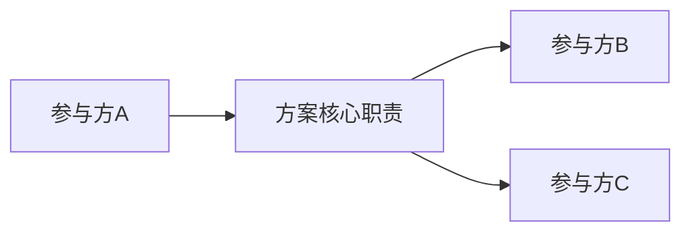
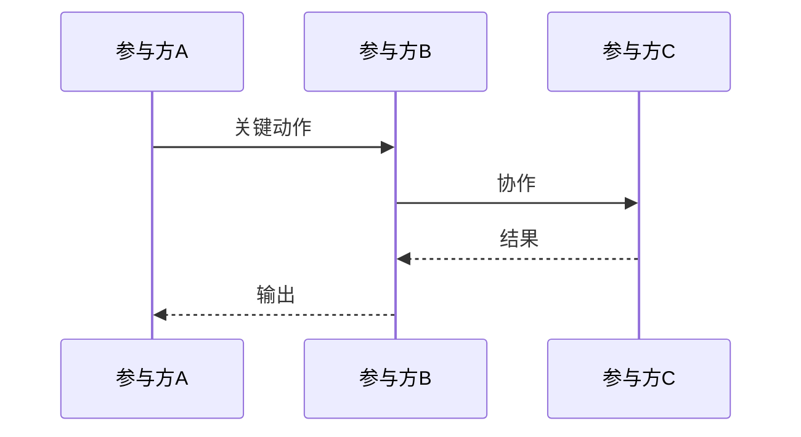
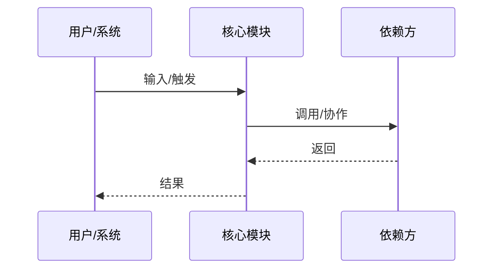
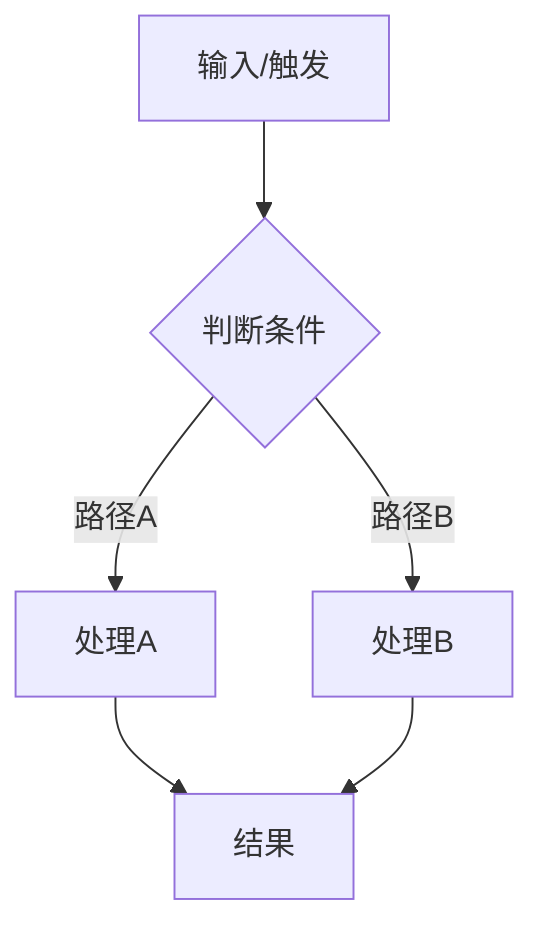
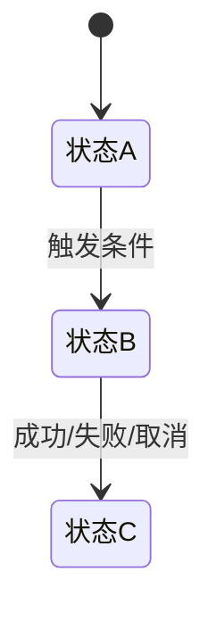
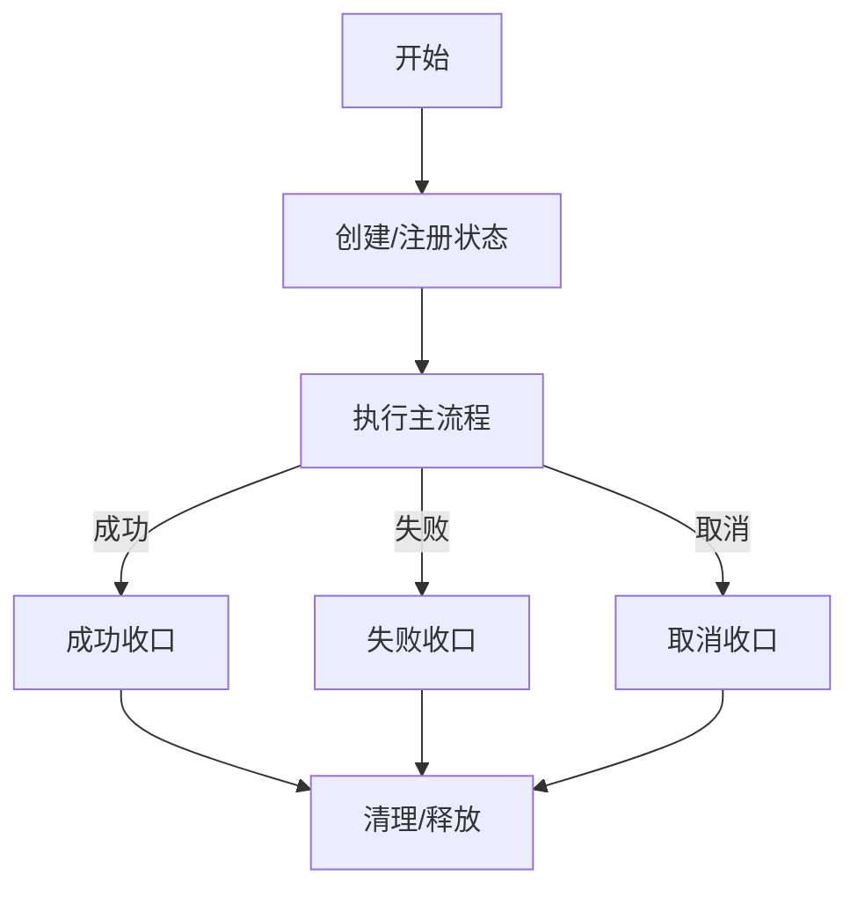

# `{{方案名称}}`

- 方案日期：`{{YYYY-MM-DD}}`
- 目标工程：`{{工程名}}`
- 参考文档：`{{参考文档列表}}`
- 方案类型：`{{方案类型}}`

> 使用说明：
> 1. 将 `{{...}}` 占位符替换为实际内容。
> 2. 一级章节顺序保持稳定，便于评审和归档；二级章节可按方案类型裁剪、替换或调整顺序。
> 3. 模板服务于评审问题，不服务于填满章节；二级章节只有在表达新信息时才保留，与前后章节重复时应删除或合并。
> 4. 如无需某章节，可保留标题并写“无”，也可在不影响评审完整性的前提下删除不适用二级章节；不要为了保持结构完整而保留空章节。
> 5. 能用图或表表达的内容，优先使用 Mermaid 图或 Markdown 表格，避免长段纯文字描述。
> 6. 图表说明按需补充。只有图表表达取舍、边界、风险或容易误读点时，才补充“边界说明”“取舍说明”“差异说明”等语义化说明。
> 7. 写作前先判断方案类型，并据此裁剪模板：
>    - 简单协议 / API / 配置方案：优先保留责任边界、接口定义、错误语义、接入迁移、测试范围；删除重复的关键协作、状态模型、生命周期章节。
>    - runtime / 状态 / 并发方案：保留主流程、关键分支、状态模型、生命周期与边界，用来说明重试、取消、清理、并发和异常收口。
>    - 跨系统 / 跨进程 / 跨部署方案：按需补充架构职责、关键协作或 4+1 视图，用来说明责任归属和环境差异。
> 8. 修订模板时，每个章节都必须回答一个明确评审问题：
>    - 第 1 章回答为什么做、选什么。
>    - 第 2 章回答责任归属。
>    - 第 3 章回答怎么实现。
>    - 第 8 章回答怎么验收。
> 9. 如果一个章节不能回答新的评审问题，或只是在重复其他章节，应删除或合并；模板修订应优先增加“何时删除 / 何时合并”的判断规则，而不是增加固定章节。
> 10. 新模板只约束后续方案写作，不要求回改历史方案文档。

## 1. 背景

> 本章说明为什么要做。需要写清当前问题、触发场景、业务价值和约束来源。

### 1.1 场景说明

`{{谁在什么入口/流程中遇到什么问题，当前行为是什么，为什么需要改}}`

### 1.2 需求目标

> 目标必须可验证，并能在第 8 章找到对应测试或验收项。
> 优先写业务目标或用户价值；纯工程方案可写可验证工程目标。
> 不要把默认兼容、协议不变、状态一致性、迁移约束混入目标，这些应放到非目标、接口定义、生命周期与边界或影响范围。

1. `{{目标1：用户/系统/工程要达成什么可验证结果}}`
2. `{{目标2：需要覆盖什么核心场景或用户路径}}`
3. `{{目标3：需要保证什么体验、质量或工程结果}}`

### 1.3 非目标

> 明确本方案不解决什么，避免评审扩大范围。

1. `{{不做什么1}}`
2. `{{不做什么2}}`

### 1.4 方案结论

> 本节只回答“选哪个方案、为什么选、后续是否还有方案”。
> 如只有一个方案，不需要编造候选方案，可删除候选方案对比。
> 兼容策略、旧字段降级、默认行为不要在这里单独成段；应放到第 3 章的接口定义、生命周期与边界、接入 / 迁移策略中。
> 如存在多个候选方案或后续方案，必须在这里前置比较，不放到文末。

当前结论：

1. 推荐方案：`{{推荐方案}}`
2. 取舍原因：`{{为什么选它，放弃了什么}}`
3. 后续动作：`{{下一步实现/验证/文档/发布动作}}`

候选方案对比（如有）：

| 候选方案 | 优点 | 缺点 | 适用条件 | 是否采用 |
|---|---|---|---|---|
| `{{方案A}}` | `{{优点}}` | `{{缺点}}` | `{{条件}}` | `{{是/否}}` |
| `{{方案B}}` | `{{优点}}` | `{{缺点}}` | `{{条件}}` | `{{是/否}}` |

后续方案（如有）：

| 后续方案 | 触发条件 | 依赖前提 | 当前不做原因 |
|---|---|---|---|
| `{{后续方案A}}` | `{{什么时候需要}}` | `{{依赖什么}}` | `{{为什么本次不做}}` |

## 2. 架构设计

> 本章说明方案在系统架构中的位置、参与方责任和关键协作。
> 默认先写责任边界，用来回答“谁负责什么、谁不负责什么”。
> `2.2 架构职责`、`2.3 关键协作` 和 `2.4 4+1 视图` 都是可选模块，只在能表达新架构信息时保留。
> 不要在第 2 章重复第 3 章的执行时序、异常收口或字段细节。

### 2.1 责任边界

> 交付物：参与方职责图 + 负责/不负责表。
> 覆盖范围：谁负责什么、谁不负责什么、关键责任边界。
> 不覆盖：具体文件修改、函数实现、运行时调用细节。



| 对象 | 负责 | 不负责 |
|---|---|---|
| `{{对象A}}` | `{{职责}}` | `{{边界}}` |
| `{{对象B}}` | `{{职责}}` | `{{边界}}` |

边界说明（按需）：

1. `{{容易误读的责任边界}}`
2. `{{下游或接入方需要承担的责任}}`

### 2.2 架构职责

> 可选模块。
> 仅当方案存在分层职责、稳定架构角色、模块归属变化或状态归属变化时使用。
> 如果 `2.1 责任边界` 已经足够说明责任归属，删除本节。
>
> 交付物：稳定架构角色图 + 职责表。
> 覆盖范围：核心角色、职责分工、状态归属、协作边界。
> 不覆盖：具体代码新增/修改分类、文件级实现清单。


| 架构角色 | 整体职责 | 本方案落点 |
|---|---|---|
| `{{角色A}}` | `{{稳定职责}}` | `{{本方案如何落到该职责}}` |
| `{{角色B}}` | `{{稳定职责}}` | `{{本方案如何落到该职责}}` |

### 2.3 关键协作

> 可选模块。
> 仅当协作链路表达跨系统、跨进程、跨宿主边界，且不重复第 3 章流程时使用。
> 如果详细设计中的主流程已经能说明协作顺序，删除本节。
>
> 交付物：关键链路图或时序图。
> 覆盖范围：跨模块、跨系统、跨宿主的关键协作方式。
> 不覆盖：异常收口和实现细节；这些放到第 3 章。



协作说明（按需）：

1. `{{该协作链路表达的核心机制}}`
2. `{{需要特别说明的时序、边界或取舍}}`

### 2.4 可选：4+1 视图

> 仅在复杂系统、跨进程、跨部署、多端环境差异明显时使用。
> 不需要 4+1 时，删除本节或写“无”。

| 视图 | 何时需要 | 交付物 |
|---|---|---|
| 场景视图 | 需要系统性覆盖用户/系统触发场景 | 场景表、关键链路图 |
| 逻辑视图 | 需要说明复杂模块关系或领域对象 | 模块职责图、状态归属表 |
| 开发视图 | 需要说明分层、目录、依赖方向 | 分层图、依赖方向表 |
| 进程视图 | 涉及异步、并发、队列、取消、重试 | 时序图、并发图、状态机 |
| 物理视图 | 涉及跨端、部署、网络、进程边界 | 部署图、环境差异表 |

## 3. 详细设计

> 本章说明怎么实现。需要让实现者不再做关键决策。
> 可按方案类型调整二级章节顺序；不适用的模块可以删除或写“无”。
> 简单协议 / API / 配置方案可以用一个主流程图覆盖正向和异常路径，然后重点写接口定义、错误语义、接入迁移和测试范围。

### 3.1 主流程

> 可按方案类型重命名，例如“握手准入流程”“配置解析流程”“发布流程”。
> 描述核心执行路径。runtime / 状态 / 并发类方案建议用时序图；纯接口方案可用请求/响应流程；纯 UI 方案可用用户路径图。
> 如果一个时序图能清晰覆盖成功和异常路径，可把失败语义直接写在本节，并删除 `3.2 关键分支流程`。



关键规则：

1. `{{主流程规则1}}`
2. `{{主流程规则2}}`

### 3.2 关键分支流程

> 可选模块。
> 描述失败、取消、重试、降级、并发、权限、兼容等关键分支。
> 如分支较少，或已经在 `3.1 主流程` 的时序图中表达清楚，可删除本节。
> 状态型、并发型、缓存型方案也可把复杂分支合并到 `3.4 生命周期与边界`。



### 3.3 状态模型

> 描述状态归属、状态表达、创建/更新/释放时机。
> 不强制使用显式状态机；如果实际实现更适合集合、快照、计数或布尔状态，应直接说明数据模型。
> 如方案不新增状态、缓存、集合或状态机，可删除本节，并在主流程或接口定义中说明必要的数据语义。



| 状态/数据 | 含义 | 归属 | 创建时机 | 更新时机 | 清理/恢复时机 |
|---|---|---|---|---|---|
| `{{状态A}}` | `{{含义}}` | `{{模块}}` | `{{时机}}` | `{{时机}}` | `{{时机}}` |
| `{{数据B}}` | `{{含义}}` | `{{模块}}` | `{{时机}}` | `{{时机}}` | `{{时机}}` |

### 3.4 生命周期与边界

> 用于合并说明状态创建、数据写入、释放、失败、回滚、异常收口和兼容降级。
> 对状态型、并发型、缓存型方案，优先使用本节；不必再强拆“数据与缓存处理”和“边界约束”。
> 简单接口或协议变更可删除本节，并将失败语义合并到关键分支流程或接口定义。
> 如果某类内容特别复杂，可拆成独立小节，例如“数据与缓存处理”“异常收口”“兼容降级”。



生命周期规则：

**`{{场景/阶段A}}`**

- 触发：`{{触发条件}}`
- 处理：`{{处理策略}}`
- 结果：`{{成功/失败/降级语义}}`
- 状态：`{{状态变化或清理规则}}`
- 观测：`{{日志/埋码/诊断；如无则写无}}`

**`{{场景/阶段B}}`**

- 触发：`{{触发条件}}`
- 处理：`{{处理策略}}`
- 结果：`{{成功/失败/降级语义}}`
- 状态：`{{状态变化或清理规则}}`
- 观测：`{{日志/埋码/诊断；如无则写无}}`

### 3.5 接口定义

> 接口设计统一放在本节。包括 public API、SDK contract、服务端接口、配置项、事件协议等。
> 对协议 / API / 配置方案，本节是核心章节，应承载字段、错误语义、兼容策略和 public contract 说明。
> TypeScript SDK / 配置项优先使用代码块 + 字段说明。
> HTTP / RPC / 事件协议优先使用接口表 + 字段表。
> 下方两类示例按接口类型二选一，删除不适用示例。

#### TypeScript SDK / 配置项示例

```ts
export interface ExampleOptions {
  enabled?: boolean;
  mode?: 'default' | 'custom';
}
```

| 字段 | 类型 | 必填 | 默认值 | 说明 |
|---|---|---|---|---|
| `enabled` | `boolean` | 否 | `false` | `{{字段说明}}` |
| `mode` | `'default' \| 'custom'` | 否 | `'default'` | `{{字段说明}}` |

默认与校验规则：

1. `{{未传字段时的默认行为}}`
2. `{{非法值如何处理，是否允许静默降级}}`
3. `{{是否 public contract，是否需要版本/文档同步}}`

#### HTTP / RPC / 事件协议示例

| 项目 | 说明 |
|---|---|
| 所属模块 | `{{模块名}}` |
| 调用方 | `{{调用方}}` |
| 被调用方 | `{{被调用方}}` |
| 入参 | `{{字段、类型、默认值}}` |
| 出参 | `{{字段、类型、语义}}` |
| 默认行为 | `{{未配置/未传参时行为}}` |
| 兼容策略 | `{{旧版本、旧字段、降级方式}}` |
| 失败语义 | `{{错误码、异常、fail-closed 或重试策略}}` |
| 是否 public contract | `{{是/否；若是，需要同步文档和版本说明}}` |

### 3.6 接入 / 迁移策略（可选）

> 多宿主、多客户端、多入口、多版本方案需要填写。
> 说明谁采用什么策略、为什么、何时迁移或灰度。
> 不涉及接入差异时，删除本节或写“无”。

| 接入方/环境 | 策略 | 选择原因 | 影响与要求 |
|---|---|---|---|
| `{{接入方A}}` | `{{策略}}` | `{{为什么这样选}}` | `{{影响和接入要求}}` |
| `{{接入方B}}` | `{{策略}}` | `{{为什么这样选}}` | `{{影响和接入要求}}` |

### 3.7 实现清单

> 写模块级改动和目录/文件归属，不堆过细函数清单。
> 设计模式如 Strategy、Adapter、Facade、Port/Adapter 等，也放在这里说明。

| 模块/目录/文件 | 改动类型 | 职责 | 关键说明 |
|---|---|---|---|
| `{{模块A}}` | `{{新增/修改/删除}}` | `{{职责}}` | `{{说明}}` |
| `{{模块B}}` | `{{新增/修改/删除}}` | `{{职责}}` | `{{说明}}` |
| `{{设计模式}}` | `{{引入/调整}}` | `{{解决什么问题}}` | `{{扩展边界}}` |

### 3.8 未确认项

> 只写会影响实现或验收的待确认问题。

| 未确认项 | 影响范围 | 当前默认假设 | 需要谁确认 |
|---|---|---|---|
| `{{问题A}}` | `{{影响}}` | `{{默认假设}}` | `{{负责人/团队}}` |
| `{{问题B}}` | `{{影响}}` | `{{默认假设}}` | `{{负责人/团队}}` |

## 4. 性能

> 写是否新增请求、计算、缓存、队列、序列化、首屏影响。涉及大数据量或流式输出时，必须说明背压、缓存上限和最坏情况。

| 项目 | 是否影响 | 说明 | 风险 | 应对策略 |
|---|---|---|---|---|
| 请求数量 | `{{是/否}}` | `{{说明}}` | `{{风险}}` | `{{策略}}` |
| 计算开销 | `{{是/否}}` | `{{说明}}` | `{{风险}}` | `{{策略}}` |
| 缓存/内存 | `{{是/否}}` | `{{说明}}` | `{{风险}}` | `{{策略}}` |
| 首屏/列表/流式体验 | `{{是/否}}` | `{{说明}}` | `{{风险}}` | `{{策略}}` |

## 5. 功耗

> 写是否新增轮询、长连接、后台任务、动画、频繁刷新。端侧方案需说明前后台、弱网、长时间运行的影响。

| 项目 | 是否影响 | 说明 | 应对策略 |
|---|---|---|---|
| 轮询/长连接 | `{{是/否}}` | `{{说明}}` | `{{策略}}` |
| 后台任务 | `{{是/否}}` | `{{说明}}` | `{{策略}}` |
| 动画/频繁刷新 | `{{是/否}}` | `{{说明}}` | `{{策略}}` |
| 弱网/长时间运行 | `{{是/否}}` | `{{说明}}` | `{{策略}}` |

## 6. 埋码

> 写需要新增或调整的事件、触发时机和用途。无埋码时写“无”，并说明为什么不需要。

| 埋码 | 触发条件 | 关键字段 | 用途 |
|---|---|---|---|
| `{{埋码1}}` | `{{什么时候触发}}` | `{{字段列表}}` | `{{诊断/业务分析/告警}}` |
| `{{埋码2}}` | `{{什么时候触发}}` | `{{字段列表}}` | `{{诊断/业务分析/告警}}` |

## 7. 影响范围

> 优先使用影响范围表，按直接影响、间接影响、不影响分类。

### 7.1 直接影响

| 对象 | 影响说明 | 验证方式 |
|---|---|---|
| `{{模块/接口/用户路径}}` | `{{影响}}` | `{{验证方式}}` |

### 7.2 间接影响

| 对象 | 影响说明 | 风险 | 应对策略 |
|---|---|---|---|
| `{{依赖方/下游/文档/发布流程}}` | `{{影响}}` | `{{风险}}` | `{{策略}}` |

### 7.3 不影响

| 对象 | 不影响说明 | 依据 |
|---|---|---|
| `{{行为/模块/接口}}` | `{{为什么不影响}}` | `{{依据}}` |

## 8. 测试范围

> 优先使用测试矩阵，确保每个需求目标、核心场景和边界约束都有对应测试项。
> 单元测试和集成测试负责工程断言；功能测试（手工验证）负责用户可见验收。

### 8.1 单元测试

> 覆盖纯逻辑、状态模型、类型、contract、配置解析、边界函数。

| 测试项 | 覆盖来源 | 输入/动作 | 预期结果 |
|---|---|---|---|
| `{{纯逻辑/状态模型}}` | `{{目标/状态/边界}}` | `{{输入/动作}}` | `{{结果}}` |
| `{{接口契约/类型}}` | `{{接口定义}}` | `{{输入/动作}}` | `{{结果}}` |

### 8.2 集成测试

> 覆盖模块链路、fake provider/gateway、端到端调用链、真实协议投影。

| 测试项 | 覆盖来源 | 输入/动作 | 预期结果 |
|---|---|---|---|
| `{{核心成功链路}}` | `{{目标/主流程}}` | `{{输入/动作}}` | `{{结果}}` |
| `{{失败/取消/异常链路}}` | `{{生命周期与边界}}` | `{{输入/动作}}` | `{{结果}}` |

### 8.3 功能测试（手工验证）

> 面向测试人员。只写用户操作、可见结果和观察方式，不写内部 API、字段、日志实现细节。

| 场景 | 操作 | 预期体验 | 观察方式 |
|---|---|---|---|
| `{{用户场景}}` | `{{用户如何操作}}` | `{{用户看到什么结果}}` | `{{前端展示/截图/录屏/测试记录}}` |
| `{{异常场景}}` | `{{用户如何触发}}` | `{{用户看到什么错误或终态}}` | `{{前端展示/测试记录}}` |

### 8.4 兼容测试（可选）

> 存在版本、平台、入口、主题、语言、网络等兼容维度时填写；无兼容维度时写“无”。

| 测试项 | 兼容维度 | 覆盖来源 | 输入/动作 | 预期结果 |
|---|---|---|---|---|
| `{{默认行为兼容}}` | `{{旧版本/旧配置/未配置}}` | `{{非目标/兼容边界}}` | `{{输入/动作}}` | `{{结果}}` |
| `{{平台/入口兼容}}` | `{{平台/入口/网络/语言/主题}}` | `{{影响范围/架构设计/可选物理视图}}` | `{{输入/动作}}` | `{{结果}}` |
