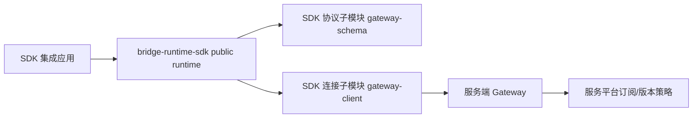
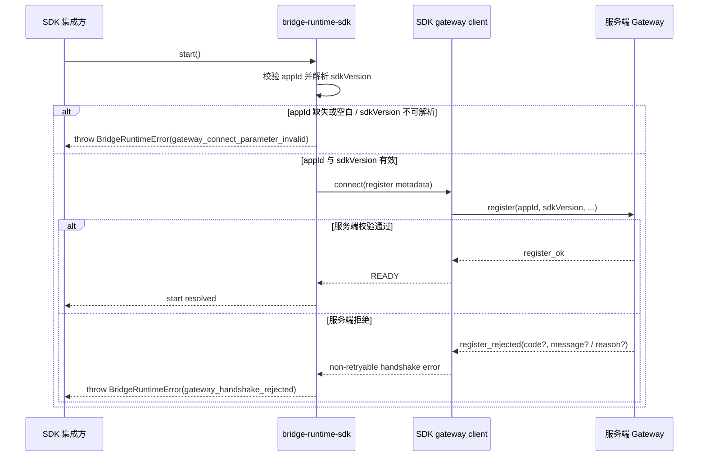
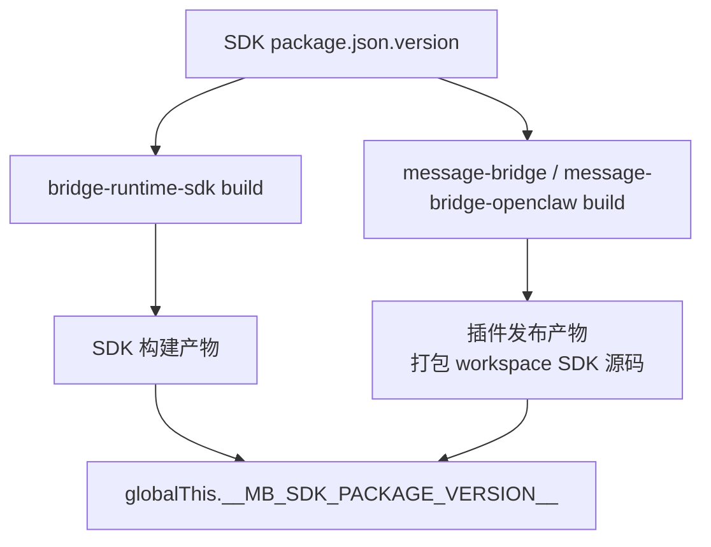

# `bridge-runtime-sdk 应用订阅与版本准入方案`

- 方案日期：`2026-07-07`
- 目标工程：`@wecode/bridge-runtime-sdk`
- 参考文档：`docs/template/design_template.md`、`packages/bridge-runtime-sdk/docs/bridge-runtime-sdk-architecture.md`
- 方案类型：`SDK 协议与生命周期设计`

## 1. 背景

### 1.1 场景说明

服务平台准备对 `bridge-runtime-sdk` 做订阅和版本治理。SDK 集成方需要以应用身份订阅 SDK；只有应用已订阅且 SDK 版本有效时，服务端才允许 SDK 完成 gateway 握手。平台也需要具备下线指定 SDK 版本的能力。

当前 SDK 已在 register 握手中自动注入 `sdkVersion`，但没有应用身份字段，也没有明确约束服务端授权拒绝错误如何传递给应用。

本方案把 `gateway-schema` 和 `gateway-client` 视为 SDK 的协议与连接子模块：协议真源仍在 `gateway-schema`，连接状态机仍在 `gateway-client`，但方案边界按 SDK 能力整体说明。

### 1.2 需求目标

1. SDK 握手 register 上报 `appId` 和 SDK 自身版本 `sdkVersion`。
2. 服务端可基于 `appId + sdkVersion` 判断应用是否有 SDK 使用权限、版本是否有效。
3. 校验失败时握手失败，SDK 拒绝连接，并把服务端错误文案传递给应用。

### 1.3 非目标

1. 本方案不实现服务平台的订阅管理后台、订阅数据模型或版本下线存储。
2. 版本下线后不主动断开既有连接，只阻止新握手连接。
3. SDK 不枚举服务端业务拒绝码，业务 code 由服务端定义和维护。
4. 本方案不新增 `BridgeRuntimeError.details` public API。

## 2. 架构设计

### 2.1 责任边界



| 对象 | 负责 | 不负责 |
|---|---|---|
| `bridge-runtime-sdk` | 暴露 `register.appId` 配置、自动解析 `sdkVersion`、把握手拒绝映射为 SDK 稳定错误 | 不定义平台订阅业务码 |
| SDK 协议子模块 | 定义 register 与 `register_rejected` 协议真源 | 不承载 SDK public runtime API |
| SDK 连接子模块 | 组装 register 报文、处理握手成功/拒绝状态 | 不判断订阅权限 |
| 服务端 Gateway | 基于平台策略校验 `appId + sdkVersion` 并返回拒绝错误 | 不决定 SDK 本地错误模型 |
| SDK 集成应用 | 提供平台应用 `appId`，处理 SDK 抛出的错误 | 不传入或覆盖 `sdkVersion` |

边界说明：

1. `sdkVersion` 必须由 SDK 自证，集成方不能通过配置覆盖。
2. `message-bridge` / `message-bridge-openclaw` 是仓库内特殊宿主，分别在 `register.appId` 写死 `opencode` / `openclaw`；其他集成方按平台应用传入自己的 `appId`。
3. 服务端业务 `code` 不进入 `BridgeRuntimeError` public contract；SDK 只用 `BridgeRuntimeError.code` 表达稳定错误分类。
4. `register.appId` 在 public config 中属于 register 握手字段，但语义仍是平台应用身份，不是 `channel`、`toolVersion` 这类宿主元数据。

## 3. 详细设计

### 3.1 握手准入流程



关键规则：

1. `createBridgeRuntime()` 接收 `gatewayHost.register.appId`。
2. SDK 在归一化 gateway host 时解析 `sdkVersion`；版本自证只来自构建注入的 `globalThis.__MB_SDK_PACKAGE_VERSION__`。
3. register 报文必须包含 `appId` 和可解析的 `sdkVersion`。
4. 缺少 `appId` 或无法解析 `sdkVersion` 是本地参数错误，SDK 抛出 `BridgeRuntimeError('gateway_connect_parameter_invalid', message)`，不发起 gateway 连接。
5. 服务端拒绝是握手失败，SDK gateway client 生成不可重试错误；runtime 分类为 `gateway_handshake_rejected`。
6. 握手拒绝后 `start()` 抛错，`getStatus().error` 保留同类错误，runtime 不进入 READY，不自动重连。
7. 旧协议只返回 `reason` 时，SDK 仍使用 `reason` 作为错误文案。
8. 本方案不新增埋码或观测能力；错误信息仅通过现有错误传递路径暴露给应用。

### 3.2 sdkVersion 解析

`sdkVersion` 是运行时只读取 `globalThis.__MB_SDK_PACKAGE_VERSION__`，不在运行时直接读取 `package.json`。



图示说明：

1. `packages/bridge-runtime-sdk` 自身构建产物由 SDK build 读取 SDK 自身 `package.json.version`，并注入 `globalThis.__MB_SDK_PACKAGE_VERSION__`。
2. `message-bridge` / `message-bridge-openclaw` 继续通过 workspace 源码依赖 SDK；插件发布构建需要读取 SDK 自身 `package.json.version`，并在插件产物中注入同一个 `globalThis.__MB_SDK_PACKAGE_VERSION__` 常量。
3. 插件不需要改为引用 SDK dist；插件构建会打包 SDK 源码。
4. 若运行时无法解析 `sdkVersion`，SDK 按本地参数错误 fail-closed，不发起 gateway 连接。

### 3.3 接口定义

#### TypeScript SDK contract

```ts
export interface BridgeGatewayHostConfig {
  url?: string;
  auth: {
    ak: string;
    sk: string;
  };
  register: {
    appId: string;
    channel: string;
    toolVersion: string;
    pluginVersion?: string;
  };
}

export class BridgeRuntimeError extends Error {
  readonly code: BridgeRuntimeErrorCode;
}
```

| 字段 | 类型 | 必填 | 默认值 | 说明 |
|---|---|---|---|---|
| `gatewayHost.register.appId` | `string` | 是 | 无 | 平台应用身份；空白值本地拒绝；最终进入 register 握手报文 |
| `sdkVersion` | `string` | SDK 内部必填 | 构建注入常量 | SDK 自证版本，不开放配置；由构建链路注入 `globalThis.__MB_SDK_PACKAGE_VERSION__` |
| `BridgeRuntimeError.code` | `BridgeRuntimeErrorCode` | 是 | 无 | SDK 稳定错误分类 |
| `BridgeRuntimeError.message` | `string` | 是 | 无 | 应用可见错误文案；握手拒绝时来自服务端 `message` 或旧 `reason` |

默认与校验规则：

1. `register.appId` 必须非空；非法值不静默降级。
2. `sdkVersion` 必须由构建链路注入；未注入时本地拒绝连接。
3. `BridgeRuntimeError.code` 保持 SDK 稳定分类，不直接等于服务端业务 code。
4. 不新增 `BridgeRuntimeError.details`；服务端业务 code 不作为 SDK public error contract 暴露。

#### SDK register 协议

| 项目 | 说明 |
|---|---|
| 所属模块 | SDK 协议子模块 |
| 调用方 | SDK gateway client |
| 被调用方 | 服务端 Gateway |
| 入参 | `appId`、`toolType`、`toolVersion`、`sdkVersion`、`pluginVersion?`、设备字段 |
| 出参 | `register_ok` 或 `register_rejected` |
| 兼容策略 | `register_rejected` 兼容旧 `reason` |
| 失败语义 | 拒绝即 fail-closed，不重连 |
| 是否 public contract | 是 |

`register_rejected` 新结构：

```ts
type RegisterRejectedMessage = {
  type: 'register_rejected';
  code?: string;
  message?: string;
  reason?: string;
};
```

错误映射规则：

1. `BridgeRuntimeError.code = 'gateway_handshake_rejected'`。
2. `BridgeRuntimeError.message = register_rejected.message ?? register_rejected.reason ?? 'gateway_register_rejected'`。
3. `register_rejected.code` 不进入 SDK public error contract。

### 3.4 接入 / 迁移策略

| 接入方/环境 | 策略 | 选择原因 | 影响与要求 |
|---|---|---|---|
| `message-bridge` | 写死 `appId: 'opencode'`，继续 workspace 源码依赖 SDK，插件构建注入 SDK 版本常量 | 特殊宿主类型，不按普通应用实例配置；源码依赖便于仓库内联调，发布产物由构建注入保证版本自证 | 更新 SDK 装配与插件构建产物测试 |
| `message-bridge-openclaw` | 写死 `appId: 'openclaw'`，继续 workspace 源码依赖 SDK，插件构建注入 SDK 版本常量 | 特殊宿主类型，不按普通应用实例配置；源码依赖便于仓库内联调，发布产物由构建注入保证版本自证 | 更新 runtime/probe 装配与 bundle 产物测试 |
| 其他 SDK 集成方 | 在 `register.appId` 显式传平台应用 `appId` | 平台按应用订阅 SDK | 发布说明中标记必填变更 |

### 3.5 实现清单

| 模块/目录/文件 | 改动类型 | 职责 | 关键说明 |
|---|---|---|---|
| SDK 协议子模块 | 修改 | 协议真源 | register 新增 `appId`，拒绝消息支持 `code/message` |
| SDK gateway client | 修改 | 握手组包与拒绝错误 | register 透传 `appId`，握手拒绝 message 按新旧协议归一化 |
| `packages/bridge-runtime-sdk` | 修改 | SDK public contract 与 lifecycle | 在 `register` 内新增 `appId`，缺少构建注入 `sdkVersion` 时本地拒绝 |
| `plugins/message-bridge` | 修改 | SDK 装配与发布构建 | 传入 `opencode`，构建产物注入 SDK 版本常量 |
| `plugins/message-bridge-openclaw` | 修改 | SDK 装配与发布构建 | 传入 `openclaw`，构建产物注入 SDK 版本常量 |

### 3.6 未确认项

| 未确认项 | 影响范围 | 当前默认假设 | 需要谁确认 |
|---|---|---|---|
| 服务端上下行协议改动核对 | 上行 register 字段（含 `appId`、`sdkVersion`、既有工具/设备字段）与下行 `register_ok` / `register_rejected` 结构 | SDK 侧先按本方案统一定义上下行协议变更，落地前需与服务端对齐字段语义、必填性、兼容策略和灰度顺序 | 服务端 Gateway |
| `opencode` / `openclaw` 应用身份确认 | 仓库内 `message-bridge` / `message-bridge-openclaw` 的固定 `register.appId` | 暂按 `opencode` / `openclaw` 上报，落地前需确认是否为服务平台订阅体系中的正式应用身份 | 服务平台 |

## 4. 性能

| 项目 | 是否影响 | 说明 | 风险 | 应对策略 |
|---|---|---|---|---|
| 请求数量 | 否 | 复用 register 握手，无新增请求 | 无 | 无 |
| 计算开销 | 否 | 仅增加字符串校验和构建注入常量读取 | 构建链路未注入 SDK 版本常量 | 发布构建统一注入，运行时缺失时按本地参数错误 fail-closed |
| 缓存/内存 | 否 | 不新增长期状态 | 无 | 无 |
| 首屏/列表/流式体验 | 否 | 仅影响连接准入 | 授权失败更早暴露 | 透传清晰错误文案 |

## 5. 功耗

| 项目 | 是否影响 | 说明 | 应对策略 |
|---|---|---|---|
| 轮询/长连接 | 否 | 不新增连接 | 无 |
| 后台任务 | 否 | 不新增后台任务 | 无 |
| 动画/频繁刷新 | 否 | 无 UI 改动 | 无 |
| 弱网/长时间运行 | 否 | 授权拒绝不重连，减少无效重试 | 保持 fail-closed |

## 6. 埋码

本方案不涉及埋码设计；当前 SDK 未实现相关埋码能力，因此不新增 `runtimeStartFailed`、`gateway.register.rejected` 等事件，也不要求新增日志或观测字段。

## 7. 影响范围

### 7.1 直接影响

| 对象 | 影响说明 | 验证方式 |
|---|---|---|
| SDK public config | `register.appId` 变为必填 | public API contract 测试 |
| SDK register 协议 | 新增 `appId` 字段 | schema contract 测试 |
| SDK runtime start | 授权失败抛稳定分类错误，message 透传服务端文案 | runtime 集成测试 |

### 7.2 间接影响

| 对象 | 影响说明 | 风险 | 应对策略 |
|---|---|---|---|
| 普通 SDK 集成方 | 需要传入平台应用 appId | 升级后缺字段启动失败 | 发布说明和迁移文档 |
| 服务端 Gateway | 需要支持新 register 字段 | 旧服务端不接受新增 `appId` 或新 `sdkVersion` 必填语义 | 服务端协议先兼容，再灰度发布 SDK |

### 7.3 不影响

| 对象 | 不影响说明 | 依据 |
|---|---|---|
| Provider SPI | 不改变 provider 命令与 fact contract | 应用身份只在 gateway 握手层 |
| 下行业务消息 | 不改变 invoke/tool event 协议 | 本方案只改 register 控制帧 |
| AK/SK 鉴权 | 不替代现有认证 | appId 是授权主体，AK/SK 是凭证 |

## 8. 测试范围

### 8.1 单元测试

| 测试项 | 覆盖来源 | 输入/动作 | 预期结果 |
|---|---|---|---|
| register schema appId | 接口定义 | 缺失或空白 `appId` | 校验失败 |
| register_rejected 兼容 | 协议兼容 | `code/message` 或旧 `reason` | 均可解析 |
| sdkVersion 构建注入 | 版本自证 | SDK 自身构建产物 | `resolvePackageVersion()` 等于 SDK package version |
| sdkVersion 缺失拒绝 | 生命周期边界 | 构建注入缺失 | 抛参数错误，不连接 |
| appId 本地校验 | 生命周期边界 | 空白 `appId` | 抛参数错误，不连接 |
| BridgeRuntimeError message | 错误透传 | 服务端拒绝 | `message` 使用服务端 `message` 或旧 `reason` |

### 8.2 集成测试

| 测试项 | 覆盖来源 | 输入/动作 | 预期结果 |
|---|---|---|---|
| 成功握手 | 主流程 | 有效 `appId + sdkVersion` | runtime READY |
| 应用未授权 | 握手准入流程 | 服务端返回 `register_rejected.message` | `start()` 抛 `gateway_handshake_rejected`，message 透传 |
| 版本下线 | 握手准入流程 | 服务端返回版本无效文案 | SDK fail-closed 并透传 message |
| 插件装配 | 迁移策略 | 创建 message-bridge/openclaw runtime | register 包含固定 appId 和构建注入的 SDK 版本 |
| 插件构建产物版本注入 | 版本自证 | 构建 message-bridge/openclaw 产物 | 产物内注入 `globalThis.__MB_SDK_PACKAGE_VERSION__` |

### 8.3 功能测试（手工验证）

| 场景 | 操作 | 预期体验 | 观察方式 |
|---|---|---|---|
| appId已订阅sdk，sdk版本有效| 启动 SDK连接 | 连接成功，功能可用 | 运行记录 |
| appId已订阅sdk，sdk版本无效,不存在 | 启动sdk连接 | 连接失败，提示版本无效 | 错误展示或日志 |
| appId未订阅sdk，sdk版本有效 | 启动 SDK连接 | 连接失败，应用拿到服务端错误文案 | 错误展示或日志 |
| appId未订阅sdk，sdk版本无效 | 启动 SDK连接 | 连接失败，应用拿到服务端错误文案 | 错误展示或日志 |
| opencode| 启动连接| 连接成功，功能可用|运行记录|
| openclaw|启动连接|连接成功，功能可用|运行记录|

### 8.4 兼容测试

无
