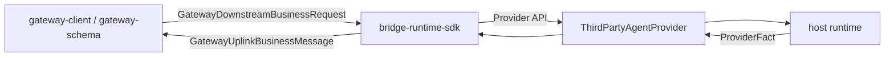

# bridge-runtime-sdk 模块架构

**Version:** 1.1  
**Date:** 2026-06-15  
**Status:** Active  
**Owner:** agent-plugin maintainers  
**Related:** `../../../docs/architecture/bridge-runtime-sdk-architecture.md`, `../../gateway-client/docs/gateway-client-architecture.md`, `../../gateway-schema/docs/gateway-schema-architecture.md`, `../../../plugins/message-bridge-openclaw/docs/architecture/message-bridge-openclaw-module-architecture.md`

## In Scope

1. 说明 `@wecode/bridge-runtime-sdk` 作为统一 bridge runtime 的职责边界。
2. 说明其下行命令、provider fact、projector、registry 与 host connection 的结构分工。
3. 说明其如何被 OpenClaw 侧桥接模块依赖，以及哪些能力不应下沉回插件内重复实现。

## Out of Scope

1. 不逐项展开协议字段、宿主 SDK 字段或 Provider SPI 细节表。
2. 不解释 OpenClaw 插件入口或 CLI 安装流程。
3. 不记录阶段性迁移计划或实现 TODO。

## External Dependencies

1. `@agent-plugin/gateway-client` 提供共享连接运行时与结构化 inbound frame。
2. `@agent-plugin/gateway-schema` 提供共享协议边界与 uplink validator。
3. 宿主 provider 通过 `ThirdPartyAgentProvider` 暴露统一能力。

## 1. 架构目标

`bridge-runtime-sdk` 围绕以下目标组织：

1. 提供可复用的 bridge runtime，避免不同宿主插件重复实现命令分发与事实投影。
2. 把“网关协议”“运行时命令”“宿主 provider 调用”“上行消息投影”分层隔离。
3. 对宿主侧暴露稳定 facade，只要求 provider 满足统一 contract。

## 2. 角色与边界

| 角色 | 职责 |
|---|---|
| `bridge-runtime-sdk` | 统一下行 intake、命令分发、fact 校验、上行投影、terminal 收口 |
| `gateway-client` | 共享连接运行时、语义化连接状态与 inbound/outbound 观测 |
| `gateway-schema` | 协议边界真源 |
| `ThirdPartyAgentProvider` | 宿主能力抽象，提供 session/run/question/permission/health 等能力 |

边界原则：

1. SDK 负责 bridge runtime，不负责定义共享协议字段。
2. SDK 消费 provider contract，不应感知具体宿主内部实现。
3. 请求终态、fact 投影和 outbound sink 不应再被插件层重复实现一遍。

## 3. 总体架构图



## 4. 内部分层

| 层 | 目录/对象 | 职责 |
|---|---|---|
| domain 层 | `src/domain/*` | provider contract、runtime command、runtime status、错误类型 |
| adapter 层 | `src/adapters/GatewayDownstreamCommandAdapter.ts` | 下行业务请求到 runtime command 的收敛 |
| application lifecycle 层 | `src/application/lifecycle/*` | Runtime start/stop/probe 生命周期、状态快照与并发 attempt guard |
| application 核心层 | `src/application/runtime.ts`, `create-runtime.ts` | 对外 facade、host connection 装配 |
| application 编排层 | `RuntimeCommandDispatcher`, `usecases`, `coordinators`, `registries` | 命令分发、状态协作、pending interaction 与 session registry |
| projector 层 | `projectors.ts` | fact 到事件、事件到 gateway message、命令结果和 terminal signal 投影 |
| infrastructure 层 | `src/infrastructure/*` | 默认内存 registry 实现 |

## 5. 关键主链路

### 5.1 下行命令链路

```text
GatewayDownstreamBusinessRequest
  -> GatewayDownstreamCommandAdapter
  -> RuntimeCommand
  -> RuntimeCommandDispatcher
  -> UseCase
  -> ThirdPartyAgentProvider
```

关键点：

1. runtime command 是 SDK 内部语义，不等于协议字面量。
2. dispatcher 负责路由，不应承载所有业务规则。
3. 具体输入约束和 provider 调用顺序由 UseCase 持有。

### 5.2 上行事实链路

```text
ProviderFact
  -> FactSequenceValidator
  -> coordinator
  -> FactToSkillEventProjector
  -> SkillEventToGatewayMessageProjector
  -> GatewayOutboundSink
```

关键点：

1. provider facts 先过时序校验，再参与上行投影。
2. `tool_event`、`tool_done`、`tool_error` 不应混成同一条无边界消息链。
3. outbound sink 只发送已封装好的 gateway business message，不解释业务含义。
4. `question.ask` 投影为 cloud `question` 时保留 `questions[].options[].description`；该字段只承担选项展示说明，不参与 `question_reply` 目标定位或答案结构。

### 5.3 Host runtime 链路

```text
createBridgeRuntime()
  -> normalize gatewayHost config
  -> create host connection
  -> GatewayInboundFrame handling
  -> runtime start/stop/probe/getStatus
```

关键点：

1. SDK 对宿主暴露稳定 `BridgeRuntime` facade。
2. host runtime 状态与底层 gateway-client 状态分离，不直接复用同一枚举。
3. invalid invoke 可在 runtime 边界构造成统一 `tool_error` 进行 fail-closed。
4. `gatewayHost.register.channel` 在 SDK 层只要求为字符串，表示业务渠道标识，不对具体产品字面量做枚举限制；SDK 内部会映射为 Gateway register 报文的 `toolType` 协议字段。
5. `gatewayHost.register.toolVersion` 表示宿主 agent 版本，`pluginVersion` 表示上层插件版本；`sdkVersion` 由 SDK 在可解析自身分发版本时自动注入，不作为外部输入暴露。

### 5.4 Lifecycle 与 gateway status 投影

```text
BridgeRuntime.start()
  -> RuntimeCore.start()
  -> GatewayRuntimeDriver.connect()
  -> gateway-client connect() resolve
  -> RuntimeLifecycleState.ready

gateway-client statusChange(status)
  -> GatewayRuntimeDriver
  -> RuntimeLifecycleService.handleGatewayStatusChanged(status)
  -> ready / reconnecting / failed 投影
```

关键点：

1. `BridgeRuntimeStatus` 是 Runtime 生命周期状态，不复用 gateway-client 的 public status class。
2. gateway-client 对外只暴露语义化 `GatewayClientStatus`，SDK 通过 `isReady()`、`isReconnecting()`、`isFailureClosed()` 和 `getError()` 消费，不读取 transport-ish 枚举。
3. `starting` 期间收到 gateway `ready` / `reconnecting` 事件不会完成 Runtime 启动；启动完成只由 `GatewayRuntimeDriver.connect()` resolve 驱动。
4. `idle`、`stopping`、`failed` 期间忽略 gateway status 投影，避免 manual stop、迟到 close 或旧连接事件覆盖 Runtime lifecycle 意图。
5. `ready` / `reconnecting` 期间收到 gateway failure closed 时，Runtime 进入 `failed`，并把 gateway error code/message 记录到 diagnostics。
6. start/stop 内部使用 attempt id 防止旧异步完成路径覆盖新的 stop、failed 或新一轮 lifecycle 状态。
7. `GatewayRuntimeDriver.disconnect()` 使用 `finally` detach observers；即使底层 disconnect reject，旧连接也不会继续向 Runtime 投递事件。

## 6. 关键约束

1. 统一命令分发、事实投影、terminal 收口属于 SDK 职责，不应下沉回插件层重复实现。
2. provider adapter 可以有宿主差异，但 runtime command、projector、registry 语义必须保持宿主无关。
3. `BridgeRuntime` 作为 facade，只暴露 `start/stop/probe/getStatus/getDiagnostics` 等稳定能力。
4. SDK 不应拥有共享协议字段真源，也不应绕开 `gateway-schema`。
5. SDK 组装的新 register 协议会在可解析自身分发版本时带上 `sdkVersion`，并在有插件封装层时透传 `pluginVersion`；若当前交付形态无法让 SDK 自证版本，则直接省略 `sdkVersion`，不由上层插件代填。
6. `BridgeRuntime.getStatus().failureReason` 只作为 failed 状态的展示摘要；稳定错误分类和 gateway 原始 code 应从 `getDiagnostics().failures[]` 读取。

## 7. 失败处理与 fail-closed 边界

1. inbound invalid invoke 必须在 runtime 边界被识别并收口，而不是继续进入 provider。
2. fact sequence 非法时必须被判定为运行时失败，不应继续投影为上行业务事件。
3. gateway 未 ready、host connection 不可用或 provider 返回非法结果时，应停止该执行链路并显式记录失败。
4. gateway-client failure closed 只在 Runtime 正在运行或启动阶段映射为 failed；停止意图内的 manual closed 不映射为 runtime failure。

## 8. 延伸阅读

1. 历史目标态架构：`../../../docs/architecture/bridge-runtime-sdk-architecture.md`
2. OpenClaw 侧桥接模块：`../../../plugins/message-bridge-openclaw/docs/architecture/message-bridge-openclaw-module-architecture.md`
3. 连接运行时：`../../gateway-client/docs/gateway-client-architecture.md`
