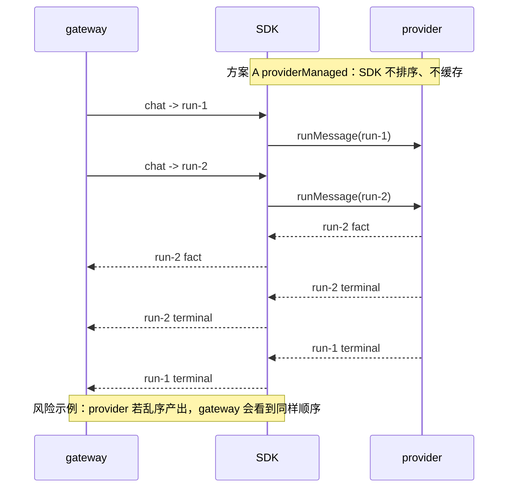
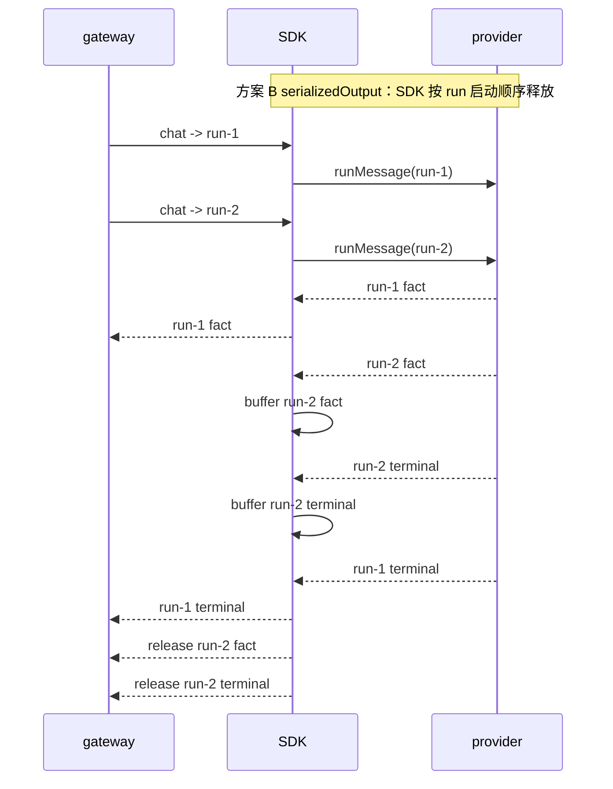
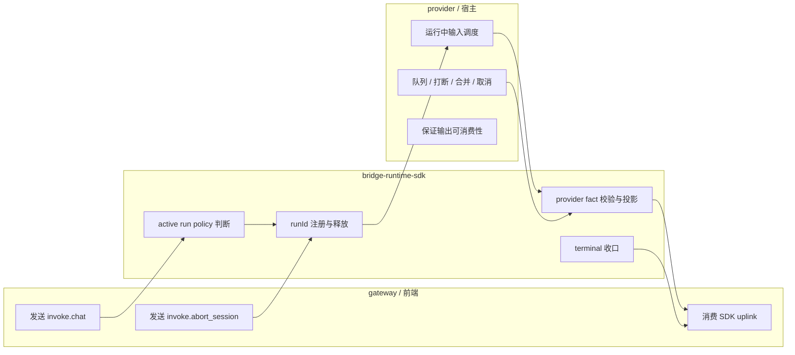
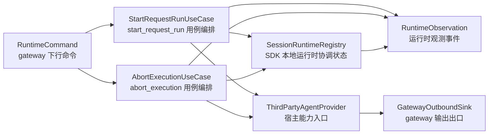
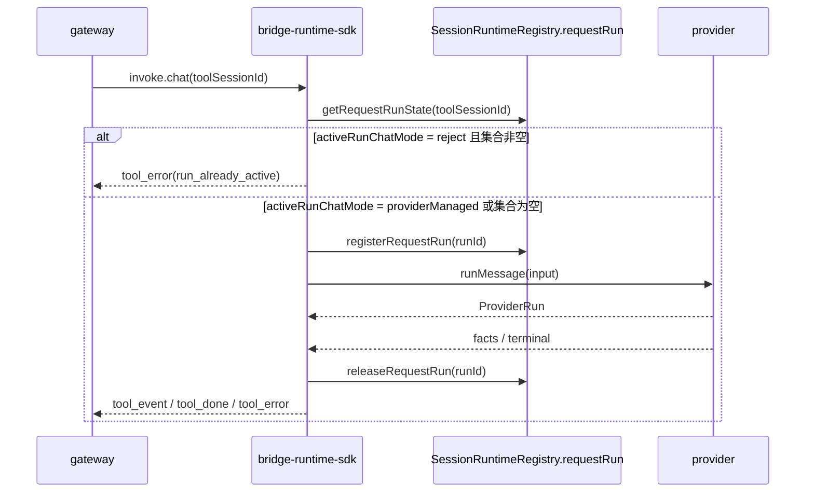
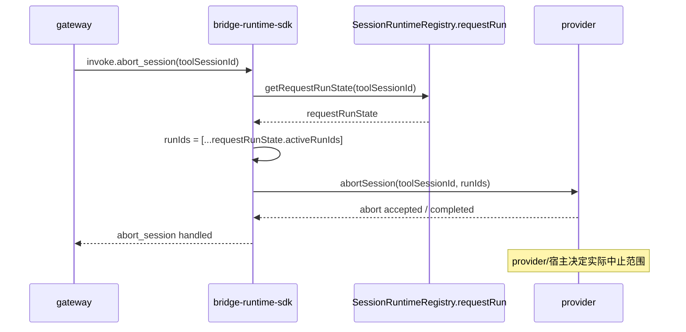
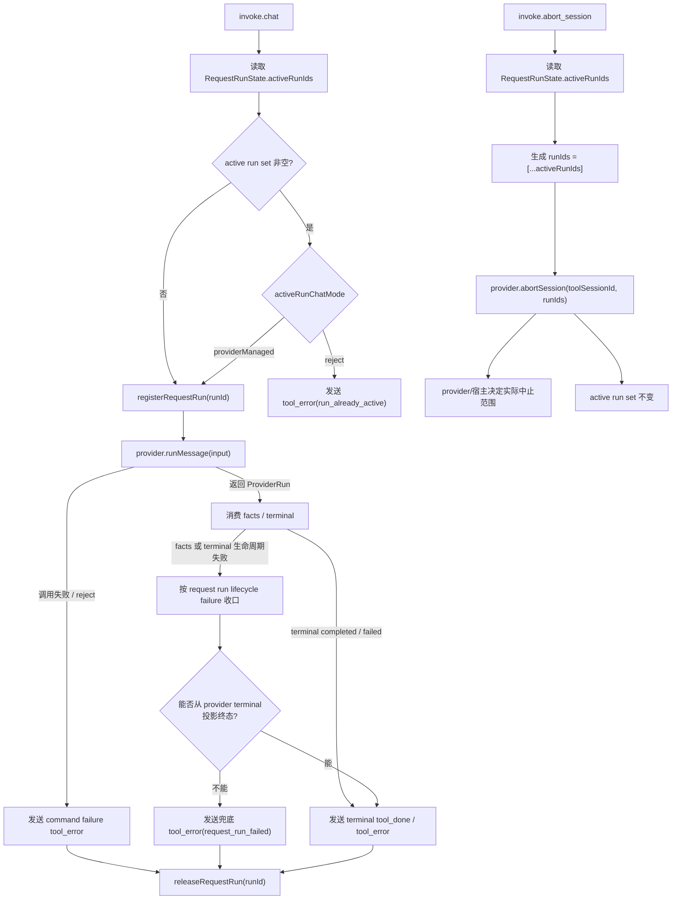

# bridge-runtime-sdk 运行中 chat 处理方案设计

- 方案日期：`2026-07-06`
- 目标工程：`packages/bridge-runtime-sdk`
- 参考文档：`docs/template/design_template.md`、`packages/bridge-runtime-sdk/docs/architecture/bridge-runtime-sdk-architecture.md`
- 方案类型：`SDK runtime 行为变更设计`

## 1. 背景

本方案解决 AI chat 会话在生成中继续接收用户输入的问题，并定义 SDK 与宿主之间的调度责任边界。

### 1.1 场景说明

AI chat 的交互不总是“一问一答完全结束后再开始下一问”。真实产品需要支持以下能力：

1. 用户可以在同一会话连续发送多条消息，不必等待上一轮完全结束。
2. 用户可以在 agent 生成中补充上下文、纠偏，或要求“停止并换方向”。
3. OpenCode、OpenClaw 等宿主可以复用自己的队列、打断、合并、取消前序 run 能力。
4. gateway 和前端仍要消费可理解、可展示的消息流。

当前 SDK 在同一 `toolSessionId` 存在 active request run 时，会直接拒绝新的 `invoke.chat`，并返回 `run_already_active`。该行为保护了默认输出安全，但也把业务调度决策提前固定成“拒绝”，导致连续输入和运行中纠偏无法到达宿主。

### 1.2 需求目标

本节只描述业务目标。SDK 不直接实现队列、打断、合并或取消策略，只提供让宿主实现这些体验所需的运行时能力。

1. `G1 支持宿主实现连续输入`：SDK 提供能力，让同会话后续消息在上一轮未结束时仍可到达宿主，而不是被 SDK busy 固定拦截。
2. `G2 支持宿主实现运行中纠偏`：SDK 提供能力，让纠偏、补充上下文、停止并换方向等输入能在生成期间进入宿主调度。
3. `G3 支持宿主自治调度`：SDK 不抢先决定队列、打断、合并或取消前序 run，由宿主根据自身能力处理。
4. `G4 明确下游可消费责任`：方案必须说明由谁负责避免不可消费的同会话输出交错，避免把输出顺序保证隐式压给 gateway 或前端。

### 1.3 非目标

1. 不提供 SDK 侧同会话输出事件串行保证；开启方必须确认 provider/宿主能保证多个 run 存在时的输出可消费性。
2. 不新增对外接口 `continueRun`。
3. 不修改 SDK 与 gateway 的上下行消息协议。

### 1.4 方案结论与候选方案

默认兼容策略：`reject`

- 含义：同一 `toolSessionId` 存在 active run 时，SDK 拒绝新 chat，并返回 `run_already_active`。
- 作用：保留旧行为，保护未确认 provider 并发能力的接入方。
- 定位：默认策略，不是解决新业务诉求的候选方案。

两个可选方案都允许 active run 期间的新 chat 立即到达 provider。二者主要差别不在输入侧，而在输出侧：SDK 是否负责把同一 `toolSessionId` 下不同 run 的输出按 run 启动顺序发送给 gateway。

候选方案 A：`providerManaged`

- 含义：同一 `toolSessionId` 存在 active run 时，SDK 仍立即调用 `provider.runMessage(input)`，并直接发送 provider 产出的 facts/terminal。
- 优点：输入实时到达宿主，支持宿主队列、打断、合并、取消前序 run。
- 缺点：SDK 不缓存、不重排；如果 provider 让 `run-2` 输出早于 `run-1 terminal`，gateway 也会看到这个顺序。
- 取舍：选择输入实时性和宿主自治，SDK 不承担跨 run 输出排序。

候选方案 B：`serializedOutput`

- 含义：SDK 立即调用 provider，但缓存后续 run 输出，按 run 启动顺序释放给 gateway。
- 优点：同时让输入到达宿主，并强保证 gateway 侧同会话跨 run 输出不交错。
- 缺点：需要缓存后续 run 的 facts/terminal、背压、溢出失败策略和终态排序；纠偏结果可能延迟展示。
- 取舍：选择 gateway 可消费顺序强保证，接受 SDK 输出调度复杂度和展示延迟。

`serializedOutput` 的顺序强保证定义为：同一 `toolSessionId` 下，后启动 run 的所有 gateway-visible 输出都不得早于前序 run terminal 对 gateway 可见。

结论：
1. 第一阶段采用 `providerManaged`，继续保留 `reject` 作为默认兼容策略。
2. 第一阶段不实现 SDK 侧 run 输出缓存队列；开启 `providerManaged` 的宿主必须保证同一 `toolSessionId` 下多 active run 的输出对 gateway/前端可消费。
3. 本阶段优先解决 SDK 前置 busy 拦截导致输入无法到达宿主的问题；输出串行强保证留给 `serializedOutput` 后续方案。
4. 第一阶段 public API 只暴露 `'reject' | 'providerManaged'`。


#### 输出排序差异示例





排序差异说明：

1. 方案 A 的 gateway 可见顺序等于 provider 实际产出顺序，SDK 不做跨 run 排序。
2. 方案 A 图是风险边界示例，不代表推荐 provider 行为；开启方应避免让 gateway 看到不可消费的输出顺序。
3. 方案 B 的 gateway 可见顺序由 SDK 按 run 启动顺序控制，代价是缓存、背压和展示延迟。


## 2. 架构设计

本方案不新增部署拓扑，也不重建 SDK 架构。第 2 章只说明 active run chat 策略下 gateway/前端、SDK、provider/宿主的责任边界，以及 SDK 内部需要调整的组件关系。

### 2.1 责任边界



| 对象 | 负责 | 不负责 |
|---|---|---|
| SDK | active run 策略判断、`runId` 注册与释放、provider fact 校验与投影、terminal 收口、diagnostics | 宿主队列/打断/合并策略；`providerManaged` 下跨 run 输出排序 |
| provider/宿主 | 运行中输入调度、队列/打断/合并/取消、同会话输出可消费性 | gateway 协议字段扩展；SDK diagnostics 存储 |
| gateway/前端 | 发送 `invoke.chat` / `invoke.abort_session`，消费 SDK 发送的 uplink | 对同会话多 run 输出重排；推断缺失的 run 归属 |

边界说明：

1. SDK 负责让新 chat 可按 policy 到达 provider，并维护自身 request run 状态一致性。
2. `providerManaged` 下，provider/宿主负责确保 gateway/前端看到的输出可消费。
3. gateway/前端不承担 run 输出重排职责，本方案也不扩展 gateway 下行 `runId`。

### 2.2 SDK 内部架构职责

本节说明本方案落在 SDK 既有架构中的位置。这里描述的是稳定架构职责，不描述具体代码修改；详细流程和实现落点放在第 3 章。



| 架构角色 | 整体职责 | 本方案落点 |
|---|---|---|
| `RuntimeCommand` | 表达 gateway 下行命令 | `invoke.chat` 和 `invoke.abort_session` 仍进入既有 command/usecase 链路 |
| `StartRequestRunUseCase` | 编排 start request run 用例，包括校验、运行时状态协调、provider 调用和失败收口 | active run 存在时的 `reject` / `providerManaged` 策略判断发生在该用例内 |
| `AbortExecutionUseCase` | 编排 abort execution 用例，包括查询运行时状态、调用 provider abort、清理相关 SDK 状态 | abort 的 `runIds` 由该用例基于 `SessionRuntimeRegistry.requestRun` 当前 active run set 生成 |
| `SessionRuntimeRegistry` | 维护 SDK 本地运行时协调状态，不代表宿主真实 session/run 生命周期 | request run 占用状态从单 active run 语义扩展为 active run set |
| `ThirdPartyAgentProvider` | SDK 调用宿主能力的边界入口 | 继续使用现有 run/abort 能力，不新增 `continueRun` |
| `GatewayOutboundSink` | SDK 向 gateway 发送 uplink 的统一出口 | 继续发送 fact/terminal 投影结果，不承担跨 run 输出排序 |
| `RuntimeObservation` | 发布运行时观测事件，供 diagnostics/logger 消费 | 增加并发 request run 相关观测，不参与控制流 |

## 3. 详细设计

### 3.1 主流程时序

本节说明下行 `invoke.chat` 如何在 SDK、`SessionRuntimeRegistry.requestRun`、provider 之间流转，不描述 request run 状态子模型内部状态机。



关键运行时规则：

1. `reject`：同一 `toolSessionId` 已有 active run 时，SDK 不调用 provider，直接返回 `run_already_active`；原 active run 不受影响。
2. `providerManaged`：同一 `toolSessionId` 已有 active run 时，SDK 仍注册新 `runId` 并调用 `provider.runMessage(input)`；各 run 后续按自己的 `runId` 独立 settle。
3. `providerManaged` 只改变“新 chat 是否能到达 provider”，不改变 SDK fact 投影主链路。
4. SDK 只维护 run 注册、释放和 terminal 收口一致性；不实现跨 run 输出排序。

### 3.2 `abort_session` 流程

`abort_session` 根据 `SessionRuntimeRegistry.requestRun` 中同一 `toolSessionId` 下的 active run set 生成 `runIds`，并调用 provider abort。`runIds` 只表达 SDK 当前观察到的 active request run，不代表宿主真实 run 队列全集；provider/宿主仍负责解释 abort 范围和实际中止策略。



| active run 数量 | SDK 处理 | 语义 |
|---|---|---|
| 0 | 调用 provider abort，传 `runIds: []` | provider 可按会话级 abort 处理 |
| 1 | 调用 provider abort，传 `runIds: [runId]` | `runIds` 表达 SDK 当前唯一 active request run |
| 多个 | 调用 provider abort，传全部 active `runIds` | provider/宿主根据自身调度语义决定中止全部、当前、队列或其他范围 |

`runIds` 是 SDK 到 provider 的 abort contract，不是 gateway 下行字段，也不扩展 gateway 协议。非 abort 链路中的 request run、fact、terminal、observation 仍继续使用单个 `runId` 标识具体 run。

### 3.3 request run 状态模型

`SessionRuntimeRegistry.requestRun` 的核心状态应建模为 active run id 集合，而不是继续使用 `{ status: 'idle' } | { status: 'running'; runId: string }` 这种单 active run union。该子模型只表达 SDK 本地 request run 协调状态，不代表宿主真实 run 队列。

`idle`、`single_active`、`multi_active` 只作为文档中的派生判断，方便描述策略分支和测试断言，不要求成为代码中的显式状态枚举。

| 派生判断 | 条件 | 含义 | 主要用途 |
|---|---|---|---|
| 无 active run | `activeRunIds.size === 0` | 当前 `toolSessionId` 在 `SessionRuntimeRegistry.requestRun` 中没有 active request run | `reject` 下允许新 chat；`abort_session` 生成 `runIds: []` |
| 单 active run | `activeRunIds.size === 1` | 当前 `toolSessionId` 只有一个 active request run | `reject` 下拒绝新 chat；`providerManaged` 下可追加新 run；`abort_session` 生成 `runIds: [runId]` |
| 多 active run | `activeRunIds.size > 1` | 当前 `toolSessionId` 有多个 active request run | `reject` 下拒绝新 chat；`providerManaged` 下继续由宿主调度；`abort_session` 生成全部 active `runIds` |

实现层可用 `Set<string>` 或等价集合结构维护 active run ids；对外查询应返回只读数组或快照，避免调用方直接修改内部集合。每个 run settle 后只删除自己的 `runId`：如果集合仍非空，其他 active run 不受影响；如果集合为空，则表示当前 `toolSessionId` 已无 active request run。

`SessionRuntimeRegistry` 的 request run port 建议调整为集合语义：

```ts
export interface RequestRunState {
  /**
   * 当前 toolSessionId 下 SDK 本地仍未 settle 的 request run id 快照。
   * @remarks 返回值必须是只读快照，不允许调用方修改 registry 内部集合。
   */
  activeRunIds: readonly string[];
}

export interface SessionRuntimeRegistry {
  /**
   * 确保 toolSessionId 对应的 SDK 本地 runtime record 存在。
   * @remarks 只创建或补全 SDK 本地协调状态，不代表宿主真实 session 已创建。
   */
  ensure(input: { toolSessionId: string; welinkSessionId?: string }): SessionRuntimeRecord;

  /**
   * 读取 SDK 本地 runtime record。
   */
  get(toolSessionId: string): SessionRuntimeRecord | undefined;

  /**
   * 删除 SDK 本地 runtime record。
   * @remarks 只清理 SDK 本地缓存，不代表删除宿主 session。
   */
  delete(toolSessionId: string): void;

  /**
   * 注册一个 request run 到 active run set。
   * @remarks 只负责记录 runId，不判断并发是否允许；active run policy 由 StartRequestRunUseCase 决定。
   */
  registerRequestRun(toolSessionId: string, runId: string): RequestRunState;

  /**
   * 从 active run set 释放指定 runId。
   * @remarks 只删除匹配 runId；其他 active run 不受影响。重复释放或未知 runId 应保持幂等。
   */
  releaseRequestRun(toolSessionId: string, runId: string): RequestRunState;

  /**
   * 返回 request run 状态快照。
   * @remarks activeRunIds 用于 start_request_run、abort_execution 和 diagnostics 派生决策。
   */
  getRequestRunState(toolSessionId: string): RequestRunState;

  /**
   * 判断当前 toolSessionId 是否存在 active request run。
   * @remarks 这是 activeRunIds.length > 0 的便捷查询，不承载 reject/providerManaged 策略。
   */
  hasActiveRequestRun(toolSessionId: string): boolean;

  /**
   * outbound emission 仍保持单占用语义。
   */
  acquireOutboundEmission(toolSessionId: string, messageId: string): { ok: true; record: SessionRuntimeRecord } | { ok: false };

  /**
   * 释放指定 outbound emission。
   */
  releaseOutboundEmission(toolSessionId: string, messageId: string): void;

  /**
   * 返回 outbound emission 状态。
   */
  getOutboundEmissionState(toolSessionId: string): OutboundEmissionState;
}
```

`registerRequestRun` 只负责把 `runId` 加入 active run set，不负责判断是否允许并发 run。是否在集合非空时拒绝新 chat，由 `StartRequestRunUseCase` 根据 `activeRunChatMode` 决定。`hasActiveRequestRun` 可以作为公共便捷查询保留，但它只等价于 `activeRunIds.length > 0`，不等价于“是否允许启动新 run”。现有 `acquireRequestRun(...): { ok: false }` 和 `getActiveRequestRunId(...)` 是单 active run 语义，应被集合 API 替代。

### 3.4 request run 生命周期与边界



生命周期规则：

**新 chat：无 active run**

- 触发：`activeRunIds.length === 0`。
- SDK：注册新 `runId`，调用 `provider.runMessage(input)`。
- 下游：按 provider facts/terminal 正常投影。
- 状态：run settle 后释放对应 `runId`。

**新 chat：有 active run + `reject`**

- 触发：`activeRunIds.length > 0` 且 `activeRunChatMode = reject`。
- SDK：不注册新 run，不调用 provider。
- 下游：发送 `tool_error(run_already_active)`。
- 状态：原 active run set 不变。

**新 chat：有 active run + `providerManaged`**

- 触发：`activeRunIds.length > 0` 且 `activeRunChatMode = providerManaged`。
- SDK：注册新 `runId`，调用 provider，记录 `concurrent_request_runs_detected`。
- 下游：按 provider 输出直接投影，SDK 不做跨 run 排序。
- 状态：每个 run settle 后只释放自己的 `runId`。

**`provider.runMessage` 调用失败**

- 触发：`provider.runMessage(input)` 抛错或 reject，且尚未返回 `ProviderRun`。
- SDK：按 chat command failure 收口。
- 下游：发送 `tool_error`。
- 状态：释放本次新 `runId`，旧 run 不受影响。

**`ProviderRun` terminal failed result**

- 触发：`ProviderRun` 已返回，`run.result()` 正常返回 failed outcome。
- SDK：通过 terminal projector 投影 provider terminal result。
- 下游：发送 terminal `tool_error`，错误文案来自 provider terminal result。
- 状态：释放对应 `runId`，其他 active run 不受影响。

**`ProviderRun` 生命周期异常**

- 触发：`ProviderRun` 已返回，但 facts 消费、fact sequence 校验、pending interaction 协调或 terminal promise 出错。
- SDK：如果无法从 provider terminal result 生成终态 uplink，则发送兜底 `tool_error(request_run_failed)`。
- 下游：看到 SDK 兜底 `tool_error(request_run_failed)`；同一个 run 不应重复发送多个 terminal。
- 状态：释放对应 `runId`，其他 active run 不受影响。

**任一 run settle**

- 触发：任一 active run 完成、失败或被生命周期失败路径收口。
- SDK：只释放对应 `runId`。
- 下游：不因其他 active run 存在而延迟当前 run terminal。
- 状态：active run set 可能仍非空；最后一个 run 释放后 active run set 为空。

**`abort_session`**

- 触发：收到 `invoke.abort_session`。
- SDK：读取 `RequestRunState.activeRunIds`，生成必填 `runIds`，调用 `provider.abortSession(toolSessionId, runIds)`。
- 下游：不由 SDK 直接投影 run terminal；实际中止范围和后续输出由 provider/宿主决定。
- 状态：SDK 不因 abort 直接释放 active run set，仍等待 run settle/failure 路径释放。

`activeRunChatMode` 在 runtime 创建时从 `BridgeRuntimeOptions.requestRunPolicy` 归一化；未配置时固定按 `reject` 处理。`activeRunsByToolSessionId` 是 `SessionRuntimeRegistry.requestRun` 的内部实现数据，只表达 SDK 本地 active request run 集合，不代表宿主真实 run 队列。

### 3.5 接口定义

在 `BridgeRuntimeOptions` 增加可选的 `requestRunPolicy` 配置。该配置是 public option，由宿主插件或 provider adapter 装配方在调用 `createBridgeRuntime(options)` 时传入。

```ts
export type ActiveRunChatMode = 'reject' | 'providerManaged';

export interface RequestRunPolicyOptions {
  activeRunChatMode?: ActiveRunChatMode;
}

export interface BridgeRuntimeOptions {
  provider: ThirdPartyAgentProvider;
  gatewayHost: BridgeGatewayHostConfig;
  logger?: BridgeGatewayLogger;
  debug?: boolean;
  traceIdFactory?: () => string;
  onTelemetryUpdated?: () => void;
  requestRunPolicy?: RequestRunPolicyOptions;
}
```

provider abort 入参同步调整为：

```ts
export interface ProviderAbortSessionInput {
  traceId: string;
  toolSessionId: string;
  runIds: string[];
}
```

| 名称 | 类型 | 说明 |
|---|---|---|
| `requestRunPolicy` | `RequestRunPolicyOptions` | `BridgeRuntimeOptions` 顶层可选字段，用于配置 request run 策略 |
| `requestRunPolicy.activeRunChatMode` | `ActiveRunChatMode` | active run 存在时新 chat 的处理策略 |
| `'reject'` | `ActiveRunChatMode` | 默认兼容策略，保持旧行为，active run 存在时返回 `run_already_active` |
| `'providerManaged'` | `ActiveRunChatMode` | 显式开启，active run 存在时仍调用 `provider.runMessage(input)` |
| `ProviderAbortSessionInput.runIds` | `string[]` | 必填字段，表达 SDK 当前 active request run 集合；无 active run 时传空数组 |

默认与校验规则：

1. 未传 `requestRunPolicy` 时按 `'reject'` 处理。
2. 未传 `requestRunPolicy.activeRunChatMode` 时按 `'reject'` 处理。
3. 非法配置值不能静默降级，应由类型、配置解析或 public contract 测试拦住。
4. `ProviderAbortSessionInput` 不再暴露单个 `runId?: string`；abort 需要 run 线索时统一使用必填的 `runIds: string[]`。
5. 这是 provider contract 变更；已实现 `abortSession` 且读取 `runId` 的接入方需要迁移到 `runIds`，未读取该字段的 provider 行为不变。

示例：

```ts
const runtime = await createBridgeRuntime({
  gatewayHost,
  provider,
  requestRunPolicy: {
    activeRunChatMode: 'providerManaged',
  },
});
```

### 3.6 宿主接入策略

第一阶段不建议所有宿主统一开启 `providerManaged`。`activeRunChatMode` 应由宿主装配层按 provider adapter 的真实调度能力选择。

| 宿主 | 策略 | 选择原因 | 影响与要求 |
|---|---|---|---|
| OpenCode / `plugins/message-bridge` | 显式配置 `providerManaged` | OpenCode adapter 已有 opencode session 级 run queue、superseded run 收口和 abort 协调，能承接同会话多次 `runMessage`。 | 新 chat 可在 active run 期间进入 provider；宿主侧继续负责排队、替换、abort 和输出可消费性 |
| OpenClaw / `plugins/message-bridge-openclaw` | 保持默认 `reject`，或显式配置 `reject` | OpenClaw adapter 当前按 `sessionKey` 维护单 active run；放开并发会让新 run 覆盖旧 run 输出边界。 | 不放开 active run 期间新 chat，避免旧 run 输出归属、abort 定位和 terminal 收口被覆盖 |

OpenCode 的装配层应在调用 `createBridgeRuntime` 时显式传入：

```ts
requestRunPolicy: {
  activeRunChatMode: 'providerManaged',
}
```

OpenClaw 第一阶段不需要传 `requestRunPolicy`，依赖 SDK 默认 `reject` 即可。若为了配置可读性选择显式传入，也应使用：

```ts
requestRunPolicy: {
  activeRunChatMode: 'reject',
}
```

如果后续希望 OpenClaw 开启 `providerManaged`，需要先支持同一 `sessionKey` 下多个 active run 的输出边界，并明确 `abortSession(runIds)` 的中止范围。

选择逻辑总结：

1. `providerManaged` 是 provider adapter 能力开关，不是宿主类型开关。
2. OpenCode 已有运行中输入调度能力，适合开启。
3. OpenClaw 仍是单 active run 输出边界，第一阶段保持 `reject`。

### 3.7 实现清单

| 模块/目录/文件 | 改动类型 | 职责 | 关键说明 |
|---|---|---|---|
| `src/public-contract.ts` | 修改 | 对外配置和 provider contract | 新增 `requestRunPolicy.activeRunChatMode?: 'reject' | 'providerManaged'`；`ProviderAbortSessionInput` 使用 `runIds: string[]` |
| `src/application/create-runtime.ts` | 修改 | 默认配置归一化 | 未配置时归一化为 `reject` |
| `src/application/ports/session-runtime-registry.ts` | 修改 | registry port | `RequestRunState` 改为 active run id 集合；用 `registerRequestRun` / `getRequestRunState` / `hasActiveRequestRun` 替代单 run `acquireRequestRun` / `getActiveRequestRunId` |
| `src/infrastructure/registries/InMemorySessionRuntimeRegistry.ts` | 修改 | 内存状态实现 | per-`toolSessionId` 维护 active run set |
| `src/application/usecases/StartRequestRunUseCase.ts` | 修改 | request run 启动策略 | 根据 policy 决定 reject 或 provider managed |
| `src/application/usecases/AbortExecutionUseCase.ts` | 修改 | abort 语义 | 根据 active run set 生成 `runIds: string[]` |
| `plugins/message-bridge/src/runtime/SdkBridgeRuntime.ts` | 修改 | OpenCode 装配策略 | 显式配置 `requestRunPolicy.activeRunChatMode = 'providerManaged'` |
| `plugins/message-bridge-openclaw/src/OpenClawGatewayBridge.ts` | 不改或显式配置 | OpenClaw 装配策略 | 第一阶段保持默认 `reject`；如显式配置也只能配置为 `reject` |
| `tests/runtime-sdk.test.ts` | 修改 | runtime 行为测试 | 覆盖默认、providerManaged、多 run settle、abort |
| `tests/public-api-contract.test.ts` | 修改 | public API contract | 覆盖新增配置类型和非法配置值拒绝 |
| `plugins/message-bridge/tests/unit/*` | 修改 | OpenCode 接入测试 | 覆盖 OpenCode runtime options 显式传入 `providerManaged` |
| `plugins/message-bridge-openclaw/tests/unit/*` | 修改 | OpenClaw 接入测试 | 覆盖 OpenClaw runtime options 未开启或显式保持 `reject` |

### 3.8 未确认项

| 未确认项 | 影响范围 | 当前默认假设 | 需要谁确认 |
|---|---|---|---|
| OpenCode 输出可消费性是否满足产品验收 | `providerManaged` 接入风险 | 基于现有 host session FIFO 和 superseded run 收口能力，第一阶段建议开启 | `plugins/message-bridge` 维护者 |
| OpenClaw 何时支持多 active run | OpenClaw 后续是否能开启 `providerManaged` | 第一阶段不支持，保持 `reject` | `plugins/message-bridge-openclaw` 维护者 |

## 4. 性能

| 项目 | 是否影响 | 说明 | 风险 | 应对策略 |
|---|---|---|---|---|
| 请求数量 | 是 | `providerManaged` 下同会话 active run 期间可产生更多 provider 调用 | provider/宿主压力增加 | 仅 opt-in 开启，由接入方评估 |
| 计算开销 | 低 | active run 单值改集合，查询和释放开销与 active run 数量相关 | 同会话大量并发 run 时集合操作增加 | 预期 active run 数量较小，后续可补上限 |
| 缓存/内存 | 低 | 只保存 active run 元数据，不缓存输出 | 异常不 settle 会保留 active run | terminal/failure 路径必须覆盖释放 |
| 首屏/列表/流式体验 | 是 | 纠偏输入可更早到达宿主 | provider 输出交错会影响前端消费 | provider contract 明确输出可消费性责任 |

## 5. 功耗

| 项目 | 是否影响 | 说明 | 应对策略 |
|---|---|---|---|
| 轮询/长连接 | 否 | 不新增连接、轮询或心跳 | 沿用现有 gateway-client 连接 |
| 后台任务 | 否 | 不新增后台任务 | 无 |
| 动画/频繁刷新 | 否 | SDK 不涉及 UI 刷新 | 无 |
| 弱网/长时间运行 | 低 | 多 active run 可能延长宿主执行时间 | 由 provider/宿主处理取消、合并或排队 |

## 6. 埋码

无

## 7. 影响范围

### 7.1 直接影响

| 对象 | 影响说明 | 验证方式 |
|---|---|---|
| `BridgeRuntimeOptions` | 新增 `requestRunPolicy.activeRunChatMode` | public API contract 测试 |
| `ProviderAbortSessionInput` | abort 入参从单个 `runId?: string` 调整为 `runIds: string[]` | public API contract 测试 |
| `SessionRuntimeRegistry.requestRun` | 从单 active run 改为 active run 集合 | registry contract 和 runtime 行为测试 |
| `start_request_run` | active run 存在时按 policy 决策 | runtime-sdk 测试 |
| `abort_execution` | 根据 active run set 生成 `runIds: string[]` | abort 行为测试 |
| diagnostics/observation | 新增并发 run 诊断 | runtime-observation 或 runtime-sdk 测试 |

### 7.2 间接影响

| 对象 | 影响说明 | 风险 | 应对策略 |
|---|---|---|---|
| OpenCode provider adapter | 第一阶段建议开启 `providerManaged` | 宿主输出不可消费时影响前端 | 依赖现有 host session FIFO、superseded run 收口和 abort 能力，并补接入测试 |
| OpenClaw provider adapter | 第一阶段保持 `reject` | 若误开 `providerManaged`，同 `sessionKey` 多 run 会覆盖本地 active run 索引 | 不传 `requestRunPolicy` 或显式配置 `reject`；待 adapter 支持多 active run 后再评估开启 |
| provider `abortSession` 实现方 | 若读取过单个 `runId`，需要改为读取 `runIds` | 接口升级后 abort 范围解释不一致 | contract 测试覆盖 `runIds`；迁移文档说明 0/1/多 active run 映射 |
| gateway/前端 | 可能观察到同会话多 run 输出 | 下游无法区分交错输出 | 第一阶段默认不改变，opt-in 方承担责任 |
| SDK 文档和发布说明 | 需要说明默认行为和 opt-in 风险 | 接入方误用 | public contract 文档明确适用条件 |

### 7.3 不影响

| 对象 | 不影响说明 | 依据 |
|---|---|---|
| gateway 下行协议 | 不新增 `runId` 字段 | 约束明确不扩展协议 |
| request run / fact / terminal / observation 的 `runId` | 继续使用单个 `runId` 标识具体 run | `runIds` 只用于 provider abort input |
| `continueRun` 入口 | 不新增双入口 | 需求明确不新增 |
| SDK 输出投影主链路 | 不缓存、不串行化 provider facts | `serializedOutput` 不在第一阶段实现 |
| 默认接入方 | 未配置时仍为 `reject` | 默认值保持兼容 |

## 8. 测试范围

### 8.1 单元测试

单元测试覆盖纯逻辑、状态模型和 public contract，不依赖完整 runtime/gateway 链路。

| 测试项 | 验证点 | 输入/动作 | 预期结果 |
|---|---|---|---|
| active run set 注册 | `SessionRuntimeRegistry.requestRun` 集合模型 | 注册一个或多个 `runId` | `RequestRunState.activeRunIds` 返回只读快照，包含已注册 run |
| active run set 释放 | 状态独立约束 | 释放指定 `runId` | 只删除匹配 run；其他 active run 保留 |
| active run set 幂等释放 | 状态恢复边界 | 重复释放或释放未知 `runId` | 不抛错，active run set 保持一致 |
| `hasActiveRequestRun` | 便捷查询边界 | active run set 为空或非空 | 只反映 `activeRunIds.length > 0`，不承载 policy 判断 |
| active run chat policy | 默认兼容和显式开启 | 分别配置未传、`reject`、`providerManaged` | 未配置等同 `reject`；`providerManaged` 仅显式开启 |
| abort `runIds` 生成 | abort 语义 | active run set 为 0、1、多个 run | 分别生成 `[]`、`[runId]`、全部 active `runIds` |
| public contract 类型 | 接口定义 | 检查 `BridgeRuntimeOptions` 和 `ProviderAbortSessionInput` | `activeRunChatMode` 只允许 `'reject' | 'providerManaged'`；`runIds: string[]` 必填 |
| 非法配置拒绝 | 配置解析边界 | 尝试使用非法 `activeRunChatMode` | 类型或动态解析不接受，不能静默降级 |

### 8.2 集成测试

集成测试通过 runtime、fake gateway 和 fake provider 验证 SDK 内部链路与 gateway 可见结果。

| 测试项 | 验证点 | 输入/动作 | 预期结果 |
|---|---|---|---|
| 默认 active run 拒绝 | 默认兼容 | 未配置 policy，同一 `toolSessionId` 第二个 `chat` | 发送 `tool_error(run_already_active)`，不调用第二次 provider |
| `providerManaged` 放行第二个 chat | `G1`、`G3` | active run 未 settle 时发送第二个同会话 `chat` | 调用第二次 `provider.runMessage`，两个 run 使用不同 `runId` |
| run settle 独立释放 | 状态独立约束 | 两个 run 分别 settle | 每次只释放对应 `runId`，最后 active run set 为空 |
| `provider.runMessage` 调用失败 | 生命周期与边界 | 第二次 `provider.runMessage` 抛错或 reject | 新 run 按 chat command failure 发送 `tool_error` 并释放，旧 run 不被释放 |
| terminal failed result | 生命周期与边界 | `ProviderRun.result()` 返回 failed outcome | 发送 terminal `tool_error`，释放对应 `runId` |
| terminal promise reject | 生命周期与边界 | `ProviderRun.result()` reject | 发送兜底 `tool_error(request_run_failed)`，释放对应 `runId` |
| facts 生命周期失败 | 生命周期与边界 | facts 消费或 sequence 校验失败 | 发送兜底 `tool_error(request_run_failed)`，释放对应 `runId` |
| 多 active run abort | abort 语义 | 两个 active run 下发送 `abort_session` | provider abort 收到全部 active `runIds` |
| 单 active run abort | abort 语义 | 一个 active run 下发送 `abort_session` | provider abort 收到 `runIds: [runId]` |
| 无 active run abort | abort 语义 | 无 active run 下发送 `abort_session` | provider abort 收到 `runIds: []` |
| diagnostics 记录并发 run | 观测要求 | `providerManaged` 放行第二个 run | 记录 `concurrent_request_runs_detected`，包含 `toolSessionId`、`newRunId`、`activeRunCount` |
| gateway 协议兼容 | 协议约束 | 检查下行和上行消息结构 | 不新增 gateway 下行 `runId`，现有 uplink 结构不变 |

### 8.3 功能测试（手工验证）

功能测试面向测试人员，用已配置好的 OpenCode/OpenClaw 环境验证业务体验。这里只描述用户操作、可见结果和验收观察；接口、状态和日志字段等工程断言放在单元测试和集成测试中覆盖。

| 场景 | 操作 | 预期体验 | 观察方式 |
|---|---|---|---|
| 默认模式兼容 | 默认环境下连续发送两条消息 | 第二条提示当前会话忙或被拒绝，第一条继续完成 | 前端提示、用户可见消息流、测试记录 |
| 连续输入可达 | 支持运行中输入的环境下，第一轮生成中发送第二条消息 | 第二条被系统接收，并进入后续处理 | 前端提示、用户可见消息流、宿主运行日志 |
| 生成中纠偏 | 第一轮输出中发送“不是这个方向，改成...” | 后续输出体现纠偏结果，或系统给出明确处理结果 | 前端展示、测试记录截图或录屏 |
| OpenCode 运行中输入体验 | 在 OpenCode 环境连续输入、纠偏、停止并换方向 | 行为符合 OpenCode 产品预期，消息流可理解 | 前端展示、用户可见完成态、宿主运行日志 |
| OpenClaw 默认拒绝体验 | 在 OpenClaw 环境生成中连续发送第二条消息 | 第二条被明确拒绝，或提示稍后重试 | 前端提示、用户可见消息流 |
| 多轮输出可消费 | 支持运行中输入的环境下连续触发多轮输出 | 消息顺序、内容归属和完成态对用户可理解 | 前端展示、gateway 消息流记录 |
| 停止行为验证 | 在无生成、单轮生成、运行中连续输入场景下触发停止 | 输出停止或进入明确终态，不出现悬挂中的会话表现 | 前端完成态、宿主运行日志、测试记录 |
