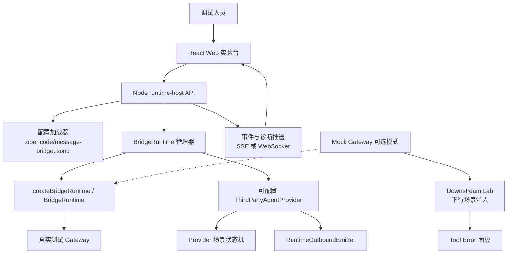
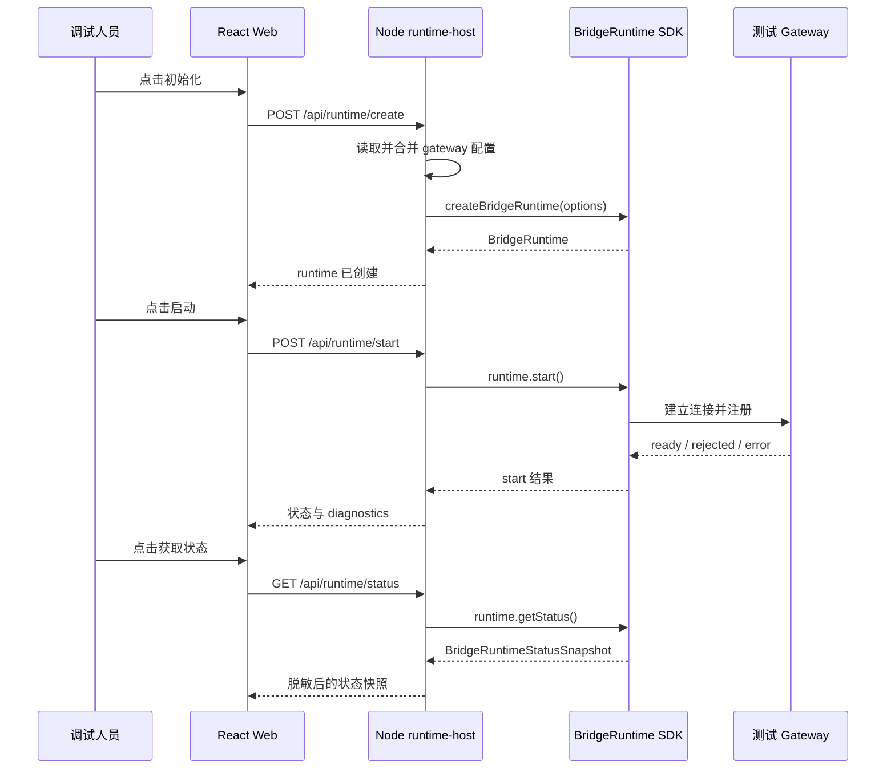
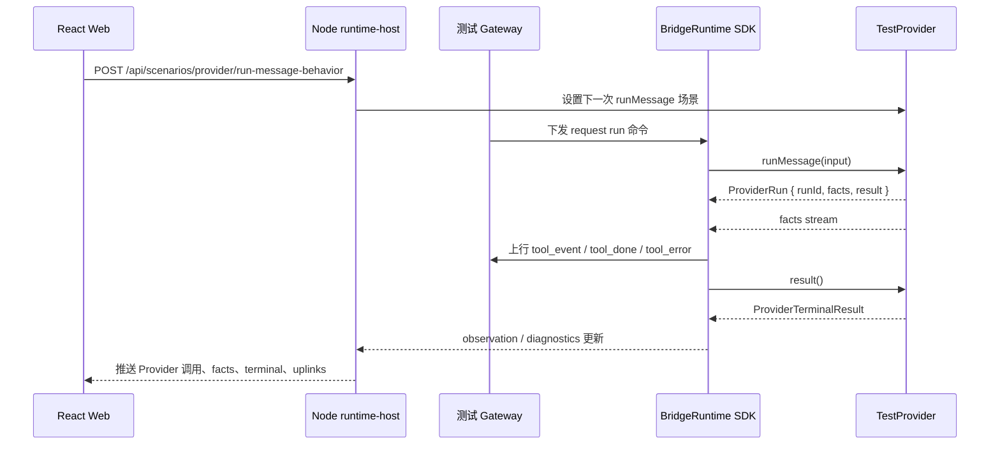
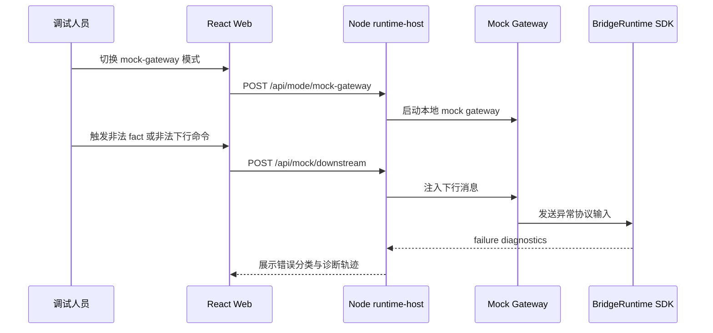
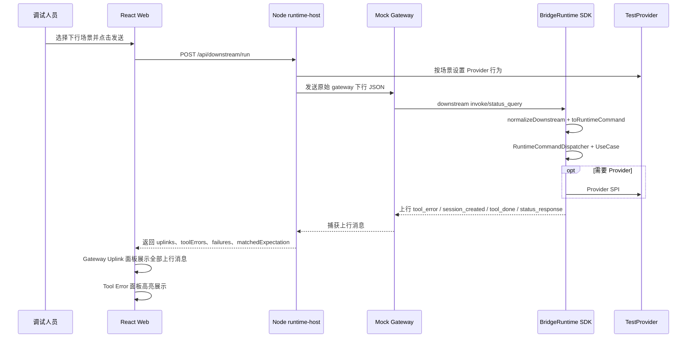

# Bridge Runtime SDK 集成验收实验台方案

- Version: 1.0
- Date: 2026-07-13
- Status: Draft
- Owner: agent-plugin maintainers
- 方案日期：2026-07-13
- 目标工程：agent-plugin / packages/bridge-runtime-sdk
- 参考文档：packages/bridge-runtime-sdk/docs/design/interface/bridge-runtime-sdk-integration.md、packages/bridge-runtime-sdk/AGENTS.md、docs/rules/engineering.md、docs/rules/testing.md、docs/rules/documentation.md、.opencode/message-bridge.jsonc
- 方案类型：SDK 集成验收工具设计

## 1. 背景

### 1.1 场景说明

`@wecode/bridge-runtime-sdk` 已对外提供 Runtime API、Provider SPI、RuntimeOutboundEmitter 和 `qrcodeAuth` 等稳定契约。当前包内已有单元测试、契约测试和 gateway runtime 测试，但缺少一个面向集成方和调试人员的交互式验收项目，用于通过界面配置 gateway、启动 SDK runtime、观察真实 gateway 下行触发 Provider SPI 的全过程，并手动构造正常、异常和边界场景。

现有 `.opencode/message-bridge.jsonc` 已提供可用测试 gateway 配置。实验台应默认读取该文件中的 `gateway.url`、`gateway.channel`、`auth.ak`、`auth.sk`，以真实 gateway 联调为主；同时保留 mock gateway 模式，用于离线回归和构造真实环境难以稳定复现的异常协议场景。第二阶段需要补齐 gateway 下行链路验证：原始下行数据进入 gateway-client / gateway-schema 后，应完整经过 normalize、runtime command 转换、dispatcher、usecase、Provider Adapter，并在失败时捕获 SDK 上行 `tool_error`。

### 1.2 需求目标

1. 在仓库根目录新增一个 SDK 集成验收实验台目录，包含 Node runtime-host 和 React web 前端。
2. Node runtime-host 负责读取 gateway 配置、创建并持有 `BridgeRuntime` 实例、实现可配置 `ThirdPartyAgentProvider`、暴露前端控制接口，并向前端推送 runtime 状态、diagnostics 和 Provider 调用轨迹。
3. React web 前端负责展示 gateway 配置、触发 Runtime API 操作、配置 Provider 场景行为、查看事件流和测试结果。
4. 默认连接 `.opencode/message-bridge.jsonc` 指向的测试 gateway，验证 SDK 与真实 gateway 的连接、注册、下行命令、Provider 调用、上行消息和 diagnostics。
5. 覆盖 Runtime API、Provider SPI、RuntimeOutboundEmitter、`qrcodeAuth` 的正常、异常和边界场景。
6. 对 `ak`、`sk`、token、authorization、content、text、answers 等敏感字段进行脱敏，避免在前端、日志、报告和 diagnostics 展示中泄漏。
7. 增加 Downstream Lab，验证 gateway 下行原始消息到 RuntimeCommand、UseCase、Provider 调用和上行消息的完整链路。
8. 前端必须显式展示 SDK 上行 `tool_error` 信息，并区分“预期产生 tool_error”“预期只记录 failure 不回包”“未按预期产生 tool_error”三类结果。
9. 前端必须显式展示所有符合 gateway 上行契约的 uplink 消息。即使没有触发 `tool_error`，也应能看到正常上行的 `session_created`、`status_response`、`slash_commands_result`、`tool_event`、`tool_done` 等；即使触发了 `tool_error`，也应在 uplink 面板中保留该上行消息原文。

### 1.3 非目标

1. 不修改 `@wecode/bridge-runtime-sdk` 的 public contract。
2. 不替代包内契约测试、单元测试和 CI 验证；实验台用于集成验收、调试和手动回归补充。
3. 不把测试 gateway 的密钥原文固化到文档、前端本地存储、导出报告或提交记录。
4. 不在实验台内实现 OpenCode、OpenClaw 的真实宿主业务逻辑；Provider 只提供可配置测试替身。
5. 不修改 `integration/` 外部夹具或 submodule 指针。

## 2. 方案图

### 2.1 整体方案图

### 2.2 方案核心

实验台采用“真实 gateway 驱动 + 可配置 Provider 替身 + 前端可视化控制”的方式：前端直接触发 Runtime facade 操作，真实 gateway 下行命令触发 Provider SPI，Node 端统一记录并推送状态、事件和 diagnostics；mock gateway 仅作为离线异常场景和自动化回归的补充。

## 3. 时序图

### 3.1 `真实 gateway 启动与状态查询`

### 3.2 `真实 gateway 下行触发 Provider runMessage`

### 3.3 `mock gateway 异常协议场景`

### 3.4 `Downstream Lab 捕获 tool_error`

## 4. 技术细节

### 4.1 调整点

1. 新增根目录实验台工程，建议路径为 `examples/bridge-runtime-sdk-lab/`。
2. 在实验台下拆分 `apps/runtime-host`、`apps/web`、`packages/shared`，保持 Node 服务、前端和共享类型边界清晰。
3. 更新 `pnpm-workspace.yaml`，将 `examples/bridge-runtime-sdk-lab/apps/*` 和 `examples/bridge-runtime-sdk-lab/packages/*` 纳入 workspace，使实验台直接依赖本仓 `@wecode/bridge-runtime-sdk`。
4. Node runtime-host 默认读取 `.opencode/message-bridge.jsonc`，并允许前端临时覆盖 `url`、`channel`、`toolVersion`、`pluginVersion` 等非敏感字段。
5. 前端提供 Runtime 操作区、Provider 场景区、Outbound 区、二维码授权区、事件流和 diagnostics 面板。
6. 增加安全脱敏边界，避免鉴权、用户输入和答案内容进入非受控日志、前端缓存和测试报告。

### 4.2 核心实现方式

Node runtime-host 作为 SDK 唯一持有方，提供以下内部模块：

1. `ConfigLoader`：读取 `.opencode/message-bridge.jsonc`，解析 JSONC，生成 `BridgeGatewayHostConfig`。配置映射关系为 `gateway.url -> gatewayHost.url`、`gateway.channel -> gatewayHost.register.channel`、`auth.ak -> gatewayHost.auth.ak`、`auth.sk -> gatewayHost.auth.sk`。
2. `RuntimeManager`：负责 `createBridgeRuntime`、`start`、`stop`、`probe`、`getStatus`、`getDiagnostics`，并管理“当前仅一个 runtime 实例”的生命周期约束。
3. `TestProvider`：实现完整 `ThirdPartyAgentProvider`，每个 SPI 方法都可配置成功、失败、超时、非法返回和慢响应行为。
4. `ScenarioRegistry`：保存前端设置的下一次 Provider 行为、fact 流模板、terminal 结果、pending question/permission 状态和 outbound 输入。
5. `EventStore`：记录 runtime 操作、providerCalls、facts、uplinks、terminals、interactions、failures，并对外提供快照和实时推送。
6. `GatewayModeController`：默认使用真实 gateway；当切换为 mock 模式时启动本地 mock gateway，并将 runtime 的 `gatewayHost.url` 指向 mock 地址。
7. `LabMockGateway`：本地 WebSocket gateway，接收 SDK register 后返回 `register_ok`，向 SDK 注入原始下行 JSON，并捕获 SDK 上行消息。
8. `DownstreamScenarioRunner`：执行下行场景，设置 Provider 行为，发送 raw downstream，收集 uplinks、toolErrors、failures，并判断是否符合预期。

React web 只与 runtime-host 通信，不直接导入 SDK。页面建议分为：

1. 配置区：展示配置来源、gateway url、channel、toolVersion、pluginVersion、auth 加载状态。`ak/sk` 默认脱敏，不进入 localStorage。
2. Runtime 区：初始化、启动、停止、探测、获取状态、获取 diagnostics。
3. Provider 场景区：配置 `health`、`createSession`、`listSlashCommands`、`runMessage`、`replyQuestion`、`replyPermission`、`closeSession`、`abortSession`、`dispose` 行为。
4. Outbound 区：触发 `emitOutboundRun` 和 deprecated `emitOutboundMessage` 兼容验证。
5. qrcodeAuth 区：独立运行 `qrcodeAuth.run`，展示 `qrcode_generated`、`scanned`、`expired`、`cancelled`、`confirmed`、`failed` 快照。
6. 结果区：展示请求、响应、状态、diagnostics、事件时间线和错误详情。
7. Downstream Lab：展示下行场景列表、原始 payload、预期结果、上行消息和 Tool Error 面板。

#### Downstream Lab 场景矩阵

| 场景 | 下行输入 | 预期 |
|---|---|---|
| `status_query` 正常 | `{ type: 'status_query' }` | 上行 `status_response` |
| `create_session` 正常 | `invoke/create_session` + `welinkSessionId` | 上行 `session_created` |
| `create_session` 缺少 `welinkSessionId` | `invoke/create_session` 无路由目标 | 只记录 failure，不回 `tool_error` |
| `create_session` Provider 抛错 | 合法下行 + Provider `createSession` 抛错 | 上行 `tool_error` |
| `chat` 正常 | `invoke/chat` + `toolSessionId` + `text` | 上行 `tool_event` / `tool_done` |
| `chat` 缺少 `text` | `payload.toolSessionId` 存在但 `text` 缺失 | 上行 `tool_error: gateway_invalid_invoke:<code>` |
| `chat` 空文本 | `payload.text` 为空字符串 | 上行 `tool_error: gateway_invalid_invoke:<code>` |
| `chat` Provider 抛错 | 合法下行 + Provider `runMessage` 抛错 | 上行 `tool_error` |
| `question_reply` pending 不存在 | 合法 `question_reply`，但 registry 无 pending question | 上行 `tool_error: 当前交互已失效，请刷新后重试` |
| `question_reply` answers 非 `string[][]` | 非法 answers | 上行 `tool_error: gateway_invalid_invoke:<code>` |
| `permission_reply` pending 不存在 | 合法 `permission_reply`，但 registry 无 pending permission | 上行 `tool_error: 当前交互已失效，请刷新后重试` |
| `permission_reply` response 非法 | response 不属于 `once/always/reject` | 上行 `tool_error: gateway_invalid_invoke:<code>` |
| `close_session` 缺少 `toolSessionId` | payload 缺少 `toolSessionId` | 上行 `tool_error: gateway_invalid_invoke:<code>` |
| `abort_session` 缺少 `toolSessionId` | payload 缺少 `toolSessionId` | 上行 `tool_error: gateway_invalid_invoke:<code>` |
| `query_slash_commands` Provider 抛错 | 合法下行 + Provider `listSlashCommands` 抛错 | 上行空 `slash_commands_result`，不回 `tool_error` |
| `query_slash_commands` 缺少 `traceId` | payload 合法但顶层缺少 `traceId` | 上行 `tool_error: gateway_invalid_invoke:<code>` |
| `extParameters.platformExtParam` 非 JSON object | `platformExtParam` 为数组等非法值 | 上行 `tool_error: gateway_invalid_invoke:<code>` |
| 非法 invoke 无路由目标 | 没有 `welinkSessionId` 和 `toolSessionId` | 只记录 failure，不回 `tool_error` |

#### Tool Error 面板

前端必须把 `tool_error` 作为独立结果展示，而不是只混入事件流。面板展示字段：

1. `error`：最醒目的主错误信息。
2. `toolSessionId` / `welinkSessionId`：回包路由目标。
3. `reason`：如果上行消息存在该字段则展示。
4. `stage`：`inbound_validation`、`command_execution`、`interaction_resolution`、`provider_call` 或 `success`。
5. 原始下行 payload、捕获到的 uplinks、关联 diagnostics failures。
6. `matchedExpectation`：本次结果是否符合场景预期。

当预期为 `failure_only` 且没有 `tool_error` 时，前端显示“无 tool_error，符合预期：该场景只记录 failure，不具备可回包路由目标”。当预期应产生 `tool_error` 但未捕获时，前端显示“未捕获到 tool_error：请确认 mock gateway 已连接且下行消息具备可回包路由目标”。

#### Gateway Uplink 面板

前端还必须把 SDK 发往 gateway 的所有符合上行契约消息作为独立面板展示。该面板与 Tool Error 面板并列，避免用户只能看到错误而看不到正常上行。

展示要求：

1. 按捕获顺序展示 uplink 列表，每条显示 `type`、路由字段和原始 JSON。
2. `tool_error` 也保留在 uplink 列表中，同时在 Tool Error 面板中高亮。
3. 正常场景必须能看到预期上行，例如：
   - `status_query` -> `status_response`
   - `create_session` -> `session_created`
   - `query_slash_commands` -> `slash_commands_result`
   - `chat` -> `tool_event` / `tool_done`
4. 如果场景预期是正常上行但未捕获任何 uplink，面板显示“未捕获到上行消息”，并提示检查 mock gateway 连接、runtime ready 状态和 Provider 场景配置。
5. 如果场景预期是 `failure_only` 且没有 uplink，面板显示“无上行消息，符合预期”。

### 4.3 兼容与边界

1. 实验台不新增 SDK public API，只消费 `src/index.ts` 已导出的稳定能力。
2. Provider SPI 的真实验证依赖 gateway 下行命令触发；前端按钮不直接调用 Provider 方法，只设置 Provider 的下一次响应行为或展示已发生调用。
3. 若测试 gateway 不提供下行命令注入能力，真实模式下 Provider API 的覆盖以实际 gateway 触发能力为准；缺失场景通过 mock gateway 补齐。
4. `emitOutboundMessage` 已标记 deprecated，但实验台保留兼容按钮，用于验证旧接入仍可工作。
5. `qrcodeAuth.run` 不依赖 `createBridgeRuntime`，在前端中作为独立测试区展示。
6. `toolVersion` 默认可使用实验台自身版本或固定测试值；`pluginVersion` 可为空或使用实验台版本。
7. 停止 runtime 后不得继续复用旧 `ProviderRuntimeContext`、旧 outbound emitter 或旧 pending interaction。
8. Downstream Lab 只在 mock gateway 模式下启用；真实 gateway 模式不构造非法下行，避免污染共享测试环境。
9. 对于没有 `welinkSessionId` 或 `toolSessionId` 的非法 invoke，SDK 可能无法构造可路由 `tool_error`，实验台应标记为 `failure_only`。

### 4.4 相关接口联动

1. Runtime API：`createBridgeRuntime`、`BridgeRuntime.start`、`BridgeRuntime.stop`、`BridgeRuntime.probe`、`BridgeRuntime.getStatus`、`BridgeRuntime.getDiagnostics`。
2. Provider SPI：`initialize`、`health`、`createSession`、`listSlashCommands`、`runMessage`、`replyQuestion`、`replyPermission`、`closeSession`、`abortSession`、`dispose`。
3. RuntimeOutboundEmitter：`emitOutboundRun`、`emitOutboundMessage`。
4. Provider facts：`message.start`、`text.delta`、`text.done`、`thinking.delta`、`thinking.done`、`tool.update`、`question.ask`、`permission.ask`、`permission.reply`、`message.done`、`session.title`、`session.error`。
5. 二维码授权：`qrcodeAuth.run` 及 `QrCodeAuthSnapshot` 各状态。
6. 诊断与错误：`BridgeRuntimeStatusSnapshot`、`RuntimeDiagnostics`、`RuntimeTraceFailure`、`BridgeRuntimeErrorCode`。
7. 下行链路：gateway-client `GatewayInboundFrame`、gateway-schema `normalizeDownstream`、`GatewayDownstreamCommandAdapter.toRuntimeCommand`、`RuntimeCommandDispatcher.dispatch`、各 `UseCase.execute`。
8. 上行错误：`tool_error`、`CommandFailureToolErrorProjector`、`GatewayInboundPolicy` invalid invoke fail-closed 策略。

### 4.5 文档需要同步修改的内容

1. 新增本方案文档：`packages/bridge-runtime-sdk/docs/design/bridge-runtime-sdk-lab-design.md`。
2. 实施后新增实验台 README：`examples/bridge-runtime-sdk-lab/README.md`，说明启动命令、配置来源、安全注意事项和验收流程。
3. 如实验台成为长期推荐调试入口，可在 `packages/bridge-runtime-sdk/docs/design/interface/bridge-runtime-sdk-integration.md` 增加“本仓集成验收实验台”引用。
4. 如后续新增 public API 或调整契约，需同步更新接口文档和实验台覆盖矩阵。

## 5. 性能

实验台会新增一个 Node 服务和一个 React dev server，仅在本地调试时运行，不影响 SDK 生产运行时性能。真实 gateway 模式会建立一条 SDK runtime 主连接；mock 模式会额外启动本地 mock gateway。前端事件流建议使用 SSE 或 WebSocket 推送，事件存储设置最大保留条数，避免长时间调试导致内存无限增长。

## 6. 功耗

实验台为本地开发和验收工具，不涉及移动端功耗。运行时存在 gateway 长连接、二维码授权轮询、前端事件流刷新等后台活动，应仅在调试期间启动。二维码授权区应暴露停止或重置能力，避免长时间轮询。

## 7. 埋码

1. `runtime.action.completed`
   - 说明：记录初始化、启动、停止、探测、状态查询、诊断查询等手动操作结果；只记录动作、耗时、状态和错误码，不记录鉴权字段。
2. `provider.call.observed`
   - 说明：记录 Provider SPI 被 SDK 调用的命令名、runId、toolSessionId、结果分类和耗时；对 text、content、answers 等内容字段脱敏或摘要化。
3. `scenario.configured`
   - 说明：记录前端设置的场景类型，例如 success、throw、timeout、invalid_fact、slow_stream，不记录密钥和用户输入原文。

## 8. 影响范围

### 8.1 直接影响

1. 新增 `examples/bridge-runtime-sdk-lab/` 本地实验台工程。
2. 新增实验台相关 package 配置、启动脚本、构建脚本和测试脚本。
3. 更新 workspace 配置，使实验台可依赖本仓 SDK 源码或构建产物。
4. 新增 SDK 集成验收设计文档和后续 README。

### 8.2 间接影响

1. SDK public contract 变化后，实验台覆盖矩阵需要同步维护。
2. `.opencode/message-bridge.jsonc` 的配置结构变化会影响默认真实 gateway 模式。
3. 测试 gateway 的可用性会影响真实联调结果，mock 模式需要作为降级路径。
4. lint 和 workspace 验证范围可能需要包含 `examples/bridge-runtime-sdk-lab`，具体取决于最终脚本配置。

### 8.3 不影响

1. 不影响 `packages/bridge-runtime-sdk/src/index.ts` 的稳定导出。
2. 不影响 `plugins/message-bridge` 和 `plugins/message-bridge-openclaw` 的生产逻辑。
3. 不影响 `integration/` 外部夹具。
4. 不影响 SDK 发布 manifest 和 npm 包内容，除非后续明确要求把实验台纳入发布产物。

## 9. 测试范围

### 9.1 功能测试

1. 配置加载：成功读取 `.opencode/message-bridge.jsonc`，正确映射 `url`、`channel`、`ak`、`sk`，前端展示时脱敏。
2. Runtime 生命周期：初始化、启动、停止、重复启动、重复停止、start 中 stop、获取状态、获取 diagnostics。
3. Gateway 探测：ready、rejected、connect_error、timeout、cancelled。
4. Provider SPI：覆盖 `initialize`、`health`、`createSession`、`listSlashCommands`、`runMessage`、`replyQuestion`、`replyPermission`、`closeSession`、`abortSession`、`dispose`。
5. Provider facts：覆盖消息生命周期、文本、思考、工具、问题、权限、会话标题、会话错误和 run terminal。
6. Outbound：覆盖 `emitOutboundRun` 正常发送、非法 facts、runtime 未 ready，以及 deprecated `emitOutboundMessage` 兼容路径。
7. qrcodeAuth：覆盖二维码生成、扫码、过期刷新、取消、确认、失败。
8. 事件流：前端能实时展示 providerCalls、facts、uplinks、terminals、interactions、failures。
9. Downstream Lab：能通过 mock gateway 注入下行消息，并观察 normalize、command、usecase、provider 和 uplink 结果。
10. Tool Error 面板：能显式展示 `tool_error.error`、路由 ID、阶段、原始下行、uplinks、failures 和预期匹配结果。
11. Gateway Uplink 面板：能显式展示所有符合契约的上行消息，并在正常场景中看到 `session_created`、`status_response`、`slash_commands_result`、`tool_event`、`tool_done` 等预期结果。

### 9.2 兼容测试

1. 真实 gateway 模式：使用 `.opencode/message-bridge.jsonc` 默认配置启动，并验证 runtime 进入可用或返回可解释失败。
2. mock gateway 模式：在无真实 gateway 时仍可运行核心场景和异常场景。
3. Node.js 24+ 和 pnpm 9.15+ 环境下启动、构建、测试通过。
4. 浏览器刷新后不会泄漏 `ak/sk` 到 localStorage、URL、控制台日志或导出报告。
5. SDK 类型变化时，实验台 TypeScript 编译能暴露覆盖矩阵与 public contract 的不一致。

### 9.3 文档一致性检查

1. 实验台 README 中的启动命令、目录结构、配置来源与实际工程一致。
2. 覆盖矩阵与 `packages/bridge-runtime-sdk/docs/design/interface/bridge-runtime-sdk-integration.md` 保持一致。
3. 安全说明与 `docs/rules/engineering.md` 的日志脱敏规则一致。
4. 测试说明与 `docs/rules/testing.md` 的验证证据要求一致。
5. 文档路径、状态、命名与 `docs/rules/documentation.md` 一致。

## 10. 最终建议

推荐采用“真实 gateway 默认模式 + mock gateway 辅助模式”的方案。真实模式直接复用 `.opencode/message-bridge.jsonc` 的测试 gateway 配置，能证明 SDK 与当前 gateway 环境的真实集成链路；mock 模式保留异常协议、离线调试和自动化回归能力，避免测试 gateway 不可用时阻塞本地验证。

后续实施建议先完成 Node runtime-host 的配置加载、Runtime 生命周期和事件记录，再补 React 控制台，最后扩展 Provider 场景矩阵、mock gateway 和自动化测试。第一阶段验收以真实 gateway 能启动 runtime、进入可解释状态、展示 diagnostics、观察 Provider 调用轨迹为准。
