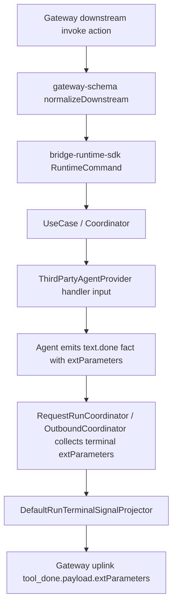
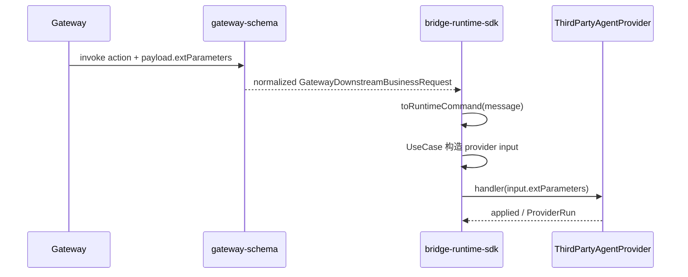
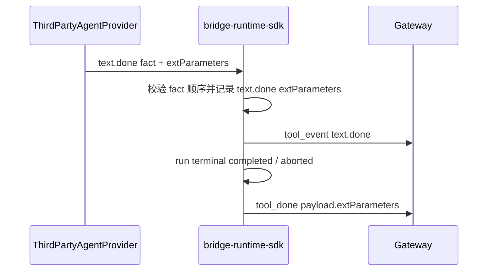

# `Runtime SDK extParameters 双向透传方案`

- 方案日期：`2026-07-24`
- 目标工程：`agent-plugin`
- 参考文档：`AGENTS.md`、`docs/rules/engineering.md`、`docs/rules/testing.md`、`docs/rules/documentation.md`、`docs/rules/change-management.md`、`packages/gateway-schema/docs/gateway-schema-architecture.md`、`packages/bridge-runtime-sdk/AGENTS.md`
- 方案类型：`SDK/API 与 gateway 协议扩展方案`
- Version: `1.0`
- Date: `2026-07-24`
- Status: `Active`
- Owner: `agent-plugin maintainers`

## 1. 背景

### 1.1 场景说明

当前 `@agent-plugin/gateway-schema` 已定义 `ExtParameters` 与 `extParametersSchema`，但现状只覆盖部分 gateway 下行动作：

1. `chat.payload.extParameters` 已进入 `ProviderRunMessageInput.extParameters`。
2. `create_session.payload.extParameters` 在 SDK usecase 中已有兼容式透传，但 schema contract 里 `CreateSessionPayload` 尚未显式声明该字段。
3. `query_slash_commands.payload.extParameters` 已进入 `ProviderListSlashCommandsInput.extParameters`。
4. `close_session`、`abort_session`、`question_reply`、`permission_reply` 还没有统一的 `extParameters` 入口。
5. 当前 `extParametersSchema` 要求 plain object，且对 `platformExtParam` 有 JSON object 校验；这与新需求“`object | null`，不校验里面的值”不一致。
6. 上行链路当前 `TextDoneFact` 没有 `extParameters` 字段，`DefaultRunTerminalSignalProjector` 生成的 `tool_done` 也没有 `payload.extParameters`。

本次需求是让 SDK 支持下行和上行扩展字段 `extParameters`：

1. `gateway -> sdk -> agent`：所有 downstream action 支持 `extParameters`。
2. `agent -> sdk -> gateway`：agent 在 `text.done` 中生成的 `extParameters` 需要以 `payload.extParameters` 透传给 gateway。
3. `extParameters` 的类型为 `object | null`，SDK/schema 只校验顶层类型，不校验内部字段和值。

### 1.2 需求目标

1. 统一 `gateway-schema` 的 `ExtParameters` 类型与 schema：允许 `Record<string, unknown> | null`，不再校验内部字段和值。
2. 所有 `INVOKE_ACTIONS` 对应 payload 都支持可选 `extParameters`，包括 `chat`、`create_session`、`close_session`、`permission_reply`、`abort_session`、`question_reply`、`query_slash_commands`。
3. `bridge-runtime-sdk` 将下行 action 的 `payload.extParameters` 原样传给对应 provider handler input。
4. `TextDoneFact` / public contract 支持 agent 产出 `extParameters`。
5. SDK 在 request run / outbound run 收口时，将最后一个带 `extParameters` 的 `text.done` 投影到上行 `tool_done.payload.extParameters`。
6. 更新契约测试，覆盖 object、null、空对象、内部任意值、不存在字段、所有 action 透传、上行 `text.done -> tool_done.payload.extParameters`。

### 1.3 非目标

1. 不解释或校验 `extParameters` 内部业务字段，如 `businessExtParam`、`platformExtParam`、业务 session 信息等。
2. 不从旧字段合成 `extParameters`，例如不从 `imGroupId` 或账号字段推导。
3. 不改变 gateway 连接、鉴权、注册、心跳或重连协议。
4. 不调整 `tool_event.event.properties` 的文本内容投影语义，除非 gateway 明确要求 `text.done` tool event 也携带该字段。
5. 不涉及 Android、iOS、HarmonyOS 原生 SDK 实现；本仓库当前落点是 TypeScript runtime SDK 与 gateway schema。如外部移动端 SDK 复用同一协议，需要同步其协议定义与契约测试。

## 2. 方案图

### 2.1 整体方案图

### 2.2 方案核心

以 `gateway-schema` 作为协议真源，把 `extParameters` 收敛为顶层 `object | null` 透传字段；SDK usecase 只做存在性传递，terminal projector 只在 agent 的 `text.done` 明确提供时输出 `tool_done.payload.extParameters`。

## 3. 时序图

### 3.1 `下行 action extParameters 透传`

### 3.2 `text.done extParameters 上行透传`

## 4. 技术细节

### 4.1 调整点

1. `packages/gateway-schema/src/contract/types/ext-parameters.ts`
   - 将 `ExtParameters` 从结构化 interface 调整为 `Record<string, unknown> | null`。
   - 如仍保留 `PlatformExtParam` 类型，只作为兼容导出或文档辅助，不参与 schema 内部校验。
2. `packages/gateway-schema/src/contract/schemas/downstream.ts`
   - `extParametersSchema` 改为仅接受 `null` 或 plain object。
   - 删除 `platformExtParam` 的 JSON object 递归校验。
   - 为 `createSessionPayloadSchema`、`closeSessionPayloadSchema`、`abortSessionPayloadSchema`、`permissionReplyPayloadSchema`、`questionReplyPayloadSchema` 增加 `extParameters` 可选字段。
   - 已有 `chatPayloadSchema`、`querySlashCommandsPayloadSchema` 保留字段，但更新 null 与内部任意值语义。
   - transform 中使用 `payload.extParameters !== undefined` 判断，保证 `null` 被保留，字段缺失仍缺失。
3. `packages/gateway-schema/src/contract/schemas/upstream-business.ts`
   - `toolDoneMessageSchema` 增加可选 `payload.extParameters`。
   - schema 仅验证 `payload.extParameters` 为 object 或 null，不校验内部值。
   - transform 保留空 payload 处理策略：字段缺失时不输出 `payload`；存在 `extParameters: null` 或 object 时输出 `payload.extParameters`。
4. `packages/bridge-runtime-sdk/src/domain/provider.ts` 与 `packages/bridge-runtime-sdk/src/domain/provider-contract.ts`
   - 在所有 provider command input 增加 `extParameters?: ExtParameters`：`ProviderCloseSessionInput`、`ProviderAbortSessionInput`、`ProviderQuestionReplyInput`、`ProviderPermissionReplyInput`。
   - `ProviderCreateSessionInput`、`ProviderListSlashCommandsInput`、`ProviderRunMessageInput` 保持已有字段并更新注释。
   - `TextDoneFact` 增加 `extParameters?: ExtParameters`。
   - `ProviderTerminalResult` 不建议新增 `extParameters`，避免终态结果与 `text.done` 事实形成双真源。
5. `packages/bridge-runtime-sdk/src/application/usecases/*`
   - `CreateSessionUseCase` 去掉临时 cast，直接读取 typed `command.source.payload.extParameters`。
   - `StartRequestRunUseCase` 保持 `chat` 透传，并确保 `null` 不被遗漏。
   - `ListSlashCommandsUseCase` 保持 `query_slash_commands` 透传，并确保 `null` 不被遗漏。
   - `CloseSessionUseCase`、`AbortExecutionUseCase`、`ReplyQuestionUseCase`、`ReplyPermissionUseCase` 将 `payload.extParameters` 传给 provider handler input。
6. `packages/bridge-runtime-sdk/src/application/coordinators/RequestRunCoordinator.ts`
   - 在消费 facts 时记录当前 run 中最后一个 `text.done.extParameters !== undefined` 的值。
   - 调用 `terminalProjector.project()` 时传入该值。
   - 如果有多个 `text.done` 携带 `extParameters`，以后出现的值覆盖前值；这是流式多 part 场景下最可预测的收口策略。
7. `packages/bridge-runtime-sdk/src/application/coordinators/OutboundCoordinator.ts`
   - `emitOutboundRun()` 与 request run 使用同样策略，将 outbound facts 中最后一个 `text.done.extParameters` 透传到 `tool_done.payload.extParameters`。
   - deprecated 的 `emitOutboundMessage()` 当前不会自动发送 `tool_done`，因此不涉及 `tool_done.payload.extParameters`；如未来补齐终态，也复用同一收集策略。
8. `packages/bridge-runtime-sdk/src/application/projectors/DefaultRunTerminalSignalProjector.ts`
   - project input 增加 `extParameters?: ExtParameters`。
   - completed / aborted 生成：`type: 'tool_done'`、`toolSessionId`、可选 `payload: { extParameters }`。
   - failed 仍生成 `tool_error`，不透传 `extParameters`。

### 4.2 核心实现方式

核心原则是“协议边界轻校验，业务内容不解释”。

下行侧在 `gateway-schema` 归一化阶段只判断 `payload.extParameters` 是否为 `undefined`、`null` 或 plain object。`undefined` 表示字段缺失，normalize 后不输出；`null` 表示 gateway 显式传入空扩展上下文，必须保留；plain object 原样传递。数组、字符串、数字、布尔值、函数、Date 等非 plain object 仍应拒绝，因为不满足 `object | null` 的顶层类型约束。

SDK usecase 不读取内部字段，只把 normalized payload 的 `extParameters` 赋给 provider input。provider 可按自身业务理解对象内容，但 SDK 不承担兼容、迁移或脱敏语义。

上行侧以 `TextDoneFact.extParameters` 为 agent 生成扩展字段的唯一来源。Coordinator 负责在 facts 流中收集该字段，terminal projector 负责把它放入 `tool_done.payload.extParameters`。这样可以避免 `DefaultFactToSkillEventProjector` 与 terminal projector 同时拥有同一字段输出规则。

### 4.3 兼容与边界

1. 兼容点：字段是可选字段，旧 gateway、旧 agent 不传 `extParameters` 时输出不变。
2. 兼容点：`null` 从原先被拒绝变为合法输入，是放宽校验，不破坏旧合法报文。
3. 兼容点：原已支持的 `chat`、`query_slash_commands` object 透传行为保留。
4. 行为变化：`platformExtParam` 不再要求 JSON object；内部值允许任意 unknown。该变化需在协议文档中明确，避免调用方误以为 schema 会兜底序列化安全。
5. 边界条件：数组不属于本方案的 `object | null`，应继续拒绝。
6. 边界条件：`Date`、class instance 等非 plain object 是否接受需统一口径；推荐继续拒绝，只接受 plain object 或 null，避免 wire 层出现不可预测序列化结果。
7. 边界条件：多个 `text.done` 都带 `extParameters` 时，以最后一个为准。
8. 降级策略：provider 未返回 `text.done.extParameters` 时，`tool_done` 不输出 `payload`，保持现有报文形状。
9. 失败策略：provider 返回非法 fact 顺序时仍 fail-closed，不因 extParameters 存在改变终态投影规则。
10. 跨平台影响：Android、iOS、HarmonyOS 如直接消费 gateway 协议，需要同步“object | null、内部不校验、tool_done.payload.extParameters”契约；本仓库 TypeScript SDK 不直接修改原生端代码。

### 4.4 相关接口联动

1. `GatewayDownstreamBusinessRequest`
   - 所有 `InvokeMessageByAction[K]['payload']` 增加可选 `extParameters`。
   - `status_query` 不是 invoke action，本次不强行增加 payload。
2. `GatewayUplinkBusinessMessage`
   - `ToolDoneMessage` 增加可选 `payload.extParameters`。
3. `ThirdPartyAgentProvider`
   - `createSession(input.extParameters)`
   - `listSlashCommands(input.extParameters)`
   - `runMessage(input.extParameters)`
   - `replyQuestion(input.extParameters)`
   - `replyPermission(input.extParameters)`
   - `closeSession(input.extParameters)`
   - `abortSession(input.extParameters)`
4. `TextDoneFact`
   - 新增 `extParameters?: ExtParameters`，作为 `tool_done.payload.extParameters` 的来源。
5. `DefaultRunTerminalSignalProjector`
   - input 增加 `extParameters?: ExtParameters`，输出 `ToolDoneMessage.payload.extParameters`。
6. `gateway-client`
   - 主要通过 `@agent-plugin/gateway-schema` 校验上行业务消息；若 `ToolDoneMessage` schema 更新，gateway-client 不应重复定义该字段。

### 4.5 文档需要同步修改的内容

1. `packages/gateway-schema/docs/gateway-schema-architecture.md`
   - 补充 `extParameters` 是共享协议边界字段，schema 只校验顶层 `object | null`。
2. `packages/bridge-runtime-sdk/docs/architecture/bridge-runtime-sdk-architecture.md`
   - 补充下行 action 到 provider SPI 的 `extParameters` 透传，以及 `text.done -> tool_done.payload.extParameters` 上行收口规则。
3. `packages/bridge-runtime-sdk/docs/design/interface/bridge-runtime-sdk-integration.md`
   - 更新 provider SPI 接入说明，列出所有 handler input 的 `extParameters` 字段。
   - 说明 `TextDoneFact.extParameters` 的用法和多 `text.done` 覆盖策略。

## 5. 性能

不新增网络请求，不增加轮询，不影响首屏。额外开销仅为：

1. schema 顶层类型判断，低成本。
2. coordinator 在 facts 流中保存一个 `extParameters` 引用，常量级内存。
3. 上行 `tool_done` payload 可能变大；大小完全取决于 agent 提供的 `extParameters`。SDK 不压缩、不裁剪、不记录原文日志。

## 6. 功耗

不增加长连接数量、后台任务、动画或频繁刷新。仅在已有消息收发链路中多透传一个字段，功耗影响不涉及。

## 7. 埋码

1. 不新增业务埋码
   - 说明：`extParameters` 可能包含业务上下文或敏感扩展字段，SDK 不应记录内部内容。
2. 保留现有 observation / diagnostics
   - 说明：可继续记录 message type、action、toolSessionId、payloadBytes 等摘要字段，但不要输出 `extParameters` 原文。
3. 可选埋码
   - 说明：如需要排障，可只记录 `hasExtParameters: boolean` 与 `extParametersKind: "object" | "null" | "absent"`，不记录 key/value。

## 8. 影响范围

### 8.1 直接影响

1. `packages/gateway-schema` downstream schema、upstream schema、contract 类型与契约测试。
2. `packages/bridge-runtime-sdk` provider public contract、usecase 输入映射、request/outbound coordinator、terminal projector 与 public API contract 测试。
3. 依赖 `ThirdPartyAgentProvider` 类型的宿主插件或 provider adapter，需要接受新增可选字段。
4. gateway 需要识别 `tool_done.payload.extParameters`，否则只能忽略该字段。

### 8.2 间接影响

1. 日志脱敏与 payload formatter 需确认不会原文打印 `extParameters`。
2. 文档中关于 `businessExtParam`、`platformExtParam` 的强校验描述需要下线或改为示例字段。
3. 如果外部调用方曾依赖 schema 拒绝 `platformExtParam` 内部非法值，需要迁移到自身业务校验。
4. 若 provider 生成非常大的 `extParameters`，可能影响单帧 payload 大小与 gateway 接收限制，需要由业务方约束。

### 8.3 不影响

1. gateway register、heartbeat、auth、reconnect 语义不变。
2. request run fact 顺序校验不变。
3. `text.delta`、`thinking.delta`、`thinking.done`、`tool.update`、`question.ask`、`permission.ask` 的既有投影语义不变。
4. `tool_error` 不新增 `extParameters`。
5. `integration/` 外部夹具不在本次默认修改范围内。

## 9. 测试范围

### 9.1 功能测试

1. `packages/gateway-schema/tests/downstream-contract.test.ts`
   - 所有 `INVOKE_ACTIONS` payload 支持 `extParameters: {}`。
   - 所有 `INVOKE_ACTIONS` payload 支持 `extParameters: null`。
   - `extParameters` 内部允许任意 unknown 值，不校验 `platformExtParam`。
   - 字段缺失时 normalize 结果不输出 `extParameters`。
   - 数组、字符串、数字、布尔值作为顶层 `extParameters` 时拒绝。
2. `packages/gateway-schema/tests/transport-contract.test.ts` 或 `wire-contract.test.ts`
   - `tool_done` 支持 `payload.extParameters` object。
   - `tool_done` 支持 `payload.extParameters` null。
   - `tool_done` 不传 payload 时保持兼容。
3. `packages/bridge-runtime-sdk` usecase 单测
   - `StartRequestRunUseCase` 保持 object/null 透传。
   - `CreateSessionUseCase` 去掉 cast 后仍透传。
   - `ListSlashCommandsUseCase` 保持 object/null 透传。
   - 新增 `CloseSessionUseCase`、`AbortExecutionUseCase`、`ReplyQuestionUseCase`、`ReplyPermissionUseCase` extParameters 透传断言。
4. `packages/bridge-runtime-sdk` projector/coordinator 单测
   - `DefaultRunTerminalSignalProjector` 输出 `tool_done.payload.extParameters`。
   - request run 中 `text.done.extParameters` 被投到最终 `tool_done`。
   - outbound run 中 `text.done.extParameters` 被投到最终 `tool_done`。
   - 多个 `text.done.extParameters` 时最后一个生效。
   - `text.done` 不带 extParameters 时 `tool_done` 形状不变。

### 9.2 兼容测试

1. 旧报文不含 `extParameters`：downstream normalize、provider input、tool_done 输出均与现状一致。
2. 旧 provider 不读取新增 handler input 字段：TypeScript 结构兼容，不要求 provider 立即改造。
3. `extParameters: null` 不被条件展开遗漏。
4. gateway-client 发送 `tool_done.payload.extParameters` 能通过 gateway-schema 上行校验。
5. 外部原生 SDK 影响待确认：Android、iOS、HarmonyOS 如复用协议，需要各自 contract case 对齐。

### 9.3 文档一致性检查

1. 检查 `gateway-schema` 文档中不存在“只校验 platformExtParam JSON object”的旧表述。
2. 检查 `bridge-runtime-sdk` provider SPI 文档列出的 handler input 与 `public-contract.ts` 一致。
3. 检查测试命令与仓库规则一致：跨 schema + SDK 协议变更优先运行受影响包测试，建议最终运行 `pnpm verify:workspace`。
4. 完成前记录实际验证命令和结果；若未运行完整验证，需要说明原因和剩余风险。

## 10. 最终建议

最终结论：推荐采用“`gateway-schema` 统一放宽顶层类型 + `bridge-runtime-sdk` 全 action 透传 + `TextDoneFact` 驱动 `tool_done.payload.extParameters`”方案。

取舍原因：该方案把协议字段真源放在 `gateway-schema`，符合仓库分层规则；SDK 不解释内部字段，能满足业务扩展灵活性；通过 `text.done` 作为上行扩展字段来源，避免在 terminal result 和 streaming fact 之间形成双真源。主要代价是放宽 `platformExtParam` 内部校验后，业务方需要自行保证扩展字段可被 gateway 与下游消费；SDK 只承担顶层 contract 与透传责任。

后续动作：

1. 先改 `gateway-schema` 类型、downstream/upstream schema 与契约测试。
2. 再改 `bridge-runtime-sdk` public contract、usecase 透传、coordinator 收集与 terminal projector。
3. 同步模块文档。
4. 运行 `pnpm --dir packages/gateway-schema test`、`pnpm --dir packages/bridge-runtime-sdk test`，跨包行为稳定后运行 `pnpm verify:workspace`。
