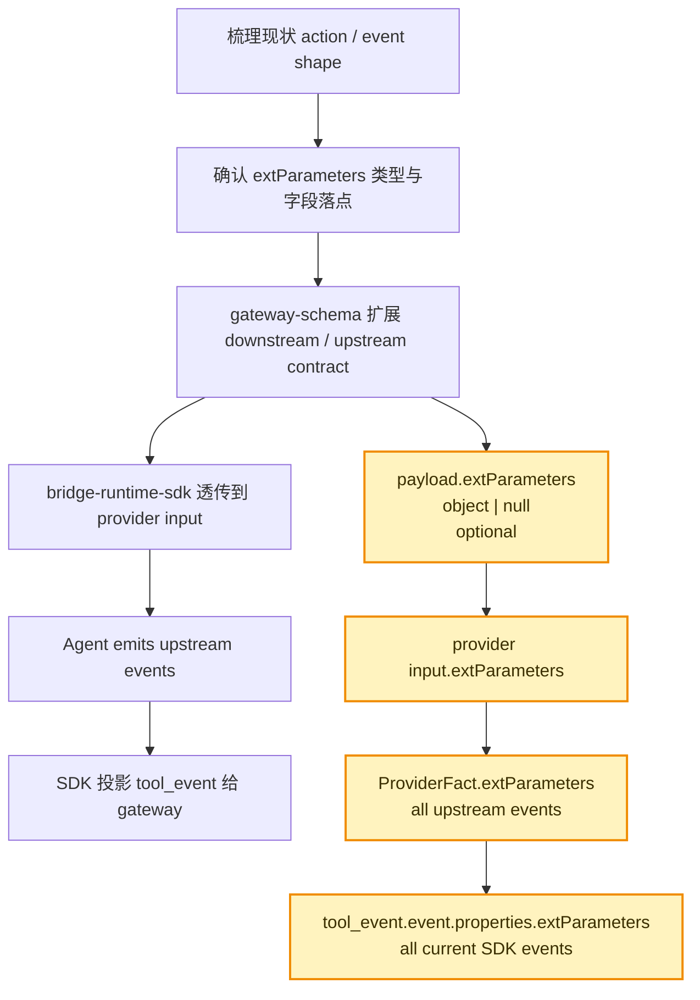
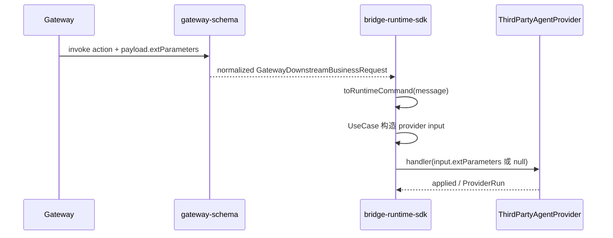
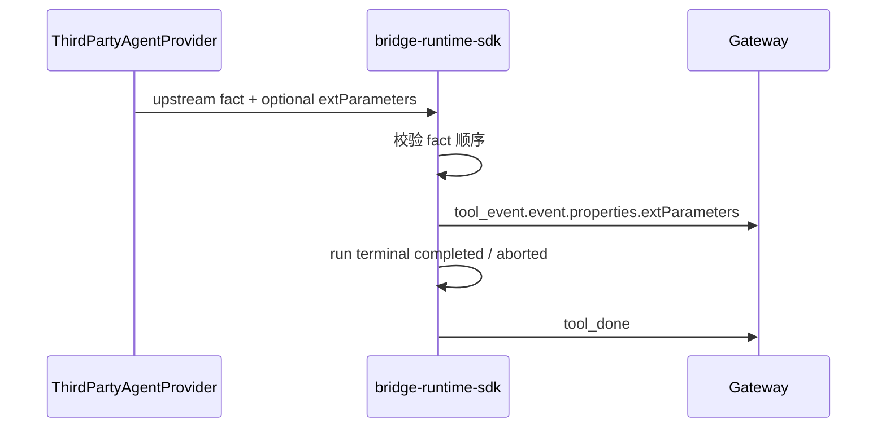

# `Runtime SDK extParameters 双向透传方案`

- 方案日期：`2026-07-28`
- 目标工程：`agent-plugin`
- 参考文档：`AGENTS.md`、`docs/rules/engineering.md`、`docs/rules/testing.md`、`docs/rules/documentation.md`、`docs/rules/change-management.md`、`packages/gateway-schema/docs/gateway-schema-architecture.md`、`packages/bridge-runtime-sdk/AGENTS.md`
- 方案类型：`SDK/API 与 gateway 协议扩展方案`
- Version: `1.3`
- Date: `2026-07-28`
- Status: `Active`
- Owner: `agent-plugin maintainers`

## 1. 背景

### 1.1 场景说明

当前 `@agent-plugin/gateway-schema` 已定义 `ExtParameters` 与 `extParametersSchema`，但在讨论新增扩展字段前，需要先梳理现有上下行协议形态，避免直接扩大字段导致契约边界不清。

本文表格中的“现状”指方案梳理时、代码改造前的协议和 SDK 行为；“预期改造后”指本方案建议落地后的目标契约。

下行 action 现状与预期改造如下：

| action | 现状 schema 是否支持 `payload.extParameters` | 现状 SDK 是否透传给 agent/provider | 预期改造后 schema 是否支持 | 预期改造后 SDK 是否透传 | 预期落点 |
|---|---:|---:|---:|---:|---|
| `chat` | 是 | 是 | 是 | 是 | `ProviderRunMessageInput.extParameters` |
| `create_session` | 否 | 部分支持 | 是 | 是 | `ProviderCreateSessionInput.extParameters` |
| `query_slash_commands` | 是 | 是 | 是 | 是 | `ProviderListSlashCommandsInput.extParameters` |
| `close_session` | 否 | 否 | 是 | 是 | `ProviderCloseSessionInput.extParameters` |
| `abort_session` | 否 | 否 | 是 | 是 | `ProviderAbortSessionInput.extParameters` |
| `question_reply` | 否 | 否 | 是 | 是 | `ProviderQuestionReplyInput.extParameters` |
| `permission_reply` | 否 | 否 | 是 | 是 | `ProviderPermissionReplyInput.extParameters` |

说明：

1. `chat` 与 `query_slash_commands` 在现状中已经支持 object 形态透传，但还不支持 `null`，且内部 `platformExtParam` 仍存在额外校验。
2. `create_session` 的“部分支持”不是协议契约支持，而是 SDK usecase 通过临时 cast 读取字段；预期改造后应由 `CreateSessionPayload` schema 明确声明。
3. 所有 action 的预期口径统一为：`payload.extParameters` 可选，类型为顶层 `object | null`；未提供时 SDK 内部对象值为 `undefined`，`null` 原样透传。

上行事件现状如下：

1. `tool_event` 的 agent 事实事件使用 `event.properties` 承载事件内容；当前 `text.done` 的 `properties` 只有 `messageId`、`partId`、`content`。
2. `tool_done` 是 run terminal 上行业务消息；当前 `ToolDoneMessage` 只有 `type`、`toolSessionId`、可选 `welinkSessionId` 与 `usage`，没有 `payload`。
3. `DefaultFactToSkillEventProjector` 负责把当前 SDK 的 `ProviderFact` 投影成 `tool_event.event.properties`。
4. `DefaultRunTerminalSignalProjector` 负责把 agent run 终态投影成 `tool_done`。

上行业务消息对 `extParameters` 的现状与预期改造如下：

| 上行业务消息 | 当前字段形态 | 现状是否支持 `extParameters` | 预期改造后是否支持 `extParameters` | 预期落点 | 说明 |
|---|---|---:|---:|---|---|
| `tool_event` | `toolSessionId`、可选 subagent envelope、`event` | 否 | 是 | `event.properties.extParameters` | 只扩展具体 event 的 `properties`；不在 `tool_event` envelope 顶层增加 `extParameters`。 |
| `tool_done` | `toolSessionId`、可选 `welinkSessionId`、可选 `usage` | 否 | 否 | 不涉及 | SDK run terminal 完成上报，不是 agent event；当前无 `payload`。 |
| `tool_error` | 可选 `welinkSessionId/toolSessionId`、`error`、可选 `reason` | 否 | 否 | 不涉及 | SDK 错误/失败上报，来源可能是 provider run failure、非法下行、命令失败，不稳定具备 agent event ext 来源。 |
| `session_created` | `welinkSessionId`、可选 `toolSessionId`、可选 `session` | 否 | 否 | 不涉及 | SDK 对 `create_session` 的命令结果上报，不是 agent event。 |
| `status_response` | `opencodeOnline` | 否 | 否 | 不涉及 | SDK 对 `status_query` 的命令结果上报。 |
| `slash_commands_result` | `toolSessionId`、`traceId`、`payload.slashCommands` | 否 | 否 | 不涉及 | SDK 对 `query_slash_commands` 的命令结果上报。 |

`tool_done` 与 `tool_error` 的判断：

1. 二者都是 SDK 处理并发送给 gateway 的上行业务消息，但它们不是 agent 生成的 event。
2. `tool_done` 由 `DefaultRunTerminalSignalProjector` 根据 `ProviderTerminalResult.outcome` 生成；现有契约没有 `payload`，只有 `toolSessionId`、可选 `welinkSessionId`、可选 `usage`。
3. `tool_error` 也由 SDK 在失败路径生成，来源包括 run failure、invalid invoke、pending interaction miss、command failure 等；其中不少路径没有 agent 产出的 `extParameters`。
4. 技术上可以为 `tool_done` 或 `tool_error` 新增顶层字段或 payload 字段，但这会引入“run terminal 级扩展字段”的新协议契约，并需要定义来源优先级、多个 event ext 的汇聚规则、失败路径无 ext 时的语义。
5. 本需求强调“agent 处理后的上行 event 的 `extParameters` 透传给 gateway”，按当前协议应落在 `tool_event.event.properties.extParameters`；因此本方案不支持 `tool_done` / `tool_error` 携带 `extParameters`。

当前 SDK 产出的 `tool_event.event` cloud/skill provider 事件对 `extParameters` 的现状与预期改造如下：

| cloud event type | 当前 properties 扩展相关字段 | 现状是否支持 `properties.extParameters` | 预期改造后是否支持 | 预期落点 |
|---|---|---:|---:|---|
| `text.delta` | 不涉及 | 否 | 是 | `tool_event.event.properties.extParameters` |
| `text.done` | 不涉及 | 否 | 是 | `tool_event.event.properties.extParameters` |
| `thinking.delta` | 不涉及 | 否 | 是 | `tool_event.event.properties.extParameters` |
| `thinking.done` | 不涉及 | 否 | 是 | `tool_event.event.properties.extParameters` |
| `tool.update` | `input` | 否 | 是 | `tool_event.event.properties.extParameters` |
| `question` | `extParam` | 否 | 是 | `tool_event.event.properties.extParameters` |
| `permission.ask` | `metadata` | 否 | 是 | `tool_event.event.properties.extParameters` |
| `permission.reply` | 不涉及 | 否 | 是 | `tool_event.event.properties.extParameters` |
| `step.start` | 不涉及 | 否 | 是 | `tool_event.event.properties.extParameters` |
| `step.done` | `tokens`、`cost`、`reason` | 否 | 是 | `tool_event.event.properties.extParameters` |
| `session.status` | 不涉及 | 否 | 是 | `tool_event.event.properties.extParameters` |
| `session.title` | 不涉及 | 否 | 是 | `tool_event.event.properties.extParameters` |
| `session.error` | 不涉及 | 否 | 是 | `tool_event.event.properties.extParameters` |

说明：

1. `question.properties.extParam` 是既有兼容字段，不等同于本次统一新增的 `extParameters`，两者可并存。
2. `permission.ask.properties.metadata` 是 permission 展示/上下文，不等同于通用扩展字段，预期仍保留原语义。
3. 所有 cloud event 的 `extParameters` 都是 event 级字段，跟随各自 `tool_event` 独立发送，不在 run terminal 阶段合并。

本方案将在以上所有当前 SDK 产出的 cloud/skill provider event 的 `properties` 中新增可选 `extParameters`。

opencode provider 事件属于旧兼容协议，不作为本方案扩展字段设计的呈现对象；本方案只围绕当前 SDK 产出的 cloud/skill provider 事件展开。

当前类型与校验现状如下：

1. `ExtParameters` 当前是带 `businessExtParam`、`platformExtParam` 语义提示的 TypeScript interface。
2. `extParametersSchema` 当前要求 plain object。
3. `extParametersSchema` 当前不校验 `businessExtParam`，但会校验 `platformExtParam` 必须是 JSON object。
4. 这与新口径“`object | null`，字段可选，SDK 内部可直接赋值为 `undefined`，不校验内部结构”不一致。

本次需求是让 SDK 支持下行和上行扩展字段 `extParameters`：

1. `gateway -> sdk -> agent`：所有 downstream action 支持 `extParameters`。
2. `agent -> sdk -> gateway`：所有当前 SDK 产出的上行 event 都支持可选 `event.properties.extParameters`，按当前 `tool_event` 契约透传给 gateway。
3. `extParameters` 是非必要字段参数，类型为 `object | null`；在 TypeScript 中对应 `Record<string, unknown> | null`。

### 1.2 需求目标

1. 先明确当前下行 action 的支持矩阵，区分“schema 已支持”“SDK 临时透传”“完全未支持”。
2. 明确当前所有上行业务消息和 SDK 产出的 cloud/skill provider events 均不支持名为 `extParameters` 的统一字段。
3. 基于当前上行协议契约确认所有当前 SDK 上行 event 的 `extParameters` 应挂在 `tool_event.event.properties.extParameters`。
4. 统一 `gateway-schema` 的 `ExtParameters` 类型与 schema：允许 `Record<string, unknown> | null`，不再校验内部字段和值。
5. 所有 `INVOKE_ACTIONS` 对应 payload 都支持可选 `extParameters`，包括 `chat`、`create_session`、`close_session`、`permission_reply`、`abort_session`、`question_reply`、`query_slash_commands`。
6. `bridge-runtime-sdk` 将下行 action 的可选 `payload.extParameters` 原样传给对应 provider handler input；字段未提供时 provider input 的 `extParameters` 为 `undefined`，`null` 表示显式空值。
7. 所有当前 SDK 上行 fact / public contract event 支持 agent 产出 `extParameters`。
8. 更新契约测试，覆盖 object、null、空对象、内部任意值、不存在字段、所有 action 透传、所有当前 SDK 上行 event 透传。

### 1.3 非目标

1. 不解释或校验 `extParameters` 内部业务字段，如 `businessExtParam`、`platformExtParam`、业务 session 信息等。
2. 不从旧字段合成 `extParameters`，例如不从 `imGroupId` 或账号字段推导。
3. 不改变 gateway 连接、鉴权、注册、心跳或重连协议。
4. 不调整 `tool_done` 终态消息语义，不把 text part 级扩展字段迁移到 run terminal 消息。
5. 不在本方案中直接实现 Android、iOS、HarmonyOS 原生 SDK；但需要在影响范围中说明 object/null 对应关系。

## 2. 方案图

### 2.1 整体方案图

### 2.2 方案核心

先以代码现状为依据列清下行 action 与上行 message/event shape，再以 `gateway-schema` 作为协议真源，把 `extParameters` 收敛为顶层 `object | null` 可选透传字段；SDK 只做存在性传递，不解释内部结构。

## 3. 时序图

### 3.1 `下行 action extParameters 透传`

### 3.2 `上行 event extParameters 透传`

## 4. 技术细节

### 4.1 调整点

1. 现状梳理文档化
   - 在方案中保留下行 action 支持矩阵，明确 `chat`、`query_slash_commands` 已在 schema 和 SDK 中支持。
   - 明确 `create_session` 只有 SDK 临时 cast 透传，不属于 schema contract 已支持。
   - 明确 `close_session`、`abort_session`、`question_reply`、`permission_reply` 当前未支持。
   - 在方案中保留上行业务消息和当前 SDK 产出的 cloud/skill provider event 支持矩阵，明确当前没有上行消息或事件支持名为 `extParameters` 的统一字段。
2. `packages/gateway-schema/src/contract/types/ext-parameters.ts`
   - 将 `ExtParameters` 从结构化 interface 调整为 `Record<string, unknown> | null`。
   - 跨语言描述为 `object | null`；Java/Kotlin/HarmonyOS 可映射为 `Map<String, Object>`、`JsonNode` 或平台等价 JSON object。
   - 如仍保留 `PlatformExtParam` 类型，只作为兼容导出或示例类型，不参与 schema 内部校验。
3. `packages/gateway-schema/src/contract/schemas/downstream.ts`
   - `extParametersSchema` 改为仅接受 `null` 或 plain object。
   - 删除 `platformExtParam` 的 JSON object 递归校验。
   - 为 `createSessionPayloadSchema`、`closeSessionPayloadSchema`、`abortSessionPayloadSchema`、`permissionReplyPayloadSchema`、`questionReplyPayloadSchema` 增加可选 `extParameters` 字段。
   - 已有 `chatPayloadSchema`、`querySlashCommandsPayloadSchema` 保留字段，但更新 null 与内部任意值语义。
   - 字段未提供时归一化对象可直接保留 `extParameters: undefined`；`null` 只表示 gateway 显式传入空扩展上下文。
4. 上行 event 落点确认
   - 当前 SDK 上行 event 作为 `tool_event.event` 发送时，其事件内容位于 `event.properties`。
   - 当前 run 终态 `tool_done` 是独立上行业务消息，尚无 `payload`。
   - 需求描述的是 agent 生成的上行 event 扩展参数，属于 event 级字段，不是 run terminal 字段。
   - 因此按当前已有协议契约，所有当前 SDK 上行 event 的字段应挂在 `tool_event.event.properties.extParameters`。
   - 不推荐挂在 `tool_done.payload.extParameters`；这会给当前无 payload 的 terminal 消息新增一套 run 级扩展契约，并把 event 级字段延后到终态消息发送。
5. `packages/gateway-schema/src/contract/schemas/tool-event/skill-provider-event/*`
   - 为所有当前 SDK 产出的 cloud/skill provider event properties 增加可选 `extParameters`。
   - 覆盖 `text.delta`、`text.done`、`thinking.delta`、`thinking.done`、`tool.update`、`question`、`permission.ask`、`permission.reply`、`step.start`、`step.done`、`session.status`、`session.title`、`session.error`。
   - `extParameters` 顶层只验证 object 或 null，不校验内部值。
   - `toolDoneMessageSchema` 不新增 `payload.extParameters`。
6. `packages/bridge-runtime-sdk/src/domain/provider.ts` 与 `packages/bridge-runtime-sdk/src/domain/provider-contract.ts`
   - 在所有 provider command input 增加可选 `extParameters?: ExtParameters`。
   - 推荐 provider input 使用可选 `extParameters?: ExtParameters`，`undefined` 表示 gateway 未提供扩展参数，`null` 表示 gateway 显式传入空扩展上下文。
   - 所有当前 SDK 上行 fact 增加可选 `extParameters?: ExtParameters`。
   - `ProviderTerminalResult` 不新增 `extParameters`，避免终态结果与 event fact 形成双真源。
7. `packages/bridge-runtime-sdk/src/application/usecases/*`
   - `CreateSessionUseCase` 去掉临时 cast，直接读取 typed `command.source.payload.extParameters`。
   - `StartRequestRunUseCase` 保持 `chat` 透传，并确保 `null` 不被遗漏。
   - `ListSlashCommandsUseCase` 保持 `query_slash_commands` 透传，并确保 `null` 不被遗漏。
   - `CloseSessionUseCase`、`AbortExecutionUseCase`、`ReplyQuestionUseCase`、`ReplyPermissionUseCase` 将 `payload.extParameters` 传给 provider handler input。
8. 上行 projector / coordinator
   - 由 `DefaultFactToSkillEventProjector` 在所有 cloud/skill provider event 投影中直接透传 fact 的 `extParameters`。
   - `RequestRunCoordinator`、`OutboundCoordinator`、`DefaultRunTerminalSignalProjector` 不需要为了该字段增加终态收口状态。
   - 多个上行 event 可各自携带自己的 `extParameters`，随各自 `tool_event` 独立发送。

### 4.2 核心实现方式

核心原则是“先确认现状与落点，再做协议边界轻校验，业务内容不解释”。

下行侧在 `gateway-schema` 归一化阶段只判断 `payload.extParameters` 是否为 `undefined`、`null` 或 plain object。`undefined` 表示 wire 字段未提供，SDK 内部对象可直接赋值为 `extParameters: undefined`；`null` 表示 gateway 显式传入空扩展上下文；plain object 原样传递。数组、字符串、数字、布尔值、函数、Date 等非 plain object 仍应拒绝，因为不满足 `object | null` 的顶层类型约束。

SDK usecase 不读取内部字段，只把 normalized payload 的 `extParameters` 赋给 provider input。provider 可按自身业务理解对象内容，但 SDK 不承担兼容、迁移或脱敏语义。`undefined` 和 `null` 都是合法输入状态：`undefined` 表示未提供，`null` 表示显式空值。

上行侧以各类 `ProviderFact.extParameters` 为 agent 生成扩展字段的唯一来源。按照当前已有协议，provider fact 被投影为 `tool_event.event`，其事件内容位于 `properties`；因此 `extParameters` 应进入 `tool_event.event.properties.extParameters`。`tool_done` 只表示 run terminal，不承载 event 级扩展字段。

### 4.3 兼容与边界

1. 兼容点：wire 字段可选，旧 gateway、旧 agent 不传 `extParameters` 时输出不变。
2. 兼容点：`undefined` 和 `null` 都合法；SDK 不把未提供字段强制改写为 `null`。
3. 兼容点：`null` 从原先被拒绝变为合法输入，是放宽校验，不破坏旧合法报文。
4. 兼容点：原已支持的 `chat`、`query_slash_commands` object 透传行为保留。
5. 行为变化：`platformExtParam` 不再要求 JSON object；内部值允许任意 unknown。该变化需在协议文档中明确，避免调用方误以为 schema 会兜底序列化安全。
6. 边界条件：数组不属于本方案的 `object | null`，应继续拒绝。
7. 边界条件：`Date`、class instance 等非 plain object 是否接受需统一口径；推荐继续拒绝，只接受 plain object 或 null，避免 wire 层出现不可预测序列化结果。
8. 边界条件：多个上行 event 都带 `extParameters` 时，各自随对应 `tool_event` 发送，不做终态覆盖。
9. 降级策略：provider 未返回 `extParameters` 时，SDK 内部 event properties 可直接带 `extParameters: undefined`；JSON wire 序列化不会产生实际字段。
10. 失败策略：provider 返回非法 fact 顺序时仍 fail-closed，不因 extParameters 存在改变终态投影规则。
11. 跨平台影响：Android、iOS、HarmonyOS 如直接消费 gateway 协议，需要同步“object | null、内部不校验、上行落点为 `tool_event.event.properties.extParameters`”的契约；本仓库 TypeScript SDK 不直接修改原生端代码。

### 4.4 相关接口联动

1. `GatewayDownstreamBusinessRequest`
   - 所有 `InvokeMessageByAction[K]['payload']` 增加可选 `extParameters`。
   - `status_query` 不是 invoke action，本次不强行增加 payload。
2. `GatewayUplinkBusinessMessage`
   - 采用 `ToolEventMessage.event.properties.extParameters`。
3. `ThirdPartyAgentProvider`
   - `createSession(input.extParameters)`
   - `listSlashCommands(input.extParameters)`
   - `runMessage(input.extParameters)`
   - `replyQuestion(input.extParameters)`
   - `replyPermission(input.extParameters)`
   - `closeSession(input.extParameters)`
   - `abortSession(input.extParameters)`
4. `ProviderFact`
   - 所有当前 SDK 上行 fact 新增可选 `extParameters?: ExtParameters`，作为 agent 生成扩展字段的来源。
5. 上行 projector
   - 调整 `DefaultFactToSkillEventProjector`，把各类 fact 的 `extParameters` 写入 `tool_event.event.properties.extParameters`。
   - 不调整 `DefaultRunTerminalSignalProjector`。
6. `gateway-client`
   - 主要通过 `@agent-plugin/gateway-schema` 校验上行业务消息；若上行 schema 更新，gateway-client 不应重复定义该字段。

### 4.5 文档需要同步修改的内容

1. `packages/gateway-schema/docs/gateway-schema-architecture.md`
   - 补充 `extParameters` 是共享协议边界字段，schema 只校验顶层 `object | null`。
2. `packages/bridge-runtime-sdk/docs/architecture/bridge-runtime-sdk-architecture.md`
   - 补充下行 action 到 provider SPI 的 `extParameters` 透传，以及 `ProviderFact.extParameters -> tool_event.event.properties.extParameters` 投影规则。
3. `packages/bridge-runtime-sdk/docs/design/interface/bridge-runtime-sdk-integration.md`
   - 更新 provider SPI 接入说明，列出所有 handler input 的 `extParameters` 字段。
   - 说明所有当前 SDK 上行 fact 的 `extParameters` 用法和逐 event 独立透传策略。

### 4.6 `bridge-runtime-sdk-integration.md` 影响分析

本节只分析影响，不在本方案中直接修改 `packages/bridge-runtime-sdk/docs/design/interface/bridge-runtime-sdk-integration.md`。

| 文档位置 | 当前文档状态 | 受影响原因 | 后续建议修改 |
|---|---|---|---|
| `2.1 Changelog` | 当前最新未发布条目是 `2026-07-14`。 | public provider input 与 fact contract 增加可选字段，属于 SDK 集成契约变更。 | 增加 `feat:` 条目，说明所有 provider handler input 与所有 ProviderFact 支持可选 `extParameters`。 |
| `ProviderCreateSessionInput` | 已列 `extParameters`。 | 代码改造后该字段从临时 cast 变为 schema + public contract 正式字段。 | 保留字段，但说明类型为 `ExtParameters = Record<string, unknown> | null`，字段可选，SDK 不校验内部结构。 |
| `ProviderListSlashCommandsInput` | 已列 `extParameters`。 | 现有文档语义仍与 `runMessage` 复用，但需要补充 `null` 与内部不校验。 | 更新字段说明，明确缺失、`null`、object 三种状态。 |
| `ProviderRunMessageInput` | 已列 `extParameters`，并有 `businessExtParam` / `platformExtParam` 结构化表格。 | 代码改造后 `ExtParameters` 不再是固定结构 interface，`businessExtParam`、`platformExtParam` 只能作为示例字段，不是 schema 校验字段。 | 将“扩展类型”改为顶层 `Record<string, unknown> | null`；下线“当前正式支持值”或改成业务示例，避免误导为 SDK 校验规则。 |
| `ProviderQuestionReplyInput` | 当前未列 `extParameters`。 | `question_reply.payload.extParameters` 预期透传给 provider。 | 在字段表增加 `extParameters?: ExtParameters`。 |
| `ProviderPermissionReplyInput` | 当前未列 `extParameters`。 | `permission_reply.payload.extParameters` 预期透传给 provider。 | 在字段表增加 `extParameters?: ExtParameters`。 |
| `ProviderCloseSessionInput` | 当前未列 `extParameters`。 | `close_session.payload.extParameters` 预期透传给 provider。 | 在字段表增加 `extParameters?: ExtParameters`。 |
| `ProviderAbortSessionInput` | 当前未列 `extParameters`。 | `abort_session.payload.extParameters` 预期透传给 provider。 | 在字段表增加 `extParameters?: ExtParameters`。 |
| `ProviderFactBase` / facts 章节 | 当前只说明 `subagentSessionId?`、`subagentName?`。 | 所有当前 SDK 上行 fact 预期继承 `extParameters?: ExtParameters`，作为 agent 生成扩展字段来源。 | 在 `ProviderFactBase` 字段表增加 `extParameters`，说明投影到 `tool_event.event.properties.extParameters`。 |
| 文本流 / thinking / tool / question / permission / step / session fact 示例 | 当前示例不包含 `extParameters`。 | 集成方需要知道每个 event 都可以按需携带 ext。 | 在一个通用 fact 示例中展示即可，不必每个 fact 都重复；强调各 event 独立透传。 |
| `ProviderTerminalResult` | 当前只有 `outcome`、`usage`、`error`。 | 本方案不把 `extParameters` 放进 `tool_done` 或 `tool_error`。 | 明确 `ProviderTerminalResult` 不承载 `extParameters`；terminal 上报保持现有 `tool_done/tool_error` 形状。 |
| 常见错误 / 日志说明 | 当前已有 SDK 仅透传表述。 | `extParameters` 可能包含业务上下文或敏感扩展字段。 | 增加“不打印 `extParameters` 原文；需要排障只记录 has/kind”说明。 |

接口文档同步时建议采用以下描述口径：

1. `ExtParameters` 类型：`Record<string, unknown> | null`，跨语言可映射为 `Map<String, Object>`、`JsonNode` 或平台等价 JSON object / null。
2. 字段状态：`undefined` 表示 gateway 或 agent 未提供扩展参数；`null` 表示显式空扩展上下文；object 原样透传。
3. 下行：所有 provider handler input 都可接收可选 `extParameters`。
4. 上行：所有 ProviderFact 都可携带可选 `extParameters`，SDK 投影到 `tool_event.event.properties.extParameters`。
5. 非目标：`ProviderTerminalResult`、`tool_done`、`tool_error` 不新增 extParameters。

## 5. 性能

不新增网络请求，不增加轮询，不影响首屏。额外开销仅为：

1. schema 顶层类型判断，低成本。
2. provider input 与 ProviderFact 多携带一个可选引用，常量级内存。
3. 上行 `tool_event.event.properties` 可能变大；大小完全取决于 agent 在各个 event 提供的 `extParameters`。SDK 不压缩、不裁剪、不记录原文日志。

## 6. 功耗

不增加长连接数量、后台任务、动画或频繁刷新。仅在已有消息收发链路中多透传一个字段，功耗影响不涉及。

## 7. 埋码

1. 不新增业务埋码
   - 说明：`extParameters` 可能包含业务上下文或敏感扩展字段，SDK 不应记录内部内容。
2. 保留现有 observation / diagnostics
   - 说明：可继续记录 message type、action、toolSessionId、payloadBytes 等摘要字段，但不要输出 `extParameters` 原文。
3. 可选埋码
   - 说明：如需要排障，可只记录 `hasExtParameters: boolean` 与 `extParametersKind: "object" | "null" | "absent"`，不记录 key/value。

## 8. 影响范围

### 8.1 直接影响

1. `packages/gateway-schema` downstream schema、upstream schema、contract 类型与契约测试。
2. `packages/bridge-runtime-sdk` provider public contract、usecase 输入映射、`DefaultFactToSkillEventProjector` 与 public API contract 测试。
3. 依赖 `ThirdPartyAgentProvider` 类型的宿主插件或 provider adapter，需要接受新增可选字段。
4. gateway 需要识别 `tool_event.event.properties.extParameters`。

### 8.2 间接影响

1. 日志脱敏与 payload formatter 需确认不会原文打印 `extParameters`。
2. 文档中关于 `businessExtParam`、`platformExtParam` 的强校验描述需要下线或改为示例字段。
3. 如果外部调用方曾依赖 schema 拒绝 `platformExtParam` 内部非法值，需要迁移到自身业务校验。
4. 若 provider 生成非常大的 `extParameters`，可能影响单帧 payload 大小与 gateway 接收限制，需要由业务方约束。

### 8.3 不影响

1. gateway register、heartbeat、auth、reconnect 语义不变。
2. request run fact 顺序校验不变。
3. 除各上行 event 新增可选 `properties.extParameters` 外，既有 event 字段和投影语义不变。
4. `tool_done`、`tool_error` 不新增 `extParameters`。
5. `integration/` 外部夹具不在本次默认修改范围内。

## 9. 测试范围

### 9.1 功能测试

1. `packages/gateway-schema/tests/downstream-contract.test.ts`
   - 所有 `INVOKE_ACTIONS` payload 支持 `extParameters: {}`。
   - 所有 `INVOKE_ACTIONS` payload 支持 `extParameters: null`。
   - `extParameters` 内部允许任意 unknown 值，不校验 `platformExtParam`。
   - 字段未提供时 normalize 后的 SDK 内部对象保留 `extParameters: undefined`。
   - 数组、字符串、数字、布尔值作为顶层 `extParameters` 时拒绝。
2. `packages/gateway-schema/tests/transport-contract.test.ts` 或 `wire-contract.test.ts`
   - 验证现有 `tool_done`、`tool_error`、`session_created`、`status_response`、`slash_commands_result` 不支持 `extParameters`。
   - 验证所有当前 SDK 上行 event 的 `properties.extParameters` 支持 object、null 与 `undefined`。
   - 验证 `tool_done` 保持现有 terminal 消息形状，不新增 `payload.extParameters`。
3. `packages/bridge-runtime-sdk` usecase 单测
   - `StartRequestRunUseCase` 保持 object/null 透传。
   - `CreateSessionUseCase` 去掉 cast 后仍透传。
   - `ListSlashCommandsUseCase` 保持 object/null 透传。
   - 新增 `CloseSessionUseCase`、`AbortExecutionUseCase`、`ReplyQuestionUseCase`、`ReplyPermissionUseCase` extParameters 透传断言。
4. `packages/bridge-runtime-sdk` projector/coordinator 单测
   - 覆盖 `DefaultFactToSkillEventProjector` 对所有当前 SDK 上行 fact `extParameters` 的直接透传。
   - 多个 event 的 `extParameters` 随各自 `tool_event` 独立发送。
   - event 不带 `extParameters` 时 SDK 内部 direct assignment 为 `undefined`，wire 序列化保持兼容。

### 9.2 兼容测试

1. 旧报文不含 `extParameters`：downstream normalize、provider input、上行输出均与现状一致。
2. 旧 provider 不读取新增 handler input 字段：TypeScript 结构兼容，不要求 provider 立即改造。
3. `extParameters: null` 不被条件展开遗漏。
4. gateway-client 发送 `tool_event.event.properties.extParameters` 时能通过 gateway-schema 上行校验。
5. 外部原生 SDK 影响待确认：Android、iOS、HarmonyOS 如复用协议，需要各自 contract case 对齐 object/null 口径。

### 9.3 文档一致性检查

1. 检查 `gateway-schema` 文档中不存在“只校验 platformExtParam JSON object”的旧表述。
2. 检查 `bridge-runtime-sdk` provider SPI 文档列出的 handler input 与 `public-contract.ts` 一致。
3. 检查测试命令与仓库规则一致：跨 schema + SDK 协议变更优先运行受影响包测试，建议最终运行 `pnpm verify:workspace`。
4. 完成前记录实际验证命令和结果；若未运行完整验证，需要说明原因和剩余风险。

## 10. 最终建议

最终结论：推荐先完成现状梳理，再进入实现。下行侧采用“`gateway-schema` 统一放宽顶层类型 + `bridge-runtime-sdk` 全 action 可选透传”的方案；上行侧采用“所有当前 SDK event 在 `tool_event.event.properties.extParameters` 可选透传”的方案，不采用 `tool_done.payload.extParameters`。

取舍原因：该方案把协议字段真源放在 `gateway-schema`，符合仓库分层规则；SDK 不解释内部字段，能满足业务扩展灵活性；当前 SDK 上行事件都通过 `tool_event.event.properties` 表达事件字段，所以把 `extParameters` 放在 `properties` 是最小契约扩展。主要代价是放宽 `platformExtParam` 内部校验后，业务方需要自行保证扩展字段可被 gateway 与下游消费；SDK 只承担顶层 contract 与透传责任。

后续动作：

1. 改 `gateway-schema` 类型、downstream/upstream event schema 与契约测试。
2. 改 `bridge-runtime-sdk` public contract、usecase 透传、`DefaultFactToSkillEventProjector` 投影。
3. 同步模块文档。
4. 运行 `pnpm --dir packages/gateway-schema test`、`pnpm --dir packages/bridge-runtime-sdk test`，跨包行为稳定后运行 `pnpm verify:workspace`。
