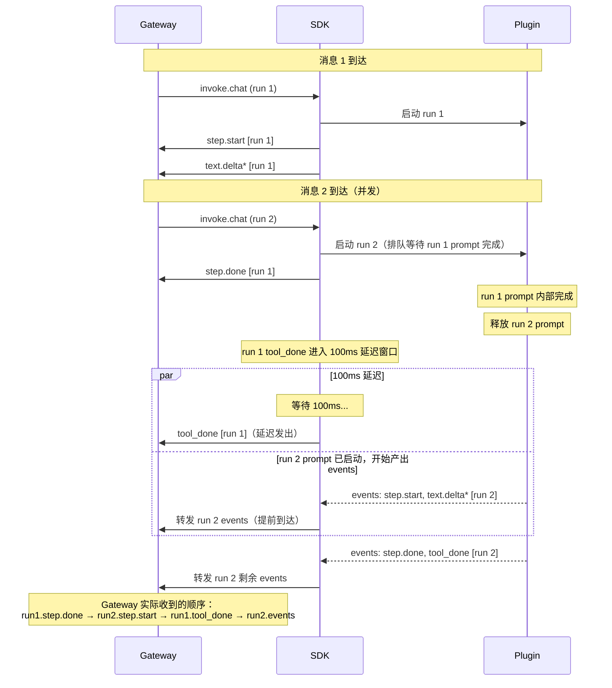
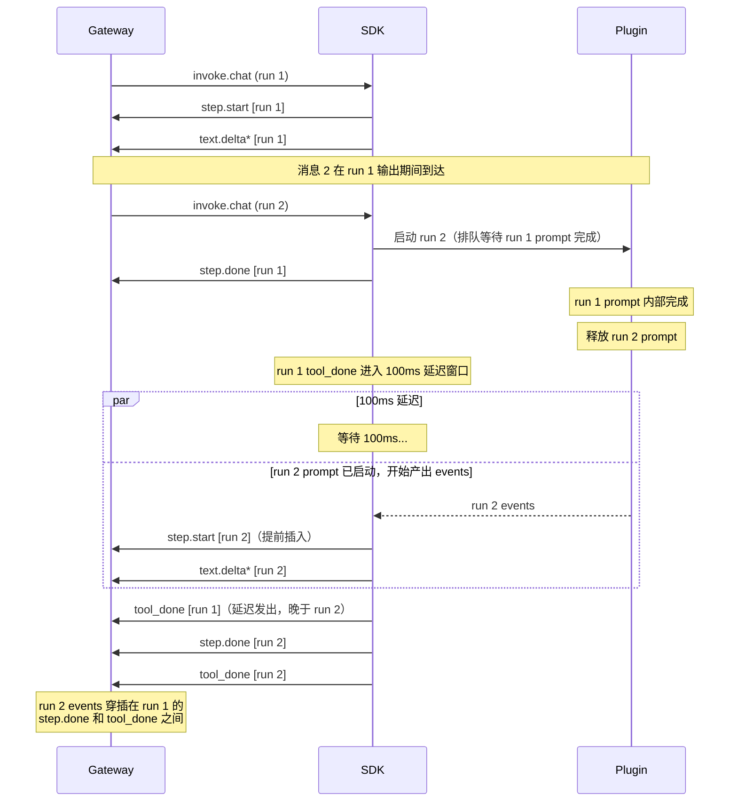
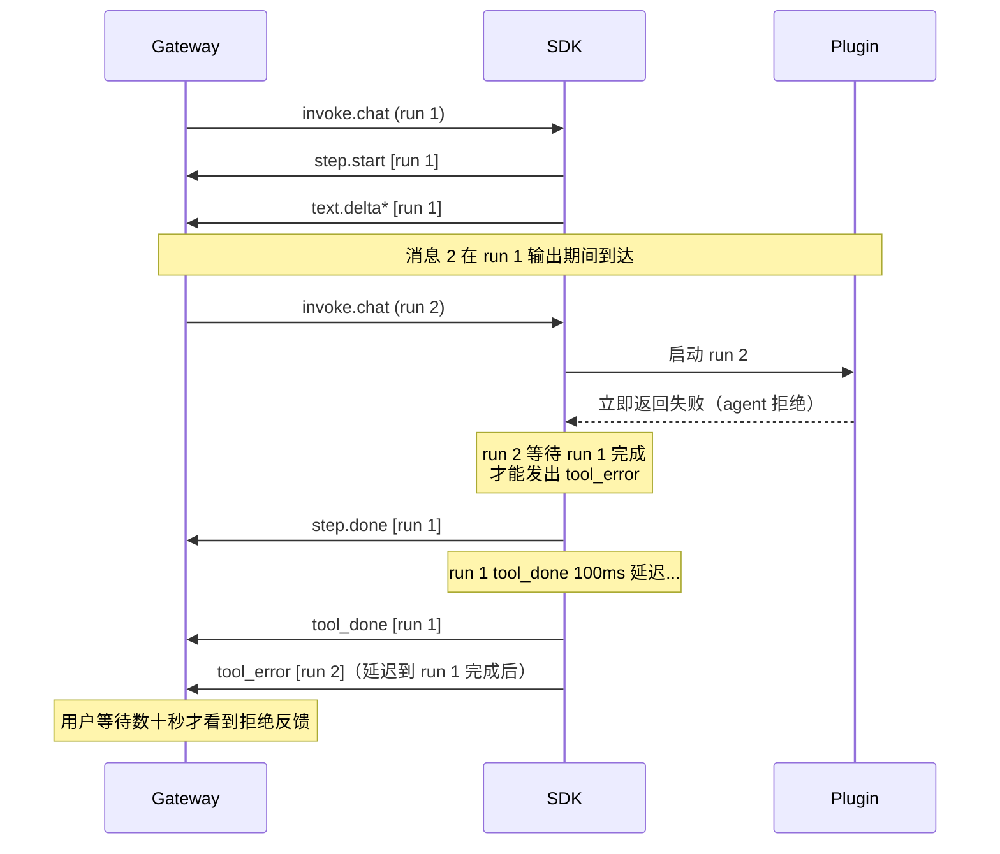
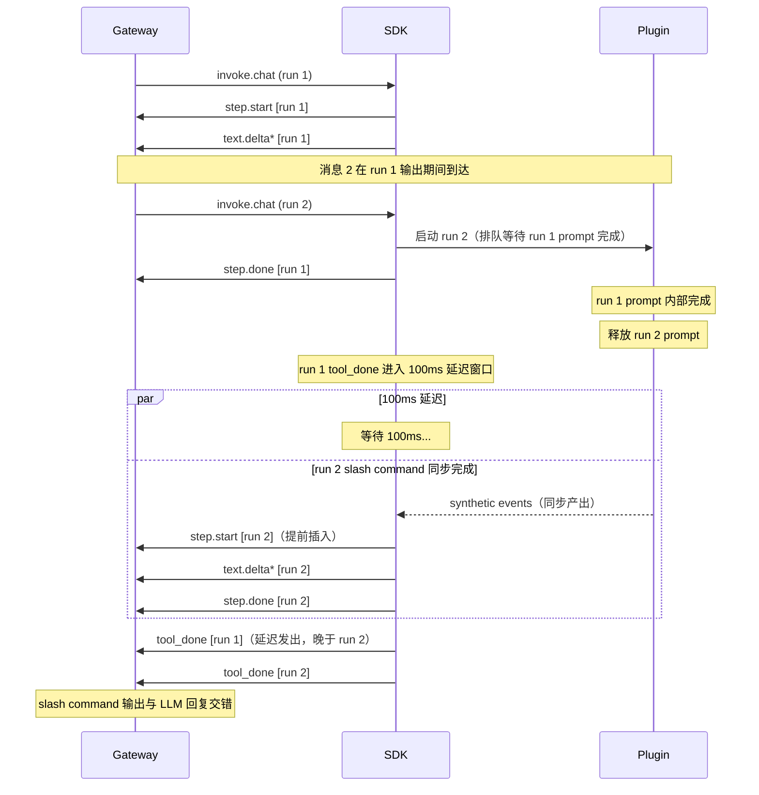

# bridge-runtime-sdk 多 run events 出站时序问题

- **Version:** 1.2
- **Date:** 2026-07-22
- **Status:** Active
- **Owner:** agent-plugin maintainers
- **Related:** `packages/bridge-runtime-sdk/docs/design/2026-07-06-active-run-chat-policy-design.md`

## 1. 背景

`bridge-runtime-sdk` 在 `forwardToProvider` 策略下，允许同一 `toolSessionId` 的多条消息并发到达 provider。第一阶段设计明确将"跨 run 输出排序"责任留给 provider/宿主，SDK 不缓存、不重排（见 `2026-07-06-active-run-chat-policy-design.md` 第 62-67 行）。

但 `message-bridge` 插件基于 OpenCode 宿主，OpenCode 自身已实现 prompt work 的 FIFO 串行，保证了 prompt 启动顺序。在此基础上，SDK 内部的 100ms `tool_done` 兼容延迟引入了一个时序窗口：run 1 的 `tool_done` 尚未发出，run 2 的 `step.start` 已经到达网关。

本文档描述该问题的具体现象、根因和涉及场景，作为后续修复方案的事实依据。

## 2. 问题现象

### 2.1 复现条件

1. 同一 `toolSessionId` 连续发送两条 `invoke.chat` 消息
2. SDK 配置 `activeRunChatPolicy: 'forwardToProvider'`
3. 消息 1 触发 LLM 长回复（例如输出《将进酒》，26907 tokens）
4. 消息 2 在消息 1 处理期间到达

### 2.2 网关端实际收到的 events 顺序

```
[run 1] step.start -> text.delta* -> step.done
[run 2] step.start -> text.delta*          ← 提前插入
[run 1]                          tool_done  ← 推迟发出
[run 2] text.delta* -> step.done -> tool_done
```

**问题**：run 2 的 `step.start` 在 run 1 的 `tool_done` 之前到达网关。

### 2.3 期望顺序

```
[run 1] step.start -> text.delta* -> step.done -> tool_done
                                                              ↓
[run 2]                                                    step.start -> text.delta* -> step.done -> tool_done
```

### 2.4 线上日志证据

以下日志截取自 `runtimeTraceId=a183091d-005a-4407-b6e4-b60c0a9da009` 的实际运行（2026-07-21T21:37:22 ~ 21:37:26），已省略 text.delta 细节：

```
21:37:22  step.done  (run 1, msg_f869ca429001)
21:37:23  session.title
21:37:23  step.start (run 2, msg_f869cb049001)   ← run 2 的 step.start 到达
21:37:23  tool_done  (run 1)                      ← run 1 的 tool_done 在 run 2 step.start 之后
21:37:26  text.done  (run 2, msg_f869cb049001)
21:37:26  step.done  (run 2)
21:37:26  tool_done  (run 2)
```

## 3. 根因分析

### 3.1 现象时序图

下图展示两条连续消息从 Gateway 下行到 Gateway 上行的完整流程，聚焦三层参与者之间的交互边界。



### 3.2 三个不串行的并发源

| 并发源 | 归属层 | 说明 |
|---|---|---|
| 入站 fire-and-forget | SDK | 两条消息的处理任务并发派发，无内部队列 |
| terminal 提前 resolve | Plugin | provider 视角的 terminal 完成即 resolve，不等 SDK 内部 `tool_done` 发送 |
| prompt FIFO 不等 events 出站 | Plugin | prompt 调度只等 provider terminal，不等 events 全部出站 |

### 3.3 时序约束错配

| 视角 | 归属层 | 完成信号 | 包含 `tool_done` 发送？ |
|---|---|---|---|
| provider terminal | Plugin | prompt 完成 + facts 关闭 | 否 |
| plugin prompt 调度 | Plugin | provider terminal resolve | 否 |
| SDK run 协调 | SDK | `executeRun` 完成 | 是（含 100ms 延迟 + 发送） |

Plugin 层的 prompt 调度使用 provider 视角的"完成"信号释放下一个 run，但 SDK 真正的"events 出站完成"还要再等 100ms 延迟 + `tool_done` 发送。**Plugin 层和 SDK 层对"run 完成"的定义不一致**，这个 gap 就是时序错乱的来源。

### 3.4 与现有设计文档的关系

`2026-07-06-active-run-chat-policy-design.md` 第 62 行定义了 `serializedOutput` 的顺序强保证：

> 同一 `toolSessionId` 下，后启动 run 的所有 gateway-visible 输出都不得早于前序 run terminal 对 gateway 可见。

第 67 行明确：

> 输出串行强保证留给 `serializedOutput` 后续方案。

当前问题正是第一阶段 `forwardToProvider` 未实现 `serializedOutput` 导致的预期内缺陷。本文档描述的是这个已知缺陷在 `message-bridge` 插件中的具体表现和根因。

## 4. 满足的场景

| 场景 | 期望时序 | 实际时序 | 结果 |
|---|---|---|---|
| 单 run | step.start -> text.delta* -> step.done -> tool_done | 相同 | 满足 |
| 两条消息，消息 2 在消息 1 的 `tool_done` 之后到达 | 各自完整 FIFO | 相同 | 满足 |
| 两条消息，run 1 瞬时完成（无 100ms 窗口） | run1.tool_done -> run2.events | 相同 | 满足 |

## 5. 不满足的场景

### 5.1 场景一：长 LLM run + 后续消息（主场景）

| 维度 | 内容 |
|---|---|
| 触发条件 | run 1 是长 LLM 回复（数秒到数十秒），run 2 在 run 1 输出期间到达 |
| 期望时序 | run1.events -> run1.tool_done -> run2.events -> run2.tool_done |
| 实际时序 | run1.events -> run2.step.start -> run1.tool_done -> run2.events -> run2.tool_done |
| 影响 | 网关/前端看到 run 2 的输出穿插在 run 1 的 `step.done` 和 `tool_done` 之间，无法区分两轮对话边界 |
| 根因 | 100ms 延迟窗口内 run 2 的 prompt 已启动并开始发送 events |

**期望行为**：run 1 的所有 events（含 `tool_done`）全部到达网关后，run 2 的 events 才开始发送。

**现状时序**：



### 5.2 场景二：agent 拒绝第二个 run

| 维度 | 内容 |
|---|---|
| 触发条件 | agent 自身实现 run 队列，在 run 1 输出中直接拒绝 run 2 |
| 期望时序 | run1.events -> run1.tool_done -> run2.tool_error（立即反馈） |
| 实际时序 | run2.tool_error 被排队，延迟到 run 1 完全结束后才发出 |
| 影响 | 用户等待数十秒才看到"消息 2 被拒绝"的反馈 |
| 根因 | 立即失败的 run 仍走完整 `executeRun` 流程，被前序 run 阻塞 |

**期望行为**：agent 拒绝的 run 应当立即向网关发出 `tool_error`，不等前序 run 完成。

**现状时序**：



### 5.3 场景三：slash command 等同步 run

| 维度 | 内容 |
|---|---|
| 触发条件 | run 2 是 slash command，facts 已同步产生完毕 |
| 期望时序 | run1.tool_done -> run2.events（synthetic）-> run2.tool_done |
| 实际时序 | 同场景一，run 2 的 synthetic events 穿插在 run 1 的 100ms 延迟窗口内 |
| 影响 | slash command 的输出与 LLM 回复交错 |
| 根因 | 同场景一 |

**期望行为**：run 1 的 `tool_done` 到达网关后，slash command 的 events 才开始发送。

**现状时序**：



## 6. 设计约束

后续修复方案需满足以下约束：

1. **不阻塞入站**：消息即时到达 provider，保留 `forwardToProvider` 语义。
2. **不阻塞 prompt work**：prompt FIFO 调度不受影响。
3. **不改 provider terminal 契约**：provider 视角的 terminal 语义保持不变。
4. **跨 session 独立**：不同 `toolSessionId` 之间互不阻塞。
5. **立即失败 run 不被阻塞**：agent 拒绝的 run 应当立即反馈，不等前序 run 完成。
6. **失败安全**：run 1 异常不导致 run 2 卡死。

## 7. 后续工作

修复方案的选型、设计和实施不在本文档范围。后续方案应实现 `2026-07-06-active-run-chat-policy-design.md` 中定义的 `serializedOutput` 顺序强保证：

> 同一 `toolSessionId` 下，后启动 run 的所有 gateway-visible 输出都不得早于前序 run terminal 对 gateway 可见。

同时需覆盖本文档第 5 节描述的全部三个不满足场景。
