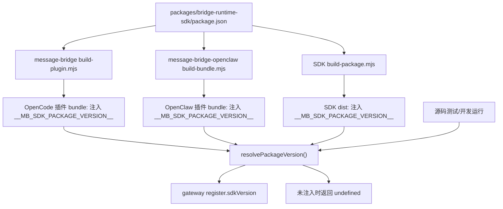
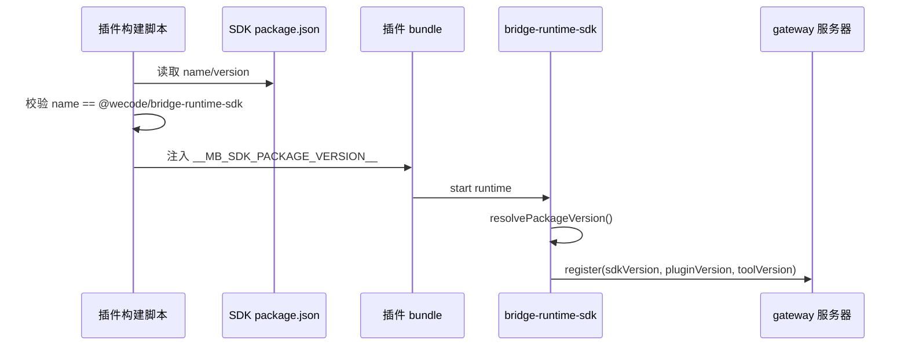
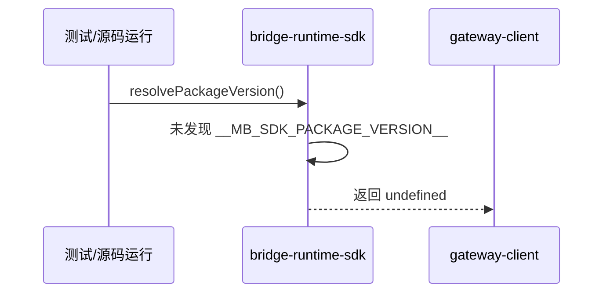

# `bridge-runtime-sdk 包版本上报方案`

- Version：`1.0`
- Date：`2026-07-20`
- Status：`Active`
- Owner：`bridge-runtime-sdk maintainers`
- 方案日期：`2026-07-20`
- 目标工程：`@wecode/bridge-runtime-sdk`、`@wecode/skill-opencode-plugin`、`@wecode/skill-openclaw-plugin`
- 参考文档：`packages/bridge-runtime-sdk/AGENTS.md`、`docs/rules/engineering.md`、`docs/rules/testing.md`
- 方案类型：`SDK 构建注入与 gateway register 元数据上报`

## 1. 背景

### 1.1 场景说明

`bridge-runtime-sdk` 在 gateway register 握手中负责自动补充 `sdkVersion`。SDK 自身构建分发包时，会通过 esbuild `define` 注入 `globalThis.__MB_SDK_PACKAGE_VERSION__`，`packages/bridge-runtime-sdk/src/packageVersion.ts` 再读取该常量作为 SDK 包版本。

仓库内两个插件 `plugins/message-bridge` 和 `plugins/message-bridge-openclaw` 并不是消费 SDK 已构建的 `dist` 产物，而是通过 workspace 依赖引用 `@wecode/bridge-runtime-sdk` 源码并在插件构建阶段整体 bundle。因此，插件分发产物不会自动继承 SDK 构建脚本中的 `__MB_SDK_PACKAGE_VERSION__` 注入逻辑。

现状下插件仍会上报 `pluginVersion`，gateway register 不会失败；但 `sdkVersion` 字段缺失，服务端无法基于 SDK 版本做版本识别、灰度治理、准入或排障。

### 1.2 需求目标

1. 插件分发 bundle 中稳定注入并上报 `sdkVersion`。
2. SDK runtime 只读取构建注入的版本常量，不在运行时读取 `package.json`。
3. 插件构建脚本在打包前读取 SDK `package.json`，并把版本注入插件 bundle。
4. 插件分发产物不能依赖携带 `packages/bridge-runtime-sdk/package.json` 或源码目录。
5. 保持 `pluginVersion`、`toolVersion` 和 `sdkVersion` 的语义边界清晰。

### 1.3 非目标

1. 不调整 gateway register 协议字段名称和 schema 语义。
2. 不允许插件或外部集成方通过 runtime 配置覆盖 `sdkVersion`。
3. 不改变 `pluginVersion` 的注入常量：OpenCode 插件继续使用 `__MB_PACKAGE_VERSION__`，OpenClaw 插件继续使用 `__MB_PLUGIN_PACKAGE_VERSION__`。
4. 不要求插件发布包携带 SDK 源码目录或 SDK `package.json`。
5. 不修改服务端对 `sdkVersion` 的业务处理逻辑。

## 2. 方案图

### 2.1 整体方案图



### 2.2 方案核心

以构建期注入 `__MB_SDK_PACKAGE_VERSION__` 作为 SDK runtime 的唯一版本来源。插件因为通过 workspace 源码 bundle SDK，无法复用 SDK 自身构建产物的注入结果，因此由插件构建脚本读取 SDK `package.json` 并注入同名常量。

## 3. 时序图

### 3.1 `插件分发产物 register 上报 sdkVersion`



### 3.2 `源码环境未注入时降级`



## 4. 技术细节

### 4.1 调整点

1. `packages/bridge-runtime-sdk/src/packageVersion.ts`
   - 优先读取 `globalThis.__MB_SDK_PACKAGE_VERSION__`。
   - 未注入时返回 `undefined`。
   - 不导入 `node:fs`，不读取 SDK 源码 `package.json`。
2. `plugins/message-bridge/scripts/build-plugin.mjs`
   - 构建插件 bundle 前通过 `createRequire(import.meta.url).resolve('@wecode/bridge-runtime-sdk/package.json')` 定位 SDK manifest。
   - 校验 SDK 包名并取得版本。
   - 在 esbuild `define` 中注入 `globalThis.__MB_SDK_PACKAGE_VERSION__`。
3. `plugins/message-bridge-openclaw/scripts/build-bundle.mjs`
   - 与 OpenCode 插件一致，在 bundle 构建时显式注入 SDK 包版本。
   - SDK manifest 路径同样通过 Node.js 模块解析获取，避免依赖 `../../packages/` 这类跨包相对路径。
   - 只对运行主入口 `bundle/index.js` 注入 SDK 版本；setup entry 不参与 gateway runtime register，不需要注入。
4. 测试更新
   - SDK 单测覆盖注入优先和未注入时返回 `undefined`。
   - SDK gateway host contract 测试覆盖未注入时省略 `sdkVersion`。
   - OpenCode runtime register 测试覆盖有构建注入时上报 SDK 版本。
   - OpenClaw bundle artifact 测试覆盖插件 bundle 中包含 SDK 注入版本。

### 4.2 核心实现方式

SDK resolver 只读取构建注入常量：

```ts
export function resolvePackageVersion(): string | undefined {
  return readInjectedPackageVersion() ?? undefined;
}
```

插件构建脚本不依赖 SDK 的 `build-package.mjs`。插件 bundle 是最终分发产物，因此最终 bundle 的构建脚本必须自己读取 SDK workspace manifest，并通过 esbuild `define` 把 SDK 版本内联到产物中。

SDK runtime 不在运行时读取 `package.json`。这避免了源码目录、bundle 输出目录和发布包内容之间形成隐式依赖，也避免 SDK runtime 同时维护“构建注入”和“文件读取”两套版本来源。

### 4.3 兼容与边界

1. 对 gateway 协议兼容：`register.sdkVersion` 已是可选字段；本方案只让插件更稳定地提供该字段。
2. 对现有插件兼容：`pluginVersion` 继续按插件自身构建常量注入，gateway 仍能同时看到 `sdkVersion` 和 `pluginVersion`。
3. 对宿主版本语义兼容：`toolVersion` 继续表示 OpenCode/OpenClaw 宿主版本，不复用插件或 SDK 包版本。
4. 对分发产物边界兼容：插件 bundle 运行时不读取 `packages/bridge-runtime-sdk/package.json`，也不要求发布包包含该目录。
5. 对异常路径降级：插件构建阶段无法解析或读取 SDK package 时直接构建失败，避免发布缺少 `sdkVersion` 的新产物。
6. 对误读防护：插件构建脚本校验 SDK manifest 的 `name` 必须为 `@wecode/bridge-runtime-sdk`。

### 4.4 相关接口联动

1. `BridgeGatewayHostConfig.register.pluginVersion`
   - 插件继续显式传入插件版本。
2. `normalizeBridgeGatewayHostConfig`
   - 继续由 SDK 内部调用 `resolvePackageVersion()` 并在有值时追加 `register.sdkVersion`。
3. `@agent-plugin/gateway-client`
   - `buildGatewayRegisterMessage` 继续按可选字段装配 `sdkVersion` 和 `pluginVersion`。
4. `@agent-plugin/gateway-schema`
   - `registerMessageSchema` 继续要求 `sdkVersion` 或 `pluginVersion` 至少存在一个，本方案不改 schema。
5. 插件构建脚本
   - OpenCode：`plugins/message-bridge/scripts/build-plugin.mjs`
   - OpenClaw：`plugins/message-bridge-openclaw/scripts/build-bundle.mjs`

### 4.5 文档需要同步修改的内容

1. 新增本文档记录版本来源、构建注入和运行时边界。
2. 若后续新增第三个 workspace 插件并通过源码 bundle SDK，应在该插件构建脚本中复用同样的 SDK 版本注入策略。
3. 若后续 SDK 发布形态从源码 workspace 引用改为消费 `dist` 包，应重新评估插件构建脚本是否仍需重复注入。

## 5. 性能

分发 bundle 中 `__MB_SDK_PACKAGE_VERSION__` 已被 esbuild 内联，运行时不产生文件系统读取。

源码开发或测试环境在未注入全局常量时不会读取文件，`resolvePackageVersion()` 直接返回 `undefined`。该路径不涉及高频循环、消息流处理或长连接心跳路径。

## 6. 功耗

不新增轮询、后台任务、定时器、长连接或额外网络请求。分发产物不新增运行时 I/O。

## 7. 埋码

1. `gateway.register.sent`
   - 说明：`gateway-client` 已在 register 发送日志中记录 `sdkVersion` 和 `pluginVersion`，本方案使插件分发产物中的 `sdkVersion` 字段稳定出现。
2. gateway register 报文
   - 说明：服务端可直接从 register payload 读取 `sdkVersion`，用于版本识别、准入、灰度或排障。
3. 可选埋码
   - 说明：不涉及新增客户端埋码事件。

## 8. 影响范围

### 8.1 直接影响

1. `@wecode/bridge-runtime-sdk` 的版本解析逻辑。
2. `@wecode/skill-opencode-plugin` 插件 bundle 构建产物。
3. `@wecode/skill-openclaw-plugin` 插件 bundle 构建产物。
4. gateway register 上报字段：插件场景下新增稳定的 `sdkVersion`。

### 8.2 间接影响

1. 服务端可以更可靠地区分 SDK 包版本和插件包版本。
2. 排障日志中的 `gateway.register.sent.sdkVersion` 更完整。
3. 后续 SDK 版本准入、兼容矩阵和灰度策略具备客户端字段基础。

### 8.3 不影响

1. 不影响 `pluginVersion` 的读取和上报。
2. 不影响 `toolVersion` 对宿主版本的表达。
3. 不影响 gateway 下行命令、上行消息投影、session isolation 或 provider fact 协议。
4. 不影响 OpenClaw setup entry。
5. 不影响服务端 register schema。

## 9. 测试范围

### 9.1 功能测试

1. `packages/bridge-runtime-sdk/tests/unit/packageVersion.test.ts`
   - 验证注入常量优先。
   - 验证未注入时返回 `undefined`。
2. `packages/bridge-runtime-sdk/tests/contract/gateway-runtime-host.test.ts`
   - 验证 normalize 后 register 保留 `pluginVersion` 并补充 `sdkVersion`。
3. `plugins/message-bridge/tests/unit/sdk-runtime-register.test.mjs`
   - 验证 OpenCode 插件 runtime register 报文包含 SDK package version。
4. `plugins/message-bridge-openclaw/tests/integration/bundle-artifact.test.mjs`
   - 验证 OpenClaw bundle artifact 包含 SDK 注入版本。

### 9.2 兼容测试

1. 构建期无 `MB_DEFAULT_GATEWAY_URL` 和有自定义 `MB_DEFAULT_GATEWAY_URL` 两种路径均应保留 SDK 版本注入。
2. SDK `build` 和 `pack:check` 应确认分发包仍可导入，且 `resolvePackageVersion()` 返回构建注入版本。
3. OpenClaw integration 测试需单独运行，避免并行构建清理 `@wecode/skill-qrcode-auth` dist 时导致 esbuild 解析失败。

### 9.3 文档一致性检查

1. 本文档路径位于 `packages/bridge-runtime-sdk/docs/design/`，符合 SDK 包级设计文档归属。
2. 文档只记录 SDK 版本上报长期方案，不复制一次性执行计划。
3. 字段语义与 `packages/bridge-runtime-sdk/AGENTS.md` 保持一致：`toolVersion` 表示宿主 agent 版本，`pluginVersion` 表示插件封装版本，`sdkVersion` 由 SDK 自动注入。

## 10. 最终建议

最终建议采用“SDK runtime 只读构建注入 + 插件构建期显式读取并注入”的方案。构建期注入是 SDK 版本的唯一运行时真源，能保证插件 bundle 不依赖仓库源码目录，也避免 SDK runtime 在生产路径上读取文件。

后续新增通过 workspace 源码 bundle `@wecode/bridge-runtime-sdk` 的插件时，应同步在该插件构建脚本中读取并注入 `globalThis.__MB_SDK_PACKAGE_VERSION__`。若 SDK 后续切换为插件消费已构建 `dist` 包，应重新评估是否可以移除插件侧重复注入逻辑。
