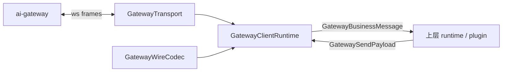

# gateway-client 模块架构

**Version:** 1.0  
**Date:** 2026-05-13  
**Status:** Active  
**Owner:** agent-plugin maintainers  
**Related:** `../../../docs/architecture/gateway-client-architecture.md`, `../../gateway-schema/docs/gateway-schema-architecture.md`, `../../bridge-runtime-sdk/docs/bridge-runtime-sdk-architecture.md`, `../../../docs/architecture/repository-architecture-overview.md`

## In Scope

1. 说明 `@agent-plugin/gateway-client` 作为共享连接运行时的职责边界。
2. 说明其内部 transport、握手、READY、心跳、重连与入站帧处理的结构分工。
3. 说明其与 `gateway-schema`、插件 runtime、host runtime 的协作关系。

## Out of Scope

1. 不重复定义 wire 协议字段或 message schema。
2. 不说明插件侧业务动作语义。
3. 不记录迁移任务、旧兼容层删除计划或测试执行步骤。

## External Dependencies

1. `@agent-plugin/gateway-schema` 提供共享 protocol schema、validator 与 downstream normalizer。
2. `ai-gateway` 提供 register、heartbeat、下行业务请求与控制帧语义。
3. 上层插件或 runtime 通过 `GatewayClient` facade 消费稳定连接能力。

## 1. 架构目标

`gateway-client` 围绕以下目标组织：

1. 把 WebSocket 建链、握手、READY、心跳、重连与入站帧分类收敛为共享运行时。
2. 把协议校验与连接状态机分离，避免插件侧重复维护 transport 细节。
3. 对上层只暴露稳定 client contract，不暴露 transport 实现细节。

## 2. 角色与边界

| 角色 | 职责 |
|---|---|
| `gateway-client` | 连接运行时、状态机、控制帧处理、业务帧分类、出站门禁 |
| `gateway-schema` | 协议定义、上下行 schema 校验与 normalizer |
| 上层 runtime | 消费 `GatewayClient`、处理业务消息、决定业务结果 |

边界原则：

1. `gateway-client` 负责 transport 连接，不负责解释 `chat`、`create_session` 等业务动作。
2. `gateway-client` 不维护第二份 wire schema，必须通过 `gateway-schema` 消费共享协议能力。
3. READY 之前不允许透传业务 send，也不允许把业务 downstream 交给上层。

## 3. 总体架构图



## 4. 内部分层

| 层 | 目录/对象 | 职责 |
|---|---|---|
| domain 层 | `src/domain/*` | 状态、错误契约、发送上下文、重连配置 |
| ports 层 | `src/ports/*` | client、transport、codec、auth、scheduler、logger 抽象 |
| adapters 层 | `src/adapters/*` | WebSocket transport、schema codec、心跳与重连调度器默认实现 |
| application 层 | `src/application/*` | 运行时主编排、入站帧分类、握手处理、重连与 telemetry |
| factory/auth 层 | `src/factory/*`, `src/auth/*` | register message 装配、host/testing 工厂、AK/SK subprotocol builder |

## 5. 关键主链路

### 5.1 建链与 READY 链路

```text
connect()
  -> ConnectSession
  -> GatewayTransport open
  -> register send
  -> HandshakeFrameProcessor
  -> READY
  -> HeartbeatLoop start
```

关键点：

1. `connect()` resolve 表示连接建立流程进入稳定可用状态，不代表上层拥有业务语义。
2. READY 由控制帧和状态机共同决定，不允许业务层手动跳过。
3. 心跳只在 READY 后启动。
4. `register` 控制帧固定由 runtime 内部发送，当前共享协议会携带 `toolType`、`toolVersion`，以及按场景出现的 `sdkVersion` / `pluginVersion`。

### 5.2 入站帧链路

```text
raw frame
  -> InboundFrameClassifier
  -> control / business / invalid / parse_error / decode_error
  -> HandshakeFrameProcessor or InboundFrameRouter
  -> 上层 runtime
```

关键点：

1. 入站帧必须先被分类，再决定交给握手处理还是业务处理。
2. 业务层只消费稳定 `GatewayBusinessMessage` 或结构化 invalid frame。
3. 控制帧与业务帧拥有不同处理路径，避免业务层误处理握手状态。

### 5.3 出站链路

```text
GatewaySendPayload
  -> OutboundProtocolGate
  -> OutboundSender
  -> GatewayTransport
  -> ai-gateway
```

关键点：

1. 出站门禁负责阻止未 READY 时发送业务消息。
2. 控制帧由运行时内部编排，上层不直接发送 `register` 或 `heartbeat`。
3. 出站观测统一进入 telemetry 与 logger。
4. `gateway.register.sent` 日志应覆盖 `toolType`、`toolVersion`、`sdkVersion`、`pluginVersion`，便于排查接入端、宿主和桥接实现版本问题。

## 6. 关键约束

1. `gateway-client` 只暴露稳定 facade，不暴露 transport 内部实现路径作为公共契约。
2. `GatewayInboundFrame` 必须保留 invalid frame 的结构化上下文，供上层 fail-closed。
3. 重连策略由共享 runtime 和工厂装配决定，不允许各插件偷偷覆盖默认语义。
4. 协议校验能力必须来自 `gateway-schema`，不允许再写一套本地 parser 语义。

## 7. 失败处理与 fail-closed 边界

1. READY 前业务 send 必须被拒绝。
2. `register_rejected`、明确禁止重连的 close code 不自动重连。
3. decode / parse / invalid frame 必须被结构化暴露，不能当作正常业务消息继续处理。
4. transport 意外关闭时，由重连编排器决定是否重连，不允许业务层直接假设连接仍可用。
5. 当前实现不对旧版 register 协议做自动降级；若对端网关不接受新的 `sdkVersion` / `pluginVersion` 字段，握手失败属于协议不兼容而非运行时容错范围。

## 8. 延伸阅读

1. 历史共享 client 架构页：`../../../docs/architecture/gateway-client-architecture.md`
2. 协议边界：`../../gateway-schema/docs/gateway-schema-architecture.md`
3. 统一 bridge runtime：`../../bridge-runtime-sdk/docs/bridge-runtime-sdk-architecture.md`
