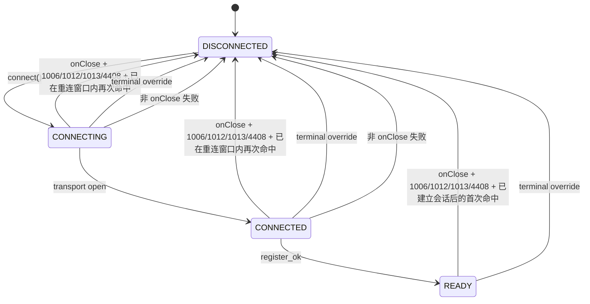
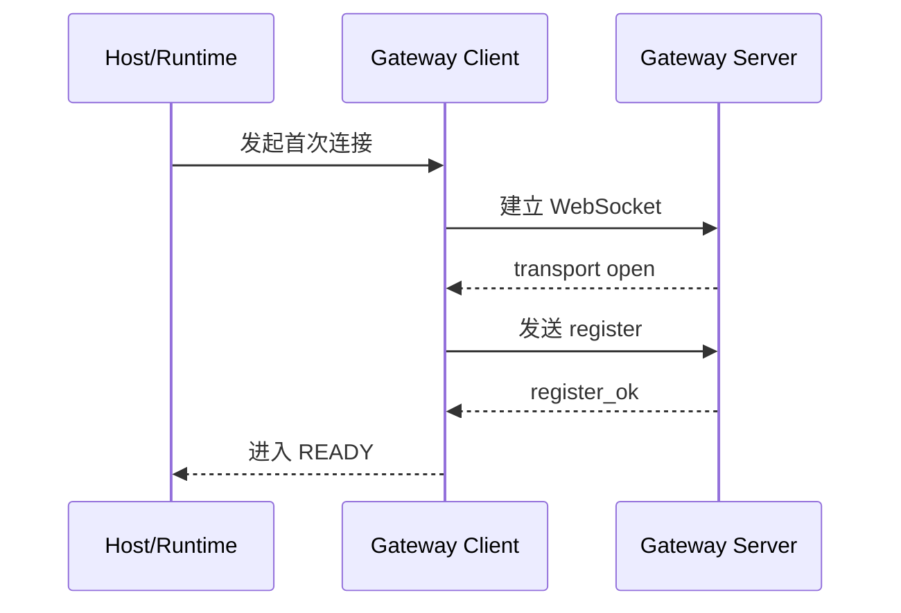
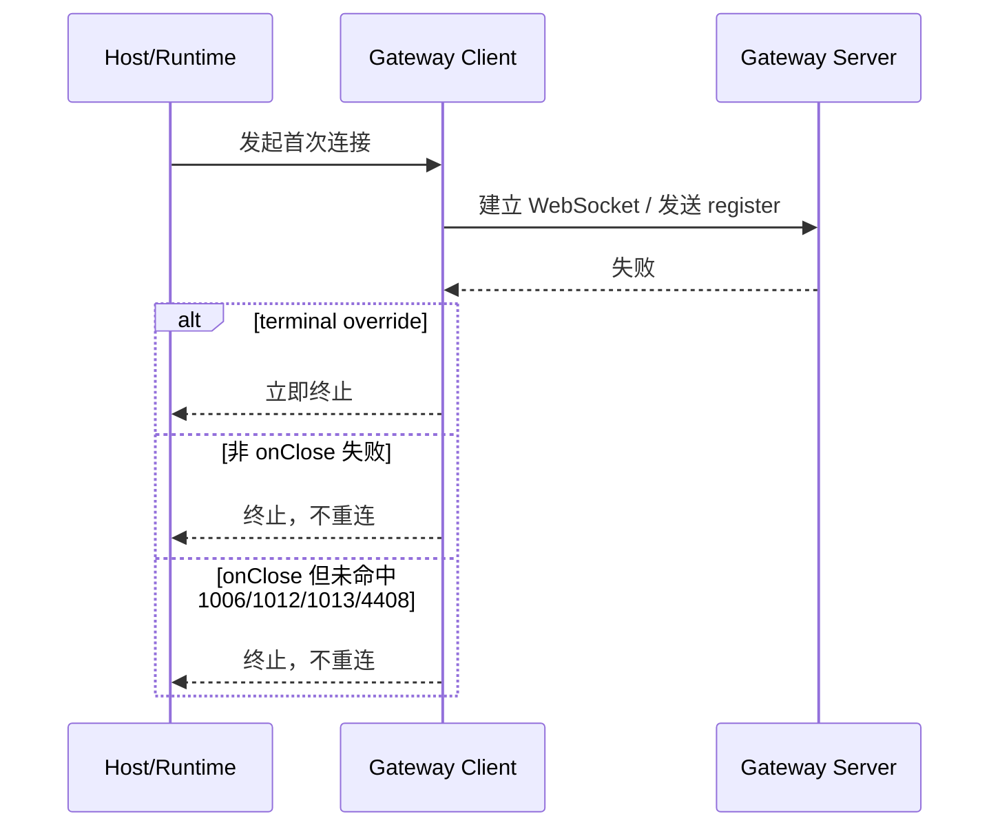
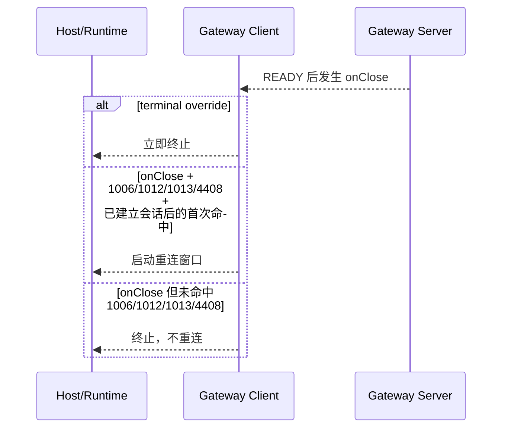
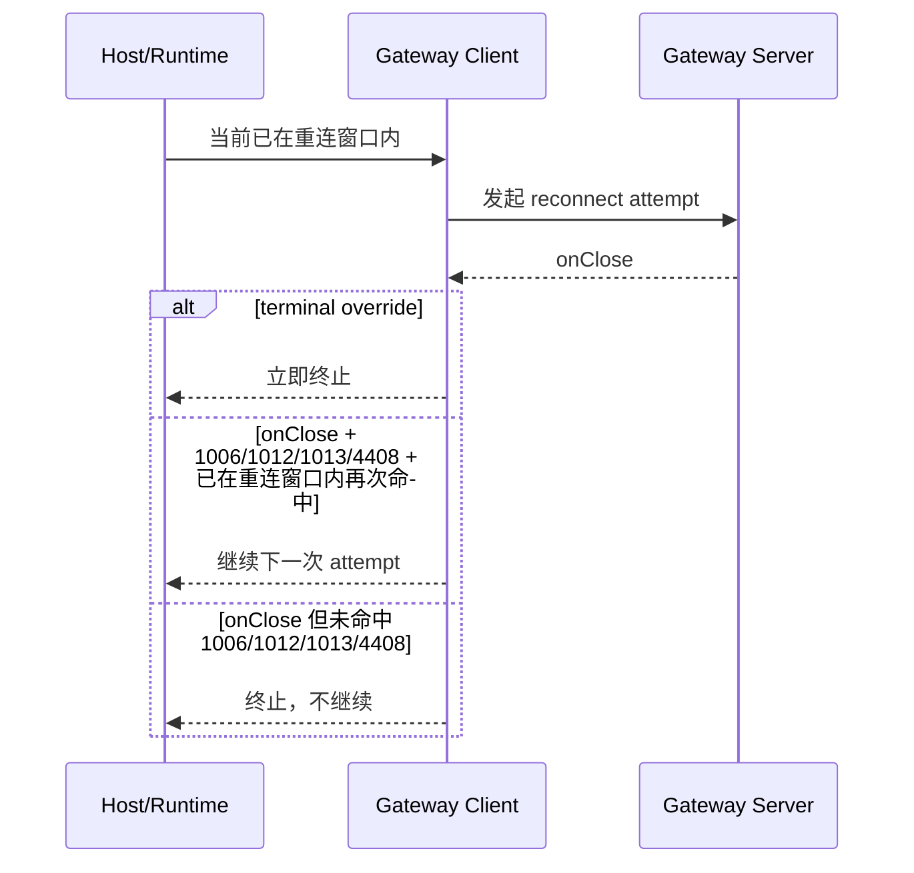
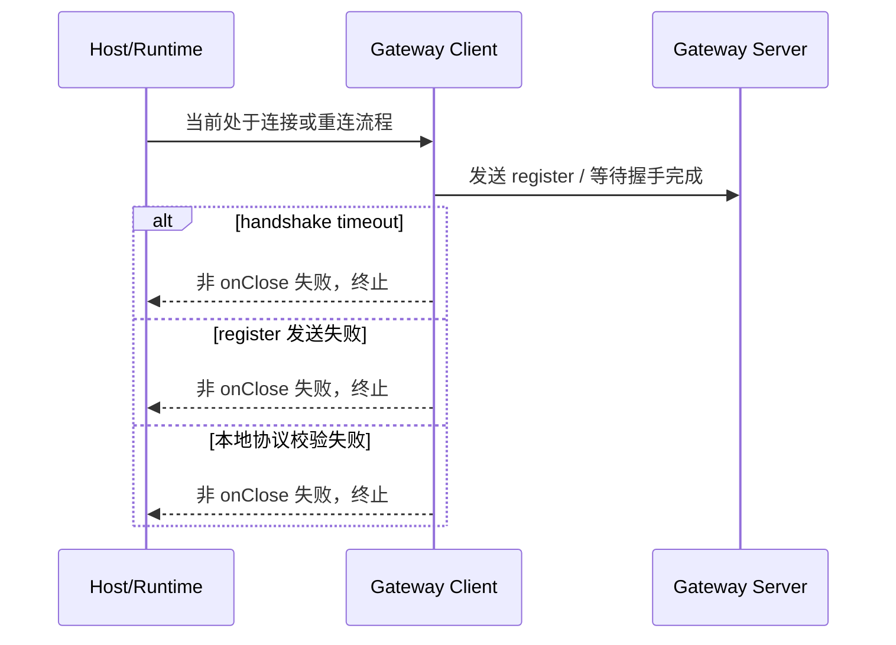
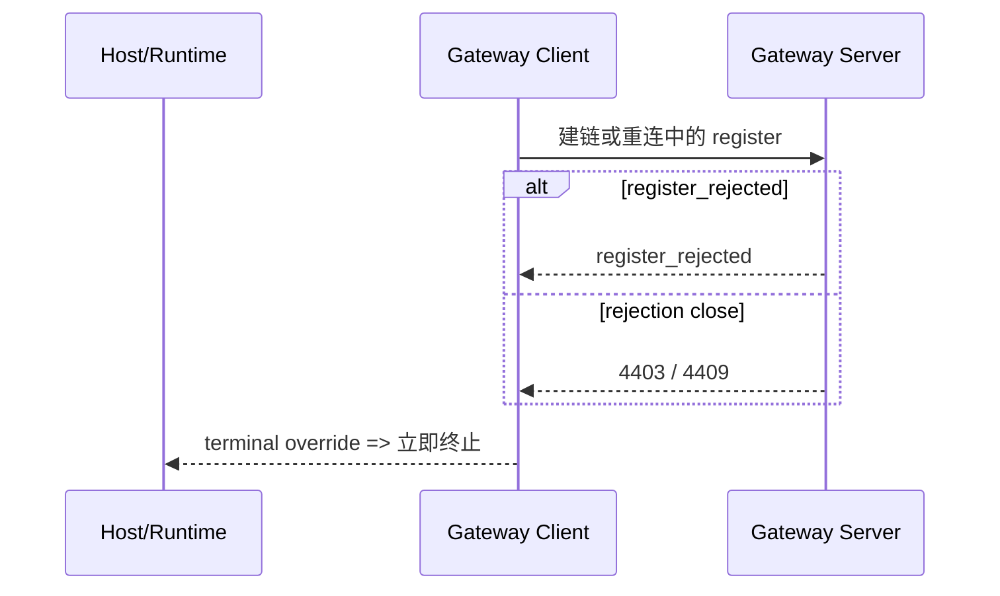
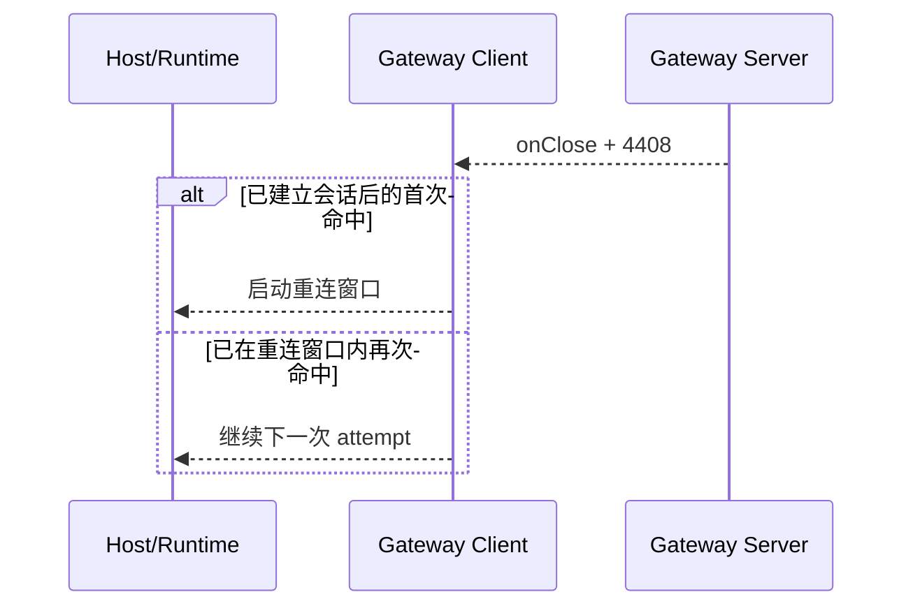
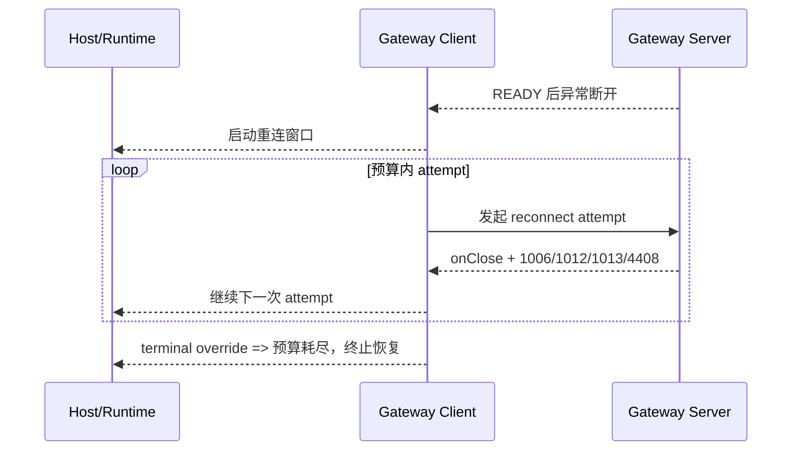

# Gateway Client 重连策略设计

**Version:** 2.1  
**Date:** 2026-05-11  
**Status:** Draft  
**Owner:** agent-plugin maintainers  
**Related:** [Gateway Client 协议边界上推与类型归一化改造设计](./protocol-boundary-typed-messages-design.md), [Gateway Client 架构](../../../docs/architecture/gateway-client-architecture.md)

## 1. 文档定位

本文描述 `gateway-client` 的目标态重连策略设计。

当前实现与本文存在已知差距。如需了解 current-state，应以当前代码与测试为准。

本文以下章节一律以目标设计为准，不逐段复述 current-state 特例。

本文覆盖：

- 自动恢复的 close-side eligibility facts
- 首次进入重连窗口与窗口内继续下一次 attempt 的恢复上下文差异
- 服务端明确拒绝与其他终止条件的优先级
- 上层可见 failure family 边界
- 状态图与关键时序图

本文不覆盖：

- 代码实现方式
- 重构步骤或实施计划
- backoff 算法细节
- 测试执行步骤

## 2. 背景

`gateway-client` 负责与 gateway 建立 WebSocket 连接、发送 `register`、进入 `READY`，并在会话异常断开后执行自动恢复。

这份文档的目标不是解释内部状态机细节，而是冻结 target-state 下的自动恢复语义，避免把 `shouldRetryOnClose()`、`GatewayClientError.retryable`、rejection 判定闭集并列解释为多个动作真源。

## 3. 目标与非目标

### 3.1 目标

1. 冻结自动恢复的正式准入规则，不再由抽象 `recoverable` 直接驱动，而是由更具体的 close-side eligibility facts 驱动。
2. 明确首次进入重连窗口与窗口内继续下一次 attempt 共享同一套 close 条件，动作差异只来自恢复上下文。
3. 保持现有 public contract，不新增 state、error code 或 failure family。
4. 显式写出 current-state 与 target-state 的差距，避免把 target-state 规则误读为 current-state 已有行为。

### 3.2 非目标

1. 不新增 `GatewayClientState`。
2. 不新增 `GatewayClientErrorCode`。
3. 不新增 availability family。
4. 不同步修改 current-state 实现。

## 4. 现状与目标差距

### 4.1 当前实现

- `READY` 后首次进入重连窗口，主要由 `onClose + 1006 / 1012 / 1013` 与取消条件共同决定。
- current-state 已稳定实现首次进入重连窗口与窗口内再次命中后的自动继续闭环。
- current-state 已按上游协议将 `4408` 视为 retryable close，并将 `4403 / 4409` 的对外 availability 收敛到 target-state 语义。

### 4.2 目标设计

- 首次进入重连窗口与窗口内继续下一次 attempt，共享同一套 close-side eligibility facts。
- target-state 以上游 `opencode-cui` 协议为真源，明确 `4408` 是 retryable close，而 `4403 / 4409` 是 terminal rejection close。

### 4.3 当前差距

- current-state 已有稳定的 close-side eligibility + recovery context 实现。
- 当前差距主要在于文档需要持续与实现同步，而不是协议语义本身尚未落地。

本文以下章节一律以目标设计为准，不逐段复述 current-state 特例。

## 5. 术语与状态语义

### 5.1 术语

- `首次连接阶段`
  指当前会话从 `DISCONNECTED` 开始，到第一次成功进入 `READY` 之前的 `pre_open` 与 `handshake` 过程。
- `已建立会话`
  指当前会话曾至少一次进入过 `READY`。
- `重连窗口`
  指已建立会话异常断开后，为恢复该会话而发起的一组连续 reconnect attempt。
- `recoverable`
  指失败语义上不是显式拒绝或本地不可恢复错误，可作为恢复过程中的中间失败理解。
- `close-side eligibility facts`
  指自动恢复准入依赖的底层 close 侧观测事实。
- `recovery context`
  指当前失败发生时处于“已建立会话后的首次命中”还是“已在重连窗口内再次命中”的恢复上下文。
- `reconnect-eligible`
  指在当前恢复上下文下，这次失败是否允许触发或继续自动恢复。

### 5.2 关系约束

- `terminal override` 命中时，一定不 `reconnect-eligible`
- `recoverable` 只表达失败语义，不单独产生自动恢复动作
- `reconnect-eligible` 由 close-side eligibility facts 与 recovery context 共同决定

`GATEWAY_HANDSHAKE_TIMEOUT` 可被视为语义上可恢复，但它不是 close-side eligibility fact，因此不自动继续下一次 attempt。

### 5.3 Public state

`gateway-client` 的 public state 保持不变：

- `DISCONNECTED`
- `CONNECTING`
- `CONNECTED`
- `READY`

“正在重连”仍是窗口级行为语义，不新增 `RECONNECTING`。

## 6. 顶层判定框架

自动恢复的顶层判定顺序固定为：

1. `terminal override`
2. `close-side eligibility facts`
3. `recovery context`

### 6.1 terminal override

高优先级终止条件先判定，命中即立即终止：

- `register_rejected`
- `4403`
- `4409`
- 手动 `disconnect`
- `abort` / cancellation
- 本地不可恢复错误
- 重连预算耗尽

`terminal override` 优先级最高，命中后不再进入自动恢复准入判断。

### 6.2 close-side eligibility facts

自动恢复的正式准入依赖以下 close 侧事实：

- 失败由 `onClose` 驱动
- 通用 retryable close：`1006 / 1012 / 1013`
- 协议特例 retryable close：`4408`
- 未命中 `terminal override`

这组事实同时适用于：

- 已建立会话后的首次异常断开
- 已在重连窗口内的 reconnect attempt 再次失败

### 6.3 recovery context

命中相同 close-side eligibility facts 后，动作由当前恢复上下文决定：

- 已建立会话后的首次命中 => 启动重连窗口
- 已在重连窗口内再次命中 => 继续下一次 attempt

两者共享同一套 close-side eligibility facts，动作差异由当前恢复上下文决定。

## 7. 现有事实来源

以下三类事实不能并列作为动作真源；target-state 吸收它们，但不让它们并列决策。

### 7.1 `shouldRetryOnClose()`

- current-state 中首次进入重连窗口的直接事实来源
- 覆盖统一 close-side eligibility 白名单语义
- 在 target-state 中继续作为 close-side eligibility 的直接依据

### 7.2 `GatewayClientError.retryable`

- current-state 中错误语义的辅助观测事实
- 可作为 `recoverable` 的实现映射参考
- 不是自动恢复准入的统一入口

### 7.3 rejection 判定闭集

- current-state 中 `terminal override` 的高优先级事实来源
- 包括 `register_rejected`
- 包括 `4403 / 4409`

## 8. `1006 / 1012 / 1013 / 4408` 的目标态角色

`1006 / 1012 / 1013 / 4408` 在 target-state 中定位为自动恢复准入的明确 close-side eligibility 子集。

三层关系固定如下：

- current-state：`1006 / 1012 / 1013` 已作为 `READY` 后首次进入重连窗口的已验证事实，`4408` 则需要按协议补齐。
- target-state：窗口内继续下一次 attempt 也沿用同一 eligibility 集合。
- 这一结论是 target-state 的策略性冻结，不是 current-state 的自然推导，也不包装成协议语义必然。

这样做的理由是：

- 首次进入窗口的主白名单已被 current-state 验证。
- `4408` 由上游协议显式定义为 register timeout close 且应自动重连，因此在 target-state 中与通用 transport retryable close 同层处理。
- target-state 为保持恢复语义一致性，规定窗口内继续沿用同一 eligibility 集合。
- 因此 implementer 不应自行扩展除 `1006 / 1012 / 1013 / 4408` 之外的其他 close code。

## 9. 重连条件设计

### 9.1 是否启动重连窗口

启动重连窗口需要同时满足：

- 当前处于已建立会话后的首次异常断开
- 失败由 `onClose` 驱动
- `close code ∈ {1006, 1012, 1013, 4408}`
- 非手动断开
- 非 `abort`
- 非 rejection
- reconnect 功能已启用
- 预算未耗尽

### 9.2 是否继续下一次 reconnect attempt

继续下一次 reconnect attempt 需要同时满足：

- 当前已在重连窗口内
- 本次失败由 `onClose` 驱动
- `close code ∈ {1006, 1012, 1013, 4408}`
- 非手动断开
- 非 `abort`
- 非 rejection
- 预算未耗尽

### 9.3 不进入自动继续的失败

以下失败不进入自动继续逻辑：

- `GATEWAY_HANDSHAKE_TIMEOUT`
- `register` 发送失败
- 本地协议校验失败
- 本地参数错误
- 其他非 `onClose` 失败

这些失败即使语义上可被视为 `recoverable`，也不是 close-side eligibility facts，因此不自动继续下一次 attempt。

### 9.4 设计结论

- 首次进入重连窗口与继续下一次 attempt，共享同一套 close-side eligibility facts。
- 两者差异不是 close 白名单不同，而是当前恢复上下文不同。

## 10. 失败矩阵

| 场景 | 是否命中 `terminal override` | 是否由 `onClose` 驱动 | `close code` 是否属于 `1006 / 1012 / 1013 / 4408` | 当前恢复上下文 | 是否 `reconnect-eligible` | 是否启动重连窗口 | 是否继续下一次 attempt | 最终对外 failure family |
|---|---|---|---|---|---|---|---|---|
| `READY` 后 `1006 / 1012 / 1013 / 4408` | 否 | 是 | 是 | 已建立会话后的首次命中 | 是 | 是 | 否 | 暂不终态 |
| `READY` 后其他 close code | 否 | 是 | 否 | 已建立会话后的首次命中 | 否 | 否 | 否 | `transport_unavailable` |
| 窗口内 attempt 的 `1006 / 1012 / 1013 / 4408` | 否 | 是 | 是 | 已在重连窗口内再次命中 | 是 | 否 | 是 | 暂不终态 |
| 窗口内 attempt 的其他 close code | 否 | 是 | 否 | 已在重连窗口内再次命中 | 否 | 否 | 否 | `transport_unavailable` |
| `handshake timeout` | 否 | 否 | 不适用 | 已在重连窗口内或首次连接阶段 | 否 | 否 | 否 | `remote_unavailable` |
| `register_rejected` | 是 | 否 | 不适用 | 任意 | 否 | 否 | 否 | `remote_unavailable` |
| `4403 / 4409` | 是 | 是 | 否 | 任意 | 否 | 否 | 否 | `remote_unavailable` |
| `4408` 最终耗尽 | 否 | 是 | 是 | 已建立会话后的首次命中或窗口内再次命中 | 否 | 否 | 否 | `transport_unavailable` |
| 本地协议/发送失败 | 是 | 否 | 不适用 | 任意 | 否 | 否 | 否 | 不映射 |
| 手动断开 / `abort` | 是 | 可有可无 | 不适用 | 任意 | 否 | 否 | 否 | 不映射 |
| 预算耗尽 | 是 | 不适用 | 不适用 | 已在重连窗口内 | 否 | 否 | 否 | 按最终失败语义沿用既有 family |

矩阵解读固定如下：

- `onClose + 1006/1012/1013/4408 + 已建立会话后的首次命中` => 启动重连窗口
- `onClose + 1006/1012/1013/4408 + 已在重连窗口内再次命中` => 继续下一次 attempt
- 非 `onClose` 失败 => 不继续
- rejection / 手动 / `abort` / 预算耗尽 => 终止

## 11. 上层可见 failure family 边界

本文继续保持现有 public contract，不新增 failure family：

- `transport_unavailable`
- `remote_unavailable`
- 不映射

边界如下：

- 服务端明确拒绝、握手拒绝、握手超时、握手无效 => `remote_unavailable`
- transport 类持续失败、`4408` 最终耗尽及其他 transport close 的最终耗尽 => `transport_unavailable`
- 参数错误、诊断错误、取消 => 不映射

维度关系如下：

- `terminal override`、close-side eligibility facts、recovery context 是决策层
- failure family 是对外表达层
- 二者相关，但不是同一概念

## 12. Gateway Client 状态图

下图只保留 current public state，不新增 `RECONNECTING`。guard condition 以 target-state 语义表达，不直接承担 failure family 映射；映射以失败矩阵与“上层可见 failure family 边界”章节为准。

图后说明：

- 两条自动恢复路径共享同一套 close-side eligibility facts。
- 状态图不直接承担 failure family 映射，映射以矩阵和“上层可见 failure family 边界”章节为准。

## 13. 关键路径时序图

### 13.1 首次连接成功进入 `READY`

### 13.2 首次连接阶段失败直接终止

### 13.3 已建立会话后的首次命中启动重连窗口

### 13.4 重连窗口内再次命中继续下一次 attempt

### 13.5 非 `onClose` 失败直接终止

### 13.6 服务端明确拒绝立即终止

### 13.7 `4408` 驱动自动恢复

### 13.8 预算耗尽终止恢复

## 14. 设计结论

本文将 `gateway-client` 重连策略明确冻结为 target-state 设计文档：正文规则、图和矩阵全部以 close-side eligibility facts 与 recovery context 为准，current-state 仅在“现状与目标差距”中单独说明。

核心结论如下：

1. 自动恢复的正式准入规则不再由抽象 `recoverable` 直接驱动，而是由更具体的 close-side eligibility facts 驱动。
2. 首次进入重连窗口与窗口内继续下一次 attempt，共享同一套 close 条件：`onClose + 1006 / 1012 / 1013 / 4408 + 非 terminal`。
3. 两者动作不同，不是因为 close 条件不同，而是因为当前恢复上下文不同。
4. 非 `onClose` 失败不进入自动继续逻辑。
5. public contract 保持不变，不新增 state、error code 或 failure family。
