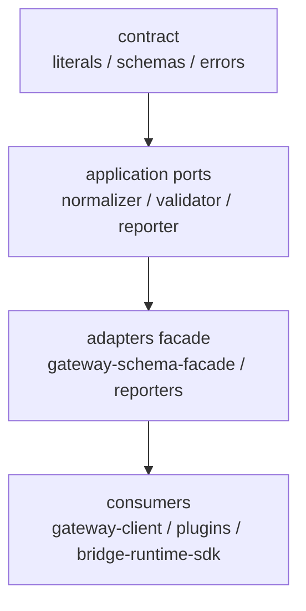

# gateway-schema 模块架构

**Version:** 1.0  
**Date:** 2026-05-13  
**Status:** Active  
**Owner:** agent-plugin maintainers  
**Related:** `../../../docs/architecture/gateway-schema-architecture.md`, `../../../docs/design/interfaces/gateway-schema-event-contract.md`, `../../gateway-client/docs/gateway-client-architecture.md`, `../../bridge-runtime-sdk/docs/bridge-runtime-sdk-architecture.md`

## In Scope

1. 说明 `@agent-plugin/gateway-schema` 作为共享协议边界包的职责边界。
2. 说明其如何为插件、`gateway-client` 与 `bridge-runtime-sdk` 提供稳定协议真源。
3. 说明其内部 contract、facade 与 reporter 的分工。

## Out of Scope

1. 不逐项展开所有协议字段和 event payload 细节。
2. 不解释 runtime 内部命令、provider SPI 或宿主细节。
3. 不记录演进计划、迁移顺序或实现任务。

## External Dependencies

1. `zod` 用于 schema 校验与结构化错误生成。
2. `ai-gateway` 协议语义决定 upstream/downstream/control message 的边界。
3. `gateway-client`、`message-bridge`、`message-bridge-openclaw`、`bridge-runtime-sdk` 共同消费该包。

## 1. 架构目标

`gateway-schema` 围绕以下目标组织：

1. 成为共享协议边界唯一真源，避免多个模块重复拥有同一字段语义。
2. 把“协议定义”“校验 facade”“失败报告”分层隔离。
3. 让上游消费者只依赖稳定包入口，而不依赖内部源码布局。

## 2. 角色与边界

| 角色 | 职责 |
|---|---|
| `gateway-schema` | 提供 upstream/downstream/wire protocol schema、literals、validator facade |
| 消费方模块 | 读取稳定 contract 与 facade，不重新定义协议语义 |

边界原则：

1. `gateway-schema` 定义“协议是什么、是否合法”，不定义 runtime 如何执行。
2. `gateway-schema` 不持有连接状态机、业务动作分发或宿主 provider 语义。
3. 字段真源、union 关系、错误形状必须由该包集中持有。

## 3. 总体架构图



## 4. 内部分层

| 层 | 目录/对象 | 职责 |
|---|---|---|
| contract 层 | `src/contract/*` | downstream、upstream、wire-protocol、tool-event 的 schema、literals、错误类型 |
| shared 层 | `src/shared/*` | 边界公用类型、result、type guard |
| application port 层 | `src/application/ports/*` | downstream normalizer、validator、failure reporter 抽象 |
| adapter / facade 层 | `src/adapters/*` | 默认 facade、recording/noop reporter |

## 5. 关键主链路

### 5.1 下行校验链路

```text
raw downstream payload
  -> downstream schema
  -> normalize result
  -> consumer runtime
```

关键点：

1. 下行业务请求的合法性必须先经 schema 判定。
2. 归一化结果供 runtime 消费，避免各模块自行解析 raw payload。
3. invalid invoke 的结构化 violation 必须可被上层 fail-closed 使用。

### 5.2 上行校验链路

```text
uplink business message
  -> tool_event / tool_done / tool_error / session_created / status_response schema
  -> validation result
  -> gateway-client send or runtime report
```

关键点：

1. 上行业务消息也必须有共享 schema 真源。
2. `tool_event.event` 的 payload family 归该包持有，不由单个插件定义。
3. validator facade 统一承接上行合法性检查。

### 5.3 register 控制帧链路

`register` 控制帧当前由该包定义为稳定共享真源，字段至少包括：

1. `deviceName`
2. `macAddress`
3. `os`
4. `toolType`
5. `toolVersion`
6. `sdkVersion`
7. `pluginVersion`

关键点：

1. `toolType` 表示当前接入端类型，由调用方定义并透传。
2. `toolVersion` 表示宿主 agent 版本，不等于插件或 SDK 自身版本。
3. `sdkVersion` 表示 `bridge-runtime-sdk` 版本；只要链路经过 SDK，就由 SDK 自动注入。
4. `pluginVersion` 表示上层插件版本；存在插件封装层时由插件显式提供。
5. `register` 至少需要 `sdkVersion` 或 `pluginVersion` 之一，本次协议升级不提供旧 register 结构的 schema 兼容入口。

## 6. 关键约束

1. 任何共享协议变更都应首先体现在 `gateway-schema`，而不是先在插件实现中漂移。
2. 包入口只暴露稳定 contract 与 facade；消费者不应依赖内部文件路径。
3. `GatewayWireProtocol`、`GatewayDownstreamBusinessRequest`、`GatewayUplinkBusinessMessage` 等 umbrella term 必须在该包内保持单一定义。
4. failure reporter 是辅助观测接口，不应反向拥有协议语义所有权。
5. register 控制帧字段一旦升级为必填，共享 schema 默认按新协议 fail-closed，不承担旧网关自动降级兼容。

## 7. 失败处理与 fail-closed 边界

1. schema 校验失败时必须产生结构化 violation，而不是模糊字符串错误。
2. 当消费者收到 invalid result 时，应中止继续执行，而不是尝试容错推断业务意图。
3. reporter 可记录失败，但不得把失败重写为成功结果。

## 8. 延伸阅读

1. 历史协议层架构：`../../../docs/architecture/gateway-schema-architecture.md`
2. 事件契约：`../../../docs/design/interfaces/gateway-schema-event-contract.md`
3. 连接运行时：`../../gateway-client/docs/gateway-client-architecture.md`
