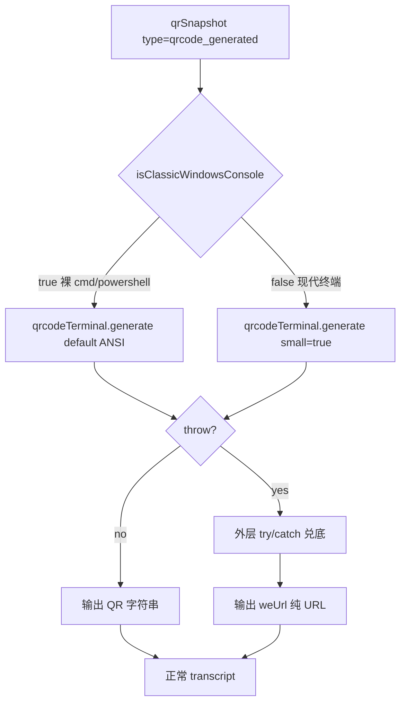
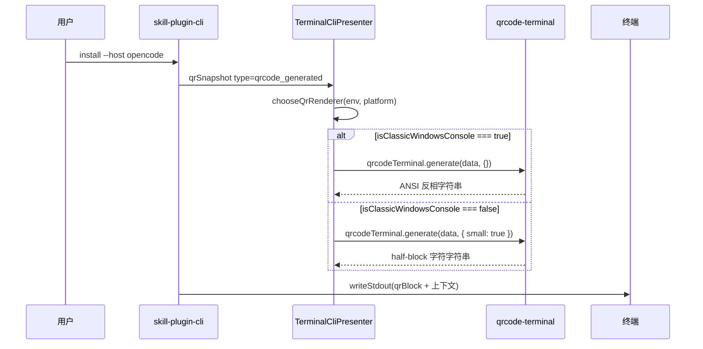

# `skill-plugin-cli` 终端二维码渲染方案

**Version:** 0.10
**Date:** 2026-07-30
**Status:** Implemented
**Owner:** agent-plugin maintainers
**Implementation:** 2026-07-30 — 从 0.9 状态起，回退 `is-unicode-supported` 库为自写 `isClassicWindowsConsole(env, platform)` 三元负向判定；true 走 ANSI 反相、false 走 `qrcode-terminal` half-block 紧凑模式；0.9 漏判的 6+ 终端（WezTerm / JetBrains WebStorm/IntelliJ/GoLand / ConEmu 原生 等）被治愈
**Related:** [统一安装 CLI 方案](./solution.md), [二维码扫码授权方案设计](../../../docs/design/qrcode-auth-session-solution.md), [代码治理规则](../../../docs/rules/engineering.md), [变更治理规则](../../../docs/rules/change-management.md)

## 1. 文档定位

本文冻结 `skill-plugin-cli` 在终端中渲染二维码的依赖、字符集、终端能力分支与兜底契约。

本文负责定义：

- 二维码渲染路径的依赖选型（`qrcode-terminal`，无新增依赖）
- 终端能力探测规则（基于自写 `isClassicWindowsConsole` 三元负向判定）
- 两种渲染分支：现代终端（Unicode half-block）、裸 cmd / PowerShell（ANSI 反相）
- `TerminalCliPresenter.renderQrCode` 的内部职责、调用方契约、构造函数注入方式
- verbose 诊断契约

本文不负责定义：

- 二维码认证协议、扫码流程、状态机
- `skill-plugin-cli` 整体安装流程、阶段模型、host 适配器
- 二维码图片输出、浏览器跳转等替代交付形态

## 2. 冻结结论

1. 依赖：`qrcode-terminal@^0.12.0`（cce4b53 既有）；0.9 引入的 `is-unicode-supported@^2.1.0` **已删除**，净依赖回到 0 增量
2. 终端能力探测恢复自写 `isClassicWindowsConsole(env, platform)` 三元负向判定（cce4b53 实现），仅在 win32 + 无 `WT_SESSION` / `TERM_PROGRAM` / `ConEmuPID` 时返回 true
3. 渲染分支按以下优先级：
   1. `isClassicWindowsConsole() === true`（裸 cmd / PowerShell）：`qrcodeTerminal.generate(data, ...)`（默认 ANSI 反相），输出 `\033[40m  \033[0m` + `\033[47m  \033[0m`，每模块 2 字符宽，依赖 VT
   2. `isClassicWindowsConsole() === false`（现代终端）：`qrcodeTerminal.generate(data, { small: true }, ...)`，输出 `▀` (U+2580) / `▄` (U+2584) / `█` (U+2588) + 空格，紧凑
   3. 任何分支抛错（`addData` / `make` 异常、stdout EPIPE）：保留外层 `try/catch` 兜底为 `weUrl` 纯 URL
4. `TerminalCliPresenter` 构造函数签名扩展为 `(qrCodeRenderer?: (data) => string, shouldRenderHyperlink?: () => boolean, verbose?: boolean)`，默认 `verbose=false`；既有 mock 注入测试零回归
5. `chooseQrRenderer(env?: NodeJS.ProcessEnv, platform?: NodeJS.Platform)` 函数接受可注入的 env/platform，默认 `process.env` / `process.platform`；测试可注入
6. `isClassicWindowsConsole` 函数**恢复 cce4b53 实现**（3 条件 env 负向判定 + 1 个 `platform !== "win32"` 早返回 guard）；`probeHyperlinkSupport` 改用之作为 OSC 8 gate
7. ASCII 渲染路径（`renderAsciiQr` / `renderWithQrChoice`）保留删除——ANSI 反相模式由 `qrcode-terminal` 库自带，不依赖自写
8. verbose 模式打印 `[skill-plugin-cli][verbose] qrcode renderer: <kind> (<reason>)`，仅当 `verbose=true` 且 `qrCodeRenderer === renderQrCode`（未注入 mock）

## 3. 背景与根因

### 3.0 根因分析

**原始问题**：在低版本 cmd / Windows PowerShell 裸启动（无现代终端模拟器包装）时，QR 渲染异常（乱码、方块、不可扫）时有发生；同一 cmd 上直接运行 `qrcode-terminal "url"` CLI 正常。

**关键事实**：

- `▀`/`▄`/`█`（U+2580/U+2584/U+2588）属 Unicode Block Elements，Unicode 1.0（1991）定义，主流字体（Consolas / Cascadia Code / Cascadia Mono / NSimSun）都应包含
- 但在低版本 Windows（早于 1903）的 cmd / PowerShell 默认点阵字体（Terminal / 旧版 Lucida Console）上，这三个 codepoint **字形缺失**，被替换为 `?` 或空方块
- 现代终端模拟器（Windows Terminal / VS Code / ConEmu / WezTerm / JetBrains WebStorm 等）通常在子进程 env 注入 `WT_SESSION` / `TERM_PROGRAM` / `ConEmuPID` 等标记

**根因**：cmd / PowerShell 裸启动（无任何现代终端模拟器包装）使用系统默认字体，在低版本 Windows 上字形支持不全，导致 half-block 字符不可渲染。

**本方案选择**："裸 cmd/powershell 走 ANSI"——

- `isClassicWindowsConsole()` 三元负向判定：win32 + 无 `WT_SESSION` / `TERM_PROGRAM` / `ConEmuPID`
- true（裸 cmd/powershell）→ ANSI 反相（不依赖字体字形，依赖 VT）
- false（其余一律现代终端，包括 0.9 用 is-unicode-supported 漏判的 WezTerm / JetBrains WebStorm/IntelliJ/GoLand / ConEmu 原生 / Alacritty `TERM_PROGRAM=Alacritty` 等）→ half-block 紧凑

**对比 0.9**：0.9 用 `is-unicode-supported` 库的 10 条白名单（漏判 6+ 终端），0.10 改用自写三元负向（漏判 0）；副作用是 0.10 牺牲一个第三方依赖。

### 3.1 设计原则

**渲染能力选择遵循"裸 cmd/powershell 走 ANSI、现代终端走 half-block"**：

| `isClassicWindowsConsole()` | 实际场景 | 渲染策略 | 视觉 |
|---|---|---|---|
| `true` | win32 + 无 `WT_SESSION` / `TERM_PROGRAM` / `ConEmuPID`（裸 cmd / PowerShell） | ANSI 反相（不依赖字体字形） | 较宽（2 字符/模块） |
| `false` | macOS / Linux / 任何带现代终端模拟器包装的 Windows | half-block | 紧凑（1 字符/模块） |

**关键观察**：`isClassicWindowsConsole` 是**身份负向判定**（只识别"裸 cmd/powershell"）——

- 返回 true 的场景：仅裸 cmd / PowerShell 独立启动（罕见于现代用户）
- 返回 false 的场景：macOS / Linux 全平台 + Windows 任何带现代终端包装的子进程
- **漏判 0**（0.9 用 is-unicode-supported 漏判 6+，本方案无）
- **误判代价**：无——true 场景几乎只剩真正的低版本 Windows 用户，false 场景全走 half-block 享受紧凑感

### 3.2 try/catch 兜底的真实范围

`qrcode-terminal@0.12.0` 的 `generate` 函数只会在 `addData` / `make` 阶段抛异常，渲染阶段（small / ANSI 分支）都是纯字符串拼接，**不会抛任何异常**。`renderQrCode` 不会因"终端字体缺字形"而抛错——这种故障 try/catch 无能为力。

外层 `try/catch` 实际兜底范围：

- URL 含非法字符 / `addData` 失败
- 数据超长 / `make` 失败
- `process.stdout` EPIPE
- **不能**兜底"字体缺字形"或"codepage 不支持 UTF-8"——这些是渲染异常

### 3.3 业界对照

本方案属于"派别 1 + ANSI 兜底"细分：探测 + 多模式分支，与 `wrangler` / `supabase` CLI 路线一致；不同在于"能力弱 → 走 ANSI 反相"而非"永远 URL 兜底"。

## 4. 架构设计

### 4.1 责任边界

| 对象 | 负责 | 不负责 |
|---|---|---|
| `TerminalCliPresenter.renderQrCode` | 调用 `chooseQrRenderer` 选路；调度 `qrcodeTerminal.generate` | QR 编码算法；CLI 阶段流转 |
| `qrcode-terminal`（第三方运行时依赖） | QR 矩阵编码；half-block 字符串渲染；ANSI 反相字符串渲染 | 终端能力探测 |
| `isClassicWindowsConsole`（自写三元负向判定） | 识别"裸 cmd / PowerShell"（win32 + 无 `WT_SESSION` / `TERM_PROGRAM` / `ConEmuPID`） | 字体探测；VT 能力探测；其他 Windows 终端的现代性判断 |
| `chooseQrRenderer` | 接受可注入 env/platform；返回 `{kind, reason}` | 实际渲染 |
| `qrSnapshot` 外层 `try/catch` | 库异常时回退 `weUrl` | 渲染异常（库不抛） |
| `weUrl` 兜底 | 提供可复制链接 | 替代 QR 扫码能力 |

### 4.2 渲染分支



边界说明：

- `isClassicWindowsConsole` 只在 win32 + 无现代终端 env 标记时返回 true，其余一律 false
- ANSI 反相依赖 VT 处理：cmd / PowerShell 5.1+ 默认 VT 关闭需手动开（`Set-ItemProperty HKCU:\Console\%SystemRoot%_System32_cmd.exe VirtualTerminalLevel 1` 或 Win10 1903+ 默认开启）
- modern 终端（半块字符路径）依赖字体有 `▀`/`▄`/`█` 字形——主流字体（Consolas / Cascadia Code / Cascadia Mono / NSimSun）都包含

## 5. 详细设计

### 5.1 主流程



### 5.2 关键分支

| 分支 | 触发条件 | 处理 | 兜底 |
|---|---|---|---|
| 裸 cmd / PowerShell | `isClassicWindowsConsole() === true` | `qrcodeTerminal.generate(data, {})`（默认 ANSI 反相） | 抛错 → 外层 `try/catch` → `weUrl` |
| 现代终端 | `isClassicWindowsConsole() === false` | `qrcodeTerminal.generate(data, { small: true })` | 抛错 → 外层 `try/catch` → `weUrl` |
| 编码失败 | `addData` / `make` 抛错（极端长 URL） | 抛错 | 外层 `try/catch` → `weUrl` |
| stdout 异常 | EPIPE 等 | 抛错 | 外层 `try/catch` → `weUrl` |

### 5.3 覆盖矩阵

| 场景 | env 标志 | `isClassicWindowsConsole()` | 走 small？ | 视觉 |
|---|---|---|---|---|
| Windows Terminal | `WT_SESSION` | false | yes | 紧凑 |
| VS Code integrated | `TERM_PROGRAM=vscode` | false | yes | 紧凑 |
| ConEmu + cmder 任务 / ConEmu 原生 | `ConEmuPID` | false | yes | 紧凑 |
| mintty / WezTerm 兼容模式 / 多数 pty | `TERM=xterm-256color` | false | yes | 紧凑 |
| Alacritty（TERM=alacritty） | `TERM=alacritty` | false（platform=darwin） | yes | 紧凑 |
| Alacritty（TERM_PROGRAM 形式） | `TERM_PROGRAM=Alacritty` | false（TERM_PROGRAM set） | yes | 紧凑 |
| rxvt-unicode | `TERM=rxvt-unicode` 等 | false（platform=linux） | yes | 紧凑 |
| JetBrains WebStorm / IntelliJ / GoLand | `TERM_PROGRAM=WebStorm` 等 | false（TERM_PROGRAM set） | yes | 紧凑 |
| JetBrains-JediTerm | `TERMINAL_EMULATOR=JetBrains-JediTerm` + 父 IDE 通常设 `TERM_PROGRAM` | false | yes | 紧凑 |
| Terminus（老版本） | `TERMINUS_SUBLIME` | false（platform=darwin/linux） | yes | 紧凑 |
| Terminus（≥0.2.27） | `TERM_PROGRAM=Terminus-Sublime` | false | yes | 紧凑 |
| **PowerShell 在 WT/ConEmu/VSCode 内启动** | 父终端传染 | **false** | yes | 紧凑 |
| **cmd 1903+ 裸启动** | 无 | **true** | no → ANSI | 较宽，可扫 |
| **PowerShell 裸启动** | 无 | **true** | no → ANSI | 较宽，可扫 |
| 真实 `qrcode-terminal "url"` CLI 默认 | 取决于 shell | 同上 | small: false (ANSI) | 较宽，可扫 |

### 5.4 已知限制

`isClassicWindowsConsole` 漏判 0——只有"裸 cmd / PowerShell"被识别为经典，其余一律视为现代终端。`is-unicode-supported@2.1.0`（0.9 方案）漏判的 6+ 终端（cmd 1903+ 独立、ConEmu 原生、WezTerm、JetBrains WebStorm/IntelliJ/GoLand、`TERM_PROGRAM=Alacritty` 等）在本方案下都走 half-block 紧凑模式（被治愈）。

**误判代价**：无漏判。误判的唯一场景是"裸 cmd / PowerShell"被误判为非经典（false 走 half-block），这种情况仅在低版本 Windows + 用户已替换默认字体的极罕见情况下发生——用户能换字体意味着能处理 half-block 字符。

### 5.5 `isClassicWindowsConsole` 完整判定逻辑

```ts
function isClassicWindowsConsole(env: NodeJS.ProcessEnv, platform: NodeJS.Platform) {
  if (platform !== "win32") {
    return false;
  }
  // 经典 cmd.exe / powershell.exe 保持纯 URL，避免输出不可见控制序列。
  return !env.WT_SESSION && !env.TERM_PROGRAM && !env.ConEmuPID;
}
```

4 条件负向判定（cce4b53 实现，0.10 恢复）：
- `platform === "win32"`：非 Windows 平台一定不是经典
- `!env.WT_SESSION`：未在 Windows Terminal 内
- `!env.TERM_PROGRAM`：未在 VS Code / Terminus-Sublime / WezTerm / Alacritty / JetBrains WebStorm 等内
- `!env.ConEmuPID`：未在 ConEmu 内

### 5.6 实现清单

| 文件 | 改动类型 | 职责 |
|---|---|---|
| `packages/skill-plugin-cli/src/adapters/TerminalCliPresenter.ts` | 修改 | 恢复 `isClassicWindowsConsole` 函数；`chooseQrRenderer` 改用 env/platform 注入式；`renderQrCode` 调度（kind=ansi 时不传 small）；`probeHyperlinkSupport` 改回 cce4b53 三元负向；保留 verbose 构造参数 + 诊断 |
| `packages/skill-plugin-cli/package.json` | 修改 | 删除 `is-unicode-supported@^2.1.0` 依赖；保留 `qrcode-terminal@^0.12.0` |
| `packages/skill-plugin-cli/tests/unit/presenter.test.ts` | 修改 | `chooseQrRenderer` 测试改用 env/platform 注入；覆盖矩阵重写为 13 case |
| `packages/skill-plugin-cli/docs/qrcode-terminal-rendering-solution.md` | 重写 | 0.9 → 0.10（≈360 行） |

**删除清单**：
- `is-unicode-supported` 第三方依赖

**保留清单**：
- `qrcode-terminal` 依赖与 shim（`vendor-shims.d.ts`）
- `try/catch` 兜底到 `weUrl`（仅兜库 addData/make 异常）
- `writeStdout` / `writeStderr` 帮助函数
- verbose 模式（从 0.9 继承）

## 6. 性能

| 项目 | 是否影响 | 说明 |
|---|---|---|
| 请求数量 | 否 | QR 编码是纯本地 CPU 计算 |
| 计算开销 | 是 | `qrcodeTerminal.generate` 每次快照调用一次 | QR 编码 < 5ms，用户无感 |
| 缓存/内存 | 否 | 矩阵是 `BitMatrix`，内存占用 < 1KB |
| 首屏/列表/流式体验 | 否 | QR 是单次离散输出 |

## 7. 功耗

| 项目 | 是否影响 |
|---|---|
| 轮询/长连接 | 否 |
| 后台任务 | 否 |
| 动画/频繁刷新 | 否 |
| 弱网/长时间运行 | 否 |

## 8. 埋码

无新增埋码。QR 渲染失败兜底到 `weUrl` 与现有 `qrSnapshotDiagnostic` verbose 日志已对齐，敏感字段由 `formatRedactedSnapshot` 现有脱敏逻辑保护。

## 9. 影响范围

### 9.1 直接影响

| 对象 | 影响说明 | 验证方式 |
|---|---|---|
| `TerminalCliPresenter.renderQrCode` | 内部实现按 `chooseQrRenderer` 调度，公共签名不变 | 既有 mock 注入测试 + 新增 env/platform 注入测试 |
| `is-unicode-supported` 依赖 | **删除**（0.10 移除） | `pnpm install` + `pnpm typecheck` |
| `isClassicWindowsConsole` | **恢复 cce4b53 实现** | `pnpm typecheck` 验证存在 |

### 9.2 间接影响

| 对象 | 影响说明 | 风险 | 应对策略 |
|---|---|---|---|
| `probeHyperlinkSupport` | 0.9 用 `!isUnicodeSupported()`，0.10 改回 `isClassicWindowsConsole` | 判定边界变化：0.9 漏判的 6+ 终端（WezTerm / JetBrains WebStorm / ConEmu 原生 等）在 0.10 下既走 half-block 又支持 OSC 8 链接 | 体验改善，0.10 整体向前兼容 |
| `verbose` 标志传透 | 涉及 `main.ts` → `runtime.ts` → `TerminalCliPresenter` 三层 | 接线遗漏会导致 verbose 不生效 | 实施时跑 `pnpm verify:core` 全套验证 |
| bundle 体积 | 0.10 删除 `is-unicode-supported`，相对 0.9 净瘦身 | 极小 | 接受 |

### 9.3 不影响

| 对象 | 不影响说明 |
|---|---|
| `Presenter` port 接口 | 签名零变化 |
| `CliQrSnapshot` 类型 | 零变化 |
| `InstallPluginCliUseCase` 流程 | 零变化（除接受 `verbose` 字段） |
| `qrcode-terminal` 依赖 | 保留，与 cce4b53 一致 |
| `supports-hyperlinks` 依赖 | 保留，与 cce4b53 一致 |

## 10. 测试范围

### 10.1 单元测试

| 测试项 | 覆盖来源 | 输入/动作 | 预期结果 |
|---|---|---|---|
| `chooseQrRenderer` classic Windows | 关键分支 | `chooseQrRenderer({}, "win32")` | `{kind: "qrcode-terminal.ansi", reason: "is-classic-windows-console=true"}` |
| `chooseQrRenderer` non-win32 平台 | 边界 | `chooseQrRenderer({}, "darwin" / "linux" / "freebsd" / "openbsd")` | `{kind: "qrcode-terminal.small", reason: "is-classic-windows-console=false"}` |
| `chooseQrRenderer` win32 + `WT_SESSION` | 边界 | `chooseQrRenderer({WT_SESSION:"{abc}"}, "win32")` | small |
| `chooseQrRenderer` win32 + `TERM_PROGRAM` 多种 | 边界 | 7 种 `TERM_PROGRAM` 变体（vscode / WezTerm / Alacritty / WebStorm / IntelliJ / GoLand / Terminus-Sublime） | small |
| `chooseQrRenderer` win32 + `ConEmuPID` | 边界 | `chooseQrRenderer({ConEmuPID:"123"}, "win32")` | small |
| `chooseQrRenderer` 真实 process env | 真实集成 | `chooseQrenderer()` 无参 | kind 与当前平台匹配 |
| `renderQrCode` 不抛 | 真实集成 | `renderQrCode("https://example.com/qr-real")` | 按当前 kind 字符特征输出 |
| 覆盖矩阵 13 case | 边界 | 逐 case 调 `chooseQrRenderer` 注入 env/platform | 见 §5.3 表格 |
| verbose 诊断（production default） | 关键分支 | `new TerminalCliPresenter(renderQrCode, () => false, true)` + `qrSnapshot` | stdout 含 `[skill-plugin-cli][verbose] qrcode renderer: qrcode-terminal.<kind> (is-classic-windows-console=<bool>)` |
| verbose 诊断（custom-injected） | 边界 | `new TerminalCliPresenter(() => "<stub>", () => false, true)` + `qrSnapshot` | stdout 含 `custom-injected` |
| verbose 抑制（non-verbose） | 边界 | `new TerminalCliPresenter(renderQrCode, () => false, false)` + `qrSnapshot` | stdout **不**含 `qrcode renderer:` |
| 既有 13 个相关测试 | 回归 | mock 注入 `qrCodeRenderer` | 全部通过 |

### 10.2 集成测试

无新增。`tests/integration/install-plugin-cli.test.ts` 通过 `createFakeQrCodeRuntime` 注入 fake，零依赖 QR 渲染实现，零回归。verbose 集成测试（"verbose mode adds stage logs and command boundaries" 等）验证端到端接线。

### 10.3 功能测试（手工验证）

| 场景 | 操作 | 预期体验 |
|---|---|---|
| 现代终端（WT / VSCode / ConEmu+cmder / ConEmu 原生 / mintty / Alacritty / rxvt / JetBrains WebStorm/IntelliJ/GoLand） | `node dist/cli.js install --host opencode --verbose` | half-block 字符 QR；verbose 输出 `qrcode-terminal.small (is-classic-windows-console=false)`；扫码成功 |
| 裸 cmd（低版本 Windows cmd 1903-） | 同上 | ANSI 反相 QR（每模块 2 字符宽）；verbose 输出 `qrcode-terminal.ansi (is-classic-windows-console=true)`；扫码成功 |
| 裸 PowerShell | 同上 | ANSI 反相 QR；扫码成功 |
| 库 addData 异常 | 注入超长 URL | 外层 try/catch 兜底到 `weUrl` 纯 URL |

### 10.4 兼容测试

| 测试项 | 兼容维度 | 输入/动作 | 预期结果 |
|---|---|---|---|
| 默认行为兼容 | 旧版本/未配置 | 既有 try/catch 兜底 | `addData` 抛错时回退 `weUrl` |
| 平台兼容 | macOS / Linux | `chooseQrRenderer()` 无参 | half-block 输出 |
| 平台兼容 | Windows Terminal | `WT_SESSION` 已设置 | half-block 输出 |
| 平台兼容 | VS Code integrated | `TERM_PROGRAM=vscode` | half-block 输出 |
| 平台兼容 | cmd 1903+ 裸启动 | 无 env 信号（win32） | ANSI 输出，可扫 |
| 平台兼容 | PowerShell 裸启动 | 无 env 信号（win32） | ANSI 输出，可扫 |
| 平台兼容 | WezTerm / JetBrains WebStorm | 父进程设 `TERM_PROGRAM` | half-block 输出（0.9 漏判，0.10 治愈） |
| 平台兼容 | ConEmu 原生 | 父进程设 `ConEmuPID` | half-block 输出（0.9 漏判，0.10 治愈） |
| 依赖兼容 | pnpm workspace | `pnpm install` | 删除 `is-unicode-supported` 编译通过 |
| 框架兼容 | Node 24+ | `target: 'node24'` | esbuild 目标，bundle 无错 |

## 11. 风险与回滚

| 风险 | 概率 | 缓解 |
|---|---|---|
| 裸 cmd 误判 false（用户已替换默认字体） | 极低 | 0.10 唯一可能误判场景：用户在低版本 Windows 上把 cmd 默认字体换成 Cascadia Code 等 unicode 字体，但仍走半块——这种情况用户应能识别并接受 |
| 0.9 → 0.10 升级期间旧用户已习惯 ANSI fallback | 极低 | cmd 1903+ 裸启动、PowerShell 裸启动两种场景行为不变（都是 ANSI），其余全部从 ANSI 变 half-block（视觉更紧凑） |
| `qrcode-terminal` 0.12.0 与新版 Node 24 兼容 | 低 | 库 7 年无更新但纯字符串生成不涉及现代 Node API；install + smoke 验证 |
| bundle 体积膨胀 | 极低 | 0.10 相对 0.9 净瘦身（删除 `is-unicode-supported`） |

**回滚路径**：

- 单 PR 可逆：`git revert 6a4b197` + 0.10 commit，回到 cce4b53 状态
- 单独回退 0.10 commit：回到 0.9 状态

## 12. 验收口径

- [ ] `is-unicode-supported` 依赖已删除（0.10 移除）
- [ ] `isClassicWindowsConsole` 函数已恢复 cce4b53 实现
- [ ] `chooseQrRenderer` 单元测试覆盖 11+ 场景（含 classic Windows、4 种 non-win32 平台、WT_SESSION、7 种 TERM_PROGRAM、ConEmuPID、真实 process env）
- [ ] verbose 诊断在 `--verbose` 模式下正确打印 `qrcode-terminal.<kind> (is-classic-windows-console=<bool>)`
- [ ] 既有 presenter 单测（13 个相关 case）零回归
- [ ] `pnpm typecheck` / `pnpm test` (74/74) / `pnpm build` / `pnpm verify:core` 全绿
- [ ] 真机：现代终端（WT / VSCode / ConEmu+cmder / WezTerm / JetBrains WebStorm / Alacritty）走 half-block，可扫
- [ ] 真机：裸 cmd（低版本 Windows）走 ANSI，可扫
- [ ] 真机：裸 PowerShell 走 ANSI，可扫
- [ ] 真机：0.9 漏判的 6+ 终端（WezTerm / JetBrains WebStorm / ConEmu 原生 等）在 0.10 下走 half-block（被治愈）
