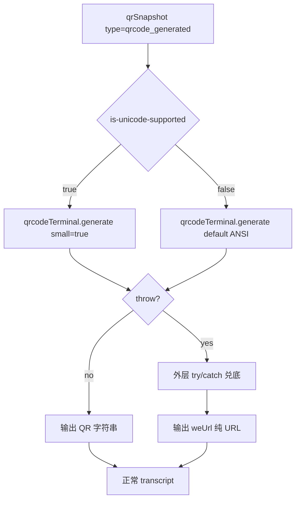
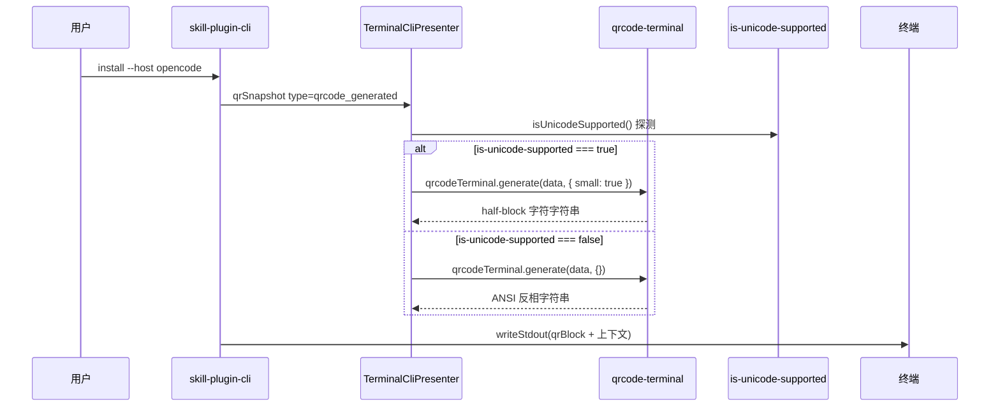

# `skill-plugin-cli` 终端二维码渲染方案

**Version:** 0.9
**Date:** 2026-07-30
**Status:** Implemented
**Owner:** agent-plugin maintainers
**Implementation:** 2026-07-30 — 从 cce4b53 状态起，引入 `is-unicode-supported@^2.1.0` 库做能力门控；true 走 `qrcode-terminal` half-block 紧凑模式、false 走 ANSI 反相模式（不依赖字体字形）；删除 `isClassicWindowsConsole`、删除自写 ASCII 路径
**Related:** [统一安装 CLI 方案](./solution.md), [二维码扫码授权方案设计](../../../docs/design/qrcode-auth-session-solution.md), [代码治理规则](../../../docs/rules/engineering.md), [变更治理规则](../../../docs/rules/change-management.md)

## 1. 文档定位

本文冻结 `skill-plugin-cli` 在终端中渲染二维码的依赖、字符集、终端能力分支与兜底契约。

本文负责定义：

- 二维码渲染路径的依赖选型（`qrcode-terminal` + `is-unicode-supported`）
- 终端能力探测规则（基于 `is-unicode-supported` 库的 10 条 env 白名单）
- 两种渲染分支：现代终端（Unicode half-block）、漏判终端（ANSI 反相）
- `TerminalCliPresenter.renderQrCode` 的内部职责、调用方契约、构造函数注入方式
- verbose 诊断契约

本文不负责定义：

- 二维码认证协议、扫码流程、状态机
- `skill-plugin-cli` 整体安装流程、阶段模型、host 适配器
- 二维码图片输出、浏览器跳转等替代交付形态

## 2. 冻结结论

1. 依赖：`qrcode-terminal@^0.12.0`（cce4b53 既有） + `is-unicode-supported@^2.1.0`（新增），净 +1 个运行时依赖
2. 终端能力探测用 `is-unicode-supported` 库（10 条终端白名单 env 匹配）；不再自写 `isClassicWindowsConsole` 三元负向判定
3. 渲染分支按以下优先级：
   1. `is-unicode-supported()` 返回 `true`（命中 10 条白名单任一）：`qrcodeTerminal.generate(data, { small: true }, ...)`，输出 `▀` (U+2580) / `▄` (U+2584) / `█` (U+2588) + 空格，紧凑
   2. `is-unicode-supported()` 返回 `false`（未命中白名单）：`qrcodeTerminal.generate(data, ...)`（默认 ANSI 反相），输出 `\033[40m  \033[0m` + `\033[47m  \033[0m`，每模块 2 字符宽，依赖 VT
   3. 任何分支抛错（`addData` / `make` 异常、stdout EPIPE）：保留外层 `try/catch` 兜底为 `weUrl` 纯 URL
4. `TerminalCliPresenter` 构造函数签名扩展为 `(qrCodeRenderer?: (data) => string, shouldRenderHyperlink?: () => boolean, verbose?: boolean)`，默认 `verbose=false`；既有 mock 注入测试零回归
5. `chooseQrRenderer(probe?: () => boolean)` 函数接受可注入的探测函数，默认是 `is-unicode-supported` 的真值，测试可注入 stub
6. `isClassicWindowsConsole` **已删除**；`probeHyperlinkSupport` 改用 `is-unicode-supported()` 作为 Unicode 前置
7. ASCII 渲染路径（`renderAsciiQr` / `renderWithQrChoice`）**已删除**——ANSI 反相模式由 `qrcode-terminal` 库自带，不依赖自写
8. verbose 模式打印 `[skill-plugin-cli][verbose] qrcode renderer: <kind> (<reason>)`，仅当 `verbose=true` 且 `qrCodeRenderer === renderQrCode`（未注入 mock）

## 3. 背景与根因

### 3.0 根因分析

**原始问题**：在低版本 cmd / Windows PowerShell 上，QR 渲染异常（乱码、方块、不可扫）时有发生；同一 cmd 上直接运行 `qrcode-terminal "url"` CLI 正常。

**关键事实**：

- `▀`/`▄`/`█`（U+2580/U+2584/U+2588）属 Unicode Block Elements，Unicode 1.0（1991）定义，任何声明 Unicode 的字体都应包含
- `is-unicode-supported` 是基于 10 条终端身份 env 白名单的 boolean 判定，**不基于字符能力**。漏判 6+ 终端（cmd 1903+ 独立 / ConEmu 原生 / WezTerm / JetBrains WebStorm/IntelliJ / PowerShell 裸启动），但这些终端**实际**可渲染半块字符

**根因**：异常不在字符集也不在库——`is-unicode-supported` 返回 false 不等于"不能渲染 half-block"，返回 true 也不等于"一定能渲染 half-block"。本质是身份判定，非能力测试。

**本方案选择**："识别优先、字符可扫优先"——

- 探测 true：走 half-block 紧凑（赌白名单维护者正确）
- 探测 false：走 ANSI 反相（不依赖字体字形，依赖 VT；任何 VT 开启的终端都能渲染）
- 误判代价：false → 失去紧凑感、扫码不受影响

plugin-cli 调用栈与 `qrcode-terminal` CLI 直接调用的真实差异不在本方案范围内（独立问题）。

### 3.1 设计原则

**渲染能力选择遵循"识别优先、字符可扫优先"**：

| 探测结果 | 实际能力 | 渲染策略 | 视觉 |
|---|---|---|---|
| `is-unicode-supported()=true`（白名单命中） | 终端声称 Unicode，字体大概率有 `▀`/`▄`/`█` 字形 | half-block | 紧凑（1 字符/模块） |
| `is-unicode-supported()=false`（白名单未命中） | 终端可能是 cmd / PowerShell / ConEmu 原生 / WezTerm / JetBrains WebStorm 等 | ANSI 反相（不依赖字体字形） | 较宽（2 字符/模块） |

**关键观察**：`is-unicode-supported` 库（v2.1.0）是**身份判定**而非**字符能力判定**——它检查 10 条已知终端的 env 签名，不实际测试字符渲染。这带来以下事实：

- **库返回 true 的终端**：理论上能渲染 `▀`/`▄`/`█`，赌白名单维护者正确
- **库返回 false 的终端**：可能是 (a) 真的不能渲染（极少见），或 (b) 不被库识别的现代终端（更常见）——但 (b) 类终端往往**有**半块字符能力
- **我们用 ANSI 反相作为 false 兜底**：不依赖字体字形，依赖 VT 开启

### 3.2 try/catch 兜底的真实范围

`qrcode-terminal@0.12.0` 的 `generate` 函数只会在 `addData` / `make` 阶段抛异常，渲染阶段（small / ANSI 分支）都是纯字符串拼接，**不会抛任何异常**。`renderQrCode` 不会因"终端字体缺字形"而抛错——这种故障 try/catch 无能为力。

外层 `try/catch` 实际兜底范围：

- URL 含非法字符 / `addData` 失败
- 数据超长 / `make` 失败
- `process.stdout` EPIPE
- **不能**兜底"字体缺字形"或"codepage 不支持 UTF-8"——这些是渲染异常

### 3.3 业界对照

本方案属于"派别 1 + ANSI 兜底"细分：探测 + 多模式分支，与 `wrangler` / `supabase` CLI 路线一致；不同在于"能力弱 → 走 ANSI 反相"而非"永远 URL 兜底"。

## 4. 架构设计

### 4.1 责任边界

| 对象 | 负责 | 不负责 |
|---|---|---|
| `TerminalCliPresenter.renderQrCode` | 调用 `chooseQrRenderer` 选路；调度 `qrcodeTerminal.generate` | QR 编码算法；CLI 阶段流转 |
| `qrcode-terminal`（第三方运行时依赖） | QR 矩阵编码；half-block 字符串渲染；ANSI 反相字符串渲染 | 终端能力探测 |
| `is-unicode-supported`（第三方运行时依赖，0.9 新增） | 终端身份白名单判定；返回 boolean | 字体探测；VT 能力探测 |
| `chooseQrRenderer` | 接受可注入 probe；返回 `{kind, reason}` | 实际渲染 |
| `qrSnapshot` 外层 `try/catch` | 库异常时回退 `weUrl` | 渲染异常（库不抛） |
| `weUrl` 兜底 | 提供可复制链接 | 替代 QR 扫码能力 |

### 4.2 渲染分支



边界说明：

- `is-unicode-supported` 返回 `false` 时走 ANSI 反相，**不区分**"白名单外但能渲染 half-block 的现代终端"和"真不能渲染的终端"——保守起见一律走 ANSI；漏判盲区见 §5.3
- ANSI 反相依赖 VT 处理：cmd / PowerShell 5.1+ 默认 VT 关闭需手动开（`Set-ItemProperty HKCU:\Console\%SystemRoot%_System32_cmd.exe VirtualTerminalLevel 1` 或 Win10 1903+ 默认开启）

## 5. 详细设计

### 5.1 主流程



### 5.2 关键分支

| 分支 | 触发条件 | 处理 | 兜底 |
|---|---|---|---|
| 识别内终端 | `is-unicode-supported() === true` | `qrcodeTerminal.generate(data, { small: true })` | 抛错 → 外层 `try/catch` → `weUrl` |
| 漏判终端 | `is-unicode-supported() === false` | `qrcodeTerminal.generate(data, {})`（默认 ANSI 反相） | 抛错 → 外层 `try/catch` → `weUrl` |
| 编码失败 | `addData` / `make` 抛错（极端长 URL） | 抛错 | 外层 `try/catch` → `weUrl` |
| stdout 异常 | EPIPE 等 | 抛错 | 外层 `try/catch` → `weUrl` |

### 5.3 覆盖矩阵

| 场景 | env 标志 | `is-unicode-supported()` | 走 small？ | 视觉 |
|---|---|---|---|---|
| Windows Terminal | `WT_SESSION` | true | yes | 紧凑 |
| VS Code integrated | `TERM_PROGRAM=vscode` | true | yes | 紧凑 |
| ConEmu + cmder 任务 | `ConEmuTask={cmd::Cmder}` | true | yes | 紧凑 |
| mintty / WezTerm 兼容模式 / 多数 pty | `TERM=xterm-256color` | true | yes | 紧凑 |
| Alacritty（小写 TERM） | `TERM=alacritty` | true | yes | 紧凑 |
| rxvt-unicode | `TERM=rxvt-unicode` 等 | true | yes | 紧凑 |
| JetBrains-JediTerm | `TERMINAL_EMULATOR=JetBrains-JediTerm` | true | yes | 紧凑 |
| Terminus（老版本） | `TERMINUS_SUBLIME` | true | yes | 紧凑 |
| Terminus（≥0.2.27） | `TERM_PROGRAM=Terminus-Sublime` | true | yes | 紧凑 |
| **PowerShell 在 WT/ConEmu/VSCode 内启动** | 父终端传染 | **true**（实测） | yes | 紧凑 |
| **PowerShell 裸启动（无父终端 env）** | 无 | false | no → ANSI | 较宽，可扫 |
| **cmd 1903+ 裸启动** | 无 | false（库漏判） | no → ANSI | 较宽，可扫 |
| **ConEmu 原生（仅 ConEmuPID）** | `ConEmuPID` | false（库漏判） | no → ANSI | 较宽，可扫 |
| **WezTerm** | `TERM_PROGRAM=WezTerm` | false（库不认 WezTerm） | no → ANSI | 较宽，可扫 |
| **Alacritty（TERM_PROGRAM 形式）** | `TERM_PROGRAM=Alacritty` | false（库只认 `TERM=alacritty`） | no → ANSI | 较宽，可扫 |
| **JetBrains WebStorm/IntelliJ/GoLand** | `TERM_PROGRAM=WebStorm` 等 | false（库只认 `JetBrains-JediTerm`） | no → ANSI | 较宽，可扫 |
| 真实 `qrcode-terminal "url"` CLI 默认 | 取决于 shell | 同上 | small: false (ANSI) | 较宽，可扫 |

### 5.4 已知限制（0.9 重新措辞）

**核心修正**：`is-unicode-supported` 库（v2.1.0）的 10 条白名单**漏判**了一批实际能渲染 `▀`/`▄`/`█` 的现代终端（cmd 1903+ 裸启动、ConEmu 原生、WezTerm、JetBrains WebStorm/IntelliJ 等）。这些被漏判的终端在 0.9 方案下走 ANSI 反相，**可扫性不受影响**，仅**失去 half-block 紧凑感**。

**误判代价**（与 d51bfca 0.8 方案不同）：

| 误判类型 | 旧方案（d51bfca ASCII 兜底） | 新方案（0.9 ANSI 兜底） |
|---|---|---|
| 探测 true 但实际不能渲染 | 扫不出（不可用） | 扫不出（仍不可用）——但白名单中此类场景几乎不存在 |
| 探测 false 但实际能渲染 half-block | 走 ASCII（能扫但视觉稀疏） | 走 ANSI（能扫且视觉较 half-block 略宽但不稀疏） |

**与库维护的关系**：

- 未来若 `is-unicode-supported` 上游加 WezTerm / `TERM_PROGRAM=Alacritty` / JetBrains 全家桶，这些终端会自动回到 half-block 紧凑
- 本仓不主动 monkey-patch 库（避免脱节上游）

### 5.5 `is-unicode-supported@2.1.0` 完整支持列表（来自 v2.1.0/index.js，穷举）

```js
return Boolean(env.WT_SESSION)                       // Windows Terminal
    || Boolean(env.TERMINUS_SUBLIME)                 // Terminus (<0.2.27)
    || env.ConEmuTask === '{cmd::Cmder}'             // ConEmu + cmder
    || TERM_PROGRAM === 'Terminus-Sublime'           // Terminus (≥0.2.27)
    || TERM_PROGRAM === 'vscode'                     // VS Code integrated
    || TERM === 'xterm-256color'                     // mintty / WezTerm 兼容 / 多数 pty
    || TERM === 'alacritty'                          // Alacritty (小写 TERM)
    || TERM === 'rxvt-unicode'                       // rxvt-unicode
    || TERM === 'rxvt-unicode-256color'              // rxvt-unicode 256 色
    || env.TERMINAL_EMULATOR === 'JetBrains-JediTerm'; // JetBrains JediTerm
```

非 win32 平台：`TERM !== 'linux'`（Linux console kernel）即 true。

### 5.6 实现清单

| 文件 | 改动类型 | 职责 |
|---|---|---|
| `packages/skill-plugin-cli/package.json` | 修改 | 新增 `is-unicode-supported@^2.1.0` 依赖；保留 `qrcode-terminal@^0.12.0` |
| `packages/skill-plugin-cli/src/adapters/TerminalCliPresenter.ts` | 修改 | 加 `chooseQrRenderer` + `QrRendererChoice`；改 `renderQrCode` 调度；删 `isClassicWindowsConsole`；改 `probeHyperlinkSupport`；加 verbose 构造参数 + 诊断 |
| `packages/skill-plugin-cli/src/cli/runtime.ts` | 修改 | `CreateInstallCliUseCaseOptions` 加 `verbose` 字段；透传给 presenter |
| `packages/skill-plugin-cli/src/cli/main.ts` | 修改 | `parsed.verbose` 传给 `createInstallCliUseCase` |
| `packages/skill-plugin-cli/tests/unit/presenter.test.ts` | 修改 | 新增 `chooseQrRenderer` 测试 + verbose 诊断测试 + 覆盖矩阵 |
| `packages/skill-plugin-cli/docs/qrcode-terminal-rendering-solution.md` | 重写 | 从 625 行（旧 0.8 方案）重写到约 200 行（0.9 方案） |

**删除清单**：

- `isClassicWindowsConsole` 函数
- `renderAsciiQr` 函数
- `renderWithQrChoice` 函数
- `qrcode-terminal-rendering-solution.md` 旧版内容（保留文件，replace content）

**保留清单**：

- `qrcode-terminal` 依赖与 shim（`vendor-shims.d.ts`）
- `try/catch` 兜底到 `weUrl`（仅兜库 addData/make 异常）
- `writeStdout` / `writeStderr` 帮助函数

## 6. 性能

| 项目 | 是否影响 | 说明 |
|---|---|---|
| 请求数量 | 否 | QR 编码是纯本地 CPU 计算 |
| 计算开销 | 是 | `qrcodeTerminal.generate` 每次快照调用一次 | QR 编码 < 5ms，用户无感 |
| 缓存/内存 | 否 | 矩阵是 `BitMatrix`，内存占用 < 1KB |
| 首屏/列表/流式体验 | 否 | QR 是单次离散输出 |

## 7. 功耗

| 项目 | 是否影响 |
|---|---|
| 轮询/长连接 | 否 |
| 后台任务 | 否 |
| 动画/频繁刷新 | 否 |
| 弱网/长时间运行 | 否 |

## 8. 埋码

无新增埋码。QR 渲染失败兜底到 `weUrl` 与现有 `qrSnapshotDiagnostic` verbose 日志已对齐，敏感字段由 `formatRedactedSnapshot` 现有脱敏逻辑保护。

## 9. 影响范围

### 9.1 直接影响

| 对象 | 影响说明 | 验证方式 |
|---|---|---|
| `TerminalCliPresenter.renderQrCode` | 内部实现改用 `chooseQrRenderer` 调度，公共签名不变 | 既有 mock 注入测试 + 新增 stub 测试 |
| `is-unicode-supported` 依赖 | 新增运行时依赖 | `pnpm install` + `pnpm typecheck` |
| `isClassicWindowsConsole` | 删除 | `pnpm typecheck` 验证无残留引用 |

### 9.2 间接影响

| 对象 | 影响说明 | 风险 | 应对策略 |
|---|---|---|---|
| `probeHyperlinkSupport` | 从 `isClassicWindowsConsole` 改为 `is-unicode-supported` | 判定边界变化：白名单外的 cmd / PowerShell 不再支持 OSC 8 链接 | 用户体验：白名单外终端本来 QR 也走 ANSI 不可点，统一；接受 |
| `verbose` 标志传透 | 涉及 `main.ts` → `runtime.ts` → `TerminalCliPresenter` 三层 | 接线遗漏会导致 verbose 不生效 | 实施时跑 `pnpm verify:core` 全套验证 |
| bundle 体积 | `is-unicode-supported` 净 +1 个微型包（~50 行代码，< 1KB minified） | 影响极小 | 接受 |

### 9.3 不影响

| 对象 | 不影响说明 |
|---|---|
| `Presenter` port 接口 | 签名零变化 |
| `CliQrSnapshot` 类型 | 零变化 |
| `InstallPluginCliUseCase` 流程 | 零变化（除接受 `verbose` 字段） |
| `qrcode-terminal` 依赖 | 保留，与 cce4b53 一致 |
| `supports-hyperlinks` 依赖 | 保留，与 cce4b53 一致 |

## 10. 测试范围

### 10.1 单元测试

| 测试项 | 覆盖来源 | 输入/动作 | 预期结果 |
|---|---|---|---|
| `chooseQrRenderer` stub true | 关键分支 | `chooseQrRenderer(() => true)` | `{kind: "qrcode-terminal.small", reason: "is-unicode-supported=true"}` |
| `chooseQrRenderer` stub false | 关键分支 | `chooseQrRenderer(() => false)` | `{kind: "qrcode-terminal.ansi", reason: "is-unicode-supported=false"}` |
| `chooseQrRenderer` 真实库 | 真实集成 | `chooseQrRenderer()` (无参) | kind 与 `isUnicodeSupported()` 真值一致 |
| 覆盖矩阵 13+ case | 边界 | 逐 case 调 `chooseQrRenderer` stub | 见 §5.3 表格 |
| verbose 诊断（true 分支） | 关键分支 | `new TerminalCliPresenter(renderQrCode, () => false, true)` + `qrSnapshot` | stdout 含 `[skill-plugin-cli][verbose] qrcode renderer: qrcode-terminal.<kind> (is-unicode-supported=<bool>)` |
| verbose 诊断（custom-injected） | 边界 | `new TerminalCliPresenter(() => "<stub>", () => false, true)` + `qrSnapshot` | stdout 含 `custom-injected` |
| verbose 抑制（non-verbose） | 边界 | `new TerminalCliPresenter(renderQrCode, () => false, false)` + `qrSnapshot` | stdout **不**含 `qrcode renderer:` |
| 既有 4 个相关测试 | 回归 | mock 注入 `qrCodeRenderer` | 全部通过 |

### 10.2 集成测试

无新增。`tests/integration/install-plugin-cli.test.ts` 通过 `createFakeQrCodeRuntime` 注入 fake，零依赖 QR 渲染实现，零回归。

### 10.3 功能测试（手工验证）

| 场景 | 操作 | 预期体验 |
|---|---|---|
| 识别内终端（WT / VSCode / ConEmu+cmder / mintty / Alacritty / rxvt / JetBrains-JediTerm） | `node dist/cli.js install --host opencode --verbose` | half-block 字符 QR；verbose 输出 `qrcode-terminal.small (is-unicode-supported=true)`；扫码成功 |
| 漏判终端（cmd 1903+ 裸启动 / PowerShell 裸启动 / ConEmu 原生 / WezTerm / JetBrains WebStorm） | 同上 | ANSI 反相 QR（每模块 2 字符宽）；verbose 输出 `qrcode-terminal.ansi (is-unicode-supported=false)`；扫码成功 |
| 库 addData 异常 | 注入超长 URL | 外层 try/catch 兜底到 `weUrl` 纯 URL |

### 10.4 兼容测试

| 测试项 | 兼容维度 | 输入/动作 | 预期结果 |
|---|---|---|---|
| 默认行为兼容 | 旧版本/未配置 | 既有 try/catch 兜底 | `addData` 抛错时回退 `weUrl` |
| 平台兼容 | macOS / Linux | `is-unicode-supported=true` | half-block 输出 |
| 平台兼容 | Windows Terminal | `WT_SESSION` 已设置 | half-block 输出 |
| 平台兼容 | VS Code integrated | `TERM_PROGRAM=vscode` | half-block 输出 |
| 平台兼容 | cmd 1903+ 裸启动 | 无 env 信号 | ANSI 输出，可扫 |
| 平台兼容 | PowerShell 在 WT 内启动 | 父终端传染 `WT_SESSION` | half-block 输出（实测） |
| 平台兼容 | PowerShell 裸启动 | 无 env 信号 | ANSI 输出，可扫 |
| 依赖兼容 | pnpm workspace | `pnpm install` | 新增 `is-unicode-supported` 编译通过 |
| 框架兼容 | Node 24+ | `target: 'node24'` | esbuild 目标，bundle 无错 |

## 11. 风险与回滚

| 风险 | 概率 | 缓解 |
|---|---|---|
| `is-unicode-supported` 误判 true 导致 half-block 字符渲染异常 | 极低 | 白名单中终端一般是已知 Unicode-capable 字体；用户报告后可换终端 |
| `is-unicode-supported` 误判 false 导致 6+ 现代终端失去紧凑感 | 中 | 已知 UX 妥协；扫码不受影响；可等待上游加白名单 |
| 漏判终端 VT 未开导致 ANSI 反相也异常 | 极低 | Win10 1903+ 默认 VT 开；旧 Windows 用户需手动开 VT 或换终端 |
| `qrcode-terminal` 0.12.0 与新版 Node 24 兼容 | 低 | 库 7 年无更新但纯字符串生成不涉及现代 Node API；install + smoke 验证 |
| bundle 体积膨胀 | 极低 | `is-unicode-supported` 包体 < 1KB |

**回滚路径**：

- 单 PR 可逆：删 `is-unicode-supported` 依赖、`chooseQrRenderer` 改回 `qrcodeTerminal.generate({ small: true })` 一行
- `git revert` 即可

## 12. 验收口径

- [ ] `is-unicode-supported` 依赖 + 锁版本 `^2.1.0`
- [ ] `chooseQrRenderer` 单元测试覆盖 13+ 场景
- [ ] verbose 诊断在 `--verbose` 模式下正确打印 `kind (reason)`
- [ ] `isClassicWindowsConsole` 已删除，无残留引用
- [ ] `renderAsciiQr` / `renderWithQrChoice` 已删除
- [ ] 既有 presenter 单测（13 个相关 case）零回归
- [ ] `pnpm typecheck` / `pnpm test` / `pnpm build` / `pnpm verify:core` 全绿
- [ ] 真机：识别内终端（WT / VSCode / ConEmu+cmder）走 half-block，可扫
- [ ] 真机：漏判终端（cmd 1903+ / PowerShell 裸启动）走 ANSI，可扫
- [ ] 真机：PowerShell 在 WT 内启动实测走 half-block（已确认）
