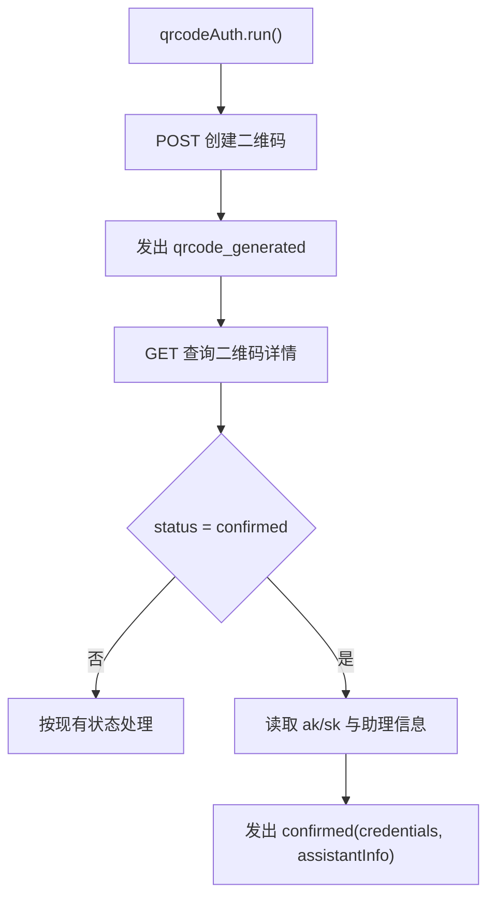
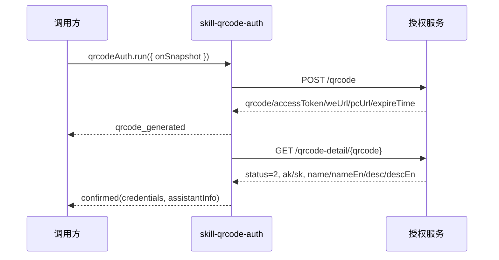
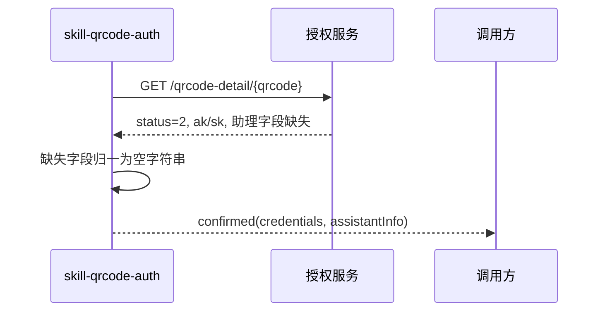

# skill-qrcode-auth confirmed 返回助理信息方案

**Version:** 1.0  
**Date:** 2026-06-22  
**Status:** Active  
**Owner:** agent-plugin maintainers  
**Related:** `../../../../docs/design/qrcode-auth-session-solution.md`, `../../../../docs/design/qrcode-auth-exposure-solution.md`

## 1. 背景

### 1.1 场景说明

当前 `qrcodeAuth.run()` 在二维码状态为 `confirmed` 时只返回 `credentials.ak/sk`。新需求要求在助理创建成功时同步返回助理信息：

- `name: string`
- `nameEn: string`
- `desc: string`
- `descEn: string`

该信息属于二维码详情查询 `confirmed` 阶段，不属于二维码创建成功阶段。

### 1.2 需求目标

1. 在 `confirmed` 快照中返回助理信息。
2. 助理信息字段不存在时默认空字符串，不影响主流程成功。
3. 将本方案归档到 `packages/skill-qrcode-auth/docs/design/`，作为包级设计文档。
4. 以本文档作为本次 `confirmed.assistantInfo` 字段扩展的包级事实源；根 `docs/` 只保留摘要和引用。

### 1.3 非目标

1. 不在 `qrcode_generated` 快照返回助理信息。
2. 不因助理信息缺失触发 `auth_service_error`。
3. 不改变 `qrcodeAuth.run()` 的返回值。

## 2. 方案图

### 2.1 整体方案图



### 2.2 方案核心

在 `confirmed` 事件新增 `assistantInfo`，其中 `ak/sk` 仍是成功主流程必填字段，`name/nameEn/desc/descEn` 缺失时以 `""` 兜底。

## 3. 时序图

### 3.1 助理创建成功



### 3.2 助理信息缺失



## 4. 技术细节

### 4.1 实现清单

1. `packages/skill-qrcode-auth/src/types.ts`：新增 `QrCodeAssistantInfo`，并在 `confirmed` 快照增加 `assistantInfo`。
2. `packages/skill-qrcode-auth/src/internal/service-port.ts`：在 confirmed 查询结果增加 `assistantInfo`。
3. `packages/skill-qrcode-auth/src/internal/HttpQrCodeAuthService.ts`：在 `status=2` 分支读取助理字段，缺失默认空字符串。
4. `packages/skill-qrcode-auth/src/internal/QrCodeAuthSessionController.ts`：透传 `assistantInfo` 到 confirmed snapshot。
5. `packages/skill-qrcode-auth/docs/design/qrcode-auth-confirmed-assistant-info-solution.md`：新增本方案文档。
6. `packages/bridge-runtime-sdk/src/index.ts`：从 `@wecode/skill-qrcode-auth` re-export `QrCodeAssistantInfo` 类型，保持 SDK 根入口类型可用；`public-contract.ts` 不重复定义 qrcode 类型。
7. `packages/skill-plugin-cli`：删除本地 qrcode 镜像类型，直接复用 `skill-qrcode-auth` 的 public 类型。
8. 同步更新仍引用该契约的摘要文档：`docs/design/qrcode-auth-session-solution.md`、`docs/design/interfaces/bridge-runtime-sdk-integration.md`、`plugins/message-bridge/docs/design/interfaces/private-status-api-contract.md`。这些文档只保留短摘要或指向本文档，不复制完整包级契约。

### 4.2 状态设计

1. `qrcode_generated`：二维码创建成功，字段不变。
2. `confirmed`：助理创建成功，新增 `assistantInfo`。
3. `failed`：仍只表示授权主流程失败；助理信息缺失不进入失败态。

### 4.3 数据与缓存处理

1. 助理信息来源为二维码详情接口 `qrcode-detail` 的 confirmed 响应。
2. 不新增缓存，不改变刷新计数和去重逻辑。
3. 字段归一规则：字符串原样返回；缺失、`null`、非字符串返回 `""`。

### 4.4 接口接入

新增公共类型：

```ts
export interface QrCodeAssistantInfo {
  name: string;
  nameEn: string;
  desc: string;
  descEn: string;
}
```

`confirmed` 快照调整为：

```ts
{
  type: "confirmed";
  qrcode: string;
  credentials: {
    ak: string;
    sk: string;
  };
  assistantInfo: QrCodeAssistantInfo;
}
```

### 4.5 边界约束

1. `ak/sk` 缺失仍是主流程失败。
2. `name/nameEn/desc/descEn` 缺失不是主流程失败。
3. 自动刷新后只在最终 confirmed 的二维码事件中返回对应助理信息。

### 4.6 未确认项

1. 服务端 confirmed 响应字段路径按 `data.name/nameEn/desc/descEn` 处理。
2. 上层是否展示助理信息不在本次包级能力范围内。
3. 是否将助理信息写入安装结果或配置文件不在本次范围内。

## 5. 性能

不新增请求，只在已有 confirmed 响应中读取 4 个字符串字段，性能影响可忽略。

## 6. 功耗

不增加轮询、长连接、后台任务或频繁刷新，功耗无新增影响。

## 7. 埋码

1. 无新增埋码。
   - 说明：本次只扩展 SDK 快照字段。
2. 后续展示层若使用助理信息，可由展示层单独定义曝光或点击埋码。

## 8. 影响范围

### 8.1 直接影响

1. `@wecode/skill-qrcode-auth` public type contract。
2. `confirmed` 快照消费方的类型定义。
3. 包级设计文档归档路径。

### 8.2 间接影响

1. `bridge-runtime-sdk` 根入口新增 `QrCodeAssistantInfo` 类型转导出。
2. `bridge-runtime-sdk/src/public-contract.ts` 继续只承载 SDK 自有契约，不复制 qrcode 类型。
3. `message-bridge` runtime API 文档摘要。
4. `skill-plugin-cli` 的二维码类型引用；当前 CLI 可继续忽略该字段。

### 8.3 不影响

1. `qrcode_generated` 展示数据。
2. `qrcodeAuth.run()` 入参和返回值。
3. 二维码刷新、取消、超时和失败分类。

## 9. 测试范围

### 9.1 功能测试

1. confirmed 响应包含助理字段时，snapshot 返回完整 `assistantInfo`。
2. confirmed 响应缺少助理字段时，snapshot 对应字段为 `""`。
3. confirmed 响应缺少 `ak/sk` 时，仍返回 `auth_service_error`。
4. qrcode_generated、scanned、expired、cancelled、failed 行为不变。

### 9.2 兼容测试

1. `packages/skill-qrcode-auth` 包内测试通过。
2. `skill-plugin-cli` 类型检查通过，现有 CLI 输出不变。
3. `bridge-runtime-sdk` public contract 测试同步通过。

验证命令：

```bash
pnpm --dir packages/skill-qrcode-auth run verify:core
pnpm --dir packages/skill-plugin-cli run typecheck
pnpm --dir packages/bridge-runtime-sdk run typecheck
pnpm --dir packages/bridge-runtime-sdk test
```

### 9.3 文档一致性检查

1. 新方案文档归档到 `packages/skill-qrcode-auth/docs/design/`。
2. 根 `docs/` 中仍保留的跨模块文档只做引用和摘要同步，不作为包级事实源；完整字段契约以本文档和 `packages/skill-qrcode-auth/src/types.ts` 为准。
3. 如后续迁移 `docs/design/qrcode-auth-session-solution.md` 到包内，应更新迁移映射并避免双 Active 真源。

## 10. 最终建议

推荐将本次方案作为包级设计文档归档到 `packages/skill-qrcode-auth/docs/design/qrcode-auth-confirmed-assistant-info-solution.md`。实现上把助理信息挂到 `confirmed.assistantInfo`，缺失字段统一为空字符串，避免把非主流程字段变成授权失败原因。
