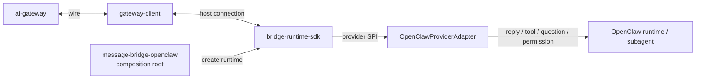

# message-bridge-openclaw 模块架构

**Version:** 1.0  
**Date:** 2026-05-13  
**Status:** Active  
**Owner:** message-bridge-openclaw maintainers  
**Related:** `../protocol-sequence.md`, `../../message-bridge/docs/architecture/message-bridge-module-architecture.md`, `../../../packages/bridge-runtime-sdk/docs/bridge-runtime-sdk-architecture.md`, `../../../docs/architecture/repository-architecture-overview.md`

## In Scope

1. 说明 `plugins/message-bridge-openclaw` 作为 OpenClaw 侧桥接插件的职责边界。
2. 说明其与 `bridge-runtime-sdk`、`gateway-schema`、OpenClaw runtime 的协作关系。
3. 说明当前模块内部的 composition root、provider adapter、状态同步与会话映射职责。

## Out of Scope

1. 不重复展开 OpenClaw 协议字段、配置项手册或历史联调说明。
2. 不记录安装流程、发布步骤或专题修正方案。
3. 不替代 `bridge-runtime-sdk` 自身的内部架构文档。

## External Dependencies

1. OpenClaw `plugin-sdk` 提供 channel 注册、runtime 与 subagent 能力。
2. `@agent-plugin/bridge-runtime-sdk` 提供统一 runtime 命令与 fact 投影编排。
3. `@agent-plugin/gateway-schema` 提供共享协议边界。
4. `ai-gateway` 提供 WebSocket 侧上下行 wire 协议。

## 1. 架构目标

当前模块围绕以下目标组织：

1. 让 OpenClaw channel 以共享 bridge runtime 对接 `ai-gateway`，避免本地维护第二套业务 runtime。
2. 把 OpenClaw 宿主差异收敛到 provider adapter、session registry 和 account 级状态同步边界。
3. 在宿主不可用、连接未就绪或协议不合法时保持 fail-closed。

## 2. 角色与边界

### 2.1 模块角色

| 角色 | 职责 |
|---|---|
| `message-bridge-openclaw` | OpenClaw 侧插件入口、account runtime 装配、provider adapter 与状态桥接 |
| `bridge-runtime-sdk` | 统一 bridge runtime，承接下行命令分发、上行 fact 投影与 terminal 收口 |
| `OpenClawProviderAdapter` | 把 OpenClaw reply runtime 与 tool 事件转换成统一 provider contract |
| `SessionRegistry` | 映射 `welinkSessionId`、`toolSessionId` 与 OpenClaw `sessionKey` |

### 2.2 边界原则

1. 本模块以 composition root 为主，不在本地复制统一 runtime 的命令分发和投影规则。
2. OpenClaw 宿主差异只允许存在于 provider adapter、host config 构建、状态同步边界。
3. `SessionRegistry` 持有 OpenClaw 侧会话 identity 映射，不应扩散到 schema 或 gateway-client 层。

## 3. 总体架构图



## 4. 内部分层

| 层 | 目录/对象 | 职责 |
|---|---|---|
| 插件入口层 | `src/index.ts`, `src/channel.ts` | 注册 channel、注入 runtime、导出稳定插件入口 |
| 装配与宿主桥接层 | `src/OpenClawGatewayBridge.ts`, `src/gateway-host.ts` | 创建 bridge runtime、装配 gateway host config、同步状态 |
| Provider 适配层 | `src/sdk/OpenClawProviderAdapter.ts` | 把 OpenClaw reply runtime 与 tool 事件转换为 provider contract |
| 会话与事实层 | `src/session/*` | 会话映射、toolSessionId 生成、fact 构造 |
| 状态与配置层 | `src/runtime/*`, `src/config.ts`, `src/status.ts` | account 状态同步、register metadata、配置读取 |

## 5. 关键主链路

### 5.1 启动链路

```text
plugin register
  -> setPluginRuntime(api.runtime)
  -> registerChannel(messageBridgePlugin)
  -> OpenClawGatewayBridge
  -> createBridgeRuntime()
  -> runtime.start()
```

关键点：

1. 插件入口只负责注册与运行时注入，不承担业务编排。
2. `OpenClawGatewayBridge` 是 account 级 runtime facade，负责统一状态同步。
3. `bridge-runtime-sdk` 启动后才拥有真正的 gateway host 连接与命令处理能力。
4. OpenClaw 插件以源码 bundle 方式引入 SDK 时，不负责推导或代填 `sdkVersion`；当前 register 元数据只显式提供 `pluginVersion`，`sdkVersion` 仅在 SDK 能自证版本时出现。

### 5.2 下行执行链路

```text
ai-gateway downstream
  -> bridge-runtime-sdk handleDownstream
  -> RuntimeCommandDispatcher
  -> OpenClawProviderAdapter
  -> OpenClaw reply runtime / subagent
```

关键点：

1. 本模块不自行维护另一套 `invoke.*` 路由语义。
2. `OpenClawProviderAdapter` 负责把 chat、create_session、abort、reply 类命令映射到宿主公开能力。
3. 不支持或不可达能力必须通过统一 runtime 收口为稳定错误或终态。

### 5.3 上行事实链路

```text
OpenClaw runtime event / dispatcher output
  -> OpenClawProviderAdapter
  -> ProviderFact
  -> bridge-runtime-sdk projector
  -> gateway-client send
  -> ai-gateway
```

关键点：

1. 文本块、tool 更新、question、permission、session error 都先收敛为统一 fact。
2. `kind=final` 等宿主语义必须在 provider adapter 内完成 reconcile，再投影为统一事实。
3. `bridge-runtime-sdk` 持有 `tool_event`、`tool_done`、`tool_error` 的统一上行收口语义。

## 6. 关键约束

1. OpenClaw 宿主差异必须留在 provider adapter 边界，不应污染共享 runtime。
2. `SessionRegistry` 必须稳定维护 `welinkSessionId`、`toolSessionId`、`sessionKey` 三者关系。
3. 状态同步与 probe 协调必须经由 `ConnectionCoordinator` 一致发布，避免 account 视图和 runtime 视图漂移。
4. 插件入口不应依赖 README 或历史联调文档才能理解当前架构事实。

## 7. 失败处理与 fail-closed 边界

1. OpenClaw runtime 不可用、宿主接口缺失、连接未 READY 时，不应继续执行业务命令。
2. 不支持的 action 必须稳定 fail-closed，不能静默吞掉请求。
3. provider adapter 无法将宿主事件解释为合法 fact 时，应停止该链路并走统一错误收口。
4. account 级状态同步失败不能伪装成 runtime ready。

## 8. 延伸阅读

1. 统一 bridge runtime：`../../../packages/bridge-runtime-sdk/docs/bridge-runtime-sdk-architecture.md`
2. 历史时序视图：`../protocol-sequence.md`
3. 仓库级总览：`../../../docs/architecture/repository-architecture-overview.md`
