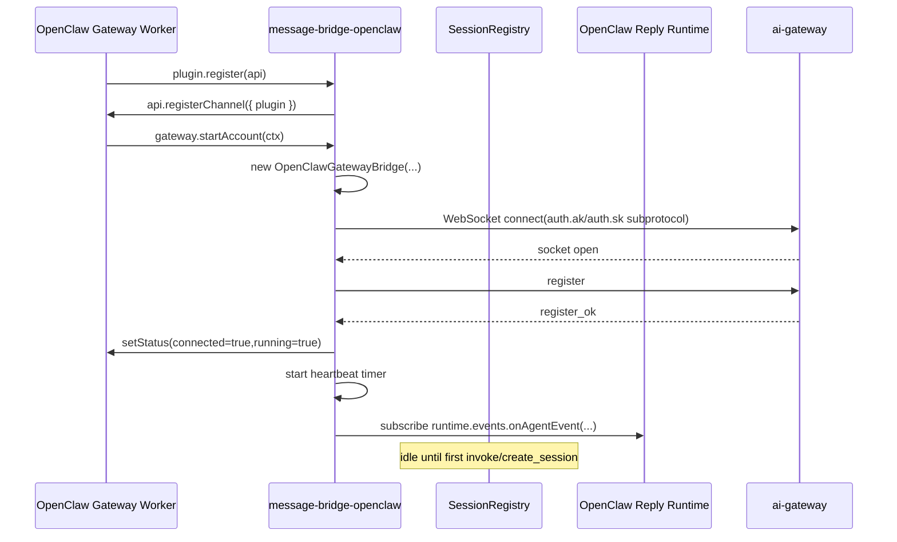
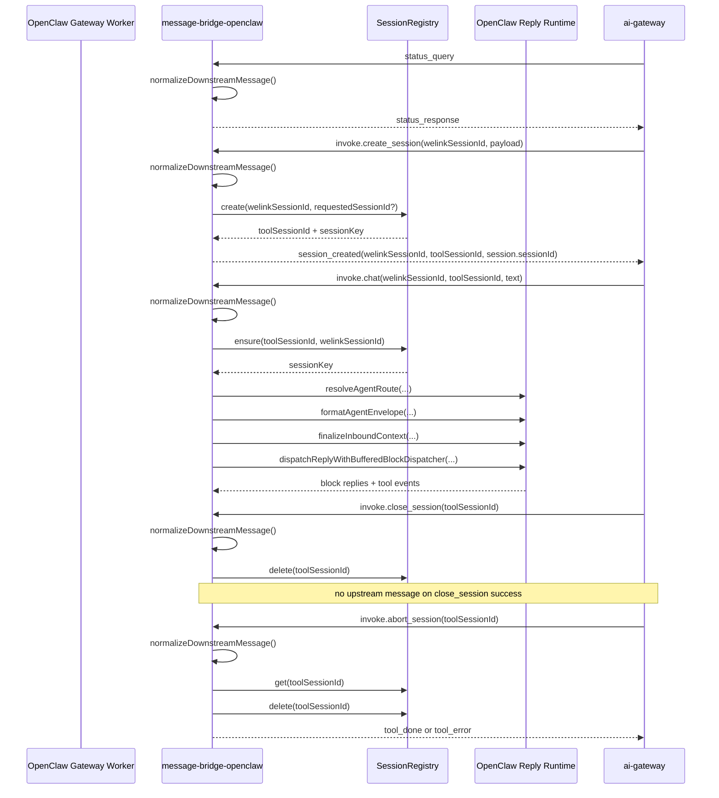
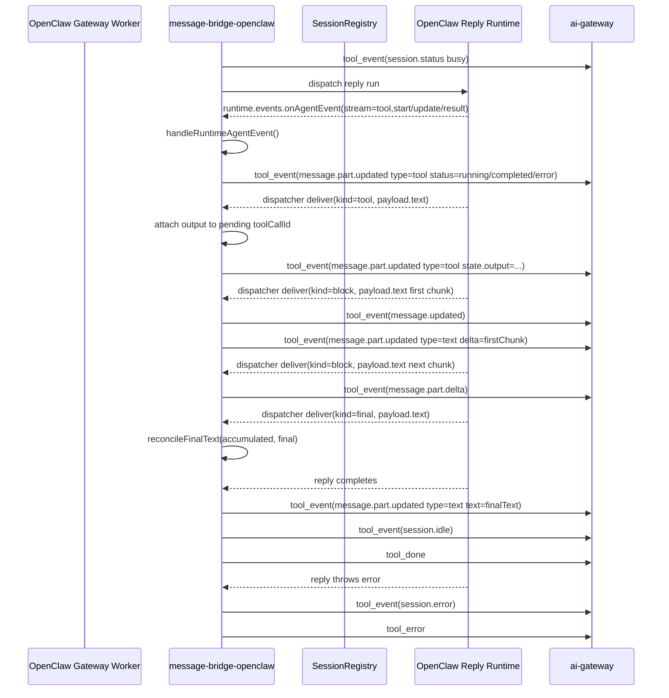

# OpenClaw Protocol Conversion Sequences

This document describes the current implementation of the
`message-bridge-openclaw` adapter. It focuses on how OpenClaw runtime
semantics are translated into the existing `ai-gateway` wire protocol.

This is an internal architecture and integration document. It describes the
current code path only and does not define a future-facing public API.

## Background And Boundaries

The plugin sits between:

- OpenClaw channel runtime
- the local `message-bridge-openclaw` adapter
- `ai-gateway` WebSocket protocol

The adapter keeps the gateway protocol unchanged and translates:

- gateway downstream messages into OpenClaw runtime actions
- OpenClaw runtime output into gateway upstream events

Out of scope in the current implementation:

- `permission_reply`
- `question_reply`
- token-level streaming
- speculative future `bridge-core` extraction

## Participants

- `OpenClaw Gateway Worker`
  - owns plugin loading, `registerChannel`, and account lifecycle
- `message-bridge-openclaw`
  - owns protocol normalization, session mapping, event projection, and gateway transport
- `SessionRegistry`
  - maps `toolSessionId` and `welinkSessionId` to OpenClaw `sessionKey`
- `OpenClaw Reply Runtime`
  - runs the reply pipeline and emits assistant/tool events
- `ai-gateway`
  - sends downstream control/invoke messages and receives upstream transport messages

## Startup Sequence

### Conversion Rules

- Input source
  - OpenClaw account lifecycle: `gateway.startAccount()`
  - Gateway control messages: `register_ok` / `register_rejected`
- Internal state changes
  - instantiate `OpenClawGatewayBridge`
  - connect `DefaultGatewayConnection`
  - move state `DISCONNECTED -> CONNECTING -> CONNECTED -> READY`
  - start heartbeat only after `register_ok`
- Output protocol
  - upstream `register`
  - upstream periodic `heartbeat`
- Register metadata
  - `toolType` defaults to `openx` (unknown values only warn and do not block runtime)
  - `toolVersion` is plugin-runtime-derived; `deviceName` / `os` / `macAddress` are gateway-client-derived
- ID mapping
  - none yet; `SessionRegistry` is not populated during startup

## Downstream Sequence

### Conversion Rules

- Input source
  - gateway downstream JSON frames received by `DefaultGatewayConnection`
- Internal state changes
  - `normalizeDownstreamMessage()` validates wire shape and action-specific payload
  - `handleInvoke()` routes to `handleChat`, `handleCreateSession`, `handleCloseSession`, `handleAbortSession`
  - `SessionRegistry` creates or reuses `sessionKey = <agentIdPrefix>:<accountId>:<toolSessionId>`
  - `handleChat()` creates assistant stream state and active tool-session state before dispatch
- Output protocol
  - `status_query -> status_response`
  - `invoke.create_session -> session_created`
  - `invoke.close_session -> no upstream success envelope`
  - `invoke.abort_session -> tool_done` or `tool_error`
- ID mapping
  - `welinkSessionId`
    - business-facing session identity from gateway
    - required for `create_session`
  - `toolSessionId`
    - protocol-facing agent session identity
  - `sessionKey`
    - OpenClaw runtime session identity used by reply execution

## Upstream Sequence

### Conversion Rules

- Input source
  - assistant text blocks from dispatcher `deliver(..., { kind: "block" })`
  - assistant final candidate from dispatcher `deliver(..., { kind: "final" })`
  - tool output blocks from dispatcher `deliver(..., { kind: "tool" })`
  - tool lifecycle from global `runtime.events.onAgentEvent(...)`
- Internal state changes
  - assistant path uses one stable `messageId` and one stable text `partId`
  - `kind=final` is cached and reconciled on completion; it is not emitted as immediate delta
  - tool path maintains `toolCallId -> ToolPartState`
  - active per-session state is stored under `activeToolSessions[sessionKey]`
  - final completion removes active session state
- Output protocol
  - assistant text
    - `message.updated`
    - `message.part.updated`
    - `message.part.delta`
    - final `message.part.updated`
  - tool lifecycle
    - `message.part.updated` with `part.type = "tool"`
  - session state
    - `session.status`
    - `session.idle`
    - `session.error`
  - transport envelope
    - `tool_event`
    - `tool_done`
    - `tool_error`
- ID mapping
  - `messageId`
    - one assistant message identity per chat turn
  - `partId`
    - one stable text part id for assistant text
    - one stable tool part id per `toolCallId`
  - `toolCallId`
    - runtime tool invocation identity used to group tool lifecycle and output

## ID And State Mapping

| Concept | Source | Internal owner | Output usage |
| --- | --- | --- | --- |
| `welinkSessionId` | `ai-gateway` downstream invoke | `SessionRegistry` record | echoed in `session_created`, `tool_done`, `tool_error` |
| `toolSessionId` | `ai-gateway` downstream invoke or create result | `SessionRegistry` record | primary `tool_event` envelope identity |
| `sessionKey` | derived by plugin | `SessionRegistry` | OpenClaw reply runtime session |
| `messageId` | generated by plugin | assistant stream state | `message.updated`, `message.part.*` |
| `partId` | generated by plugin | assistant/tool stream state | `message.part.*` |
| `toolCallId` | OpenClaw runtime tool event | tool state map | tool part correlation |

Current state transitions:

- connection
  - `DISCONNECTED -> CONNECTING -> CONNECTED -> READY`
- per chat turn
  - `session.status(busy) -> text/tool events -> session.idle -> tool_done`
- error path
  - `session.status(busy) -> session.error -> tool_error`

## Protocol Mapping Table

| OpenClaw-side semantic | Plugin handler/state | Gateway message |
| --- | --- | --- |
| account start | `gateway.startAccount()` | `register` |
| gateway ready | `DefaultGatewayConnection.onmessage(register_ok)` | heartbeat enabled |
| health probe | `handleDownstreamMessage(status_query)` | `status_response` |
| create external session | `handleCreateSession()` | `session_created` |
| inbound user text | `handleChat()` | `tool_event(session.status)` |
| assistant first text block | `sendAssistantStreamChunk()` | `tool_event(message.updated)` + `tool_event(message.part.updated)` |
| assistant later text block | `sendAssistantStreamChunk()` | `tool_event(message.part.delta)` |
| assistant final candidate | dispatcher `deliver(kind=final)` | cached only (no immediate upstream delta) |
| assistant final text | `reconcileFinalText()` + `sendAssistantFinalResponse()` | `tool_event(message.part.updated)` |
| tool start/update | `handleRuntimeAgentEvent()` | `tool_event(message.part.updated type=tool status=running)` |
| tool completed/error | `handleRuntimeAgentEvent()` | `tool_event(message.part.updated type=tool status=completed/error)` |
| tool output text | dispatcher `deliver(kind=tool)` | `tool_event(message.part.updated type=tool state.output=...)` |
| close_session complete | `handleCloseSession()` | no upstream success envelope |
| abort_session complete | `handleAbortSession()` | `tool_done` or `tool_error(reason=session_not_found)` |
| runtime failure | `handleChat()` catch | `tool_event(session.error)` + `tool_error` |

## Known Limitations

- `permission_reply` is not implemented
- `question_reply` is not implemented
- text streaming is block-level, not token-level
- tool output mapping depends on:
  - global `runtime.events.onAgentEvent(...)`
  - dispatcher `deliver(..., { kind: "tool" })`
- `create_session` requires `welinkSessionId`
- this document does not describe any legacy `sessionId` fallback path because the current plugin does not implement one
