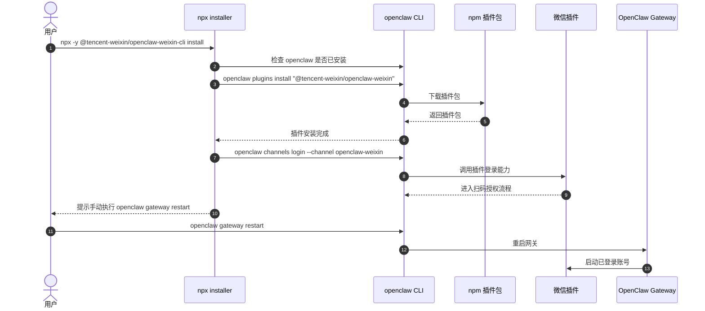
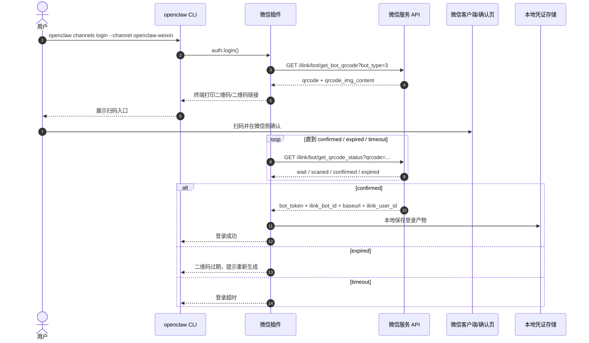

# P0 参考专题：微信插件安装与扫码授权需求输入（面向 message-bridge-openclaw）

> [!WARNING]
> Reference Only: 本文档为参考需求输入，不定义当前 `message-bridge-openclaw` 行为。
> 当前事实源入口：
> - `../README.md`
> - `../02-openclaw-interface-surface.zh-CN.md`
> - `../03-runtime-behavior.zh-CN.md`

**需求标识**: `FR-MB-OPENCLAW-P0-WEIXIN-INSTALL-LOGIN-REFERENCE`  
**状态**: draft（用于扫码安装/授权方案输入）  
**更新时间**: 2026-03-23  
**来源包**:
- `@tencent-weixin/openclaw-weixin`
- `@tencent-weixin/openclaw-weixin-cli`

## 1. 目标

沉淀微信 OpenClaw 插件在“安装 + 扫码授权”场景中可观察到的流程、接口与状态机，形成 `message-bridge-openclaw` 设计评审与实现拆解的参考输入。

本文只覆盖：

1. 插件安装入口
2. `openclaw channels login` 驱动的扫码授权
3. 登录相关 API 与状态机

本文不覆盖：

1. 微信业务消息收发协议
2. 图片/文件/CDN 上传链路
3. 当前 `message-bridge-openclaw` 的既有协议行为定义

## 2. 背景与观察结论

基于微信插件已发布包 README 与登录源码，可归纳出以下事实：

1. 微信插件的 `npx` 安装能力来自独立 CLI 包，不是插件包本身暴露 `bin`。
2. 标准安装流仍然是：
   - `openclaw plugins install "@tencent-weixin/openclaw-weixin"`
   - `openclaw channels login --channel openclaw-weixin`
   - probe 成功后，提示用户手动执行 `openclaw gateway restart`
3. 扫码登录链路中，插件直接依赖的微信服务接口只有 2 个：
   - 获取二维码
   - 轮询二维码状态
4. “确认授权”动作发生在微信客户端/微信服务侧；插件本身不直接调用单独的 `confirm` API。
5. 登录成功后，插件拿到的是业务访问 token 与账号标识，而不是沿用 OpenClaw 自身的配置凭证写回 `openclaw.json`。

## 3. 安装流程参考时序图



参考结论：

- 对外“一键安装”体验可以通过独立安装器包包装出来。
- 如果 `message-bridge-openclaw` 要对齐该体验，建议拆成“插件包 + 安装器包”两部分，而不是把安装器逻辑塞进插件包本身。

## 4. 扫码授权流程参考时序图



关键状态：

- `wait`
- `scaned`
- `confirmed`
- `expired`

参考结论：

- 微信插件采用“插件主动轮询状态”的实现，而不是服务端回调插件。
- 登录成功返回的是“后续业务 API 访问能力”，并由插件自行落盘。

## 5. 登录相关 API 接口汇总

下表只收录“安装后的扫码授权链路”直接依赖的接口，不展开后续消息收发接口。

| 接口名 | 方法 | 路径 | 请求头 | 请求参数 | 响应字段 | 插件侧用途 | 对 `message-bridge-openclaw` 的启发 |
| --- | --- | --- | --- | --- | --- | --- | --- |
| `get_bot_qrcode` | `GET` | `/ilink/bot/get_bot_qrcode?bot_type=3` | `SKRouteTag?` | `bot_type=3` | `qrcode`、`qrcode_img_content` | 生成扫码登录会话，并拿到可直接展示或编码为终端二维码的扫码入口 URL | 服务端至少需要提供“创建登录会话 + 返回二维码展示文本”的能力 |
| `get_qrcode_status` | `GET` | `/ilink/bot/get_qrcode_status?qrcode=...` | `iLink-App-ClientVersion: 1`、`SKRouteTag?` | `qrcode` | `status`；`confirmed` 时返回 `bot_token`、`ilink_bot_id`、`baseurl`、`ilink_user_id` | 轮询登录状态，并在成功后拿到落盘凭证 | 服务端至少需要提供“轮询状态 + 成功时一次性返回凭证”的能力 |

实现约束观察：

1. `get_qrcode_status` 会带 `iLink-App-ClientVersion: 1`。
2. 两个接口都可能附带 `SKRouteTag` 路由头。
3. 登录链路本身不带 `Authorization`。
4. 登录成功后，后续业务接口才使用：
   - `AuthorizationType: ilink_bot_token`
   - `Authorization: Bearer <token>`

### 5.1 `get_bot_qrcode`

用途：创建二维码登录会话，返回二维码标识和终端展示内容。

请求示例：

```http
GET /ilink/bot/get_bot_qrcode?bot_type=3
SKRouteTag: <optional>
```

响应示例：

```json
{
  "qrcode": "server-side-login-key",
  "qrcode_img_content": "https://liteapp.weixin.qq.com/q/7GiQu1?qrcode=385ce1d05c456d6a023e7e86a6977104&bot_type=3"
}
```

字段说明：

- `qrcode`: 后续轮询状态时使用的二维码会话标识
- `qrcode_img_content`: 微信侧扫码授权入口 URL。插件可以直接打印该链接，或将其编码为终端 ASCII 二维码供用户扫描；它不是二维码图片二进制内容。

#### 补充说明：`qrcode_img_content` 字段语义

`qrcode_img_content` 不是二维码图片二进制，也不是 Base64 图片内容。  
它本质上是一个可直接用于扫码授权的微信侧落地链接，例如：

```text
https://liteapp.weixin.qq.com/q/7GiQu1?qrcode=385ce1d05c456d6a023e7e86a6977104&bot_type=3
```

从该链接可观察到：

1. 域名为 `liteapp.weixin.qq.com`，说明它是微信侧轻应用/落地页入口，而不是图片 CDN。
2. 路径形态为 `/q/<short-code>`，查询参数中包含：
   - `qrcode`: 服务端生成的二维码会话标识
   - `bot_type`: 当前机器人类型
3. 该链接在浏览器中打开时返回的是一个 HTML 页面，而不是 PNG/JPEG 图片资源。
4. 该链接既可以直接打印给用户，也可以由插件编码成终端 ASCII 二维码供用户扫描。

因此，`qrcode_img_content` 更准确的定义应为：

- 微信侧扫码授权入口 URL，而不是图片内容本身。

对 `message-bridge-openclaw` 的启发：

1. 服务端不必强制返回二维码图片，只要返回一个可扫码的授权入口 URL 即可。
2. 插件侧负责展示层：
   - 直接打印链接
   - 或使用 `qrcode-terminal` 等方式把 URL 转为终端二维码
3. 插件侧应把 `qrcode_img_content` 视为“扫码入口文本”，而不是“图片字段”。

### 5.2 `get_qrcode_status`

用途：轮询二维码状态，直到已确认、已过期或登录超时。

请求示例：

```http
GET /ilink/bot/get_qrcode_status?qrcode=server-side-login-key
iLink-App-ClientVersion: 1
SKRouteTag: <optional>
```

响应示例：

```json
{
  "status": "confirmed",
  "bot_token": "bot-token-xxx",
  "ilink_bot_id": "abc123@im.bot",
  "baseurl": "https://ilinkai.weixin.qq.com",
  "ilink_user_id": "u_xxx"
}
```

状态说明：

- `wait`: 未扫码
- `scaned`: 已扫码，等待微信侧确认
- `confirmed`: 已确认，登录成功
- `expired`: 二维码过期

`confirmed` 时的关键字段：

- `bot_token`: 后续业务接口访问 token
- `ilink_bot_id`: 插件本地账号标识
- `baseurl`: 后续业务 API 访问地址
- `ilink_user_id`: 扫码并确认的用户标识

## 6. 登录状态机与本地持久化

### 6.1 状态机观察

基于登录源码可观察到的运行规则：

1. 插件内存态登录会话有效期为 5 分钟。
2. 单次状态轮询请求的客户端超时为 35 秒。
3. 默认总等待时间为 480 秒。
4. 二维码过期后，插件最多自动刷新 3 次。
5. 轮询成功后，登录会话会从内存中删除，不继续保留。

### 6.2 本地落盘产物

登录成功后，微信插件会保存以下产物：

- `bot_token`
- `ilink_bot_id`
- `baseurl`
- `ilink_user_id`

这些产物对 `message-bridge-openclaw` 的映射关系可作为参考：

| 微信插件落盘字段 | 在 `message-bridge-openclaw` 中的建议映射 |
| --- | --- |
| `bot_token` | 本地凭证文件中的 `ak/sk` 或其他一次性签发结果 |
| `ilink_bot_id` | 本地 `accountId` 或逻辑账号标识 |
| `baseurl` | 网关/认证服务相关地址 |
| `ilink_user_id` | 绑定用户标识或授权归属人标识 |

参考结论：

- 插件应优先把“登录成功产物”保存在自己的状态目录中，而不是要求用户手工回填配置。
- 登录成功后的持久化与后续运行时配置加载，应作为同一个闭环设计，而不是分散在安装脚本和配置说明里。

## 7. 面向 message-bridge-openclaw 的需求提炼

下表不是微信插件的原始需求，而是基于其外部行为，为 `message-bridge-openclaw` 提炼出的输入需求。

| 需求ID | 需求描述 | 优先级 | 一对一主依赖能力 | 主依赖说明 |
| --- | --- | --- | --- | --- |
| `FR-01` | 支持 npm 标准安装入口，使插件可被 `openclaw plugins install` 识别。 | `P0` | `package.json.openclaw.install.npmSpec` | 没有标准安装入口，就无法复刻微信插件的安装路径。 |
| `FR-02` | 支持独立安装器 CLI，对外提供 `npx ... install` 一键体验。 | `P0` | 独立安装器包 `bin` | 参考微信方案，安装器不应与插件包职责混合。 |
| `FR-03` | 支持 `openclaw channels login` 驱动的二维码授权流程。 | `P0` | `ChannelPlugin.auth.login` | 登录主入口应挂在插件 channel 登录能力上。 |
| `FR-04` | 支持二维码状态轮询与过期刷新。 | `P0` | `ChannelPlugin.gateway.loginWithQrStart / loginWithQrWait` | 登录体验需要“启动二维码”和“轮询状态”两个阶段能力。 |
| `FR-05` | 支持登录成功后本地凭证持久化，并可被运行时加载。 | `P0` | 插件本地凭证存储模块 | 没有落盘与加载闭环，扫码登录无法转化为稳定运行能力。 |
| `FR-06` | 支持登录失败、取消、过期、超时等场景的稳定错误提示。 | `P1` | 登录状态机与错误映射 | 登录链路不是纯成功路径，失败反馈必须收敛。 |
| `FR-07` | 安装与扫码流程不改变现有 WebSocket 鉴权主协议。 | `P0` | 现有 `GatewayConnection` + `AkSkAuth` 主链路 | 参考输入只影响“凭证获取与存储”，不直接改网关主协议。 |

### 7.1 分批建议

1. 第一批 `P0`: `FR-01/02/03/04/05/07`
2. 第二批 `P1`: `FR-06`

### 7.2 最小验收口径

1. 安装入口验收：同时具备标准安装与 `npx` 包装安装两种入口。
2. 登录入口验收：`openclaw channels login --channel message-bridge` 能启动二维码流程。
3. 状态机验收：至少覆盖 `wait / scaned / confirmed / expired` 四种状态。
4. 持久化验收：登录成功产物可落盘并被后续运行时稳定加载。
5. 协议边界验收：登录闭环不要求改写当前 `ai-gateway` WebSocket 消息协议。

## 8. 边界与非目标

本文明确不在范围内的内容：

1. 不定义微信业务消息接口的完整协议。
2. 不作为当前 `message-bridge-openclaw` 的行为事实源。
3. 不要求 `message-bridge-openclaw` 复用微信的 token 协议。
4. 不覆盖多账号管理细节；仅把“多次扫码可创建多账号”作为参考现象记录。
5. 不推导微信服务端内部未公开的确认页实现，仅记录插件可观察到的接口与状态。

## 9. 假设与使用方式

1. 本文是给 `message-bridge-openclaw` 设计评审与实现拆解使用的需求输入，不是最终用户安装手册。
2. 本文主语言为中文，保留少量英文接口名、状态值和包名。
3. 参考来源以微信插件已发布包中可观察到的 README 与登录源码行为为准，不扩展推测其未公开后端实现。
4. `message-bridge-openclaw` 的目标仍是“扫码后签发并保存 AK/SK”；本文中的微信 token 只作为参考，不作为直接复用方案。
