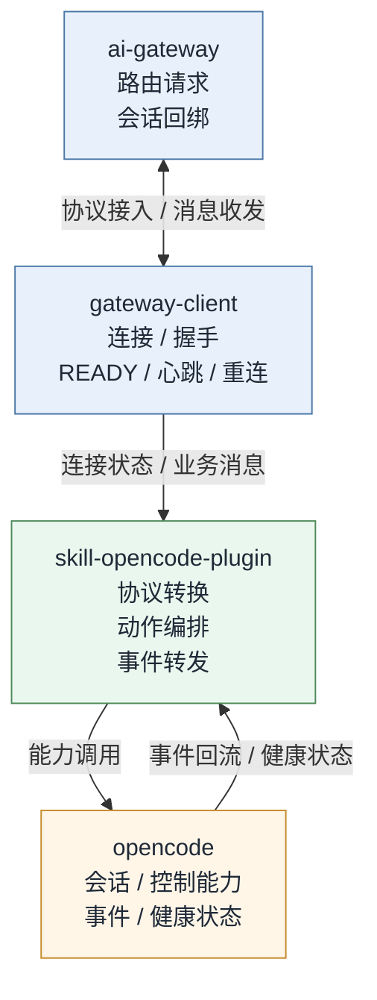
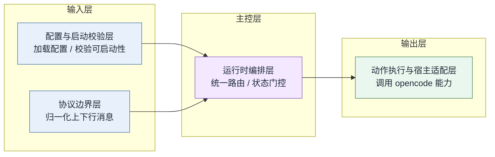
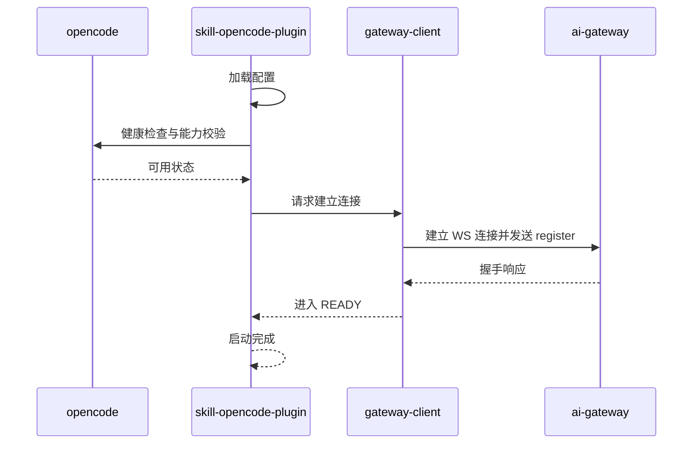
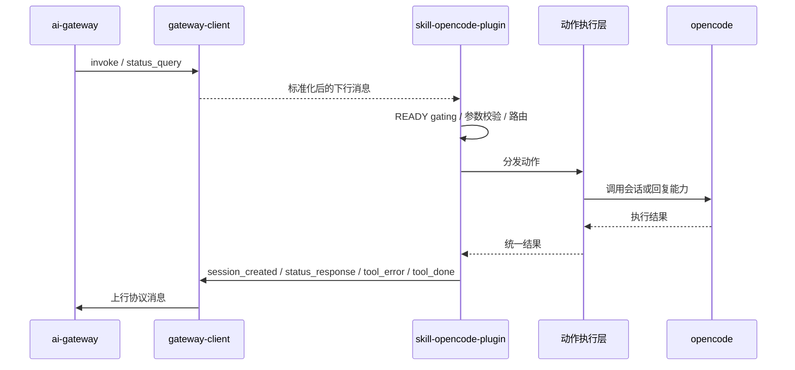
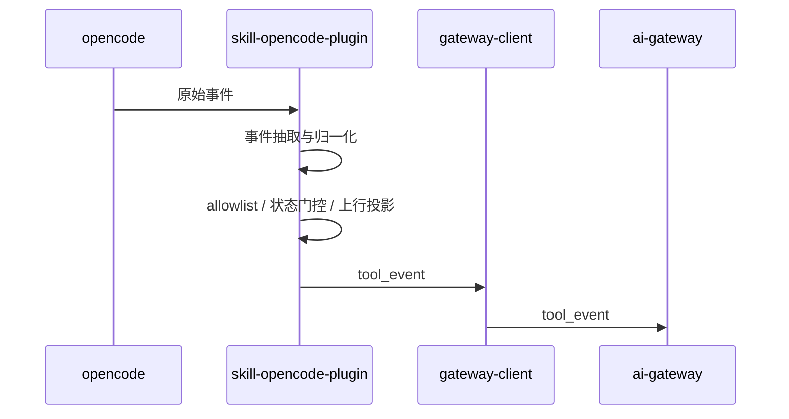

# skill-opencode-plugin 交互架构

**Version:** 1.1  
**Date:** 2026-05-12  
**Status:** Active  
**Owner:** message-bridge maintainers  
**Related:** `../product/prd.md`, `./overview.md`

## In Scope

1. 说明 `skill-opencode-plugin`、`opencode` 与 `ai-gateway` 的架构边界与协作关系。
2. 说明 `skill-opencode-plugin` 内部的主要分层、上下行消息路径与关键状态约束。
3. 通过图示说明启动建连、下行执行、上行转发三条主链路。

## Out of Scope

1. 不展开 `ai-gateway`、`skill-server`、UI 的服务端内部实现。
2. 不讨论源码文件、类名、函数名或目录导航。
3. 不记录需求差异、文档对比、评审结论或实现追踪细节。

## External Dependencies

1. `ai-gateway` 负责路由、会话回绑与外部协议接入。
2. `opencode` 负责提供会话能力、原始事件流与健康状态。
3. `gateway-client` 负责握手、心跳、重连与 READY 状态管理。

## 1. 架构目标

这套架构的目标是：

1. 让 `opencode` 能力以稳定的插件协议暴露给 `ai-gateway`。
2. 将连接管理、协议归一化与业务执行分层隔离。
3. 在连接未就绪、协议不合法或宿主不可用时保持 fail-closed。

## 2. 角色与边界

### 2.1 角色划分

| 角色 | 职责 |
|---|---|
| `opencode` | 提供会话创建、消息发送、会话控制、权限回复、问题回复、健康检查与原始事件 |
| `skill-opencode-plugin` | 负责桥接编排、协议转换、动作分发、事件转发与状态门控 |
| `gateway-client` | 负责 WebSocket 连接、握手、READY 判定、心跳与重连 |
| `ai-gateway` | 下发插件动作，接收插件事件、错误、完成态与状态结果 |

### 2.2 边界原则

1. `skill-opencode-plugin` 是桥接编排层，不承担服务端业务路由职责。
2. `skill-opencode-plugin` 可以适配 `opencode` 能力，但不重定义其业务语义。
3. 连接状态机由 `gateway-client` 负责，`skill-opencode-plugin` 只消费其连接状态与收发能力。
4. 原始协议字段只应在边界归一化阶段读取，不能散落到运行时编排与动作执行层。

## 3. 总体架构图

### 3.1 分层关系说明

1. `ai-gateway` 位于系统上游，负责面向外部请求方提供路由与协议入口。
2. `gateway-client` 位于 `ai-gateway` 与 `skill-opencode-plugin` 之间，负责共享连接能力与连接状态治理。
3. `skill-opencode-plugin` 位于桥接中枢层，负责把 gateway 协议语义转换成 `opencode` 可执行能力。
4. `opencode` 位于底层能力层，负责实际提供会话、控制、事件与健康状态。

## 4. `skill-opencode-plugin` 内部架构图

### 4.1 分层说明

| 层 | 职责 | 关键约束 |
|---|---|---|
| 配置与启动校验层 | 加载配置、校验宿主能力、确认可启动条件 | 启动前失败必须直接中止 |
| 协议边界层 | 归一化上行事件与下行消息 | 负责读取原始字段并输出标准化结果 |
| 运行时编排层 | 承接消息主链路、状态门控、发送出口与日志上下文 | 不直接解析原始协议字段 |
| 动作执行与宿主适配层 | 执行 `create_session`、`chat`、`abort`、`close`、回复类动作 | 宿主调用失败必须映射成统一结果 |

### 4.2 分层关系

## 5. 启动与建连链路

### 5.1 时序图

### 5.2 架构结论

1. 启动必须先验证宿主可用，再建立网关连接。
2. READY 是业务消息收发的前置条件，不允许绕过。
3. 连接建立、心跳与重连属于 `gateway-client` 职责，不应内嵌到 `skill-opencode-plugin` 业务层。

## 6. 下行链路：`ai-gateway -> skill-opencode-plugin -> opencode`

### 6.1 时序图

### 6.2 下行职责分配

1. `ai-gateway` 只表达“要 `skill-opencode-plugin` 执行什么动作”。
2. `skill-opencode-plugin` 负责把下行消息转成统一动作上下文，并做状态门控。
3. 动作执行层负责把统一动作映射到 `opencode` 能力。
4. 下行失败必须收敛为统一错误回包，而不是直接泄露宿主调用细节。

### 6.3 下行消息结果

以下结果类型用于说明 `ai-gateway` 从插件侧可观察到的协议结果，本文不展开其内部产生细节。

| 输入类型 | 输出类型 |
|---|---|
| `invoke(create_session)` | `session_created` 或 `tool_error` |
| `invoke(chat)` | `tool_done` 或 `tool_error` |
| `invoke(abort/close/reply)` | `tool_done` 或 `tool_error` |
| `status_query` | `status_response` |

## 7. 上行链路：`opencode -> skill-opencode-plugin -> ai-gateway`

### 7.1 时序图

### 7.2 上行职责分配

1. 宿主负责产生原始事件。
2. `skill-opencode-plugin` 负责把原始事件抽取为稳定的上行事件模型。
3. allowlist 负责决定哪些事件可以离开 `skill-opencode-plugin` 边界。
4. 上行投影负责把事件整理成 gateway 可消费的传输形状。

## 8. 关键约束

### 8.1 READY gating

1. 未进入 READY 时，不发送业务上行消息。
2. 未进入 READY 时，不接受需要即时执行的业务动作。
3. READY gating 属于运行时硬约束，不做本地排队补偿。

### 8.2 fail-closed

1. 启动校验失败时直接中止启动。
2. 下行消息不合法时直接返回错误。
3. 上行事件抽取失败时直接丢弃并记录日志。
4. 宿主调用失败时直接映射为统一错误，不继续执行后续步骤。

## 9. 架构摘要

这套架构将 `skill-opencode-plugin` 定位为四层协作链路中的桥接核心：

1. 向下适配 `opencode` 能力。
2. 向上对接 `ai-gateway` 协议。
3. 向内通过分层把连接、协议与执行职责拆开。

其核心价值不在于“执行了多少业务逻辑”，而在于把边界协议、状态约束与宿主能力稳定地组织起来，使插件在连接波动、消息异常和宿主不确定性下仍保持可控行为。
