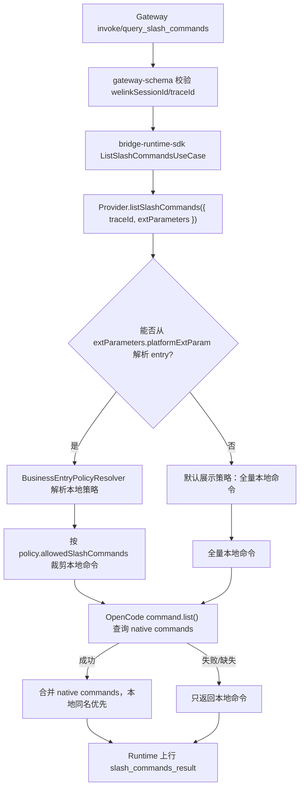
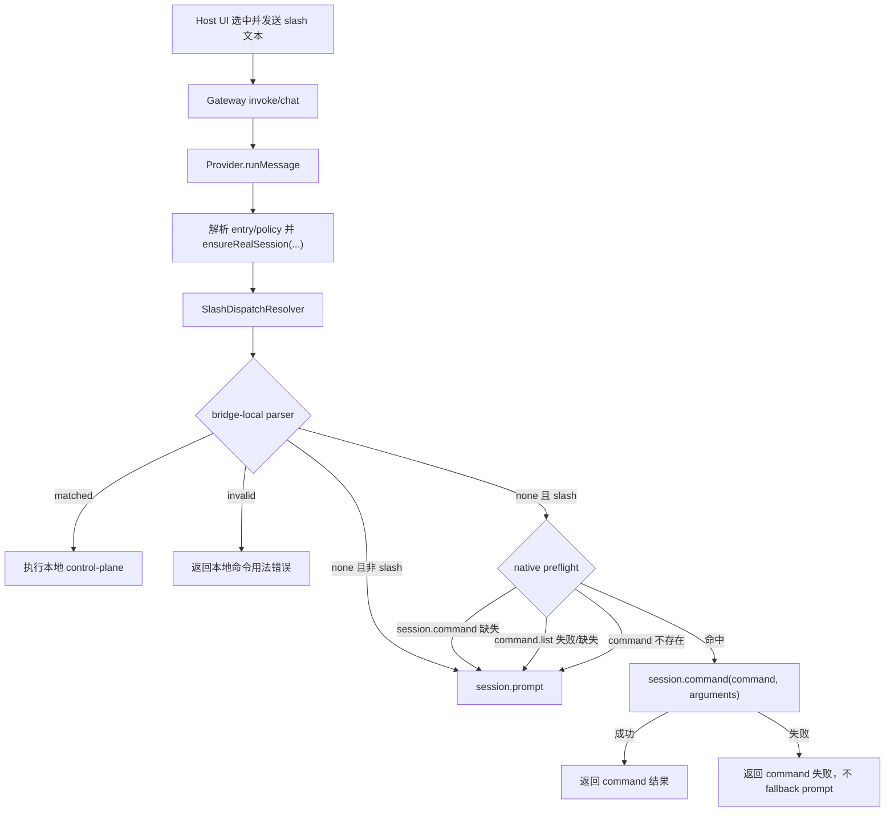
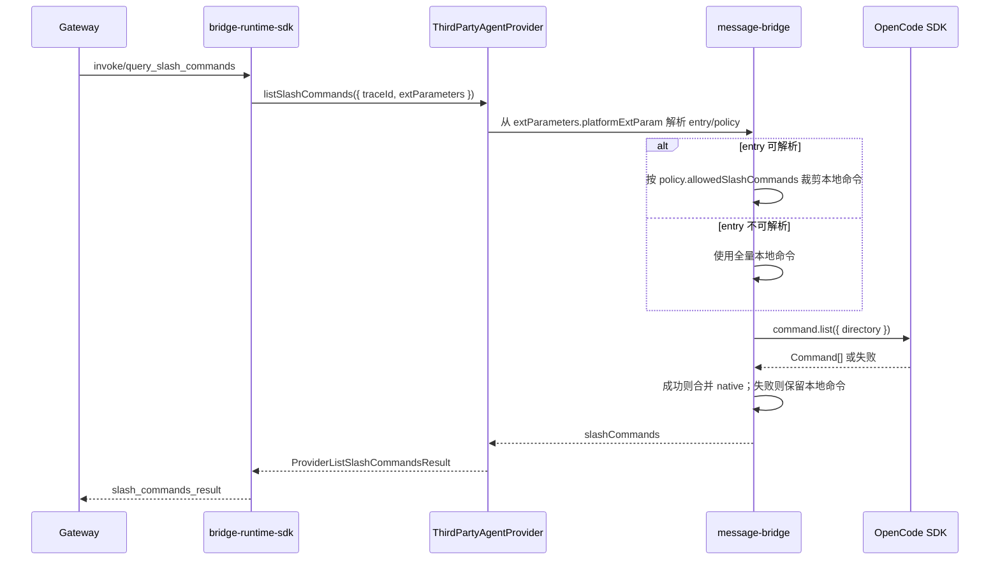
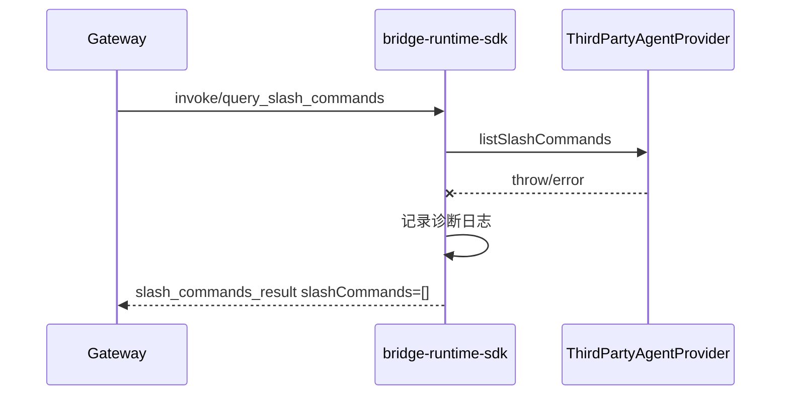
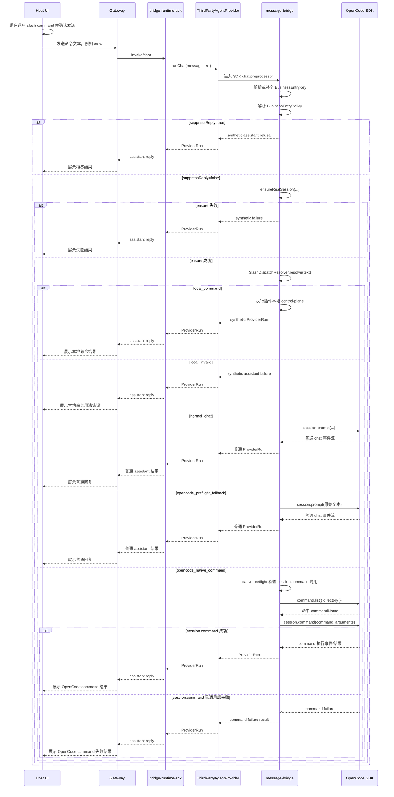

# `支持 Slash Command 列表上报技术方案`

- 方案日期：`2026-06-11`
- 目标工程：`agent-plugin`
- 参考文档：`integration/skillSDK/ai-chat-viewer/docs/plans/技术方案模板.md`
- 方案类型：`协议扩展 + Runtime SDK SPI 扩展 + OpenCode command.list 适配`

## 1. 背景

### 1.1 场景说明

Gateway 需要查询插件当前支持的 slash command 列表，用于宿主输入框、命令面板等入口展示。当前协议缺少统一查询链路。

OpenCode 已提供统一 command 列表接口 `command.list()`，该接口返回 OpenCode 可作为 slash command 使用的三类来源：

1. `source: "command"`：OpenCode 内置命令或配置中的提示词模板。
2. `source: "mcp"`：MCP server 暴露的 prompt，被 OpenCode 包装为 slash command。
3. `source: "skill"`：OpenCode skill 被包装为 slash command。

本方案直接使用 `command.list()`，三种来源全部上报，不再单独调用 `app.skills()`。

### 1.2 需求目标

1. `gateway-schema` 新增 `query_slash_commands` 下行协议和 `slash_commands_result` 上行协议。
2. `bridge-runtime-sdk` 新增 `ThirdPartyAgentProvider.listSlashCommands` SPI。
3. `message-bridge` 上报本地 slash command + OpenCode `command.list()` 返回的 command。
4. `message-bridge-openclaw` 上报空数组。
5. 明确 OpenCode command 三种 `source` 的含义，并全部上报。

### 1.3 非目标

1. 不处理服务端下发的 slash command 列表。
2. 不合并或过滤 `extParameters.platformExtParam.allowedSlashCommands`。
3. 列表查询协议不新增 slash command 专属执行协议；UI 选中后仍复用 `invoke/chat`。
4. 不新增 UI 展示逻辑。
5. 不调用 `app.skills()`。
6. 不使用 raw HTTP fallback 调用 `GET /command`。
7. 暂不新增埋码。

## 2. 方案图

### 2.1 整体方案图



### 2.2 UI 选中后发送 Slash Command 流程图

本方案只新增 slash command 列表查询与上报能力。用户在宿主 UI 中选中某个 slash command 后，不走 `query_slash_commands`，而是由宿主把选中的命令文本作为普通 `invoke/chat` 消息发送给插件，继续复用现有 slash command 执行链路。



### 2.3 方案核心

新增独立只读查询链路。OpenCode 侧以 `command.list()` 作为唯一 OpenCode command 来源，返回的 `command`、`mcp`、`skill` 三种来源全部转换为 slash command 上报。

列表查询只解决“宿主 UI 展示哪些候选命令”。本地控制命令按 `BusinessEntryPolicy.allowedSlashCommands` 裁剪；OpenCode native command 默认展示，不受本地 policy 裁剪。命令被用户选中并发送后，Gateway 仍按现有 `invoke/chat` 协议下发命令文本。插件通过 `SlashDispatchResolver` 统一区分 `bridge-local` 本地控制命令、OpenCode native command 与普通 chat：本地命令走既有 slash control-plane，OpenCode native command 通过 `session.command` 执行。

## 3. 时序图

### 3.1 查询 Slash Command 列表



### 3.2 失败返回空数组



### 3.3 UI 选中后发送 Slash Command

用户在宿主 UI 中选中 slash command 后，不走 `query_slash_commands`，而是复用现有 `invoke/chat` 链路发送命令文本。插件侧由 `SlashDispatchResolver` 统一产出分发决策，后续执行层只按决策分发。



> 注意：`session.command` 已调用后失败时不再 fallback 到 `session.prompt`，避免 OpenCode 侧已经产生部分副作用后又把同一条 slash 文本作为普通消息发送。

## 4. 技术细节

### 4.1 实现清单

1. `gateway-schema`
   - `INVOKE_ACTIONS` 增加 `query_slash_commands`。
   - 下行 schema 增加 `querySlashCommandsInvokeSchema`。
   - 上行 message type 增加 `slash_commands_result`。
   - 上行 schema 增加 `slashCommandsResultMessageSchema`。
   - fixtures 与 wire contract 测试补齐。

2. `bridge-runtime-sdk`
   - `ThirdPartyAgentProvider` 新增必选方法 `listSlashCommands`。
   - Runtime command 闭集新增 `query_slash_commands`。
   - dispatcher/usecase 调用 Provider 并投影为 `slash_commands_result`。
   - Provider 失败时返回空数组结果。

3. `message-bridge`
   - `BridgeSdkClient` 增加 `command.list()`。
   - `BridgeSdkClient.session` 增加可选 `session.command()`，用于执行 OpenCode native command。
   - `createSdkAdapter` 只适配 OpenCode SDK 高层 `command.list()` 和 `session.command()`。
   - 新增 `SlashDispatchResolver`，把 chat 文本分类为本地命令、OpenCode native command、preflight fallback 或普通 chat。
   - `OpenCodeProviderAdapter.listSlashCommands` 聚合本地 slash command 和 OpenCode `Command[]`。
   - `command.list` 与 `session.command` 不放入启动必需能力，作为查询与执行时按需使用的增强能力。

4. `message-bridge-openclaw`
   - `OpenClawProviderAdapter.listSlashCommands` 固定返回 `{ slashCommands: [] }`。

### 4.2 状态设计

1. `slashCommands`
   - 单次查询结果，不做 SDK 全局缓存。
   - OpenCode command 列表可能随目录、配置、MCP server 或 skill 变化，按需查询。

2. `traceId`
   - 查询链路诊断字段。
   - 下行必填，上行原样回传。

3. `welinkSessionId`
   - 查询链路关联字段。
   - 下行必填，上行原样回传。

### 4.3 数据与缓存处理

1. 本地 slash command
   - 来源：`message-bridge` 已实现控制面命令。
   - 上报实际支持命令，例如 `/new`、`/sessions`、`/session`、`/models`、`/model`。

2. OpenCode command 列表接口

OpenCode SDK 方法：

```ts
command.list(parameters?: {
  directory?: string;
  workspace?: string;
}): Promise<{ data: OpenCodeCommand[] }>;
```

OpenCode server route：

```http
GET /command?directory=<string>&workspace=<string>
```

OpenCode operationId：

```text
command.list
```

入参：

| 字段 | 类型 | 是否必填 | 说明 |
|---|---|---|---|
| `directory` | `string` | 否 | 查询指定工作目录下可用 command；`message-bridge` 传 `effectiveDirectory`。 |
| `workspace` | `string` | 否 | 查询指定 workspace 下可用 command；首期不传。 |

出参：`{ data: OpenCodeCommand[] }`

| 字段 | 类型 | 是否必填 | 说明 | 上报处理 |
|---|---|---|---|---|
| `data` | `OpenCodeCommand[]` | 是 | command 列表。 | 逐项转换为 `SlashCommand`。 |
| `data[].name` | `string` | 是 | command 名称，不带 `/`。 | 转为 `SlashCommand.command = "/" + name`。 |
| `data[].description` | `string` | 否 | command 描述。 | 转为 `SlashCommand.description`；缺失时使用空字符串。 |
| `data[].source` | `"command" \| "mcp" \| "skill"` | 否 | command 来源。 | 三种来源全部上报；字段本身不上报。 |
| `data[].template` | `string` | 是 | 实际执行时使用的提示词模板或内容。 | 不上报。 |
| `data[].agent` | `string` | 否 | command 指定的 OpenCode agent。 | 不上报。 |
| `data[].model` | `string` | 否 | command 指定的模型。 | 不上报。 |
| `data[].subtask` | `boolean` | 否 | 是否作为 subtask 执行。 | 不上报。 |
| `data[].hints` | `string[]` | 是 | 参数占位提示，例如 `$1`、`$ARGUMENTS`。 | 不上报。 |

3. `source` 类型含义

| source | 含义 | 上报策略 |
|---|---|---|
| `command` | OpenCode 内置命令或配置中的提示词模板，例如默认 `/init`、`/review`，以及 `opencode.json` 中配置的 command。 | 上报 |
| `mcp` | MCP server 暴露的 prompt，被 OpenCode 包装为 slash command。它不是直接调用 MCP tool，而是使用 MCP prompt 生成提示词内容。 | 上报 |
| `skill` | OpenCode skill 被包装为 slash command，template 来源于 skill content。 | 上报 |

4. OpenCode command 转换规则

- `name` 转为 `/${name}`。
- `description` 取 `description ?? ""`。
- `source` 不进入本期 Gateway 协议。
- `template`、`agent`、`model`、`subtask`、`hints` 不上报。
- 不单独调用 `app.skills()`，因为 `command.list()` 已包含 `source: "skill"` 的条目。

5. 去重与归一化

- 优先级：本地 slash command > OpenCode command.list 返回项。
- OpenCode 内部已处理 command、mcp、skill 的同名覆盖关系，插件侧只需要与本地 slash command 去重。
- 按最终 `command` 字段去重。
- `description` 由 SDK trim 后透传，不做长度截断。
- 非法 command 过滤并记录诊断日志。

### 4.4 Slash Command 执行策略

1. 默认策略
   - 列表上报不合并、不过滤 `extParameters.platformExtParam.allowedSlashCommands`。
   - 列表查询只从 `extParameters.platformExtParam` 解析业务入口，不使用 chat context 补全。
   - 无法解析业务入口时，默认展示全量本地控制命令。
   - 目标实现为“不使用服务端 allow-list”，实现阶段移除当前请求级 `allowedSlashCommands` override，只保留插件本地 `BusinessEntryPolicy` 模板。
   - `im/miniapp + direct` 入口默认允许本地控制命令：`/new`、`/sessions`、`/session`、`/models`、`/model`。
   - 其他入口默认允许本地控制命令：`/new`、`/models`、`/model`。
   - OpenCode native command 来自 `command.list()`，默认展示和执行，不受本地控制命令 allow-list 约束。
   - 本地命令与 OpenCode native command 同名时，本地命令优先。

2. 命令分类职责
   - 新增 `SlashDispatchResolver`，负责把原始 chat 文本分类为可直接分发的决策。
   - `SlashDispatchResolver` 内部先调用 bridge-local parser，识别插件本地控制命令。
   - bridge-local parser 返回 `matched` 时，分类结果为 `local_command`。
   - bridge-local parser 返回 `invalid` 时，分类结果为 `local_invalid`，不得继续尝试 OpenCode native command，也不得 fallback `session.prompt`。
   - bridge-local parser 返回 `none` 且文本不是 `/xxx` 形态时，分类结果为 `normal_chat`。
   - bridge-local parser 返回 `none` 且文本是 `/xxx` 形态时，进入 OpenCode native command preflight。
   - preflight 先确认 `session.command` 可用，再用 `command.list({ directory })` 确认 `commandName` 是否存在。
   - OpenCode native command preflight 命中时，分类结果为 `opencode_native_command`，并携带 `commandName` 与必填 `arguments`。
   - OpenCode native command preflight 失败、命令不存在或 native command 能力不可判定时，分类结果为 `opencode_preflight_fallback`。

```ts
type SlashDispatchDecision =
  | { kind: 'local_command'; command: SlashCommand }
  | { kind: 'local_invalid'; descriptor: SlashCommandDescriptor }
  | { kind: 'opencode_native_command'; commandName: string; arguments: string }
  | { kind: 'opencode_preflight_fallback'; commandName: string; reason: string }
  | { kind: 'normal_chat' };
```

3. 执行分流
   - UI/Gateway 仍只通过 `invoke/chat` 发送原始命令文本。
   - 执行层不重复解析命令，只按 `SlashDispatchDecision.kind` 分发。
   - `local_command` 执行插件本地 control-plane。
   - `local_invalid` 返回本地命令用法错误。
   - `opencode_native_command` 调用 `session.command`。
   - `opencode_preflight_fallback` fallback 到普通 `session.prompt`。
   - `normal_chat` 走普通 `session.prompt`。

4. OpenCode native command 查找与执行
   - 插件从原始文本解析 `commandName` 与 `arguments`。
   - `commandName` 不带 `/`。
   - `arguments` 为命令名后的剩余文本；为空时传空字符串 `""`，因为 OpenCode `CommandInput.arguments` 为必填 string。
   - 多行输入按 OpenCode TUI 规则处理：命令名与首段参数来自第一行，第一行之后的内容保留并拼接进 `arguments`。
   - 插件用 `command.list({ directory })` 确认 `commandName` 是否存在，不依赖 UI/Gateway 回传 `source`、`template`、`agent`、`model` 或 `hints`。
   - 命中后调用 `session.command({ sessionID, directory, command, arguments, agent?, model?, variant?, parts? })`。

5. fallback 与失败处理
   - preflight 失败时 fallback `session.prompt`，包括 `session.command` 缺失、`command.list` 查询失败、命令不存在或 OpenCode native command 能力不可判定。
   - fallback reason 固定为：`session.command_unavailable`、`command.list_failed`、`command_not_found`、`opencode_native_command_unavailable`。
   - `session.command` 已调用后失败时，不再 fallback `session.prompt`，避免重复消息或部分执行后再普通提问；该失败按 OpenCode command 失败结果返回。
   - 所有 fallback 与 command 执行失败都记录诊断日志，至少包含 `commandName`、`reason`、`traceId` 或 `runId`。
   - 不使用 raw HTTP fallback 执行 OpenCode native command。

### 4.5 接口接入

1. Gateway 下行协议

```json
{
  "type": "invoke",
  "welinkSessionId": "",
  "traceId": "",
  "action": "query_slash_commands",
  "payload": {
    "extParameters": {}
  }
}
```

字段约束：

| 字段 | 类型 | 是否必填 | 说明 |
|---|---|---|---|
| `type` | `"invoke"` | 是 | 下行 invoke 消息。 |
| `action` | `"query_slash_commands"` | 是 | 查询 slash command 列表。 |
| `welinkSessionId` | `string` | 是 | 宿主会话 ID，trim 后不能为空。 |
| `traceId` | `string` | 是 | 本次调用 traceId，trim 后不能为空。 |
| `payload.extParameters` | `ExtParameters` | 否 | 扩展参数，SDK 仅透传。 |

2. Gateway 上行协议

```json
{
  "type": "slash_commands_result",
  "welinkSessionId": "",
  "traceId": "",
  "payload": {
    "slashCommands": [
      {
        "command": "/new",
        "description": "新建会话"
      }
    ]
  }
}
```

字段约束：

| 字段 | 类型 | 是否必填 | 说明 |
|---|---|---|---|
| `type` | `"slash_commands_result"` | 是 | 查询结果消息。 |
| `welinkSessionId` | `string` | 是 | 原请求 `welinkSessionId`。 |
| `traceId` | `string` | 是 | 原请求 `traceId`。 |
| `payload.slashCommands` | `SlashCommand[]` | 是 | 插件支持的 slash command 列表。 |

失败路径统一返回空数组：

```json
{
  "type": "slash_commands_result",
  "welinkSessionId": "",
  "traceId": "",
  "payload": {
    "slashCommands": []
  }
}
```

3. Runtime SDK SPI

```ts
interface ThirdPartyAgentProvider {
  listSlashCommands(input: ProviderListSlashCommandsInput): Promise<ProviderListSlashCommandsResult>;
}

interface ProviderListSlashCommandsInput {
  traceId: string;
  extParameters?: ExtParameters;
}

interface ProviderListSlashCommandsResult {
  slashCommands: SlashCommand[];
}

interface SlashCommand {
  command: string;
  description: string;
}
```

4. `message-bridge` OpenCode SDK 适配

```ts
interface BridgeCommandClient {
  list(options?: {
    directory?: string;
    workspace?: string;
  }): Promise<{ data: OpenCodeCommand[] }>;
}

interface BridgeCommandFilePartInput {
  id?: string;
  type: 'file';
  mime: string;
  filename?: string;
  url: string;
  source?: unknown;
}

interface BridgeSessionCommandInput {
  sessionID: string;
  directory?: string;
  messageID?: string;
  agent?: string;
  model?: string;
  command: string;
  arguments: string;
  variant?: string;
  parts?: BridgeCommandFilePartInput[];
}

interface BridgeSessionClient {
  command?(options: BridgeSessionCommandInput): Promise<unknown>;
}

interface BridgeSdkClient {
  session: BridgeSessionClient;
  command?: BridgeCommandClient;
}
```

适配要求：

- `root.command.list` 存在时调用。
- `root.command.list` 缺失时跳过 OpenCode native command 合并，不影响插件启动。
- `root.session.command` 存在且 native command preflight 成功时调用。
- `root.session.command` 缺失时 fallback 到 `session.prompt`。
- `command.list` 与 `session.command` 都不使用 raw HTTP fallback。
- 不支持裸 `Command[]` 返回；`result.data` 不是数组时按 native 查询失败处理。
- OpenCode 高层 SDK 调用形态使用顶层 `sessionID`、`command`、`arguments`、`agent`、`model`、`variant`、`parts` 字段。
- OpenCode HTTP route 为 `POST /session/{sessionID}/command`，body 为 `{ messageID?, agent?, model?, command, arguments, variant?, parts? }`，返回 `{ info, parts }`。

### 4.6 边界约束

1. `welinkSessionId` 必填；缺失时 schema 校验失败。
2. Provider 未捕获异常时，Runtime 不返回错误消息，统一返回空数组。
3. OpenCode `command.list()` 缺失或失败时，Provider 保留本地命令列表并跳过 native command 合并。
4. `assistantAccount` 暂不进入 Provider `listSlashCommands` input。
5. 服务端下发 slash command 列表不参与本能力。
6. OpenCode command 的 `template` 不上报。
7. `source` 本期不上报到 Gateway。
8. `allowedSlashCommands` 只作为本地控制命令 policy 背景，不作为 OpenCode native command 的展示或执行过滤条件。
9. `session.command` 不做启动必需能力；缺失时只影响 OpenCode native command 的优先执行路径，并按 preflight fallback 走 `session.prompt`。

### 4.7 未确认项

OpenCode command 列表接口已按当前夹具源码确定为：

- SDK 方法：`command.list({ directory?, workspace? })`
- Server route：`GET /command`
- operationId：`command.list`
- 正式返回结构：`Promise<{ data: OpenCodeCommand[] }>`
- 返回来源：`command`、`mcp`、`skill`

OpenCode native command 执行接口已按 `integration/opencode` 当前源码确认：

- 目标高层方法：`session.command({ sessionID, command, arguments, agent?, model?, variant?, parts? })`
- HTTP route：`POST /session/{sessionID}/command`
- operationId：`session.command`
- `arguments` 为必填 string，空参数传 `""`
- 预期用途：执行 `command.list()` 返回的 `command`、`mcp`、`skill` 三类 native command
- 约束：只适配高层 SDK 方法，不使用 raw HTTP fallback

## 5. 性能

新增一次按需查询。OpenCode `command.list()` 会读取 command、MCP prompt 和 skill 聚合状态；OpenCode 内部已有 `Instance.state` 缓存语义。`message-bridge` 首期不增加额外缓存，避免命令变化后列表不一致。

OpenCode native command 执行时，插件可能为 preflight 再调用一次 `command.list({ directory })`。后续实现可在单次请求内复用查询结果，但不增加跨请求全局缓存。

## 6. 功耗

不新增轮询、后台任务或长连接。只有 Gateway 主动查询或用户发送 slash command 时才触发。

## 7. 埋码

无。首期暂不新增埋码。

OpenCode native command 的 preflight fallback 与 `session.command` 调用失败需要记录诊断日志，但不新增埋码事件。

## 8. 影响范围

### 8.1 直接影响

1. `packages/gateway-schema`
2. `packages/bridge-runtime-sdk`
3. `plugins/message-bridge`
4. `plugins/message-bridge-openclaw`
5. `packages/test-support`

### 8.2 间接影响

1. Gateway 服务端需要下发 `query_slash_commands` 并消费 `slash_commands_result`。
2. 宿主 UI 的 slash command 展示数据源切换为插件上报。
3. 现有 `allowedSlashCommands` 仅保留为本地控制命令执行策略背景，不作为列表展示来源，也不作为 OpenCode native command 过滤依据。

### 8.3 不影响

1. `chat`、`create_session`、`question_reply` 等现有协议。
2. Gateway 与 UI 的 slash command 执行协议形态，仍复用 `invoke/chat`。
3. OpenCode command、MCP prompt、skill 的实际执行机制。
4. OpenClaw 现有消息链路。

## 9. 测试范围

> 测试范围以宿主侧能否正确获取、展示和降级 slash command 列表为主；协议字段、SDK 接口和内部转换规则只作为支撑检查项。

### 9.1 功能测试

1. 用户进入支持 slash command 的会话入口后，宿主能获取当前插件支持的 slash command 列表。
2. OpenCode 插件在线且存在本地控制命令时，列表中包含 `/new`、`/sessions`、`/session`、`/models`、`/model` 等 bridge 控制命令。
3. OpenCode 存在原生 command 时，列表中包含对应 `/commandName`，描述与 OpenCode 返回的 `description` 一致。
4. OpenCode 存在 MCP prompt 时，列表中包含对应 `/promptName`，可与普通 command 一起展示。
5. OpenCode 存在 skill command 时，列表中包含对应 `/skillName`。
6. 本地控制命令与 OpenCode command 同名时，宿主展示本地控制命令版本。
7. OpenClaw 插件接入同一查询入口时，宿主收到空列表，不展示不可用命令。
8. 插件查询未捕获异常时，宿主收到空列表；OpenCode command 列表不可用或返回异常时，宿主仍收到本地命令列表。
9. command 描述为空或缺失时，宿主仍能展示命令名称。
10. command 描述过长时，宿主收到的描述已被限制在约定长度内，不影响列表展示。
11. UI 发送本地控制命令时，插件执行 bridge-local control-plane。
12. UI 发送 OpenCode native command 时，插件 preflight 成功后调用 `session.command`。
13. OpenCode native command preflight 失败时，插件 fallback 到 `session.prompt`。
14. `session.command` 已调用后失败时，插件不再 fallback 到 `session.prompt`。

### 9.2 兼容测试

1. `welinkSessionId` 对应的不同会话分别查询时，返回结果能正确关联到原会话，不串会话展示。
2. 弱网、重连或 Gateway 短暂不可用后再次查询，宿主仍能获得列表或稳定空列表。
3. command 列表为空时，宿主不展示 slash command 候选，现有聊天发送能力不受影响。
4. command 名称包含非法格式时，该项不展示，其他合法命令仍正常展示。
5. 中文、英文、空描述、长描述在宿主列表中均能正常展示。
6. 旧版本 OpenCode 不支持 command 列表能力时，不影响插件启动、普通聊天链路和本地命令展示。
7. 旧版本 OpenCode 不支持 `session.command` 时，OpenCode native command 走 preflight fallback，不影响插件启动。

### 9.3 回归测试

1. 普通消息发送、会话创建、问题回复、权限回复等现有链路保持可用。
2. 已有本地 slash command 执行链路保持原行为，不因列表上报改造改变执行结果。
3. 服务端下发的 `allowedSlashCommands` 不作为列表展示来源，也不作为 OpenCode native command 过滤依据。
4. OpenCode command、MCP prompt、skill 的实际执行机制不因本次列表查询改造发生变化。

### 9.4 技术一致性检查

1. 实现行为与本方案中的协议、SDK SPI、OpenCode 接口选择和失败降级策略保持一致。
2. Gateway 公开协议文档已同步新增 `query_slash_commands` 和 `slash_commands_result`。
3. Runtime SDK 公开接口文档已同步新增 `listSlashCommands` 及相关入参与出参说明。
4. 插件接入文档已说明 OpenCode 使用 `command.list()` 作为 slash command 列表来源，OpenClaw 返回空列表。
5. 需求文档、技术方案和公开接口文档中关于服务端下发 slash command 列表不再参与展示来源的口径一致。
6. OpenCode native command 执行路径已说明 `session.command` preflight、fallback 与调用后失败不 fallback 的边界。

## 10. 最终建议

推荐按“独立查询协议 + 必选 Provider SPI + OpenCode `command.list()` 聚合接口适配”实现列表上报，并把 UI 选中后的执行明确拆成 bridge-local 与 OpenCode native 两条路径。

OpenCode `command.list()` 已经聚合普通 command、MCP prompt 和 skill 三类可调用命令。本方案三类全部上报，插件只转换 `name` 和 `description`，不向 Gateway 暴露 `template` 等执行细节。OpenCode native command 执行时，插件侧用 `command.list()` 做 preflight，优先调用高层 `session.command`；preflight 失败 fallback 到 `session.prompt`，`session.command` 已调用后失败则不再 fallback。
