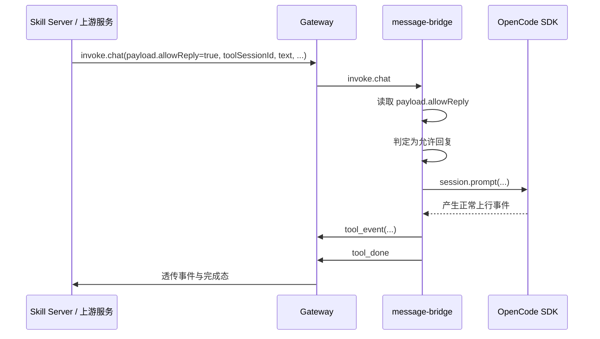
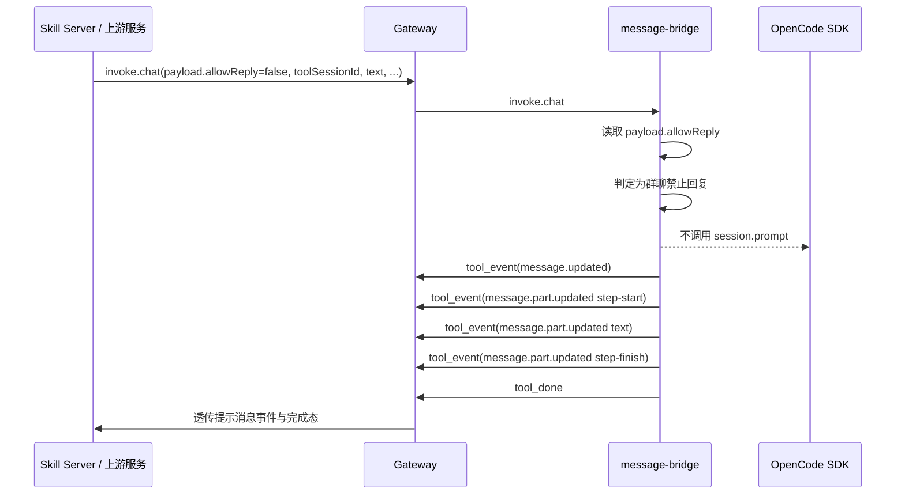
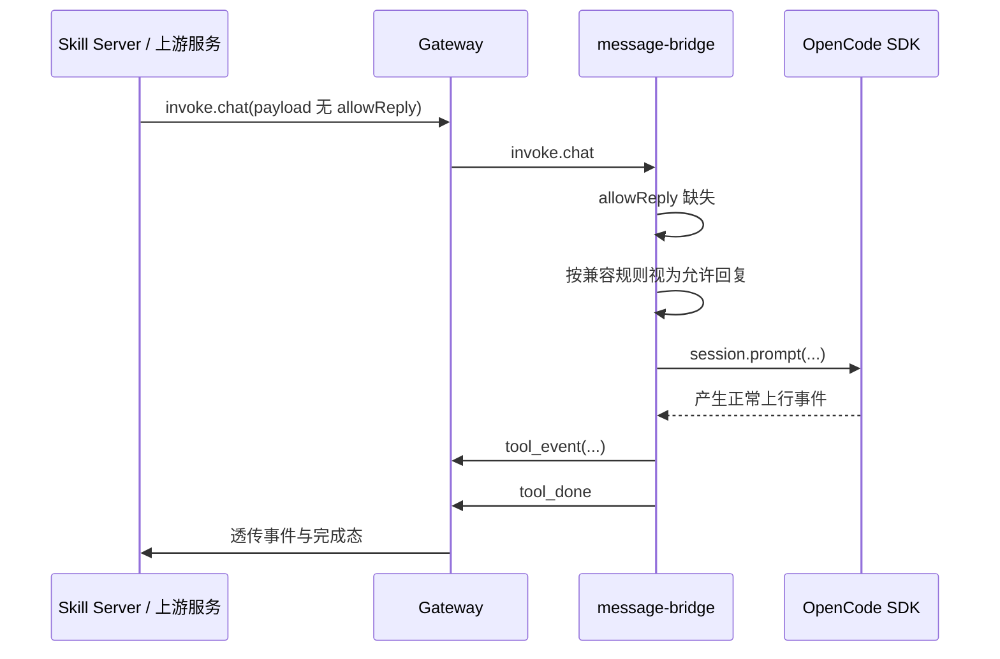

# 群聊消息回复控制修正方案

**Version:** 2.5  
**Date:** 2026-05-08  
**Status:** Draft  
**Owner:** message-bridge maintainers  
**Related:** `../product/prd.md`, `../architecture/overview.md`, `./interfaces/protocol-contract.md`, `../../../../integration/opencode-cui/docs/superpowers/specs/2026-04-10-stream-protocol.md`

## 摘要

本方案将原“插件侧基于群聊特征自行判定并拦截”的设计，修正为“由服务端显式下发群聊回复许可，`message-bridge` 仅按协议执行”。

当 `invoke.chat.payload.allowReply === false` 时，bridge 不进入 OpenCode 真正推理链路，不调用 `session.prompt`，而是回放一组符合当前共享 schema 与 OpenCode 事件模型的助手提示消息事件，正文固定为：

`本机器人不处理群聊消息，请勿在群内@提问`

随后发送 `tool_done`，让上游按成功完成处理。  
当 `allowReply` 缺失或为 `true` 时，保持现有 chat 行为不变。

## In Scope

- 扩展 `gateway-schema` 中 `invoke.chat.payload` 的正式契约
- 使共享 schema 与 `opencode-cui` 当前实际下行 chat payload 对齐
- 在 `message-bridge` 的 `invoke.chat` 链路前增加 `allowReply` 判定
- 在禁止回复分支中回放固定助手消息事件并发送 `tool_done`
- 更新 `message-bridge` 设计文档与时序图
- 补充共享契约测试与 `message-bridge` 单元测试所需的设计依据

## Out of Scope

- 不修改 `ai-gateway` 业务路由逻辑
- 不在插件侧新增群聊缓存、TTL、LRU 或持久化状态
- 不通过 `title =~ ^im-group` 参与 chat 是否允许回复的判断
- 不新增新的上行协议消息类型
- 不修改 `opencode-cui` 的 `step.done` 消费与去重逻辑
- 不在本轮把提示文案改为服务端可配置字段

## External Dependencies

- `opencode-cui` / 上游服务：负责在下发 `invoke.chat` 时显式给出 `allowReply`
- `packages/gateway-schema`：需要将 `chat payload` 从当前精简版扩展为正式业务契约
- `skill-server`：当前实际已下发 `assistantAccount`、`sendUserAccount`、`imGroupId` 等字段；本方案要求共享契约正式承认这些字段
- 若上游暂未下发 `allowReply`，bridge 默认按“允许回复”处理，保持兼容

## 设计目标

### 核心目标

1. 群聊 chat 是否允许进入真实回复链路由服务端单点决定
2. `message-bridge` 不再持有群聊业务判定逻辑
3. 历史未携带 `allowReply` 的请求继续兼容
4. 非允许回复的群聊 chat 不触发 OpenCode 推理链路
5. 成功完成态仍使用现有 `tool_done`

### 非目标

1. 不在本轮定义服务端如何计算 `allowReply`
2. 不在本轮修复消费侧重复 `step.done`
3. 不将 `imGroupId` 继续作为插件侧拦截依据

## 协议设计

### 下行 `chat payload` 正式定义

```ts
interface ChatPayload {
  toolSessionId: string;
  text: string;
  assistantId?: string;
  assistantAccount?: string;
  sendUserAccount?: string;
  imGroupId?: string;
  allowReply?: boolean;
}
```

### 字段规则

- `toolSessionId`：必填，非空字符串
- `text`：必填，非空字符串
- `assistantId`、`assistantAccount`、`sendUserAccount`、`imGroupId`：可选，非空字符串时保留
- `allowReply`：可选布尔值
- 可选字符串字段为空串或空白串时按缺失处理
- `allowReply` 缺失时，语义等价于“允许回复”
- 除 `allowReply` 外，其余新增字段本轮仅用于契约对齐与兼容保留，不参与 bridge 行为判定

### 语义约束

- `allowReply === false`：仅表示“当前群聊消息禁止进入真实回复链路”
- `allowReply === true`：允许正常回复
- `allowReply` 不是通用静音/禁回开关
- 服务端不会把 `allowReply=false` 用于非群聊业务场景

## 关键流程

### `invoke.chat` 判定顺序

1. 读取 `payload.allowReply`
2. 若 `allowReply === false`：
   - runtime 在进入普通 `chat` 生命周期前直接短路
   - 不调用 `toolDoneCompat.handleInvokeStarted()`
   - 不进入 `ChatAction` / `ChatUseCase`
   - 不调用 `session.prompt`
   - 合成固定提示消息的 OpenCode 事件流
   - deny 分支自行发送唯一一次 `tool_done`
   - 发送完成后立即返回
3. 否则：
   - 走现有 `ChatAction` / `ChatUseCase`
   - 正常调用 `session.prompt`

### deny 分支与 `tool_done` 收口

当 `payload.allowReply === false` 时，本方案不复用普通 `chat` invoke 成功后的 compat 完成态链路，而是在 runtime 的 `invoke.chat` 分发层直接走独立 deny fast path，由 deny 分支自行发送唯一一次 `tool_done`。

这样设计的原因是：

1. 当前 `tool_done` compat 机制属于 gateway `invoke` 生命周期编排逻辑，状态登记、成功收口与 `session.idle` 兜底均位于 runtime 层，而不属于 `ChatUseCase` 职责。
2. `ChatUseCase` 仅负责将 `chat payload` 转换为 `session.prompt(...)` 调用，不负责 gateway 回包、compat 状态维护或完成态发送。
3. 若 deny 分支进入普通 `chat` 成功链路，再由分支内部额外发送 `tool_done`，会与现有 `invokeCompleted -> tool_done` 机制重叠，并可能污染 `session.idle` 的 compat 兜底状态。

完成态约束：

- deny 分支不得向 `ToolDoneCompat` 登记 pending session
- deny 分支不得依赖后续 `session.idle` 触发兜底完成态
- deny 分支的完成态来源只能是其自身显式发送的 `tool_done`
- 普通允许回复分支的 `tool_done` 机制保持不变

### 禁止回复分支的消息正文

固定正文：

`本机器人不处理群聊消息，请勿在群内@提问`

正文来源规则：

- 本轮由插件固定写死
- 服务端只负责给出 `allowReply=false`
- 不新增 `denyReplyText` 之类协议字段

## 回放事件模型

### 设计基线

禁止回复分支的 synthetic 事件，必须同时满足两层约束：

1. 与当前 `opencode` 公开事件类型定义一致
2. 与本仓库 `packages/gateway-schema` 的 canonical shape 一致

采用以下基线：

- `message.updated`
  - `type: "message.updated"`
  - `properties.info: Message`
- `message.part.updated`
  - `type: "message.part.updated"`
  - `properties.part: Part`
  - `properties.delta?: string`
- `Part` 正式包含：
  - `step-start`
  - `text`
  - `step-finish`
- assistant message 允许带 `finish`
- `step-finish` part 允许带 `reason`、`tokens`、`cost`

本方案以下游共享 schema 为最终落地真源：

- `message.updated` 主体写入 `properties.info`
- `message.part.updated` 主体写入 `properties.part`
- `step-finish` 使用 `tokens`、`cost`、`reason`
- 不使用旧文档中的 `usage`、`finishReason` 字段名

### synthetic ID 生成约束

禁止回复分支生成的 synthetic OpenCode 标识，必须尽量贴近真实 OpenCode 标识格式，并保证唯一性。

约束：

- synthetic assistant message 的 `messageId` 必须使用 `msg_` 前缀
- synthetic parts 的 `part.id` 必须使用 `prt_` 前缀
- 不得使用 `stepStartPartId` / `textPartId` / `stepFinishPartId` 这类占位式命名作为真实值
- 同一条 deny synthetic 消息中的 3 个 `part.id` 必须彼此不同
- 每次命中 deny 分支时，生成的 `messageId` 与全部 `part.id` 都必须是新的，不能复用上一次 invoke 的值

生成策略：

```ts
messageId = `msg_${randomUUID().replace(/-/g, '')}`;
stepStartPartId = `prt_${randomUUID().replace(/-/g, '')}`;
textPartId = `prt_${randomUUID().replace(/-/g, '')}`;
stepFinishPartId = `prt_${randomUUID().replace(/-/g, '')}`;
```

目标：

- 前缀风格与真实事件一致
- 字符串格式稳定
- 全局唯一性足够高

### 事件序列

命中 `allowReply === false` 后，按固定顺序发送：

1. `tool_event(message.updated)`
2. `tool_event(message.part.updated)`，`part.type = "step-start"`
3. `tool_event(message.part.updated)`，`part.type = "text"`
4. `tool_event(message.part.updated)`，`part.type = "step-finish"`
5. `tool_done`

### 字段约束

#### 1. 首条 `message.updated`

```json
{
  "type": "message.updated",
  "properties": {
    "info": {
      "id": "msg_<unique>",
      "sessionID": "<toolSessionId>",
      "role": "assistant",
      "time": {
        "created": <createdAtMs>
      }
    }
  }
}
```

约束：

- `properties.info.id` 使用 `msg_` 前缀
- `properties.info.sessionID = toolSessionId`
- `properties.info.role = "assistant"`
- `properties.info.time.created = 首次创建时间戳`
- 本条不带 `finish`

#### 2. `step-start`

```json
{
  "type": "message.part.updated",
  "properties": {
    "part": {
      "id": "prt_<unique>",
      "sessionID": "<toolSessionId>",
      "messageID": "msg_<same-message-id>",
      "type": "step-start"
    }
  }
}
```

#### 3. `text`

```json
{
  "type": "message.part.updated",
  "properties": {
    "part": {
      "id": "prt_<unique>",
      "sessionID": "<toolSessionId>",
      "messageID": "msg_<same-message-id>",
      "type": "text",
      "text": "本机器人不处理群聊消息，请勿在群内@提问"
    }
  }
}
```

#### 4. `step-finish`

```json
{
  "type": "message.part.updated",
  "properties": {
    "part": {
      "id": "prt_<unique>",
      "sessionID": "<toolSessionId>",
      "messageID": "msg_<same-message-id>",
      "type": "step-finish",
      "reason": "stop"
    }
  }
}
```

约束：

- 三个 `part.id` 都使用 `prt_` 前缀
- 三个 `part.id` 两两不同
- 三个 `part.messageID` 全部等于同一个 synthetic `messageId`
- `step-finish.reason` 使用真实 OpenCode 风格值 `stop`
- `tokens`、`cost` 本方案可省略，不强制伪造

### 为什么不再回放第二条 `message.updated(finish)`

虽然 assistant message 类型允许带 `finish`，消费侧也能把 `message.updated(info.finish)` 翻译成一个 `step.done`，但 deny 分支是完全可控的 synthetic 流，不需要为了“更像真实流”而主动制造第二个完成来源。

本方案仅保留 `step-finish` 作为步骤完成信号，原因如下：

- 已足够表达“本条 assistant 提示消息已完成”
- 可避免消费侧额外产生第二个 `step.done`
- 降低 synthetic 流对现有消费逻辑的副作用
- 保持最小必要事件集

## 发送约束

deny 分支生成的 synthetic 事件不要求伪装为真实 OpenCode 上游事件并重走完整 upstream 提取链路，但必须满足以下约束：

- 事件 shape 必须符合共享 schema
- 必须使用现有 `tool_event` 上行消息结构发送
- 必须经过统一的上行消息校验
- 必须通过现有发送出口发往 gateway
- 不得旁路当前统一的 gateway 发送与日志链路

## 时序图

### 正常允许回复的 chat



### 显式禁止回复的群聊 chat



### 历史兼容 chat



## 测试方案

### 共享契约测试

1. `chat payload` 带完整扩展字段时校验通过并保留有效值
2. `allowReply: false` 时校验通过并保留
3. `allowReply: true` 时校验通过并保留
4. 不带 `allowReply` 的历史请求继续通过
5. `assistantAccount`、`sendUserAccount`、`imGroupId` 为空串或空白串时按缺失处理

### `message-bridge` 单测

1. deny 分支不调用 `session.prompt`
2. deny 分支只发送 4 条 `tool_event` 与 1 条 `tool_done`
3. `messageId` 使用 `msg_` 前缀
4. `part.id` 使用 `prt_` 前缀
5. 三个 `part.id` 唯一
6. 三个 `part.messageID` 绑定同一个 `messageId`
7. `step-finish.reason === "stop"`
8. 不发送第二条带 `finish` 的 `message.updated`
9. 连续两次 deny invoke 的 synthetic IDs 不复用
10. deny synthetic 事件经过统一上行校验与发送出口，并通过共享 schema 校验

### 回归测试

1. `create_session` 的 `im-group` 权限 deny 注入逻辑不受影响
2. 非 chat action 不受影响
3. 历史最小 `chat payload` 仍可通过共享 schema 与 bridge 链路
4. deny synthetic 流只产生一个 `step.done` 来源

## 风险与兼容说明

### 已接受风险

1. 上游若未及时下发 `allowReply`
- bridge 将按“允许回复”处理
- 不会自动退回到插件本地群聊推断

2. 服务端策略计算错误会直接影响是否回复
- 该风险属于上游业务判定责任
- 不由插件侧兜底修正

3. 共享契约扩宽后，bridge 会正式接受更多 chat 业务字段
- 但本轮仅 `allowReply` 参与插件行为判定
- 其余字段仅用于契约对齐与兼容保留

## 假设

1. `allowReply` 是服务端下发的一手群聊回复许可信号
2. 服务端不会把 `allowReply=false` 用于非群聊业务场景
3. 固定提示文案本轮由插件维护，不由服务端下发
4. synthetic `messageId` 与 `part.id` 无需完全复刻 OpenCode 内部算法，但必须保持真实前缀风格与高熵唯一性
5. `assistantAccount`、`sendUserAccount`、`imGroupId` 是 `opencode-cui` 现有 chat payload 的真实组成部分，应纳入正式共享契约
6. 本次实现范围仅包含 `plugins/message-bridge` 与 `packages/gateway-schema`
7. 不修改 `integration/opencode-cui` 代码，仅以其当前真实下行结构和消费约定作为协议收敛依据
