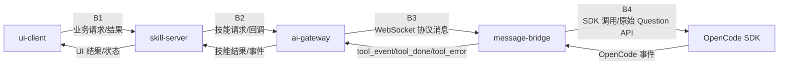
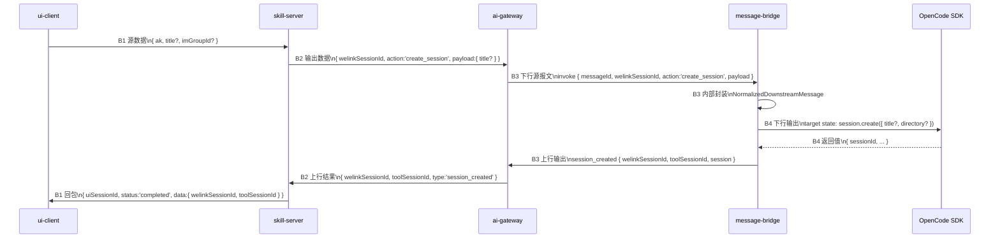
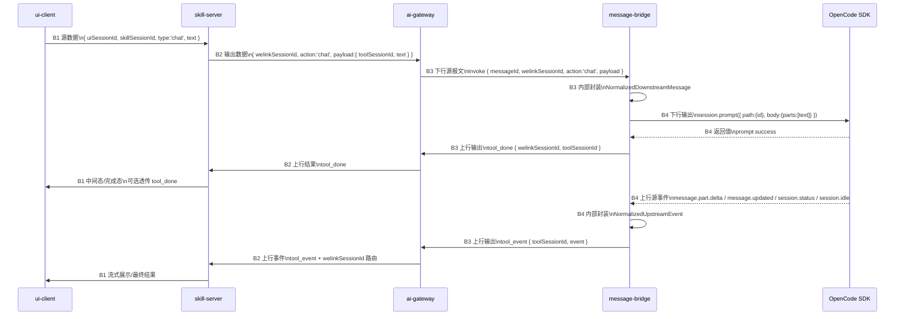
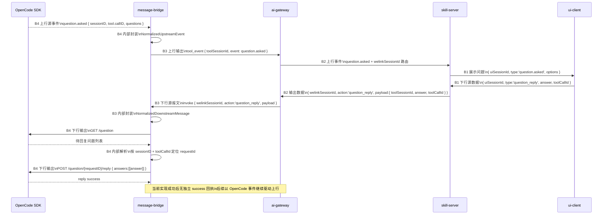

# OpenCode 全链路接口与报文分层说明

**Version:** 1.1  
**Date:** 2026-03-11  
**Status:** Active  
**Owner:** message-bridge maintainers  
**Related:** `../../product/prd.md`, `./protocol-contract.md`, `../../../src/runtime/BridgeRuntime.ts`, `../../../src/protocol/downstream/DownstreamMessageNormalizer.ts`, `../../../src/protocol/upstream/UpstreamEventExtractor.ts`

## In Scope

1. 说明 `ui-client`、`skill-server`、`ai-gateway`、`message-bridge`、`OpenCode SDK` 的分层关系。
2. 按接口边界梳理每层之间的接口定义、接口报文与字段归属。
3. 说明每一层的源数据、内部封装数据、输出数据。

## Out of Scope

1. 不定义 `skill-server`、`ai-gateway`、`ui-client` 的服务端内部实现。
2. 不新增插件范围外的协议需求。
3. 不规定服务端幂等、去重、消息持久化与告警机制。

## External Dependencies

1. `ui-client <-> skill-server` 的具体 HTTP/RPC 接口由上游产品与服务端仓库定义。
2. `skill-server <-> ai-gateway` 的南北向接口由服务端仓库定义。
3. `ai-gateway <-> message-bridge` 与 `message-bridge <-> OpenCode SDK` 的内容以当前插件源码为准。
4. 本文中对 `ui-client`、`skill-server`、`ai-gateway` 的非插件内细节，仅作为联调视角的边界说明，联调前需在对应仓库核实。

## 1. 总览

### 1.1 五个节点，四个接口边界



### 1.2 分层原则

1. 本文不按“组件介绍”展开，而按“接口边界”展开。
2. 每个边界都要明确三类数据：
   - 源数据：本层收到的原始报文
   - 内部数据：本层内部封装或归一化对象
   - 输出数据：本层发给下一层的报文
3. `message-bridge` 是协议变换层，不是业务编排中心；它只负责 `B3` 和 `B4`。

### 1.3 全链路数据视图

```mermaid
flowchart LR
  A["UI 原始请求"] --> B["B1: skill-server 业务入参"]
  B --> C["B2: gateway 业务请求"]
  C --> D["B3 源数据:\ninvoke/status_query"]
  D --> E["bridge 内部数据:\nNormalizedDownstreamMessage"]
  E --> F["B4 输出:\nSDK 调用 / question API"]
  F --> G["OpenCode 源事件"]
  G --> H["bridge 内部数据:\nNormalizedUpstreamEvent"]
  H --> I["B3 输出:\ntool_event/tool_done/tool_error/..."]
  I --> J["B2: 技能结果/事件"]
  J --> K["B1: UI 结果"]
```



## 2. 全局 ID 与字段归属

### 2.1 统一字段表

| 字段 | 生成方 | 首次出现边界 | 消费方 | 是否允许中间层改写 | 说明 |
|---|---|---|---|---|---|
| `uiSessionId` | `ui-client` 或 `skill-server` | `B1` | `skill-server` | 否 | UI 侧会话标识，本文仅保留占位，不在插件协议中出现 |
| `welinkSessionId` | `skill-server` / `ai-gateway` | `B2/B3` | `ai-gateway`、`message-bridge` | 否 | 技能侧会话标识，插件只透传回包 |
| `toolSessionId` | `OpenCode SDK` | `B4` | `message-bridge`、`ai-gateway`、`skill-server` | 否 | OpenCode 会话标识 |
| `messageId` | `ai-gateway` | `B3` | `message-bridge` | 否 | 当前实现只用于 trace/log，上游可选下发 |
| `permissionId` | `OpenCode` 事件 | `B4` 上行 | `message-bridge`、后续 `permission_reply` | 否 | 权限请求标识 |
| `toolCallId` | `OpenCode` 事件 | `B4` 上行 | `question_reply` | 否 | 工具调用标识 |
| `requestId` | `OpenCode question API` | `B4` 内部 | `message-bridge` | 否 | 仅 bridge 内部解析，不对外暴露 |
| `opencode messageID` | `OpenCode` 事件 | `B4` 上行 | `message-bridge` | 否 | 仅用于日志与追踪 |
| `opencode partID` | `OpenCode` 事件 | `B4` 上行 | `message-bridge` | 否 | 仅用于日志与追踪 |

### 2.2 字段归属声明

| 字段 | 哪层定义 | 哪层透传 | 哪层禁止改写 |
|---|---|---|---|
| `welinkSessionId` | `B2` | `B3`、回包路径 | `message-bridge`、`OpenCode SDK` |
| `toolSessionId` | `B4` | 回到 `B3/B2/B1` | `ai-gateway`、`skill-server` |
| `messageId` | `B3` | 仅 trace 上下文 | `message-bridge` 不重新生成替代上游值 |
| `permissionId/toolCallId` | `B4` 上行事件 | `B3`、`B2` 业务处理 | `skill-server`、`ai-gateway` |

## 3. 接口边界 B1: `ui-client <-> skill-server`

### 3.1 接口职责

`ui-client` 向 `skill-server` 发起业务请求，`skill-server` 向 UI 返回业务结果或中间态。

### 3.2 传输方式

该层通常是 HTTP、RPC 或 SSE/WebSocket。当前仓库未实现该边界，仅保留联调视角。

### 3.3 本层数据分类

| 数据类别 | 归属 | 当前状态 |
|---|---|---|
| 源数据 | UI 请求体 | 外部依赖，待服务端仓核实 |
| 内部数据 | `skill-server` 业务对象 | 外部依赖 |
| 输出数据 | 发往 `ai-gateway` 的业务请求 | 外部依赖 |

### 3.4 推荐梳理内容

| 项 | 建议在服务端文档中明确 |
|---|---|
| 创建会话 | UI 是否先创建技能会话，再触发 OpenCode 会话创建 |
| 聊天请求 | UI 是否只传 `text`，还是还传业务上下文 |
| 中间态展示 | UI 是否消费 streaming 事件、完成态、错误态 |
| 异常 | UI 如何区分用户错误、系统错误、超时 |

### 3.5 推荐联调样例报文（非插件冻结协议）

以下内容是为了方便跨仓联调给出的推荐样例，不代表当前插件仓对 `B1` 的正式冻结契约。

#### 3.5.1 B1 下行源数据样例：UI 发起聊天

```json
{
  "uiSessionId": "ui-42",
  "skillSessionId": "skill-42",
  "type": "chat",
  "text": "hello",
  "context": {
    "scene": "copilot"
  }
}
```

#### 3.5.2 B1 内部数据样例：skill-server 业务对象

```json
{
  "uiSessionId": "ui-42",
  "welinkSessionId": "skill-42",
  "intent": "chat",
  "input": {
    "text": "hello"
  },
  "context": {
    "scene": "copilot"
  }
}
```

#### 3.5.3 B1 输出数据样例：skill-server 发往 B2

```json
{
  "welinkSessionId": "skill-42",
  "action": "chat",
  "payload": {
    "text": "hello"
  }
}
```

#### 3.5.4 B1 回包样例：skill-server 返回 UI

```json
{
  "uiSessionId": "ui-42",
  "type": "chat_result",
  "status": "completed",
  "data": {
    "welinkSessionId": "skill-42",
    "toolSessionId": "tool-42"
  }
}
```

### 3.6 B1 建议字段映射

| UI 字段 | skill-server 内部字段 | 向 B2 输出字段 | 说明 |
|---|---|---|---|
| `uiSessionId` | `uiSessionId` | 可不下发 | UI 侧只在 B1 内可见也可接受 |
| `skillSessionId` | `welinkSessionId` | `welinkSessionId` | 建议在 B1 完成命名收敛 |
| `text` | `input.text` | `payload.text` | 聊天内容 |
| `context` | `context` | `metadata/context` | 是否继续向下传由 B2 决定 |

## 4. 接口边界 B2: `skill-server <-> ai-gateway`

### 4.1 接口职责

`skill-server` 把技能请求交给 `ai-gateway`，`ai-gateway` 负责把请求路由到正确的 agent，并把结果事件回推给 `skill-server`。

### 4.2 传输方式

该层通常是 HTTP 或服务端内部 RPC。当前仓库未实现该边界，仅从测试文档可见其业务意图。

### 4.3 本层数据分类

| 数据类别 | 归属 | 当前状态 |
|---|---|---|
| 源数据 | skill 业务请求 | 外部依赖 |
| 内部数据 | gateway 路由对象、agent 映射关系 | 外部依赖 |
| 输出数据 | 发往插件的 `invoke/status_query` 或回传给 skill 的结果 | 仅 `B3` 报文在插件仓可见 |

### 4.4 本层必须明确的映射

| 映射关系 | 说明 |
|---|---|
| `welinkSessionId -> agent/tool 路由` | 技能会话如何定位到目标插件 |
| `toolSessionId -> welinkSessionId` | 上行 `tool_event` 不带 `welinkSessionId`，网关必须能回路由 |
| `tool_done` 是否仍需透传 | UI/skill 是否依赖 compat 完成消息 |

### 4.5 推荐联调样例报文（非插件冻结协议）

以下内容是推荐的 `skill-server <-> ai-gateway` 样例，目的是让 `B2` 和 `B3` 能够平滑衔接；真正冻结契约应以服务端仓为准。

补充说明：

- 下文中的 `create_session` 示例已按 UI -> skill-server -> gateway 的上游追溯结果收敛为 `payload.title`
- `directory` 已按统一 `effectiveDirectory` 模型落地到相关下行调用

#### 4.5.1 B2 下行源数据样例：skill-server 请求 gateway 创建 OpenCode 会话

```json
{
  "welinkSessionId": "skill-42",
  "action": "create_session",
  "payload": {
    "title": "帮我创建一个 React 项目"
  }
}
```

#### 4.5.2 B2 内部数据样例：gateway 路由对象

```json
{
  "welinkSessionId": "skill-42",
  "agentId": "bridge-001",
  "target": "message-bridge",
  "request": {
    "type": "invoke",
    "messageId": "gw-msg-2",
    "welinkSessionId": "skill-42",
    "action": "create_session",
    "payload": {
      "title": "帮我创建一个 React 项目"
    }
  }
}
```

#### 4.5.3 B2 输出数据样例：gateway 发往 B3

这个输出必须与 `B3` 的下行源报文一致：

```json
{
  "type": "invoke",
  "messageId": "gw-msg-2",
  "welinkSessionId": "skill-42",
  "action": "create_session",
  "payload": {
    "title": "帮我创建一个 React 项目"
  }
}
```

#### 4.5.4 B2 回包样例：gateway 回推 skill-server

来自 `B3` 的 `session_created` 回包建议被整理为 skill 可直接消费的结果：

```json
{
  "welinkSessionId": "skill-42",
  "type": "session_created",
  "toolSessionId": "tool-42",
  "session": {
    "sessionId": "tool-42"
  }
}
```

#### 4.5.5 B2 上行事件样例：gateway 回推 skill-server 消息增量

```json
{
  "welinkSessionId": "skill-42",
  "type": "tool_event",
  "toolSessionId": "tool-42",
  "event": {
    "type": "message.part.delta",
    "properties": {
      "sessionID": "tool-42",
      "messageID": "msg-42",
      "partID": "part-1",
      "delta": "hello"
    }
  }
}
```

### 4.6 B2 建议字段映射

| skill-server 字段 | gateway 内部字段 | 向 B3 输出字段 | 说明 |
|---|---|---|---|
| `welinkSessionId` | `routeKey` | `welinkSessionId` | 路由主键 |
| `action` | `request.action` | `action` | 直接映射到 `invoke.action` |
| `payload` | `request.payload` | `payload` | 直接映射到 `invoke.payload` |
| `agentId` | `targetAgentId` | 不直接下发业务报文 | gateway 内部路由使用 |
| `toolSessionId` | `sessionBinding.toolSessionId` | 用于上行事件回路由 | 来自 `session_created` 或后续事件 |

## 5. 接口边界 B3: `ai-gateway <-> message-bridge`

### 5.1 接口职责

这是插件最核心的外部协议边界。

1. 下行：`ai-gateway -> message-bridge`
   `invoke`、`status_query`
2. 上行：`message-bridge -> ai-gateway`
   `register`、`heartbeat`、`tool_event`、`tool_done`、`tool_error`、`session_created`、`status_response`

### 5.2 传输方式

WebSocket。

### 5.3 B3 下行

#### 5.3.1 源数据：网关发给插件的原始报文

| 报文类型 | 必填字段 | 可选字段 | 说明 |
|---|---|---|---|
| `invoke` | `type`、`action`、`payload` | `welinkSessionId`、`messageId` | 业务动作入口；其中 `create_session` 的 `welinkSessionId` 额外为必填 |
| `status_query` | `type` | `messageId` | 状态查询 |

下行源报文样例：`chat`

```json
{
  "type": "invoke",
  "messageId": "gw-msg-1",
  "welinkSessionId": "skill-42",
  "action": "chat",
  "payload": {
    "toolSessionId": "tool-42",
    "text": "hello"
  }
}
```

下行源报文样例：`create_session`

```json
{
  "type": "invoke",
  "messageId": "gw-msg-2",
  "welinkSessionId": "skill-42",
  "action": "create_session",
  "payload": {
    "sessionId": "skill-42",
    "metadata": {
      "scene": "copilot"
    }
  }
}
```

#### 5.3.2 内部数据：bridge 归一化对象

`message-bridge` 不直接在 action 层读取原始 JSON，而是先归一化为内部对象。

内部封装类型：

```ts
type NormalizedDownstreamMessage =
  | {
      type: 'status_query';
    }
  | {
      type: 'invoke';
      welinkSessionId?: string;
      action:
        | 'chat'
        | 'create_session'
        | 'close_session'
        | 'permission_reply'
        | 'abort_session'
        | 'question_reply';
      payload: Record<string, unknown>;
    };
```

补充约束：

- `create_session` 归一化后必须携带非空 `welinkSessionId`
- 其他 `invoke` action 仍允许缺省 `welinkSessionId`

按 action 进一步收敛后，关键内部数据如下：

| action | 内部 payload 结构 |
|---|---|
| `chat` | `{ toolSessionId: string, text: string }` |
| `create_session` | `{ title?: string }` |
| `close_session` | `{ toolSessionId: string }` |
| `abort_session` | `{ toolSessionId: string }` |
| `permission_reply` | `{ permissionId: string, toolSessionId: string, response: 'once' | 'always' | 'reject' }` |
| `question_reply` | `{ toolSessionId: string, answer: string, toolCallId?: string }` |

#### 5.3.3 输出数据：bridge 回给网关的业务报文

| 输出报文 | 触发条件 | 字段 |
|---|---|---|
| `session_created` | `create_session` 成功 | `welinkSessionId`、`toolSessionId`、`session` |
| `tool_done` | `chat` 成功 | `toolSessionId`、`welinkSessionId?` |
| `tool_error` | 归一化失败或 action 失败 | `welinkSessionId?`、`toolSessionId?`、`error` |
| `status_response` | `status_query` 成功 | `opencodeOnline` |

输出报文样例：`session_created`

```json
{
  "type": "session_created",
  "welinkSessionId": "skill-42",
  "toolSessionId": "tool-42",
  "session": {
    "sessionId": "tool-42",
    "session": {
      "sessionId": "tool-42"
    }
  }
}
```

输出报文样例：`tool_error`

```json
{
  "type": "tool_error",
  "welinkSessionId": "skill-42",
  "toolSessionId": "tool-42",
  "error": "Invalid invoke payload shape"
}
```

### 5.4 B3 上行

#### 5.4.1 源数据：bridge 待发送给网关的上行业务对象

该层源数据来自两类输入：

1. `B4` 上行事件提取结果
2. `B3` 下行动作执行结果

#### 5.4.2 内部数据：bridge 上行归一化对象

关键内部封装：

```ts
type NormalizedUpstreamEvent = {
  common: {
    eventType: string;
    toolSessionId: string;
  };
  extra?: {
    kind: string;
    messageId?: string;
    partId?: string;
    role?: string;
    status?: string;
  };
  raw: Record<string, unknown>;
};
```

#### 5.4.3 输出数据：发给网关的标准上行报文

| 报文 | 来源 | 说明 |
|---|---|---|
| `register` | 连接成功后 | agent 注册 |
| `heartbeat` | `READY` 后定时 | 保活 |
| `tool_event` | OpenCode 允许事件 | 主事件上行 |
| `tool_done` | compat 逻辑 | 完成态兼容消息 |
| `tool_error` | 失败路径 | 错误回包 |
| `session_created` | `create_session` 成功 | 建立会话映射 |
| `status_response` | `status_query` | 返回 OpenCode 在线状态 |

### 5.5 B3 字段映射

| 下行源字段 | bridge 内部字段 | 上行输出字段 | 说明 |
|---|---|---|---|
| `welinkSessionId` | `context.welinkSessionId` | `session_created/tool_done/tool_error.welinkSessionId` | 技能会话标识透传 |
| `payload.toolSessionId` | `payload.toolSessionId` | `tool_done/tool_error.toolSessionId` | OpenCode 会话标识透传 |
| `messageId` | `traceId` | 不作为业务字段输出 | 当前仅用于日志链路 |
| `action` | `actionRouter.route(action, payload)` | 决定输出报文类型 | action 本身不回传到业务报文中 |

### 5.6 B3 异常语义

| 异常点 | 源数据层 | 内部层 | 输出层 |
|---|---|---|---|
| 原始 JSON 非法 | WS message | 无法归一化 | 丢弃 |
| `invoke` 字段缺失/类型错误 | raw `invoke` | `normalizeDownstreamMessage` 失败 | `tool_error` |
| Gateway 未 `READY` | raw business message | action 被状态拦截 | `tool_error` |
| 执行动作失败 | 合法 normalized message | action result 失败 | `tool_error` |

## 6. 接口边界 B4: `message-bridge <-> OpenCode SDK`

### 6.1 接口职责

`message-bridge` 把 `B3` 的动作请求映射为 OpenCode SDK 调用，并把 OpenCode 原始事件映射回 `B3` 上行报文。

### 6.2 传输方式

1. SDK 调用：
   - `session.create`
   - `session.prompt`
   - `session.delete`
   - `session.abort`
   - `postSessionIdPermissionsPermissionId`
   - `app.health`
2. 原始 HTTP：
   - `GET /question`
   - `POST /question/{requestID}/reply`
3. SDK event hook：
   - `message.updated`
   - `message.part.updated`
   - `message.part.delta`
   - `message.part.removed`
   - `session.status`
   - `session.idle`
   - `session.updated`
   - `session.error`
   - `permission.updated`
   - `permission.asked`
   - `question.asked`

### 6.3 B4 下行：bridge 调用 SDK

#### 6.3.1 源数据：来自 B3 的 normalized action

| action | 源数据 |
|---|---|
| `create_session` | `{ title? }` |
| `chat` | `{ toolSessionId, text }` |
| `close_session` | `{ toolSessionId }` |
| `abort_session` | `{ toolSessionId }` |
| `permission_reply` | `{ permissionId, toolSessionId, response }` |
| `question_reply` | `{ toolSessionId, answer, toolCallId? }` |
| `status_query` | `{}` |

#### 6.3.2 内部数据：SDK 请求体

| action | SDK/raw API 输出请求 |
|---|---|
| `create_session` | 显式映射 `title`，并在相关调用中统一复用 `effectiveDirectory` |
| `chat` | 按 SDK 正式参数传递 `sessionID` 与消息体，并在该调用中复用 `effectiveDirectory` |
| `close_session` | 按 SDK 正式参数传递 `sessionID`，并在该调用中复用 `effectiveDirectory` |
| `abort_session` | 按 SDK 正式参数传递 `sessionID`，并在该调用中复用 `effectiveDirectory` |
| `permission_reply` | 通过 bridge 当前 permission reply 映射传递响应，并在该调用中复用 `effectiveDirectory` |
| `question_reply` | 在问题查询与回复链路中统一复用 `effectiveDirectory` |
| `status_query` | `app.health()` |

`chat` 的 B4 输出样例：

```json
{
  "path": {
    "id": "tool-42"
  },
  "body": {
    "parts": [
      {
        "type": "text",
        "text": "hello"
      }
    ]
  }
}
```

#### 6.3.3 输出数据：SDK 返回值或 question API 返回值

| action | SDK 输出 | bridge 后续用途 |
|---|---|---|
| `create_session` | 含 `sessionId` 的返回对象 | 映射为 `session_created` |
| `chat` | prompt 成功/失败 | 成功后走 compat `tool_done`，后续再由 OpenCode 事件产出 `tool_event` |
| `close_session/abort_session/permission_reply/question_reply` | 成功/失败 | 成功不发送 `tool_done` 等额外完成消息；失败回 `tool_error` |
| `status_query` | `health` 成功/失败 | 映射为 `status_response` |

### 6.4 B4 上行：SDK 事件进入 bridge

#### 6.4.1 源数据：OpenCode 原始事件

原始事件样例：`message.part.delta`

```json
{
  "type": "message.part.delta",
  "properties": {
    "sessionID": "tool-42",
    "messageID": "msg-42",
    "partID": "part-1",
    "delta": "hello"
  }
}
```

原始事件样例：`question.asked`

```json
{
  "type": "question.asked",
  "properties": {
    "id": "question-1",
    "sessionID": "tool-42",
    "questions": [
      {
        "question": "Choose a framework",
        "header": "Framework",
        "options": [
          { "label": "Vite" },
          { "label": "CRA" }
        ]
      }
    ],
    "tool": {
      "messageID": "msg-42",
      "callID": "call-42"
    }
  }
}
```

#### 6.4.2 内部数据：事件提取结果

| 原始事件 | 内部 common | 内部 extra |
|---|---|---|
| `message.updated` | `toolSessionId=properties.info.sessionID` | `messageId`、`role` |
| `message.part.updated` | `toolSessionId=properties.part.sessionID` | `messageId`、`partId` |
| `message.part.delta` | `toolSessionId=properties.sessionID` | `messageId`、`partId` |
| `session.status` | `toolSessionId=properties.sessionID` | `status` |
| `session.idle` | `toolSessionId=properties.sessionID` | 无 |
| `permission.asked` | `toolSessionId=properties.sessionID` | 无 |
| `question.asked` | `toolSessionId=properties.sessionID` | 无 |

#### 6.4.3 输出数据：发回 B3 的业务对象

最主要输出：

```json
{
  "type": "tool_event",
  "toolSessionId": "tool-42",
  "event": {
    "type": "message.part.delta",
    "properties": {
      "sessionID": "tool-42",
      "messageID": "msg-42",
      "partID": "part-1",
      "delta": "hello"
    }
  }
}
```

### 6.5 B4 字段映射

| B3 内部字段 | B4 请求字段 | B4 事件字段 | B3 上行输出 |
|---|---|---|---|
| `payload.toolSessionId` | `path.id` | `properties.sessionID` 或同义路径 | `toolSessionId` |
| `payload.text` | `body.parts[0].text` | 不适用 | 后续通过 `message.*` 事件体现 |
| `payload.permissionId` | `path.permissionID` | `permission.asked.properties.id` | 后续 `permission_reply` 用 |
| `payload.toolCallId` | 不直接发给 SDK | `question.asked.properties.tool.callID` | 用于匹配 `requestId` |

### 6.6 OpenCode Event 到 B2/B1 消费字段映射

这一节回答“`OpenCode` 原始事件，最终怎样映射成 `skill-server` 和 `ui-client` 可消费字段”。

#### 6.6.1 映射总表

以下 `B2/B1` 字段是推荐消费形态，不是当前插件仓冻结协议。

| OpenCode 原始事件 | B3 上行报文 | B2 推荐消费对象 | B1 推荐 UI 对象 |
|---|---|---|---|
| `message.part.delta` | `tool_event { toolSessionId, event }` | `{ welinkSessionId, toolSessionId, type:'message_delta', delta, messageId, partId }` | `{ uiSessionId, type:'assistant.delta', text, messageId, partId }` |
| `message.updated` | `tool_event` | `{ welinkSessionId, toolSessionId, type:'message_updated', role, messageId }` | `{ uiSessionId, type:'message.updated', role, messageId }` |
| `session.status` | `tool_event` | `{ welinkSessionId, toolSessionId, type:'session_status', status }` | `{ uiSessionId, type:'session.status', status }` |
| `session.idle` | `tool_event` | `{ welinkSessionId, toolSessionId, type:'session_idle' }` | `{ uiSessionId, type:'session.idle' }` |
| `permission.asked` | `tool_event` | `{ welinkSessionId, toolSessionId, type:'permission.asked', permissionId, title, metadata }` | `{ uiSessionId, type:'permission.request', permissionId, title, metadata }` |
| `question.asked` | `tool_event` | `{ welinkSessionId, toolSessionId, type:'question.asked', questions, toolCallId }` | `{ uiSessionId, type:'question.request', questions, toolCallId }` |

#### 6.6.2 `message.part.delta` 完整映射样例

`B4` 源事件：

```json
{
  "type": "message.part.delta",
  "properties": {
    "sessionID": "tool-42",
    "messageID": "msg-42",
    "partID": "part-1",
    "delta": "hello"
  }
}
```

`B3` 上行报文：

```json
{
  "type": "tool_event",
  "toolSessionId": "tool-42",
  "event": {
    "type": "message.part.delta",
    "properties": {
      "sessionID": "tool-42",
      "messageID": "msg-42",
      "partID": "part-1",
      "delta": "hello"
    }
  }
}
```

`B2` 推荐消费对象：

```json
{
  "welinkSessionId": "skill-42",
  "toolSessionId": "tool-42",
  "type": "message_delta",
  "messageId": "msg-42",
  "partId": "part-1",
  "delta": "hello"
}
```

`B1` 推荐 UI 消费对象：

```json
{
  "uiSessionId": "ui-42",
  "type": "assistant.delta",
  "messageId": "msg-42",
  "partId": "part-1",
  "text": "hello"
}
```

#### 6.6.3 `question.asked` 完整映射样例

`B4` 源事件：

```json
{
  "type": "question.asked",
  "properties": {
    "id": "question-1",
    "sessionID": "tool-42",
    "questions": [
      {
        "question": "Choose a framework",
        "header": "Framework",
        "options": [
          { "label": "Vite" },
          { "label": "CRA" }
        ]
      }
    ],
    "tool": {
      "messageID": "msg-42",
      "callID": "call-42"
    }
  }
}
```

`B2` 推荐消费对象：

```json
{
  "welinkSessionId": "skill-42",
  "toolSessionId": "tool-42",
  "type": "question.asked",
  "toolCallId": "call-42",
  "questions": [
    {
      "question": "Choose a framework",
      "header": "Framework",
      "options": [
        { "label": "Vite" },
        { "label": "CRA" }
      ]
    }
  ]
}
```

`B1` 推荐 UI 消费对象：

```json
{
  "uiSessionId": "ui-42",
  "type": "question.request",
  "toolCallId": "call-42",
  "questions": [
    {
      "question": "Choose a framework",
      "header": "Framework",
      "options": [
        { "label": "Vite" },
        { "label": "CRA" }
      ]
    }
  ]
}
```

#### 6.6.4 映射原则

| 原则 | 说明 |
|---|---|
| 事件主体尽量透传 | `B3` 不改写 OpenCode `event.properties` 主体 |
| B2 负责业务路由补全 | `B2` 用 `toolSessionId -> welinkSessionId` 做回路由 |
| B1 负责 UI 语义收敛 | `message.part.delta` 可收敛为 UI 更容易消费的 `assistant.delta` |
| UI 不应依赖 OpenCode 原始字段路径 | `properties.sessionID` 这类路径建议在 `B1/B2` 前就完成抽平 |

#### 6.6.5 完整事件映射总表

以下表格按“OpenCode 原始事件 -> B3 -> B2 -> B1”统一展开。`B2/B1` 列为推荐消费形态。

| OpenCode 原始事件 | B4 关键源字段 | B3 标准上行报文 | B2 推荐消费字段 | B1 推荐 UI 字段 |
|---|---|---|---|---|
| `message.updated` | `properties.info.sessionID` `properties.info.id` `properties.info.role` | `tool_event { toolSessionId, event }`<br/>传输裁剪：保留轻量 `summary.diffs`，移除 `before/after` | `type:'message_updated'` `welinkSessionId` `toolSessionId` `messageId` `role` | `type:'message.updated'` `messageId` `role` |
| `message.part.updated` | `properties.part.sessionID` `properties.part.messageID` `properties.part.id` `properties.part.type` | `tool_event` | `type:'message_part_updated'` `welinkSessionId` `toolSessionId` `messageId` `partId` `partType` | `type:'message.part.updated'` `messageId` `partId` `partType` |
| `message.part.delta` | `properties.sessionID` `properties.messageID` `properties.partID` `properties.delta` | `tool_event` | `type:'message_delta'` `welinkSessionId` `toolSessionId` `messageId` `partId` `delta` | `type:'assistant.delta'` `messageId` `partId` `text` |
| `message.part.removed` | `properties.sessionID` `properties.messageID` `properties.partID` | `tool_event` | `type:'message_part_removed'` `welinkSessionId` `toolSessionId` `messageId` `partId` | `type:'message.part.removed'` `messageId` `partId` |
| `session.status` | `properties.sessionID` `properties.status.type` | `tool_event` | `type:'session_status'` `welinkSessionId` `toolSessionId` `status` | `type:'session.status'` `status` |
| `session.idle` | `properties.sessionID` | `tool_event` | `type:'session_idle'` `welinkSessionId` `toolSessionId` | `type:'session.idle'` |
| `session.updated` | `properties.info.id` | `tool_event` | `type:'session_updated'` `toolSessionId` | `type:'session.updated'` `toolSessionId` |
| `session.error` | `properties.sessionID` | `tool_event` | `type:'session_error'` `welinkSessionId` `toolSessionId` `event` | `type:'session.error'` `detail` |
| `permission.updated` | `properties.sessionID` | `tool_event` | `type:'permission.updated'` `welinkSessionId` `toolSessionId` `event` | `type:'permission.updated'` |
| `permission.asked` | `properties.sessionID` `properties.id` `properties.title` `properties.metadata` | `tool_event` | `type:'permission.asked'` `welinkSessionId` `toolSessionId` `permissionId` `title` `metadata` | `type:'permission.request'` `permissionId` `title` `metadata` |
| `question.asked` | `properties.sessionID` `properties.questions` `properties.tool.callID` | `tool_event` | `type:'question.asked'` `welinkSessionId` `toolSessionId` `questions` `toolCallId` | `type:'question.request'` `questions` `toolCallId` |

#### 6.6.6 推荐 UI 消费语义

| UI 语义类型 | 推荐来源事件 | 说明 |
|---|---|---|
| `assistant.delta` | `message.part.delta` | UI 流式增量展示的首选输入 |
| `message.updated` | `message.updated` | UI 展示消息角色和消息级状态 |
| `session.status` | `session.status` | UI 展示忙碌/空闲等会话状态 |
| `session.idle` | `session.idle` 或 `tool_done` | UI 完成态可二选一或同时消费 |
| `permission.request` | `permission.asked` | UI 展示权限确认框 |
| `question.request` | `question.asked` | UI 展示问题与选项 |

### 6.7 B4 异常语义

| 异常点 | 源数据层 | 内部层 | 输出层 |
|---|---|---|---|
| SDK 调用失败 | normalized action | action 捕获并映射错误 | `tool_error` |
| `GET /question` 找不到唯一请求 | normalized `question_reply` | bridge 内部解析失败 | `tool_error` |
| OpenCode 事件字段缺失 | raw event | `extractUpstreamEvent` 失败 | 事件丢弃，不发 `tool_event` |

### 6.8 `message.updated` 传输裁剪说明

`message.updated` 在 OpenCode 本地事件中可能携带完整 `summary.diffs[*].before/after`。
bridge 对 gateway 发送时会执行一层 transport projection：

- 保留消息标识、会话标识、角色、时间、模型
- 保留 `summary.additions/deletions/files`
- 保留每个文件的 `file/status/additions/deletions`
- 删除 `before/after` 正文

该裁剪只作用于 bridge 出站 payload，不改变 upstream extractor 的原始事件语义。

## 7. 推荐文档阅读顺序

1. 先读 `1. 总览`，建立五个节点和四个边界的概念。
2. 再读 `2. 全局 ID 与字段归属`，先把 ID 看明白。
3. 对插件联调，重点看 `5. B3` 与 `6. B4`。
4. 对全链路联调，再补读 `3. B1` 与 `4. B2`，并去对应服务端仓核实外部依赖。

## 8. 完整时序图

### 8.1 `create_session -> session_created`



目标态补充：

- `directory` 不应只在 `create_session` 单点考虑
- 当 `BRIDGE_DIRECTORY` 能力落地后，bridge 将先统一决策 `effectiveDirectory`
- 相关下行 SDK 调用将复用同一目录上下文

### 8.2 `chat -> tool_done + tool_event`



### 8.3 `question.asked -> question_reply`



## 9. 联调清单

1. 核实 `B1` 是否存在独立 `uiSessionId`，以及是否需要映射到 `welinkSessionId`。
2. 核实 `B2` 中 `skill-server -> ai-gateway` 的真实请求报文。
3. 核实 `ai-gateway` 是否接受当前实现使用的 WebSocket subprotocol 鉴权。
4. 核实 `ai-gateway` 是否对 `tool_event` 建立了 `toolSessionId -> welinkSessionId` 的反查路由。
5. 核实技能侧是否仍依赖 `tool_done`，还是可以只消费 `tool_event` 中的完成态事件。
6. 核实 `question_reply` 成功后是否需要新增显式业务回执。
