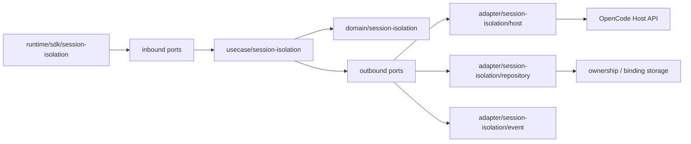
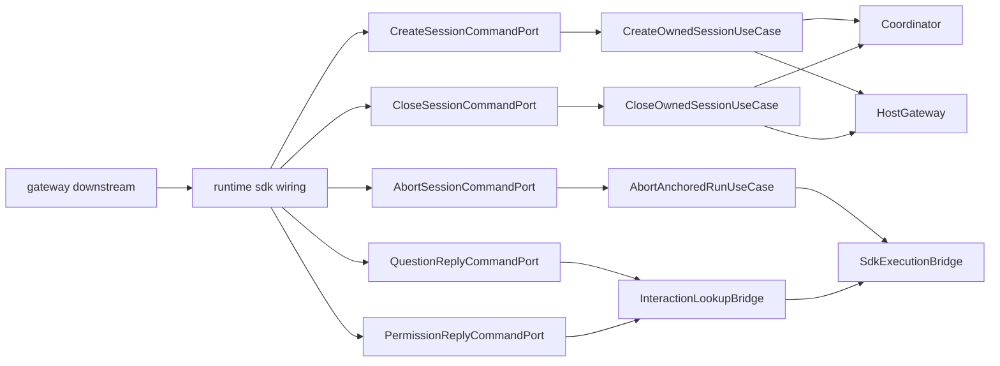
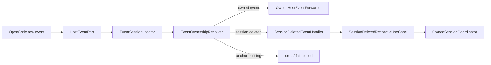

# OpenCode 会话隔离控制面接口设计

**Version:** 1.0  
**Date:** 2026-05-25  
**Status:** Draft  
**Owner:** message-bridge maintainers  
**Related:** `../../../../docs/design/message-bridge-opencode-session-isolation-solution.md`, `../../product/prd.md`, `../../architecture/overview.md`, `./protocol-contract.md`

## In Scope

1. 定义 `message-bridge` 插件内部 OpenCode 会话隔离控制面的目录结构、模块边界与接口签名。
2. 定义控制面 `port / usecase / adapter / domain` 的文件落位、依赖方向与迁移目标。
3. 定义当前控制面大文件的拆分策略、复用约束与结构守卫。
4. 提供接口交互图，帮助实现者理解调用链与状态修改边界。

## Out of Scope

1. 不重复定义 `BusinessEntryKey`、双层锚点模型、`anchor-only` 路径等方案语义；这些以上位方案文档为准。
2. 不修改 `ai-gateway`、`skill-server`、`message-bridge-openclaw` 或 `bridge-runtime-sdk` 的 public contract。
3. 不定义服务端幂等、一致性、消息持久化与告警机制。
4. 不直接给出代码实现步骤或迁移排期。

## External Dependencies

1. 上位方案结论来自 `docs/design/message-bridge-opencode-session-isolation-solution.md`。
2. 外部协议字段与约束来自 `plugins/message-bridge/docs/product/prd.md` 与 `plugins/message-bridge/docs/design/interfaces/protocol-contract.md`。
3. OpenCode 宿主继续提供 `session.list / session.get / session.create / session.delete / session.prompt`。
4. SDK 执行态与 pending interaction 仍由 `bridge-runtime-sdk` 协调；插件仅通过稳定 bridge/seam 访问。

## 1. 文档定位

本文是 `message-bridge` 插件内部接口设计页，不承担方案决策真源职责。

本文只回答以下问题：

- 接口如何分层
- 模块落在哪些目录
- 每个 `port / usecase / adapter` 的输入输出与依赖关系
- 当前代码如何迁移到目标接口面

以下内容只引用、不重述：

- `BusinessEntryKey` 的来源与产品语义
- 双层锚点模型为何成立
- `close_session` / `session.deleted` 的行为结论
- `question_reply` / `permission_reply` 的上位规则

实现者在阅读本文前，应先以上位方案页理解模型与语义，再以本文落实接口与文件结构。

## 2. 当前代码锚点

当前控制面实现主要分散在以下文件：

| 路径 | 当前职责 | 当前问题 |
|---|---|---|
| `src/runtime/sdk/SdkChatControlPlane.ts` | chat 入口判定、synthetic run、binding 解析、事件归属 helper | 多职责聚合、多个 class 共存 |
| `src/port/SlashCommandControlPlanePort.ts` | 控制面 port、DTO、store、presenter 类型汇总 | 接口面过宽，职责混杂 |
| `src/usecase/ResolveSlashCommandContextUseCase.ts` | binding bootstrap 与上下文解析 | 仍以临时态 slash 命名承载正式控制面 |
| `src/usecase/SlashCommandExecutor.ts` | slash 控制命令语义与状态副作用 | 直接编排 binding/ownership 变更 |
| `src/runtime/sdk/OpenCodeProviderAdapter.routing.ts` | provider raw event 路由、session.created 记录、anchor 解析 | 事件抽取、归属解析和运行态路由耦合 |
| `src/adapter/OpencodeSessionGatewayAdapter.ts` | OpenCode host session API 访问 | 可复用，但不应承载控制面主逻辑 |

本文的目标不是否定这些实现，而是把它们拆到更稳定的接口面与目录归属中。

## 3. 目标目录结构

目录结构以当前 `src/port`、`src/usecase`、`src/adapter`、`src/runtime/sdk` 的组织方式为基础收敛，不另起脱离现状的新体系。

```text
plugins/message-bridge/src/
  port/
    session-isolation/
      inbound/
      outbound/
      dto/
  usecase/
    session-isolation/
      support/
  adapter/
    session-isolation/
      host/
      repository/
      event/
  domain/
    session-isolation/
  runtime/
    sdk/
      session-isolation/
```

目录职责如下：

| 目录 | 职责 |
|---|---|
| `port/session-isolation/inbound` | 控制面入口接口 |
| `port/session-isolation/outbound` | host / repository / SDK bridge 出口接口 |
| `port/session-isolation/dto` | 输入输出 DTO、record、result type |
| `usecase/session-isolation` | 单一职责 use case |
| `usecase/session-isolation/support` | 多个 use case 共用、但仍属于应用层的支持逻辑 |
| `adapter/session-isolation/host` | OpenCode host session API 适配、host error classifier |
| `adapter/session-isolation/repository` | ownership / binding / attach owner 的存储适配 |
| `adapter/session-isolation/event` | raw event 提取、归属解析、删除事件适配 |
| `domain/session-isolation` | 值对象、领域模型、少量纯规则 |
| `runtime/sdk/session-isolation` | SDK runtime 装配与轻量 orchestration |

额外约束：

- 默认不创建 `shared/session-isolation/`
- 默认不创建 `domain/session-isolation/policy/`
- 历史文件允许逐步迁移
- 禁止继续新增“大而杂”的控制面聚合文件

### 3.1 模块依赖总览图



依赖方向约束：

1. `runtime` 不直接修改 ownership / binding / attach owner。
2. `adapter` 不直接承载控制面业务决策。
3. `OwnedSessionCoordinator` 是唯一允许写 ownership / binding / attach owner 的应用服务。

## 4. 文件拆分规则

### 4.1 单文件单类

默认规则：

- 一个导出 class 一个文件
- 一个导出 use case 一个文件
- 一个导出 adapter 一个文件
- 一个导出领域对象一个文件

允许例外：

- 纯类型文件
- 纯常量文件
- 极短的同类 helper 文件

明确禁止：

- 在一个文件中堆多个不属于同一职责的 class
- 在 runtime wiring 文件中夹带业务逻辑 class
- 在 adapter 文件中夹带 use case / DTO / policy 实现
- 再新增类似 `SdkChatControlPlane.ts` 这种持续膨胀的多职责文件

### 4.2 DTO 文件

DTO 按用途分组：

```text
dto/
  commands/
  results/
  records/
```

约束：

1. DTO 文件不含业务逻辑。
2. DTO 与领域模型分离。
3. record type 不直接充当 domain model。

### 4.3 `index.ts` 导出规则

1. 每个子目录允许一个 `index.ts` 做瘦导出。
2. `index.ts` 只做 `re-export`。
3. 不在 `index.ts` 中写逻辑。

## 5. 目标接口面与文件落位

本章只定义接口与文件落位，不在这里重述方案原因。

### 5.1 Inbound Ports

当前实现中，normal chat 已迁移到 provider 主链处理，不再暴露独立 `ChatCommandPort`。  
本节只覆盖仍由 session-isolation 下行控制面直接承接的入口。

建议文件：

- `port/session-isolation/inbound/CreateSessionCommandPort.ts`
- `port/session-isolation/inbound/CloseSessionCommandPort.ts`
- `port/session-isolation/inbound/AbortSessionCommandPort.ts`
- `port/session-isolation/inbound/QuestionReplyCommandPort.ts`
- `port/session-isolation/inbound/PermissionReplyCommandPort.ts`
- `port/session-isolation/inbound/HostEventPort.ts`

建议签名：

```ts
import type { BridgeEvent } from '../../../runtime/types.js';
import type {
  AbortAnchoredRunInput,
  CloseOwnedSessionInput,
  CreateSessionCommandInput,
  PermissionReplyCommandInput,
  QuestionReplyCommandInput,
} from '../dto/commands/index.js';
import type {
  AbortAnchoredRunResult,
  CloseOwnedSessionResult,
  CreateSessionCommandResult,
  HostEventHandleResult,
  PermissionReplyCommandResult,
  QuestionReplyCommandResult,
} from '../dto/results/index.js';

export interface CreateSessionCommandPort {
  execute(input: CreateSessionCommandInput): Promise<CreateSessionCommandResult>;
}

export interface CloseSessionCommandPort {
  execute(input: CloseOwnedSessionInput): Promise<CloseOwnedSessionResult>;
}

export interface AbortSessionCommandPort {
  execute(input: AbortAnchoredRunInput): Promise<AbortAnchoredRunResult>;
}

export interface QuestionReplyCommandPort {
  execute(input: QuestionReplyCommandInput): Promise<QuestionReplyCommandResult>;
}

export interface PermissionReplyCommandPort {
  execute(input: PermissionReplyCommandInput): Promise<PermissionReplyCommandResult>;
}

export interface HostEventPort {
  handle(event: BridgeEvent): Promise<HostEventHandleResult>;
}
```

入口职责矩阵：

| Port | 主要输入主键 | 是否参与 `entryKey` 解析 | 是否允许写 ownership |
|---|---|---|---|
| `CreateSessionCommandPort` | `extParameters` | 是 | 通过 use case 间接写 |
| `CloseSessionCommandPort` | `toolSessionId` | 否 | 通过 use case 间接写 |
| `AbortSessionCommandPort` | `toolSessionId` | 否 | 否 |
| `QuestionReplyCommandPort` | `questionId` | 否 | 否 |
| `PermissionReplyCommandPort` | `permissionId` | 否 | 否 |
| `HostEventPort` | `BridgeEvent` | 否 | 仅经 reconcile use case 写 |

`HostEventHandleResult` 建议最小形状：

```ts
export type HostEventHandleResult =
  | { kind: 'forwarded'; toolSessionId: string }
  | { kind: 'reconciled'; sessionId: string }
  | { kind: 'dropped'; reason: 'anchor_missing' | 'not_visible' | 'unsupported_event' }
  | { kind: 'ignored'; reason: 'unowned_event' | 'unrelated_event' };
```

### 5.2 下行命令控制面交互图

normal chat 当前真实链路：

`Provider.runMessage -> SdkChatPreprocessor -> EntryAwareChatSessionResolver -> OpencodeSessionGatewayAdapter.promptSession`

下图仅表示仍由 session-isolation 控制面直接暴露的下行入口，不再把 normal chat 画成独立 inbound port。



### 5.3 Application Use Cases

建议文件：

- `usecase/session-isolation/ResolveEntrySessionContextUseCase.ts`
- `usecase/session-isolation/CreateOwnedSessionUseCase.ts`
- `usecase/session-isolation/OwnedSessionCoordinator.ts`
- `usecase/session-isolation/SwitchAttachedSessionUseCase.ts`
- `usecase/session-isolation/CloseOwnedSessionUseCase.ts`
- `usecase/session-isolation/AbortAnchoredRunUseCase.ts`
- `usecase/session-isolation/SessionDeletedReconcileUseCase.ts`

建议签名：

```ts
import type {
  AbortAnchoredRunInput,
  ChatContextQuery,
  CloseOwnedSessionInput,
  CreateOwnedSessionInput,
  SessionDeletedEventInput,
  SwitchAttachedSessionInput,
} from '../../port/session-isolation/dto/commands/index.js';
import type {
  AbortAnchoredRunResult,
  CloseOwnedSessionResult,
  CreateOwnedSessionResult,
  OwnedSessionMutationResult,
  ResolvedEntrySessionContext,
} from '../../port/session-isolation/dto/results/index.js';

export interface ResolveEntrySessionContextUseCase {
  execute(input: ChatContextQuery): Promise<ResolvedEntrySessionContext>;
}

export interface CreateOwnedSessionUseCase {
  execute(input: CreateOwnedSessionInput): Promise<CreateOwnedSessionResult>;
}

export interface OwnedSessionCoordinator {
  bindOwnedSession(input: CreateOwnedSessionInput): Promise<OwnedSessionMutationResult>;
  switchAttachedSession(input: SwitchAttachedSessionInput): Promise<OwnedSessionMutationResult>;
  closeOwnedSession(input: CloseOwnedSessionInput): Promise<OwnedSessionMutationResult>;
  reconcileDeletedSession(input: SessionDeletedEventInput): Promise<OwnedSessionMutationResult>;
}

export interface CloseOwnedSessionUseCase {
  execute(input: CloseOwnedSessionInput): Promise<CloseOwnedSessionResult>;
}

export interface AbortAnchoredRunUseCase {
  execute(input: AbortAnchoredRunInput): Promise<AbortAnchoredRunResult>;
}
```

职责矩阵：

| Use Case | 主要职责 | 允许修改状态 |
|---|---|---|
| `ResolveEntrySessionContextUseCase` | 解析上下文、查询 binding、决定可见 session | 否 |
| `CreateOwnedSessionUseCase` | 新建 host session 并触发落盘编排 | 经 `OwnedSessionCoordinator` |
| `OwnedSessionCoordinator` | ownership / binding / attach owner 唯一协调入口 | 是 |
| `SwitchAttachedSessionUseCase` | 切换当前 attach owner | 经 `OwnedSessionCoordinator` |
| `CloseOwnedSessionUseCase` | 调用 host delete 并执行本地 cleanup | 经 `OwnedSessionCoordinator` |
| `AbortAnchoredRunUseCase` | 命中当前 anchor 的 active run | 否 |
| `SessionDeletedReconcileUseCase` | 删除事件回流后的幂等补偿 | 经 `OwnedSessionCoordinator` |

### 5.4 Outbound Ports

建议文件：

- `port/session-isolation/outbound/HostSessionGateway.ts`
- `port/session-isolation/outbound/OwnedSessionRepository.ts`
- `port/session-isolation/outbound/AnchorBindingRepository.ts`
- `port/session-isolation/outbound/AttachOwnerRepository.ts`
- `port/session-isolation/outbound/SdkExecutionBridge.ts`
- `port/session-isolation/outbound/InteractionLookupBridge.ts`
- `port/session-isolation/outbound/OwnedHostEventForwarder.ts`

建议签名：

```ts
import type { BridgeEvent } from '../../../runtime/types.js';
import type {
  AnchorBindingRecord,
  AttachOwnerRecord,
  HostSessionRecord,
  OwnedSessionRecord,
} from '../dto/records/index.js';
import type {
  AbortAnchoredRunInput,
  HostSessionCreateInput,
  HostPromptInput,
  PermissionReplyCommandInput,
  QuestionReplyCommandInput,
} from '../dto/commands/index.js';
import type {
  AbortAnchoredRunResult,
  InteractionLookupResult,
  RuntimeAppliedResult,
} from '../dto/results/index.js';

export interface HostSessionGateway {
  get(sessionId: string): Promise<HostSessionRecord>;
  list(input: { directory?: string }): Promise<HostSessionRecord[]>;
  create(input: HostSessionCreateInput): Promise<HostSessionRecord>;
  delete(sessionId: string): Promise<RuntimeAppliedResult>;
  prompt(input: HostPromptInput): Promise<RuntimeAppliedResult>;
}

export interface OwnedSessionRepository {
  findByEntryKey(input: { akScopeKey: string; entryKey: string }): Promise<OwnedSessionRecord[]>;
  upsert(record: OwnedSessionRecord): Promise<void>;
  deleteBySessionId(input: { akScopeKey: string; sessionId: string }): Promise<void>;
}

export interface AnchorBindingRepository {
  get(toolSessionId: string): Promise<AnchorBindingRecord | undefined>;
  upsert(record: AnchorBindingRecord): Promise<void>;
  delete(toolSessionId: string): Promise<void>;
}

export interface AttachOwnerRepository {
  get(sessionId: string): Promise<AttachOwnerRecord | undefined>;
  upsert(record: AttachOwnerRecord): Promise<void>;
  delete(sessionId: string): Promise<void>;
}

export interface SdkExecutionBridge {
  abort(input: AbortAnchoredRunInput): Promise<AbortAnchoredRunResult>;
  replyQuestion(input: QuestionReplyCommandInput): Promise<RuntimeAppliedResult>;
  replyPermission(input: PermissionReplyCommandInput): Promise<RuntimeAppliedResult>;
}

export interface InteractionLookupBridge {
  findQuestion(questionId: string): Promise<InteractionLookupResult>;
  findPermission(permissionId: string): Promise<InteractionLookupResult>;
}

export interface OwnedHostEventForwarder {
  forward(input: { toolSessionId: string; event: BridgeEvent }): Promise<RuntimeAppliedResult>;
}
```

约束：

1. `port` 文件只定义接口。
2. 默认实现类放到 `adapter/session-isolation/*`。
3. 应用层禁止跨多个 repository 手写状态拼装。
4. `HostSessionGateway` 只暴露 OpenCode 宿主已稳定提供的能力；`projectID/workspaceID` 只可作为宿主返回字段或插件侧二次过滤上下文，不上升为宿主查询参数。
5. 受控会话策略必须显式进入 `create` 输入，禁止由 adapter 依据落盘 record、命名约定或标题前缀反推。

`HostSessionCreateInput` 建议最小形状：

```ts
export interface HostSessionCreateInput {
  title?: string;
  assistantId?: string;
  directory?: string;
  control: {
    controlled: boolean;
    permissionProfile: 'default' | 'dialog_only';
  };
}
```

### 5.5 Event Routing Seams

建议文件：

- `adapter/session-isolation/event/EventSessionLocator.ts`
- `adapter/session-isolation/event/EventOwnershipResolver.ts`
- `adapter/session-isolation/event/SessionDeletedEventHandler.ts`
- `adapter/session-isolation/event/OwnedHostEventForwarder.ts`

建议签名：

```ts
import type { BridgeEvent } from '../../../runtime/types.js';
import type {
  EventOwnershipResolution,
  RuntimeAppliedResult,
  SessionDeletedEventInput,
} from '../../port/session-isolation/dto/results/index.js';

export interface EventSessionLocator {
  locate(event: BridgeEvent): string | undefined;
}

export interface EventOwnershipResolver {
  resolve(rawSessionId: string): Promise<EventOwnershipResolution>;
}

export interface SessionDeletedEventHandler {
  toInput(event: BridgeEvent): SessionDeletedEventInput | undefined;
}

export interface OwnedHostEventForwarder {
  forward(input: { toolSessionId: string; event: BridgeEvent }): Promise<RuntimeAppliedResult>;
}
```

### 5.6 Host Event 回流与归属图



约束：

1. `EventOwnershipResolver` 只负责把宿主 `sessionId` 解析到当前 runtime anchor 语义，不直接执行 runtime forward。
2. owned host event 一旦命中当前 anchor，必须经 `OwnedHostEventForwarder` 进入 provider/runtime forward path。
3. `session.deleted` 的删除补偿仍通过 `SessionDeletedEventHandler -> SessionDeletedReconcileUseCase` 收口，不与普通事件 forward 复用隐式分支。

### 5.7 Domain Objects

建议文件：

- `domain/session-isolation/BusinessEntryKey.ts`
- `domain/session-isolation/EntryKeyCodec.ts`
- `domain/session-isolation/OwnedSessionRecord.ts`
- `domain/session-isolation/AnchorBindingRecord.ts`
- `domain/session-isolation/AttachOwnerRecord.ts`

建议签名：

```ts
export interface BusinessEntryKey {
  businessSessionDomain: string;
  businessSessionType: string;
  businessSessionId: string;
}

export interface EntryKeyCodec {
  normalize(input: BusinessEntryKey): BusinessEntryKey;
  stringify(input: BusinessEntryKey): string;
}

export interface OwnedSessionRecord {
  akScopeKey: string;
  entryKey: string;
  sessionId: string;
  controlled: boolean;
  permissionProfile: 'default' | 'dialog_only';
}

export interface AnchorBindingRecord {
  toolSessionId: string;
  sessionId?: string;
  state: 'anchor_only' | 'attached' | 'closed';
}

export interface AttachOwnerRecord {
  sessionId: string;
  toolSessionId: string;
}
```

约束：

1. `domain/session-isolation` 只放领域对象和值对象。
2. 不放 host SDK 细节。
3. 不放 repository record 映射逻辑。

## 6. 公共逻辑复用策略

本节明确采用“先内聚，后上提”。

### 6.1 复用落位原则

- 领域键与值对象规则
  - 放 `domain/session-isolation/`
- 多个 use case 共用的应用层步骤
  - 放 `usecase/session-isolation/support/`
- host 错误识别、host DTO 映射
  - 放 `adapter/session-isolation/host/`
- event 提取、event 归属判定
  - 放 `adapter/session-isolation/event/`

### 6.2 禁止预防性抽象

明确禁止：

- 为了“以后可能复用”先建 `shared/session-isolation/`
- 为了技术分类方便先建 `normalizers/`、`mappers/`、`errors/`
- 把本模块强业务语义逻辑包装成伪通用工具

### 6.3 当前建议可复用内容

| 逻辑 | 推荐路径 |
|---|---|
| `entryKey` 规范化与串化 | `domain/session-isolation/EntryKeyCodec.ts` |
| host `session.list(directory)` 候选过滤 | `usecase/session-isolation/support/VisibleSessionFilter.ts` |
| host session not-found 识别 | `adapter/session-isolation/host/HostSessionErrorClassifier.ts` |
| ownership cleanup 共用步骤 | `usecase/session-isolation/support/OwnershipCleanup.ts` |
| binding invalidation 共用步骤 | `usecase/session-isolation/support/BindingInvalidation.ts` |
| event drop 判定 | `adapter/session-isolation/event/EventDropDecision.ts` |

## 7. 当前代码迁移映射

### 7.1 当前大文件拆分目标

| 当前文件 | 目标收敛路径 |
|---|---|
| `src/runtime/sdk/SdkChatControlPlane.ts` | `runtime/sdk/session-isolation/ChatEntryPolicy.ts`、`runtime/sdk/session-isolation/SdkChatPreprocessor.ts`、`usecase/session-isolation/ResolveEntrySessionContextUseCase.ts`、`usecase/session-isolation/OwnedSessionCoordinator.ts`、`adapter/session-isolation/event/EventOwnershipResolver.ts` |
| `src/port/SlashCommandControlPlanePort.ts` | `port/session-isolation/inbound/*`、`port/session-isolation/outbound/*`、`port/session-isolation/dto/*` |
| `src/usecase/SlashCommandExecutor.ts` | 保留 slash command 执行职责，但依赖新的 use case / coordinator |
| `src/usecase/ResolveSlashCommandContextUseCase.ts` | 收敛为 `ResolveEntrySessionContextUseCase` |
| `src/runtime/sdk/OpenCodeProviderAdapter.routing.ts` | 保留 provider event routing；会话归属与删除事件处理拆到 `adapter/session-isolation/event/` |

### 7.2 保留与复用原则

1. `SimpleSlashCommandParser` 可保留。
2. `DefaultSlashCommandReplyPresenter` 可保留。
3. `OpencodeSessionGatewayAdapter` 优先复用为 host adapter 基础。
4. 但上述类不得继续承载 ownership 主逻辑。

## 8. 接口测试与结构守卫

### 8.1 接口契约测试

- inbound port 输入 DTO 能正确进入对应 use case
- outbound port 的成功 / 未命中 / 失败返回形状一致
- `OwnedSessionCoordinator` 是唯一允许修改 ownership / binding / attach owner 的入口
- `HostEventPort.handle` 不返回布尔值，必须返回可区分 `forwarded/reconciled/dropped/ignored` 的显式结果
- `HostSessionGateway.list` 不暴露 `projectID/workspaceID` 这类插件侧二次过滤参数
- `HostSessionGateway.create` 必须显式接收 `control.permissionProfile`
- owned host event 命中后必须经过 `OwnedHostEventForwarder`，不得在 resolver 内直接回写 runtime

### 8.2 迁移回归测试

- 旧 `SlashCommand*` 路径在适配层仍可工作
- 旧类型不会继续泄漏到新增接口面
- event routing 从旧 resolver 迁移到新 seam 后不回归

### 8.3 结构守卫

- `session-isolation` 新增 class 必须单文件落位
- `port/` 下不得出现 adapter 实现
- `usecase/` 下不得直接 `import` raw OpenCode client
- `runtime/sdk/session-isolation/` 只允许装配和轻量 orchestration

### 8.4 复用守卫

- `entryKey` 规范化只允许一个实现源
- host not-found 识别只允许一个 classifier 源
- ownership cleanup 顺序只允许一个共享实现源
- 同类错误码不得在多个文件重复定义

## 9. 当前文档的接口交付边界

本文完成后，读者应能直接回答：

1. 控制面新增代码应落在哪个目录。
2. 哪些文件必须拆分为单文件单类。
3. 哪些接口属于入口、应用服务、出口和事件 seam。
4. 哪个应用服务是唯一状态修改入口。
5. 当前临时态控制面应如何迁移到正式接口面。

若读者仍需要理解“为什么选择 `BusinessEntryKey`”“为什么 `close_session` 要立即清理”“为什么 `question_reply` 不走 `entryKey` 路由”，应回到上位方案文档，而不是在本文继续扩展方案解释。

## Assumptions

1. 本文是接口设计页，不重写方案文档结论。
2. 目录设计以当前 `message-bridge` 代码组织为基础做收敛，不推翻现有主分层。
3. 默认执行“单文件单 class”，例外仅限纯类型、纯常量、极短 helper。
4. 公共逻辑优先内聚在最近使用者附近，只有出现稳定复用证据后才允许上提抽象。
5. 图示是接口设计文档的辅助视图，不替代文字契约。
