# message-bridge 切换 bridge-runtime-sdk 方案设计

**Version:** 1.1  
**Date:** 2026-05-18  
**Status:** Draft  
**Owner:** message-bridge maintainers  
**Related:** `../product/prd.md`, `../architecture/overview.md`, `./interfaces/bridge-runtime-sdk-replacement-assessment.md`, `../../../../docs/architecture/bridge-runtime-sdk-architecture.md`, `../../../../docs/design/interfaces/bridge-runtime-sdk-integration.md`

## 摘要

本文定义 `message-bridge` 从当前插件内主导 runtime 编排的实现，迁移到以 `bridge-runtime-sdk` 为统一 runtime 语义核心的目标态方案。

本文只回答“如何以正确架构边界完成迁移”，不重复维护字段级替换评估表，也不改写 SDK public contract。字段是否可替换、哪些语义必须插件闭环，仍以 [`bridge-runtime-sdk-replacement-assessment.md`](./interfaces/bridge-runtime-sdk-replacement-assessment.md) 为真源；SDK 内部架构与对外 contract，仍分别以仓库根目录下 `docs/architecture/bridge-runtime-sdk-architecture.md` 与 `docs/design/interfaces/bridge-runtime-sdk-integration.md` 为真源。

本方案固定以下结论：

1. `bridge-runtime-sdk` 是统一 runtime 语义的 Application Core。
2. `message-bridge` 是 OpenCode 宿主集成层，不再长期保留并行 runtime 主链路。
3. `message-bridge` 只支持通过 `ThirdPartyAgentProvider` 接入 `bridge-runtime-sdk` public runtime，不支持依赖 SDK internal core seam。
4. `create_session.directory/permission` 不进入 SDK public contract，只进入插件私有 `ProviderExecutionContext`。
5. `permission.reply` resolved 事件继续由 provider 真源产出，不由 SDK 自动合成。
6. `suppressReply` deny fast path 必须走标准 synthetic `ProviderRun`。
7. gateway uplink 的唯一真实投影与发送出口是 SDK runtime。
8. OpenCode raw event 到 `ProviderFact` 的唯一转换点是 provider adapter。

## In Scope

1. `message-bridge` runtime 主链路切换设计。
2. OpenCode provider adapter 设计。
3. 插件前置策略层与 SDK runtime 的分层边界。
4. 双轨隔离与 legacy 退场条件。
5. 主链路时序与验证口径。

## Out of Scope

1. 不修改 `ai-gateway` 业务逻辑。
2. 不修改 `skill-server` 业务逻辑。
3. 不修改 `integration/opencode-cui` 内容或 submodule 指针。
4. 不新增 PRD 冻结范围外协议字段。
5. 不在本文定义具体代码提交顺序、PR 拆分或任务排期。

## External Dependencies

1. `@wecode/bridge-runtime-sdk`
2. `@agent-plugin/gateway-schema`
3. OpenCode SDK / API
4. `message-bridge` 当前实现

## 1. 阅读指引与真源边界

本文是插件侧迁移方案，负责定义：

1. `message-bridge` 切换到 `bridge-runtime-sdk` 后的目标态分层。
2. 插件私有宿主策略与 SDK runtime 之间的边界。
3. OpenCode raw event、`ProviderFact` 与 gateway uplink 之间的收敛链路。
4. 双轨迁移期如何隔离 legacy 与 SDK 两条轨道。

本文不负责：

1. 重复维护字段级映射表。
2. 重新定义 SDK public contract。
3. 展开实现任务清单或 PR 执行步骤。

建议按以下顺序阅读：

1. 先看第 `2` 节，理解为什么要迁移。
2. 再看第 `3` 节，理解迁移后的系统关系与目标态。
3. 再看第 `4-5` 节，理解已经锁死的决策与插件闭环边界。
4. 再看第 `6` 节，理解关键链路与时序。
5. 最后根据需要查看第 `7-10` 节与附录。

真源分工如下：

| 文档 | 负责内容 |
|---|---|
| `plugins/message-bridge/docs/design/interfaces/bridge-runtime-sdk-replacement-assessment.md` | 字段级可替换性、插件闭环项、是否纳入 SDK |
| `docs/architecture/bridge-runtime-sdk-architecture.md` | SDK application core 的内部架构边界 |
| `docs/design/interfaces/bridge-runtime-sdk-integration.md` | SDK 对外集成 contract 与 Provider SPI |
| 本文 | 插件如何以正确边界接入 SDK 并完成迁移 |

## 2. 为什么要迁移

当前 `message-bridge` 主链路中，`BridgeRuntime` 同时承担连接、编排、compat、投影与 OpenCode 宿主兼容职责，运行时重心过于集中。

迁移前架构如下：

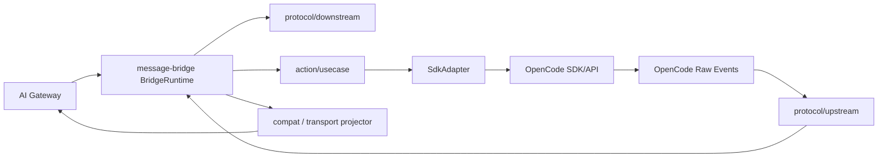

现状问题：

1. `BridgeRuntime` 同时持有连接、编排、compat 与投影职责，聚合过重。
2. `SdkAdapter` 只负责调用兼容，不负责 runtime 语义统一。
3. OpenCode raw event 到 gateway uplink 的收口不唯一。
4. compat / projector 与 SDK 目标态能力重叠，容易形成双重 terminal 与双重 interaction 语义。

## 3. 迁移后长什么样

### 3.1 系统关系说明

迁移后的四方关系必须按以下口径理解：

1. `AI Gateway`
   - 是 runtime 协议上游。
   - 只与 `message-bridge` 插件对话，不直接处理 OpenCode raw event，也不直接依赖 OpenCode SDK / API。
2. `message-bridge`
   - 仍是对外暴露的真实插件边界。
   - 内部装配 `bridge-runtime-sdk` public runtime、OpenCode provider adapter 与插件私有宿主策略服务。
3. `bridge-runtime-sdk`
   - 是 `message-bridge` 内部采用的 runtime 语义核心。
   - 负责 command、interaction、terminal、uplink 投影与统一发送。
4. `OpenCode`
   - 是 provider 背后的宿主系统。
   - 只通过 OpenCode provider adapter 暴露 API 与 raw event，不直接参与 gateway 协议。

必须明确：

1. 迁移后不是 `AI Gateway` 直接接入 `bridge-runtime-sdk` 独立运行。
2. 迁移后仍然是 `message-bridge` 对外提供插件能力，只是其内部 runtime 主链路改由 `bridge-runtime-sdk` public runtime 承接。

### 3.2 系统上下文图

这张图只表达系统边界与归属关系，不展开 SDK internal seam。

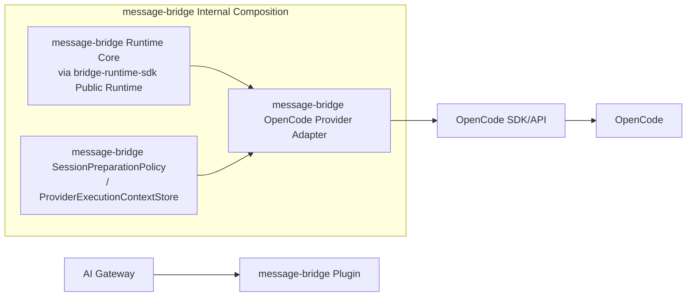

### 3.3 `message-bridge` 内部目标态分层

这张图只表达 `message-bridge` 内部的目标态分层与主链路收敛关系。

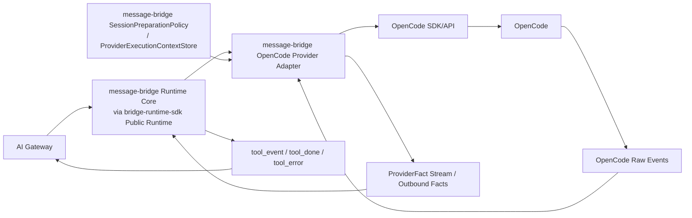

### 3.4 四方职责表

| 主体 | 在目标态中的角色 | 直接输入 | 直接输出 | 不负责什么 |
|---|---|---|---|---|
| `AI Gateway` | runtime 协议上游 | 插件上行消息、用户触发的下行请求 | `status_query`、`invoke.*`、其他 gateway 协议消息 | 不处理 OpenCode raw event；不直接调用 OpenCode API |
| `message-bridge` | 对外插件边界与内部装配者 | `AI Gateway` 下行请求、配置、宿主策略、OpenCode provider 能力 | 面向 `AI Gateway` 的插件能力；内部装配好的 runtime 主链路 | 不再维护并行 runtime 主链路；不直接充当 OpenCode 宿主 API |
| `bridge-runtime-sdk` | `message-bridge` 内部 runtime 语义核心 | provider SPI、gateway host、runtime facts | runtime uplink projection、interaction 语义、terminal 语义 | 不直接感知 `directory`、session probe、permission 注入等宿主私有策略 |
| `OpenCode Provider Adapter` | `message-bridge` 内部 OpenCode 适配边界 | SDK provider SPI 调用、插件私有 `ProviderExecutionContext`、OpenCode raw event | `ProviderFact`、`ProviderError`、provider result | 不直接发送 gateway 协议消息；不维护并行 interaction 真源 |
| `OpenCode` | provider 背后的宿主系统 | OpenCode provider adapter 发起的 API 请求 | OpenCode API 响应、raw event | 不直接发送 `tool_event` / `tool_done` / `tool_error` |

### 3.5 目标态结论

该目标态意味着：

1. runtime 语义集中在 SDK application core。
2. `message-bridge` 没有消失，而是收敛为“对外插件边界 + 内部装配层”。
3. OpenCode 宿主细节集中在 `message-bridge` 内部的 provider adapter。
4. `AI Gateway` 不直接连接 OpenCode，所有 runtime 协议往返都经由 `message-bridge` 收敛。
5. uplink 的真实投影与发送收口统一，避免 plugin-side compat 与 SDK terminal 重叠。

## 4. 固定架构决策

以下决策已经锁死，后续实现不再重新选择。

1. **SDK 接入路径**
   - 只支持 `createBridgeRuntime(...) + ThirdPartyAgentProvider` 的 public path。
   - `message-bridge` 不依赖 SDK internal core seam。
2. **插件对外边界**
   - 迁移后对外边界仍然是 `message-bridge`。
   - `bridge-runtime-sdk` 是 `message-bridge` 内部采用的 runtime core，不是新的外部主体。
3. **宿主私有上下文**
   - `directory/permission` 不进入 SDK public contract。
   - `ProviderExecutionContext` 由插件私有装配层注入。
4. **权限回执真源**
   - `permission.reply` resolved 由 provider 真源产出。
   - SDK 不在 `replyPermission()` 成功时自动合成 resolved fact。
5. **异步事实回流**
   - 若 resolved 不属于当前 `runMessage().facts` 流，必须通过 `ProviderRuntimeContext.outbound.emitOutboundMessage()` 回流。
   - 若 `permission.reply` 仍属于原 `runMessage().facts` 流，可以继续沿用该消息流既有的 `messageId`。
   - 若 `permission.reply` 改走 outbound continuation，provider 必须为该 outbound facts 批次生成新的 `messageId`，并保证它在当前 `toolSessionId` 内唯一；同一批 outbound facts 的 `messageId` 必须一致，且与 `EmitOutboundMessageInput.messageId` 一致。
   - outbound continuation 场景下，provider 不得以 `permissionId` 直接代替 `messageId`；`permissionId` 继续只承担 reply target 语义。
   - 原始 `permission.ask` 关联的 `messageId` 只作为回放锚点、诊断线索或宿主侧上下文引用，不再作为 outbound continuation 的强制消息标识。
6. **拒答快路径**
   - `suppressReply` 必须走 synthetic `ProviderRun`。
   - 最小序列固定为 `message.start -> text.done -> message.done -> terminal completed`。
7. **统一发送出口**
   - gateway uplink 的唯一真实投影与发送出口是 SDK runtime。
   - provider 可以发事实，但不能直接发协议消息。
8. **raw event 收敛边界**
   - OpenCode raw event 到 `ProviderFact` 的唯一转换点是 provider adapter。
9. **运行时语义边界**
   - `GatewayDownstreamBusinessRequest` 是 SDK 内部 runtime intake 语义边界，不是 `message-bridge` 对 SDK 的 public 接入边界，也不是 provider input。
   - OpenCode raw event 不是 runtime 事实。
   - `PermissionReplyFact`、`QuestionAskFact`、`SessionTitleFact` 等属于 runtime 语义层，不等于 OpenCode 原始事件命名层。

## 5. 为什么这些能力留在插件侧

以下能力明确不进入 SDK：

1. `directory`
2. permission 注入细节
3. `session.get` 探测路径
4. OpenCode raw event 字段路径读取
5. `suppressReply` 的业务判定来源

拒绝理由如下：

1. 它们不是跨 provider 稳定语义。
2. 它们只影响 OpenCode request 参数或宿主前置策略。
3. gateway / miniapp 不需要直接感知这些能力。
4. 进入 SDK 会扩大 public contract 与宿主耦合面。

## 6. 关键场景与时序

图示命名约定：

1. `MB-RT` 表示 `message-bridge` 内部 runtime core，实现来自 `bridge-runtime-sdk`
2. `MB-PROV` 表示 `message-bridge` 内部 OpenCode provider adapter
3. `MB-POLICY` 表示 `message-bridge` 内部宿主策略服务
4. `OCSDK` 表示 OpenCode SDK/API 接入层
5. `OC` 表示 OpenCode 宿主系统

本节时序图中的 `MB-RT`、`MB-PROV`、`MB-POLICY` 都属于 `message-bridge` 内部实现分层，用于说明内部协作关系，不代表对外系统边界。

参与方速览：

1. `MB-RT`
   - `message-bridge` 内部 runtime core，实现来自 `bridge-runtime-sdk`。
   - 负责 command、interaction、terminal 与 uplink 投影。
2. `MB-PROV`
   - `message-bridge` 内部 OpenCode provider adapter。
   - 负责 OpenCode API 调用、raw event 映射与 provider result 返回。
3. `MB-POLICY`
   - `message-bridge` 内部宿主策略服务。
   - 负责 directory、session probe、deny policy 等插件闭环能力。
4. `ProviderExecutionContext`
   - 只供 `MB-PROV` 使用的插件私有上下文。
   - 不属于 SDK public contract，不通过 provider SPI 参数传递。

### 6.1 `status_query`

场景目的：建立最简单的统一主链路，说明 SDK public runtime 已直接承接统一入口。

责任分工：

1. SDK runtime 直接承接。
2. 插件不做宿主特化逻辑。

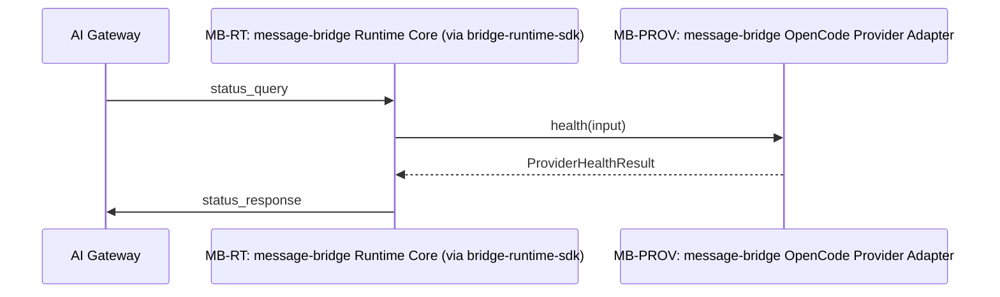

### 6.2 `chat`

场景目的：描述迁移后的主请求运行链路。

责任分工：

1. `MB-PROV` 以 SDK typed `context.suppressReply` 为外部输入真源，在执行期完成 `session_not_found` 前置判定、私有上下文解析与执行路径选择。
2. `runMessage()` 的直接输出是 `ProviderRun`，而不是 `ProviderFact` 或 terminal。
3. provider 先完成宿主策略判定与底层订阅装配，再把 `ProviderRun` handle 交还给 SDK runtime。
4. SDK runtime 持有该 `ProviderRun` handle，并消费其 `facts` / `result()`。
5. provider adapter 负责 prompt 与 facts 映射。

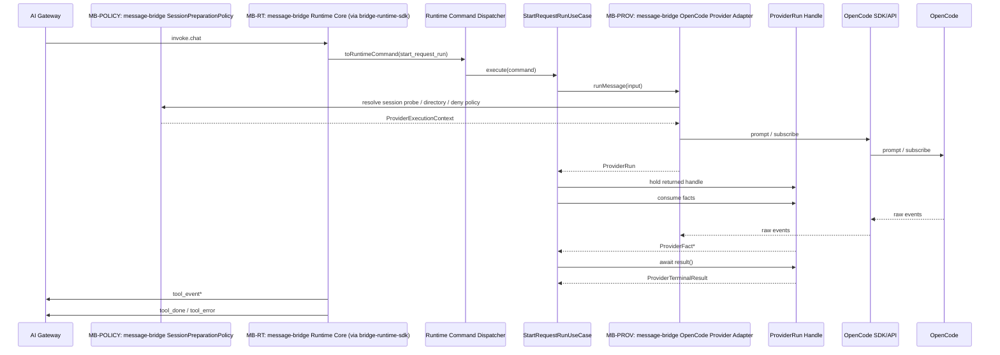

### 6.3 `session_not_found`

场景目的：说明 stale-session 探测仍由插件闭环，但错误终态仍由 SDK 统一收口。

责任分工：

1. `MB-PROV` 先在执行期查询宿主策略服务，获取 stale-session 探测结果。
2. `session_not_found` 由 provider 返回一个可立即收敛的 `ProviderRun`，其 `result()` 返回 `ProviderTerminalResult(outcome='failed', error.code='session_not_found')`。
3. SDK runtime 持有该 returned run handle，并通过 `result()` 收到失败终态。
4. 最终由 terminal projector 输出 `tool_error.reason='session_not_found'`。

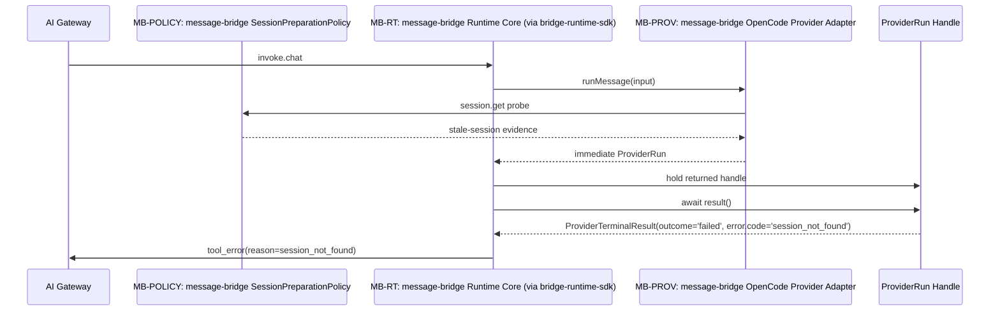

### 6.4 `suppressReply`

场景目的：说明拒答快路径不绕过 SDK，而是走标准 synthetic run。

责任分工：

1. `MB-PROV` 先在执行期查询宿主策略服务，完成 deny 判定与私有上下文解析，再返回 synthetic `ProviderRun`。
2. synthetic deny fast path 由 provider 返回 synthetic `ProviderRun`；其 `facts` 产出最小事实序列，`result()` 返回 `ProviderTerminalResult(outcome='completed')`。
3. SDK runtime 持有该 returned run handle，并正常处理其 `facts` 和 `result()`。

固定结论：

1. 最小 synthetic facts 序列固定为：
   - `message.start`
   - `text.done`
   - `message.done`
   - terminal `completed`
2. 明确禁止：
   - `question.ask`
   - `permission.ask`
   - `tool.update`
   - 依赖 `session.idle` 兜底完成态

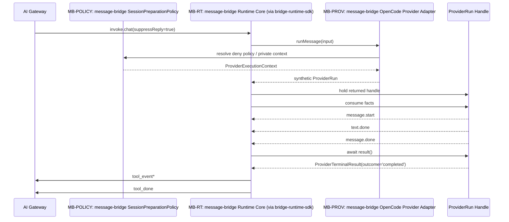

### 6.5 `create_session`

场景目的：说明 `directory/permission` 继续由插件闭环，但 session 生命周期切到 SDK。

责任分工：

1. `MB-PROV` 在执行期查询宿主策略服务，获取 `directory` 与 permission 注入上下文。
2. SDK runtime 承接 command 生命周期。
3. provider adapter 使用私有上下文补 OpenCode create 参数。

固定结论：

1. `directory/permission` 不进入 SDK contract。
2. 只进入 `ProviderExecutionContext`。
3. `ProviderExecutionContext` 通过插件私有装配层注入到 provider adapter，不通过 `ProviderCreateSessionInput` 传递。

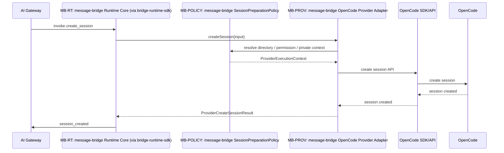

### 6.6 `question_reply`

场景目的：说明交互 reply 生命周期已由 SDK 承接。

责任分工：

1. SDK runtime consume pending interaction 并调 `replyQuestion`
2. provider adapter 调 OpenCode reply API

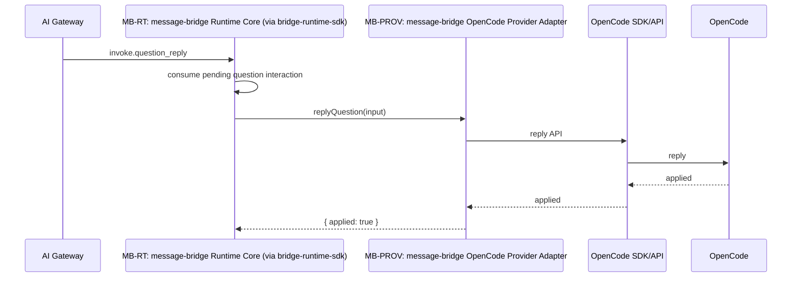

### 6.7 `permission_reply`

场景目的：说明最复杂的异步 resolved 事实如何回流到 SDK runtime。

责任分工：

1. SDK runtime consume pending interaction 并调 `replyPermission`
2. provider adapter 调 OpenCode reply API
3. 真正收到 `permission.replied` 后，provider adapter 产出 `PermissionReplyFact`

固定结论：

1. SDK 不自动合成 resolved fact。
2. `PermissionReplyFact` 的唯一原始事件来源是 `permission.replied`。
3. `permission.updated` 及其 `status` / `response` / `resolved` 字段变化不作为生成 `PermissionReplyFact` 的依据。
4. 若 `permission.replied` 不属于当前 `runMessage().facts` 流，provider 必须通过 `ProviderRuntimeContext.outbound.emitOutboundMessage()` 发出 `PermissionReplyFact`。
5. 若 `permission.replied` 仍属于原 `runMessage().facts` 流，可以继续沿用该消息流既有的 `messageId`。
6. 若 `permission.replied` 改走 outbound continuation，provider 必须为该 outbound facts 批次生成新的 `messageId`，并保证它在当前 `toolSessionId` 内唯一；同一批 outbound facts 的 `messageId` 必须一致，且与 `EmitOutboundMessageInput.messageId` 一致。
7. outbound continuation 场景下，provider 不得以 `permissionId` 直接代替 `messageId`；`permissionId` 继续只承担 reply target 语义。
8. 原始 `permission.ask` 关联的 `messageId` 只作为回放锚点、诊断线索或宿主侧上下文引用，不再作为 outbound continuation 的强制消息标识。

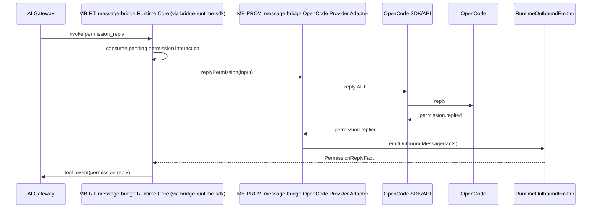

### 6.8 `close_session` / `abort_session`

场景目的：说明控制类命令也已统一经 SDK session-control 路径执行。

责任分工：

1. SDK runtime 发起 session control command。
2. provider adapter 调 OpenCode session control API。

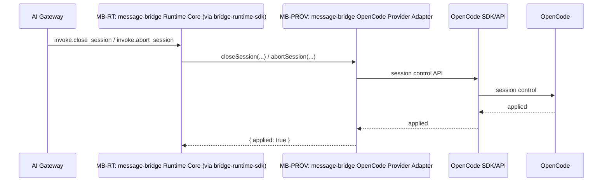

## 7. 详细接口设计

### 7.1 插件内部接口分层

本轮详细接口设计只展开插件侧四层协作，不重写 SDK public contract。

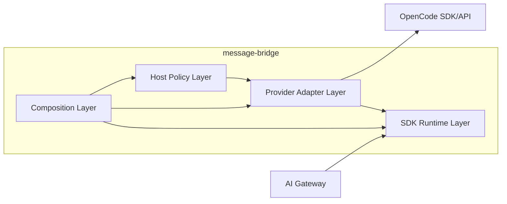

分层职责固定如下：

| 分层 | 归属 | 负责什么 | 不负责什么 |
|---|---|---|---|
| Composition Layer | `message-bridge` | 唯一装配入口；创建 `bridge-runtime-sdk` runtime；注入 provider、gateway host、logger、traceId 与插件私有策略协作者 | 不承接 runtime 语义；不直接翻译 raw event |
| Host Policy Layer | `message-bridge` | `directory`、permission 注入、`session.get` 探测、`suppressReply` 判定等插件闭环能力 | 不生成 `ProviderFact`；不直接发送 uplink；不依赖 SDK internal seam |
| Provider Adapter Layer | `message-bridge` | 调 OpenCode SDK / API；把 raw event 转成 `ProviderFact`；把 reply / control 命令应用到底层宿主 | 不直接发送 `tool_event` / `tool_done` / `tool_error` |
| SDK Runtime Layer | `bridge-runtime-sdk` | request run、interaction、terminal、uplink 投影与统一发送 | 不读取 OpenCode raw 字段；不承载 `directory`、session probe、permission 注入等宿主私有策略 |

### 7.2 依赖方向与禁止穿透

必须写死的依赖规则如下：

1. `message-bridge` 只通过 `createBridgeRuntime(...)` 与 `ThirdPartyAgentProvider` public path 接入 SDK。
2. Composition Layer 是唯一允许同时看到 SDK runtime、provider adapter 与 host policy 的装配点。
3. SDK Runtime Layer 不依赖 OpenCode SDK / API，不依赖插件私有策略实现。
4. Host Policy Layer 只向 provider adapter 暴露插件私有执行辅助信息，不向 SDK 暴露新 public type。
5. Provider Adapter Layer 不依赖 gateway uplink projector，不直接接管 transport 发送。
6. 除 Composition Layer 外，不允许出现新的“桥接总控对象”重新聚合 runtime、policy、adapter 三层职责。

### 7.3 Runtime 装配边界

Runtime 装配边界按职责冻结，不预先冻结最终代码命名。

| 角色 | 主要输入 | 主要输出 | 持有状态 | 失败语义 |
|---|---|---|---|---|
| 唯一 runtime 装配入口 | provider 实例、gateway host、logger、traceId factory、策略协作者 | 已装配的 SDK runtime facade | 仅持有启动期装配依赖 | 装配失败属于启动失败，不伪装为 runtime fact |
| 轨道选择装配器 | 配置、feature flag、legacy/sdk 轨道选择信息 | 主轨 runtime；可选 shadow 轨观测器 | 轨道绑定关系 | 轨道选择失败阻断启动，不允许半装配状态 |

固定约束：

1. 插件内部必须有唯一装配入口负责 `createBridgeRuntime(...)`。
2. 装配入口负责注入 provider、gateway host、logger、traceId 与插件私有策略协作者。
3. 双轨迁移期若存在 legacy / sdk 并存，分叉点只能发生在该装配入口。
4. 装配层可以决定主轨与 shadow 轨，但正式 gateway uplink 只能绑定到一个主轨。

### 7.4 宿主策略边界

以下能力全部保留在插件侧前置策略层，不进入 SDK public contract，也不属于 provider fact 流：

1. `directory`
2. permission 注入
3. `session.get` 探测
4. `suppressReply` 判定

其职责按接口角色冻结如下：

| 角色 | 主要输入 | 主要输出 | 持有状态 | 失败语义 |
|---|---|---|---|---|
| 会话准备策略 | gateway command 上下文、配置、workspace 信息 | 插件私有执行辅助信息 | 可选短期缓存 | 探测失败按插件 fast-fail 口径处理 |
| 目录解析协作者 | `BRIDGE_DIRECTORY`、input directory、project root、session 探测结果 | `effectiveDirectory` | 无或极小缓存 | 无法解析时返回缺省/失败证据，不改写为 runtime fact |
| session probe 协作者 | `toolSessionId`、OpenCode client | stale-session 证据或存在性确认 | 可选 probe 缓存 | `session.get` 失败属于策略失败，不等于 provider terminal |
| deny policy 协作者 | typed context、业务条件、配置 | `suppressReply` 决策结果 | 无 | 命中 deny 仅改变 provider 执行路径，不改变 gateway 协议 |

硬规则：

1. `session.get` 只用于前置判定、目录解析、会话存在性确认等宿主策略用途。
2. `session.get` 失败不得伪装成 `ProviderFact`，也不得伪装成 SDK terminal fact。
3. `suppressReply` 属于插件前置业务判定，不属于 SDK runtime 公共语义。
4. `suppressReply` 以 SDK typed `context.suppressReply` 为外部输入真源，不在插件私有上下文中复制同义字段作为第二真源。

### 7.5 Provider Adapter 边界

Provider Adapter Layer 是 OpenCode 宿主适配边界，承担 Provider SPI 的插件实现。

| 角色 | 主要输入 | 主要输出 | 持有状态 | 失败语义 |
|---|---|---|---|---|
| `runMessage()` 执行入口 | `ProviderRunMessageInput`、插件私有执行上下文 | `ProviderRun` | 与返回形态对应的局部 run 状态：可为宿主 active run 订阅态、可立即收敛的 immediate run 状态，或 synthetic run 最小事实态 | apply 失败返回 `ProviderCommandError`；run 内失败通过 terminal/result 表达 |
| `createSession()` 执行入口 | `ProviderCreateSessionInput`、插件私有执行上下文 | `ProviderCreateSessionResult` | 可选会话创建过程态 | 宿主 API 失败返回 command failure |
| `replyQuestion()` 执行入口 | `ProviderQuestionReplyInput` | `{ applied: true }` | 最小 reply 路由状态 | 仅表示动作是否已应用到底层宿主 |
| `replyPermission()` 执行入口 | `ProviderPermissionReplyInput` | `{ applied: true }` | permission continuation 所需的局部关联信息 | 不自动代表 resolved fact 已产生 |
| raw event translator | OpenCode raw event、局部映射上下文 | `ProviderFact` 或“不可投影诊断” | part/type/interaction 关联查找上下文 | 翻译失败按 fail-closed/diagnostic 规则处理 |

硬规则：

1. adapter 是 OpenCode API / raw event 到 SDK Provider SPI 的唯一宿主适配层。
2. `runMessage()` 只负责启动 run 与挂接事实流。
3. `runMessage()` 返回的 `ProviderRun` 可以是宿主 active run、可立即收敛的 immediate run，或 synthetic run；三者都属于同一 `ProviderRun` contract 下的合法形态。
4. `replyPermission()` / `replyQuestion()` 只负责把回复动作应用到底层宿主。
5. adapter 不直接发送 gateway 协议消息。
6. `tool_event` / `tool_done` / `tool_error` 仍由 SDK runtime 投影与发送。

### 7.6 Fact 收敛边界

OpenCode raw event 到 `ProviderFact` 的边界必须严格收敛。

| 角色 | 主要输入 | 主要输出 | 持有状态 | 失败语义 |
|---|---|---|---|---|
| raw event 分类器 | OpenCode raw event | 事件族分类结果 | 无 | 未知事件族返回“忽略/诊断” |
| 事实映射编排器 | 分类结果、上下文解析结果 | 单条 `ProviderFact` 或空 | 局部查找上下文 | 字段缺失时 fail-closed 或记录诊断 |
| 上下文解析器 | `partId`、`messageId`、interaction 绑定信息 | fact 构造所需锚点 | part/type/message 锚点缓存 | 缺关键锚点时拒绝生成该 fact |

硬规则：

1. OpenCode raw event 到 `ProviderFact` 的唯一转换点在 provider adapter 内。
2. `ProviderFact` 是 runtime 语义事实，不等于原始宿主事件命名。
3. `PermissionReplyFact` 的唯一原始事件来源是 `permission.replied`。
4. `permission.updated` 及其 `status` / `response` / `resolved` 字段变化不作为生成 `PermissionReplyFact` 的依据。
5. runtime 与 host policy 都不直接读取 raw 字段路径。
6. raw event 缺字段或无法翻译时，必须显式落到 adapter 诊断与 fail-closed 规则，不能静默构造语义不完整的 fact。

### 7.7 私有执行上下文分层

插件私有执行上下文继续存在，但只冻结职责与内容边界，不冻结最终命名。

仅允许进入 SDK 已定义 typed input/context 的字段：

1. `assistantAccount`
2. `sendUserAccount`
3. `imGroupId`
4. `suppressReply`

仅允许留在插件私有执行上下文的字段：

1. `effectiveDirectory`
2. session probe evidence
3. permission 注入结果
4. OpenCode request assist data
5. provider-specific route/cache 辅助信息

硬规则：

1. `directory`、permission 注入上下文、session probe 不暴露为 SDK public type。
2. 私有执行上下文可以通过 context store、closure 或等价私有注入方式进入 provider adapter。
3. 同一语义不得同时存在于 SDK typed context 与插件私有上下文两条路径中。

### 7.8 状态归属与索引规则

本节把交互与 continuation 规则从“方向”收敛为“明确规则”。

#### 7.8.1 唯一真源

以下对象在任一时刻只能有一个真源：

1. active run：SDK runtime registry
2. pending interaction：SDK runtime registry
3. terminal outcome：SDK runtime terminal projector
4. gateway uplink：SDK runtime 的真实投影与发送出口
5. OpenCode raw event -> `ProviderFact`：provider adapter

#### 7.8.2 交互主键规则

1. `permission.ask -> permission.reply` 的关联主键是真实 `permissionId`。
2. `question.ask -> question_reply` 的关联主键是真实 question/request 标识。
3. `permissionId` 与 question/request 标识在 runtime reply target 语义上都按全局唯一处理，不依赖 `toolSessionId` 二次定位。
4. `toolSessionId` 只用于 tracing、冲突诊断、session 清理与宿主侧局部上下文关联，不参与 reply target 主键判定。
5. 策略层与 adapter 若需保存插件私有辅助上下文，可以围绕 `toolSessionId + interaction id` 建立局部索引，但该局部索引不得覆盖或降级 SDK 已定义的全局 reply target 语义。
6. `messageId` 只作为投影/回放关联字段，不作为唯一业务主键。

#### 7.8.3 continuation 回流规则

1. continuation 回流是否属于原 `runMessage().facts` 流，以“宿主回调发生时原 run 是否仍持有该 interaction 的活动流写入权”判定。
2. 若属于原 facts 流，则由该 run 的事实流继续产出对应 `ProviderFact`。
3. 若不属于原 facts 流，则统一走 SDK `emitOutboundMessage(...)`。
4. SDK 不自动合成 `permission.reply` resolved fact；resolved 事实仍由 provider 真源产出。
5. 若 `permission.reply` 作为原 facts 流内事件回流，可以继续复用该消息流已存在的 `messageId`。
6. 若 `permission.reply` 改走 outbound continuation，provider 必须为该 outbound facts 批次生成新的 `messageId`，并保证它在当前 `toolSessionId` 内唯一；同一批 outbound facts 的 `messageId` 必须一致，且与 `EmitOutboundMessageInput.messageId` 一致。
7. outbound continuation 场景下，provider 不得以 `permissionId` 直接代替 `messageId`；`permissionId` 继续只承担 reply target 语义。
8. 原始 `permission.ask` 关联的 `messageId` 只作为回放锚点、诊断线索或宿主侧上下文引用，不再作为 outbound continuation 的强制消息标识。

### 7.9 `suppressReply` 与 `session.get` 约束

#### 7.9.1 `suppressReply`

固定规则：

1. 命中 deny fast path 时，不进入真实宿主 run。
2. 必须改走标准 synthetic `ProviderRun`。
3. synthetic run 的最小事实序列保持第 `6.4` 节已锁定结论：
   - `message.start`
   - `text.done`
   - `message.done`
   - terminal `completed`
4. 不允许插件侧另起一套上行发包逻辑。

#### 7.9.2 `session.get`

固定规则：

1. `session.get` 属于插件侧探测/准备能力，不进入 provider SPI。
2. 其结果只影响策略判断、目录解析、会话存在性确认和 fast-fail 分支。
3. 若探测失败，按插件 fast-fail 口径处理，不伪装成 provider fact 或 runtime terminal fact。
4. 若探测可证实 stale session，最终对外错误语义仍由 SDK runtime 按既有契约收口。

## 8. 双轨迁移的接口约束

双轨隔离在本轮只作为接口约束保留，不作为主设计对象展开 rollout。

### 8.1 保留双轨的前提

1. 迁移期允许存在 legacy 与 sdk 两条内部轨道。
2. 对外入口保持单一，不新增公开 API。
3. 新增逻辑默认只允许落在 SDK 路径。

### 8.2 对接口设计的影响

1. 分叉点只能发生在 Composition Layer。
2. 两条轨可以共享配置、日志与宿主策略协作者。
3. 两条轨不得共享 terminal 真源、interaction registry、provider fact consumption pipeline。
4. 正式 gateway uplink 只能有一个真实发送出口，必须是选中的主轨。
5. shadow / compare 轨只允许做观测、对比、日志，不允许并发对外发正式业务消息。

### 8.3 协议等价与允许收敛

必须保持协议等价的输出：

1. `status_response`
2. `session_created`
3. `tool_error.reason='session_not_found'`
4. `question_reply` / `permission_reply` 的生效语义

允许收敛到 SDK 语义、不要求与 legacy 逐项等价的行为：

1. `session.idle`
2. legacy raw event 的内部顺序细节
3. compat 实现细节

## 9. 实现约束与验收口径

### 9.1 对外契约不变项

本轮必须明确以下内容不变：

1. 不新增 `bridge-runtime-sdk` public API。
2. 不新增 `gateway-schema` 上下行字段。
3. 不改 `tool_event` / `tool_done` / `tool_error` / `session_created` / `status_response` 既有扁平协议形状。
4. 不把 `directory`、permission 注入上下文、session probe 暴露为 SDK public type。

### 9.2 必须覆盖的验收场景

最终交付前至少覆盖以下验证场景：

1. `invoke.chat` 标准路径：前置策略完成，provider 启动 run，SDK 输出正式 uplink。
2. `invoke.chat` + `suppressReply=true`：真实宿主不启动，仅走 synthetic run。
3. `permission.ask -> permission_reply -> permission.reply`：主键绑定正确；原 facts 流内回流时沿用原消息 `messageId`；outbound continuation 时使用新的唯一 `messageId`；回流路径正确。
4. `question.ask -> question_reply`：挂起交互命中、消费与继续执行路径正确。
5. `session.get` 成功与失败：插件策略层行为清晰，不污染 provider fact 语义层。
6. raw event 缺字段或无法翻译：adapter 诊断与 fail-closed 边界明确。
7. `status_query`：仍只走健康查询路径并输出 `status_response`。
8. `create_session`：目录上下文仍由插件策略层决定，不进入 SDK public contract。
9. `permission_reply`：与当前 `gateway-schema` 扁平字段契约保持一致。
10. `close_session`：走 SDK session-control 路径，正确清理 session 生命周期与挂起 interaction 状态。
11. `abort_session`：走 SDK session-control / active run 协调路径，正确触发中止语义与终态收口。
12. 迁移期双轨并存：只有主轨可发送正式上行业务消息。

### 9.3 协议一致性检查

除运行时行为外，还必须显式检查以下一致性：

1. 与 `plugins/message-bridge/docs/product/prd.md` 的 action / event / fast-fail 结论一致。
2. 与 `docs/design/interfaces/bridge-runtime-sdk-integration.md` 的 Provider SPI 与 outbound 语义一致。
3. 与 `packages/gateway-schema/src/contract/schemas/upstream*.ts` 的上行扁平消息字段一致。
4. 若发现实现与本文或 PRD 存在冲突，必须显式登记差异，不得静默改写结论。

建议验证命令：

```bash
pnpm --dir packages/bridge-runtime-sdk test
pnpm --dir plugins/message-bridge test
pnpm verify:workspace
```

## 10. 附录：架构原则与术语

### 10.1 Clean Architecture

`bridge-runtime-sdk` 承担 application core 职责，集中持有：

1. `GatewayDownstreamBusinessRequest -> RuntimeCommand` intake 与 dispatch。
2. active run、pending interaction、session lifecycle 一致性管理。
3. `ProviderFact` 校验、事件投影、terminal 收口与统一上行发送。

从职责分层看，runtime core 之外只保留以下外围能力：

1. gateway transport
2. OpenCode provider adapter
3. 插件私有宿主策略
4. 配置、日志、环境与目录解析

其中 `gateway transport` 在职责归类上仍属于 adapter / infrastructure，而不是 application core；但在当前 `bridge-runtime-sdk` public runtime 中，该能力已由 SDK facade 内置封装，`message-bridge` 不再单独持有或替代它。

### 10.2 Hexagonal Architecture

`bridge-runtime-sdk` 作为 runtime core，外部交互通过端口完成：

1. 入站端口：gateway 下行请求进入 runtime。
2. 出站端口：provider 调用、gateway uplink 发送。
3. OpenCode 与 gateway 都是 adapter，不是 runtime 核心模型。

### 10.3 Bounded Context 与术语边界

本方案最少区分两个 bounded context：

1. `Bridge Runtime Context`
2. `OpenCode Integration Context`

`Bridge Runtime Context` 关心：

1. `RuntimeCommand`
2. `ProviderFact`
3. `tool_event`
4. `tool_done`
5. `tool_error`
6. active run
7. pending interaction

`OpenCode Integration Context` 关心：

1. session API
2. prompt API
3. raw event
4. part type
5. requestID
6. directory
7. provider-specific reply route

边界约束：

1. OpenCode raw event 不是 runtime 事实。
2. `GatewayDownstreamBusinessRequest` 是 SDK 内部 runtime intake 语义边界，不是 `message-bridge` 对 SDK 的 public 接入边界，也不是 provider input。
3. `ProviderExecutionContext` 是插件私有上下文，不是 SDK public contract。
4. `PermissionReplyFact`、`QuestionAskFact`、`SessionTitleFact` 等属于 runtime 语义层，不等于 OpenCode 原始事件命名层。

## 11. 实施输出要求

该方案文档完成后，必须具备以下可执行信息：

1. 迁移前后架构图
2. 依赖方向图
3. 关键场景时序图（按场景内联维护）
4. deny fast path 场景时序图
5. 职责边界表
6. bounded context 定义
7. 双轨隔离章节
8. 唯一真源与禁止旁路规则
9. 测试矩阵与退出条件

## 12. 默认假设

1. 正文使用简体中文。
2. 图统一使用 Mermaid。
3. 本轮直接在既有文档 `plugins/message-bridge/docs/design/message-bridge-sdk-migration-solution.md` 内补充详细接口设计章节，不新增文档文件。
4. 不需要更新 `plugins/message-bridge/docs/migration/path-mapping.md`，因为本轮没有发生文档路径迁移。
5. 字段级映射与可替换性判断继续引用 `bridge-runtime-sdk-replacement-assessment.md`。
6. 本方案是当前迁移的插件侧详细接口设计基线，后续实现不应再引入未在本文声明的新架构分叉。
