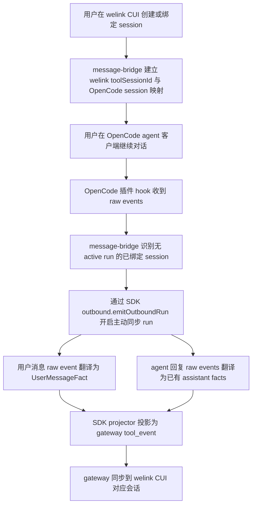
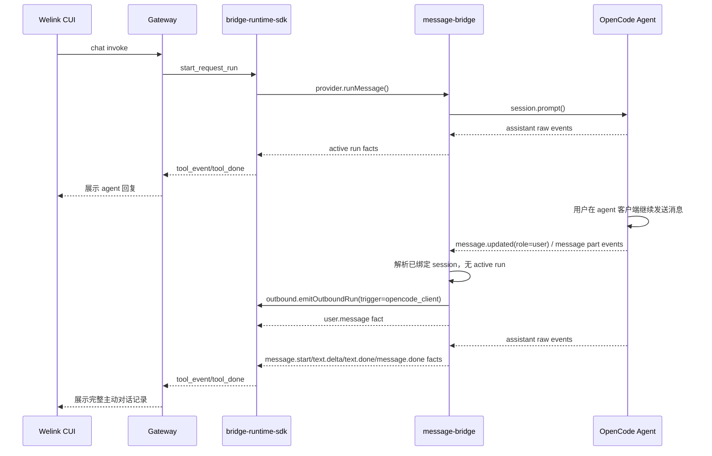
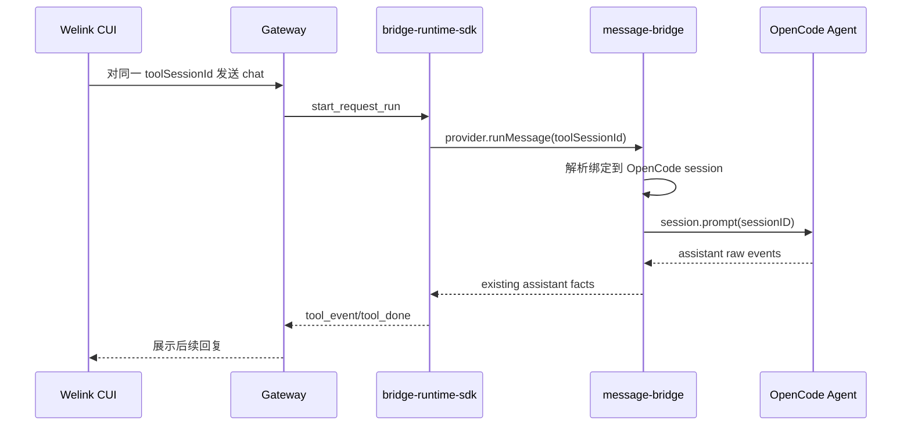

<!-- Parent: ../AGENTS.md -->

# OpenCode Agent 客户端主动对话同步到 Welink CUI 技术方案

**Version:** 0.1
**Date:** 2026-08-05
**Status:** Draft
**Owner:** message-bridge maintainers
**Related:** `../product/prd.md`, `./message-bridge-sdk-migration-solution.md`, `./interfaces/protocol-contract.md`, `../../../docs/architecture/bridge-runtime-sdk-architecture.md`

## In Scope

1. 定义 OpenCode agent 客户端主动继续 welink 创建或绑定 session 时的消息同步方案。
2. 定义 `bridge-runtime-sdk`、`gateway-schema`、`message-bridge` 的推荐调整边界。
3. 记录同一 OpenCode session 双入口并发导致冲突或乱序的遗留问题。

## Out of Scope

1. 不实现 OpenCode 客户端输入拦截或 OpenCode core 调度规则改造。
2. 不改变 welink CUI 发起普通 chat 的现有下行协议。
3. 不承诺本阶段实现同 session 双入口并发下的零丢失缓冲队列。

## External Dependencies

1. welink CUI 需要支持展示新增的用户消息事件。
2. gateway 需要接受并转发新增的 cloud/skill provider event schema。
3. OpenCode raw event 中用户消息正文来源与事件顺序需要进一步确认。

## 1. 背景

### 1.1 场景说明

当前 welink CUI 发起的对话会通过 gateway 下行到 `bridge-runtime-sdk`，再由
`plugins/message-bridge` 调用 OpenCode session 执行。OpenCode agent 回复产生的
`message.updated`、`message.part.delta`、`message.part.updated` 等 raw events 会在 active run
内被翻译成 SDK facts，再同步回 welink CUI。

当用户切到 OpenCode agent 客户端继续同一个由 welink 创建或绑定的 session 主动对话时，这一轮对话不是由 welink 下行触发，
`message-bridge` 当前无法找到 active run，事件会按 `missing_active_run` 丢弃，welink CUI 无法看到 OpenCode 客户端内新增的用户消息和 agent 回复。

### 1.2 需求目标

1. 用户在 OpenCode agent 客户端继续 welink 创建或绑定的 session 时，对话记录实时同步到 welink CUI 对应会话。
2. 同步内容包含用户发送消息和 agent 回复消息。
3. welink CUI 打开会话时，可以看到 agent 客户端产生的完整对话记录。
4. welink CUI 后续仍可继续在同一会话中发起对话。
5. 同步链路复用 SDK 现有 outbound runtime 能力，避免新增私有上行通道。

### 1.3 非目标

1. 不改变 welink 发起对话的现有下行 chat 语义。
2. 不重写 OpenCode session 创建、绑定、隔离策略。
3. 不直接修改 `integration/` 外部夹具或 submodule 指针。
4. 不把 OpenCode raw event 未经 schema 契约直接透传为长期主协议。
5. 本阶段不解决同一 OpenCode session 双入口并发下的完整缓冲、重放和去重能力。

## 2. 方案图

### 2.1 整体方案图



### 2.2 方案核心

将 OpenCode agent 客户端主动对话建模为 SDK `outbound_run`：新增用户消息 fact 表达用户侧消息，agent 回复继续复用现有
`message.start`、`text.delta`、`text.done`、`message.done` facts，由 `message-bridge` 在无 active run 但 session 可路由时调用
`emitOutboundRun()` 主动上行。

## 3. 时序图

### 3.1 `welink 发起对话后 OpenCode 客户端继续当前会话`



### 3.2 `welink CUI 继续该会话`



## 4. 技术细节

### 4.1 调整点

1. `packages/bridge-runtime-sdk`
   - 新增用户消息 fact，例如 `UserMessageFact`。
   - 将 `UserMessageFact` 纳入 `ProviderFact` / `OutboundFact` public contract。
   - 更新 `DefaultFactToSkillEventProjector`，将用户消息 fact 投影为 cloud/skill provider event。
   - 更新 `FactSequenceValidator` 和 `fact-semantics`，定义用户消息 fact 的时序规则。
2. `packages/gateway-schema`
   - 新增 cloud/skill provider event schema，例如 `user.message`。
   - 更新 `skillProviderEventSchema` 白名单。
   - 更新 tool event contract 测试，确保 gateway 接受该事件。
3. `plugins/message-bridge`
   - `OpenCodeProviderAdapter.initialize(context)` 保存 `ProviderRuntimeContext.outbound`。
   - `ProviderEventCoordinator` 增加无 active run 的 outbound 路由。
   - 新增 user message translator，把 OpenCode 用户消息 raw events 翻译成 `UserMessageFact`。
   - 保持 assistant raw events 继续复用现有 translator 和 facts。
   - 通过 session identity resolver / existing binding 找到 welink 对应 `toolSessionId`。
4. 测试
   - SDK public API contract 测试。
   - gateway-schema tool event contract 测试。
   - message-bridge provider adapter 单测。
   - outbound run 集成测试。

### 4.2 核心实现方式

推荐新增 SDK fact：

```ts
export interface UserMessageFact extends ProviderFactBase {
  type: 'user.message';
  messageId: string;
  content: string;
  createdAt?: number;
  raw?: unknown;
}
```

SDK projector 投影为：

```ts
{
  protocol: 'cloud',
  type: 'user.message',
  properties: {
    messageId,
    content,
    createdAt
  }
}
```

`message-bridge` 在 OpenCode raw event 到达时按以下策略处理：

1. 如果存在 active run：沿用当前 active run 路由。
2. 如果不存在 active run，但 raw session 可解析到已绑定 welink session：创建或复用一个短生命周期 outbound run。
3. outbound run 内先输出用户消息 fact，再输出 agent 回复的现有 facts。
4. outbound run 完成后由 SDK 自动发送 terminal signal。

### 4.3 兼容与边界

1. 兼容现有 welink 发起对话
   - welink 发起的用户消息仍由 gateway 下行承载，不额外生成 `user.message`，避免重复展示。
2. 兼容现有 agent 回复 facts
   - `message.start`、`text.delta`、`text.done`、`message.done` 语义不变。
3. 无法解析 session 身份时 fail-closed
   - 不向 welink 发送无法归属的 OpenCode 客户端消息。
   - 记录日志和 diagnostics，不扩大同步范围。
4. 用户消息正文来源待确认
   - 当前 fixture 中 `message.updated(role=user)` 只有 message 元信息，没有正文。
   - 待确认用户正文是否来自 `message.part.updated`、`message.part.delta` 或其他 OpenCode event。
5. 遗留问题：同一 OpenCode session 双入口并发
   - 当 welink CUI 发起的 active run 尚未处理完成时，用户可能同时在 OpenCode agent 客户端主动发送消息。
   - 当前 `message-bridge` 已有 `HostSessionRunCoordinator` 对 welink 触发的 `session.prompt/session.command` 做同一 host session FIFO 调度，但该队列不能阻止 OpenCode 客户端自身已经开始的输入。
   - OpenCode core 或客户端 UI 是否在同一 session 生成中阻止再次输入，当前本仓主路径不能作为可靠前提。
   - 为避免错投和乱序，本阶段建议采用保守策略：同一 host session 存在 active run 或 active outbound 时，不将 OpenCode 客户端主动事件塞入当前 active run；主动同步先按 `session_busy` 丢弃或延后为后续二阶段能力。
   - 完整不丢消息的处理需要新增 session 级 pending outbound queue、事件归组、超时、去重和重放策略，作为后续独立方案评审。

### 4.4 相关接口联动

1. `RuntimeOutboundEmitter.emitOutboundRun(input)`
   - 用于 agent 客户端主动对话同步。
   - `trigger` 建议使用 `opencode_client`。
2. `ThirdPartyAgentProvider.initialize(context)`
   - `message-bridge` 需要保存 `context.outbound`。
3. `ProviderFact` / `OutboundFact`
   - 新增 `UserMessageFact`。
4. `SkillProviderEvent`
   - 新增 `user.message` schema。
5. `OpenCodeProviderAdapter.handleEvent(event)`
   - 增加无 active run 的 outbound 路由能力。
6. `ProviderEventCoordinator`
   - 从“只路由 active run”扩展为“active run + 已绑定 session outbound run”。

### 4.5 文档需要同步修改的内容

1. `packages/bridge-runtime-sdk` public contract 文档或 README。
2. `packages/gateway-schema` tool event contract 文档。
3. `plugins/message-bridge/docs/design/interfaces/protocol-contract.md`。
4. `plugins/message-bridge/docs/design/interfaces/end-to-end-message-flow.md`。
5. `plugins/message-bridge/docs/operations/logging-reference.md`，补充 outbound 同步相关日志。

## 5. 性能

会新增 OpenCode agent 客户端主动对话场景下的 gateway 上行消息，但不新增长期轮询。每条 OpenCode raw event 仍按事件驱动处理，
主要开销为 session 路由解析、fact 翻译和 gateway 发送。

需要注意同一 session 高频流式输出时的 backpressure。推荐复用现有 SDK outbound coordinator 和 gateway sink，不新增独立 WebSocket 或额外连接。

## 6. 功耗

不涉及新增轮询、动画或后台定时任务。

只在 OpenCode 插件 hook 收到事件时触发同步，因此功耗影响较低。

## 7. 埋码

1. `provider_adapter.outbound_run.created`
   - 说明：无 active run 但命中已绑定 session，创建主动同步 outbound run。
2. `provider_adapter.outbound_user_message.translated`
   - 说明：OpenCode 用户消息 raw event 成功翻译为 `user.message` fact。
3. `provider_adapter.outbound_event.dropped`
   - 说明：主动事件因 session 未绑定、正文缺失、协议不完整或 outbound 并发冲突被丢弃。
4. `provider_adapter.outbound_event.session_busy`
   - 说明：同一 OpenCode session 存在 active run 或 active outbound，本阶段未同步该主动事件。
5. `runtime_sdk.fact.received`
   - 说明：SDK 现有 fact observation 需要覆盖 `user.message`。
6. `runtime_sdk.uplink.projected`
   - 说明：SDK 现有 uplink observation 需要覆盖 `user.message` 对应 tool event。

## 8. 影响范围

### 8.1 直接影响

1. `packages/bridge-runtime-sdk` public fact contract。
2. `packages/gateway-schema` cloud/skill provider event schema。
3. `plugins/message-bridge` OpenCode raw event routing 和 translation。
4. gateway 到 welink CUI 的 tool event 展示协议。
5. 相关单测、契约测试、集成测试。

### 8.2 间接影响

1. welink CUI 需要支持展示 `user.message` 事件。
2. 日志脱敏规则需要覆盖用户消息正文，避免在日志 meta 中记录 `content` 原文。
3. 主动 outbound run 与 welink 触发 active run 并发时，需要明确顺序和冲突策略。
4. 子 agent session 映射逻辑可能影响主动事件归属。

### 8.3 不影响

1. OpenCode session 创建接口。
2. welink 发起 chat 的下行协议。
3. 现有 assistant message facts。
4. question / permission reply 路由主键语义。
5. runtime probe、gateway reconnect、二维码认证能力。

## 9. 测试范围

### 9.1 功能测试

1. welink 创建 session 后，OpenCode agent 客户端发送用户消息，welink CUI 收到 `user.message`。
2. OpenCode agent 客户端触发 agent 回复，welink CUI 收到完整 assistant stream。
3. 一轮主动对话包含用户消息和 agent 回复，SDK 发送最终 `tool_done`。
4. 主动同步完成后，welink CUI 继续发送消息，仍路由到同一 OpenCode session。
5. 子 agent session 事件能按现有 `SubagentSessionMapper` 路由到父会话。
6. 同一 host session 存在 active run 时，OpenCode 客户端主动事件不会被错投到当前 active run。

### 9.2 兼容测试

1. welink 发起的普通 chat 不重复展示用户消息。
2. 旧 `emitOutboundMessage()` 行为不受影响。
3. `emitOutboundRun()` 继续支持现有 assistant-only outbound facts。
4. gateway-schema 仍接受原有 cloud events 和 opencode provider events。
5. 无法解析 session 的 OpenCode 客户端事件不会错误同步到 welink。
6. 同 session busy 场景按本阶段保守策略记录 `session_busy`，不产生乱序 tool event。

### 9.3 文档一致性检查

1. public contract 文档与 `ProviderFact` 类型一致。
2. gateway-schema 文档与 `skillProviderEventSchema` 一致。
3. message-bridge 端到端流程文档包含 active run 与 outbound run 两条路径。
4. 日志文档不承诺记录用户消息正文原文。
5. 遗留问题中关于双入口并发的表述与最终实现策略一致。

## 10. 最终建议

最终结论：推荐采用“SDK 新增用户消息 fact + message-bridge 无 active run outbound 路由 + agent 回复复用现有 facts”的方案。

取舍原因：该方案复用 `bridge-runtime-sdk` 已有 `emitOutboundRun()`、fact sequence、projector、gateway sink 和 observation 能力，
协议边界清晰，长期可维护；相比 message-bridge 私自透传 OpenCode raw event，它更符合当前仓库的 public contract 和 schema 真源约束。

遗留问题：同一 OpenCode session 下，OpenCode agent 客户端主动发消息与 welink CUI 发消息同时发生时，可能出现冲突或时序乱序。
本阶段建议只保证“不乱序、不错投”：当同 session 存在 active run 或 active outbound 时，主动同步按 `session_busy` 保守丢弃或延后到后续方案处理。
完整“不丢消息”的缓冲队列、事件归组、去重和重放能力应作为二阶段独立方案。

后续动作：

1. 确认 OpenCode 用户消息正文的 raw event 来源和事件顺序。
2. 设计 `UserMessageFact` 与 `user.message` gateway event schema。
3. 明确 `session_busy` 的产品表现：静默日志、welink 可见提示，或仅 diagnostics。
4. 补 SDK、gateway-schema、message-bridge 三层契约测试。
5. 实现 message-bridge outbound run 路由和用户消息 translator。
6. 联调 welink CUI 展示 `user.message`。
