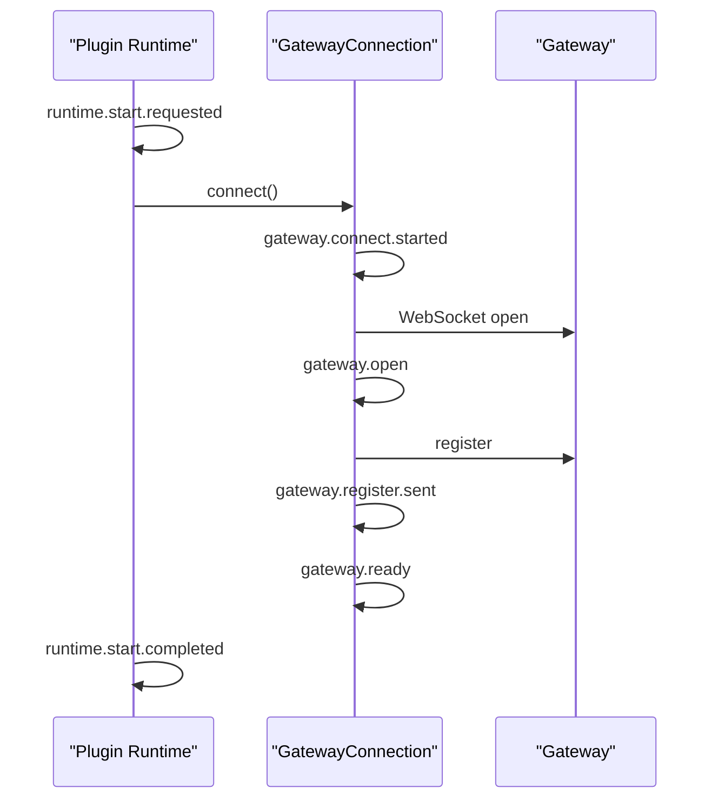
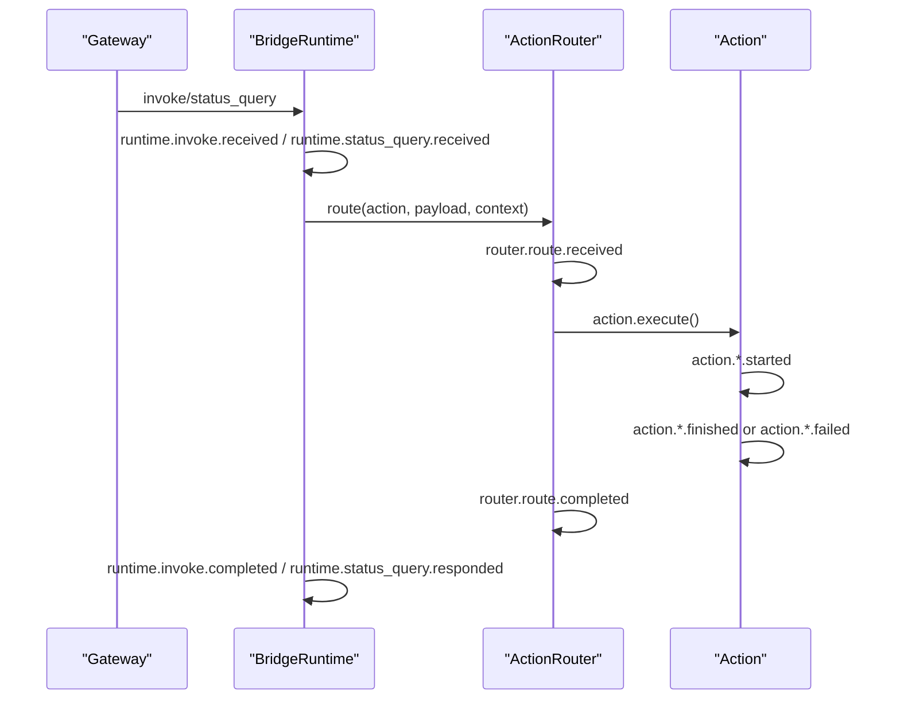
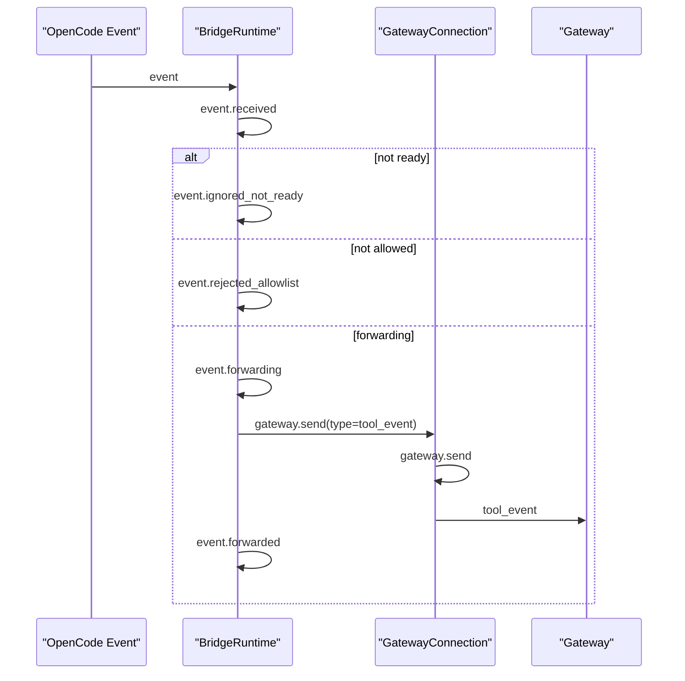
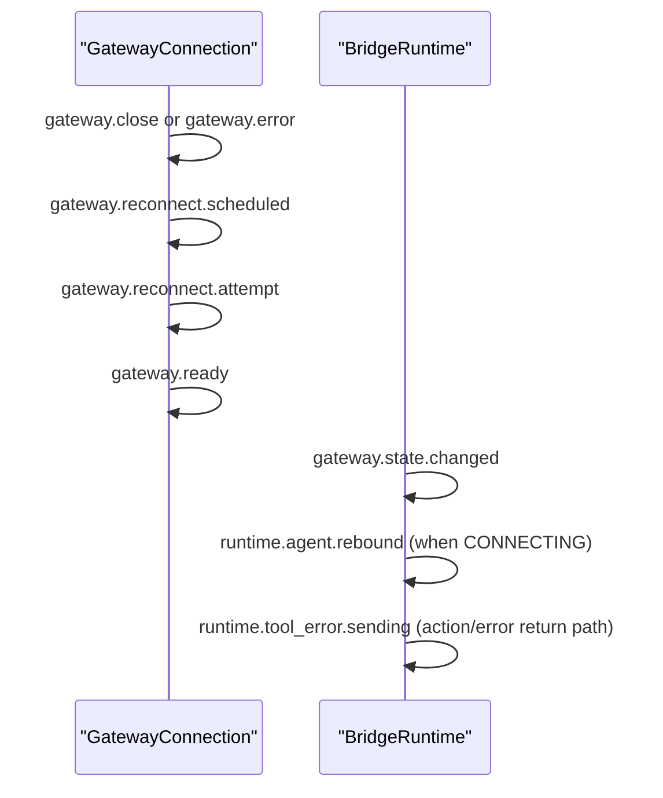

# message-bridge 日志可观测性手册

**Version:** 1.0  
**Date:** 2026-03-07  
**Status:** Active  
**Owner:** message-bridge maintainers  
**Related:** `../../README.md`, `../README.md`, `../../src/runtime/AppLogger.ts`

## 1. 日志总览

- 上报通道：OpenCode 插件注入客户端 `input.client.app.log()`
- 固定服务名：`service=message-bridge`
- 日志级别：
  - `debug`：调试细节、链路状态、低风险诊断信息
  - `info`：关键生命周期与正常完成路径
  - `warn`：可恢复异常、前置条件不满足、降级路径
  - `error`：执行失败、异常、需要重点排查的问题
- 失败策略：日志上报失败不阻断业务链路（best effort）

补充说明：

- `debug` 默认关闭
- 当 `debug=true` 时，连接层会额外输出原始 WebSocket 报文
- 这些原始报文日志固定使用 `info` 级别，避免依赖宿主 `debug` 级过滤后丢失

## 2. 字段字典

`client.app.log()` 请求体（`body`）：

| 字段 | 类型 | 说明 |
|---|---|---|
| `service` | `string` | 固定为 `message-bridge` |
| `level` | `'debug' \| 'info' \| 'warn' \| 'error'` | 日志级别 |
| `message` | `string` | 事件名（如 `gateway.ready`） |
| `extra` | `Record<string, unknown>` | 链路上下文（敏感字段已脱敏） |

`extra` 生成规则（`src/runtime/AppLogger.ts`）：

| 场景 | 行为 |
|---|---|
| 默认（`BRIDGE_DEBUG` 未开启） | 输出脱敏后的完整字段 |
| `BRIDGE_DEBUG=true` | 不改变 `extra` 内容；除了 fallback / send-failed 的 `console.debug` 提示外，还会在连接层额外输出 `info` 级原始 WebSocket 报文 |
| 脱敏键 | key 包含 `ak/sk/token/authorization/cookie/secret/password` 时值替换为 `***` |
| 无 `client.app.log` 能力 | 不抛错；仅在 `BRIDGE_DEBUG=true` 时 `console.debug` 提示 `log-fallback` |
| `client.app.log` 抛错 | 吞错不影响主流程；仅在 `BRIDGE_DEBUG=true` 时 `console.debug` 提示 `log-send-failed` |

常见上下文字段（按链路出现）：

| 字段 | 说明 |
|---|---|
| `traceId` | 消息级追踪 ID；上行优先取 `bridgeMessageId`，下行优先取 `gatewayMessageId`，无消息上下文时退化为 runtime 级 ID |
| `runtimeTraceId` | 同一 `AppLogger` 生命周期内稳定不变的 runtime 级追踪 ID |
| `component` | 组件标识（如 `runtime`/`gateway`/`singleton`） |
| `state` | 连接状态（`DISCONNECTED/CONNECTING/CONNECTED/READY`） |
| `errorDetail` | 统一错误提取后的明细消息 |
| `errorName` | 底层错误名（如 `Error`/`TypeError`） |
| `sourceErrorCode` | 底层错误对象里的 `code` 字段 |
| `errorType` | 错误或事件类型（如 `Error` / `error`） |
| `sessionId` | 会话 ID（若可提取） |
| `toolSessionId` | OpenCode / SDK 侧 session ID |
| `agentId` | agent 标识，重连后可能重新绑定 |
| `action` | 下行调用动作名（chat/create_session/...） |
| `eventType` | OpenCode 事件类型 |
| `bridgeMessageId` | bridge 侧生成的消息追踪 ID；主要用于内部发送上下文，日志中通常直接复用到 `traceId`，不再单独输出 |
| `gatewayMessageId` | gateway 下行消息携带或运行时派生的消息 ID |
| `opencodeMessageId` | OpenCode 事件 message ID |
| `opencodePartId` | OpenCode 事件 part ID |
| `payloadBytes` | 出站 JSON 消息 UTF-8 字节数 |
| `frameBytes` | 入站 WebSocket 帧 UTF-8 字节数 |
| `deltaBytes` | 事件 delta 字段 UTF-8 字节数 |
| `diffCount` | `session.diff` 中 diff 项数量 |
| `latencyMs` | 单次动作耗时 |
| `attempt`/`delayMs` | 重连次数与重连延迟 |

## 3. 关键路径时序图（Mermaid）

### 3.1 连接建立链路

### 3.2 下行 invoke 执行链路

### 3.3 上行 event 链路

### 3.4 异常恢复链路

## 4. 全事件清单（按前缀分组）

说明：同名事件可能在不同组件出现，排障时请优先看“源码位置”区分来源。

### 4.1 runtime.*

| message | level | 触发时机 | 关键 extra | 源码位置 |
|---|---|---|---|---|
| `runtime.start.requested` | info | runtime 启动入口 | `workspacePath` | `src/runtime/BridgeRuntime.ts:54` |
| `runtime.start.skipped_already_started` | debug | 重复 start 被跳过 | - | `src/runtime/BridgeRuntime.ts:56` |
| `runtime.start.aborted_precheck` | warn | start 前检测到 abort | - | `src/runtime/BridgeRuntime.ts:61` |
| `runtime.start.disabled_by_config` | info | `config.enabled=false` | - | `src/runtime/BridgeRuntime.ts:67` |
| `runtime.start.failed_capabilities` | error | 启动前发现 SDK action 能力不完整 | `errorCode`,`errorMessage`,`missingCapabilities` | `src/runtime/BridgeRuntime.ts` |
| `runtime.start.failed_health` | error | 启动前 `global.health()` 或 raw `/global/health` 探活失败 | `errorCode`,`errorMessage`,`missingCapability?`,`cause?` | `src/runtime/BridgeRuntime.ts` |
| `runtime.start.failed_health_version` | error | 启动前 `global.health()` 或 raw `/global/health` 未返回可用 version | `errorCode`,`errorMessage`,`responseShape?` | `src/runtime/BridgeRuntime.ts` |
| `runtime.agent.rebound` | info | 连接状态转 `CONNECTING` 后重置 agentId | `agentId` | `src/runtime/BridgeRuntime.ts:103` |
| `runtime.downstream_message_error` | error | 下行消息处理抛错 | `error`,`errorDetail`,`errorName`,`sourceErrorCode?` | `src/runtime/BridgeRuntime.ts:114` |
| `runtime.start.aborted_before_connect` | warn | connect 前中止 | - | `src/runtime/BridgeRuntime.ts:124` |
| `runtime.start.aborted_after_connect` | warn | connect 后中止 | - | `src/runtime/BridgeRuntime.ts:132` |
| `runtime.start.completed` | info | 启动完成 | `agentId` | `src/runtime/BridgeRuntime.ts:137` |
| `runtime.stop.requested` | info | stop 入口 | - | `src/runtime/BridgeRuntime.ts:141` |
| `runtime.stop.completed` | info | stop 完成 | - | `src/runtime/BridgeRuntime.ts:148` |
| `runtime.downstream_ignored_no_connection` | warn | 下行处理时无连接 | - | `src/runtime/BridgeRuntime.ts:198` |
| `runtime.status_query.received` | info | 收到 status_query | `traceId`,`runtimeTraceId`,`gatewayMessageId`,`sessionId` | `src/runtime/BridgeRuntime.ts` |
| `runtime.status_query.responded` | info | status_response 已发送 | `traceId`,`runtimeTraceId`,`gatewayMessageId`,`sessionId`,`latencyMs` | `src/runtime/BridgeRuntime.ts` |
| `runtime.invoke.received` | info | 收到 invoke | `traceId`,`runtimeTraceId`,`gatewayMessageId`,`action`,`sessionId`,`toolSessionId` | `src/runtime/BridgeRuntime.ts` |
| `runtime.invoke.completed` | info | invoke 成功完成（包括 `create_session` 回包后） | `traceId`,`runtimeTraceId`,`gatewayMessageId`,`action`,`sessionId`,`toolSessionId`,`latencyMs` | `src/runtime/BridgeRuntime.ts` |
| `runtime.tool_error.skipped_no_connection` | warn | 需回传 tool_error 但无连接 | `sessionId` | `src/runtime/BridgeRuntime.ts:317` |
| `runtime.tool_error.sending` | error | 发送 tool_error 前记录 | `traceId`,`runtimeTraceId`,`gatewayMessageId`,`sessionId`,`action`,`error` | `src/runtime/BridgeRuntime.ts` |
| `runtime.singleton.reuse_existing` | debug | 复用已存在 runtime | - | `src/runtime/singleton.ts:13` |
| `runtime.singleton.await_initializing` | debug | 等待初始化中的 runtime | - | `src/runtime/singleton.ts:18` |
| `runtime.singleton.initialization_cancelled` | warn | 初始化过程被取消 | - | `src/runtime/singleton.ts:34` |
| `runtime.singleton.initialized` | info | singleton 初始化完成 | - | `src/runtime/singleton.ts:38` |
| `runtime.singleton.initialization_failed` | error | singleton 初始化失败 | `error`,`errorDetail`,`errorName`,`sourceErrorCode?` | `src/runtime/singleton.ts:43` |

### 4.2 gateway.*

| message | level | 触发时机 | 关键 extra | 源码位置 |
|---|---|---|---|---|
| `gateway.connect.started` | info | 开始 connect | `url`,`state` | `src/connection/GatewayConnection.ts:48` |
| `gateway.connect.aborted_precheck` | warn | connect 前检测 abort | - | `src/connection/GatewayConnection.ts:52` |
| `gateway.connect.aborted` | warn | connect 过程中收到 abort | - | `src/connection/GatewayConnection.ts:88` |
| `gateway.open` | info | WebSocket onopen | - | `src/connection/GatewayConnection.ts:115` |
| `gateway.register.sent` | info | register 消息发送后 | `toolType`,`toolVersion` | `src/connection/GatewayConnection.ts:119` |
| `gateway.ready` | info | 状态切到 READY | - | `src/connection/GatewayConnection.ts:124` |
| `gateway.close` | warn | WebSocket onclose | `opened`,`manuallyDisconnected`,`aborted`,`lastMessageDirection`,`lastMessageType`,`lastMessageId`,`lastPayloadBytes`,`lastEventType`,`lastOpencodeMessageId` | `src/connection/GatewayConnection.ts` |
| `gateway.error` | error | WebSocket onerror | `error`,`errorDetail`,`errorName?`,`errorType?`,`eventType?`,`readyState?` | `src/connection/GatewayConnection.ts:148` |
| `gateway.connect.failed` | error | connect 抛异常（URL/构造等） | `error`,`errorDetail`,`errorName?`,`sourceErrorCode?` | `src/connection/GatewayConnection.ts:162` |
| `gateway.disconnect.requested` | info | 主动 disconnect | `state` | `src/connection/GatewayConnection.ts:171` |
| `gateway.send.rejected_not_connected` | warn | 非连接态发送消息 | - | `src/connection/GatewayConnection.ts:190` |
| `gateway.send` | debug | send 前记录消息类型与大小 | `traceId`,`runtimeTraceId`,`messageType`,`payloadBytes`,`gatewayMessageId`,`eventType`,`action`,`opencodeMessageId`,`opencodePartId` | `src/connection/GatewayConnection.ts` |
| `「sendMessage」===>「...」` | info | `debug=true` 时输出原始出站 WebSocket 报文 | 原始 JSON 文本 | `src/connection/GatewayConnection.ts` |
| `gateway.heartbeat.sent` | debug | 心跳发送 | - | `src/connection/GatewayConnection.ts:225` |
| `gateway.reconnect.scheduled` | warn | 安排重连 | `attempt`,`delayMs` | `src/connection/GatewayConnection.ts:250` |
| `gateway.reconnect.attempt` | info | 执行一次重连 | `attempt` | `src/connection/GatewayConnection.ts:261` |
| `gateway.message.received` | debug | 连接层解析到 JSON 消息 | `messageType`,`frameBytes`,`gatewayMessageId` | `src/connection/GatewayConnection.ts` |
| `「onOpen」===>「...」` | info | `debug=true` 时输出 WebSocket `onopen` 原始事件摘要 | 原始事件摘要 | `src/connection/GatewayConnection.ts` |
| `「onMessage」===>「...」` | info | `debug=true` 时输出原始入站 WebSocket 报文 | 原始帧文本或二进制摘要 | `src/connection/GatewayConnection.ts` |
| `「onError」===>「...」` | info | `debug=true` 时输出 WebSocket `onerror` 原始事件摘要 | 原始错误事件摘要 | `src/connection/GatewayConnection.ts` |
| `gateway.message.ignored_non_json` | debug | 收到非 JSON 消息被忽略 | `payloadLength`,`frameBytes` | `src/connection/GatewayConnection.ts` |
| `gateway.state.changed` | info | runtime 监听到连接状态变化 | `state` | `src/runtime/BridgeRuntime.ts:99` |
| `gateway.message.received` | debug | runtime 收到下行消息入口 | `traceId`,`runtimeTraceId`,`messageType`,`gatewayMessageId`,`action`,`sessionId`,`toolSessionId` | `src/runtime/BridgeRuntime.ts` |

### 4.3 event.*

| message | level | 触发时机 | 关键 extra | 源码位置 |
|---|---|---|---|---|
| `event.received` | debug | runtime handleEvent 收到事件 | `traceId`,`runtimeTraceId`,`eventType`,`toolSessionId`,`opencodeMessageId`,`opencodePartId`,`partType`,`deltaBytes`,`diffCount` | `src/runtime/BridgeRuntime.ts` |
| `event.ignored_not_ready` | debug | runtime 未就绪时忽略事件 | `traceId`,`runtimeTraceId`,`eventType`,`toolSessionId`,`opencodeMessageId`,`opencodePartId`,`state` | `src/runtime/BridgeRuntime.ts` |
| `event.rejected_allowlist` | warn | runtime allowlist 拒绝事件 | `traceId`,`runtimeTraceId`,`eventType`,`toolSessionId`,`opencodeMessageId`,`opencodePartId` | `src/runtime/BridgeRuntime.ts` |
| `event.forwarding` | info | runtime 上行发送前 | `traceId`,`runtimeTraceId`,`eventType`,`sessionId`,`toolSessionId`,`opencodeMessageId`,`opencodePartId` | `src/runtime/BridgeRuntime.ts` |
| `event.forwarded` | debug | runtime 上行发送后 | `traceId`,`runtimeTraceId`,`eventType`,`sessionId`,`toolSessionId`,`opencodeMessageId`,`opencodePartId` | `src/runtime/BridgeRuntime.ts` |

### 4.4 compat.*

| message | level | 触发时机 | 关键 extra | 源码位置 |
|---|---|---|---|---|
| `compat.tool_done.sent` | info | compat 层发送 `tool_done` | `traceId`,`runtimeTraceId`,`toolSessionId`,`action`,`source` | `src/runtime/compat/ToolDoneCompat.ts` |
| `compat.tool_done.skipped_duplicate` | debug | compat 层抑制重复 `tool_done` | `traceId`,`runtimeTraceId`,`toolSessionId`,`action`,`source` | `src/runtime/compat/ToolDoneCompat.ts` |
| `compat.tool_done.fallback_from_idle` | info | `session.idle` 触发兜底 `tool_done` | `traceId`,`runtimeTraceId`,`toolSessionId`,`source` | `src/runtime/compat/ToolDoneCompat.ts` |

### 4.5 router.*

| message | level | 触发时机 | 关键 extra | 源码位置 |
|---|---|---|---|---|
| `router.route.received` | info | 收到 action 路由请求 | `action`,`sessionId` | `src/action/ActionRouter.ts:23` |
| `router.route.failed_registry_missing` | error | registry 未设置 | `action` | `src/action/ActionRouter.ts:30` |
| `router.route.unsupported_action` | warn | action 未注册 | `action` | `src/action/ActionRouter.ts:40` |
| `router.route.invalid_payload` | warn | action 参数校验失败 | `action`,`error` | `src/action/ActionRouter.ts:50` |
| `router.route.completed` | info | action 执行完成 | `action`,`success`,`errorCode?` | `src/action/ActionRouter.ts:62` |

### 4.6 action.*

| message | level | 触发时机 | 关键 extra | 源码位置 |
|---|---|---|---|---|
| `action.chat.started` | info | chat action 开始 | `sessionId`,`messageLength` | `src/action/ChatAction.ts:57` |
| `action.chat.rejected_state` | warn | 连接态不允许执行 chat | `state` | `src/action/ChatAction.ts:62` |
| `action.chat.sdk_error_payload` | error | SDK 返回 error payload | `error` | `src/action/ChatAction.ts:110` |
| `action.chat.failed` | error | chat 失败（可映射 code） | `error`,`errorCode?` | `src/action/ChatAction.ts:126` |
| `action.chat.exception` | error | chat 执行抛异常 | `error`,`errorCode?` | `src/action/ChatAction.ts:139` |
| `action.chat.finished` | debug | chat 结束（finally） | `latencyMs` | `src/action/ChatAction.ts:151` |
| `action.create_session.started` | info | create_session 开始 | `requestedSessionId`,`hasMetadata` | `src/action/CreateSessionAction.ts:58` |
| `action.create_session.rejected_state` | warn | 连接态不允许创建会话 | `state` | `src/action/CreateSessionAction.ts:65` |
| `action.create_session.sdk_error_payload` | error | SDK 返回 error payload | `error` | `src/action/CreateSessionAction.ts:132` |
| `action.create_session.failed` | error | create_session 失败 | `error`,`errorCode?` | `src/action/CreateSessionAction.ts:143` |
| `action.create_session.exception` | error | create_session 抛异常 | `error`,`errorCode?` | `src/action/CreateSessionAction.ts:156` |
| `action.create_session.finished` | debug | create_session 结束（finally） | `latencyMs` | `src/action/CreateSessionAction.ts:168` |
| `action.close_session.started` | info | close_session 开始 | `sessionId` | `src/action/CloseSessionAction.ts:50` |
| `action.close_session.rejected_state` | warn | 连接态不允许关闭会话 | `state` | `src/action/CloseSessionAction.ts:56` |
| `action.close_session.sdk_error_payload` | error | SDK 返回 error payload | `error` | `src/action/CloseSessionAction.ts:108` |
| `action.close_session.failed` | error | close_session 失败 | `error`,`errorCode?` | `src/action/CloseSessionAction.ts:119` |
| `action.close_session.exception` | error | close_session 抛异常 | `error`,`errorCode?` | `src/action/CloseSessionAction.ts:132` |
| `action.close_session.finished` | debug | close_session 结束（finally） | `latencyMs` | `src/action/CloseSessionAction.ts:144` |
| `action.permission_reply.started` | info | permission_reply 开始 | `permissionId`,`hasToolSessionId`,`payloadFormat` | `src/action/PermissionReplyAction.ts:99` |
| `action.permission_reply.rejected_state` | warn | 连接态不允许权限回复 | `state` | `src/action/PermissionReplyAction.ts:107` |
| `action.permission_reply.sdk_error_payload` | error | SDK 返回 error payload | `error` | `src/action/PermissionReplyAction.ts:180` |
| `action.permission_reply.failed` | error | permission_reply 失败 | `error`,`errorCode?` | `src/action/PermissionReplyAction.ts:191` |
| `action.permission_reply.exception` | error | permission_reply 抛异常 | `error`,`errorCode?` | `src/action/PermissionReplyAction.ts:204` |
| `action.permission_reply.finished` | debug | permission_reply 结束（finally） | `latencyMs` | `src/action/PermissionReplyAction.ts:216` |
| `action.status_query.started` | debug | status_query 执行开始 | `sessionId`,`state` | `src/action/StatusQueryAction.ts:49` |
| `action.status_query.exception` | error | status_query 抛异常 | `error`,`errorCode?` | `src/action/StatusQueryAction.ts:70` |
| `action.status_query.finished` | debug | status_query 结束（finally） | `latencyMs` | `src/action/StatusQueryAction.ts:82` |

## 5. 排障指引（推荐顺序）

### 5.1 连接失败 / 反复重连

按顺序查：

1. `gateway.connect.started`
2. `gateway.open`
3. `gateway.register.sent`
4. `gateway.ready`
5. `gateway.close` / `gateway.error`
6. `gateway.reconnect.scheduled` / `gateway.reconnect.attempt`

若没有 `gateway.open`，优先检查网关地址、AK/SK 签名参数与网络可达性。

### 5.2 路由未命中或参数错误

按顺序查：

1. `runtime.invoke.received`
2. `router.route.received`
3. `router.route.unsupported_action` 或 `router.route.invalid_payload`
4. `runtime.invoke.completed`（`success=false`，关注 `errorCode`）

### 5.3 Action 执行失败

按顺序查：

1. `action.<name>.started`
2. `action.<name>.sdk_error_payload` / `action.<name>.failed` / `action.<name>.exception`
3. `router.route.completed`
4. `runtime.invoke.completed`

重点查看 `error`、`errorDetail`、`errorName`、`sourceErrorCode`、`errorCode`、`latencyMs`。

### 5.4 tool_error 回传失败

按顺序查：

1. `runtime.tool_error.sending`
2. `gateway.send` 或 `gateway.send.rejected_not_connected`
3. `runtime.tool_error.skipped_no_connection`

## 6. 快速检索建议

- 按事件名前缀：`runtime.*` / `gateway.*` / `router.*` / `action.*`
- 按会话：筛 `sessionId`
- 按链路：筛 `traceId`
- 按动作：筛 `action`
- 明细调试：默认日志已包含脱敏后的完整 `extra`；启用 `BRIDGE_DEBUG=true` 可额外查看 fallback / send-failed 调试提示
